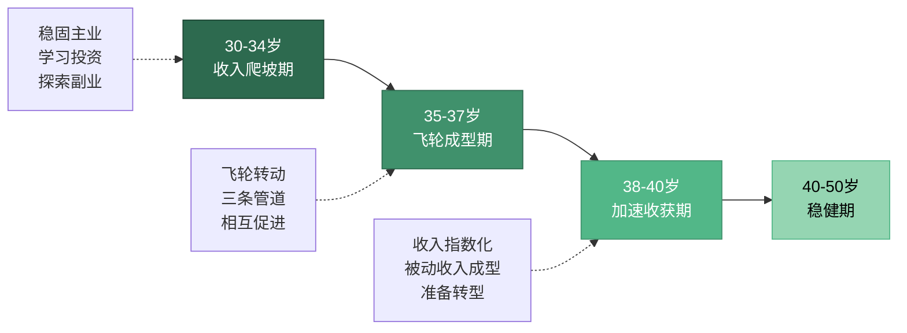
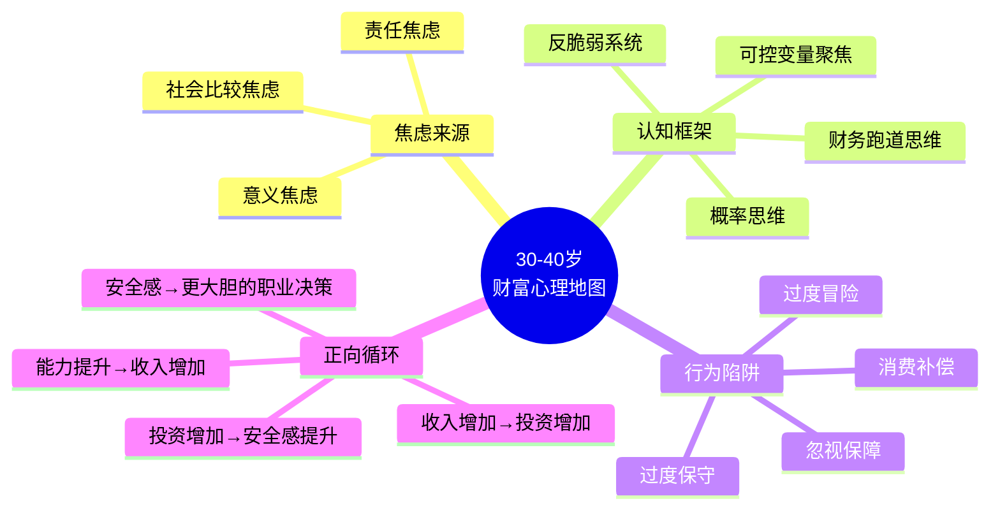

# 第18章 30-40岁：加速期

## 为什么30-40岁是财富加速的关键十年？

30岁到40岁，是人生中**最具爆发力**的财富积累阶段。这并非鸡汤式的鼓吹，而是由经济学数据、职业发展研究和资产增长模型共同支撑的客观判断。

美国劳工统计局（BLS）的收入数据显示，美国劳动者在35-44岁年龄段的中位收入是25-34岁的1.5倍。中国的情况类似——根据国家统计局数据，2023年城镇非私营单位就业人员中，具有10-15年工作经验（对应约32-37岁）的群体，其平均工资是应届毕业生的2.2-2.8倍。**收入的加速度在这个阶段达到峰值**。

但收入高不等于财富多。30-40岁真正的战略意义在于：你同时拥有**三条加速通道**——收入进入快速增长期、投资本金积累到"复利真正发力"的临界点、职业角色从执行者向决策者跃迁的机会窗口。这三条通道如果同时打开，财富增长将从线性变为指数；如果错过，你在40-50岁将面临"追不上"的困境。

### 30-40岁与前后十年的本质区别

要理解这十年的独特性，最有效的方法是与前后两个阶段进行对比：

| 维度 | 20-30岁（积累期） | 30-40岁（加速期） | 40-50岁（稳健期） |
|:---:|:---:|:---:|:---:|
| **收入特征** | 低基数、线性增长 | 高增速、指数化可能 | 高基数、增速放缓 |
| **核心任务** | 打基础、找方向 | 集中突破、构建飞轮 | 守成果、规划传承 |
| **投资策略** | 高权益、小本金 | 攻守兼备、本金充实 | 稳健优先、保全导向 |
| **风险承受** | 高（时间换空间） | 中高（仍有回旋余地） | 中低（恢复周期变长） |
| **试错成本** | 低（失败可重来） | 中等（有家庭责任） | 高（牵一发动全身） |
| **职业角色** | 执行者、学习者 | 管理者/专家/创业者 | 领导者/决策者 |
| **家庭状态** | 多为单身或新婚 | 建房育儿、上有老下有小 | 子女教育关键期、父母高龄 |
| **心理状态** | 探索、迷茫 | 焦虑与动力并存 | 从容或倦怠 |

从表中可以看出，30-40岁是**唯一的"高增速+中等试错成本"组合**。20-30岁试错成本低但收入基数也低；40-50岁收入基数高但试错成本和恢复周期都大幅上升。只有30-40岁，你既有足够的能力和资源去"做大"，又有足够的时间和空间去"承受风险"。

### 十年分三段：30-34岁、35-37岁、38-40岁

这十年不是铁板一块，可以清晰地划分为三个阶段，每个阶段的核心策略截然不同：

**30-34岁——收入爬坡期**

这是从"积累期"向"加速期"过渡的阶段。你的专业能力已经成熟，开始获得更大的项目和更高的职位。核心任务是：稳固主业收入增长势头，开始系统性地学习投资，启动第一份副业探索。

**35-37岁——飞轮成型期**

这是加速期的"黄金三年"。你的收入通常已经翻倍，投资体系初步成型，副业开始产生可见的回报。核心任务是：让收入飞轮真正转起来——主业、副业、投资三条管道相互促进，形成正向循环。

**38-40岁——加速收获期**

这是加速期的"收割阶段"。多年积累的能力、人脉、品牌开始集中变现。核心任务是：最大化这个窗口期的收益，同时为40-50岁的"稳健期"做好转型准备——调整资产配置，降低风险敞口，建立长期可持续的被动收入体系。

## 本章核心观点

### 核心观点一：收入加速——从线性增长到指数增长

在20多岁时，你的收入增长主要靠跳槽和加薪，是线性的——每年涨10-20%，本质上还是在"卖时间"。但到了30-40岁，你应该开始构建**"收入飞轮"**——通过投资、副业、资产配置等多条收入管道，让财富增长从线性转向指数。

这个阶段的核心任务是：**在主业收入高峰期，同步建立被动收入体系**。

为什么叫"飞轮"？因为一旦系统运转起来，各部分会相互加速：主业收入提供投资本金→投资收益增加财务安全感→财务安全感让你敢于在主业上做更大胆的决策（比如接受股权激励而非纯现金）→更好的决策带来更高的主业收入。这个正向循环一旦建立，财富增长的速度会远超你的想象。

收入飞轮的数学本质是**多变量指数函数**。单一收入来源的增长近似线性（每年固定涨幅），但三条收入管道的叠加效果是乘法关系。假设主业年增长12%、副业年增长30%（从零起步的副业初期增速可以很高）、投资年化收益8%，那么你的总收入增速不是简单的加权平均，而是三条曲线的叠加——在副业从0到有、投资本金从小到大的过程中，整体增速会呈现明显的指数特征。

### 核心观点二：资产配置——从存钱到让钱生钱

30岁之前，你可能还在还房贷、还车贷，积蓄有限，"投资"更多是定投几百元的指数基金练手。但到了30-40岁，随着收入提升和负债结构优化，你开始有**真正的可投资资金**——月度结余可能从2000元变成1-2万元，年度可投资金额可能达到10-30万元。

这个阶段需要学会科学的资产配置——不是把钱全部存银行（会被通胀吞噬），也不是全部押注股票（一次暴跌可能让你心理崩溃），而是建立一个**攻守兼备的投资组合**。

资产配置的核心逻辑是**相关性对冲**：不同资产类别在不同经济环境下的表现是负相关的。股票在经济扩张期表现好，债券在衰退期表现好，黄金在通胀期表现好，现金在危机期最有价值。通过合理配置这些资产，你可以在任何经济环境下都保持正收益——不是每一年都赚钱，而是每个经济周期都赚钱。

30-40岁的资产配置应该遵循"100法则"的变体：**权益类资产比例 = 100 - 年龄 - 家庭负债系数**。如果你35岁，有房贷但收入稳定，权益比例约60%；如果你35岁，无房贷且有副业收入，权益比例可以到70%。

### 核心观点三：事业突破——从执行者到决策者

30-40岁是职业发展的**分水岭**。你要么成为公司的核心管理层，要么成为行业内的专家级人才，要么开始自己的创业之路。无论哪条路径，核心都是从"卖时间"转向"卖价值"——你的收入不再取决于你工作多少小时，而是取决于你能创造多大的价值。

职业发展的这个转折点，可以用**能力变现模型**来理解：

| 变现层级 | 收入模式 | 核心能力 | 年收入量级 |
|:---:|:---:|:---:|:---:|
| L1 执行层 | 卖时间 | 专业技能 | 15-40万 |
| L2 管理层 | 卖团队产出 | 领导力+业务理解 | 40-100万 |
| L3 专家层 | 卖判断力 | 行业洞察+方法论 | 60-200万 |
| L4 决策层 | 卖资源整合能力 | 战略思维+人脉网络 | 100万-无上限 |
| L5 创业/合伙 | 卖企业价值 | 商业模式+团队管理 | 取决于企业规模 |

30-40岁的核心任务是：**至少从L1跃迁到L2或L3**。如果你在40岁时仍然停留在L1——纯执行层，那么你的职业风险将急剧上升，因为更年轻的L1执行者薪资要求更低、精力更充沛。

跃迁的关键不是"更努力"，而是**改变价值创造的方式**。L1创造价值的方式是"亲自干活"，L2创造价值的方式是"让团队高效干活"，L3创造价值的方式是"定义正确的事"。你需要学会从"做得好"转向"想得对"和"带得动"。

### 核心观点四：家庭财务——从个人到家庭的系统化管理

这个阶段，大多数人会面临结婚、买房、生子等重大人生事件。家庭财务不再是简单的收支管理，而是需要**系统化的规划**——包括家庭保障体系、子女教育基金、父母养老储备等。你需要从"个人理财"升级为"家庭CFO"。

"家庭CFO"不是比喻，而是一个真实的管理角色。一家公司的CFO需要做三件事：现金流管理、风险控制、资本配置。家庭财务管理也是这三件事：

- **现金流管理**：确保家庭收入大于支出，建立合理的消费结构
- **风险控制**：通过保险和应急基金，确保任何单一风险不会摧毁家庭财务
- **资本配置**：将家庭结余分配到不同的投资工具中，实现长期增值

很多30多岁的人犯的最大错误是：**只做投资（资本配置），不做现金流管理和风险控制**。他们把钱投入股市或基金，却没有建立应急基金，没有购买足够的保险。一旦遇到失业或疾病，他们不得不在最差的时机卖出投资——这比不投资更糟糕。

### 核心观点五：风险管理——从忽视到重视

30多岁的人往往觉得自己还年轻，不需要太多保障。但实际上，这个阶段你承担着**最大的家庭责任**——房贷、车贷、子女教育、父母赡养。一旦出现重大风险（失业、疾病、意外），整个家庭的财务状况可能瞬间崩塌。

风险管理的核心是**识别"不可承受的风险"**。有些风险是可以承受的（比如投资亏损10%，生活不受影响），有些风险是不可承受的（比如主要收入来源突然中断，家庭无法维持基本生活）。你需要把资源集中在防范"不可承受的风险"上。

30-40岁家庭面临的主要风险矩阵：

| 风险类型 | 发生概率 | 影响程度 | 应对策略 |
|:---:|:---:|:---:|:---:|
| 主要收入者失业 | 中 | 高 | 6-12个月应急基金+副业收入 |
| 主要收入者重大疾病 | 低 | 极高 | 重疾险+百万医疗险+定期寿险 |
| 房产价值大幅下跌 | 低 | 中 | 控制房贷杠杆率，不超总资产70% |
| 投资组合重大亏损 | 中 | 中 | 资产配置分散+定期再平衡 |
| 父母突发大额医疗支出 | 中 | 高 | 父母保险+专项养老储备金 |
| 子女教育费用超预期 | 中 | 中 | 教育基金定投+保险储蓄 |
| 婚姻变故导致财产分割 | 低 | 高 | 婚前/婚内财产协议+个人资产保护 |

建立完善的风险管理体系是这个阶段的**必修课**，不是"有钱了再考虑"的选修课。

## 30-40岁的财富心理地图

30-40岁不仅是财务数字的变化，更是心理状态的剧烈转变。理解这些心理变化，才能制定真正有效的财富策略。

### 焦虑的三个来源

**社会比较焦虑**：30岁之后，同学聚会变成了"财富展示会"。有人已经创业成功、有人升到了总监、有人买了第二套房。社交媒体更加剧了这种比较——你看到的永远是别人生活中最光鲜的一面。这种焦虑会导致两种极端行为：要么过度冒险（想"一把翻身"），要么过度保守（觉得"怎么追都追不上"，干脆放弃）。

**责任焦虑**：你不再是"一人吃饱全家不饿"的状态。房贷每月扣款、孩子的奶粉钱和学费、父母的体检和医疗……这些刚性支出让你不敢轻易换工作、不敢创业、不敢承受任何风险。这种焦虑会让你错失这个阶段最宝贵的"高增速窗口"。

**意义焦虑**：30多岁的人开始追问"我到底想要什么样的人生"。你可能已经实现了20多岁时的目标（买房、结婚、升职），但发现并没有想象中的满足感。这种焦虑如果不处理好，会导致消费主义陷阱——用物质消费来填补意义的空虚。

### 克服心理障碍的四个认知框架

**框架一：关注"财务跑道"而非"财务终点"**

不要问"我需要多少钱才能财务自由"（这会让你觉得遥不可及），而要问"如果明天失业，我的财务能撑多久"。这个数字就是你的"财务跑道"。30-40岁的目标是把这条跑道从3个月延长到12个月，再延长到36个月。每延长一步，你的心理安全感就增加一分，你在职业决策上就多一分从容。

**框架二：区分"可控变量"和"不可控变量"**

你无法控制经济周期、行业政策、公司裁员决策，但你可以控制自己的技能提升速度、储蓄率、投资纪律、保险覆盖。把注意力集中在可控变量上，焦虑会大幅减少。

**框架三：用"概率思维"替代"确定性思维"**

不要追求"一定不会出问题"的方案（不存在），而要追求"大概率会成功"的策略。投资中，你不需要每一笔都赚钱，只需要整体期望值为正；职业中，你不需要每次决策都正确，只需要大方向正确。

**框架四：建立"反脆弱"系统**

纳西姆·塔勒布提出的"反脆弱"概念，是30-40岁最好的财富哲学：不要追求"不受伤害"（脆弱的反面），而要追求"从波动中获益"（反脆弱）。具体做法：保持足够的现金储备（在市场暴跌时能抄底）、维持多元收入来源（任何单一来源中断都不致命）、持续学习新技能（让自己的市场价值随时间上升而非下降）。

## 30-40岁的宏观环境与时代机遇

个人财富加速不能脱离时代背景。30-40岁的人正处于职业生涯的"黄金期"，同时也面临着独特的宏观环境。理解这些环境因素，才能把握真正的机遇。

### 中国经济结构转型带来的机遇

中国正在从"投资驱动"转向"创新驱动"，从"世界工厂"转向"内需+科技双引擎"。这个转型期对于30-40岁的人来说，既是挑战也是机遇：

- **传统行业**（地产、基建、传统制造）增速放缓，依赖这些行业的人面临收入天花板
- **新兴行业**（人工智能、新能源、生物科技、半导体）快速崛起，相关人才供不应求
- **消费升级**持续进行，品质消费、健康消费、精神消费领域存在大量创业和就业机会

**关键判断**：如果你在30-40岁期间，仍然停留在一个夕阳行业的执行层，你的收入增速会显著低于平均水平。这个阶段最重要的战略决策之一，是**评估你所在行业的长期趋势**，必要时果断切换赛道。

### 技术变革对职业的冲击

AI和自动化正在重塑就业市场。麦肯锡全球研究院预测，到2030年，全球将有3.75亿人需要转换职业类别。30-40岁的人面临的冲击尤为直接：你的部分技能可能被AI取代，但你积累的行业理解、人脉关系和判断力是AI无法替代的。

**应对策略**：不是与AI竞争（你赢不了），而是**学会与AI协作**。把AI当作你的"超级助手"，用它来放大你的专业能力。一个会用AI的30岁专家，其生产力可能是不会用AI的同行的3-5倍——这个差距会随时间扩大。

### 利率与资产价格环境

30-40岁期间，你需要密切关注利率环境的变化，因为它直接影响你的投资策略和房贷决策：

- **低利率环境**：贷款成本低，有利于加杠杆投资；但固定收益类产品回报低，需要增加权益类配置
- **高利率环境**：贷款成本高，应优先偿还高息负债；但固定收益类产品回报高，可以增加债券配置
- **利率下行期**：适合锁定长期房贷利率，增加长期债券配置
- **利率上行期**：适合持有短期债券和现金，等待更好的投资机会

## 本章学习目标

读完本章，你将能够：

1. **理解30-40岁的战略定位**：明确这十年在人生财富规划中的核心地位，理解收入S曲线、复利发力期和能力变现模型三大底层逻辑。
2. **构建收入飞轮体系**：掌握主业升级、副业启动、投资增长三条收入管道的建设方法，实现从线性增长到指数增长的跨越。
3. **掌握科学的资产配置方法**：学会"核心+卫星"配置法、生命周期配置理论和再平衡策略，让财富实现稳健增长。
4. **实现职业角色跃迁**：了解从执行者到管理者/专家/决策者的关键路径，构建"T型能力结构"和"可迁移能力包"。
5. **建立家庭财务管理体系**：学会编制家庭资产负债表、管理家庭现金流、建立家庭保障体系，从"个人理财"升级为"家庭CFO"。
6. **完善风险保障体系**：识别30-40岁阶段的主要风险，掌握保险配置、应急基金建设和投资风险控制的方法。
7. **克服财富心理障碍**：识别焦虑来源，掌握"财务跑道思维""概率思维""反脆弱"等认知框架，建立健康的财富心态。
8. **制定十年行动路线图**：结合自身情况，制定30-34岁、35-37岁、38-40岁三个阶段的具体目标和行动方案。

## 适合谁读？

本章的目标读者分为四类，每一类都能从本章中获得不同的价值：

**第一类：30-40岁，收入不错但总觉得"钱不够用"的中产阶层**

你的问题不是收入低，而是缺乏系统化的财务管理。本章将教你如何像经营公司一样经营家庭——建立资产负债表、管理现金流、优化资产配置。

**第二类：30-40岁，希望加速财富积累的职场人士**

你已经完成了职业起步期的积累，现在需要的是"加速"。本章将教你如何构建收入飞轮，实现从线性增长到指数增长的跨越。

**第三类：已成家立业，需要系统化管理家庭财务的人**

结婚、买房、生子之后，你面对的不再是简单的收支管理，而是复杂的家庭财务规划。本章将教你如何成为合格的"家庭CFO"。

**第四类：想要从"打工思维"转向"资产思维"的人**

你可能已经意识到，单靠工资收入永远无法实现财务自由。本章将帮你建立"资产思维"——让钱为你工作，而不是你为钱工作。

## 阅读建议

本章内容涵盖收入、投资、事业、家庭、心理等多个维度，建议按顺序阅读。每个小节都配有实战案例和练习方法，建议边读边做笔记，结合自己的实际情况制定行动计划。

**阅读路线图：**

| 阅读顺序 | 小节 | 主题 | 预计阅读时间 | 核心收获 |
|:---:|:---:|------|:---:|----------|
| 1 | 01 理论基础 | 财富加速的底层逻辑 | 40分钟 | 理解收入S曲线、复利效应、资产配置理论 |
| 2 | 02 核心技巧 | 收入加速与投资实战 | 50分钟 | 掌握收入飞轮、定投策略、谈判加薪方法 |
| 3 | 03 实战案例 | 六个真实案例 | 30分钟 | 从他人经验中提炼可复用的模式 |
| 4 | 04 常见误区 | 十大财富陷阱 | 25分钟 | 识别并规避最常见的错误 |
| 5 | 05 练习方法 | 实操工具与模板 | 30分钟 | 制定个人行动计划 |
| 6 | 06 本章小结 | 核心要点与行动清单 | 15分钟 | 巩固所学，启动执行 |

**特别提示**：如果你时间有限，建议优先阅读"02 核心技巧"和"04 常见误区"。前者给你"应该做什么"，后者告诉你"不应该做什么"——两者结合，能让你在最短时间内获得最大的实用价值。

## 本章结构

| 小节 | 主题 | 核心内容 |
|:---:|------|----------|
| 01 | 理论基础 | 复利效应在30-40岁的真正发力机制；收入增长的S曲线理论与拐点识别；资产与负债的核心区别及"伪资产"辨析；收入加速的三大引擎（主业、副业、投资）；核心-卫星资产配置法与生命周期配置理论；家庭财务管理的系统框架（资产负债表、现金流、保障体系）；职业突破的T型人才理论与能力圈模型；心理账户、损失厌恶、锚定效应等行为金融学陷阱；30-40岁的财富加速心理学 |
| 02 | 核心技巧 | 收入加速的五个核心技巧（可迁移能力包、收入飞轮、谈判加薪三步法、副业三圈模型、内容矩阵）；投资实战的五个核心技巧（微笑曲线定投、核心+卫星配置、五维选股法、止损策略、估值方法）；家庭财务管理的五个核心技巧（家庭CFO制度、自动化储蓄、保险配置四步法、教育金规划、养老规划启动）；心理管理的三个核心技巧（情绪日记、决策清单、定期复盘） |
| 03 | 实战案例 | 互联网产品经理如何用5年构建收入飞轮；传统行业销售经理通过行业迁移实现收入翻倍；双职工家庭的"家庭CFO"实践全记录；创业者的财富加速与风险管理平衡；自由职业者的非线性收入管理；从月光族到百万净资产的逆袭之路；六个案例的共同规律提炼 |
| 04 | 常见误区 | "收入高=财务状况好"的认知陷阱；"等有钱了再投资"的时间成本；"全押一只股票"的集中风险；"忽视保险"的侥幸心理；"过度消费"的伪需求制造；"忽视职业发展"的温水煮青蛙；"盲目跟风投资"的从众陷阱；"不做家庭财务规划"的管理缺失；"忽视税务筹划"的隐性成本；"不关注身心健康"的长期代价 |
| 05 | 练习方法 | 个人财务健康诊断表；收入飞轮规划工作表；资产配置方案设计模板；家庭资产负债表编制指南；保险需求分析清单；职业发展五年规划模板；投资决策检查清单；月度财务复盘模板 |
| 06 | 本章小结 | 核心要点回顾；30天行动清单；关键公式速查表；推荐书单与学习资源 |
| 07 | 深度拓展 | 行为金融学在30-40岁阶段的应用；全球化视野下的资产配置；AI时代的职业发展策略；财富传承的早期规划 |

***

> **记住：30-40岁不是"还来得及"的年纪，而是"再不行动就晚了"的关键窗口。** 你现在的每一个财务决策，都将影响未来20年甚至更长时间的生活质量。这个阶段的财富加速，本质上是在四个维度同时发力——收入、资产、保障、能力——形成正向循环。错过了这个窗口，你在40-50岁将面临"追不上"的困境；抓住了这个窗口，你将在40-50岁拥有从容选择的自由。
