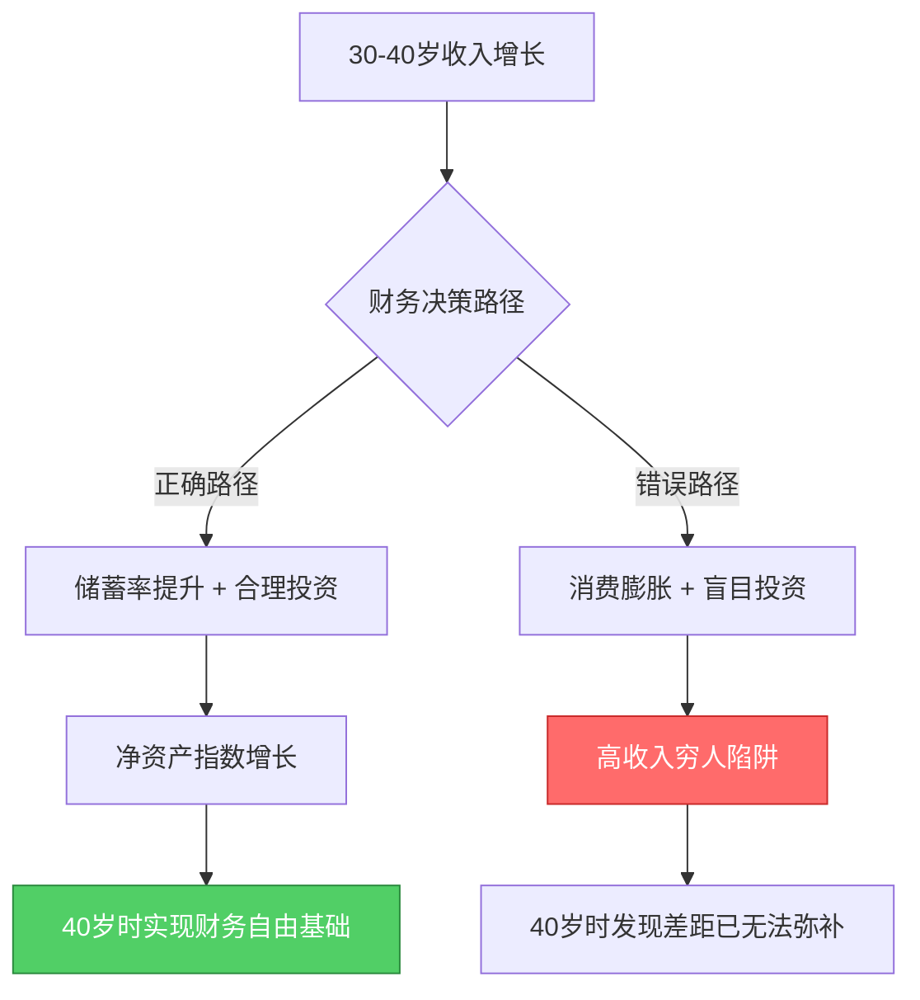
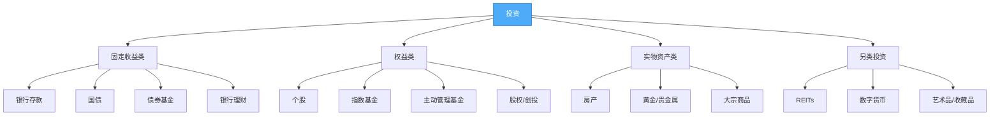

# 第18章 常见误区：30-40岁财富加速的十大陷阱

> **本章导读：** 30-40岁是财富积累的黄金十年，收入增长最快、财务决策最密集，但同时也是最容易犯错的阶段。一个认知误区可能让你浪费5-10年的复利窗口，一个错误决策可能让你倒退数年。本章深度剖析十大常见误区，帮你识别陷阱、建立正确思维框架，避免成为"高收入穷人"。

## 为什么30-40岁是误区高发期

30-40岁的财务决策面临三重困境：

**收入跳跃带来的认知偏差。** 大多数人在这个阶段经历收入快速增长（从月薪1万到月薪3-5万），但财务管理能力并没有同步提升。收入翻倍了，消费也跟着翻倍，净资产增长却停滞不前。心理学上这叫做"生活方式膨胀"（Lifestyle Inflation）——人的消费水平总是追着收入水平跑。

**信息过载导致的决策瘫痪。** 这个年龄的人开始接触大量财务信息——股票、基金、房产、保险、理财课程、自媒体大V的建议——信息越多，反而越不知道该信谁。很多人因此选择"不决策"，把钱放在银行活期里贬值。

**社会压力催生的攀比消费。** 同龄人买房了、换车了、带孩子出国旅游了——社交媒体放大了这种比较效应。很多人在财务上做出非理性决策，不是因为自己需要，而是因为"别人也有"。



研究表明，净资产最高的那10%人群，核心差异不是收入更高，而是**储蓄率更高、投资更早、决策更理性**。美国国家经济研究局（NBER）的数据显示，家庭收入从第50百分位到第90百分位翻了一倍，但净资产翻了不止5倍——差距主要来自财务行为而非收入本身。

---

## 误区一：收入高 = 财务状况好

### 误区的典型表现

- "我年薪50万，财务状况肯定没问题"
- 每个月工资到账后先消费，月底看剩多少
- 只关注收入数字的增长，从不计算净资产
- 收入翻倍后，生活方式也跟着升级——换更大的房子、更好的车

### 这个误区为什么危险

收入是**流量**，净资产是**存量**。一个水管再粗，如果漏得比进的快，水缸永远是空的。

来看一个真实场景：

| 指标 | 张先生（月薪5万） | 李先生（月薪2万） |
|------|------------------|------------------|
| 月收入 | 50,000元 | 20,000元 |
| 月支出 | 42,000元 | 10,000元 |
| 月储蓄 | 8,000元 | 10,000元 |
| 储蓄率 | 16% | 50% |
| 年储蓄 | 96,000元 | 120,000元 |
| 10年后净资产（假设年化8%） | ≈155万 | ≈188万 |

**月薪5万的张先生，10年后的净资产反而不如月薪2万的李先生。** 这不是假设，这是复利数学的必然结果。

### 财务健康的核心指标

真正衡量财务状况的不是收入，而是以下四个指标：

**1. 储蓄率（最重要）**

储蓄率 = （月收入 - 月支出） / 月收入 × 100%

| 储蓄率 | 财务状态 | 备注 |
|--------|---------|------|
| < 10% | 危险区 | 任何意外都可能导致财务危机 |
| 10%-20% | 及格线 | 能积累财富，但速度较慢 |
| 20%-30% | 良好 | 大多数理财书籍推荐的标准 |
| 30%-50% | 优秀 | 加速积累期的推荐目标 |
| > 50% | 极简/高收入 | 需要极强的自律或极高收入 |

**2. 净资产增长率**

净资产增长率 = （年末净资产 - 年初净资产）/ 年初净资产 × 100%

健康的净资产增长率应不低于15%/年（包含投资收益）。如果你的收入在涨，但净资产没涨，说明你在"漏钱"。

**3. 流动性比率**

流动性比率 = 流动资产 / 月支出

至少保持6个月的紧急储备金。即流动性比率 ≥ 6。

**4. 负债率**

负债率 = 每月还款额 / 月收入 × 100%

健康的负债率应控制在40%以下，最优在30%以下。超过50%意味着你一半以上的收入都在还债，财务弹性极低。

### 如何建立正确的财务体检习惯

**每月5分钟：** 核对本月储蓄率，检查是否达标。

**每季度1小时：** 更新资产负债表，计算净资产变化。

**每年半天：** 全面财务体检——回顾年度收支、投资收益、保险覆盖、税务筹划、目标进度。

实操模板——家庭资产负债表：

```text
┌─────────────────────────────────────────────────────┐
│              家庭资产负债表（模板）                    │
├─────────────────────────────────────────────────────┤
│ 资产项                    │ 金额（元）               │
│ ──────────────────────────│──────────────────────── │
│ 现金及活期存款             │                         │
│ 定期存款/货币基金          │                         │
│ 股票/基金                  │                         │
│ 房产市值                   │                         │
│ 车辆残值                   │                         │
│ 公积金余额                 │                         │
│ 养老金账户                 │                         │
│ 其他资产                   │                         │
│ ──────────────────────────│──────────────────────── │
│ 资产合计                   │                         │
├─────────────────────────────────────────────────────┤
│ 负债项                    │ 金额（元）               │
│ ──────────────────────────│──────────────────────── │
│ 房贷余额                   │                         │
│ 车贷余额                   │                         │
│ 信用卡欠款                 │                         │
│ 其他贷款                   │                         │
│ ──────────────────────────│──────────────────────── │
│ 负债合计                   │                         │
├─────────────────────────────────────────────────────┤
│ 净资产 = 资产 - 负债       │                         │
└─────────────────────────────────────────────────────┘
```

---

## 误区二：等有钱了再投资

### 误区的典型表现

- "等我攒够100万再开始投资"
- "现在钱太少，投资没意义"
- 把所有钱放在银行活期，年化收益不到0.2%
- 觉得投资是有钱人的事

### 复利的残酷真相：时间比金额重要100倍

这个误区的本质是不理解复利的运作方式。复利的核心变量不是本金，而是**时间**。

看两组对比：

**案例A：早投资，少投一点**
- 小王25岁开始，每月定投1000元
- 年化收益8%，持续35年到60岁
- 总投入：1000 × 12 × 35 = 42万元
- 最终金额：约**229万元**

**案例B：晚投资，多投一点**
- 小李35岁才开始，每月定投3000元
- 年化收益8%，持续25年到60岁
- 总投入：3000 × 12 × 25 = 90万元
- 最终金额：约**289万元**

小李投入了小王两倍多的本金，最终金额只多了26%。如果小李也投35年，同样每月3000元，最终金额约**686万**。晚10年开始，即使每月多投2000元，最终仍然少了将近400万。

这就是爱因斯坦所说的"世界第八大奇迹"——复利。但复利需要时间发酵，每晚一年开始，损失的不是一年的收益，而是**那一年收益在未来所有年份的复利增长**。

### "小额无用论"的数学反驳

"500块能干嘛？"——能干的事比你想象的多得多。

| 每月定投 | 年化8%，20年后 | 年化8%，30年后 |
|---------|---------------|---------------|
| 500元 | 29.5万 | 74.6万 |
| 1,000元 | 59.0万 | 149.2万 |
| 2,000元 | 118.0万 | 298.5万 |
| 5,000元 | 295.0万 | 746.3万 |

每月500元，30年后变成74.6万——这就是"小额无用论"的数学反驳。

### 从哪里开始：3000元起步投资方案

如果你是投资新手，每月可投资金额在3000元以内，推荐以下方案：

**第一步（第1-3个月）：建立紧急储备金**
- 将月储蓄的100%放入货币基金（余额宝/零钱通）
- 目标：存满3个月的生活费
- 这一步不追求收益，追求安全感

**第二步（第4-6个月）：开始基金定投**
- 将月储蓄的50%继续存入货币基金（目标6个月紧急储备）
- 将月储蓄的50%开始定投宽基指数基金（沪深300或中证500）
- 每月固定日期自动扣款，不要看盘

**第三步（第7-12个月）：建立投资习惯**
- 紧急储备金存满6个月后，月储蓄100%投入定投
- 开始学习资产配置基础知识
- 尝试了解不同基金类型（债券基金、混合基金等）

**第四步（第2年起）：优化配置**
- 根据风险承受能力调整股债比例
- 考虑增加海外指数基金（标普500/纳斯达克100）
- 开始关注税收优化（个人养老金账户）

### 推荐的入门投资工具

| 工具类型 | 具体产品 | 特点 | 适合人群 |
|---------|---------|------|---------|
| 货币基金 | 余额宝、零钱通 | 年化1.5-2%，随时取用 | 紧急储备金 |
| 宽基指数基金 | 沪深300ETF联接 | 跟踪大盘，分散风险 | 定投入门首选 |
| 中小盘指数 | 中证500ETF联接 | 波动更大，长期收益更高 | 能承受波动的投资者 |
| 海外指数 | 标普500ETF联接 | 分散A股单一市场风险 | 资产全球化配置 |
| 债券基金 | 纯债基金 | 年化3-5%，波动小 | 降低组合波动 |

---

## 误区三：投资 = 炒股

### 误区的典型表现

- 一说投资就想到股票，一说股票就想到炒股
- 每天盯盘4小时以上，上班都没这么认真
- 追涨杀跌，频繁买卖，手续费比收益还高
- 听朋友/自媒体/"大师"的消息炒股

### 为什么大多数人炒股亏钱

这不是观点，而是数据事实。上海证券交易所2019年的统计数据显示：

- **散户整体是亏钱的**：在一轮牛熊周期中，资金量50万以下的散户平均亏损
- 账户盈利的散户不到30%
- 频繁交易者的收益率显著低于长期持有者
- 交易越频繁，亏损越大——这叫"过度交易偏差"

散户亏钱的根本原因不是"运气差"，而是行为金融学中的系统性偏差：

**1. 过度自信偏差**
散户平均高估自己的判断准确率30-40%。"我比市场聪明"是最昂贵的幻觉。

**2. 损失厌恶**
亏损1万元的痛苦感是盈利1万元快乐感的2-2.5倍。这导致散户过早卖出盈利股（怕利润回吐），死拿亏损股（不愿割肉），结果越亏越多。

**3. 羊群效应**
看到别人都在买，自己也跟着买。看到别人都在卖，自己也恐慌卖出。结果高买低卖。

**4. 近因偏差**
最近发生的事对判断的影响过大。刚涨了就觉得"还会涨"，刚跌了就觉得"还会跌"。

**5. 确认偏差**
买了一只股票后，只关注利好消息，自动过滤利空消息。

### 真正的投资是什么

投资的正确定义：**用今天的资金，在可接受的风险范围内，换取未来更多的购买力。**

投资的分类体系：



每种资产的风险收益特征不同：

| 资产类型 | 预期年化收益 | 波动性 | 流动性 | 门槛 | 适合人群 |
|---------|------------|--------|--------|------|---------|
| 货币基金 | 1.5-2% | 极低 | 极高 | 1元 | 所有人 |
| 国债/债券基金 | 3-5% | 低 | 高 | 100元 | 保守型投资者 |
| 银行理财 | 3-4% | 低 | 中 | 1万元 | 保守型投资者 |
| 指数基金定投 | 8-12% | 中 | 高 | 10元 | 大多数人 |
| 主动管理基金 | 6-15% | 中高 | 高 | 1000元 | 有选择能力的投资者 |
| 个股 | -20%~30% | 高 | 高 | 100股 | 有研究能力的投资者 |
| 房产 | 3-8% | 中低 | 低 | 50万+ | 有大额资金的投资者 |
| 黄金 | 5-8% | 中 | 高 | 1克 | 资产配置需要 |

### 普通人最优投资策略：指数基金定投

为什么指数基金定投是大多数人的最优解：

**1. 不需要择时。** 定投自动实现"低点多买、高点少买"的平均成本效应。

**2. 不需要选股。** 买指数就是买国运，只要中国经济长期增长，指数就长期上涨。

**3. 成本极低。** 指数基金管理费0.15-0.5%，远低于主动基金的1-1.5%。

**4. 数据支持。** 巴菲特的十年赌约证明，标普500指数基金跑赢了所有对冲基金组合。在中国市场，过去15年沪深300指数基金跑赢了80%以上的主动基金。

**5. 省时省力。** 每月自动扣款，不需要盯盘，不影响工作和生活。

---

## 误区四：房产是最好的投资

### 误区的典型表现

- "买房肯定不会亏，中国房价永远涨"
- 把所有积蓄甚至借钱付首付
- 觉得买房是唯一的"正经"投资
- 忽视房产的真实持有成本和机会成本

### 中国房产投资的四个阶段

| 阶段 | 时间 | 特征 | 年化涨幅 |
|------|------|------|---------|
| 黄金期 | 2000-2010 | 城镇化加速，供不应求 | 15-20% |
| 白银期 | 2010-2016 | 分化开始，一线强二线弱 | 8-12% |
| 青铜期 | 2016-2021 | 调控加码，棚改货币化退潮 | 3-5% |
| 调整期 | 2021至今 | 多城房价回调，预期转变 | -5%~0% |

过去20年房价上涨的三大驱动力——城镇化（每年2000万人进城）、货币宽松（M2年均增长12%）、土地财政——都在减弱或转向。未来房产更可能是"保值"而非"增值"资产。

### 房产的真实成本计算

很多人只算房价涨了多少，没算持有房产的全部成本。

假设一套房总价300万，首付90万，贷款210万，30年等额本息，利率4.2%：

| 成本项 | 金额（30年累计） | 说明 |
|--------|-----------------|------|
| 贷款利息 | 约160万 | 210万贷款30年利息约160万 |
| 首付资金机会成本 | 约86万 | 90万按年化8%投资30年 |
| 物业费 | 约18万 | 假设月均500元 |
| 维修基金/维修费 | 约10万 | 老房子维修成本更高 |
| 房产折旧 | 约30万 | 房龄越老价值越低 |
| 装修折旧 | 约25万 | 假设50万装修，15年一轮 |
| **持有成本合计** | **约329万** | |

如果30年后房子值600万，扣掉329万成本，真实年化收益约2.3%。这个收益率跑不赢通胀。

当然，自住房有居住价值、安全感价值、学区价值等无法量化的收益，不能纯粹用投资回报率来衡量。**但如果你把买房纯粹当作投资，这笔账并不划算。**

### 房产 vs 其他投资：30年对比

假设初始资金90万（一套房的首付），30年对比：

| 投资方式 | 30年后价值 | 年化收益 | 备注 |
|---------|-----------|---------|------|
| 买房（房价年涨3%） | 219万 | 3% | 不含租金收入，含折旧 |
| 买房（房价年涨5%） | 388万 | 5% | 乐观情况 |
| 沪深300指数基金 | 905万 | 8% | 过去15年年化约10% |
| 标普500指数基金 | 1,072万 | 8.5% | 美元计价 |

**即使房价年涨5%，30年后也不如指数基金。** 但这里没有计算杠杆效应——房贷是普通人能获得的最大杠杆，杠杆放大收益也放大风险。

### 什么时候买房更合理

买房不是绝对好或绝对坏，取决于具体情况：

**更适合买房的情况：**
- 所在城市租售比合理（年租金/房价 > 2.5%）
- 自住刚需，不纯粹为投资
- 有稳定的收入来源，月供不超过收入30%
- 计划长期居住（5年以上）

**更应该租房的情况：**
- 一线城市租售比极低（年租金/房价 < 1.5%）
- 收入不稳定，月供会超过收入40%
- 有明确的迁移计划（工作、创业等）
- 首付会耗尽所有积蓄，没有任何流动性

---

## 误区五：保险是骗人的

### 误区的典型表现

- "保险都是坑人的，赔不了"
- 完全不买任何保险，裸奔
- 买了保险但买错了——全是理财型，没有保障型
- 保额太低，出了事赔的钱杯水车薪

### 保险的真实价值：风险转移工具

保险不是投资工具，而是**风险转移工具**。你每年花几千元保费，把"万一出事倾家荡产"的风险转移给保险公司。

一个残酷的数学题：

> 一个家庭年收入30万，主要收入来源突然确诊癌症。
> - 治疗费用：50-100万（靶向药一个疗程几万到十几万）
> - 收入损失：2-3年无法工作，损失60-90万
> - 康复费用：10-20万
> - **总损失：120-210万**
>
> 如果有50万重疾险 + 200万医疗险：治疗费用覆盖，收入损失有重疾险赔付兜底，家庭不至于崩塌。
> 如果没有保险：卖房、借钱、众筹——整个家庭陷入贫困。

**保险的本质是用确定的小额支出（保费），对冲不确定的巨额损失（风险事件）。**

### 30-40岁必买的四大保险

| 保险类型 | 作用 | 建议保额 | 年保费参考 | 购买顺序 |
|---------|------|---------|-----------|---------|
| 医疗险（百万医疗） | 覆盖大病住院费用 | 200-400万 | 300-800元 | 第1个买 |
| 重疾险 | 确诊即赔，覆盖收入损失 | 年收入×3-5倍 | 3,000-8,000元 | 第2个买 |
| 定期寿险 | 身故赔付，保护家人 | 年收入×10倍 | 1,000-3,000元 | 第3个买 |
| 意外险 | 意外身故/伤残赔付 | 100万 | 100-300元 | 第4个买 |

**30岁男性，四大保险合计年保费约5,000-12,000元**，覆盖了身故、重疾、医疗、意外四大风险。

### 不应该买的保险

| 保险类型 | 为什么不推荐 | 替代方案 |
|---------|-------------|---------|
| 返还型保险 | 保费贵2-3倍，"返还"的钱不如自己投资收益高 | 买消费型保险 + 自己投资 |
| 分红型保险 | 分红不保证，实际收益率通常低于银行定期 | 保障归保障，投资归投资 |
| 万能险 | 结构复杂，实际收益低于宣传，退保损失大 | 简单消费型保险 |
| 教育金保险 | 收益低，流动性差，不如教育基金定投 | 定投指数基金 |
| 两全保险 | 既保身故又保生存，但两项都保不全 | 分别买定期寿险和年金 |

**核心原则：保险姓"保"不姓"投"。保障归保障，投资归投资，不要混在一起。**

### 买保险的正确顺序

1. **先社保，后商保。** 社保是最基础、性价比最高的保障，务必交足。
2. **先大人，后小孩。** 大人才是家庭收入的来源，大人保障了，小孩才有保障。
3. **先保障，后理财。** 买齐四大保障型保险后，再考虑其他。
4. **先保额，后保费。** 保额够不够比保费贵不贵更重要。
5. **先定期，后终身。** 预算有限时，买定期保额可以更高，等收入增长后再补充终身型。

---

## 误区六：副业会影响主业

### 误区的典型表现

- "我工作太忙，没时间做副业"
- "做副业会被公司发现，影响升职"
- 完全依赖单一工资收入
- 觉得"把主业做好就够了"

### 单一收入来源的风险矩阵

30-40岁阶段，你的收入结构决定了你的财务韧性。

| 收入来源数量 | 失业影响 | 行业衰退影响 | 财务韧性评分 |
|------------|---------|-------------|------------|
| 1个（仅工资） | 收入归零 | 可能长期失业 | ★☆☆☆☆ |
| 2个（工资+副业） | 收入减半 | 可转向副业 | ★★★☆☆ |
| 3个+（工资+副业+投资） | 收入部分损失 | 多重缓冲 | ★★★★☆ |
| 被动收入>支出 | 几乎无影响 | 自由选择 | ★★★★★ |

**单一收入来源是最大的财务风险。** 不是"副业会影响主业"，而是"只靠主业才是最大的冒险"。

### 30-40岁适合的副业类型

**与主业协同型（推荐度：★★★★★）**

这类副业不仅不影响主业，反而能提升主业能力：

- **技术咨询/培训：** 程序员做技术顾问，设计师做设计培训
- **自媒体/写作：** 将专业知识输出为文章、课程、视频
- **行业顾问：** 利用行业经验为企业提供咨询服务
- **接私活：** 设计师、翻译、程序员等技能型工作

**资产积累型（推荐度：★★★★☆）**

这类副业在前期投入时间，后期可以产生被动收入：

- **数字产品：** 电子书、课程、模板、工具
- **内容创作：** 公众号、B站、小红书等平台
- **知识付费：** 知识星球、付费社群、咨询

**时间交换型（推荐度：★★★☆☆）**

用时间直接换钱，但无法积累资产：

- **兼职/临时工：** 外卖、代驾、家教
- **平台接单：** 猪八戒、Fiverr等

### 时间管理：副业不影响主业的关键

| 时间段 | 策略 | 具体操作 |
|--------|------|---------|
| 工作日早晨 | 早起1小时 | 5:30-6:30用于副业核心工作 |
| 午休时间 | 碎片化利用 | 30分钟回复消息、处理简单事务 |
| 工作日晚上 | 固定时间段 | 20:00-22:00用于副业 |
| 周末 | 批量处理 | 周六上午集中处理副业内容创作 |

**关键原则：**
- 副业时间每周不超过10小时，不影响工作状态和身体健康
- 不要在工作时间做副业，这是职业道德问题
- 先把主业做到前20%，再发展副业
- 副业的收入应该有50%用于投资，而不是消费

---

## 误区七：追求高收益，忽视风险

### 误区的典型表现

- "我要找年化收益20%以上的投资"
- 被"高收益、低风险"的理财产品吸引
- 借钱投资、加杠杆
- 把所有钱押在一个高收益产品上

### 风险和收益的基本关系

在有效市场中，**收益是风险的补偿**。你获得的每一分超额收益，都来自承担的超额风险。

| 年化收益预期 | 对应的风险水平 | 可能的最大回撤 | 适合谁 |
|------------|--------------|--------------|--------|
| 2-3% | 极低 | < 1% | 不想承担任何波动 |
| 3-5% | 低 | 5-10% | 保守型投资者 |
| 6-10% | 中 | 20-30% | 大多数人 |
| 10-15% | 中高 | 30-40% | 有经验、能承受波动 |
| 15%+ | 高 | 40-60% | 专业人士/极少数人 |
| 20%+ | 极高 | 可能损失全部本金 | ？？？ |

**如果你听到一个投资机会"年化收益20%以上，风险很低"——这不是机会，这是骗局。**

### 历史上的"高收益"骗局

| 骗局名称 | 承诺收益 | 实际结果 | 涉及金额 |
|---------|---------|---------|---------|
| e租宝 | 年化9-14% | 非法集资，745亿 | 745亿元 |
| 钱宝网 | 年化40-60% | 跑路 | 300亿元 |
| 团贷网 | 年化10-15% | 暴雷 | 860亿元 |
| 各种P2P | 年化12-36% | 大面积暴雷 | 数千亿 |
| 庞氏骗局经典模型 | 年化10-50% | 用新钱还旧钱，最终崩盘 | - |

这些骗局的共同特征：
1. **收益远超市场平均水平**（当时银行理财才4-5%）
2. **说不清钱投去了哪里**
3. **推荐人拿高额返佣**
4. **看起来"太好了"**

### 合理的收益预期

- **货币基金/银行存款：** 1.5-2.5%——无风险收益基准
- **债券基金/银行理财：** 3-5%——低风险
- **指数基金长期定投：** 8-12%——中等风险，需要5年以上持有期
- **主动管理基金优秀产品：** 10-15%——需要选择能力
- **个股投资（需要专业能力）：** 12-20%——高风险，大多数人跑不赢指数

**对于30-40岁的普通投资者，年化8-12%是合理的长期预期。** 这个收益已经足以通过复利实现显著的财富增长。

### 杠杆投资的风险

借钱投资（杠杆）的风险不只是"可能亏钱"，而是**可能亏光所有本金甚至负债**。

假设你有100万，借100万，总共200万投资：
- 市场涨20%：你赚40万，还掉利息后净赚30万，看起来很好
- 市场跌20%：你亏40万，加上利息，你不仅亏光了100万本金，还欠10万
- 市场跌50%：你亏100万，本金清零，还欠几十万

**杠杆放大收益，也放大损失。而且损失的数学不对称性意味着：亏50%需要涨100%才能回本。**

| 亏损幅度 | 回本需要的涨幅 |
|---------|--------------|
| 10% | 11.1% |
| 20% | 25% |
| 30% | 42.9% |
| 40% | 66.7% |
| 50% | 100% |
| 60% | 150% |
| 70% | 233% |
| 80% | 400% |
| 90% | 900% |

**永远不要借钱投资。这是30-40岁最重要的投资纪律之一。**

---

## 误区八：忽视税收筹划

### 误区的典型表现

- 从来不做税收筹划，觉得"那是有钱人的事"
- 不了解个人所得税的优惠政策
- 年终奖选择计税方式时随便选
- 错过每年数千到数万元的合法税收减免

### 税收筹划不是逃税

首先要明确：**税收筹划 ≠ 偷税漏税**。税收筹划是在法律框架内，通过合理安排收入和支出，合法地减少税负。这是每个纳税人的合法权利。

偷税漏税是违法行为，后果包括补税、罚款、滞纳金，严重的甚至刑事责任。两者有本质区别。

### 30-40岁常见的税收优惠

**1. 专项附加扣除（最容易被忽略）**

2019年起实施的专项附加扣除，是大多数人最容易忽略的节税工具：

| 扣除项目 | 扣除标准 | 所需材料 |
|---------|---------|---------|
| 子女教育 | 每个子女每月2,000元 | 子女学籍信息 |
| 继续教育 | 学历400元/月，技能证书3,600元/年 | 学籍/证书 |
| 大病医疗 | 超1.5万部分，最高8万/年 | 医疗费用票据 |
| 住房贷款利息 | 首套房每月1,000元 | 贷款合同 |
| 住房租金 | 800-1,500元/月（看城市） | 租房合同 |
| 赡养老人 | 每月3,000元 | 老人身份信息 |
| 3岁以下婴幼儿照护 | 每个婴幼儿每月2,000元 | 出生证明 |

**案例计算：**

假设月薪3万（扣除五险一金后），有一个孩子（2,000），首套房贷（1,000），赡养老人（3,000），共6,000元专项附加扣除：

- 不填专项附加扣除：月应纳税所得额 = 30,000 - 5,000 = 25,000元，月个税约2,590元
- 填写后：月应纳税所得额 = 30,000 - 5,000 - 6,000 = 19,000元，月个税约1,690元
- **每月省900元，每年省10,800元**

这10,800元是完全合法的节税，只需要在"个人所得税"APP上填写几个信息。

**2. 年终奖计税方式选择**

年终奖有两种计税方式，不同情况下最优选择不同：

- **单独计税：** 年终奖单独计算个税
- **并入综合所得：** 年终奖并入全年收入一起计算

一般规律：
- 全年综合所得应纳税所得额为负或很低时：并入更划算
- 全年综合所得应纳税所得额已经超过临界点时：单独计税更划算
- 年终奖恰好在临界点附近（如36,000/144,000/300,000/420,000/660,000/960,000元）时：少1元可能省数千元

**建议：每年汇算清缴时，两种方式都试算一下，选税负更低的那个。**

**3. 个人养老金账户**

2022年起推出的个人养老金制度，每年最高缴存12,000元，缴存金额可以税前扣除。

| 边际税率 | 年缴存12,000元节税金额 |
|---------|---------------------|
| 3% | 360元 |
| 10% | 840元（1,200-360） |
| 20% | 1,800元 |
| 25% | 2,400元 |
| 30% | 3,000元 |
| 35% | 3,600元 |
| 45% | 4,200元 |

如果你的边际税率在10%以上，每年存满12,000元到个人养老金账户是划算的。

**4. 其他合法节税方式**

- **公积金：** 在政策允许范围内适当提高公积金缴存比例，公积金免征个税
- **商业健康保险：** 每年2,400元（每月200元）可以税前扣除
- **企业年金：** 如果公司有企业年金，个人缴存部分不超过4%可以税前扣除
- **公益捐赠：** 通过合规渠道捐赠，不超过应纳税所得额30%的部分可以扣除

---

## 误区九：不做财务规划，走一步看一步

### 误区的典型表现

- "计划赶不上变化，做规划没用"
- 没有明确的财务目标，"先挣着再说"
- 消费随意，月光族
- 重大财务决策临时拍脑袋

### 为什么需要财务规划

财务规划不是预测未来，而是**建立方向感和决策框架**。

一个没有财务规划的人，面临的典型困境：

- 35岁了，不知道自己到底有多少钱，还需要多少钱
- 孩子要上学了，才发现教育金没有准备
- 父母生病了，才发现保障不够
- 突然失业了，才发现储备金不够撑3个月
- 40岁回头看，收入涨了很多，净资产几乎没有变化

**有规划和没规划的差距，不是规划本身有多准，而是规划让你在每次花钱和投资时有一个参考框架。** 有规划的人不会因为冲动买一个超出预算的奢侈品，不会因为恐慌在市场低点卖出，不会因为疏忽错过每年上万元的税收优惠。

### 30-40岁财务规划框架

**短期目标（1年内）：**

| 目标 | 具体指标 | 行动方案 |
|------|---------|---------|
| 建立紧急储备金 | 6个月生活费 | 每月储蓄的50%存入货币基金 |
| 记账习惯 | 每月记录收支 | 使用记账APP，每周花5分钟核对 |
| 保险保障 | 四大基础保险齐全 | 优先买百万医疗+意外险（年费<1,000元） |
| 税收优化 | 填写所有专项附加扣除 | 立即在个税APP上填写 |

**中期目标（3-5年）：**

| 目标 | 具体指标 | 行动方案 |
|------|---------|---------|
| 投资体系 | 建立定投习惯，年化8%+ | 每月定投指数基金，建立资产配置 |
| 收入多元化 | 有副业收入 | 每周投入5-10小时发展副业 |
| 教育金储备 | 孩子教育金开始积累 | 每月定投专项教育基金 |
| 大额消费准备 | 房产/车辆规划 | 明确目标，制定储蓄计划 |

**长期目标（10-20年）：**

| 目标 | 具体指标 | 行动方案 |
|------|---------|---------|
| 财务自由基础 | 投资收益可覆盖基本生活支出 | 持续投资，复利增长 |
| 退休准备 | 养老金+投资足够支撑退休生活 | 充分利用个人养老金+企业年金 |
| 子女教育 | 足够的教育金 | 长期定投+教育保险（如有必要） |
| 财富传承 | 遗产规划、保险规划 | 咨询专业律师和理财顾问 |

### 每季度财务回顾模板

每季度花1小时做以下回顾：

**1. 收支回顾**
- 本季度总收入多少？与上季度对比
- 本季度总支出多少？与预算对比
- 储蓄率是否达标？

**2. 投资回顾**
- 本季度投资组合收益如何？
- 是否需要再平衡（股债比例偏离目标超过5%）
- 有没有新的投资机会需要评估？

**3. 保险回顾**
- 家庭保障是否有缺口？
- 保额是否足够？
- 是否有新增的家庭成员需要保障？

**4. 目标进度**
- 短期目标完成情况
- 中期目标进度
- 长期目标是否需要调整

### 如何设定可执行的财务目标

好目标的SMART原则：

- **S（具体）：** 不是"存更多钱"，而是"年底投资组合达到20万"
- **M（可衡量）：** 可以量化追踪，如"每月储蓄率35%"
- **A（可实现）：** 不要设定不可能的目标，如"明年实现财务自由"
- **R（相关）：** 与你的人生规划相关，如"为孩子教育存钱"
- **T（有时限）：** 有明确的截止日期，如"2027年12月31日前"

**反面案例：** "我要变得有钱"——不具体、不可衡量、没有时限。

**正面案例：** "到2027年12月，我的投资组合达到30万元。为此我需要每月定投5,000元到沪深300指数基金，年化收益预期8%。"

---

## 误区十：独自承担所有财务决策

### 误区的典型表现

- 一个人做所有财务决策，配偶只是"通知"
- 不愿意请教专业人士，觉得自己能搞定
- 凭感觉和"常识"做投资决策
- 不与其他投资者交流，信息封闭

### 夫妻财务管理的常见模式

| 模式 | 描述 | 优点 | 缺点 |
|------|------|------|------|
| 完全AA制 | 各管各的钱，各付各的 | 自由度高 | 缺乏共同目标，效率低 |
| 一方全管 | 一个人管所有钱 | 效率高 | 另一方无参与感，风险集中 |
| 共同账户制 | 所有收入汇入共同账户 | 目标统一 | 可能缺乏个人自由 |
| **混合制（推荐）** | 共同账户+个人零用 | 平衡效率和自由 | 需要协商规则 |

**推荐的混合制方案：**

1. 建立一个共同账户，双方各转入收入的一定比例（如70-80%）
2. 共同账户用于家庭共同支出（房贷、水电、孩子教育、投资等）
3. 剩余20-30%各自保留，作为个人自由支配
4. 大额支出（如超过5,000元）需要双方同意
5. 每月或每季度开一次"家庭财务会议"

### 家庭财务会议的正确做法

**会议频率：** 每月1次，每次30-60分钟。

**会议议程：**

1. **回顾上月收支（10分钟）**
   - 总收入和总支出
   - 储蓄率是否达标
   - 有没有意外大额支出

2. **投资组合检视（10分钟）**
   - 投资收益情况
   - 是否需要调整
   - 新的投资计划

3. **未来支出预估（10分钟）**
   - 下月预计大额支出
   - 近期需要准备的大额消费
   - 保险续费、子女教育等

4. **财务目标进度（10分钟）**
   - 短期/中期目标完成情况
   - 是否需要调整目标或策略
   - 讨论新的财务想法

5. **行动项确认（5-10分钟）**
   - 谁负责做什么
   - 下次会前需要准备什么

**关键原则：**
- 会议不是"审判"，不要指责对方花钱多
- 用数据说话，不用情绪说话
- 目标是"一起变好"，不是"谁对谁错"

### 什么时候需要请教专业人士

| 场景 | 需要的专业人士 | 大致费用 |
|------|-------------|---------|
| 保险规划 | 保险经纪人（注意：是经纪人，不是代理人） | 通常免费（佣金制） |
| 投资组合 | 持牌理财规划师（CFP） | 1,000-5,000元/次 |
| 税务筹划 | 税务师/会计师 | 2,000-10,000元/次 |
| 房产买卖 | 房产律师 | 3,000-10,000元/次 |
| 遗产规划 | 信托律师 | 5,000-20,000元/次 |
| 企业财务 | 注册会计师（CPA） | 按项目定价 |

**选择专业人士的注意事项：**
- 确认资质：CFP（注册理财规划师）、CPA（注册会计师）、律师执照等
- 了解收费方式：佣金制（从产品销售中提成）vs 顾问费制（只收咨询费，不卖产品）
- **优先选择顾问费制的专业人士**，他们不从产品销售中获利，建议更中立
- 不要找只推荐某家公司产品的"理财顾问"，那只是销售

### 加入理财社群的价值

与同龄人交流财务经验的价值：

- **信息共享：** 其他人的投资经验、保险选择、税务技巧
- **心理支持：** 市场下跌时有人互相鼓励不恐慌卖出
- **认知升级：** 接触不同视角，避免信息茧房
- **避免踩坑：** 别人踩过的坑你可以绕过去

**推荐加入的社群类型：**
- 读书型理财社群（共读理财书籍）
- 指数基金定投社群（互相督促定投纪律）
- 行业交流社群（同行业的人交流收入和副业经验）

**警惕的社群：**
- 荐股群（大概率是割韭菜）
- 高收益投资群（大概率是骗局）
- 任何收费后承诺收益的社群

---

## 误区背后的深层心理机制

上述十大误区不是孤立的，它们背后有共同的心理学根源。理解这些根源，才能从根本上避免陷入误区。

### 行为金融学中的七大认知偏差

| 偏差名称 | 表现 | 在财务决策中的影响 | 对应误区 |
|---------|------|-------------------|---------|
| 过度自信 | 高估自己的判断能力 | 频繁交易，忽视风险 | 误区三、七 |
| 损失厌恶 | 亏损的痛苦是盈利快乐的2倍 | 死拿亏损股，过早卖出盈利股 | 误区七 |
| 现状偏好 | 倾向于维持现状 | 不愿开始投资，不做规划 | 误区二、九 |
| 锚定效应 | 过度依赖第一个信息 | 被"高收益"数字吸引 | 误区七 |
| 从众心理 | 跟随大多数人的行为 | 追涨杀跌，攀比消费 | 误区一、四 |
| 心理账户 | 对不同来源的钱有不同态度 | 工资省着花，年终奖随便花 | 误区一、八 |
| 确认偏差 | 只关注支持自己观点的信息 | 只看利好不看利空 | 误区三、四 |

### 如何克服认知偏差

**1. 建立系统化决策流程**

不要凭感觉做决策，建立一套流程：

```text
投资决策检查清单：
┌─────────────────────────────────────────────┐
│ □ 这个投资我能用一句话解释清楚吗？            │
│ □ 如果亏了30%，我能承受吗？                  │
│ □ 我有没有受到"最近涨了很多"的影响？          │
│ □ 我有没有受到朋友/大V推荐的影响？            │
│ □ 这笔投资占我总资产的比例合理吗？            │
│ □ 如果明天市场暴跌，我还会买吗？              │
│ □ 我有没有做过独立的研究？                    │
│ □ 我能接受最坏的结果吗？                      │
└─────────────────────────────────────────────┘
```

**2. 设置规则，减少主观判断**

- 定投自动扣款，避免"今天要不要投"的纠结
- 设定股债比例，偏离超过5%才调整
- 设定止损线，到了就执行，不犹豫
- 设置消费预算，超预算等24小时再决定

**3. 定期复盘，承认错误**

每季度回顾投资决策，诚实记录哪些决策是正确的，哪些是错误的。分析错误决策的原因，找到认知偏差的模式，下次避免。

---

## 十大误区快速对照表

| 误区 | 核心错误 | 正确认知 | 立即行动 |
|------|---------|---------|---------|
| 收入高=财务好 | 只看流入不看积累 | 净资产和储蓄率才是关键 | 计算你的净资产和储蓄率 |
| 等有钱再投资 | 忽视时间的复利价值 | 时间比金额重要100倍 | 今天就开始定投500元 |
| 投资=炒股 | 把投资窄化为炒股 | 投资是资产配置的大系统 | 了解指数基金定投 |
| 房产最好 | 过度依赖单一资产 | 房产有优势也有劣势 | 计算房产的真实收益率 |
| 保险骗人 | 混淆保障和投资 | 保险是风险转移工具 | 购买百万医疗+意外险 |
| 副业影响主业 | 忽视收入多元化风险 | 单一收入才是最大风险 | 找一个与主业协同的副业 |
| 追求高收益 | 忽视风险-收益关系 | 高收益必然伴随高风险 | 设定8-12%的收益预期 |
| 忽视税收 | 觉得节税是小事 | 每年可合法节省数千到数万 | 填写专项附加扣除 |
| 不做规划 | 觉得规划没用 | 规划提供方向和决策框架 | 设定三个层次的财务目标 |
| 独自决策 | 一个人扛所有事 | 财务需要团队协作 | 与配偶开第一次财务会议 |

---

## 误区自检清单

用以下清单检查自己是否陷入了误区。回答"否"的项目越多，说明你的财务认知越健康。

**基础认知层：**
- [ ] 我是否只关注收入，从不计算净资产？
- [ ] 我是否在等"有钱了"再开始投资？
- [ ] 我是否把"投资"等同于"炒股"？
- [ ] 我是否认为"买房肯定不亏"？

**风险管理层：**
- [ ] 我是否有足够的保险保障（四大基础保险至少有两项）？
- [ ] 我是否追求超过15%的年化收益？
- [ ] 我是否有借钱投资的行为？
- [ ] 我的收入来源是否只有工资一项？

**制度建设层：**
- [ ] 我是否从不做税收筹划？
- [ ] 我是否有明确的财务目标和规划？
- [ ] 我是否与配偶共同参与财务决策？
- [ ] 我是否定期做家庭财务体检？

**评分标准：**
- 0-2个"是"：财务认知优秀，继续保持
- 3-4个"是"：有改进空间，重点突破最严重的1-2项
- 5-7个"是"：需要系统性改善，建议从本章的建议开始行动
- 8个以上"是"：财务状况危险，需要立即采取行动

---

## 从误区到正途：30天行动计划

知道误区只是第一步，改变行为才是关键。以下是30天的行动指南：

**第1周：认知升级**
- Day 1-2：计算你的净资产和储蓄率，建立资产负债表
- Day 3-4：填写所有专项附加扣除（个税APP），检查保险覆盖
- Day 5-7：读一本理财入门书（推荐《小狗钱钱》或《富爸爸穷爸爸》）

**第2周：建立系统**
- Day 8-10：开设基金账户，设置每月自动定投（哪怕只有500元）
- Day 11-12：下载记账APP，开始记录每一笔支出
- Day 13-14：购买百万医疗险和意外险（年费合计不超过1,000元）

**第3周：优化决策**
- Day 15-17：与配偶进行第一次家庭财务会议
- Day 18-19：评估你的投资组合，检查是否过于集中
- Day 20-21：研究一个与主业协同的副业方向

**第4周：建立习惯**
- Day 22-25：设定短期（1年）、中期（3-5年）、长期（10-20年）财务目标
- Day 26-28：建立投资决策检查清单，打印出来贴在显眼处
- Day 29-30：制定下个季度的财务行动计划

**30天后，你将拥有：**
- 清晰的财务全景图（净资产、储蓄率、负债率）
- 自动运行的投资系统（定投+记账+保险）
- 与配偶的财务沟通机制
- 一套避免认知偏差的决策框架

---

> **本章小结：** 十大误区的本质是一句话——**用短期的舒适换取长期的代价**。不记账的舒适换来的是不知道钱花到哪里了，不投资的舒适换来的是错失复利，不做规划的舒适换来的是40岁时发现差距已无法弥补。打破误区不需要你成为理财专家，只需要你今天开始做一件正确的小事。复利会帮你完成剩下的一切。
