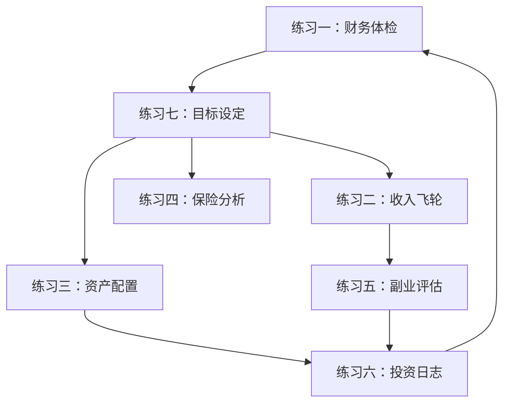

# 第18章 练习方法：30-40岁财富加速的实操训练

30-40岁是财富积累的黄金加速期。这个阶段通常已经度过了职业初期的摸索期，收入进入上升通道，同时也面临着房贷、育儿、赡养老人等多重财务压力。如何在压力中找到突破口，实现财富的加速增长？答案不在于知道更多理论，而在于通过系统化的练习将知识转化为行动。

本章设计了七个循序渐进的练习，覆盖财务诊断、收入增长、投资管理、风险控制和目标规划五大维度。每个练习都包含完整的操作模板、真实案例和常见误区，确保你能直接上手执行。

---

## 练习一：家庭财务体检

### 为什么要做财务体检

财务体检是所有财富管理的起点。正如医生需要先检查才能开药，你需要先全面了解自己的财务状况，才能制定有效的改善计划。很多人对自己的财务状况存在严重的认知偏差——要么过于乐观（忽略负债），要么过于悲观（忽视已有资产）。财务体检的核心价值在于：用数据替代感觉，用事实替代猜测。

根据中国人民银行2024年的调查数据，仅有23%的家庭做过完整的资产负债梳理，而这些家庭的平均净资产增长率比未梳理家庭高出47%。这个差距并非因为收入差异，而是因为清晰的财务认知让人做出更理性的决策。

### 第1步：制作家庭资产负债表

资产负债表是财务体检的核心工具。它回答一个根本问题：你到底有多少钱？

**资产分类与评估方法：**

| 资产项目 | 金额（元） | 评估方法 | 注意事项 |
|---------|-----------|---------|---------|
| 现金及银行存款 | | 银行APP直接查看 | 包含所有银行账户，含活期和定期 |
| 货币基金 | | 各平台净值查询 | 支付宝余额宝、微信零钱通等 |
| 股票/基金 | | 证券账户市值 | 用当前市值，不用买入成本 |
| 债券 | | 面值+应计利息 | 国债、企业债分别列出 |
| 养老金/公积金 | | 公积金APP查询 | 这是常被忽略的重要资产 |
| 房产（市场价值） | | 参考同小区近期成交价 | 取保守估计，不要虚高 |
| 车辆（折旧后价值） | | 二手车平台估价 | 每年折旧15-20% |
| 其他资产 | | 如收藏品、珠宝等 | 只计有市场流通性的资产 |
| **资产合计** | | | |

| 负债项目 | 金额（元） | 查询方式 | 注意事项 |
|---------|-----------|---------|---------|
| 房贷余额 | | 银行APP贷款详情 | 含公积金贷款和商业贷款 |
| 车贷余额 | | 银行或汽车金融公司 | |
| 信用卡欠款 | | 信用卡APP当期账单 | 含已出账和未出账的消费 |
| 其他贷款 | | 如消费贷、花呗、借呗 | 包含所有平台的借贷 |
| **负债合计** | | | |

**净资产 = 资产合计 - 负债合计**

**真实案例：** 张先生（32岁，IT工程师）在做财务体检前，认为自己"没什么资产"。梳理后发现：房产净值180万（市值280万减房贷100万），公积金账户12万，股票基金8万，存款5万，净资产合计205万。这个数字让他意识到自己的财务基础远比想象中扎实，关键问题不是"没钱"，而是"钱没有高效运转"。

### 第2步：制作月度现金流量表

现金流量表揭示你的钱从哪里来、到哪里去。很多人"不知道钱花哪儿了"的根本原因就是没有做过现金流分析。

| 收入项目 | 金额（元） | 数据来源 |
|---------|-----------|---------|
| 工资收入（税后） | | 工资条或银行流水 |
| 副业收入 | | 副业流水记录 |
| 投资收益 | | 如股息、利息、房租收入 |
| 其他收入 | | 如年终奖分摊到月、礼金等 |
| **收入合计** | | |

| 支出项目 | 金额（元） | 数据来源 |
|---------|-----------|---------|
| 房贷/房租 | | 银行扣款记录 |
| 日常生活费 | | 记账APP或支付宝年度账单 |
| 交通费用 | | 含油费、停车费、公共交通 |
| 子女教育 | | 学费、培训班、兴趣班 |
| 保险费用 | | 保险APP年度保费汇总 |
| 娱乐消费 | | 旅游、聚餐、购物等 |
| 孝敬父母 | | 定期给父母的钱 |
| 其他支出 | | 如医疗、美容、学习等 |
| **支出合计** | | |

**月结余 = 收入合计 - 支出合计**

**储蓄率 = 月结余 / 收入合计 × 100%**

**关键指标解读：**

- **储蓄率30%以下**：财务状况危险，需要立即削减非必要支出
- **储蓄率30-50%**：正常水平，有改善空间
- **储蓄率50%以上**：优秀，财富积累速度较快
- **储蓄率为负**：入不敷出，需要紧急调整

### 第3步：计算关键财务指标

四个核心指标帮你全面评估财务健康度：

**1. 净资产增长率**

```text
净资产增长率 = (今年净资产 - 去年净资产) / 去年净资产 × 100%
```

- **10%以下**：财富增长缓慢，需要找到瓶颈
- **10-20%**：正常增长，保持现有节奏
- **20%以上**：快速增长，注意风险控制

**2. 负债率**

```text
负债率 = 总负债 / 总资产 × 100%
```

- **30%以下**：财务安全
- **30-50%**：正常水平，可控范围
- **50-70%**：偏高，需要有计划地降低
- **70%以上**：高风险，必须立即采取措施

**3. 流动性比率**

```text
流动性比率 = 流动资产（现金+货基+短期理财） / 月支出
```

- **3以下**：应急资金严重不足
- **3-6**：基本达标，建议继续增加
- **6-12**：良好状态，足以应对大部分突发情况
- **12以上**：可能资金闲置过多，考虑增加投资

**4. 偿债比率**

```text
偿债比率 = 每月还款额 / 月收入 × 100%
```

- **30%以下**：还款压力小
- **30-50%**：正常范围
- **50%以上**：还款压力大，需要警惕

**5. 财务自由度**

```text
财务自由度 = 被动收入 / 基本生活支出 × 100%
```

- **10%以下**：完全依赖主动收入
- **10-50%**：开始有财务缓冲
- **50-100%**：接近财务自由
- **100%以上**：实现财务自由

### 财务体检报告模板

完成以上三步后，用以下模板总结：

```text
【财务体检报告】
日期：____年__月__日
净资产：______万元
净资产增长率：______%
储蓄率：______%
负债率：______%
流动性比率：______
偿债比率：______%

【核心发现】
1. 最大的财务优势：____________________
2. 最大的财务风险：____________________
3. 最需要改善的领域：____________________

【改进计划】
1. 短期（1-3个月）：____________________
2. 中期（3-12个月）：____________________
3. 长期（1-3年）：____________________
```

### 频率与时机

- **每年一次**：完整体检（建议每年1月或生日月）
- **每季度一次**：简化版（只做现金流分析和储蓄率计算）
- **重大事件后**：买房、换工作、结婚、生子、失业等

### 常见误区

**误区1：资产价值虚高**
房产估价参考同小区最低成交价而非最高价；车辆用二手车平台实际估价而非新车价。

**误区2：忽略隐性负债**
花呗、白条、信用卡分期都是负债，不能因为"每月还一点"就不计入。

**误区3：只看净资产不看现金流**
有人净资产很高（比如房产），但现金流紧张。净资产是"纸面财富"，现金流才是"活的钱"。

**误区4：做一次就不做了**
财务状况是动态变化的，一次体检只是快照，需要定期复查才能发现趋势和问题。

***

## 练习二：收入飞轮设计

### 为什么需要收入飞轮

单一工资收入是脆弱的。一旦失业、生病或行业衰退，整个家庭财务就会陷入危机。收入飞轮的核心理念是：构建多个相互增强的收入来源，形成正向循环，让财富增长不再依赖单一因素。

飞轮效应（Flywheel Effect）由吉姆·柯林斯在《从优秀到卓越》中提出：一个巨大的飞轮，起初推动非常费力，但每一次推动都在为下一次积累能量，最终飞轮会依靠自身惯性高速旋转。收入飞轮也是如此——初期需要投入大量时间和精力，但一旦多个收入来源形成正向循环，财富增长就会进入加速状态。

### 第1步：评估主业潜力

主业是收入飞轮的"主引擎"，在投入副业之前，先确认主业是否已经充分利用。

**主业评估问卷：**

| 评估维度 | 你的回答 | 评分（1-5） |
|---------|---------|------------|
| 我的主业收入天花板是多少？ | ______元/年 | |
| 在当前公司还有多大晋升空间？ | | |
| 我的行业未来5年前景如何？ | | |
| 我的技能在市场上的稀缺程度？ | | |
| 我需要提升哪些能力来增加主业收入？ | | |
| 主业收入占总收入的比例是多少？ | | |

**评分解读：**
- **20分以上**：主业仍有很大提升空间，优先投入主业
- **15-20分**：主业中等，可以在稳固主业的同时探索副业
- **15分以下**：主业天花板较低，需要积极开拓副业

**主业优化方向：**

1. **向上突破**：争取晋升、加薪、带团队，提升单位时间价值
2. **横向拓展**：学习相邻技能，成为"T型人才"，增加不可替代性
3. **向外跳槽**：如果内部空间有限，用更好的外部机会倒逼涨薪
4. **向内深挖**：成为细分领域专家，通过专业影响力获得额外收入（咨询、培训、出书）

### 第2步：寻找副业方向

用"三圈模型"找到最优副业方向。这个模型来自斯坦福大学设计学院，核心思想是：最好的机会在三个圈的交集处。

**三圈模型操作：**

1. **能力圈**：列出你擅长的5项技能（如编程、写作、设计、外语、数据分析）
2. **兴趣圈**：列出你真正喜欢的5件事（不是"应该喜欢"，而是"自发想做"的）
3. **市场圈**：列出5个有人愿意付费的需求（在招聘网站、威客平台、社交媒体上调研）

**交集分析表：**

| 能力 | 兴趣 | 市场需求 | 交集机会 |
|------|------|---------|---------|
| 编程 | 教学 | 编程培训 | 在线编程课程 |
| 写作 | 投资 | 理财内容 | 财经自媒体 |
| 数据分析 | 健身 | 健身数据 | 健身数据分析工具 |

**副业类型矩阵：**

| 类型 | 特点 | 时间投入 | 收入上限 | 适合阶段 | 示例 |
|------|------|---------|---------|---------|------|
| 技能变现型 | 用已有技能接单 | 中 | 中 | 立即可做 | 设计、翻译、编程外包 |
| 内容创作型 | 输出内容积累粉丝 | 高 | 高 | 需要3-6个月 | 自媒体、课程、电子书 |
| 产品销售型 | 销售实体或虚拟产品 | 中 | 高 | 需要1-3个月 | 电商、知识付费 |
| 投资理财型 | 用钱生钱 | 低 | 中 | 需要本金 | 股票、基金、房产出租 |
| 平台中介型 | 连接供需双方 | 中 | 高 | 需要资源 | 信息中介、资源整合 |

### 第3步：制定投资计划

投资是收入飞轮的"加速器"。它让钱为你工作，而不是你为钱工作。

**投资预算规划：**

```text
每月可投资金额 = 月收入 × 目标储蓄率 - 必要支出

示例：
月收入：20,000元
目标储蓄率：40%
必要支出：8,000元（房贷+生活费）
每月可投资金额 = 20,000 × 40% - 0 = 8,000元
（注：必要支出已包含在60%的消费中）

或者更简单：
每月可投资金额 = 月结余 × 80%
（保留20%的结余作为缓冲资金）
```

**投资目标设定：**

| 投资目标 | 年化收益预期 | 对应策略 |
|---------|------------|---------|
| 保值（跑赢通胀） | 3-5% | 纯债基金、大额存单 |
| 稳健增长 | 6-10% | 指数基金定投、固收+ |
| 积极增长 | 10-15% | 股票组合、主动基金 |
| 高风险高回报 | 15%+ | 个股、期权、创业投资 |

### 第4步：绘制收入飞轮图

收入飞轮的核心是"正向循环"——每个收入来源都能强化其他来源。

**飞轮循环逻辑：**

```text
主业收入（稳定现金流）
    ↓
能力提升（用主业积累的经验和技能）
    ↓
副业机会（技能变现、内容输出）
    ↓
副业收入（额外现金流）
    ↓
投资本金（主业+副业结余）
    ↓
投资收益（被动收入）
    ↓
财务安全感（减少焦虑，更有底气）
    ↓
主业更有底气（敢于谈判、敢于跳槽、敢于创业）
    ↓
回到更高层次的主业收入...
```

**飞轮设计模板：**

```text
【我的收入飞轮】

主业：_______________（当前月收入：______元）
主业优化方向：_______________
预期主业收入增长：______%（1年后）

副业方向：_______________
副业启动时间：____年__月
预期副业月收入（6个月后）：______元
预期副业月收入（12个月后）：______元

投资策略：_______________
每月投资金额：______元
预期年化收益：______%
预期12个月后投资组合市值：______元

【飞轮循环】
主业收入 → ______ → ______ → ______ → 投资收益 → 财务安全感 → 主业更有底气
```

### 频率

每年更新一次收入飞轮设计，每季度检查飞轮运转情况。

### 常见误区

**误区1：副业影响主业**
副业应该是主业的"延伸"而非"竞争"。如果副业占用大量工作时间或精力，导致主业表现下降，那就是本末倒置。

**误区2：追求"被动收入"神话**
真正的被动收入需要前期大量主动投入。很多人被"睡后收入"的概念吸引，结果花大量时间在收益极低的事情上。

**误区3：同时启动多个副业**
飞轮需要集中力量推动。同时做三件事，不如先把一件事做到极致。

**误区4：忽视协同效应**
最好的副业能强化主业技能。比如程序员做技术自媒体，既能赚钱又能提升专业影响力，形成正循环。

***

## 练习三：资产配置模拟

### 为什么要学习资产配置

资产配置决定了投资收益的90%。诺贝尔经济学奖得主威廉·夏普的研究表明，长期来看，投资组合收益的差异有91.5%来自资产配置，而非个股选择或市场择时。

30-40岁这个阶段，你可能已经有了几十万甚至上百万的投资资金。如何科学地分配这些资金，比选择哪只股票更重要。

### 第1步：确定风险承受能力

风险承受能力由两个因素决定：**客观能力**（你能承受多大损失）和**主观意愿**（你能接受多大波动）。两者可能不一致——有些人客观上有能力承受高风险，但主观上无法接受大幅波动。

**风险评估问卷（每题1-5分）：**

| 问题 | 你的情况 | 评分 |
|------|---------|------|
| 1. 我的投资期限是多长？（1年=1分，10年以上=5分） | | |
| 2. 如果投资亏损20%，我会怎么做？（立即卖出=1分，继续持有=5分） | | |
| 3. 我的收入稳定性如何？（非常不稳定=1分，非常稳定=5分） | | |
| 4. 我有多少应急基金？（没有=1分，12个月以上=5分） | | |
| 5. 我的投资经验有多少？（没有=1分，10年以上=5分） | | |
| 6. 如果投资亏损50%，我是否会影响基本生活？（会=1分，完全不会=5分） | | |
| 7. 我是否有其他收入来源？（没有=1分，3个以上=5分） | | |

**评分解读：**

| 总分 | 风险类型 | 股票类配置上限 | 适合人群 |
|------|---------|--------------|---------|
| 7-14分 | 保守型 | 20-30% | 刚开始投资、风险厌恶者 |
| 15-21分 | 稳健型 | 30-50% | 有一定投资经验、追求稳健增长 |
| 22-28分 | 平衡型 | 50-70% | 投资经验丰富、能承受波动 |
| 29-35分 | 进取型 | 70-90% | 投资老手、有充足应急资金 |

### 第2步：设计资产配置方案

根据你的风险类型，选择对应的基础配置方案，然后根据个人情况微调。

**保守型配置（预期年化4-6%，最大回撤5-10%）：**

| 资产类别 | 配置比例 | 推荐工具 | 作用 |
|---------|---------|---------|------|
| 货币基金 | 20% | 余额宝、银行活期理财 | 流动性储备 |
| 短期债券基金 | 30% | 短债基金、同业存单基金 | 稳定收益 |
| 中长期债券基金 | 20% | 纯债基金、二级债基 | 增强收益 |
| 指数基金 | 25% | 沪深300、中证500 | 长期增值 |
| 黄金 | 5% | 黄金ETF | 对冲风险 |

**稳健型配置（预期年化6-10%，最大回撤10-20%）：**

| 资产类别 | 配置比例 | 推荐工具 | 作用 |
|---------|---------|---------|------|
| 货币基金 | 10% | 余额宝、银行活期理财 | 流动性储备 |
| 债券基金 | 25% | 二级债基、可转债基金 | 稳定收益 |
| 指数基金 | 40% | 沪深300+中证500组合 | 核心增值 |
| 主动基金 | 15% | 优秀基金经理的产品 | 超额收益 |
| 黄金 | 10% | 黄金ETF | 对冲风险 |

**平衡型配置（预期年化8-12%，最大回撤15-25%）：**

| 资产类别 | 配置比例 | 推荐工具 | 作用 |
|---------|---------|---------|------|
| 货币基金 | 5% | 余额宝 | 流动性储备 |
| 债券基金 | 15% | 二级债基 | 降低波动 |
| 指数基金 | 35% | 宽基指数+行业指数 | 核心配置 |
| 主动基金 | 20% | 价值/成长风格搭配 | 超额收益 |
| 黄金 | 10% | 黄金ETF | 对冲风险 |
| 另类投资 | 15% | REITs、大宗商品 | 分散风险 |

**进取型配置（预期年化10-15%，最大回撤20-35%）：**

| 资产类别 | 配置比例 | 推荐工具 | 作用 |
|---------|---------|---------|------|
| 货币基金 | 5% | 余额宝 | 极低流动性储备 |
| 指数基金 | 30% | 宽基+行业+海外指数 | 核心配置 |
| 主动基金 | 25% | 集中持仓的优秀基金 | 超额收益 |
| 个股 | 20% | 自己研究的公司 | 高弹性收益 |
| 黄金 | 10% | 黄金ETF | 对冲风险 |
| 另类投资 | 10% | REITs、加密资产等 | 分散+高弹性 |

### 第3步：制定再平衡规则

资产配置不是"设定后就忘了"。随着市场波动，实际配置比例会偏离目标，需要定期再平衡。

**再平衡的两种方式：**

**方式一：时间再平衡**
每半年或每年底检查一次，将偏离较大的资产调回目标比例。

**方式二：阈值再平衡**
当某类资产偏离目标配置超过5-10%时触发调整。比如目标股票配置50%，当实际比例涨到60%或跌到40%时，卖出或买入以回归目标。

**再平衡操作示例：**

```text
假设目标配置：股票50%，债券50%
一年后：股票涨到60%，债券降到40%
总资产：100万

再平衡操作：
卖出10万股票（60%→50%）
买入10万债券（40%→50%）

结果：回到50:50的目标配置
```

**再平衡的注意事项：**

1. 优先用新增资金再平衡，避免卖出产生税费
2. A股基金持有超过7天（短债）或30天（股票型）可降低赎回费
3. 再平衡不是择时，不要因为"觉得市场要跌"而提前调仓

### 第4步：配置优化进阶

**核心-卫星策略：**

将资产分为"核心"和"卫星"两部分。核心部分（70-80%）采用被动指数投资，追求市场平均收益；卫星部分（20-30%）采用主动投资，追求超额收益。

```text
核心配置（70-80%）：
  - 沪深300指数基金：40%
  - 中证500指数基金：20%
  - 债券基金：20%

卫星配置（20-30%）：
  - 看好的行业基金：10%
  - 个股投资：10%
  - 另类投资：10%
```

**生命周期配置法：**

根据年龄调整股票配置比例，一个简单的公式：

```text
股票配置比例 = 110 - 年龄

示例：
30岁：股票配置80%
35岁：股票配置75%
40岁：股票配置70%
```

这个公式背后的逻辑是：年轻时有更长的投资期限来承受波动，随着年龄增长，逐步降低风险暴露。

### 频率

每半年做一次资产配置检查和再平衡，每年做一次全面评估。

### 常见误区

**误区1：过度分散**
持有30只基金不等于分散投资。如果这些基金都重仓同一批股票，风险并没有真正分散。

**误区2：追逐热门板块**
去年涨得好的板块，今年未必继续好。资产配置的核心是分散，不是押注。

**误区3：再平衡过于频繁**
每月甚至每周再平衡会产生大量交易成本。半年或一年一次足够。

**误区4：忽视相关性**
真正有效的分散是选择相关性低的资产。股票+股票基金不是分散，股票+债券才是。

***

## 练习四：保险需求分析

### 为什么30-40岁必须重视保险

30-40岁是"上有老下有小"的人生阶段。你是家庭的经济支柱，一旦你倒下，整个家庭的财务状况会瞬间崩塌。保险的核心价值不是"赚钱"，而是"防止一夜回到解放前"。

根据银保监会数据，中国家庭的平均保险深度（保费/GDP）仅为4.5%，远低于发达国家的8-12%。更重要的是，很多家庭买的是"理财型保险"而非"保障型保险"，真正出事时赔不了多少钱。

### 第1步：计算家庭风险敞口

风险敞口 = 发生风险事件时，家庭需要多少钱才能维持正常生活。

**风险场景一：经济支柱身故**

| 费用项目 | 金额（元） | 计算依据 |
|---------|-----------|---------|
| 房贷余额 | | 需要一次性还清 |
| 5年家庭生活费 | | 月支出 × 60个月 |
| 子女教育基金 | | 从现在到大学毕业的学费 |
| 父母赡养费 | | 每月赡养费 × 12 × 10年 |
| 其他债务 | | 车贷、消费贷等 |
| **合计（寿险保额需求）** | | |

**风险场景二：重大疾病**

| 费用项目 | 金额（元） | 计算依据 |
|---------|-----------|---------|
| 治疗费用 | | 常见重疾平均30-50万 |
| 3年收入损失 | | 年收入 × 3（康复期） |
| 康复和护理费用 | | 营养品、护工等 |
| **合计（重疾险保额需求）** | | |

**风险场景三：意外伤残**

| 费用项目 | 金额（元） | 计算依据 |
|---------|-----------|---------|
| 治疗和康复费用 | | 因伤残等级而异 |
| 收入损失 | | 至少3-5年收入 |
| 护理费用 | | 如果需要长期护理 |
| **合计（意外险保额需求）** | | |

### 第2步：检查现有保障

| 保险类型 | 已有保额 | 需要保额 | 差额 | 优先级 |
|---------|---------|---------|------|-------|
| 定期寿险 | | | | ⭐⭐⭐⭐⭐ |
| 重疾险 | | | | ⭐⭐⭐⭐⭐ |
| 医疗险 | | | | ⭐⭐⭐⭐ |
| 意外险 | | | | ⭐⭐⭐⭐ |

**优先级说明：**
- **定期寿险**：最优先。便宜且保障高，30岁男性100万保额每年仅需1000元左右
- **重疾险**：次优先。确诊即赔，弥补收入损失
- **医疗险**：补充医保不足。百万医疗险每年仅需几百元
- **意外险**：最便宜的险种。100万保额每年仅需200-300元

**30-40岁保险配置参考（年收入20万家庭）：**

| 险种 | 保额 | 年保费 | 备注 |
|------|------|--------|------|
| 定期寿险 | 200万 | 2,000元 | 保障到60岁 |
| 重疾险 | 50万 | 5,000元 | 保终身 |
| 百万医疗险 | 400万 | 800元 | 1万免赔额 |
| 意外险 | 100万 | 300元 | 一年期 |
| **合计** | | **8,100元** | 占收入约4% |

### 第3步：制定补充计划

根据差额，制定分阶段补充计划：

**第一阶段（立即）：**
- 配置百万医疗险（几百元，立即生效）
- 配置意外险（几百元，立即生效）

**第二阶段（1-3个月）：**
- 配置定期寿险（根据负债和家庭责任计算保额）
- 配置重疾险（保额至少覆盖3年收入）

**第三阶段（持续优化）：**
- 根据收入增长和家庭变化调整保额
- 定期检查保障是否充足

### 频率

每年检查一次，特别是在结婚、生子、买房、升职加薪等重大人生事件后立即复查。

### 常见误区

**误区1：给孩子买保险比给大人买更重要**
大人才是家庭的经济支柱。大人的保障比孩子重要100倍。孩子只需要医疗险和意外险，不需要寿险和重疾险。

**误区2：返还型保险比消费型好**
返还型保险的本质是"多交钱，几十年后退还"。算上时间价值，返还的钱远不如自己投资。消费型保险+自己投资，收益更高。

**误区3：买了保险就万事大吉**
保险需要定期检查。保额是否足够？受益人是否需要更新？是否有重复购买或保障缺口？

**误区4：社保就够了**
社保是基础保障，但报销比例有限（通常60-80%），且有起付线、封顶线和药品目录限制。大病面前，社保远远不够。

***

## 练习五：副业可行性评估

### 为什么需要可行性评估

副业失败率高达80%以上。很多人凭热情投入，三个月后发现不赚钱就放弃了，浪费了大量时间和精力。可行性评估的目的不是"证明这个想法一定成功"，而是"在投入大量资源之前，先验证核心假设"。

### 第1步：明确副业方向

用练习二的"三圈模型"确定方向后，写下你的副业构想：

```text
我想做的副业是：____________________
目标客户是谁：____________________
我为他们解决什么问题：____________________
他们愿意为此付多少钱：____________________
```

### 第2步：八维可行性评估

用以下评分表全面评估（每题1-5分）：

| 评估维度 | 评估问题 | 评分 | 权重 |
|---------|---------|------|------|
| 市场需求 | 这个需求是否真实存在？有多少人有这个需求？ | | ×2 |
| 竞争程度 | 现有竞争者多吗？我有什么差异化优势？ | | ×1 |
| 启动成本 | 需要多少资金才能开始？这个风险我能承受吗？ | | ×1 |
| 时间投入 | 每周需要投入多少小时？会影响主业和生活吗？ | | ×2 |
| 收入潜力 | 月收入上限是多少？多久能达到稳定收入？ | | ×2 |
| 协同效应 | 能否强化主业技能？能否积累长期资产？ | | ×1 |
| 技能匹配 | 我现有技能能满足需求吗？需要学习什么新技能？ | | ×1 |
| 兴趣程度 | 我对这个方向有多感兴趣？能坚持多久？ | | ×1 |

**加权总分解读：**

| 总分（满分55） | 建议 |
|--------------|------|
| 40分以上 | 强烈推荐，值得全力投入 |
| 30-40分 | 值得尝试，建议先用MVP验证 |
| 20-30分 | 需要谨慎，先小规模测试 |
| 20分以下 | 不建议做，寻找更好的方向 |

### 第3步：制定MVP行动计划

MVP（最小可行产品）的核心思想是：用最少的时间和资源，验证副业的核心假设。

**3个月MVP计划：**

| 阶段 | 时间 | 目标 | 关键任务 |
|------|------|------|---------|
| 验证期 | 第1个月 | 验证需求真实性 | 1. 找10个目标客户访谈<br>2. 在小红书/知乎发3篇内容测试反馈<br>3. 做一个最简单的产品原型 |
| 测试期 | 第2个月 | 验证付费意愿 | 1. 找3-5个客户试用<br>2. 收集反馈并迭代<br>3. 确定定价策略 |
| 放量期 | 第3个月 | 验证可扩展性 | 1. 正式上线产品/服务<br>2. 获得前10个付费客户<br>3. 计算实际投入产出比 |

**MVP成功标准：**

- 第1个月：至少有3个陌生人表示"愿意为此付费"
- 第2个月：至少有1个客户实际付费
- 第3个月：月收入达到1000元以上

如果3个月后未达到以上标准，认真考虑是否继续。

### 频率

每次有新的副业想法时做一次评估。建议每季度审视现有副业的运行状况。

### 常见误区

**误区1：完美主义陷阱**
不要等到产品"完美"才推出。先推出60分的产品，根据反馈迭代到80分，比闭门造车做出"100分"产品更有效。

**误区2：低估时间成本**
很多人只计算金钱成本，忽略时间成本。如果每周投入10小时，一个月就是40小时——这40小时如果用于主业提升，可能回报更高。

**误区3：忽视合规风险**
副业是否需要营业执照？是否涉及知识产权问题？是否与主业公司有竞业限制？这些法律风险必须提前评估。

**误区4：把副业当主业做**
副业初期应该是"轻量级"的。不要辞职、不要租办公室、不要雇人。先验证需求，再扩大投入。

***

## 练习六：投资日志记录

### 为什么要写投资日志

投资日志是将投资从"赌博"变成"科学"的关键工具。它有三个核心价值：

1. **避免重复犯错**：人类大脑对损失的记忆会随时间淡化。记录下来，才能真正从错误中学习。
2. **识别行为模式**：你可能会发现自己总是在市场恐慌时卖出、在市场狂热时买入——这种模式只有通过记录才能发现。
3. **建立投资纪律**：当你知道每次交易都需要记录和反思时，会更谨慎地做决策。

桥水基金创始人瑞·达利欧在《原则》中写道："痛苦+反思=进步"。投资日志就是将投资中的"痛苦"转化为"进步"的工具。

### 第1步：交易记录模板

**每次买卖时，填写以下记录：**

```markdown
【交易记录】#____

基本信息：
- 日期：____年__月__日
- 投资品种：_______________
- 交易类型：买入 / 卖出
- 金额：______元
- 数量：______份/股
- 交易费用：______元

决策分析：
- 买入/卖出理由：_______________
- 当时的市场环境：_______________
- 我的情绪状态：_______________
  （贪婪/恐惧/平静/兴奋/焦虑/自信）
- 预期持有时间：_______________
- 预期收益：______%
- 预期最大亏损：______%
- 止损点位：______（价格或亏损比例）
- 目标卖出条件：_______________

事后复盘（卖出后填写）：
- 实际收益：______% / ______元
- 持有时间：______天
- 决策是否正确：是 / 否
- 正确/错误的原因：_______________
- 学到了什么：_______________
```

### 第2步：投资日志分析框架

**季度回顾清单：**

| 分析维度 | 问题 | 你的答案 |
|---------|------|---------|
| 收益分析 | 本季度总收益是多少？ | |
| 收益归因 | 收益主要来自哪些交易？ | |
| 错误分析 | 本季度最大的投资错误是什么？ | |
| 情绪分析 | 我的情绪在什么情况下最容易失控？ | |
| 策略评估 | 我的投资策略是否需要调整？ | |
| 纪律评估 | 我是否严格执行了止损和目标卖出条件？ | |

**年度投资日志总结模板：**

```text
【____年度投资总结】

一、收益概况
- 年初资产：______元
- 年末资产：______元
- 总收益率：______%
- 同期基准（沪深300）：______%
- 超额收益：______%

二、交易统计
- 总交易次数：______次
- 盈利交易次数：______次（胜率：______%）
- 亏损交易次数：______次
- 平均盈利幅度：______%
- 平均亏损幅度：______%
- 盈亏比：______

三、行为分析
- 最成功的3笔交易及原因：
  1. _______________
  2. _______________
  3. _______________
- 最失败的3笔交易及原因：
  1. _______________
  2. _______________
  3. _______________
- 情绪导致的错误交易次数：______次

四、明年改进计划
1. 需要继续保持的好习惯：_______________
2. 需要改正的坏习惯：_______________
3. 需要学习的新知识：_______________
```

### 第3步：情绪管理工具

投资日志中最重要的部分是"情绪记录"。以下是一个简单的情绪-决策对照表：

| 情绪状态 | 常见错误决策 | 正确应对 |
|---------|------------|---------|
| 恐惧（市场大跌） | 恐慌卖出 | 回顾投资逻辑，如果逻辑没变就坚持 |
| 贪婪（市场大涨） | 追高买入 | 回顾估值，超过合理估值就减仓 |
| FOMO（害怕错过） | 跟风买入 | 写下买入理由，如果没有就不买 |
| 后悔（错过机会） | 报复性交易 | 接受错过是常态，等待下一个机会 |
| 自信（连续盈利） | 加大仓位 | 遵守仓位管理规则，不因盈利改变 |

### 频率

每次交易时记录，每季度回顾一次，每年做一次全面总结。

### 常见误区

**误区1：只记赚钱的交易**
亏钱的交易更需要记录。赚钱可能只是运气，亏钱才能暴露问题。

**误区2：记录过于简单**
"买了XX基金，涨了"——这种记录没有价值。必须记录买入理由、情绪状态、预期和实际结果的对比。

**误区3：记了不看**
记录只是第一步，定期回顾才能产生价值。建议设置每季度最后一个周末为"投资复盘日"。

**误区4：用记忆代替记录**
人的记忆会被结果扭曲。赚了钱的交易，事后回忆时会觉得"我当时就是这么想的"——但真实想法可能完全不同。必须在交易当时就记录。

***

## 练习七：年度财务目标设定

### 为什么要设定年度目标

没有目标的财务管理就像没有目的地的旅行——你可能在移动，但不知道要去哪里。年度财务目标的价值在于：将模糊的"想变有钱"转化为具体的、可衡量的、可执行的行动计划。

心理学研究表明，写下目标的人比不写的人实现目标的概率高出42%。这是因为书写的过程迫使你将模糊的想法转化为具体的承诺。

### 第1步：回顾去年

年度目标设定的第一步是回顾。不理解过去，就无法规划未来。

**去年回顾清单：**

| 回顾维度 | 去年实际 | 前年实际 | 同比变化 |
|---------|---------|---------|---------|
| 总收入（税后） | ______元 | ______元 | ______% |
| 总支出 | ______元 | ______元 | ______% |
| 总储蓄 | ______元 | ______元 | ______% |
| 储蓄率 | ______% | ______% | |
| 投资收益率 | ______% | ______% | |
| 净资产 | ______元 | ______元 | ______% |
| 净资产增长率 | ______% | | |

**去年反思问题：**

1. 去年最正确的3个财务决策是什么？为什么？
2. 去年最大的3个财务错误是什么？为什么？
3. 哪些支出让我后悔了？哪些支出让我觉得值得？
4. 去年有哪些财务机会错过了？为什么错过？
5. 如果重来一次，我会在哪些方面做出不同的选择？

### 第2步：设定今年目标

用SMART原则设定目标：具体的（Specific）、可衡量的（Measurable）、可实现的（Achievable）、相关的（Relevant）、有时限的（Time-bound）。

| 目标类别 | 具体目标 | 数值目标 | 衡量标准 | 行动计划 |
|---------|---------|---------|---------|---------|
| 收入目标 | 提升主业收入 | 月收入从__提升到__ | 工资条 | 争取Q2晋升 |
| 储蓄目标 | 提高储蓄率 | 从__%提升到__% | 月度现金流表 | 削减__支出 |
| 投资目标 | 学会指数基金定投 | 年化收益__% | 证券账户 | 每月定投__元 |
| 保障目标 | 补齐保险缺口 | 年保费预算__元 | 保单清单 | Q1完成配置 |
| 学习目标 | 掌握投资基础知识 | 读完__本书 | 笔记和实践 | 每月读1本 |
| 副业目标 | 验证副业可行性 | 月收入达到__元 | 银行流水 | 按MVP计划执行 |

**目标设定示例（年收入20万的程序员）：**

```text
【2025年财务目标】

核心目标：净资产从50万增长到70万（增长40%）

分解目标：
1. 收入目标：年收入从20万提升到25万
   - 行动：Q2争取晋升，年薪提升15%
   - 行动：Q3开始技术自媒体副业，月入3000+

2. 储蓄目标：储蓄率从35%提升到45%
   - 行动：取消不必要的订阅服务（省500/月）
   - 行动：优化保险配置（省2000/年）

3. 投资目标：投资收益率达到10%
   - 行动：每月定投5000元到指数基金
   - 行动：学习资产配置，优化投资组合

4. 保障目标：完成家庭保险配置
   - 行动：Q1给自己和配偶配置定期寿险
   - 行动：Q1给孩子配置医疗险和意外险

5. 学习目标：读完12本理财书
   - 行动：每月精读1本，写读书笔记
```

### 第3步：分解为季度目标

年度目标太大，容易拖延。将它分解为季度里程碑，让每一步都清晰可见。

| 季度 | 关键里程碑 | 具体行动 |
|------|-----------|---------|
| Q1 | 完成保险配置<br>开始基金定投 | 1月：保险需求分析<br>2月：完成投保<br>3月：开始每月定投 |
| Q2 | 主业晋升<br>副业启动 | 4月：准备晋升材料<br>5月：副业MVP验证<br>6月：副业正式上线 |
| Q3 | 副业稳定收入<br>投资组合优化 | 7月：副业迭代优化<br>8月：资产配置再平衡<br>9月：中期复盘 |
| Q4 | 年度目标冲刺<br>下年规划 | 10月：检查目标完成度<br>11月：查漏补缺<br>12月：年度总结+下年规划 |

### 第4步：建立检查机制

目标设定后不检查，等于没有目标。建立以下检查机制：

**月度检查（每月最后一个周末，15分钟）：**
- 本月收入和支出是否达标？
- 储蓄率是否达到目标？
- 投资定投是否按时执行？
- 有没有偏离目标的情况？

**季度检查（每季度最后一个周末，1小时）：**
- 本季度里程碑是否完成？
- 目标是否需要调整？
- 有哪些意外情况需要应对？

**年度总结（12月最后一个周末，半天）：**
- 全年目标完成度评估
- 成功经验和失败教训
- 下年目标初稿

### 频率

每年1月设定，每月检查，每季度复盘，每年12月总结并规划下年。

### 常见误区

**误区1：目标过于激进**
"今年要存30万"——如果去年只存了10万，这个目标几乎不可能实现，反而会因为差距太大而放弃。合理的增长幅度是20-50%。

**误区2：只有目标没有行动**
"我要提高收入"不是目标，是愿望。目标必须包含具体的行动计划和时间节点。

**误区3：完美主义**
如果Q1的目标只完成了70%，不要放弃整年计划。调整目标，继续前进。完成70%的目标比放弃100%的目标好得多。

**误区4：忽视非财务目标**
财务目标只是人生的一部分。健康、家庭、个人成长同样重要。设定目标时要考虑整体平衡。

***

## 练习总结与执行指南

### 七个练习的内在逻辑

这七个练习不是孤立的，它们构成了一个完整的财富管理系统：



- **财务体检**是起点，告诉你"在哪里"
- **目标设定**是方向，告诉你"去哪里"
- **收入飞轮**解决"钱从哪里来"
- **资产配置**解决"钱怎么增值"
- **保险分析**解决"怎么防风险"
- **副业评估**是收入飞轮的执行层
- **投资日志**是资产配置的优化器

### 推荐执行路径

**第一阶段（第1-2周）：了解现状**
1. 完成练习一（财务体检），建立全面的财务认知
2. 完成练习四（保险分析），确保基础保障到位

**第二阶段（第3-4周）：明确方向**
3. 完成练习七（目标设定），制定年度财务计划
4. 完成练习二（收入飞轮），设计收入增长路径

**第三阶段（第2-3个月）：开始行动**
5. 完成练习三（资产配置），建立投资组合
6. 完成练习五（副业评估），验证副业想法

**第四阶段（持续）：优化迭代**
7. 持续记录练习六（投资日志），不断优化投资决策
8. 定期回顾所有练习，持续改进

### 执行原则

1. **不要试图一次做完所有练习**。每月专注1-2个，循序渐进
2. **重在执行，而非完美**。一个60分的行动胜过一个100分的计划
3. **定期回顾，持续优化**。每月花1小时回顾，比每天花1小时焦虑更有效
4. **和伴侣一起做**。财务是家庭事务，两个人一起做效果翻倍
5. **保持耐心**。财富积累是马拉松，不是百米冲刺。第一个100万最难，之后会越来越快

### 工具推荐

| 需求 | 推荐工具 | 特点 |
|------|---------|------|
| 记账 | 随手记、钱迹 | 记录日常收支 |
| 投资 | 天天基金、蛋卷基金 | 基金定投和管理 |
| 股票 | 同花顺、东方财富 | 股票分析和交易 |
| 保险 | 蜗牛保险、深蓝保 | 保险规划和产品对比 |
| 记录 | 印象笔记、Notion | 投资日志和财务记录 |
| 表格 | 腾讯文档、石墨文档 | 协作编辑财务表格 |

记住：工具是手段，行动才是目的。不要花太多时间在选择工具上，用最简单的工具开始行动。
