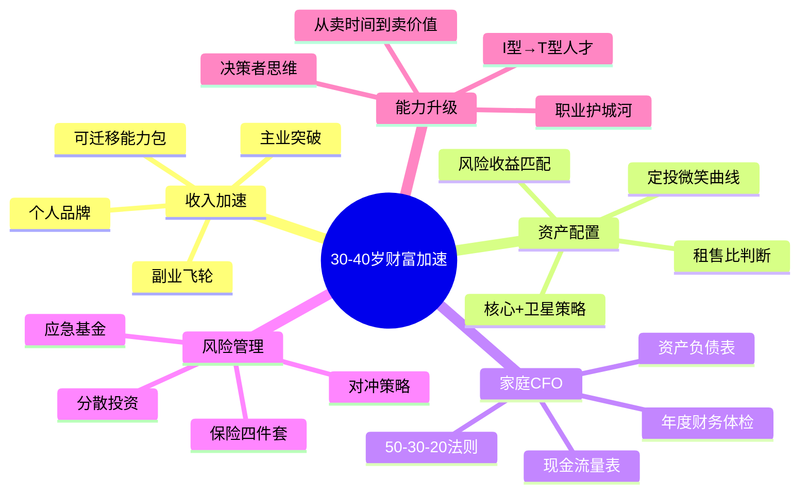

# 第18章 本章小结：30-40岁，你的财富加速器

30-40岁是人生财富积累的黄金十年。本章从理论到实操，系统构建了这个阶段的财富加速框架。下面从五个维度回顾全章核心内容，并提供一张可执行的"章后行动地图"。

---

## 一、全章知识体系回顾

### 1.1 本章逻辑结构

本章遵循"道法术器"的完整链条：

| 层次 | 内容 | 对应章节 |
|------|------|----------|
| **道**（为什么） | 30-40岁是财富加速的关键窗口——收入进入高峰期、复利效应开始显现、试错成本相对可控 | 理论基础·财富加速的底层逻辑 |
| **法**（做什么） | 构建收入飞轮、科学资产配置、家庭CFO体系、四道风险防线 | 理论基础·各小节 |
| **术**（怎么做） | 五维个股筛选、定投微笑曲线、副业三圈模型、谈判加薪三步法、50-30-20预算法则 | 核心技巧·各小节 |
| **器**（用什么） | 家庭资产负债表模板、投资日志、保险保障检查清单、年度财务五看清单 | 练习方法·各练习 |

### 1.2 五大核心主题总结



---

## 二、核心观点深度回顾

### 2.1 收入飞轮：从单引擎到三引擎

**核心逻辑**：单一工资收入是线性的，且受制于时间和体力上限。收入飞轮的本质是让"主业、副业、投资"三条管道相互促进——主业提供现金流和能力积累，副业拓展收入来源和个人品牌，投资让已有资金产生复利。

**关键要点**：

| 收入管道 | 作用 | 目标占比 | 启动难度 | 收益上限 |
|---------|------|---------|---------|---------|
| 主业收入 | 基础现金流+能力积累 | 50%-70% | 低（已有） | 中（受职级限制） |
| 副业收入 | 第二增长曲线+个人品牌 | 10%-30% | 中 | 高（可超越主业） |
| 投资收入 | 让钱生钱+复利效应 | 10%-30% | 中 | 高（取决于本金和策略） |

**落地行动**：用副业三圈模型（热情×能力×市场需求）筛选副业方向，用可迁移能力包（沟通、写作、数据分析、项目管理）确保副业能力可复用。30-40岁的目标是让被动收入占比从0提升到20%以上。

### 2.2 资产配置：从"全存"或"全投"到科学配比

**核心逻辑**：资产配置不是"选哪只股票"的问题，而是"如何分配风险和收益"的问题。"核心+卫星"策略是适合大多数人的框架——核心资产（60%-80%）追求稳健增长，卫星资产（20%-40%）捕捉超额收益机会。

**关键要点**：

| 配置层次 | 资产类型 | 占比 | 目标收益 | 风险等级 |
|---------|---------|------|---------|---------|
| 核心层 | 宽基指数基金、国债、银行理财 | 60%-80% | 5%-8% | 低-中 |
| 卫星层 | 行业基金、个股、REITs | 20%-40% | 10%-20% | 中-高 |
| 对冲层 | 黄金、保险、现金 | 5%-10% | 保值 | 低 |

**定投微笑曲线**：市场下跌时买入更多份额，上涨时买入更少份额，长期下来成本被摊低。30-40岁有稳定的工资现金流，是执行定投策略的最佳时期。每月定投金额建议为月收入的15%-25%。

**个股五维筛选法**：从财务健康（负债率<60%）、盈利能力（ROE>15%）、成长性（营收增速>10%）、估值合理性（PE<行业中位数）、行业前景（政策支持+市场空间）五个维度综合评估，避免凭感觉选股。

### 2.3 家庭CFO：从个人记账到系统化管理

**核心逻辑**：家庭财务管理不是"记记账"那么简单。它需要像经营公司一样——有资产负债表（知道家底多厚）、有现金流量表（知道钱从哪来到哪去）、有预算管理（控制支出结构）、有战略规划（教育、养老、购房等重大目标）。

**50-30-20预算法则**：

| 类别 | 占比 | 包含内容 | 调整建议 |
|------|------|---------|---------|
| 必要支出 | 50% | 房贷/房租、餐饮、交通、水电、保险 | 高房价城市可上调至60% |
| 自由支出 | 30% | 娱乐、旅行、购物、社交 | 可适度压缩至20% |
| 储蓄投资 | 20% | 定投、应急基金、教育基金、养老储备 | 目标提升至30% |

**子女教育目标倒推法**：先确定教育目标（国内本科/海外留学），再估算总费用（含通胀），然后倒推每月需要储蓄的金额。以海外留学为例，当前费用约150-250万元，按年通胀5%计算，18年后约需360-600万元，每月需定投约8000-13000元。

**父母养老三层保障**：第一层是基本生活保障（社保+基本生活费支持），第二层是医疗保障（医保+商业医疗险+大病储备金），第三层是品质保障（定期体检、旅游基金、护理预备金）。三层保障从基础到高级，按优先级逐步建立。

### 2.4 风险管理：四道防线

**核心逻辑**：没有保障的投资是赌博。30-40岁承担着最大的家庭责任（房贷、子女、父母），任何重大风险都可能导致整个家庭财务崩塌。风险管理不是"买保险"那么简单，而是一个分层防御体系。

| 防线 | 内容 | 建立优先级 | 目标 |
|------|------|-----------|------|
| 第一道 | 应急基金 | ★★★★★ 最高 | 6-12个月家庭支出 |
| 第二道 | 保险保障 | ★★★★★ 最高 | 寿险+重疾+医疗+意外 |
| 第三道 | 分散投资 | ★★★★ 高 | 跨资产类别、跨地域分散 |
| 第四道 | 对冲策略 | ★★★ 中 | 黄金、反向ETF等对冲工具 |

**保险配置优先级**：先保障后理财，先大人后小孩，先经济支柱后其他家庭成员。30-40岁经济支柱的保险组合：定期寿险（保额=年收入×10）+ 重疾险（保额≥50万）+ 百万医疗险 + 意外险（保额≥100万），年保费约占家庭年收入的5%-10%。

### 2.5 能力升级：从I型到T型人才

**核心逻辑**：30-40岁的职业发展核心是从"卖时间"转向"卖价值"。I型人才只有一条纵向的专业线，容易被替代；T型人才既有纵向深度，又有横向跨界能力，价值天花板更高。

**从执行者到决策者的跨越**需要三个转变：
- **思维转变**：从"怎么做"到"做什么"和"为什么做"
- **能力转变**：从单一技术能力到综合管理能力（团队管理、战略思维、商业判断）
- **收入转变**：从按时间计费到按价值计费（管理分红、股权激励、创业收益）

**个人品牌内容矩阵**：通过写作、演讲、社交媒体等渠道输出专业内容，建立行业影响力。个人品牌的本质是降低信任成本——当别人认可你的专业能力时，合作机会、商业机会会主动找上门。

---

## 三、十大常见误区深度解析

原文列出了十大误区，以下是每个误区的核心纠正逻辑：

| 序号 | 误区 | 核心纠正 |
|------|------|---------|
| 1 | 收入高=财务状况好 | 收入是"流入"，净资产才是"家底"。关注储蓄率和净资产增长率，而非收入数字 |
| 2 | 等有钱了再投资 | 投资的关键是时间而非金额。每月500元定投30年，年化8%可积累约75万 |
| 3 | 投资就是炒股 | 炒股只是投资的一种，且风险最高。定投指数基金才是大多数人最优解 |
| 4 | 房产是最好的投资 | 房产流动性差、持有成本高、政策风险大。自住和投资需分开考虑 |
| 5 | 保险是骗人的 | 保险是风险管理工具，不是投资工具。"不买保险=开车不系安全带" |
| 6 | 副业会影响主业 | 关键看副业是否与主业形成飞轮效应。互补型副业反而能提升主业能力 |
| 7 | 追求高收益忽视风险 | 高收益必然伴随高风险。先建立风险管理体系，再追求收益 |
| 8 | 忽视税收筹划 | 合法节税是"隐形收入"。善用专项附加扣除、公积金、企业年金等工具 |
| 9 | 不做财务规划 | 没有规划的消费=没有方向的航行。年度财务五看清单帮你系统化管理 |
| 10 | 独自承担财务决策 | 夫妻共同决策、定期家庭财务会议是家庭财务健康的基石 |

---

## 四、关键指标速查表

读完本章，请用以下指标为自己的财务状况打分：

| 指标 | 健康值 | 警戒值 | 你的数据 |
|------|--------|--------|---------|
| 储蓄率 | ≥30% | <15% | ____ |
| 负债率 | ≤50% | >70% | ____ |
| 流动性比率 | ≥6个月 | <3个月 | ____ |
| 保险覆盖率 | 100%经济支柱 | <50% | ____ |
| 被动收入占比 | ≥20% | <5% | ____ |
| 净资产增长率 | ≥15%/年 | <5%/年 | ____ |
| 投资回报率 | ≥8%/年 | <3%/年 | ____ |
| 应急基金 | ≥6个月支出 | <2个月支出 | ____ |

> 使用说明：将"你的数据"列填写实际数值，对照健康值和警戒值判断当前状态。低于警戒值的指标需要优先改善。

---

## 五、章后行动地图

### 5.1 本周内必做（立即行动）

| 行动项 | 对应练习 | 预计时间 | 产出物 |
|--------|---------|---------|--------|
| 做一次家庭财务体检 | 练习一 | 2小时 | 家庭资产负债表+月度现金流量表 |
| 检查保险保障是否充足 | 练习四 | 1小时 | 保险保障缺口清单 |
| 设定今年的财务目标 | 练习七 | 30分钟 | SMART格式的年度财务目标 |

### 5.2 本月内完成（建立习惯）

| 行动项 | 对应练习 | 预计时间 | 产出物 |
|--------|---------|---------|--------|
| 设计自己的收入飞轮 | 练习二 | 3小时 | 收入飞轮设计图+3个月行动计划 |
| 评估一个副业想法 | 练习五 | 2小时 | 副业可行性评估报告 |
| 建立投资日志习惯 | 练习六 | 30分钟/周 | 投资日志模板+首月记录 |

### 5.3 本季度完成（系统搭建）

| 行动项 | 对应练习 | 预计时间 | 产出物 |
|--------|---------|---------|--------|
| 制定资产配置方案 | 练习三 | 4小时 | 资产配置方案书（含比例、产品、再平衡规则） |
| 开始定投计划 | — | 1小时开户+设置 | 定投计划书（标的、金额、频率、止盈规则） |
| 与配偶开一次家庭财务会议 | — | 2小时 | 家庭财务共识文档（预算、目标、分工） |

### 5.4 持续跟踪（长期习惯）

- **每周**：记账+更新投资日志（15分钟）
- **每月**：复盘预算执行情况+调整（30分钟）
- **每季度**：资产配置再平衡+财务指标检查（2小时）
- **每年**：全面财务体检+保险保障复查+下年度目标设定（半天）

---

## 六、30-40岁财富加速的核心公式

将全章内容浓缩为一个公式：

```text
财富加速 = (主业突破 + 副业飞轮 + 投资复利) × 风险管理 × 时间
```

- **主业突破**：从执行者到决策者，收入从线性增长转向指数增长
- **副业飞轮**：用三圈模型找到方向，用个人品牌放大价值
- **投资复利**：核心+卫星配置，定投微笑曲线，让时间为你工作
- **风险管理**：四道防线缺一不可，没有保障的投资是赌博
- **时间**：30-40岁是复利效应的起步期，每晚一年行动，差距是以指数级拉开的

> 举个例子：同样每月定投5000元，年化收益8%，30岁开始到60岁积累约745万；35岁开始到60岁积累约465万。仅仅晚5年开始，差距就高达280万。

---

## 七、从第18章到第19章

30-40岁的关键词是**"加速"**——收入加速、资产加速、能力加速。进入40-50岁阶段，关键词将转变为**"稳健"**——在已有基础上追求稳定增长和风险控制。

第19章将聚焦以下核心议题：
- 40-50岁的财富防守策略：如何在收入增速放缓时保持资产增长
- 职业天花板突破：中年危机下的职业转型路径
- 子女教育金的密集支出期：如何平衡教育投入与家庭财务健康
- 父母养老的高支出期：如何在多重压力下维持财务稳健
- 退休规划的正式启动：40岁开始规划退休，不算早

**30-40岁种下的每一颗种子，都将在40-50岁结出果实。** 如果你在加速期建立了完善的收入飞轮、科学的资产配置、系统的风险保障，那么进入稳健期时，你将拥有比同龄人更强的财务韧性和更多的选择自由。

---

> **最后的话**：财富加速的秘密不是"一夜暴富"，而是"持续行动"。不要追求完美，先开始行动。哪怕每月只存500元、只学一个投资知识、只做一个财务练习——只要开始了，你就已经超过了90%的同龄人。30-40岁不是"还来得及"的年纪，而是"再不行动就晚了"的关键窗口。

***

> **下一步**：进入第19章，学习40-50岁阶段的财富稳健增长策略。
