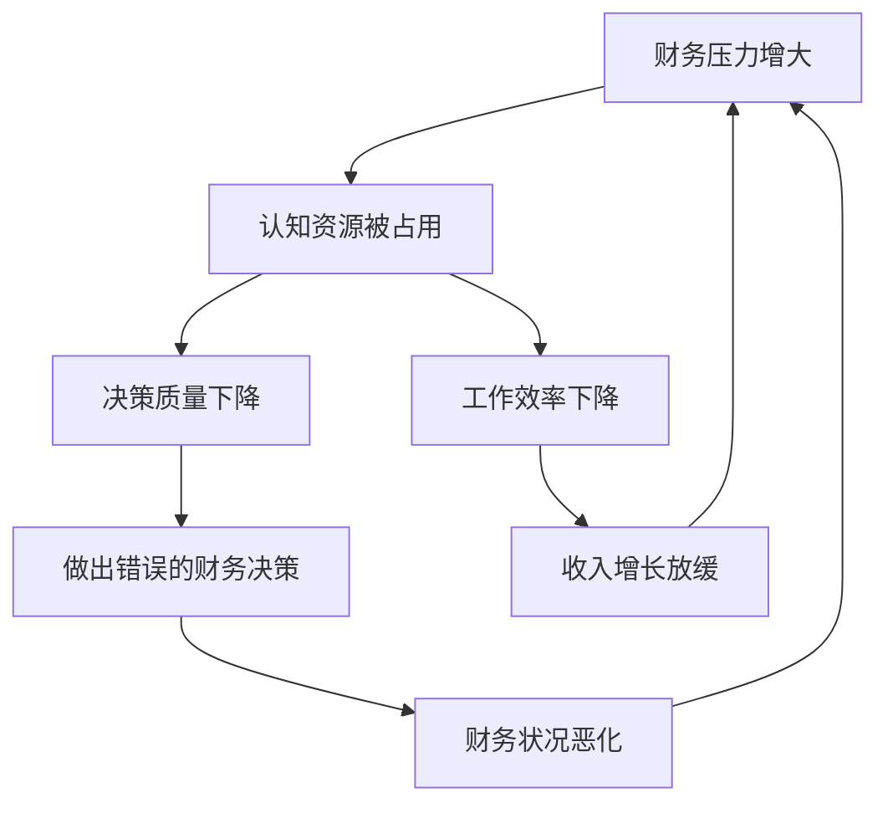
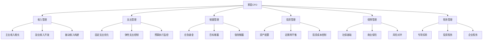
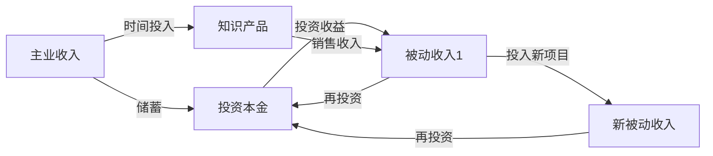

# 深度拓展：30-40岁的财务压力、系统规划与实战突围

30-40岁是人生财务压力最集中的阶段。本章从"三明治一代"的真实困境出发，系统拆解家庭财务规划、职业转型、投资优化、教育金筹备、夫妻财务协同、父母养老、被动收入构建、房贷优化和债务管理等关键议题，每个主题都提供可落地的框架、具体案例和实操工具。

***

## 一、中年财务压力全景分析

### 1.1 "三明治一代"的财务困境模型

30-40岁的人在家庭财务结构中处于"承上启下"的枢纽位置——上有年迈父母需要赡养，下有年幼子女需要抚养，中间还有自己的职业发展和生活品质需要维持。这种结构性压力并非偶然，而是中国社会经济发展阶段的必然产物。

根据中国家庭金融调查（CHFS）的数据，30-40岁年龄段的家庭财务压力呈现如下分布：

| 压力来源 | 占家庭收入比例 | 压力峰值年龄段 | 典型月支出（一线城市） |
|----------|---------------|---------------|---------------------|
| 住房（房贷+物业+维护） | 30%-50% | 30-35岁 | 15,000-30,000元 |
| 子女养育 | 15%-25% | 32-40岁 | 5,000-15,000元 |
| 父母赡养 | 5%-15% | 35-40岁 | 2,000-8,000元 |
| 职业发展投入 | 3%-8% | 30-38岁 | 1,000-3,000元 |
| 保险保障 | 5%-10% | 30-40岁 | 1,500-4,000元 |

**住房压力的深层结构：**

住房不仅仅是房贷月供的问题。对于30-40岁的家庭，住房压力是一个多层结构：

- **月供层**：房贷月供占家庭税后收入的30%-50%，这是最直观的压力
- **装修层**：新房装修通常需要20-50万元，且往往在购房后1-2年内发生
- **维护层**：物业费（200-800元/月）、维修基金、家电更换等持续支出
- **升级层**：学区房需求、改善型换房需求，可能在子女3-6岁时集中爆发
- **政策层**：限购限贷政策的变化可能影响换房计划

**子女养育的阶段化支出模型：**

子女养育的财务压力并非均匀分布，而是呈现阶段性高峰：

```text
孕产期(0-1岁)    ████████████  高峰（产检+分娩+月子+奶粉）
幼儿期(1-3岁)    ██████████    中高（托育+奶粉+日用品）
学前期(3-6岁)    ████████████████  最高峰（幼儿园+兴趣班+早教）
小学期(6-12岁)   ████████████  高峰（课外辅导+特长培养）
初中期(12-15岁)  ██████████████  高峰（学科辅导+中考准备）
高中期(15-18岁)  ████████████  高峰（高考冲刺+可能的国际路线）
```

关键洞察：如果你在30岁生孩子，那么35-45岁将是子女教育支出最集中的阶段，这恰好与父母赡养压力的高峰期重叠，形成"双重压力叠加"。

**赡养父母的隐性成本：**

赡养父母的显性支出（生活费、医疗费）往往只是冰山一角。隐性成本包括：

- **时间成本**：陪父母看病、处理养老事务占用的工作时间
- **机会成本**：为了照顾父母可能放弃异地晋升或创业机会
- **情感成本**：照护压力带来的心理负担，影响工作效率和家庭关系
- **住房成本**：可能需要换更大的房子以容纳父母同住

### 1.2 财务压力的心理影响机制

长期的财务压力不仅影响银行账户，更会深刻影响心理健康和决策质量。理解这些机制，才能有针对性地应对。

**认知隧道效应（Tunneling Effect）：**

哈佛大学教授Sendhil Mullainathan的研究发现，财务压力会让人进入"认知隧道"——大脑被眼前的财务问题占据，导致对其他重要事务的注意力和判断力显著下降。具体表现为：

- 只关注短期现金流，忽视长期资产积累
- 为了缓解眼前的财务焦虑，做出冲动消费决策（"反正也存不下钱"）
- 无法有效评估风险和机会，错过重要的投资或职业机会
- 工作效率下降，因为大量认知资源被财务焦虑占用

**压力-决策恶性循环：**



**对人际关系的影响：**

中国人民大学的一项调查显示，在导致离婚的前五位原因中，"经济问题"始终位居前三。财务压力对夫妻关系的影响路径是：

1. 财务焦虑 → 情绪不稳定 → 家庭冲突增加
2. 消费分歧 → 互相指责 → 信任下降
3. 经济压力 → 社交缩减 → 孤立感增强
4. 职业压力 → 陪伴减少 → 亲密关系疏远

### 1.3 应对财务压力的系统化策略

**策略一：建立"三层财务缓冲区"**

传统的"应急基金"概念过于单一。30-40岁家庭需要建立三层缓冲区：

| 层级 | 名称 | 规模 | 存放形式 | 用途 |
|------|------|------|----------|------|
| 第一层 | 日常缓冲 | 1个月支出 | 银行活期/零钱通 | 应对工资延迟、小额意外 |
| 第二层 | 应急基金 | 6个月支出 | 货币基金/短期理财 | 应对失业、疾病、意外 |
| 第三层 | 风险储备金 | 12个月支出 | 中低风险理财 | 应对重大变故（大病、行业衰退） |

**策略二：实施"压力可视化"管理**

将财务压力从模糊的焦虑转化为可量化、可管理的数据：

1. **列出所有负债**：房贷余额、车贷余额、消费贷余额、亲友借款
2. **计算负债收入比（DTI）**：月还款总额 / 月税后收入。DTI < 30% 为健康，30%-50% 为警戒，> 50% 为危险
3. **计算财务自由进度**：被动收入 / 必要支出。从0%开始，目标100%
4. **绘制净资产曲线**：每季度更新，观察增长趋势

**策略三：建立"财务减压"仪式**

- **每周15分钟**：快速浏览所有账户余额，确认资金安全
- **每月1小时**：复盘上月收支，调整下月预算
- **每季度半天**：全面审视投资组合、保险保障、财务目标进度
- **每年一天**：与配偶进行年度财务规划会议，设定新年度目标

***

## 二、家庭财务规划的系统化工程

### 2.1 家庭CFO的六维管理框架

把家庭当作一家公司来经营，你就是家庭的CFO（首席财务官）。这个框架包含六个维度：



### 2.2 家庭预算的实战系统

**"50/30/20"法则的中国化改造：**

原版50/30/20法则源自美国，直接套用到中国高房价环境会失真。建议根据中国中产家庭的实际进行调整：

| 支出类别 | 原版比例 | 调整后比例 | 说明 |
|----------|----------|-----------|------|
| 必要支出 | 50% | 55%-65% | 中国房贷压力远高于欧美 |
| 弹性支出 | 30% | 15%-25% | 需要压缩以适应高住房成本 |
| 储蓄投资 | 20% | 20%-25% | 保持最低储蓄率，不可压缩 |

**"信封法"数字化实施：**

传统信封法是把现金分装到不同信封中，每个信封对应一个支出类别。数字化版本：

1. 开设多个银行账户（或使用同一银行的子账户功能），分别对应：
   - 生活账户（日常消费）
   - 固定账户（房贷、保险等自动扣款）
   - 子女账户（教育支出）
   - 父母账户（赡养支出）
   - 自由账户（个人消费，无需向配偶解释）
2. 每月发工资后，立即按比例转入各账户
3. 各账户独立管理，互不挪用

**预算执行的"红黄绿灯"系统：**

- **绿灯（< 80%）**：支出在预算范围内，正常执行
- **黄灯（80%-100%）**：接近预算上限，需要注意控制
- **红灯（> 100%）**：超支，需要立即暂停该类别非必要支出

实施建议：使用随手记、挖财或Money Pro等记账App，设置各类别的预算上限和预警阈值。

### 2.3 家庭资产配置的动态模型

**生命周期资产配置的精细化方案：**

传统的"100-年龄=股票比例"过于粗糙。更科学的方法是根据家庭的"财务生命周期"来调整：

| 家庭阶段 | 股票类 | 债券类 | 现金类 | 另类资产 | 说明 |
|----------|--------|--------|--------|----------|------|
| 新婚无孩（30-32岁） | 50%-60% | 20%-25% | 10% | 5%-10% | 收入增长期，可承受较高风险 |
| 一孩家庭（32-37岁） | 40%-50% | 25%-30% | 15% | 5%-10% | 负债增加，风险承受力下降 |
| 二孩/赡养期（37-40岁） | 35%-45% | 30%-35% | 15% | 5%-10% | 责任最重，稳健优先 |

**资产配置的"压力测试"：**

在确定资产配置方案前，进行以下压力测试：

1. **极端市场测试**：假设股票下跌50%，你的家庭财务能否承受？（对应2008年、2015年级别）
2. **失业测试**：假设主要收入来源中断6个月，你的应急基金能否覆盖？
3. **利率上升测试**：假设房贷利率上升2个百分点，月供增加多少？能否承受？
4. **医疗支出测试**：假设家庭成员发生重大疾病，自费部分需要多少？保险能覆盖多少？

### 2.4 年度家庭财务审计模板

每年至少进行一次全面的家庭财务审计：

```markdown
# 家庭年度财务审计（____年度）

## 一、资产盘点
- 现金及等价物：____元
- 投资资产（股票/基金/债券）：____元
- 房产市值：____元
- 车辆残值：____元
- 其他资产：____元
- **资产合计：____元**

## 二、负债盘点
- 房贷余额：____元
- 车贷余额：____元
- 消费贷余额：____元
- 信用卡欠款：____元
- 其他负债：____元
- **负债合计：____元**

## 三、净资产 = 资产合计 - 负债合计 = ____元
## 四、净资产增长率 = (本年净资产 - 上年净资产) / 上年净资产 = ____%
## 五、储蓄率 = (年收入 - 年支出) / 年收入 = ____%

## 六、保险保障审计
- 定期寿险保额：____万（是否覆盖负债+5年支出？）
- 重疾险保额：____万（是否覆盖3-5年收入？）
- 医疗险：是否覆盖所有家庭成员？____
- 意外险保额：____万

## 七、投资组合审计
- 当前资产配置比例：股票__% / 债券__% / 现金__% / 其他__%
- 是否需要再平衡？____
- 年化收益率：____%
- 投资成本（费率）：____%

## 八、下年度目标
- 净资产目标：____元
- 储蓄率目标：____%
- 投资收益目标：____%
- 保障优化计划：____
```

***

## 三、职业中期转型的深度分析与实战路径

### 3.1 职业转型的决策矩阵

并非所有人都需要转型，也并非所有转型都是正确的选择。使用以下决策矩阵来判断：

| 评估维度 | 低分（1-3） | 中分（4-6） | 高分（7-10） |
|----------|-----------|-----------|-------------|
| 行业前景 | 行业衰退/萎缩 | 行业稳定 | 行业高速增长 |
| 个人成长空间 | 已触天花板 | 有一定空间 | 大量未开发机会 |
| 收入增长潜力 | 增长停滞 | 缓慢增长 | 快速增长 |
| 工作满意度 | 严重倦怠 | 一般 | 充满热情 |
| 个人竞争优势 | 无明显优势 | 有一定竞争力 | 核心竞争力强 |
| 家庭财务缓冲 | < 6个月支出 | 6-12个月支出 | > 12个月支出 |

**评分建议：**
- 总分 < 30分：强烈建议转型
- 总分 30-45分：可以考虑渐进式转型
- 总分 45-60分：暂不转型，先在现有岗位寻求突破
- 总分 > 60分：不建议转型，当前状态良好

### 3.2 四种转型路径及其财务影响

**路径一：行业内垂直转型（同行业换岗位）**

- **典型路径**：技术骨干 → 技术管理者 → 产品总监
- **财务影响**：收入可能短期持平或小幅增长（5%-15%），长期增长潜力大
- **风险等级**：低
- **准备周期**：3-6个月
- **案例**：张某，32岁，某互联网公司高级工程师，年薪45万。利用业余时间学习产品管理知识，参与内部产品项目，6个月后成功转岗为产品经理。转岗后第一年薪资持平，第二年跳槽后涨薪30%。

**路径二：跨行业平行转型（不同行业类似职能）**

- **典型路径**：传统行业销售 → 互联网行业销售
- **财务影响**：收入可能短期下降10%-20%，需要1-2年恢复
- **风险等级**：中等
- **准备周期**：6-12个月
- **案例**：李某，35岁，某传统制造业区域销售经理，年薪50万。看到行业增长放缓，用8个月时间学习SaaS行业知识，通过行业社群结识人脉，最终加入一家SaaS公司担任销售总监，起薪42万，但两年后因公司上市，期权价值超过200万。

**路径三：职能转型（跨行业跨职能）**

- **典型路径**：银行客户经理 → 保险经纪人/理财规划师
- **财务影响**：收入短期可能下降30%-50%，恢复期2-3年
- **风险等级**：高
- **准备周期**：12-24个月
- **案例**：王某，36岁，某股份制银行客户经理，年薪35万。对独立理财规划更感兴趣，用18个月考取CFP（注册理财规划师）和基金从业资格，同时积累客户资源。转型第一年收入仅18万，第二年恢复到30万，第三年突破60万。

**路径四：创业转型（从雇员到老板）**

- **典型路径**：利用行业经验和技术能力创业
- **财务影响**：收入可能短期归零甚至负现金流，成功后收入可能数倍增长
- **风险等级**：极高
- **准备周期**：6-24个月
- **案例**：赵某，38岁，某电商公司运营总监，年薪80万。发现某个细分品类的机会，利用2年时间在业余时间验证商业模式，积累了1000个种子用户后全职创业。前两年几乎无收入（靠配偶收入+积蓄维持），第三年公司盈利，年收入突破150万。

### 3.3 转型期的财务安全网搭建

**转型前的"安全清单"：**

在正式启动转型之前，务必完成以下准备工作：

1. **现金储备**：至少12个月家庭总支出（含房贷、保险、子女教育等刚性支出）
2. **债务清理**：还清所有消费贷和信用卡分期，只保留房贷
3. **保险加固**：确保重大疾病保险和意外保险覆盖充足，防止转型期的健康风险
4. **配偶共识**：与配偶充分讨论转型计划、时间表和财务预案，获得情感和财务支持
5. **副业验证**：在全职转型前，先通过兼职、周末项目等方式验证新方向的可行性
6. **退出机制**：设定明确的"止损点"——如果转型N个月后收入低于X，启动Plan B

**转型期的现金流管理：**

转型期的现金流管理原则是"保刚性、压弹性、建缓冲"：

| 支出类别 | 处理方式 | 说明 |
|----------|----------|------|
| 房贷 | 正常还款 | 不可中断，影响征信 |
| 保险 | 正常缴费 | 转型期风险更高，保障不可缺 |
| 子女教育 | 维持基本支出 | 压缩兴趣班，保留核心教育 |
| 父母赡养 | 维持基本支出 | 与父母沟通，争取理解 |
| 日常生活 | 压缩20%-30% | 减少外出就餐、购物等弹性支出 |
| 社交应酬 | 压缩50% | 转型期社交重心转向目标行业 |
| 个人发展 | 集中投入 | 培训、考证等费用是必要投资 |

### 3.4 可迁移技能的系统化构建

30-40岁的职业转型最大的优势是积累了大量"可迁移技能"。这些技能不依赖于特定行业或岗位，可以在任何新领域发挥作用：

**硬技能（可直接迁移）：**

- **数据分析能力**：Excel/SQL/Python数据处理，几乎所有行业都需要
- **项目管理能力**：PMP/Scrum等项目管理方法论，跨行业通用
- **财务分析能力**：读懂财报、做预算、评估ROI，商业世界的基础语言
- **技术写作能力**：清晰的文档撰写、方案编写，任何岗位都需要

**软技能（间接迁移但价值巨大）：**

- **沟通协调能力**：跨部门协作、客户沟通、向上管理
- **问题解决能力**：结构化思考、根因分析、方案设计
- **团队管理能力**：人员招聘、绩效管理、团队建设
- **商业判断力**：市场洞察、竞争分析、战略规划

**技能迁移的"T型"结构：**

```text
← 广泛的可迁移技能（横向）→
         |
         |
    深度专业技能（纵向）
         |
         |
    行业Know-How
         ↓
```

转型时，你的横向技能是"底座"，让你在新领域快速上手；纵向技能需要在新领域重新建立，但有横向技能的支撑，建立速度会更快。

***

## 四、中年投资组合的深度优化

### 4.1 从"增长导向"到"目标导向"的转变

30-40岁的投资策略转变不是简单的"降低风险"，而是从"追求高收益"转向"确保目标达成"：

- **20多岁**：投资目标是"赚钱"，策略是激进增长
- **30-40岁**：投资目标是"确保子女教育金、父母养老、退休规划等刚性目标达成"，策略是平衡配置
- **40-50岁**：投资目标是"守住财富，稳健增长"，策略是保守配置

**目标分层的投资框架：**

| 目标层级 | 目标内容 | 时间跨度 | 投资策略 | 产品选择 |
|----------|----------|----------|----------|----------|
| 第一层 | 应急基金 | 随时可用 | 极保守 | 货币基金、银行活期 |
| 第二层 | 短期目标（旅行、大件） | 1-3年 | 保守 | 短债基金、银行理财 |
| 第三层 | 中期目标（子女教育、换房） | 3-10年 | 平衡 | 指数基金+债券基金 |
| 第四层 | 长期目标（退休） | 10年以上 | 进取 | 股票基金+指数基金 |
| 第五层 | 财富增值（超出需求的财富） | 20年以上 | 激进 | 个股+另类投资 |

### 4.2 核心-卫星策略的精细化实施

**核心资产配置方案（60%-70%）：**

核心资产的目标是获取市场平均回报，降低成本，长期持有：

| 资产类别 | 配置比例 | 推荐标的 | 预期年化收益 | 费率 |
|----------|----------|----------|-------------|------|
| A股宽基指数 | 25% | 沪深300ETF (510300) | 8%-12% | 0.15% |
| A股中小盘指数 | 10% | 中证500ETF (510500) | 10%-15% | 0.15% |
| 港股/美股指数 | 10% | 恒生科技ETF/标普500ETF | 8%-12% | 0.50% |
| 纯债基金 | 15% | 短债基金/中长期纯债基金 | 3%-5% | 0.30% |
| 货币基金 | 5% | 余额宝/零钱通 | 2%-3% | 0.30% |

**卫星资产配置方案（30%-40%）：**

卫星资产的目标是捕捉超额收益机会，允许更高的风险：

| 资产类别 | 配置比例 | 推荐方向 | 预期年化收益 | 风险等级 |
|----------|----------|----------|-------------|----------|
| 行业主题ETF | 10% | 消费、医药、新能源、半导体 | 15%-30% 或 -20% | 高 |
| 个股投资 | 10% | 精选3-5只高确定性个股 | 15%-25% 或 -30% | 高 |
| REITs | 5% | 公募REITs（产业园区、高速公路） | 6%-10% | 中 |
| 黄金ETF | 3% | 黄金ETF (518880) | 5%-10% | 中 |
| 海外基金 | 2% | QDII基金（科技/医疗） | 10%-15% | 中高 |

### 4.3 再平衡的"双触发"机制

再平衡是投资纪律中最容易被忽视但最重要的环节。

**触发条件一：时间触发**
- 每半年（6月和12月）检查一次投资组合
- 如果某类资产偏离目标比例超过5个百分点，进行再平衡

**触发条件二：阈值触发**
- 任何时候，如果某类资产偏离目标比例超过10个百分点，立即再平衡
- 这通常发生在市场剧烈波动时（如暴跌或暴涨）

**再平衡的实操步骤：**

1. 计算当前各类资产的实际占比
2. 与目标占比进行对比
3. 偏离超过阈值的资产，卖出超配部分，买入低配部分
4. 优先通过"新增资金"进行调整（避免卖出产生税费）
5. 记录调整操作，用于年终回顾

**再平衡的收益测算：**

假设初始配置为60%股票+40%债券，年化收益8%：

| 策略 | 10年终值 | 20年终值 | 30年终值 |
|------|----------|----------|----------|
| 不再平衡 | 215,892元 | 466,096元 | 1,006,266元 |
| 年度再平衡 | 219,112元 | 480,102元 | 1,051,961元 |
| 半年度再平衡 | 220,045元 | 485,216元 | 1,067,228元 |

注：基于10万元初始投资，每次再平衡假设0.5%交易成本。再平衡通过"卖高买低"的纪律效应，30年可多赚约6万元。

### 4.4 投资成本的长期影响

**费率差异的复利效应：**

| 年化收益 | 管理费率 | 实际收益 | 10年终值（10万本金） | 30年终值 |
|----------|----------|----------|---------------------|----------|
| 8% | 0.2% | 7.8% | 211,700 | 945,300 |
| 8% | 0.5% | 7.5% | 206,100 | 875,500 |
| 8% | 1.0% | 7.0% | 196,720 | 761,226 |
| 8% | 1.5% | 6.5% | 187,714 | 661,437 |
| 8% | 2.0% | 6.0% | 179,085 | 574,349 |

管理费每增加0.5个百分点，30年后的终值减少约10%-15%。这就是为什么指数基金（费率0.15%-0.5%）通常优于主动管理基金（费率1.0%-2.0%）的根本原因。

**需要关注的隐性成本：**

- **交易佣金**：每次买卖的佣金，频繁交易会大幅侵蚀收益
- **印花税**：卖出股票时征收0.05%的印花税
- **基金申赎费**：短期持有（< 7天）赎回费率高达1.5%
- **跟踪误差**：指数基金与实际指数之间的偏差
- **冲击成本**：大额交易对市场价格的影响

***

## 五、子女教育金的深度规划

### 5.1 教育成本的精细化估算

**公立教育路径详细成本分解：**

| 阶段 | 年限 | 学费/年 | 课外/年 | 生活/年 | 年均总支出 | 阶段总支出 |
|------|------|---------|---------|---------|-----------|-----------|
| 幼儿园（公立） | 3年 | 1-2万 | 1-3万 | 2-3万 | 4-8万 | 12-24万 |
| 小学（公立） | 6年 | 0.5-1万 | 2-5万 | 2-3万 | 4.5-9万 | 27-54万 |
| 初中（公立） | 3年 | 0.5-1万 | 3-6万 | 2-3万 | 5.5-10万 | 16.5-30万 |
| 高中（公立） | 3年 | 1-2万 | 3-6万 | 2-3万 | 6-11万 | 18-33万 |
| 大学（国内一本） | 4年 | 0.6-1万 | 1-2万 | 2-4万 | 3.6-7万 | 14.4-28万 |
| **公立路径合计** | **19年** | | | | | **87.9-169万** |

**私立/国际教育路径详细成本分解：**

| 阶段 | 年限 | 学费/年 | 课外/年 | 生活/年 | 年均总支出 | 阶段总支出 |
|------|------|---------|---------|---------|-----------|-----------|
| 国际幼儿园 | 3年 | 8-15万 | 3-5万 | 3-5万 | 14-25万 | 42-75万 |
| 国际学校小学 | 6年 | 10-20万 | 5-10万 | 3-5万 | 18-35万 | 108-210万 |
| 国际学校中学 | 6年 | 12-25万 | 5-10万 | 3-5万 | 20-40万 | 120-240万 |
| 海外大学 | 4年 | 20-40万 | 5-10万 | 10-20万 | 35-70万 | 140-280万 |
| **国际路径合计** | **19年** | | | | | **410-805万** |

### 5.2 教育金投资的"目标倒推法"

**计算步骤：**

1. **确定目标金额**：根据教育路径选择，确定总教育金需求
2. **考虑通胀因素**：教育成本年均通胀率约5%-8%
3. **确定投资期限**：从现在到子女入学的时间
4. **选择投资工具**：根据期限确定风险偏好
5. **计算每月定投金额**

**案例：为新生儿准备国内一本教育金**

- 目标：18岁时积累150万元（考虑5%年通胀率后的实际购买力）
- 投资期限：18年
- 预期年化收益：6%（平衡型配置）
- 计算结果：每月需定投约3,800元

```text
月定投金额 = 目标金额 × 月利率 / ((1+月利率)^期数 - 1)
           = 1,500,000 × 0.5% / ((1+0.5%)^216 - 1)
           ≈ 3,800元/月
```

**不同场景下的定投金额参考（目标150万，年化6%）：**

| 开始年龄 | 剩余年数 | 每月定投金额 | 总投入本金 |
|----------|----------|-------------|-----------|
| 出生 | 18年 | 3,800元 | 82万 |
| 3岁 | 15年 | 5,200元 | 94万 |
| 6岁 | 12年 | 7,500元 | 108万 |
| 10岁 | 8年 | 12,500元 | 120万 |
| 12岁 | 6年 | 18,000元 | 130万 |

越早开始，每月负担越轻，总投入本金也越少。这就是"时间的力量"。

### 5.3 教育金的"三层防御"策略

不要把所有教育金放在同一个篮子里。建议采用"三层防御"策略：

**第一层：保底层（占教育金的40%-50%）**

- **目标**：确保子女无论如何都能接受基本教育
- **工具**：教育金保险、定期存款、国债
- **特点**：确定性高，收益低（3%-4%），但本金安全
- **操作**：从子女出生开始，每年存入固定金额

**第二层：增长层（占教育金的30%-40%）**

- **目标**：通过长期投资获取超越通胀的收益
- **工具**：指数基金定投、平衡型基金
- **特点**：有波动，但长期年化收益可达6%-10%
- **操作**：每月定投，子女年龄越大（距离用钱越近），逐渐降低股票比例

**第三层：机会层（占教育金的10%-20%）**

- **目标**：捕捉超额收益机会，提升教育金总额
- **工具**：行业主题基金、海外基金
- **特点**：波动大，收益潜力高
- **操作**：仅用"可承受损失"的资金，不与保底层混同

### 5.4 留学费用的汇率风险管理

如果计划送子女出国留学，汇率风险是不可忽视的因素。以美国留学为例：

**汇率影响测算：**

假设留学费用为每年50万元人民币（约7万美元）：

| 汇率 | 4年总费用（人民币） | 与基准差异 |
|------|-------------------|-----------|
| 6.5（人民币升值） | 182万 | -18万 |
| 7.0（基准） | 200万 | 基准 |
| 7.5（人民币贬值） | 220万 | +20万 |
| 8.0（大幅贬值） | 240万 | +40万 |

**汇率风险对冲策略：**

1. **分散购汇**：从子女出生开始，每年购入一定金额的外汇，分散汇率波动风险
2. **外汇定投**：每月定额购汇，利用"成本平均法"平滑汇率波动
3. **外汇理财**：将外汇存入外币理财产品，获取利息收益的同时持有外币资产
4. **留学贷款准备**：了解银行留学贷款产品，作为汇率大幅波动时的应急方案

***

## 六、夫妻财务沟通的深度实操

### 6.1 金钱观差异的根源分析

夫妻之间的财务冲突往往不是"谁对谁错"的问题，而是"不同的金钱操作系统"在碰撞。理解差异的根源，才能找到共存之道。

**原生家庭的影响模型：**

| 成长环境 | 典型金钱观 | 消费特征 | 投资偏好 |
|----------|-----------|----------|----------|
| 工薪家庭 | 储蓄优先，量入为出 | 精打细算，厌恶浪费 | 保守，偏好存款 |
| 经商家庭 | 钱是工具，要流动 | 敢于消费，重视面子 | 进取，愿意冒险 |
| 知识分子家庭 | 精神追求高于物质 | 重教育轻消费 | 稳健，偏好基金 |
| 贫困家庭 | 安全感缺失，囤积 | 极度节俭或报复性消费 | 极度保守或极度投机 |

**识别差异的"金钱观对话"清单：**

与配偶各自独立回答以下问题，然后对比讨论：

1. 你家里的经济状况如何？（富裕/一般/困难）
2. 你父母的消费习惯是什么？（节俭/适中/大方）
3. 你家里的财务管理方式是什么？（谁管钱？有没有讨论过钱？）
4. 你第一次对"钱"有强烈感受是什么时候？什么事？
5. 你觉得"多少钱算够"？这个数字是怎么来的？
6. 你最担心的财务场景是什么？
7. 你愿意为哪些东西花钱？不愿意为哪些花钱？
8. 如果突然有了100万元，你会怎么处理？

### 6.2 夫妻财务管理的三种模式深度对比

**模式一：完全共同账户**

```text
收入A ──→ ┌──────────┐ ←── 收入B
          │ 共同账户  │
          └──────────┘
               ↓
          所有支出
```

- **适用条件**：收入相近、消费观相近、信任度高
- **优势**：透明度最高，便于统一管理，减少决策冲突
- **劣势**：个人自主权低，可能引发"每笔消费都要汇报"的窒息感
- **风险**：如果一方有隐性债务或不良消费习惯，会直接暴露引发冲突

**模式二：完全独立账户**

```text
收入A ──→ ┌──────────┐    收入B ──→ ┌──────────┐
          │ 账户A     │              │ 账户B     │
          └──────────┘              └──────────┘
               ↓                        ↓
          个人支出                   个人支出
               ↓                        ↓
          ┌──────────────────────────────────┐
          │     共同支出按约定比例分担        │
          └──────────────────────────────────┘
```

- **适用条件**：收入差距大、消费观差异大、需要保持个人独立性
- **优势**：个人自主权最高，减少因消费习惯差异引发的冲突
- **劣势**：可能导致家庭财务目标不一致，"AA制"可能伤害亲密感
- **风险**：共同支出的分担比例容易引发争议，尤其是收入变化时

**模式三：混合模式（推荐）**

```text
收入A ──→ ┌──────────┐ ←── 收入B
          │ 共同账户  │ ←── 房贷/子女/日常
          └──────────┘
               ↓
收入A的20% → 个人账户A ← 自由消费（无需解释）
收入B的20% → 个人账户B ← 自由消费（无需解释）
```

- **适用条件**：大多数30-40岁家庭
- **操作方法**：
  1. 双方将约定比例的收入（如80%）转入共同账户
  2. 共同账户用于房贷、子女教育、保险、日常生活等共同支出
  3. 各自保留约定比例（如20%）作为个人自由消费金
  4. 个人消费无需向对方解释或报备
  5. 共同账户的余额用于储蓄和投资

### 6.3 "家庭财务会议"的标准化流程

**频率**：每月一次，每次30-60分钟

**会前准备（各自5分钟）：**
- 回顾本月个人消费情况
- 思考下月的大额支出计划
- 记录任何财务方面的担忧或想法

**会议流程：**

| 环节 | 时长 | 内容 | 注意事项 |
|------|------|------|----------|
| 开场 | 2分钟 | 感谢对方参与，设定积极基调 | 不要在情绪不好时开会 |
| 上月回顾 | 10分钟 | 收支情况、预算执行、意外支出 | 只看数据，不做评判 |
| 本月计划 | 10分钟 | 预期收入、计划支出、大额购买 | 双方都有发言权 |
| 目标进度 | 10分钟 | 储蓄目标、投资进展、还贷进度 | 关注进展，而非差距 |
| 问题讨论 | 15分钟 | 财务分歧、担忧、新想法 | 用"我感觉"而非"你总是" |
| 总结行动 | 3分钟 | 明确各方的行动项和时间表 | 写下来，下次检查 |

**会议"三不"原则：**
1. **不翻旧账**：只讨论当前和未来，不追究过去的消费
2. **不做人身攻击**：讨论问题本身，不指责对方的性格或习惯
3. **不在疲惫/饥饿/情绪差时开会**：选择双方状态好的时间

### 6.4 财务冲突的"非暴力沟通"四步法

当夫妻之间出现财务分歧时，使用非暴力沟通（NVC）的四步法：

1. **观察**（说出事实，不评判）："这个月你在服装上的支出是3000元，超出了我们约定的预算。"
2. **感受**（说出自己的感受）："我感到有些担心，因为这影响了我们的储蓄计划。"
3. **需要**（说出自己的需求）："我需要我们的储蓄目标能够按计划推进，这让我感到安心。"
4. **请求**（提出具体请求）："下个月我们能一起看看预算是否需要调整？或者一起想想有没有什么可以优化的地方？"

**对比：暴力沟通 vs 非暴力沟通**

| 场景 | 暴力沟通 | 非暴力沟通 |
|------|----------|-----------|
| 配偶超支 | "你怎么又乱花钱！你就是管不住自己！" | "这个月超支了2000元，我有些担心储蓄目标，我们一起看看怎么调整？" |
| 投资亏损 | "我早说了不要买这个！你就是不听！" | "这笔投资亏损了，我感到有些焦虑，我们一起评估一下接下来怎么做？" |
| 不愿记账 | "你从来不关心家里的钱！就知道花！" | "我希望我们都能了解家里的财务状况，每周花15分钟一起看看账单好不好？" |

***

## 七、父母养老的系统化财务规划

### 7.1 父母养老的三层保障体系

赡养父母是30-40岁家庭的刚性责任，但很多家庭对此缺乏系统规划，直到父母生病才手忙脚乱。

**第一层：基本生活保障**

| 项目 | 月均支出（二三线城市） | 月均支出（一线城市） | 说明 |
|------|---------------------|---------------------|------|
| 日常生活 | 1,500-3,000元 | 3,000-5,000元 | 食品、水电、通讯 |
| 医疗保健 | 500-1,000元 | 1,000-2,000元 | 常规药品、体检 |
| 社交娱乐 | 300-500元 | 500-1,000元 | 兴趣爱好、社交 |
| **合计** | **2,300-4,500元** | **4,500-8,000元** | |

**第二层：医疗风险保障**

父母的医疗费用是养老规划中最大的不确定性。建议：

1. **社保为基础**：确保父母参加城乡居民医保或职工医保
2. **补充商业保险**：
   - 如果父母60岁以下且健康：优先购买百万医疗险（年保费1000-3000元/人）
   - 如果父母60岁以上或有慢性病：购买防癌险（年保费500-1500元/人）
   - 为父母购买意外险（年保费200-500元/人）
3. **大病储备金**：为每位父母准备20-50万元的大病储备金
4. **了解大病医保政策**：不同城市的大病医保报销比例和上限不同，提前了解

**第三层：长期照护保障**

如果父母需要长期照护（如失能、失智），费用可能远超预期：

| 照护方式 | 月均费用 | 适用情况 |
|----------|----------|----------|
| 居家照护（保姆） | 5,000-10,000元 | 轻度失能，家庭有条件 |
| 社区日间照料 | 2,000-5,000元 | 白天需要照护，晚上可回家 |
| 养老机构（普通） | 3,000-6,000元 | 中度失能，需要专业照护 |
| 养老机构（高端） | 8,000-20,000元 | 需要高品质照护和环境 |
| 护理院 | 6,000-15,000元 | 重度失能，需要医疗级照护 |

### 7.2 父母养老的沟通策略

很多中国家庭避讳谈论养老话题，但提前沟通可以避免很多后续的冲突和遗憾。

**"四个必谈"清单：**

1. **财务状况**：父母有多少积蓄？有哪些收入来源（退休金、存款、房租）？有哪些负债？
2. **健康状况**：父母有哪些慢性病？正在服用什么药物？有没有未完成的治疗？
3. **养老意愿**：父母希望居家养老还是去养老机构？对医疗抢救的态度？遗产分配的想法？
4. **应急联系**：紧急联系人是谁？父母的常用药物在哪里？医保卡和病历在哪里？

**沟通技巧：**

- 不要一次谈完所有话题，分多次渐进式沟通
- 用"我在学习养老规划知识"作为切入话题的理由
- 从身边人的故事说起，避免直接问"你有多少钱"
- 尊重父母的自主权，提供选项而非命令

### 7.3 养老金缺口的测算与弥补

**测算公式：**

```text
养老金缺口 = 父母年生活费 × 预期剩余寿命 - 父母现有积蓄和收入
```

**案例：**

- 父亲62岁，母亲60岁，均有基本养老金（合计5000元/月）
- 月生活支出约8000元（含医疗）
- 现有积蓄约30万元
- 预期寿命80岁

```text
年缺口 = (8000 - 5000) × 12 = 36,000元
总缺口 = 36,000 × 20年 = 720,000元
考虑医疗储备金 300,000元
总计需准备 = 720,000 + 300,000 - 300,000（现有积蓄）= 720,000元
```

**弥补缺口的方法：**

1. **每月定额赡养**：子女每月给父母2000-3000元生活补贴
2. **医疗储备金专户**：为父母单独设立一个医疗储备账户，每月存入1000-2000元
3. **养老资产配置**：用父母的积蓄进行低风险投资（国债、大额存单），获取稳定收益
4. **政策利用**：了解当地的养老补贴、高龄补贴、护理补贴等政策

***

## 八、被动收入体系的构建

### 8.1 被动收入的定义与层次

被动收入是指不需要持续投入大量时间和精力就能获得的收入。但"被动"是相对的——前期需要大量投入，后期才能实现"被动"。

**被动收入的三个层次：**

| 层次 | 类型 | 前期投入 | 维护成本 | 典型收益 | 门槛 |
|------|------|----------|----------|----------|------|
| 第一层 | 金融资产收入 | 资金 | 低 | 股息、利息、分红 | 低 |
| 第二层 | 知识产权收入 | 时间+技能 | 中低 | 版税、课程费、授权费 | 中 |
| 第三层 | 系统运营收入 | 时间+资金+技能 | 中 | 租金、平台收入、自动化业务 | 高 |

### 8.2 适合30-40岁的被动收入方案

**方案一：指数基金分红+增值**

- **投入**：每月定投3000-5000元
- **周期**：10年以上
- **预期收益**：年化6%-10%
- **操作**：选择分红型指数基金（如红利ETF），长期持有
- **适合人群**：有稳定收入，缺乏投资时间的上班族

**方案二：知识产品（课程/电子书/专栏）**

- **投入**：6-12个月的业余时间
- **周期**：上线后可持续收入2-5年
- **预期收益**：年收入3-20万元（取决于内容质量和推广能力）
- **操作**：将自己的专业经验整理成体系化内容，在知识付费平台发布
- **适合人群**：在某个领域有深度经验的专业人士

**方案三：自动化电商/内容平台**

- **投入**：3-6个月搭建期 + 少量启动资金
- **周期**：持续运营
- **预期收益**：月收入3000-30000元
- **操作**：搭建自动化内容矩阵（如SEO网站、自动化社交媒体账号），通过广告或联盟营销变现
- **适合人群**：有技术能力或内容创作能力的人

**方案四：房产租金收入**

- **投入**：首付 + 装修费用（通常50-200万元）
- **周期**：长期持有
- **预期收益**：年租金回报率2%-5%（一线城市偏低，二三线城市偏高）
- **操作**：购买出租型房产，委托中介管理
- **适合人群**：有一定资金积累，且当地房产市场有投资价值

### 8.3 被动收入的"复利飞轮"

被动收入的真正威力不在于单个来源，而在于多个来源形成的"复利飞轮"：



关键原则：前期用主业收入养被动收入，后期用被动收入替代主业收入。

***

## 九、房贷管理与优化策略

### 9.1 房贷的深度分析框架

房贷是大多数30-40岁家庭最大的单项负债。对房贷的深度理解和优化，可以节省数十万元的利息支出。

**等额本息 vs 等额本金的全面对比：**

以贷款100万元、利率4.2%、期限30年为例：

| 对比维度 | 等额本息 | 等额本金 |
|----------|----------|----------|
| 首月还款 | 4,891元 | 6,278元（逐月递减） |
| 末月还款 | 4,891元 | 2,787元 |
| 总利息 | 76.1万元 | 63.1万元 |
| 总还款 | 176.1万元 | 163.1万元 |
| 利息节省 | 基准 | 节省13万元 |
| 月供压力 | 前期较轻，全程固定 | 前期重，逐月递减 |

**选择建议：**

- **收入稳定且前期资金紧张**：选等额本息（月供固定，前期压力小）
- **收入较高且预期未来收入下降**：选等额本金（总利息少，前期多还后期少还）
- **计划提前还款**：等额本金更划算（前期还的本金多，剩余本金少，提前还款节省的利息更多）

### 9.2 提前还贷的决策模型

是否提前还贷是一个经典的财务决策问题，需要综合考虑多个因素。

**决策公式：**

```text
提前还贷的隐含收益率 = 房贷利率
提前还贷的机会成本 = 你用这笔钱投资能获得的收益率

如果房贷利率 > 投资收益率 → 提前还贷更划算
如果房贷利率 < 投资收益率 → 不提前还贷，把钱拿去投资
```

**实际案例分析：**

假设房贷余额50万元，利率4.2%，有50万元闲置资金：

| 选择 | 年化收益 | 10年后财富差异 |
|------|----------|---------------|
| 提前还贷 | 节省4.2%利息 | 基准 |
| 投资指数基金 | 预期8% | 多赚约22万元 |
| 投资债券基金 | 预期4% | 大致持平 |
| 存银行定期 | 2.5% | 少赚约9万元 |

**建议：** 如果你有稳定的投资能力（能获得年化6%以上的收益），且房贷利率在4%-5%以下，不建议提前还贷。如果你的投资能力有限，或者房贷利率较高（5%以上），提前还贷是更稳妥的选择。

### 9.3 房贷优化的其他策略

**策略一：LPR转换**

如果仍在使用固定利率，评估是否应该转换为LPR浮动利率：

- LPR下行周期：浮动利率更划算，月供会随LPR下降
- LPR上行周期：固定利率更稳定，不受加息影响
- 目前中国处于降息周期，LPR浮动利率通常更有利

**策略二：转贷降息**

部分银行提供"转贷"服务——将高利率房贷转到低利率银行。注意：

- 需要评估转贷的手续费和时间成本
- 确认新银行的利率确实更低
- 注意是否有提前还款的违约金

**策略三：利用公积金贷款**

公积金贷款利率（目前约3.1%）远低于商贷利率（约4.2%），最大化公积金贷款额度可以显著降低利息支出。

- 尽量先用足公积金额度，不足部分再用商贷
- 如果公积金缴存额度高，可以考虑提高公积金贷款比例
- 了解当地的公积金贷款政策（最高额度、缴存要求等）

***

## 十、债务管理的系统化方法

### 10.1 "好债"与"坏债"的区分

不是所有债务都是坏事。关键在于区分"好债"和"坏债"：

| 类型 | 定义 | 示例 | 处理策略 |
|------|------|------|----------|
| 好债 | 能产生收益或增值的负债 | 房贷（自住刚需）、教育贷款（提升收入）、经营贷款 | 合理利用，控制比例 |
| 中性债 | 消费需要但不产生收益 | 车贷（通勤需要） | 尽快还清，避免长期负债 |
| 坏债 | 纯消费型高息负债 | 信用卡分期（年化12%-18%）、消费贷、网贷 | 立即还清，停止使用 |

### 10.2 债务优化的"雪球法"与"雪崩法"

当有多笔债务需要偿还时，有两种主流方法：

**雪球法（Snowball Method）—— 情绪驱动**

- 优先偿还余额最小的债务
- 还清一笔后，将该笔的还款金额加到下一笔债务上
- 优点：快速获得"还清债务"的成就感，保持动力
- 缺点：可能不是利息成本最低的方案

**雪崩法（Avalanche Method）—— 数学最优**

- 优先偿还利率最高的债务
- 还清一笔后，将该笔的还款金额加到下一笔债务上
- 优点：总利息支出最少
- 缺点：高利率债务可能余额大，短期内看不到成果

**实际操作建议：**

1. 列出所有债务：名称、余额、利率、最低还款额
2. 如果你需要"成就感"来保持动力 → 用雪球法
3. 如果你理性能坚持 → 用雪崩法
4. 无论用哪种方法，都要保证所有债务的最低还款额按时支付

**案例：**

| 债务 | 余额 | 利率 | 最低月还款 |
|------|------|------|-----------|
| 信用卡分期 | 2万 | 15% | 2,000元 |
| 消费贷 | 5万 | 8% | 1,500元 |
| 车贷 | 10万 | 5% | 3,000元 |
| 房贷 | 80万 | 4.2% | 4,000元 |

雪崩法排序：信用卡(15%) → 消费贷(8%) → 车贷(5%) → 房贷(4.2%)
雪球法排序：信用卡(2万) → 消费贷(5万) → 车贷(10万) → 房贷(80万)

### 10.3 债务健康度评估

**关键指标：**

| 指标 | 计算方法 | 健康值 | 警戒值 | 危险值 |
|------|----------|--------|--------|--------|
| 负债收入比（DTI） | 月还款总额 / 月税后收入 | < 30% | 30%-50% | > 50% |
| 资产负债率 | 总负债 / 总资产 | < 40% | 40%-60% | > 60% |
| 偿债保障比率 | 流动资产 / 短期负债 | > 2 | 1-2 | < 1 |
| 利息覆盖率 | 年收入 / 年利息支出 | > 10 | 5-10 | < 5 |

**每月自查：**

- DTI是否在30%以内？如果超过，需要优先偿还高息债务
- 信用卡是否每月全额还款？如果只还最低还款额，年化利率高达15%-18%
- 是否有不必要的分期付款？评估是否可以提前结清
- 信用记录是否良好？定期查询个人征信报告（每年两次免费）

***

## 十一、30-40岁的财务检查清单与年度规划

### 11.1 资产负债检查（每季度）

- [ ] 更新资产清单：现金、投资、房产、车辆、其他资产
- [ ] 更新负债清单：房贷、车贷、消费贷、信用卡
- [ ] 计算净资产及其变化趋势（目标：年增长率 > 通胀率 + GDP增长率）
- [ ] 计算负债收入比（DTI），确保 < 30%
- [ ] 评估资产流动性（流动资产是否能覆盖6个月支出）

### 11.2 保险保障检查（每年）

- [ ] 定期寿险保额是否覆盖家庭负债 + 5-10年生活费用
- [ ] 重疾险保额是否覆盖3-5年收入
- [ ] 百万医疗险是否覆盖所有家庭成员（含父母）
- [ ] 意外险保额是否充足（建议100万以上）
- [ ] 是否需要根据家庭变化（新生儿、换房、升职）调整保额
- [ ] 父母的保险保障是否到位

### 11.3 投资组合检查（每半年）

- [ ] 当前资产配置比例是否符合目标
- [ ] 是否需要再平衡（偏离超过5%即需调整）
- [ ] 投资收益率是否达到预期（与基准指数对比）
- [ ] 投资成本是否在合理范围（总费率 < 0.5%）
- [ ] 是否有需要调整或退出的投资品种
- [ ] 教育金、养老金等专项投资是否按计划推进

### 11.4 债务管理检查（每季度）

- [ ] 房贷还款计划是否在正轨上
- [ ] 是否有可以提前偿还的高息负债
- [ ] 信用卡是否每月全额还款
- [ ] 个人征信报告是否正常（每年查询两次）
- [ ] 是否有优化贷款结构的机会（如转贷降息）

### 11.5 税务规划检查（每年）

- [ ] 个人所得税专项附加扣除是否充分利用
  - 子女教育：每个子女每月1000元
  - 继续教育：每月400元或每年3600元
  - 住房贷款利息：每月1000元
  - 住房租金：每月800-1500元
  - 赡养老人：每月2000-3000元
  - 大病医疗：年度超过15000元的部分，最高80000元
  - 3岁以下婴幼儿照护：每个婴幼儿每月2000元
- [ ] 年终奖计税方式是否最优（单独计税 vs 并入综合所得）
- [ ] 个人养老金账户是否开户并缴存（年缴上限12000元，可抵税）
- [ ] 投资收益的税务处理是否合规优化

### 11.6 遗产规划检查（每3-5年）

- [ ] 是否已立遗嘱（建议35岁以上考虑）
- [ ] 保险受益人是否需要更新（新生儿、离婚、再婚等情况）
- [ ] 是否需要为子女设立教育信托
- [ ] 房产、存款等资产的法律归属是否清晰

***

## 十二、实战案例：三个家庭的深度财务分析

### 案例一：双职工家庭的财务突围

**背景：** 丈夫35岁，IT工程师，年薪40万；妻子33岁，市场经理，年薪25万。有一个3岁女儿。一线城市，房贷月供1.5万元。

**问题诊断：**
- 月收入合计5.4万元，月支出约4.8万元，月储蓄率仅11%（远低于30%目标）
- 支出结构：房贷1.5万 + 子女0.8万 + 生活1.2万 + 父母0.5万 + 保险0.3万 + 其他0.5万
- 投资仅有银行理财30万元，无指数基金
- 保险只有公司团体险，个人保障不足

**优化方案：**
1. **支出优化**：压缩生活支出（减少外卖和冲动购物），目标节省3000元/月
2. **收入提升**：丈夫利用技术能力接私活，目标增加5000元/月
3. **储蓄率提升**：从11%提升至25%，月储蓄从6000元增至13500元
4. **投资重构**：银行理财10万转为应急基金（货币基金），20万配置指数基金+债券基金
5. **保险补齐**：丈夫购买定期寿险200万+重疾险50万+百万医疗；妻子购买定期寿险100万+重疾险30万+百万医疗
6. **教育金启动**：为女儿开设教育金专户，每月定投2000元

**12个月后的改善：**
- 储蓄率：11% → 25%
- 投资组合：银行理财30万 → 货币基金10万 + 指数基金15万 + 债券基金5万
- 保险保障：从几乎为零 → 夫妻双方保障充足
- 教育金：积累2.4万元，年化收益约7%

### 案例二：创业家庭的风险管理

**背景：** 丈夫38岁，创业公司CEO，年薪+分红约80万（波动大）；妻子35岁，公务员，年薪18万（稳定）。有两个孩子（5岁和2岁）。新一线城市，房贷月供8000元。

**核心挑战：** 收入波动大，创业失败风险高，但家庭开支刚性

**解决方案：**
1. **双轨收入结构**：妻子的稳定收入覆盖所有刚性支出（房贷+子女+生活），丈夫的收入全部用于储蓄和投资
2. **增强应急基金**：从6个月提升至18个月家庭支出（因创业不确定性）
3. **保险强化**：丈夫购买高额定期寿险300万+重疾险100万（创业者的家庭责任更重），妻子购买定期寿险100万+重疾险50万
4. **投资保守化**：因收入波动大，投资组合偏保守（40%股票+40%债券+20%现金）
5. **创业风险隔离**：家庭主要资产（房产、存款）放在妻子名下，与创业风险隔离
6. **教育金独立**：用妻子的收入单独设立教育金账户，不受创业风险影响

### 案例三：三线城市家庭的稳步积累

**背景：** 丈夫32岁，工厂技术主管，年薪15万；妻子30岁，小学教师，年薪10万。有一个1岁儿子。三线城市，房贷月供3000元。

**优势分析：**
- 生活成本低，月支出约1万元（含房贷），月储蓄率可达50%
- 工作稳定（工厂+教师），收入波动小
- 无过度消费压力

**规划方案：**
1. **最大化储蓄率**：保持50%的储蓄率，月储蓄约1.05万元
2. **投资策略**：
   - 5000元/月定投沪深300指数基金
   - 3000元/月定投中证500指数基金
   - 2500元/月投入债券基金（教育金+养老金）
3. **保险配置**：丈夫定期寿险100万+重疾险30万+百万医疗；妻子定期寿险50万+重疾险20万+百万医疗
4. **10年目标**：净资产达到200万元（含房产增值），被动收入覆盖基本生活支出

**关键启示：** 三线城市家庭虽然绝对收入不高，但生活成本优势明显，储蓄率可以远超一线城市。在互联网时代，投资渠道和知识获取不受地域限制，完全可以实现高质量的财富积累。

***

## 十三、结语：30-40岁的财务哲学

30-40岁的财务规划不是一张Excel表格，而是一种思维方式的转变——从"赚钱-花钱"的消费思维，升级为"赚钱-积累-投资-增长"的资产思维。

**三个核心原则：**

1. **平衡的艺术**：在消费与储蓄之间、风险与安全之间、当前享受与未来保障之间，找到属于你自己的平衡点。不存在"标准答案"，只有"适合你的答案"。

2. **系统的思维**：不要孤立地看待每一个财务决策。买保险、做投资、谈加薪、存教育金——这些不是独立的事件，而是一个相互关联的系统。用系统思维来管理家庭财务，才能实现整体最优。

3. **长期的耐心**：财务自由不是一个瞬间的事件，而是一个持续积累的过程。每月的定投、每年的再平衡、每次的预算复盘——这些看似微小的行动，在复利的作用下，最终会产生惊人的效果。

**最重要的一句话：** 不要让财务压力吞噬了生活的快乐，也不要让对快乐的追求透支了未来的安全。在两者之间找到你的平衡点，然后坚定地走下去。
