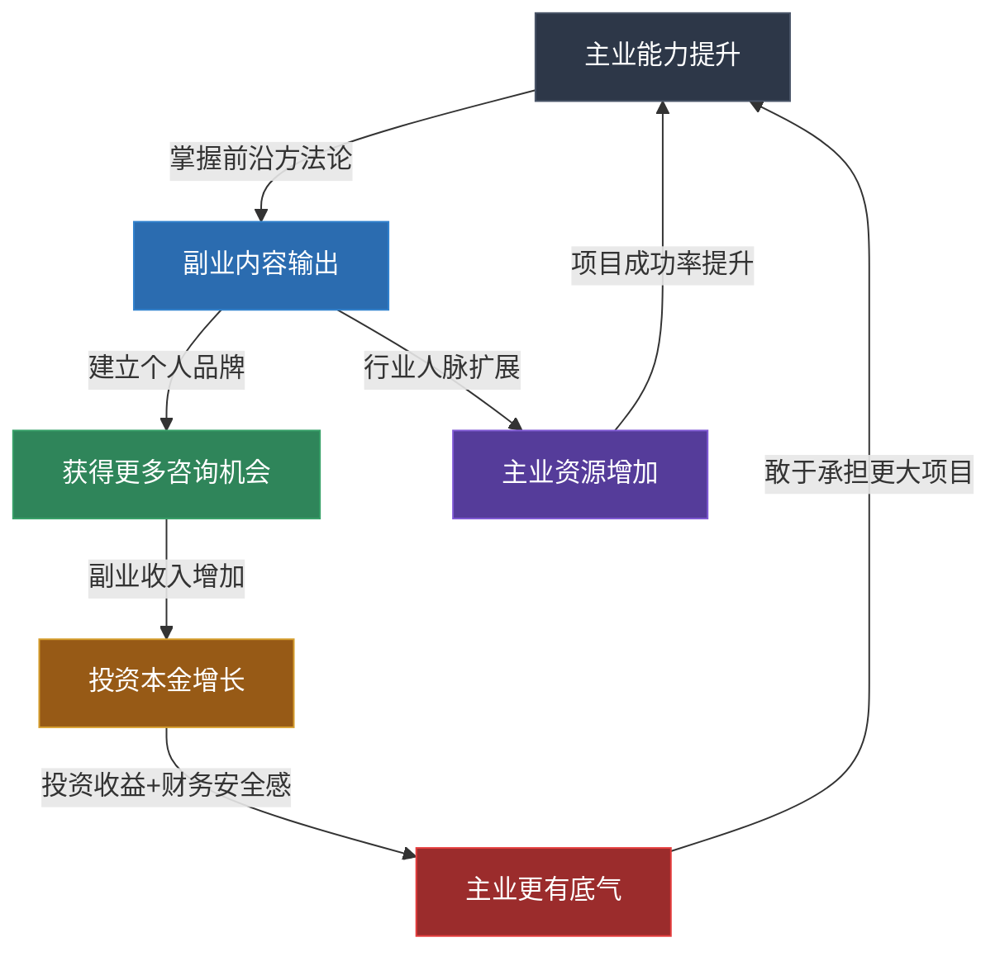
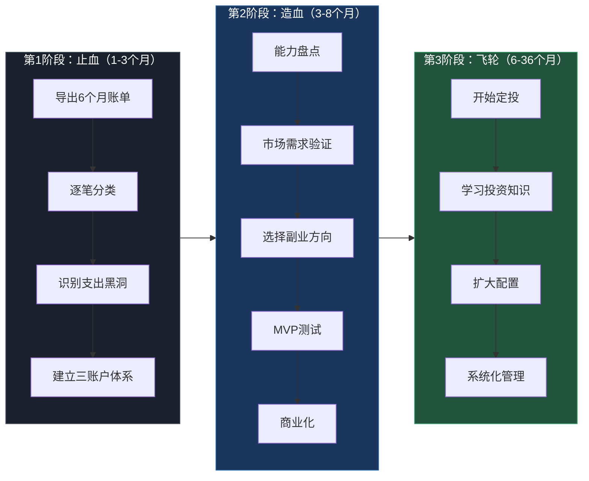

## 案例一：互联网产品经理的收入飞轮

> 本案例展示一位35岁互联网高级产品经理如何从"单一工资"模式，用3年时间构建"主业+副业+投资"三条收入管道，实现年收入从60万到100万的跃迁。核心方法论：先止血（优化支出），再造血（建立飞轮），最后让飞轮自转（被动收入）。

### 一、案例背景：张明的起点

张明，35岁，某互联网公司高级产品经理，年薪60万（含股票期权）。已婚，有一个3岁的孩子，房贷每月1.5万。表面上看，这是一份体面的中产收入，但深入分析后问题不少。

**家庭月度收支表（优化前）：**

| 项目 | 金额（元） | 占比 | 说明 |
|------|-----------|------|------|
| 税后月收入 | 50,000 | 100% | 含基本工资+绩效+股票折算 |
| 房贷 | 15,000 | 30% | 一线城市，贷款余额280万 |
| 生活费 | 10,000 | 20% | 餐饮、交通、水电物业 |
| 子女教育 | 5,000 | 10% | 早教班、奶粉、玩具 |
| 其他支出 | 10,000 | 20% | 社交应酬、冲动消费、订阅服务 |
| **月结余** | **10,000** | **20%** | — |

**核心困境：**

1. **收入结构单一**：100%依赖工资，一旦失业或公司裁员，家庭财务立刻陷入危机
2. **35岁职业焦虑**：互联网行业"35岁天花板"压力巨大，晋升通道收窄
3. **支出失控**：每月1万元的"其他支出"里藏着大量隐性浪费——不必要的订阅服务（视频会员、云存储、付费App等）占500元，无效社交应酬占3000元，冲动消费（网购、凑单）占2000元，还有4500元花在了说不清楚的地方
4. **零投资经验**：工作10年，没有做过任何投资，全部积蓄躺在银行活期账户

### 二、诊断分析：问题出在哪里

在动手之前，张明先做了一次彻底的财务体检。他用了一个下午的时间，导出了过去6个月的所有银行流水和支付宝/微信账单，逐笔分类。

**发现的三个核心问题：**

**问题1：支出黑洞**
"其他支出"中的1万元，经过逐笔分析后发现：
- 3个视频平台会员（实际只常用1个）：150元/月
- 2个云存储服务（功能重叠）：100元/月
- 各类付费App订阅（多数已遗忘）：250元/月
- 每周2-3次无意义的饭局应酬：3000元/月
- 网购凑单、限时折扣冲动消费：2000元/月
- 零散支出（打车、咖啡、零食等）：4500元/月

**问题2：能力资产未变现**
张明有8年产品经理经验，主导过3个千万级用户产品，精通用户增长、数据驱动决策、产品商业化。这些能力在市场上有明确的需求——创业公司需要产品顾问，传统企业需要数字化转型指导，职场新人需要产品方法论培训。但他从未想过把这些能力对外输出。

**问题3：投资知识为零**
张明的全部"理财"就是把钱放在银行活期，年化收益不到0.2%。按50万存款计算，每年"损失"的购买力约为2-3万元（按通胀率4-5%计算）。

### 三、执行方案：三步构建收入飞轮

张明的策略分三个阶段，每个阶段3-4个月，逐步推进。

#### 第一步：止血——优化支出结构（第1-3个月）

这不是简单的"省钱"，而是建立一套可持续的消费管理系统。

**具体操作：**

| 优化项 | 操作 | 月省金额 |
|--------|------|---------|
| 订阅服务清理 | 只保留1个视频平台+1个云存储，取消其余 | 350元 |
| 社交应酬筛选 | 建立"应酬价值评估"标准：只参加能带来职业机会或深度关系的活动 | 2,000元 |
| 冲动消费管控 | 设置"48小时冷静期"——非必需品加入购物车等48小时再决定 | 1,500元 |
| 零散支出定额 | 每月设2000元零花预算，用单独账户管理 | 2,500元 |
| **合计** | — | **6,350元** |

**优化后月结余：10,000 + 6,350 = 16,350元**

张明使用的方法是"三个账户体系"：
- **必要账户**（工资卡自动转账）：房贷、生活费、子女教育，共30,000元
- **自由账户**（单独银行卡）：零花预算2,000元，花完即止
- **增长账户**（基金账户）：结余全部转入，用于后续投资

**关键原则**：优化支出不是降低生活质量，而是把钱从"无意识流失"转为"有意识分配"。张明砍掉的都是他"想不起来花过"的钱，实际生活质量没有下降。

#### 第二步：造血——启动副业管道（第3-8个月）

**副业方向选择的决策过程：**

张明没有盲目跟风做自媒体或开网店，而是用产品经理的方法论做了一次系统分析：

| 评估维度 | 知识付费/咨询 | 自媒体带货 | 技术外包 | 量化评分 |
|----------|-------------|-----------|---------|---------|
| 与主业协同度 | 极高（能力直接复用） | 低（需要新技能） | 中（需要额外时间） | 知识付费 9/10 |
| 启动成本 | 低（只需时间） | 中（需要选品、库存） | 低 | 知识付费 8/10 |
| 时间投入弹性 | 高（可自由安排） | 低（需要持续直播） | 低（按项目deadline） | 知识付费 8/10 |
| 收入天花板 | 高（咨询单价可达数千/小时） | 中（取决于流量） | 中（受限于工时） | 知识付费 7/10 |
| 护城河 | 高（经验积累不可复制） | 低（容易被替代） | 低 | 知识付费 9/10 |
| **综合评分** | **41/50** | **25/50** | **28/50** | — |

**最终选择：产品方法论知识付费 + 企业咨询**

**执行路径（第3-8个月）：**

**第3-4个月：内容积累期**
- 在知乎开设专栏"产品沉思录"，每周发布2篇深度文章
- 同步运营公众号，将知乎内容二次加工
- 内容方向聚焦：用户增长方法论、数据驱动产品决策、B端产品设计
- 目标：积累初始内容库，验证市场需求

**第5-6个月：粉丝积累期**
- 知乎文章被多个大V转载，单篇最高阅读量突破10万
- 公众号粉丝增长到1.5万
- 开始在知识星球开设付费社群，定价199元/年
- 首月付费用户：87人，收入约17,000元

**第7-8个月：商业化启动期**
- 通过内容引流，接到第一单企业咨询：某传统零售企业数字化转型诊断，收费8,000元/天
- 在在行平台开设1对1咨询，定价500元/小时
- 知识星球付费用户增长到300人
- 月均副业收入：12,000-15,000元

**副业收入结构（第8个月）：**

| 收入来源 | 月均收入 | 时间投入 | 时薪 |
|----------|---------|---------|------|
| 知识星球付费社群 | 5,000元 | 3小时/周（内容+答疑） | 约400元 |
| 在行1对1咨询 | 4,000元 | 8小时/月 | 500元 |
| 企业咨询（不定期） | 5,000元 | 1天/月 | 约600元 |
| 公众号广告/打赏 | 1,000元 | 含在内容产出中 | — |
| **合计** | **15,000元** | **约20小时/月** | **约750元** |

**关键发现**：副业时薪（750元）远高于主业时薪（约280元，按月薪5万÷每月工作180小时计算）。这意味着，每小时投入副业的回报是主业的2.7倍。这个数据坚定了张明继续扩大副业的决心。

#### 第三步：飞轮自转——建立投资体系（第6个月起）

张明没有等到副业收入稳定后才开始投资，而是从第6个月起就同步启动。他的理由是："投资知识需要时间积累，早一天开始就多一天学费。"

**投资策略：**

**阶段一（第6-12个月）：学习+小额试水**
- 每月定投5,000元到沪深300指数基金
- 同步阅读3本投资入门书籍：《指数基金投资指南》（银行螺丝钉）、《漫步华尔街》（伯顿·马尔基尔）、《聪明的投资者》（本杰明·格雷厄姆）
- 目的：用真金白银感受市场波动，建立投资纪律

**阶段二（第13-24个月）：扩大配置**
- 定投金额提升到10,000元/月（副业收入增长后的增量）
- 资产配置比例：70%宽基指数基金 + 20%债券基金 + 10%货币基金
- 开始关注港股和美股，通过港股通配置少量腾讯、美团等互联网龙头

**阶段三（第25-36个月）：系统化管理**
- 建立"投资决策清单"，避免情绪化交易
- 每季度做一次资产再平衡
- 将投资收益（分红+资本利得）继续投入，实现复利效应

### 四、三年成果：数据说话

**第3年（38岁时）的财务全景：**

| 收入来源 | 年收入 | 占比 | 与3年前对比 |
|----------|--------|------|------------|
| 主业（产品总监） | 800,000元 | 80% | +33%（晋升涨薪） |
| 副业（咨询+知识付费） | 150,000元 | 15% | 从0到15万 |
| 投资收益 | 50,000元 | 5% | 从0到5万 |
| **合计** | **1,000,000元** | **100%** | **+67%** |

**资产状况：**

| 资产项目 | 金额 | 说明 |
|----------|------|------|
| 投资账户 | 800,000元 | 指数基金+债券+港股 |
| 银行存款 | 200,000元 | 应急储备金（6个月支出） |
| 房产净值 | 2,000,000元 | 房产市值-剩余贷款 |
| **家庭净资产** | **3,000,000元** | — |

**支出结构变化：**

| 项目 | 3年前 | 3年后 | 变化 |
|------|-------|-------|------|
| 月收入 | 50,000元 | 83,000元 | +66% |
| 月支出 | 40,000元 | 42,000元 | +5%（通胀+子女教育增长） |
| 月结余 | 10,000元 | 41,000元 | +310% |
| 结余率 | 20% | 49% | +29个百分点 |

### 五、收入飞轮的运转机制

张明的三条收入管道并非孤立存在，而是形成了一个自我强化的正向循环：

**飞轮的三个加速效应：**

1. **能力复利效应**：主业积累的产品方法论，通过副业输出（写文章、做咨询）不断被强化和迭代。每次咨询都是对知识体系的一次"实战检验"，反过来又提升了主业的工作质量。

2. **品牌溢价效应**：随着知乎粉丝和行业影响力增长，张明的咨询报价从500元/小时逐步提升到800元/小时，企业咨询从8,000元/天提升到15,000元/天。品牌带来的溢价是纯利润。

3. **财务安全效应**：投资账户的增长和副业收入的稳定，让张明在主业上更有底气——他不再害怕失业，因为即使主业出问题，副业+投资也能覆盖家庭基本开支。这种安全感反而让他在工作中更敢于争取机会、承担风险。

### 六、踩过的坑与避坑指南

张明的飞轮构建过程并非一帆风顺，以下是他在每个阶段踩过的坑和总结的经验。

#### 坑1：副业选错方向，白忙3个月

**经过**：张明最初尝试做了一个"产品经理工具箱"的小程序，花了2个月开发，上线后发现：
- 产品经理群体太小众，日活不到200
- 工具型产品难以变现，用户不愿付费
- 维护成本高，每次更新都要投入大量时间

**教训**：副业方向选择必须满足三个条件——与主业能力强相关、市场需求明确、变现路径清晰。工具型产品适合技术团队，不适合个人副业。

**纠正**：转向知识付费和咨询，因为这些方向的启动成本更低、变现速度更快、且与主业能力直接挂钩。

#### 坑2：内容质量不稳定，掉粉严重

**经过**：第5个月时，张明为了保持更新频率，降低了内容质量标准，连续发了几篇"水文"。结果知乎关注者掉了800人，知识星球有12人退费。

**教训**：知识付费的核心是"信任"，一次质量滑坡可能毁掉几个月积累的信任。

**纠正**：建立内容质量自检清单：
- 每篇文章是否有至少一个可执行的方法论？
- 是否有真实案例或数据支撑？
- 是否有独特的视角，而非泛泛而谈？
- 自己读完后，是否愿意付费？

#### 坑3：投资追涨杀跌，亏了2万

**经过**：第10个月时，张明看到某新能源基金短期涨了30%，冲动追入5万元。结果买入后连续下跌3个月，最终亏损2万元割肉离场。

**教训**：投资最大的敌人是情绪。短期涨跌不可预测，追涨杀跌是散户亏损的主要原因。

**纠正**：严格执行"定投+长期持有"策略，不再关注短期波动。设定规则：每月固定日期自动扣款，每季度看一次账户，不做任何择时操作。

#### 坑4：副业挤占主业时间，差点翻车

**经过**：第7个月时，张明把大量精力放在副业上，导致主业的一个核心项目延期，被领导约谈。

**教训**：主业是收入飞轮的"发动机"，发动机坏了飞轮就停了。副业必须在不影响主业质量的前提下进行。

**纠正**：严格的时间管理——工作日只处理主业，副业内容产出集中在周末上午（每周4小时），咨询安排在工作日晚上（每周2次，每次1小时）。

#### 坑5：忽视税务规划，多交了冤枉税

**经过**：副业收入没有做任何税务规划，全部按"劳务报酬"缴税，税率高达20-40%。

**教训**：副业收入的税务处理直接影响实际到手收益。

**纠正**：
- 注册个体工商户，将部分副业收入转为"经营所得"，适用更低税率
- 合理利用个税专项附加扣除（子女教育、房贷利息、赡养老人等）
- 咨询专业税务师，制定年度税务规划

### 七、关键经验提炼

从张明的案例中，可以提炼出产品经理构建收入飞轮的五条核心经验：

**经验1：先止血，再造血**
优化支出是构建飞轮的第一步。张明通过清理订阅、管控冲动消费、减少无效社交，每月多出6,350元。这笔钱不是用来"享受"的，而是飞轮的启动资金——它变成了副业的投入成本和投资的种子资金。

**经验2：副业必须与主业协同**
张明选择"产品方法论知识付费"而非"开网店"或"做短视频"，是因为前者能直接复用主业积累的能力，启动成本几乎为零，且反过来能强化主业能力。如果你的副业和主业完全无关，那就是在做两份工作，而不是构建飞轮。

**经验3：用产品经理的方法论做副业**
张明把副业当成一个"产品"来运营——先做MVP（最小可行产品），验证市场需求，再逐步迭代。他没有一上来就搞大规模投入，而是从知乎免费内容开始，验证了"产品经理知识付费"这个方向有需求后，才逐步商业化。

**经验4：投资要趁早，但不要贪心**
张明在副业还没有稳定收入时就开始定投指数基金，虽然金额不大，但提前建立了投资纪律和市场认知。三年后回头看，早期的小额定投不仅带来了收益，更重要的是让他"交了学费"——那次追涨杀跌的2万元亏损，让他深刻理解了"长期持有"的价值。

**经验5：飞轮的转速取决于主业的"功率"**
张明的副业收入（15万/年）和投资收益（5万/年）加起来只有20万，占总收入的20%。飞轮的核心动力仍然是主业。如果主业收入没有从60万提升到80万（通过晋升），整个飞轮的规模会小得多。因此，构建飞轮的同时不能放松主业，反而要更加重视主业的能力提升和晋升机会。

### 八、可复制的操作模板

基于张明的案例，以下是30-40岁互联网从业者构建收入飞轮的操作模板：

**月度检查清单：**

- [ ] 本月支出是否在预算内？
- [ ] 副业内容产出是否完成（每周2篇）？
- [ ] 本月是否有新的咨询/合作机会？
- [ ] 定投是否按时执行？
- [ ] 本月学到了什么新的投资知识？
- [ ] 主业是否有新的晋升/加薪机会？
- [ ] 飞轮三条管道的收入比例是否健康（主业70-80%，副业10-20%，投资5-10%）？

### 九、适用边界与注意事项

这个案例的成功建立在几个前提条件上，不是所有人都能直接复制：

**适用人群：**
- 有一技之长的职场人士（产品经理、程序员、设计师、运营等）
- 主业收入稳定，有一定结余
- 能保证每周至少8小时的副业投入时间
- 有基本的自律能力和学习意愿

**不适用的情况：**
- 主业已经焦头烂额，没有额外精力
- 没有明确的专业技能或可输出的经验
- 期望"快速致富"，不愿接受3年以上的积累期
- 所在行业有严格的竞业限制或副业禁令

**风险提示：**
- 副业收入不稳定，不能作为家庭基本开支的保障
- 投资有风险，历史收益不代表未来表现
- 知识付费市场竞争激烈，需要持续输出高质量内容
- 副业可能与主业产生利益冲突，需提前了解公司政策
