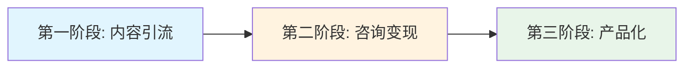
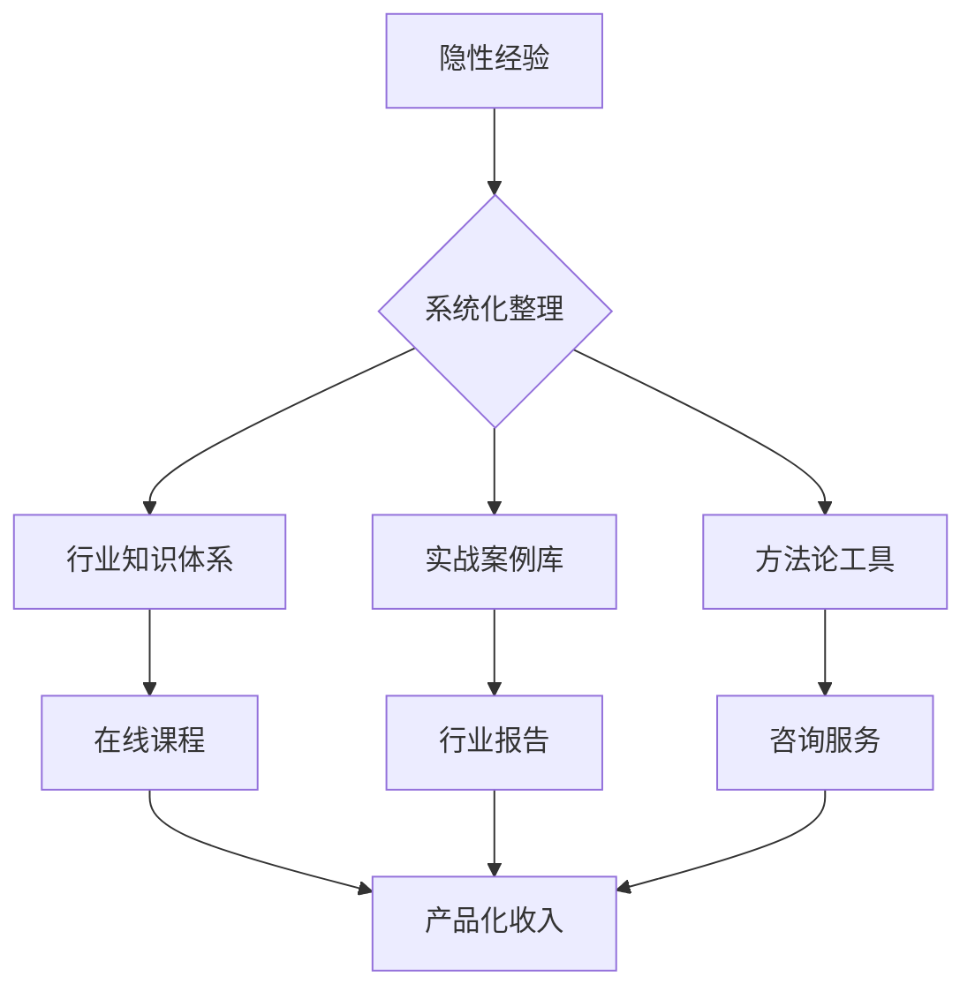

## 案例二：传统行业销售经理的逆袭——从月薪8000到年入50万的转型之路

> **核心启示**：传统行业并非没有机会，关键在于你能否将多年积累的行业经验、人脉资源和专业洞察转化为可复制的商业价值。本案例展示了一位建材行业销售经理如何在35岁时，通过"主业深耕+副业变现+知识产品化"的三步策略，在三年内实现收入从月薪8000到年入50万的跃迁。

### 案例背景

#### 人物画像

| 项目 | 详情 |
|------|------|
| **姓名** | 化名张伟（为保护隐私） |
| **年龄** | 出事时35岁 |
| **所在行业** | 建筑建材行业（传统B2B领域） |
| **职位** | 区域销售经理（中层管理） |
| **工作年限** | 12年销售经验，其中5年管理经验 |
| **月薪** | 基本工资8000元 + 业绩提成（浮动，年均约15-20万） |
| **家庭状况** | 已婚，育有一子（3岁），妻子全职带娃 |
| **所在城市** | 二线城市（非一线城市） |
| **学历** | 本科，市场营销专业 |

#### 行业困境

2019年前后，张伟所在的建材行业面临多重压力：

**宏观层面**：
- 房地产调控政策收紧，新房开工面积持续下滑
- 行业产能过剩，价格竞争白热化
- 环保政策趋严，部分中小厂商被淘汰

**微观层面**：
- 传统经销商模式受到电商冲击
- 客户越来越依赖线上比价，信息差红利消失
- 行业利润空间被压缩，提成比例逐年下降

**个人困境**：
- 35岁"中年危机"：晋升空间有限，高管位置被"关系户"占据
- 收入天花板明显：即使业绩再好，年收入也很难突破25万
- 精力分散：既要维护老客户，又要开发新客户，还要管理团队
- 家庭压力增大：孩子即将上幼儿园，教育支出增加；父母年迈，医疗支出上升

#### 转折点

2019年8月，公司进行组织架构调整，张伟所在区域被合并，他的团队从8人缩减到3人。虽然职位没变，但管辖范围和业绩压力都发生了变化。更关键的是，新上任的销售总监是"空降兵"，带来了全新的管理风格和考核体系，张伟多年的"老经验"反而成了被批评的对象。

这次调整让张伟深刻意识到：**在传统行业，仅靠"卖时间换工资"的模式已经走到了尽头**。

---

### 转型前的自我诊断

在做出任何行动之前，张伟花了两个月时间进行系统性的自我诊断。这个过程本身就是一个值得学习的方法论。

#### 第一步：能力盘点

张伟用"能力三环模型"对自己进行了全面评估：

| 维度 | 具体内容 | 变现潜力评估 |
|------|----------|--------------|
| **专业技能** | 建材产品知识、销售谈判技巧、客户关系管理、招投标流程、合同法务基础 | ★★★★☆ |
| **行业资源** | 12年积累的上下游人脉（供应商100+、经销商200+、设计师50+、项目经理30+） | ★★★★★ |
| **软技能** | 演讲表达（公司内部培训师）、写作能力（常写行业分析报告）、PPT制作 | ★★★☆☆ |
| **兴趣领域** | 商业模式研究、新媒体运营、短视频（业余爱好） | ★★☆☆☆ |

**关键发现**：张伟最大的资产不是他的"销售技巧"，而是他12年积累的**行业人脉网络**和**深度行业认知**。这些是新入行者无法短期获得的，也是最有变现潜力的资源。

#### 第二步：市场需求调研

张伟没有盲目行动，而是通过三个渠道进行了市场需求调研：

**渠道1：与同行交流**
- 参加了3次行业展会，主动与不同区域的销售经理交流
- 发现：很多同行都有类似的困惑——行业在变，但不知道怎么变
- 痛点：缺乏系统的行业分析、不知道如何利用新媒体获客、想转型但没有方向

**渠道2：与客户交流**
- 与20位核心客户深度访谈
- 发现：客户在采购决策时，越来越依赖线上信息，但线上信息质量参差不齐
- 痛点：需要靠谱的行业专家帮助筛选供应商、评估产品质量

**渠道3：线上调研**
- 在知乎、抖音、微信搜索"建材行业"相关内容
- 发现：专业内容稀缺，大部分是营销软文或过时信息
- 机会：有深度的行业分析内容有大量需求，但供给不足

**调研结论**：张伟发现了一个"信息差"——行业内有大量经验丰富的从业者，但很少有人把这些经验系统化地输出；行业外有大量需求（采购决策、投资分析、求职参考），但缺乏可信的信息来源。

#### 第三步：商业模式设计

基于能力盘点和需求调研，张伟设计了一个"三阶段"的商业模式：



**第一阶段（0-6个月）：内容引流**
- 目标：建立个人品牌，积累精准粉丝
- 方式：在知乎、抖音、公众号输出行业干货
- 指标：知乎粉丝达到5000，抖音粉丝达到1万

**第二阶段（6-12个月）：咨询变现**
- 目标：将粉丝转化为付费客户
- 方式：提供一对一咨询服务、企业内训
- 指标：月咨询收入达到5000元

**第三阶段（12-24个月）：产品化**
- 目标：将咨询服务标准化，实现规模化变现
- 方式：开发在线课程、行业报告、社群会员
- 指标：月收入稳定在2万以上

---

### 执行过程：从0到1的24个月

#### 第一阶段：内容引流（第1-6个月）

**1. 选择主战场**

张伟没有"全平台铺开"，而是选择了三个平台作为主战场：

| 平台 | 选择理由 | 内容形式 | 更新频率 |
|------|----------|----------|----------|
| **知乎** | 专业内容调性匹配，用户决策参考价值高 | 长文回答、专栏文章 | 每周2-3篇 |
| **抖音** | 短视频风口，适合展示"行业老炮"人设 | 1-3分钟行业解读 | 每周3-4条 |
| **微信公众号** | 私域流量沉淀，适合深度内容 | 行业分析、案例拆解 | 每周1篇 |

**2. 内容定位**

张伟的核心定位是：**"建材行业的翻译官"——用大白话讲清楚行业里的门道**。

他的内容策略是"三不原则"：
- **不卖货**：不推荐具体品牌，只讲方法论和行业逻辑
- **不端着**：用讲故事的方式讲专业知识，避免学术腔
- **不藏私**：把自己踩过的坑、总结的经验毫无保留地分享

**3. 内容创作方法论**

张伟建立了一套"内容素材库"系统：

```python
# 内容素材分类体系（简化示意）
content_categories = {
    "行业洞察": ["政策解读", "市场趋势", "竞争格局", "技术变革"],
    "实战技巧": ["谈判话术", "客户开发", "招投标", "合同避坑"],
    "案例拆解": ["成功案例", "失败复盘", "同行案例", "跨界案例"],
    "人物故事": ["行业大佬", "逆袭故事", "创业经历", "转型案例"]
}

# 每周内容排期
weekly_plan = {
    "周一": "行业洞察（知乎长文）",
    "周二": "实战技巧（抖音短视频）",
    "周三": "案例拆解（知乎回答）",
    "周四": "实战技巧（抖音短视频）",
    "周五": "行业洞察（公众号深度文）",
    "周六": "人物故事（抖音/知乎）",
    "周日": "素材积累+下周规划"
}
```

**4. 第一阶段成果**

| 指标 | 3个月时 | 6个月时 |
|------|---------|---------|
| 知乎粉丝 | 800 | 3,200 |
| 抖音粉丝 | 1,500 | 8,000 |
| 公众号关注 | 200 | 1,200 |
| 私信咨询量 | 每周2-3条 | 每周10-15条 |
| 内容总阅读/播放量 | 约5万 | 约35万 |

**关键里程碑**：第4个月时，张伟的一篇知乎回答《建材行业的水有多深？一个12年销售老兵的真心话》获得了2.3万赞，单篇带来粉丝增长1500+。这篇回答之所以爆火，是因为它用真实的案例和数据，揭示了行业内不为人知的"潜规则"，引发了大量从业者的共鸣。

#### 第二阶段：咨询变现（第7-12个月）

**1. 服务产品设计**

张伟设计了三种咨询服务产品：

| 产品名称 | 服务内容 | 定价 | 交付方式 | 目标客户 |
|----------|----------|------|----------|----------|
| **采购决策咨询** | 帮助客户筛选供应商、评估报价、审核合同 | 3000-5000元/次 | 电话/视频会议 + 书面报告 | 建筑公司采购负责人 |
| **销售团队培训** | 行业知识、销售技巧、客户管理培训 | 8000-15000元/天 | 现场培训 | 建材企业销售团队 |
| **个人职业咨询** | 行业分析、职业规划、转型建议 | 500-800元/小时 | 电话/视频会议 | 行业从业者 |

**2. 获客渠道**

- **免费内容引流**：通过知乎、抖音、公众号的内容吸引精准客户
- **老客户转介绍**：维护好12年积累的客户关系，请他们推荐新客户
- **行业社群渗透**：加入20+行业微信群，定期分享干货，建立信任

**3. 定价策略**

张伟的定价策略是"价值锚定法"：

> **"如果你请一个行业顾问帮你避免了一次错误的供应商选择，可能节省的是几十万甚至上百万的损失。我的咨询费只是这个价值的零头。"**

这个话术在实际销售中非常有效。客户会自动进行"价值对比"——花3000元咨询费，可能避免50万的损失，这个账怎么算都划算。

**4. 第二阶段成果**

| 指标 | 第7个月 | 第9个月 | 第12个月 |
|------|---------|---------|----------|
| 月咨询订单 | 3单 | 6单 | 10单 |
| 月咨询收入 | 8,000元 | 18,000元 | 35,000元 |
| 客户复购率 | 0% | 30% | 50% |
| 转介绍比例 | 0% | 20% | 40% |

**关键里程碑**：第10个月时，张伟接到了第一个企业内训订单——一家年产值2亿的建材企业请他为30人的销售团队做3天培训，单笔收入3.5万元。这个订单的来源是：该企业老板在抖音上看到了张伟的视频，觉得"这个人讲的很实在"，于是主动联系。

#### 第三阶段：产品化（第13-24个月）

**1. 在线课程开发**

张伟将自己的行业经验系统化为一门在线课程：《建材行业销售实战36讲》。

课程结构设计：

| 模块 | 课程数 | 核心内容 |
|------|--------|----------|
| 行业认知篇 | 6讲 | 行业格局、供应链、商业模式、政策影响 |
| 客户开发篇 | 8讲 | 客户画像、获客渠道、需求挖掘、方案设计 |
| 销售谈判篇 | 8讲 | 谈判心理、价格策略、异议处理、成交技巧 |
| 客户管理篇 | 6讲 | 客户分层、关系维护、转介绍、长期经营 |
| 团队管理篇 | 4讲 | 团队搭建、绩效考核、培训体系、激励机制 |
| 转型升级篇 | 4讲 | 新媒体获客、数字化转型、个人品牌、副业变现 |

**课程定价**：
- 单独购买：1999元
- 课程+社群会员：2999元/年
- 课程+1对1咨询（3次）：4999元

**2. 行业社群运营**

张伟建立了"建材行业实战交流群"，采用付费会员制：

- **年费**：999元/年
- **权益**：
  - 每月1次行业直播分享
  - 每周行业资讯整理
  - 会员专属微信群，实时答疑
  - 供应商资源对接（张伟用自己的人脉帮会员对接靠谱供应商）
  - 年度线下聚会（2次）

**社群运营的关键**：张伟把社群定位为"行业人脉中转站"——他不是在卖课程，而是在帮会员解决实际问题。当一个会员通过社群找到了靠谱的供应商，或者通过张伟的推荐拿到了更好的价格，他就成为了社群的"自来水"，主动推荐新会员加入。

**3. 第三阶段成果**

| 指标 | 第15个月 | 第18个月 | 第24个月 |
|------|----------|----------|----------|
| 课程累计销量 | 50份 | 150份 | 320份 |
| 社群会员数 | 30人 | 80人 | 150人 |
| 月课程收入 | 15,000元 | 35,000元 | 55,000元 |
| 月咨询收入 | 30,000元 | 25,000元 | 20,000元 |
| 月总收入 | 45,000元 | 60,000元 | 75,000元 |

**关键里程碑**：第20个月时，张伟的一篇行业分析报告《2021-2022建材行业十大趋势预测》在行业内广泛传播，被多家行业媒体转载。这篇报告让他在行业内的影响力从"销售专家"升级为"行业分析师"，咨询客户从"销售从业者"扩展到了"投资机构"和"企业管理层"。

---

### 成果数据：转型前后的全面对比

#### 收入对比

| 指标 | 转型前（2019年） | 转型后（2022年） | 增长幅度 |
|------|------------------|------------------|----------|
| **年总收入** | 18-22万 | 50-55万 | +150% |
| **收入来源** | 单一（工资+提成） | 多元（工资+咨询+课程+社群+品牌合作） | 从1条到5条 |
| **被动收入占比** | 0% | 35%（课程+社群续费） | 从0到35% |
| **收入天花板** | 25万（行业上限） | 暂无明显天花板 | — |
| **收入稳定性** | 波动大（跟随业绩） | 稳定增长（产品化收入兜底） | 显著提升 |

#### 时间投入对比

| 时间分配 | 转型前 | 转型后 |
|----------|--------|--------|
| 主业工作时间 | 每天10-12小时 | 每天8小时（效率提升） |
| 副业投入时间 | 0小时 | 每周10-15小时 |
| 家庭时间 | 极少 | 显著增加 |
| 学习提升时间 | 几乎没有 | 每周3-5小时 |

**关键变化**：转型后，张伟的工作时间反而减少了。原因是：副业收入提供了"安全垫"，让他在主业中不再"拼命"，而是更高效地工作。同时，副业带来的行业影响力，反过来提升了他在主业中的话语权和议价能力。

#### 个人品牌影响力

| 指标 | 转型前 | 转型后 |
|------|--------|--------|
| 行业知名度 | 区域性（本省同行知道） | 全国性（行业从业者广泛认知） |
| 社交媒体粉丝 | 0 | 知乎2.5万+抖音5万+公众号8000 |
| 行业演讲邀请 | 0 | 每年10+次 |
| 媒体采访/约稿 | 0 | 每月2-3次 |
| 猎头联系频率 | 偶尔 | 每周2-3次（高薪职位） |

---

### 关键策略深度拆解

#### 策略一：将"行业经验"转化为"可交易的知识资产"

传统行业从业者最大的误区是：**觉得自己知道的东西"没什么了不起"**。

张伟的突破点在于：他意识到自己12年积累的行业经验，对于以下人群来说是"稀缺资源"：

- **行业新人**：刚入行的销售，需要快速了解行业门道
- **采购客户**：需要行业专家帮助做决策
- **投资者**：需要深度行业分析做投资判断
- **创业者**：需要行业洞察做商业规划

**转化方法论**：



#### 策略二：用"免费内容"建立信任，用"付费服务"实现变现

张伟的商业模式核心是**信任漏斗**：

```text
免费内容（知乎/抖音/公众号）
    ↓ 吸引关注
深度互动（评论区/私信/社群）
    ↓ 建立信任
低价产品（行业报告/单次咨询）
    ↓ 验证价值
高价服务（课程/会员/企业培训）
    ↓ 长期绑定
转介绍/复购
```

**关键数据**：
- 免费内容到私信咨询的转化率：约0.5%
- 私信咨询到付费咨询的转化率：约15%
- 付费咨询到课程购买的转化率：约40%
- 课程学员到社群会员的转化率：约50%
- 社群会员的年续费率：约70%

#### 策略三：主业与副业的协同效应

张伟的副业不是"另起炉灶"，而是**主业的延伸和放大**：

| 协同维度 | 具体表现 |
|----------|----------|
| **客户协同** | 副业认识的客户，可能成为主业的潜在客户 |
| **信息协同** | 副业接触的行业信息，帮助主业做出更好的决策 |
| **能力协同** | 副业锻炼的内容创作、演讲能力，提升了主业的销售能力 |
| **品牌协同** | 副业建立的个人品牌，提升了主业中的行业影响力 |
| **资源协同** | 副业积累的人脉资源，为主业带来更多的商业机会 |

---

### 踩过的坑与经验教训

#### 坑1：初期内容定位太宽泛

**问题**：刚开始做内容时，张伟什么都写——行业趋势、销售技巧、职场故事、甚至个人感悟。结果：内容分散，没有记忆点，粉丝增长缓慢。

**解决**：聚焦"建材行业销售实战"这个细分领域，所有内容都围绕这个核心展开。3个月后，粉丝增长速度提升了3倍。

**教训**：**定位越窄，穿透力越强**。与其做一个"什么都懂的泛行业博主"，不如做一个"建材行业销售领域的第一人"。

#### 坑2：定价太低，反而降低信任

**问题**：第一版咨询服务定价500元/小时，结果客户反而犹豫——"这么便宜，是不是不专业？"

**解决**：将价格提升到800元/小时，同时增加服务内容（含书面报告）。结果：客户数量没有明显下降，但单客户价值提升了60%。

**教训**：**专业服务的定价是信任信号**。定价太低会让客户质疑你的专业性。合理的定价策略是：参考行业标准，略高于市场平均，同时提供超出价格的价值。

#### 坑3：忽视了时间管理

**问题**：前3个月，张伟每天花4-5小时做内容，严重影响了主业和家庭。妻子抱怨"你比以前更忙了"。

**解决**：
- 建立内容生产SOP，提高效率
- 利用碎片时间（通勤、午休）做素材收集
- 每周固定2个晚上集中创作，其余时间不碰副业
- 周末至少1天完全留给家庭

**教训**：**副业不能以牺牲主业和家庭为代价**。如果副业导致主业表现下降或家庭关系紧张，那就是本末倒置。

#### 坑4：过度依赖单一平台

**问题**：第5个月时，抖音账号因为一条视频的敏感词被限流7天，流量断崖式下降。

**解决**：
- 建立多平台分发机制，同一内容适配不同平台
- 建立私域流量池（微信个人号+社群），不完全依赖公域平台
- 每篇内容都引导关注公众号或添加微信

**教训**：**不要把所有鸡蛋放在一个篮子里**。公域平台的规则随时可能变化，只有沉淀到私域的流量才是真正属于你的。

#### 坑5：低估了知识产品化的难度

**问题**：第13个月开始做在线课程时，张伟以为"把经验讲出来就行了"。结果第一版课程录制了10讲，试听用户反馈"太散、没有体系、听着累"。

**解决**：
- 请了一位课程设计顾问，重新梳理课程结构
- 每讲课程都设计"学习目标+核心概念+案例演示+实操练习"的完整闭环
- 前3讲免费试听，收集反馈后迭代优化
- 建立学员社群，持续收集问题和需求

**教训**：**"会做"和"会教"是两回事**。知识产品化需要专业的课程设计能力，不能只靠"经验丰富"就硬上。

---

### 方法论提炼：传统行业从业者转型的通用框架

张伟的案例虽然是建材行业，但他的方法论具有普遍适用性。以下是提炼出的通用框架：

#### 第一步：资源盘点（1-2个月）

| 盘点维度 | 关键问题 | 盘点方法 |
|----------|----------|----------|
| 专业能力 | 我比80%的人做得好的事情是什么？ | 能力自评+同事/客户反馈 |
| 行业资源 | 我积累了哪些别人没有的人脉和信息？ | 人脉清单+资源地图 |
| 可迁移技能 | 我的哪些能力可以应用到其他场景？ | 技能拆解+市场调研 |
| 兴趣热情 | 我愿意在什么事情上花时间而不觉得累？ | 时间记录+情绪观察 |

#### 第二步：市场验证（1-2个月）

**最小可行产品（MVP）测试**：
1. 选择1-2个平台，发布10-20篇内容
2. 观察哪些内容获得最多互动和正面反馈
3. 主动与10位目标客户深度交流，了解真实需求
4. 提供3-5次免费/低价服务，验证付费意愿

**关键指标**：
- 内容互动率 > 3%
- 咨询转化率 > 5%
- 客户满意度 > 8/10
- 客户愿意推荐给朋友的比例 > 50%

#### 第三步：系统化运营（3-6个月）

**内容系统**：
- 建立内容素材库，每天花15分钟积累素材
- 制定内容日历，保持稳定的更新频率
- 建立内容生产SOP，提高创作效率

**获客系统**：
- 公域内容引流 → 私域沉淀 → 信任建立 → 付费转化
- 设计清晰的客户旅程地图
- 建立客户管理系统，做好跟进和维护

**交付系统**：
- 标准化服务流程，确保服务质量一致
- 建立客户反馈机制，持续优化服务
- 设计复购和转介绍激励机制

#### 第四步：产品化扩展（6-12个月）

**产品化路径**：
```text
一对一咨询 → 小班培训 → 在线课程 → 社群会员 → 行业报告/工具
（高价低频）                                    （低价高频）
```

**关键原则**：
- 先做"重服务"验证需求，再做"轻产品"规模化
- 每个产品都要有明确的"客户成功指标"
- 产品之间要有清晰的升级路径

---

### 对标分析：传统行业 vs 互联网行业转型的差异

很多人可能会问：张伟的案例在传统行业能成功，在互联网行业是不是更容易？以下是两个行业的对比分析：

| 对比维度 | 传统行业（如建材） | 互联网行业（如产品/运营） |
|----------|-------------------|--------------------------|
| **信息差大小** | 大（行业封闭，外人难进入） | 小（信息透明，竞争激烈） |
| **内容竞争程度** | 低（专业内容少，蓝海） | 高（大量从业者做内容，红海） |
| **客户付费意愿** | 高（B2B决策，重视专业性） | 中（个人用户为主，价格敏感） |
| **变现路径** | 咨询+培训为主 | 课程+社群为主 |
| **启动难度** | 低（经验即壁垒） | 中（需要差异化定位） |
| **天花板** | 取决于行业规模 | 取决于个人IP影响力 |

**结论**：传统行业从业者在知识变现方面，其实比互联网从业者有更大的优势——因为行业信息差更大，竞争更小，客户付费意愿更高。关键在于：**你是否愿意走出舒适区，把你的"经验"变成"产品"**。

---

### 给不同阶段读者的行动建议

#### 如果你还在犹豫（0-3个月）

1. **做一次彻底的自我盘点**：用本文的"能力盘点表"，列出你的所有技能和资源
2. **找3-5位目标客户聊天**：了解他们的真实需求和痛点
3. **发布10篇内容测试**：不要追求完美，先发出来看反馈
4. **算一笔账**：如果你的行业经验能帮客户避免10万的损失，你收3000元咨询费，客户赚了还是亏了？

#### 如果你已经在行动（3-12个月）

1. **聚焦细分领域**：不要贪多，先把一个领域做透
2. **建立内容生产系统**：让内容创作从"灵感驱动"变成"系统驱动"
3. **设计清晰的变现路径**：免费内容→低价产品→高价服务
4. **做好时间管理**：副业不能影响主业和家庭

#### 如果你已经初见成效（12个月以上）

1. **开始产品化**：把一对一服务变成可复制的产品
2. **建立团队**：你一个人的时间是有限的，需要找人帮你
3. **拓展变现渠道**：从单一的咨询，扩展到课程、社群、品牌合作等
4. **持续学习**：行业在变化，你的知识体系也需要持续更新

---

### 本案例的核心启示

1. **传统行业不是"夕阳行业"，而是"内容洼地"**。越传统的行业，信息差越大，知识变现的机会越多。

2. **你最大的资产不是你的职位，而是你的行业经验**。12年的行业积累，比任何MBA课程都更有实战价值。

3. **知识变现的本质是"信任变现"**。先通过免费内容建立信任，再通过付费服务实现变现。

4. **主业和副业不是对立关系，而是协同关系**。副业的成功会反过来提升你在主业中的价值和议价能力。

5. **从"卖时间"到"卖价值"的转变，是30-40岁最重要的财富思维升级**。张伟的案例证明，这个转变在任何行业都是可行的。

> **最后的话**：张伟的故事不是"一夜暴富"的神话，而是一个普通人在35岁时，通过系统化的思考和持续的行动，实现了收入和人生质量的双重提升。如果你也在传统行业中感到迷茫，不妨问问自己：**我积累了这么多年的行业经验，是不是该让它发挥更大的价值了？**
