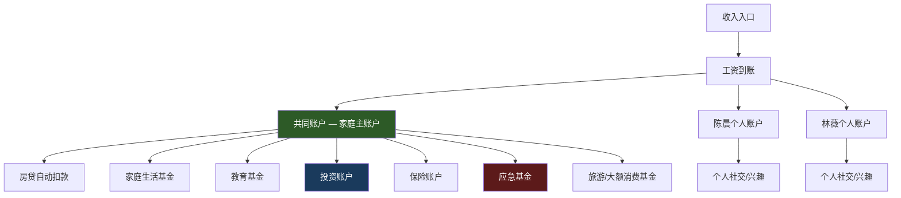
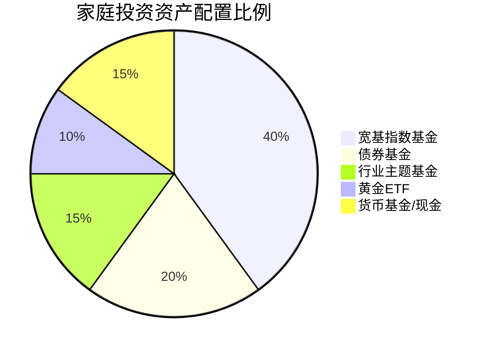
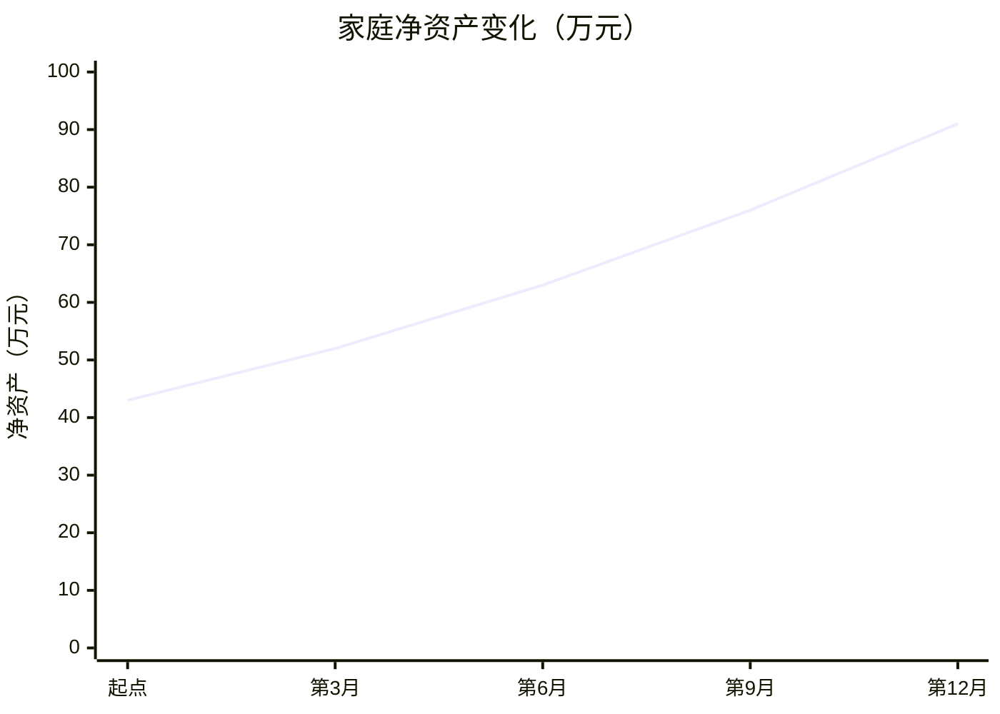

## 案例三：夫妻双职工的家庭CFO

### 一、案例背景

#### 1.1 家庭画像

陈晨（化名），33岁，某互联网公司产品经理，税后月薪28,000元；妻子林薇（化名），31岁，某外企市场主管，税后月薪22,000元。两人结婚4年，育有一子（2岁），坐标杭州。

**家庭财务初始状态：**

| 项目 | 金额 | 备注 |
|------|------|------|
| 家庭月收入 | 50,000元 | 双方工资合计 |
| 月房贷 | 12,500元 | 剩余贷款180万，利率4.1% |
| 月消费支出 | 18,000元 | 无系统记账，感知性消费 |
| 月储蓄 | 约10,000元 | 无固定比例，月末看余额 |
| 存款总额 | 35万元 | 活期+定期混放 |
| 基金投资 | 8万元 | 随机买入，无策略 |
| 保险 | 仅有社保 | 无商业保险配置 |

#### 1.2 核心矛盾

表面看，这个家庭月入5万，属于中高收入群体。但深入分析后，问题暴露无遗：

**矛盾一：收入高但净资产增长慢。** 两人年收入合计60万，但过去两年净资产仅增长了18万（平均每年9万），储蓄率实际只有15%左右——远低于他们"感觉自己还挺省"的主观判断。大量资金在"没有感觉"的日常消费中流失。

**矛盾二：双方都很忙但财务决策混乱。** 两人都有各自的理财习惯：陈晨偏好炒股，林薇喜欢买银行理财。没有统一的财务目标，没有资产配置框架，家庭财务实际上处于"各自为政"的状态。

**矛盾三：高收入带来的虚假安全感。** 双收入让他们觉得"总有一份收入兜底"，对风险缺乏清醒认知。没有商业保险、没有应急基金的独立规划、没有考虑过一方失业或生病的情况。

#### 1.3 触发事件

2024年3月，陈晨公司传出裁员消息。虽然最终没有波及到他，但这次事件让夫妻俩第一次认真审视家庭财务状况。他们发现：如果陈晨失业，仅靠林薇的2.2万月薪，扣除房贷后只剩9,500元，连基本生活都难以维持。

这次"虚惊"成为了他们启动家庭CFO制度的直接驱动力。

---

### 二、家庭CFO制度的建立

#### 2.1 角色分工：谁来当CFO？

家庭CFO不等于"管钱的人"，而是**负责家庭财务系统运转的总协调人**。经过讨论，陈晨担任家庭CFO，原因如下：

| 维度 | 陈晨 | 林薇 |
|------|------|------|
| 性格特质 | 偏理性，擅长系统思维 | 偏感性，擅长人际沟通 |
| 工作节奏 | 相对可控，晚间有空余时间 | 经常出差，时间不稳定 |
| 理财知识 | 有基础投资经验 | 对投资兴趣不大 |
| 意愿度 | 主动提出想系统管理 | 乐于配合但不想主导 |

**关键原则：CFO是执行者，不是独裁者。** 所有重大财务决策（单笔支出超过5,000元、投资方向调整、保险方案选择）必须双方协商。林薇每月参加一次家庭财务会议，审核账目并共同决策。

#### 2.2 账户架构设计

陈晨参考"共同账户+个人账户"模式，设计了以下账户架构：



**具体分配比例（基于月收入50,000元）：**

| 账户 | 比例 | 金额 | 用途说明 |
|------|------|------|----------|
| 房贷 | 25% | 12,500元 | 固定支出，自动扣款 |
| 家庭生活基金 | 18% | 9,000元 | 日常饮食、水电、交通、日用品 |
| 子女教育基金 | 8% | 4,000元 | 早教、奶粉、未来教育储备 |
| 投资账户 | 20% | 10,000元 | 定投+主动投资 |
| 保险费用 | 5% | 2,500元 | 商业保险年缴均摊 |
| 应急基金 | 8% | 4,000元 | 目标：6个月家庭支出 |
| 旅游/大额消费 | 6% | 3,000元 | 年度旅行、家电更换等 |
| 陈晨个人 | 5% | 2,500元 | 个人自由支配 |
| 林薇个人 | 5% | 2,500元 | 个人自由支配 |
| **合计** | **100%** | **50,000元** | — |

**实际储蓄率：** 20%投资 + 8%应急 + 8%教育储备 + 6%延迟消费 = **42%**（扣除房贷后有效储蓄率为56%）。

#### 2.3 记账系统的搭建

陈晨选择了"随手记"App作为记账工具，核心配置如下：

**分类体系（一级分类 → 二级分类）：**

```text
收入类
├── 工资（陈晨）
├── 工资（林薇）
├── 奖金/年终奖
├── 投资收益
└── 其他收入

支出类
├── 固定支出
│   ├── 房贷
│   ├── 保险
│   └── 固定转账（教育/投资）
├── 生活必需
│   ├── 餐饮
│   ├── 交通
│   ├── 水电物业
│   └── 日用品
├── 弹性消费
│   ├── 社交聚餐
│   ├── 购物
│   ├── 娱乐
│   └── 个人爱好
└── 大额支出
    ├── 教育（孩子）
    ├── 医疗
    └── 旅游
```

**记账规则：**

- 每笔支出当天录入，不超过24小时
- 超过200元的支出必须拍照留凭证（大件商品）
- 每周日晚上花10分钟核对账目
- 每月1号生成上月报告

**常见误区纠正：** 很多人记账记到一半就放弃了，核心原因是把记账当成了"每分钱都要记"的苦差事。陈晨的做法是**只记超过50元的支出**，小额零散支出（买水、公交）归入"零花钱"统一估算。这样既保证了数据的可用性，又不至于因为过于繁琐而放弃。

---

### 三、核心执行策略

#### 3.1 策略一：风险防火墙的构建

这是他们做的第一件事——在开始任何投资之前，先确保家庭有抗风险能力。

**第一步：应急基金（优先级最高）**

目标金额 = 6个月家庭必要支出 = (12,500 + 9,000) × 6 = 129,000元

| 阶段 | 时间 | 存入金额 | 累计 | 存放位置 |
|------|------|----------|------|----------|
| 第1-3月 | 每月 | 8,000元 | 24,000元 | 货币基金 |
| 第4-8月 | 每月 | 6,000元 | 54,000元 | 货币基金 |
| 第9-12月 | 每月 | 4,000元 | 74,000元 | 货币基金 |
| 年终奖补充 | 年底 | 55,000元 | 129,000元 | 30%活期 + 70%货币基金 |

**存放策略：** 不要把应急基金全部放在活期（利息太低），也不要全部买定期（急需时取不出）。陈晨采用"三桶法"：

- **桶1（30%，约3.9万）：** 银行活期/余额宝，随取随用
- **桶2（40%，约5.2万）：** 短期货币基金，T+1到账
- **桶3（30%，约3.9万）：** 银行活期理财（7天期），收益略高

**第二步：保险配置（同步进行）**

在应急基金积累的同时，陈晨咨询了独立保险顾问，为家庭设计了保障方案：

| 被保人 | 险种 | 保额 | 年缴保费 | 选择理由 |
|--------|------|------|----------|----------|
| 陈晨 | 定期寿险 | 200万 | 2,800元 | 覆盖房贷+5年家庭支出 |
| 陈晨 | 重疾险 | 50万 | 6,500元 | 覆盖治疗+3年收入损失 |
| 陈晨 | 百万医疗 | 400万 | 800元 | 社保补充，大病兜底 |
| 陈晨 | 意外险 | 100万 | 300元 | 高杠杆保障 |
| 林薇 | 定期寿险 | 150万 | 1,800元 | 覆盖部分房贷+3年支出 |
| 林薇 | 重疾险 | 50万 | 5,200元 | 女性重疾保障 |
| 林薇 | 百万医疗 | 400万 | 600元 | 社保补充 |
| 林薇 | 意外险 | 100万 | 260元 | 高杠杆保障 |
| 孩子 | 少儿重疾 | 50万 | 1,200元 | 少儿高发疾病保障 |
| 孩子 | 百万医疗 | 400万 | 600元 | 社保补充 |
| 孩子 | 意外险 | 20万 | 60元 | 少儿意外保障 |
| **合计** | — | — | **20,120元/年** | 月均约1,677元 |

**关键决策过程：** 陈晨最初想给全家买终身重疾险，年缴保费会达到4.5万。保险顾问建议采用"定期寿险+终身重疾组合"的策略——30-40岁阶段用高杠杆的定期寿险覆盖家庭责任期风险，重疾险选择保至70岁的方案（比终身便宜40%），等收入进一步提升后再补充终身保障。这一方案每年节省约2.5万保费。

#### 3.2 策略二：投资体系的搭建

**资产配置框架：**

陈晨根据家庭风险承受能力（双收入+年龄30+，属于中等偏积极型），设计了以下配置方案：



**具体执行方案：**

| 资产类别 | 月定投金额 | 具体标的 | 策略说明 |
|----------|-----------|----------|----------|
| 沪深300指数 | 2,500元 | 天弘沪深300ETF联接 | 核心底仓，长期持有 |
| 中证500指数 | 1,500元 | 南方中证500ETF联接 | 成长性配置 |
| 纯债基金 | 2,000元 | 易方达稳健收益债券 | 稳定收益，降低波动 |
| 行业主题 | 1,500元 | 根据市场轮动调整 | 选择2-3个行业分散 |
| 黄金ETF | 1,000元 | 华安黄金ETF联接 | 抗通胀+避险 |
| 机动资金 | 1,500元 | 货币基金暂存 | 等待机会或补仓 |
| **合计** | **10,000元** | — | — |

**定投纪律：**

- 每月工资到账后第二天自动扣款（设为发薪日+1天）
- 不看盘、不择时、不追涨杀跌
- 每季度检查一次资产比例，偏离超过5%时再平衡
- 年度奖金的50%用于加大定投或低位补仓

**原有8万基金的处理：** 陈晨原来的8万基金持仓非常混乱（12只基金，其中3只是追热点买的行业基金，已经亏损15%）。处理方案：

1. 纳入新配置框架的标的（沪深300、中证500、债券基金）→ 继续持有
2. 与新框架重复的 → 合并到对应标的
3. 追热点亏损的行业基金 → 判断行业前景，有长期逻辑的保留，纯炒作的分批止损

#### 3.3 策略三：消费结构的优化

这是提升储蓄率最直接的手段。陈晨和林薇花了整整一个周末，把过去3个月的银行流水全部导出，逐笔分类分析。

**消费诊断结果：**

| 消费类别 | 月均金额 | 占比 | 诊断结论 |
|----------|----------|------|----------|
| 房贷 | 12,500元 | 25% | 固定支出，无法优化 |
| 餐饮（外卖为主） | 6,200元 | 12.4% | 严重偏高，双职工通病 |
| 购物（衣物/数码/家居） | 4,800元 | 9.6% | 冲动消费占比高 |
| 孩子（奶粉/早教/玩具） | 3,500元 | 7% | 基本合理 |
| 交通（打车为主） | 2,800元 | 5.6% | 可优化 |
| 社交聚餐 | 2,500元 | 5% | 适度 |
| 日用品/水电物业 | 2,200元 | 4.4% | 正常 |
| 娱乐（视频会员/游戏等） | 1,500元 | 3% | 偏高 |
| 其他零散 | 4,000元 | 8% | 最大的黑洞 |
| **合计** | **40,000元** | **80%** | 月储蓄仅1万 |

**优化方案（不降低生活质量的前提下）：**

| 优化项 | 原月支出 | 优化后 | 节省 | 具体措施 |
|--------|----------|--------|------|----------|
| 餐饮 | 6,200元 | 4,500元 | 1,700元 | 工作日带饭3天+外卖2天，周末在家做饭 |
| 购物 | 4,800元 | 2,500元 | 2,300元 | 设置"48小时冷静期"，非必需品加入购物车等两天再决定 |
| 交通 | 2,800元 | 1,500元 | 1,300元 | 工作日地铁为主，仅下雨/加班晚打车 |
| 娱乐 | 1,500元 | 800元 | 700元 | 合并视频会员（家庭共享），取消不用的订阅 |
| 其他零散 | 4,000元 | 2,000元 | 2,000元 | 强制记账+每周复盘，消灭"不知道花哪了"的黑洞 |
| **合计** | 19,300元 | 11,300元 | **8,000元** | — |

**优化后月储蓄：** 从10,000元提升至18,000元，储蓄率从20%提升至36%。

**"48小时冷静期"的执行细节：** 这是消费优化中最有效的单一策略。林薇负责监督执行——任何超过200元的非必需消费，必须加入购物车等待48小时。48小时后如果还想买，再讨论是否购买。实施第一个月，林薇自己就取消了3笔总计1,200元的冲动购物（一条裙子、一套护肤品、一个包），陈晨取消了一副800元的蓝牙耳机。一个月后两人都表示"其实不买也没觉得缺什么"。

#### 3.4 策略四：双收入协同的最大化

双职工家庭最大的优势是有两份收入，最大的挑战是两个人的时间和精力都有限。陈晨设计了一套"双引擎协同"策略：

**收入增长规划：**

| 成员 | 当前月薪 | 1年目标 | 3年目标 | 实现路径 |
|------|----------|---------|---------|----------|
| 陈晨 | 28,000元 | 32,000元 | 40,000元 | 晋升高级产品经理+争取股票期权 |
| 林薇 | 22,000元 | 26,000元 | 32,000元 | 跳槽到更高level+提升英语到商务级 |

**具体行动计划：**

陈晨：
- 每季度完成1个有影响力的项目，积累晋升资本
- 利用周末时间做产品咨询（每月1-2次，每次收入2,000-5,000元）
- 考取PMP证书（已被公司认可为晋升加分项）

林薇：
- 报名商务英语课程（利用公司培训预算，个人零成本）
- 主动承接跨部门项目，提升visibility
- 建立行业人脉网络，为2年后的跳槽做准备

**时间分配矩阵：**

| 时间段 | 陈晨 | 林薇 | 共同任务 |
|--------|------|------|----------|
| 工作日白天 | 全职工作 | 全职工作 | — |
| 工作日晚上 | 孩子陪伴+副业（21:00-23:00） | 孩子陪伴+英语学习 | 晚餐时间：简短财务沟通 |
| 周六上午 | 家务+采购 | 休息/学习 | 家庭活动 |
| 周六下午 | 副业/学习 | 孩子活动 | — |
| 周日上午 | 家庭财务会议（每月第1个周日） | 家庭财务会议 | 审账+决策 |
| 周日下午 | 孩子陪伴 | 个人时间 | 家庭出游 |

---

### 四、关键转折与挑战

#### 4.1 第一次冲突：消费观的碰撞

实施CFO制度的第二个月，林薇在一次聚会上被朋友种草了一款4,500元的美容仪。她认为"这是对自己的投资"，陈晨认为"这是冲动消费"。两人争执了两天。

**解决方式：** 他们共同制定了"个人享乐基金"规则——每人每月有2,500元的个人自由支配额度，在这个额度内不需要对方批准。林薇用两个月的额度攒够了美容仪的钱，买完后使用频率很高（每周3次），证明这笔消费确实有价值。

**经验总结：** 家庭CFO制度不能变成"省钱暴政"。给双方留出自由支配的空间，是制度可持续运转的关键。预算的刚性约束要体现在结构上，而不是体现在每一笔消费的审批上。

#### 4.2 第二次考验：年终奖的分配争议

年底陈晨拿到5万年终奖，林薇拿到3万年终奖。陈晨想全部投入投资账户（"钱生钱"），林薇想拿出2万做一次家庭旅行（"生活需要仪式感"）。

**最终方案：**

| 用途 | 金额 | 说明 |
|------|------|------|
| 应急基金补充 | 20,000元 | 补足到12.9万目标 |
| 投资账户 | 30,000元 | 低位加仓 |
| 家庭旅行 | 20,000元 | 日本5日游 |
| 个人奖励 | 10,000元 | 各5,000元自由支配 |

**决策原则：** 大额收入按"4321"法则分配——40%投资、30%储蓄、20%消费、10%自我奖励。这个比例成为他们后续处理所有非工资收入的标准公式。

#### 4.3 系统性风险：林薇公司裁员

实施CFO制度的第8个月，林薇公司进行了组织架构调整，她的部门被合并。虽然没有被裁，但经历了两周的不确定性。

**应急响应：**

1. 检查应急基金：已有10.8万（目标12.9万，完成84%），可以支撑5个月
2. 检查保险覆盖：重疾+医疗+意外全部到位
3. 检查现金流：如果林薇失业，陈晨2.8万月薪可以覆盖房贷+基本生活
4. 启动Plan B：林薇开始更新简历，激活行业人脉

**最终结果：** 林薇被调到新部门，薪资不变。但这次经历让两人意识到：**双收入不是风险对冲的全部，系统性的财务安全网才是。** 他们加速了应急基金的积累，并开始关注被动收入的构建。

---

### 五、一年后的成果

#### 5.1 财务指标对比

| 指标 | 实施前 | 实施1年后 | 变化 |
|------|--------|-----------|------|
| 家庭月收入 | 50,000元 | 54,000元 | +8%（陈晨加薪） |
| 月储蓄额 | 10,000元 | 20,500元 | +105% |
| 储蓄率 | 20% | 38% | +18个百分点 |
| 应急基金 | 0（无独立规划） | 129,000元 | 达标 |
| 投资资产 | 80,000元 | 210,000元 | +162.5% |
| 保险保障 | 仅社保 | 全家保障方案 | 从0到全覆盖 |
| 记账习惯 | 无 | 12个月持续 | 形成习惯 |
| 财务冲突 | 频繁（月均2-3次） | 偶尔（季度1次） | 显著下降 |

#### 5.2 净资产变化曲线



**净资产增长逻辑拆解：**

| 增长来源 | 金额 | 占比 |
|----------|------|------|
| 储蓄积累（工资结余） | 246,000元 | 53% |
| 投资收益 | 约18,000元 | 4% |
| 双方薪资增长带来的增量 | 约48,000元 | 10% |
| 年终奖储蓄 | 约80,000元 | 17% |
| 消费优化节省 | 约76,000元 | 16% |
| **合计净资产增长** | **约468,000元** | **100%** |

#### 5.3 非财务成果

**1. 决策效率提升。** 以前每次花钱都要讨论半天，现在有了预算框架，90%的消费决策不需要沟通。只有超出预算或大额支出才需要开会讨论。

**2. 夫妻关系改善。** 听起来反直觉，但"谈钱"反而减少了矛盾。以前是"你又乱花钱"的指责模式，现在是"这个月弹性消费还剩X元"的数据对话。财务透明消除了猜疑和不信任。

**3. 目标感增强。** 两人第一次有了清晰的共同目标：3年内攒够孩子教育基金的首付（目标50万），5年内还清房贷。目标让日常的节省有了意义，而不是"为了省钱而省钱"。

**4. 风险意识建立。** 不再有"双收入就够了"的虚假安全感。对失业、疾病、市场波动有了预案，心理上更加安定。

---

### 六、可复用的方法论

#### 6.1 家庭CFO制度的启动清单

任何双职工家庭都可以在一个月内启动CFO制度，以下是标准流程：

**第1周：财务体检**
- [ ] 导出过去3个月的银行流水和信用卡账单
- [ ] 分类汇总各项支出
- [ ] 计算真实储蓄率（公式：储蓄率 = 月储蓄 / 月税后收入 × 100%）
- [ ] 盘点所有资产（存款、投资、房产估值、负债）
- [ ] 计算净资产 = 资产总额 - 负债总额

**第2周：目标设定**
- [ ] 讨论3年/5年/10年财务目标
- [ ] 目标量化（具体金额+时间节点）
- [ ] 确定优先级排序
- [ ] 计算每个目标每月需要投入多少

**第3周：系统搭建**
- [ ] 确定CFO人选和决策规则
- [ ] 设计账户架构（共同账户+个人账户）
- [ ] 选择记账工具并设置分类
- [ ] 开通定投计划
- [ ] 咨询保险顾问，获取保障方案

**第4周：试运行**
- [ ] 执行新预算方案
- [ ] 记录每日支出
- [ ] 周末复盘第一周执行情况
- [ ] 调整不合理的预算项
- [ ] 约定月度财务会议时间

#### 6.2 五个关键成功因素

**成功因素一：双方共识大于完美方案。** 一个双方都认可的70分方案，远好过一方坚持的100分方案。CFO制度的本质是协作，不是控制。

**成功因素二：先安全网后增长。** 不要一上来就研究怎么投资赚更多钱。先把应急基金建好、保险买够，再去追求收益。顺序颠倒是很多家庭理财失败的根源。

**成功因素三：自动化减少意志力消耗。** 房贷自动扣款、定投自动执行、保险自动续费——所有固定支出都设置自动化。把有限的决策精力留给真正需要判断的事情。

**成功因素四：定期复盘比日常执行更重要。** 每月一次的财务会议是最关键的制度安排。它让两个人保持在同一个频道上，及时发现问题并调整。

**成功因素五：允许弹性，拒绝刚性。** 预算不是牢笼。每个月允许有10%的偏差，遇到特殊情况（生病、婚礼、紧急需求）可以动用应急基金。关键是事后补回来，而不是追求每个月都完美达标。

#### 6.3 双职工家庭的特殊优势与陷阱

**独特优势：**

| 优势 | 如何利用 |
|------|----------|
| 双份收入 | 更高的风险承受能力，可以配置更多权益类资产 |
| 双份社保 | 两人都有基本保障，商业保险可以适当降低保额 |
| 互相监督 | 一个人管钱容易失控，两人制衡更理性 |
| 技能互补 | 一个擅长投资，一个擅长消费管理，分工合作 |
| 职业对冲 | 两人的行业不同，降低了行业周期性风险 |

**常见陷阱：**

| 陷阱 | 表现 | 应对 |
|------|------|------|
| 收入幻觉 | "我们月入5万"的心理膨胀 | 看净资产增长，不看收入数字 |
| 各自为政 | 各管各的钱，没有统一规划 | 设立共同账户，统一管理 |
| 消费攀比 | "朋友都买了XX" | 回归自家财务目标，不和别人比 |
| 过度节省 | 为了存钱牺牲所有生活品质 | 留出个人自由支配额度 |
| 忽视保险 | "我们年轻不需要保险" | 30岁是买保险的最后窗口期 |
| 投资激进 | 想靠投资快速致富 | 80%稳健+20%进取，不all in |

---

### 七、案例的深层启示

#### 7.1 为什么"家庭CFO"比"各自理财"更有效？

从行为经济学角度分析，"各自理财"存在三个结构性缺陷：

**缺陷一：重复建设。** 两个人各自研究投资、各自选产品、各自关注市场，时间和精力的投入是双倍的，但产出并不加倍。

**缺陷二：风险盲区。** 各管各的容易出现"合成谬误"——每个人的风险看起来可控，但组合起来可能过度集中。比如陈晨买科技股，林薇也买科技基金，实际上家庭资产在科技行业的暴露远超预期。

**缺陷三：目标分散。** 没有统一目标，两个人的努力方向可能互相抵消。一个人在努力存钱，另一个人在努力花钱——不是谁对谁错，而是没有对齐。

**家庭CFO制度的本质是把家庭财务当作一个"小型企业"来经营。** 有预算、有目标、有分工、有复盘、有调整。这不是浪漫的对立面，恰恰是负责任的浪漫。

#### 7.2 30-40岁为什么是建立家庭财务体系的最佳窗口？

**时间维度：** 距离退休还有20-30年，复利效应可以充分发挥。以每月定投1万元、年化8%计算：

| 定投时长 | 累计投入 | 资产终值 | 收益倍数 |
|----------|----------|----------|----------|
| 10年 | 120万 | 183万 | 1.53倍 |
| 20年 | 240万 | 589万 | 2.45倍 |
| 30年 | 360万 | 1,490万 | 4.14倍 |

**能力维度：** 30-40岁是收入增长最快的阶段，有能力承担一定的投资风险，也有足够的收入来建立安全垫。

**责任维度：** 这个年龄段通常上有老下有小，财务体系的缺失会放大所有生活风险。越早建立，越早安心。

#### 7.3 从"记账"到"管钱"的认知升级

很多家庭停留在"记账"阶段——知道钱花在哪里了，但不知道该怎么优化。从记账到管钱，需要三个认知升级：

**升级一：从"花了多少"到"该花多少"。** 记账是事后记录，预算是事前规划。CFO的核心工作是制定预算并执行，而不是记录每一分钱。

**升级二：从"省钱"到"配置"。** 省钱是减法思维（少花），配置是乘法思维（把钱放在最有效的地方）。同样是1万元，放在活期存款和放在指数基金定投，10年后的差距可能是3-5倍。

**升级三：从"个人决策"到"系统决策"。** 好的财务系统应该让正确的决策变成默认选项。工资到账自动分流、定投自动执行、保险自动续费——系统运转起来后，个人只需要处理例外情况。

---

### 八、常见问题与解答

**Q1：两个人收入差距大，怎么分摊家庭开支？**

A：建议按收入比例分摊。例如一方月入3万，另一方月入1.5万，总开支可以按2:1的比例分担。但共同账户的管理权应该是平等的——收入高不等于话语权大。

**Q2：一方不愿意配合怎么办？**

A：不要强拉对方参与所有细节。可以让对方只参与"月度财务会议"这一个环节，其余时间由CFO独立执行。关键是让对方看到成果——当净资产增长的数据摆在那里时，配合度自然会提高。

**Q3：副业收入算共同财产还是个人财产？**

A：法律上属于共同财产，但心理上建议给创收方更多"奖励"。陈晨的副业收入按"70%共同+30%个人"分配，既体现了公平，又保持了动力。

**Q4：多久调整一次预算？**

A：月度微调（±10%以内），季度中调（根据实际支出结构变化），年度大调（根据收入变化和目标进度重新规划）。遇到重大生活变化（换工作、生二胎、搬家）立即重新规划。

**Q5：记账记到一半坚持不下去怎么办？**

A：降低标准。从"每笔都记"降到"只记100元以上"，从"每天记"降到"每周日整理一次"。持续的粗糙远好过中断的精确。也可以尝试自动化方案——多数银行App支持账单导出，微信/支付宝也可以导出年度账单，用工具批量导入比手工录入省力得多。
