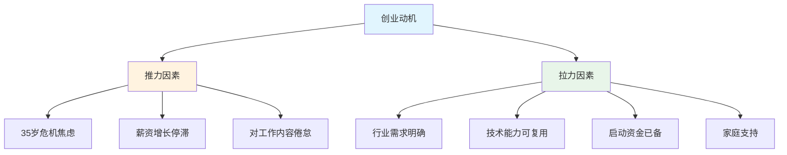
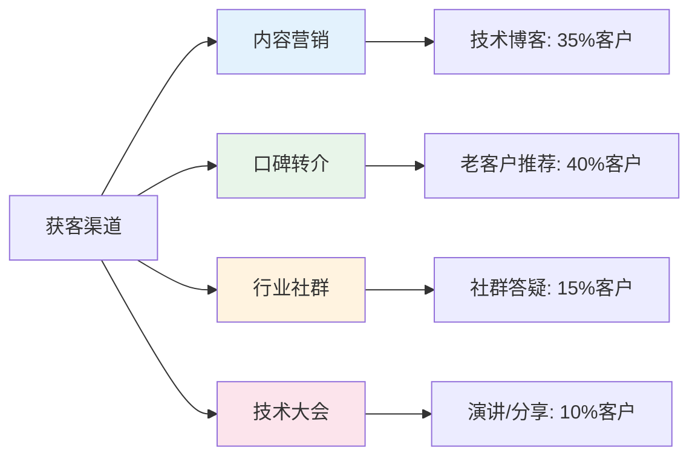
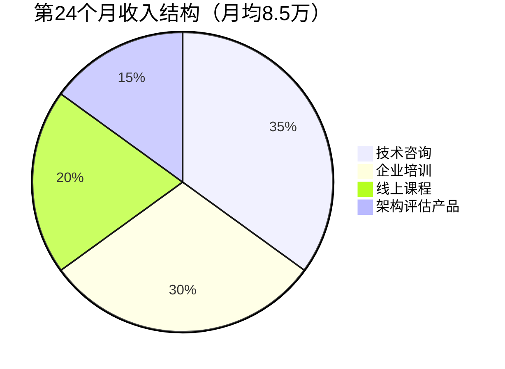
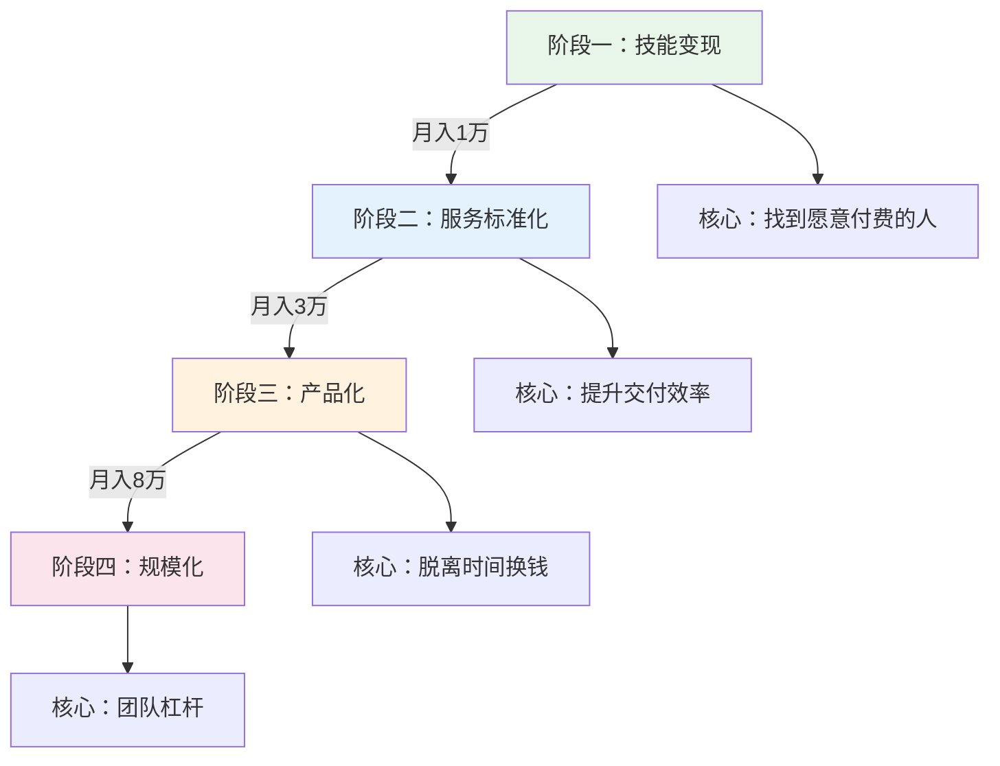

## 案例四：创业者的财富加速

30-40岁是创业的黄金窗口期。与20多岁的冲动创业不同，这个阶段的创业者通常积累了行业认知、人脉资源和一定的资金储备，创业成功率显著更高。本案例还原了一位32岁技术主管从副业试水到全职创业，用三年时间实现年营收120万的完整路径。

### 案例背景

#### 人物画像

| 维度 | 详情 |
|------|------|
| 化名 | 陈明远 |
| 年龄 | 启动时32岁 |
| 学历 | 本科，计算机科学专业 |
| 职业 | 某中型软件公司技术主管 |
| 年薪 | 35万（含奖金） |
| 家庭 | 已婚，育有一子（2岁），妻子为小学教师 |
| 城市 | 成都（新一线城市） |
| 储蓄 | 45万（含理财） |
| 负债 | 房贷余额80万，月供6500元 |

#### 创业前的状态

陈明远在公司工作7年，从初级开发做到技术主管，带12人团队。技术能力扎实，但薪资增长已进入平台期——连续两年调薪幅度不超过5%。他面临的核心矛盾：

- **收入天花板**：公司中层技术岗年薪上限约40万，再往上需要转管理或跳槽
- **时间挤压**：996工作制下几乎没有个人时间，陪伴家人的时间严重不足
- **价值错位**：为公司创造的项目价值远超个人所得，剩余价值被公司拿走
- **年龄焦虑**：互联网行业35岁危机迫在眉睫，越晚行动选择越少

#### 创业动机分析



### 第一阶段：副业验证（第1-6个月）

陈明远没有冲动辞职，而是选择了一条更稳健的路径——**先用副业验证商业模式，再决定是否全职投入**。

#### 技能盘点与市场分析

他对自己做了系统的技能盘点：

| 技能类别 | 具体能力 | 市场需求 | 变现潜力 |
|----------|----------|----------|----------|
| 核心技能 | Java/微服务架构 | 高 | 高 |
| 核心技能 | 数据库优化 | 高 | 中高 |
| 辅助技能 | 技术团队管理 | 中 | 中 |
| 辅助技能 | 技术方案设计 | 高 | 高 |
| 兴趣技能 | 技术写作/分享 | 中 | 低-中 |
| 兴趣技能 | 开源项目贡献 | 中 | 间接价值 |

通过分析，他锁定了三个潜在方向：

1. **技术咨询**：为中小企业提供架构设计和代码审查
2. **企业培训**：为团队提供Java/微服务技术培训
3. **技术自媒体**：通过内容积累影响力，后期转化为课程和服务

最终选择**技术咨询作为主攻方向**，原因：

- 启动成本几乎为零（卖的是经验和知识）
- 客单价高（单次咨询500-2000元）
- 与本职工作互补（不涉及竞业限制）
- 可以逐步积累案例和口碑

#### 副业启动的具体操作

**第一步：建立线上存在感（第1-2个月）**

- 在掘金、知乎开设技术专栏，每周发布2篇深度技术文章
- 主题聚焦在"微服务架构实战"和"数据库性能优化"两个细分领域
- 文章风格：不讲理论空话，每篇都以真实项目问题为切入点，给出具体解决方案
- 两个月产出16篇文章，总阅读量约8万

**第二步：流量转化（第2-3个月）**

- 在文章末尾留个人微信，注明"架构问题可免费咨询30分钟"
- 建立"架构优化交流群"，初期50人，通过内容引流逐步增长
- 每周在群里免费解答2-3个技术问题，建立信任

**第三步：首单突破（第3-4个月）**

- 一位群友的公司遇到数据库慢查询问题，邀请他做付费诊断
- 首单定价800元/次，花了3小时定位问题并给出优化方案
- 客户反馈：优化后查询速度提升20倍，节省了服务器扩容成本
- 客户主动在朋友圈推荐，带来3个新客户

**第四步：定价与服务标准化（第4-6个月）**

他设计了三级服务套餐：

| 服务等级 | 内容 | 定价 | 时长 | 交付物 |
|----------|------|------|------|--------|
| 基础诊断 | 远程代码/架构Review | 500元 | 1.5小时 | 问题清单+优化建议 |
| 深度优化 | 现场诊断+方案设计 | 2000元 | 1天 | 优化方案文档+实施指导 |
| 长期顾问 | 按月技术顾问 | 5000元/月 | 每周2小时 | 随时咨询+月度架构Review |

#### 副业阶段的成果

| 指标 | 第1个月 | 第3个月 | 第6个月 |
|------|---------|---------|---------|
| 月收入 | 0 | 1,600元 | 8,500元 |
| 累计客户 | 0 | 2个 | 8个 |
| 内容产出 | 8篇 | 28篇 | 52篇 |
| 微信好友 | 30人 | 180人 | 450人 |
| 交流群人数 | 50人 | 200人 | 500人 |
| 客户复购率 | - | 50% | 62.5% |

#### 副业阶段的教训

1. **时间管理失控**：前三个月每天加班到11点后还要写文章、回复客户，身心俱疲。后来严格划分时间块：工作日晚上9:00-10:30处理副业，周末集中产出内容
2. **定价过低**：首单800元事后觉得太低——客户节省了至少5万元的服务器成本。第三个月开始提价，新客户不打折
3. **免费咨询陷阱**：初期为了获客提供大量免费咨询，结果有些人只蹭免费不付费。后来改为"首次30分钟免费，超时按标准收费"
4. **竞业风险**：仔细研读了劳动合同，确认技术咨询服务不在竞业限制范围内，但仍然避免接触直接竞争对手的项目

### 第二阶段：全职创业（第7-18个月）

副业稳定月入8000+后，陈明远做出了一个关键决策：**辞职全职创业**。

#### 辞职决策的量化分析

他没有凭感觉做决定，而是建了一张决策矩阵：

| 评估维度 | 权重 | 继续打工（1-10分） | 全职创业（1-10分） |
|----------|------|-------------------|-------------------|
| 收入上限 | 25% | 5 | 9 |
| 时间自由度 | 20% | 3 | 8 |
| 风险可控性 | 20% | 8 | 5 |
| 成长空间 | 15% | 4 | 9 |
| 家庭陪伴 | 10% | 3 | 7 |
| 社会价值感 | 10% | 5 | 9 |
| **加权总分** | **100%** | **4.6** | **7.65** |

但他给自己设了一个**安全底线**：

- 银行存款不低于20万（够家庭18个月基本开支）
- 副业月收入不低于8000元且连续3个月
- 妻子收入能覆盖房贷月供（妻子年收入约10万）
- 至少有3个稳定付费客户

四个条件全部满足后，他正式提了离职。

#### 创业初期的关键动作

**注册公司与税务规划**

| 事项 | 选择 | 原因 |
|------|------|------|
| 公司类型 | 有限责任公司 | 风险隔离，有限责任 |
| 注册资本 | 50万（认缴） | 不占用现金流 |
| 纳税人类型 | 小规模纳税人 | 季度营收30万内免增值税 |
| 记账方式 | 代理记账（200元/月） | 节省精力，专业合规 |
| 开票类型 | 普通发票 | 满足大部分B端客户需求 |

**办公模式选择**

陈明远没有租办公室，而是采用**家庭办公+咖啡厅+客户现场**的混合模式：

- 日常工作在家（书房改造为独立工作区）
- 需要专注时去共享办公空间（月卡800元，每周去2-3天）
- 客户会议在客户公司或咖啡厅
- 年节省办公成本约10万

**客户获取策略升级**

从被动等客户转变为主动出击：



他发现**口碑转介是最高质量的获客渠道**——转介客户的成交率是内容引流的3倍，且对价格敏感度更低。

**产品化思维**

他意识到单纯卖时间有天花板，开始将服务产品化：

1. **标准化诊断报告模板**：从2小时定制变为45分钟填充，效率提升60%
2. **常见问题知识库**：整理了50+个常见架构问题的标准解答，减少重复劳动
3. **自动化工具集**：开发了几个小工具帮助客户做代码质量扫描、SQL慢查询分析
4. **线上课程雏形**：将高频咨询内容录制为视频课程，定价199元/套

#### 全职创业阶段的财务数据

| 指标 | 第7个月 | 第12个月 | 第18个月 |
|------|---------|----------|----------|
| 月营收 | 12,000元 | 35,000元 | 68,000元 |
| 月成本 | 3,500元 | 8,000元 | 15,000元 |
| 月净利润 | 8,500元 | 27,000元 | 53,000元 |
| 累计客户 | 15个 | 38个 | 72个 |
| 客户复购率 | 60% | 55% | 52% |
| 人均客单价 | 2,800元 | 4,200元 | 5,500元 |
| 每周工作时长 | 55小时 | 50小时 | 45小时 |

复购率从60%降到52%并非坏事——随着客户基数增大，新客户占比提高，新客户首次购买不算复购。实际老客户留存率稳定在80%以上。

#### 全职创业阶段的关键转折

**第一个转折点：从个人到团队（第10个月）**

客户量增长导致排期冲突，有两个项目不得不拒绝。陈明远做了一个关键决定：**招第一个兼职助手**。

- 人选：前同事，高级开发，周末兼职
- 付费方式：项目制，每个项目分30-40%
- 分工：陈明远负责客户沟通、方案设计、质量把控；助手负责具体执行

这个决定让他的角色从"技术工人"转变为"技术老板"，产能直接翻倍。

**第二个转折点：从咨询到培训（第14个月）**

多位客户提出类似需求："能不能教我们的团队也学会这些？"陈明远抓住信号，推出了企业培训服务：

| 培训产品 | 时长 | 定价 | 目标客户 |
|----------|------|------|----------|
| 微服务架构实战 | 2天 | 3万/场 | 中型企业技术团队 |
| 数据库优化工作坊 | 1天 | 1.5万/场 | 各规模企业 |
| 技术管理入门 | 半天 | 8000元/场 | 新晋技术主管 |
| 线上训练营 | 4周 | 2999元/人 | 个人开发者 |

企业培训的利润率高达70%，且一次准备可多次复用，成为新的利润增长点。

**第三个转折点：从服务到产品（第16个月）**

他把两年咨询中积累的最佳实践整理成一套**"中小企业技术架构健康度评估体系"**，包括：
- 12个维度的评估清单
- 自动化扫描工具
- 标准化报告模板
- 优化建议知识库

这套体系让他从"卖时间"变成了"卖方法论"，单次评估收费5000元，实际工作时间只需2小时。

### 第三阶段：规模化（第19-36个月）

#### 业务结构演进

到第24个月，陈明远的业务已经形成了清晰的收入结构：



#### 团队建设

| 阶段 | 时间 | 团队规模 | 月人力成本 |
|------|------|----------|-----------|
| 独立作战 | 1-9个月 | 1人 | 0 |
| 兼职协作 | 10-15个月 | 1+1（兼职） | 4,000元 |
| 小团队 | 16-24个月 | 1+2（1兼职1全职） | 15,000元 |
| 正规化 | 25-36个月 | 1+4（1兼职3全职） | 45,000元 |

招人的节奏严格遵循**"业务先行，人力跟进"**原则——先有足够撑满一个人的业务量，再招人。绝不提前囤人。

#### 第36个月的终态数据

| 指标 | 数据 |
|------|------|
| 年营收 | 120万元 |
| 年成本 | 65万（人力45万+办公5万+营销8万+其他7万） |
| 年净利润 | 55万元 |
| 相比打工年薪增幅 | +57%（原年薪35万） |
| 每周工作时长 | 42小时 |
| 累计服务客户 | 180+ |
| 线上课程学员 | 3,200人 |
| 技术文章总阅读 | 180万+ |
| 微信好友 | 2,800人 |
| 交流群总人数 | 2,500人 |

### 核心方法论：创业者的财富加速引擎

陈明远的案例提炼出一套可复制的"财富加速引擎"模型：

#### 加速引擎四阶段



#### 每个阶段的关键能力

| 阶段 | 关键能力 | 常见瓶颈 | 突破方法 |
|------|----------|----------|----------|
| 技能变现 | 获客能力 | 找不到客户 | 持续内容输出+精准定位 |
| 服务标准化 | 流程设计 | 交付质量不稳定 | 模板化+SOP+Checklist |
| 产品化 | 抽象能力 | 无法脱离个人经验 | 知识库+工具+课程 |
| 规模化 | 团队管理 | 招不到合适的人 | 价值观>技能，先兼职后全职 |

### 创业者必须避免的七个陷阱

#### 陷阱一：过早辞职

很多创业者在副业收入为零时就辞职，导致经济压力巨大，被迫接低价单，陷入恶性循环。

**正确做法**：副业月收入达到本职月薪的50%以上，且连续稳定3个月，再考虑辞职。同时储备至少12个月家庭开支的现金。

#### 陷阱二：定价过低

"我的服务值多少钱？"这是创业者最难回答的问题。多数人会低估自己的价值。

**定价公式参考**：

```text
基准价格 = （你为客户创造的价值 × 10%）

举例：
- 你帮客户优化了数据库，节省了30万/年的服务器成本
- 你的收费应该是 30万 × 10% = 3万元
- 而不是按你的工时 × 时薪 = 2000元
```

**定价的心理关**：如果客户对你的报价一口答应，说明你报低了。合理的报价应该让客户犹豫一下，但最终觉得"值"。

#### 陷阱三：只做不说

技术型创业者最容易犯的错误——埋头干活，不做营销。酒香也怕巷子深。

**内容营销的最小可行方案**：

- 每周1篇技术文章（1500-3000字）
- 每月1次社群分享（30分钟）
- 每季度1次行业大会演讲
- 每个客户案例写1篇复盘

坚持6个月，你的名字就会在细分领域有辨识度。

#### 陷阱四：不懂拒绝

创业初期饥不择食，什么活都接——低价项目、超出能力范围的需求、拖延付款的客户。

**必须拒绝的三类客户**：

1. **砍价超过30%的客户**：说明他不认可你的价值，后续合作会很痛苦
2. **需求模糊且不愿花时间沟通的客户**：项目必然烂尾
3. **付款条件超过60天的客户**：现金流是创业公司的命

#### 陷阱五：忽视合同和税务

口头约定、不开发票、不签合同——这些"省事"的做法迟早会出问题。

**最低限度的合规清单**：

- 每个项目签书面合同（哪怕只有一页）
- 所有收入走公司账户
- 按季度申报纳税
- 保留所有业务相关的发票和凭证
- 购买职业责任险（年费约2000元，保额100万）

#### 陷阱六：单打独斗

一个人扛所有事情——技术、销售、财务、行政。结果是每件事都做到60分，没有一件事做到90分。

**外包优先级**：

| 优先外包 | 理由 |
|----------|------|
| 记账报税 | 专业性强，出错成本高 |
| 合同审核 | 法律风险大 |
| 平面设计 | 影响专业形象 |
| 内容分发 | 重复性高，可标准化 |

| 不要外包 | 理由 |
|----------|------|
| 核心技术交付 | 这是你的核心竞争力 |
| 客户关系维护 | 信任建立在个人关系上 |
| 定价策略 | 利润的源头 |
| 战略方向 | 创始人的不可替代性 |

#### 陷阱七：收入增长但没有资产积累

很多创业者忙了三年，收入是增长了，但停下来收入就归零——因为所有价值都绑定在个人身上。

**构建资产的四个方向**：

1. **知识资产**：课程、书籍、方法论——一次创建，多次销售
2. **品牌资产**：个人IP、行业影响力——带来溢价和转介
3. **系统资产**：自动化工具、评估体系——降低对个人的依赖
4. **关系资产**：客户网络、行业人脉——持续产生商业机会

### 创业者的财务规划要点

#### 现金流管理

创业者的收入波动大，现金流管理比打工时更重要：

| 策略 | 具体做法 |
|------|----------|
| 收入分账 | 收入到账后立即分三份：50%运营、30%个人、20%储备 |
| 储备金 | 始终保持6个月运营成本的现金储备 |
| 预收款 | 尽量收定金（50%预付），减少垫资 |
| 支出控制 | 创业前两年不买"面子资产"（豪车、大办公室） |

#### 税务优化

作为小规模纳税人，合法的税务优化空间：

- 前期控制季度营收在30万以内（免增值税）
- 合理列支成本：办公设备、差旅、培训、通讯
- 年终奖单独计税（如果给自己发工资）
- 合理使用小微企业所得税优惠政策

#### 保险配置

创业者的保险需求与打工者不同：

| 保险类型 | 优先级 | 原因 |
|----------|--------|------|
| 医疗险（百万医疗） | 必须 | 没有公司社保托底 |
| 重疾险 | 必须 | 大病=停工=零收入 |
| 职业责任险 | 强烈建议 | 保护个人资产 |
| 定期寿险 | 必须 | 有房贷和家庭责任 |
| 意外险 | 建议 | 成本低，杠杆高 |

### 可复制的行动清单

如果你也在30-40岁考虑创业，以下是按时间线整理的行动清单：

**准备期（辞职前3-6个月）**

- [ ] 完成技能盘点，确定变现方向
- [ ] 注册公司、开通银行账户、找代理记账
- [ ] 开始每周产出1篇行业内容
- [ ] 建立至少1个客户获取渠道
- [ ] 存够18个月家庭开支的现金
- [ ] 与家人充分沟通，达成共识
- [ ] 确认无竞业限制或已过竞业期

**启动期（辞职后1-3个月）**

- [ ] 完成前3个付费项目，建立案例库
- [ ] 设计标准化服务套餐和定价体系
- [ ] 建立客户管理系统（哪怕只是Excel）
- [ ] 每月复盘财务数据
- [ ] 加入3-5个行业社群，每周活跃互动

**成长期（4-12个月）**

- [ ] 月营收突破3万
- [ ] 找到第一个兼职协作伙伴
- [ ] 将高频服务模板化
- [ ] 开始积累线上课程素材
- [ ] 建立客户转介激励机制

**加速期（13-24个月）**

- [ ] 月营收突破8万
- [ ] 团队扩展到3人以上
- [ ] 推出至少1个产品化服务
- [ ] 在细分领域建立个人品牌
- [ ] 开始系统性构建资产（课程/工具/方法论）

### 案例启示

陈明远的故事不是一夜暴富的传奇，而是一个**系统性积累、阶段性突破**的过程。他的核心策略可以总结为三句话：

1. **先验证再投入**：用副业验证商业模式，不赌一把辞职创业
2. **先深度再广度**：在"微服务架构"这个细分领域做到极致，再横向扩展
3. **先服务再产品**：通过咨询服务积累经验和案例，再将经验产品化

30-40岁的创业者最大的优势不是体力和冲劲，而是**行业认知和判断力**。用好这个优势，创业的财富加速效果远超打工的线性增长。

> 陈明远在第36个月接受采访时说："回头看，最正确的决定不是辞职创业，而是辞职前那6个月的副业验证。它让我在最安全的情况下找到了正确的方向。"
