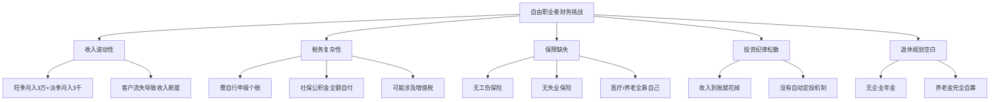
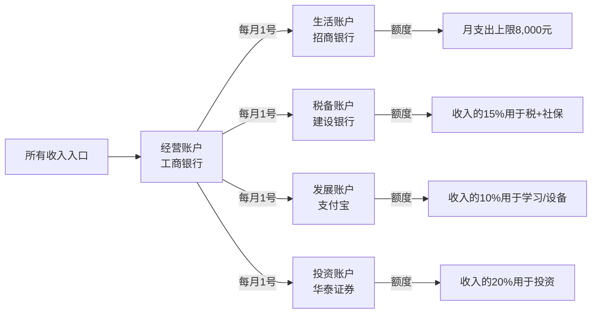
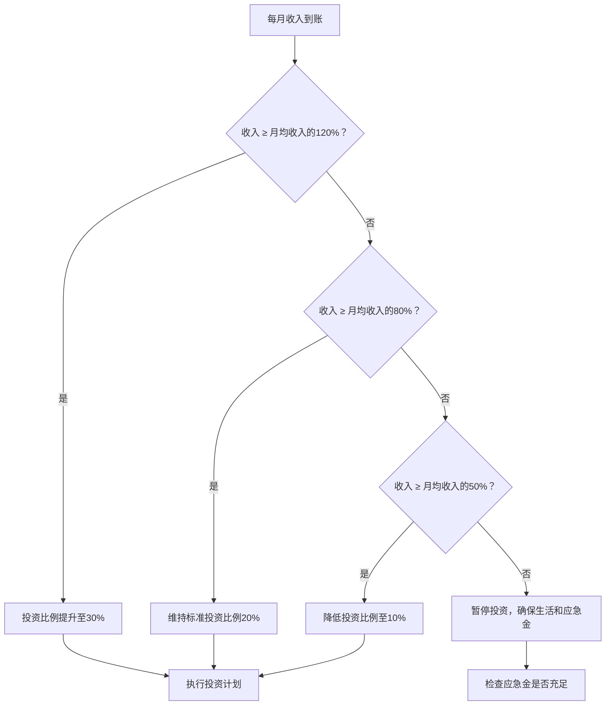

## 案例五：自由职业者的财富管理

自由职业者（Freelancer）是30-40岁加速期中一个特殊但日益庞大的群体。据《中国灵活用工发展报告》数据，2025年国内灵活就业人口已突破2亿，其中30-40岁占比约35%。这个群体面临的核心矛盾是：**收入天花板可能很高，但收入地板也可能很低**——没有固定工资托底，没有五险一金兜底，一切风险自担。

本案例完整记录一位自由职业者从"裸辞下海"到"年入50万+稳定资产配置"的全过程，涵盖收入体系建设、税务优化、保险规划、投资策略和退休准备五大维度。

### 案例背景

#### 人物画像

| 维度 | 详情 |
|------|------|
| 姓名 | 张晨（化名） |
| 年龄 | 32岁（案例开始时） |
| 所在城市 | 杭州 |
| 原职业 | 某互联网公司UI设计师，月薪18,000元 |
| 辞职原因 | 996疲劳、渴望时间自由、副业收入已超过主业 |
| 家庭状况 | 已婚，配偶为小学教师（月薪8,000元），暂无子女 |
| 辞职前资产 | 存款25万，公积金余额8万，无房产 |
| 辞职前负债 | 无 |

#### 辞职前的副业基础

张晨并非冲动裸辞。辞职前6个月，他的副业已形成初步体系：

| 副业渠道 | 月均收入 | 客户来源 | 时间投入 |
|----------|----------|----------|----------|
| 站酷/UI中国接单 | 3,000-5,000元 | 平台推荐+老客户转介 | 每周10小时 |
| 猪八戒/一品威客 | 2,000-4,000元 | 平台竞标 | 每周8小时 |
| 老同事私单 | 1,000-3,000元 | 人脉推荐 | 不固定 |
| **合计** | **6,000-12,000元** | — | **每周约18小时** |

**关键决策依据：** 副业月均收入连续6个月超过8,000元（即主业月薪的44%），且呈上升趋势，才正式辞职。这个阈值的计算逻辑是：

```text
安全阈值 = (月固定支出 × 6个月应急储备) ÷ 现有存款可支撑月数
张晨的情况：月支出约8,000元，存款25万可支撑31个月
副业需达到主业收入的40%以上才值得冒险
```

### 自由职业者面临的五大财务挑战

在展开张晨的执行过程前，先厘清自由职业者在财富管理上与上班族的核心差异：



#### 与上班族的财务结构对比

| 维度 | 上班族 | 自由职业者 | 差异影响 |
|------|--------|------------|----------|
| 收入稳定性 | 月薪固定 | 月度波动30%-70% | 需要更大应急储备 |
| 社保缴纳 | 企业+个人共担（企业约30%） | 全额自付（约40%） | 每年多支出2-5万 |
| 个税申报 | 企业代扣代缴 | 自行申报/代开发票 | 需要税务知识 |
| 公积金 | 企业+个人各5%-12% | 可自愿缴纳（部分城市） | 失去低息贷款资格 |
| 年终奖 | 通常有 | 无 | 需自行攒"13薪" |
| 职业培训 | 企业买单 | 自费 | 每年5,000-20,000元隐性成本 |
| 退休金 | 社保+企业年金 | 仅社保（自缴档） | 退休金可能少40%-60% |

### 第一阶段：稳根基（第1-6个月）

#### 1. 建立"三账体系"

张晨辞职后第一件事是建立严格的财务分账系统，这是自由职业者财富管理的基石：



**各账户具体规则：**

- **经营账户（工商银行）：** 所有客户付款汇入此账户。不绑定任何消费APP，不开通快捷支付。每月1号按比例向其他账户转账。这是"收入蓄水池"。
- **生活账户（招商银行）：** 日常消费、房租、餐饮、交通。设置月度预算上限8,000元，使用招商银行App的"月度账单"功能监控。超额时从下月额度扣除，不从其他账户挪用。
- **税备账户（建设银行）：** 每月存入收入的15%。自由职业者需自行缴纳社保（以杭州为例，2025年灵活就业社保月缴约1,800元）和个税。此账户只进不出，季度末/年末统一支付。
- **发展账户（支付宝）：** 收入的10%，用于购买课程、软件订阅（Figma/Adobe全家桶约6,000元/年）、设备更新、参加行业活动。
- **投资账户（华泰证券）：** 收入的20%，自动转入后执行定投策略（后文详述）。

**剩余收入分配：** 55%留在经营账户作为业务运营资金和缓冲金，当经营账户余额超过6个月平均收入时，溢出部分转入投资账户。

#### 2. 重建社保体系

自由职业者社保是最大盲区。张晨的方案：

| 险种 | 方案 | 月缴金额 | 说明 |
|------|------|----------|------|
| 养老保险 | 灵活就业人员社保（60%档） | 约1,100元 | 杭州2025年标准，缴满15年可领养老金 |
| 医疗保险 | 灵活就业人员医保 | 约500元 | 含大病统筹，报销比例与职工医保相当 |
| 工伤保险 | 商业意外险替代 | 约80元/月 | 保额50万，含意外医疗5万 |
| 失业保险 | 不缴（灵活就业无此险种） | 0 | 用6个月应急金替代 |
| 生育保险 | 商业生育险 | 约120元/月 | 配偶有教师编制可忽略此项 |
| **合计** | — | **约1,800元/月** | 年缴约21,600元 |

**公积金策略：** 杭州允许灵活就业者自愿缴存公积金。张晨选择月缴1,000元（个人全额承担），理由是：未来购房可享受公积金贷款利率（3.1% vs 商贷4.2%），1,000元/月的投入在贷款时可节省数万利息。

#### 3. 应急金快速达标

辞职时存款25万，张晨的第一优先级是确保应急金充足：

```text
应急金目标 = 月均支出 × 8个月（自由职业者比上班族多预留2个月）
           = 8,000 × 8 = 64,000元

辞职时已有存款：250,000元
扣除应急金后可投资金：186,000元
```

应急金存入货币基金（余额宝/零钱通），年化约1.8%-2.2%，兼顾流动性和收益。不存定期，因为自由职业者可能随时需要动用。

### 第二阶段：扩收入（第7-18个月）

#### 1. 从"接单"到"产品化"

张晨意识到纯接单模式的天花板很低——单价再高，一天也只有24小时。他开始将服务产品化：

**转型路径：**


**具体产品矩阵：**

| 产品类型 | 定价 | 月均销量 | 月收入 | 毛利率 |
|----------|------|----------|--------|--------|
| 基础UI设计（套模板+微调） | 800-1,500元/套 | 6-8套 | 6,000-12,000元 | 85% |
| 定制品牌视觉方案 | 5,000-15,000元/套 | 2-3套 | 10,000-45,000元 | 70% |
| 设计规范文档（标准产品） | 2,000元/份 | 3-5份 | 6,000-10,000元 | 90% |
| Figma组件库（数字产品） | 99-299元/套 | 50-100套 | 5,000-30,000元 | 95% |
| 企业设计顾问（月度retainer） | 5,000-8,000元/月 | 2-3家 | 10,000-24,000元 | 80% |
| 在线课程（录播） | 199-499元/人 | 20-50人 | 4,000-25,000元 | 98% |

**关键突破点：** Figma组件库和在线课程属于"一次制作、反复销售"的数字产品，边际成本接近零。张晨花了3个月打磨了一套B端后台设计组件库（定价199元），上架站酷和自建小程序后，月均销售60-80套，成为稳定的被动收入来源。

#### 2. 获客渠道升级

从依赖平台被动接单，转向多渠道主动获客：

| 渠道 | 投入时间 | 客户质量 | 获客成本 | 张晨的打法 |
|------|----------|----------|----------|------------|
| 站酷/UI中国 | 低（维护作品集） | 中 | 低 | 精选高质量案例展示，不求量求质 |
| 小红书 | 每周3篇（2小时） | 中高 | 低 | 发布"设计改版前后对比"类内容 |
| 微信公众号 | 每周1篇（3小时） | 高 | 低 | 深度设计方法论文章，建立专业形象 |
| 行业社群 | 每天30分钟维护 | 高 | 低 | 在5个设计师/创业者社群活跃 |
| 老客户转介 | 被动 | 最高 | 零 | 做好每一个项目，主动请求转介 |
| 企业直接合作 | 主动BD | 最高 | 中 | 每月联系3-5家目标企业 |

**客户管理核心原则：** 张晨用Notion建立了CRM系统，记录每个客户的需求偏好、沟通风格、项目反馈。当客户数量超过20个时，他开始做客户分层：

- **A类客户（5家）：** 年度合作、预算充足、决策快。优先服务，24小时响应。
- **B类客户（10家）：** 季度合作、预算中等。48小时响应。
- **C类客户：** 一次性合作。按排期响应。

#### 3. 收入里程碑数据

| 时间节点 | 月均收入 | 月均净利润 | 客户数 | 被动收入占比 |
|----------|----------|------------|--------|-------------|
| 第1个月（裸辞） | 8,500元 | 5,200元 | 8个 | 0% |
| 第6个月 | 15,000元 | 10,500元 | 14个 | 5% |
| 第12个月 | 28,000元 | 21,000元 | 22个 | 15% |
| 第18个月 | 42,000元 | 33,000元 | 28个 | 25% |
| 第24个月（稳定期） | 48,000元 | 38,000元 | 30个 | 30% |

### 第三阶段：建体系（第19-30个月）

#### 1. 税务优化方案

自由职业者的税负管理是财富增长的隐形杠杆。张晨的税务优化经过三个版本迭代：

**版本1（辞职初期）：个人直接申报**

```text
适用场景：年收入<12万，客户愿意代扣代缴
操作方式：客户按"劳务报酬"预扣20%个税，年度汇算清缴多退少补
痛点：税负重（劳务报酬税率20%-40%），且客户常要求提供发票
```

**版本2（年收入12-30万）：注册个体工商户**

```text
适用场景：收入稳定，需要正规发票
操作方式：注册"张晨设计工作室"（个体工商户），选择核定征收
税负计算：
  年收入30万 → 核定利润率10% → 应税所得3万
  适用税率5%（年应税所得≤3万部分）→ 个税约1,500元
  增值税：小规模纳税人，季度≤30万免征
  综合税负率：约0.5%（vs 劳务报酬约15%-20%）
节省金额：约4-5万/年
```

**版本3（年收入30万+）：个体户+合理费用列支**

```text
操作方式：在版本2基础上，将合理业务支出纳入成本
可列支费用：
  - 办公场地租金（家庭办公按面积比例分摊）
  - 设备折旧（电脑、显示器、数位板等）
  - 软件订阅（Figma、Adobe、Notion等）
  - 业务差旅费
  - 专业培训费
  - 商业保险费
年节省额外税款：约3,000-8,000元
```

**重要提醒：** 2025年起多地收紧个体户核定征收政策，部分地区已改为查账征收。注册前务必咨询当地税务局或专业财税顾问，确保合规。张晨的做法是每年花2,000元请兼职会计处理账务和报税，这笔钱绝对值得。

#### 2. 保险完整方案

自由职业者的保险配置比上班族更复杂，因为没有企业团体险兜底：

| 险种 | 产品类型 | 年缴保费 | 保额 | 必要性 | 配置逻辑 |
|------|----------|----------|------|--------|----------|
| 医保 | 灵活就业社保 | 6,000元 | 统筹报销 | ★★★★★ | 基础保障，必须缴 |
| 百万医疗 | 众安尊享e生 | 800元 | 400万 | ★★★★★ | 弥补社保报销上限 |
| 重疾险 | 达尔文7号 | 4,500元 | 50万 | ★★★★★ | 覆盖3年收入损失 |
| 意外险 | 小蜜蜂3号 | 168元 | 50万 | ★★★★★ | 自由职业无工伤险 |
| 定期寿险 | 华贵大麦 | 1,200元 | 100万 | ★★★★ | 有房贷/子女后必配 |
| 职业责任险 | 平安设计师责任险 | 600元 | 50万 | ★★★ | 设计师特有风险 |
| **年缴合计** | — | **约13,300元** | — | — | 占年收入5%-8% |

**配置优先级说明：**

1. **医保是地基：** 没有医保，百万医疗的免赔额会从1万变成2万，报销比例也会降低。
2. **百万医疗是性价比之王：** 每年几百元保费覆盖大病住院费用，杠杆率极高。
3. **重疾险保护收入能力：** 自由职业者一旦生病无法工作，收入归零。50万重疾险可覆盖约3年基本生活支出。
4. **职业责任险是自由职业者特需：** 如果设计作品引发客户纠纷或侵权索赔，这份保险能兜底。

#### 3. 投资策略：适配波动收入

自由职业者不能照搬上班族的"每月定投X元"策略，因为收入不固定。张晨采用的是"阶梯定投法"：



**资产配置方案（年收入稳定在40万+后）：**

| 资产类别 | 配置比例 | 具体标的 | 年化预期 | 流动性 |
|----------|----------|----------|----------|--------|
| 货币基金（应急金） | 15% | 余额宝/零钱通 | 1.8%-2.2% | T+0 |
| 债券基金 | 25% | 易方达稳健收益A | 3%-5% | T+1 |
| 沪深300指数基金 | 25% | 天弘沪深300ETF联接 | 8%-12%（长期） | T+1 |
| 中证500指数基金 | 15% | 南方中证500ETF联接 | 10%-15%（长期） | T+1 |
| 海外指数基金 | 10% | 博时标普500ETF联接 | 8%-10%（长期） | T+2 |
| 黄金ETF | 10% | 华安黄金ETF | 5%-8%（长期） | T+1 |

**定投执行规则：**

- 每月1号检查经营账户余额
- 按"阶梯定投法"确定本月投资金额
- 15号前完成定投操作（分散到月中避免月初集中扣款）
- 每季度末做一次再平衡（偏离目标比例超过5%时调整）
- 年度复盘时根据收入变化调整整体配置比例

### 第四阶段：护城河（第31个月起）

#### 1. 收入多元化矩阵

经过2年半的发展，张晨的收入结构从"纯接单"进化为多元化矩阵：

| 收入类型 | 月均收入 | 占比 | 投入时间 | 可持续性 |
|----------|----------|------|----------|----------|
| 定制设计服务 | 18,000元 | 37% | 每周20小时 | 依赖个人精力 |
| 企业顾问（retainer） | 12,000元 | 25% | 每周5小时 | 合同保障，较稳定 |
| 数字产品销售 | 8,000元 | 17% | 维护2小时/月 | 被动收入，高可持续 |
| 在线课程 | 6,000元 | 12% | 录制一次，后续维护 | 被动收入 |
| 版税/授权费 | 4,000元 | 8% | 零 | 纯被动 |
| **合计** | **48,000元** | **100%** | **每周约27小时** | — |

**关键指标：** 被动收入占比37%（数字产品+课程+版税），这意味着即使张晨完全停工一个月，仍有约18,000元收入进账。

#### 2. 退休规划：自由职业者的终极挑战

自由职业者没有企业年金，退休金完全依赖个人社保+自行投资。张晨的退休规划：

**社保养老金测算（按杭州60%档缴满30年）：**

```text
基础养老金 = (全省上年度在岗职工月平均工资 + 本人指数化月平均缴费工资) ÷ 2 × 缴费年限 × 1%
假设2055年杭州社平工资15,000元：
基础养老金 = (15,000 + 9,000) ÷ 2 × 30 × 1% = 3,600元/月

个人账户养老金 = 个人账户累计额 ÷ 计发月数(60岁=139)
假设个人账户累计约30万：300,000 ÷ 139 ≈ 2,158元/月

合计：约5,758元/月（2055年价格水平）
```

**养老金缺口计算：**

```text
退休后期望月支出（2055年价格）：15,000元
社保养老金：5,758元
月缺口：9,242元
退休年限：假设60岁退休，寿命85岁，共25年
总缺口：9,242 × 12 × 25 = 2,772,600元（未考虑通胀和投资收益）
```

**补缺策略：**

1. **个人养老金账户（每年缴满12,000元上限）：** 享受税收优惠，30年累计约36万本金+投资收益
2. **指数基金定投（退休专用账户）：** 每月3,000元定投宽基指数，30年按年化8%计算终值约440万
3. **租金收入（若购置房产）：** 一套投资房产的租金可提供每月3,000-5,000元补充
4. **数字产品持续销售：** 退休后维护成本极低，可持续产生被动收入

#### 3. 职业风险对冲

自由职业者最大的风险不是收入低，而是"能力过时"和"健康崩溃"。张晨的风险对冲策略：

**能力保鲜：**
- 每年投入收入的5%-8%用于学习（2025年约24,000-38,000元）
- 每季度学习一项新工具/新趋势（如AI设计工具Midjourney/Stable Diffusion集成）
- 保持10%的工作时间用于实验性项目（不为赚钱，为探索新方向）

**健康投资：**
- 每周运动3次（跑步/游泳），年费约3,000元（健身房会员）
- 每年一次全面体检（约2,000元），自由职业者容易忽视体检
- 工作时间管理：严格控制每日屏幕时间不超过8小时，每50分钟休息10分钟

### 常见误区与纠正

| 误区 | 真相 | 纠正方法 |
|------|------|----------|
| "收入高了再理财" | 收入波动大时更需要理财 | 从第一笔收入开始分账 |
| "社保不重要，商业保险就够了" | 社保是基础，商保是补充 | 先缴社保，再配商保 |
| "注册公司节税" | 小规模个体户比公司更省税 | 年收入<100万优先选个体户 |
| "自由职业不需要应急金" | 比上班族更需要 | 至少6个月支出，建议8个月 |
| "被动收入不需要投入" | 前期投入大量时间和精力 | 先花3-6个月打磨产品 |
| "接单越多越好" | 低质量单消耗精力、压低单价 | 做减法，聚焦高价值客户 |
| "投资可以等收入稳定后" | 投资纪律比金额重要 | 从100元/月开始定投 |
| "自由职业不用学习" | 技术迭代快，不学习就被淘汰 | 年收入的5%-8%投入学习 |

### 张晨的五年财务数据总览

| 指标 | 第1年 | 第2年 | 第3年 | 第4年 | 第5年 |
|------|-------|-------|-------|-------|-------|
| 年总收入 | 18万 | 36万 | 50万 | 55万 | 58万 |
| 年净利润 | 12万 | 28万 | 40万 | 44万 | 46万 |
| 被动收入占比 | 3% | 18% | 30% | 35% | 40% |
| 年投资额 | 2万 | 6万 | 10万 | 12万 | 14万 |
| 累计资产 | 27万 | 55万 | 95万 | 135万 | 180万 |
| 月均工作时长 | 200小时 | 180小时 | 160小时 | 140小时 | 130小时 |
| 时薪（净利润÷工时） | 50元 | 130元 | 210元 | 260元 | 295元 |

**五年核心变化：** 总收入增长222%，但工作时长减少35%。这意味着张晨的单位时间价值（时薪）从50元提升到295元，增长近6倍。这就是自由职业者财富管理的终极目标——**用更少的时间赚更多的钱，同时建立不依赖个人劳动的被动收入体系**。

### 工具清单

| 用途 | 推荐工具 | 费用 | 说明 |
|------|----------|------|------|
| 记账 | 随手记/钱迹 | 免费 | 严格记录每笔收支 |
| 分账管理 | 多银行账户+Excel | 免费 | 按前文"三账体系"执行 |
| 客户管理 | Notion/飞书多维表格 | 免费 | 记录客户信息和项目进度 |
| 发票管理 | 电子税务局/航信诺诺 | 免费 | 个体户自助开票 |
| 税务申报 | 个人所得税App+电子税务局 | 免费 | 季度预缴+年度汇算 |
| 社保缴纳 | 浙里办/当地社保App | 免费 | 灵活就业社保自助缴费 |
| 投资定投 | 天天基金/蛋卷基金 | 免费 | 设置自动定投 |
| 合同管理 | 腾讯电子签/e签宝 | 基础免费 | 在线签署服务合同 |
| 时间追踪 | Toggl/时间块 | 免费 | 记录各项目时间投入 |
| 健康管理 | Keep/华为运动健康 | 免费 | 记录运动和体检数据 |

### 本案例的核心启示

1. **分账先于投资。** 收入到账后第一件事是按比例分配到不同账户，而不是先花后存。
2. **产品化是自由职业者的分水岭。** 从"卖时间"到"卖产品"，是从糊口到富足的关键跃迁。
3. **税务优化是合法的财富加速器。** 个体户核定征收+合理费用列支，综合税负可从20%降到1%以下。
4. **保险配置比上班族更刚需。** 没有企业兜底时，一份完善的保险方案就是你的"企业福利"。
5. **被动收入占比是核心KPI。** 当被动收入超过基本生活支出时，你才真正获得自由。
6. **退休规划从第一天开始。** 自由职业者的退休金全靠自己，越早开始复利效应越大。
