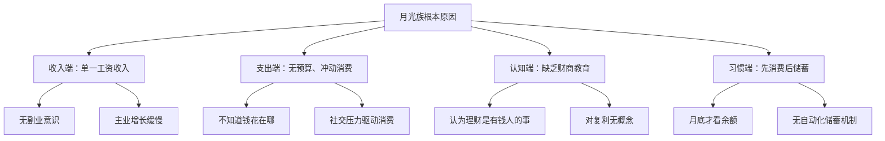
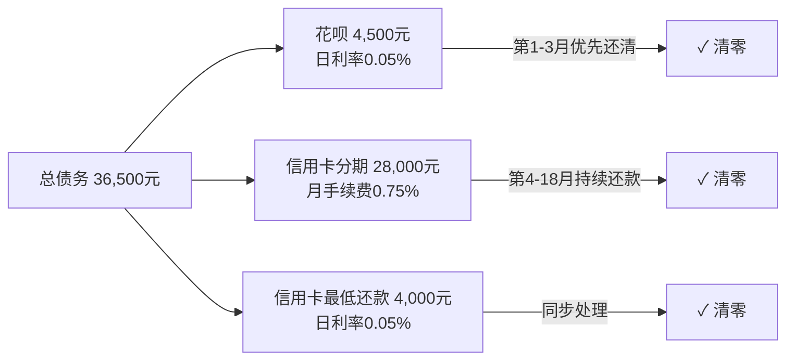
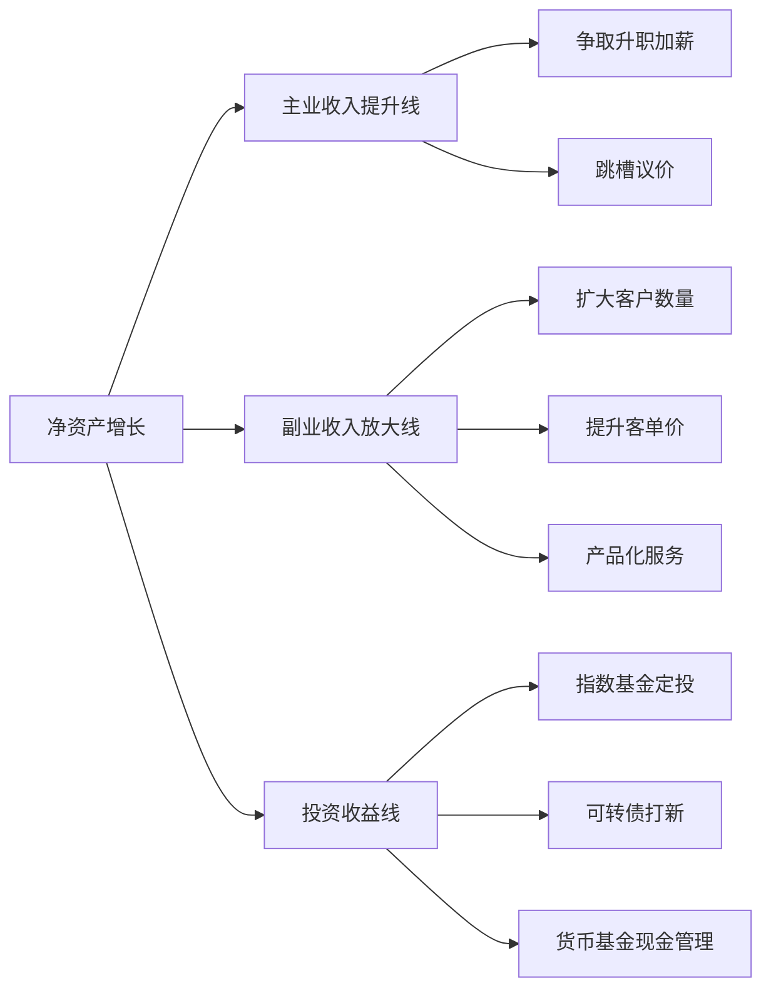
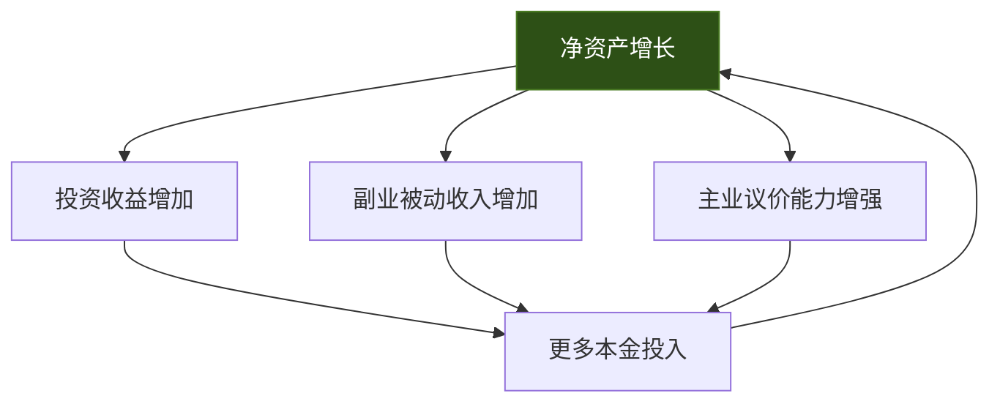
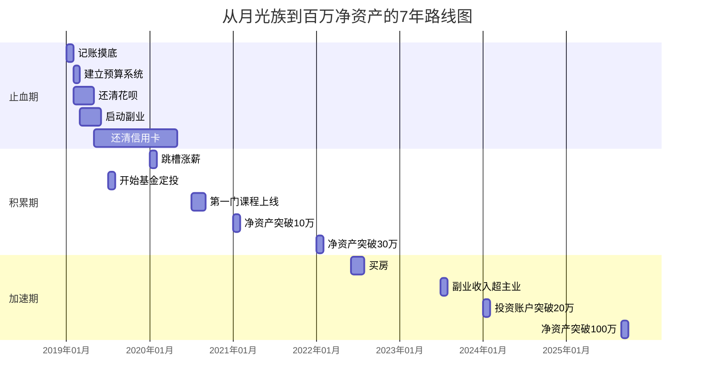

## 案例六：从月光族到百万净资产

> 从每月工资花光、信用卡分期循环，到7年后净资产突破100万——这不是鸡汤，而是一套可复制的系统工程。

### 案例背景

#### 人物画像

| 维度 | 起步时（28岁） | 目标达成时（35岁） |
|------|---------------|-------------------|
| 职业 | 互联网公司运营专员 | 运营经理 + 副业经营者 |
| 税后月收入 | 8,500元 | 主业18,000元 + 副业8,000元 |
| 月结余 | -500元（负债状态） | 15,000元 |
| 净资产 | -32,000元（信用卡+花呗） | 1,080,000元 |
| 资产构成 | 无 | 房产净值42万 + 投资账户38万 + 应急金12万 + 副业设备折旧16万 |

#### 起步时的财务状况

小林（化名），28岁，坐标成都，单身。每月工资到账后按"先消费后存钱"的方式分配：

- 房租：2,200元（合租次卧）
- 餐饮：2,500元（外卖+聚餐）
- 交通：400元
- 购物/娱乐：2,000元（冲动消费严重）
- 订阅服务：300元（视频会员、音乐、健身卡闲置）
- 信用卡分期还款：800元
- 剩余：约300元，通常月底前花光

**核心问题诊断：**

### 第一阶段：止血期——从负债到零（第1-6个月）

#### 道：认知重建

小林在一次同事聊天中接触到"财务自由"概念，读了《小狗钱钱》和《富爸爸穷爸爸》，产生了三个关键认知转变：

1. **收入≠财富**：月入2万但月光的人，不如月入8千但月存3千的人富有
2. **储蓄率比收入更重要**：在收入有限的阶段，提高储蓄率是最快见效的杠杆
3. **时间是最大的资产**：28岁开始，到60岁还有32年，复利效应巨大

#### 法：建立财务管理系统

**第一步：记账摸底（第1个月）**

用随手记APP记录每一笔支出，不改变任何消费习惯，纯粹观察。月底汇总发现：

| 支出类别 | 金额 | 占比 | 备注 |
|---------|------|------|------|
| 必要生存支出 | 4,600元 | 54% | 房租+餐饮+交通 |
| 可选消费 | 2,500元 | 29% | 购物+娱乐+订阅 |
| 债务还款 | 800元 | 9% | 信用卡分期 |
| 其他零散 | 600元 | 7% | 红包、打赏、小物件 |

**关键发现**：可选消费中有1,200元属于"可有可无"级别，订阅服务中有3项已超过3个月未使用。

**第二步：制定50/30/20预算（第2个月启动）**

根据实际收入8,500元制定预算：

| 类别 | 比例 | 金额 | 具体用途 |
|------|------|------|---------|
| 必要支出 | 50% | 4,250元 | 房租、餐饮、交通、日用品 |
| 可选消费 | 30% | 2,550元 | 购物、娱乐、社交 |
| 储蓄/还债 | 20% | 1,700元 | 优先还清信用卡债务 |

**第三步：债务清零计划**

信用卡欠款32,000元，花呗欠款4,500元，合计36,500元。采用"雪崩法"优先偿还利率最高的债务：

#### 术：具体执行动作

**支出端——砍掉可选项：**

1. 取消未使用的订阅服务（爱奇艺、Keep会员），月省180元
2. 将外卖频率从每天1-2次降到每周3次，其余自己做饭，月省800元
3. 建立"48小时冷静期"规则：超过200元的非必需品，放入购物车等48小时再决定
4. 社交聚餐预算封顶每月600元，超出部分主动提议低成本活动（公园、羽毛球）

**收入端——启动副业：**

小林运营岗位的优势是熟悉内容营销和用户增长。第3个月开始试水副业：

| 副业方向 | 投入时间 | 月收入（起步） | 月收入（6个月后） |
|---------|---------|---------------|-----------------|
| 小红书运营代管（2个小商家） | 每周10小时 | 2,000元 | 4,000元 |
| 自媒体写作（公众号+知乎） | 每周5小时 | 0 | 500元 |
| 合计 | 每周15小时 | 2,000元 | 4,500元 |

**器：使用的工具**

- 记账：随手记（免费版）
- 预算管理：Excel自制表格，每月1日更新
- 债务追踪：信用卡APP + 自制还款进度表
- 自动转账：工资卡设置自动转1,700元到专用储蓄账户

#### 第一阶段成果

| 指标 | 第1个月 | 第6个月 |
|------|---------|---------|
| 月收入 | 8,500元 | 10,500元（含副业） |
| 月支出 | 8,900元 | 5,800元 |
| 月结余 | -400元 | 4,700元 |
| 累计净资产 | -36,500元 | -8,200元 |

### 第二阶段：积累期——从零到第一个30万（第7-36个月）

#### 道：从省钱到赚钱的思维跃迁

止血期的核心是"节流"，但仅靠省钱有天花板。进入第二阶段后，小林的认知再次升级：

1. **储蓄是防守，投资是进攻**：只存钱不投资，购买力会被通胀侵蚀
2. **收入增长曲线可以被主动塑造**：通过技能提升和副业放大，收入增长可以远超通胀
3. **资产配置是必修课**：不把鸡蛋放在一个篮子里不是口号，而是具体操作

#### 法：三线并进策略

#### 术：三线具体操作

**主业线——系统性提升薪资**

小林在第12个月跳槽到一家中型互联网公司，薪资从9,500元涨到13,000元。关键动作：

1. 考取了PMP项目管理证书（备考3个月，费用3,500元）
2. 在运营岗位上积累了数据驱动增长的案例集
3. 通过脉脉和猎头主动接触机会，拿到3个offer后选择性价比最高的

**副业线——从卖时间到卖产品**

| 时间节点 | 副业模式 | 月收入 | 关键变化 |
|---------|---------|--------|---------|
| 第7个月 | 代管3个商家 | 5,000元 | 增加1个客户 |
| 第12个月 | 代管4个商家 + 运营课程 | 7,000元 | 录制了第一门小课 |
| 第18个月 | 代管2个商家 + 课程 + 咨询 | 8,000元 | 砍掉低效客户，提升单价 |
| 第24个月 | 课程被动收入 + 咨询 | 9,000元 | 课程可复用，边际成本趋零 |
| 第30个月 | 课程 + 咨询 + 小团队 | 12,000元 | 带了1个兼职助理 |

**关键转折点**：第18个月，小林意识到"卖时间"有上限，开始将代管经验沉淀为课程产品。一门售价199元的《小红书运营实战课》在知识星球上线，前3个月卖出200份，此后月均稳定30-50份。

**投资线——从零开始学投资**

小林的投资策略极其保守，完全符合"不懂不投"原则：

| 投资品种 | 配置比例 | 预期年化 | 实际操作 |
|---------|---------|---------|---------|
| 货币基金 | 30% | 2-3% | 工资到账后自动转入 |
| 沪深300指数基金 | 40% | 8-12%（长期） | 每月1日定投1,500元 |
| 中证500指数基金 | 20% | 8-12%（长期） | 每月15日定投800元 |
| 可转债打新 | 10% | 15-30%（打中时） | 每只新债都申购，中签就卖 |

**投资纪律**：

1. 基金定投坚持了36个月，无论涨跌不停
2. 不看盘、不追热点、不做波段
3. 每季度检查一次资产配置比例，偏离超过5%就再平衡
4. 可转债打新纯属"低风险套利"，中签率虽低但零成本

#### 第二阶段成果

| 指标 | 第7个月 | 第24个月 | 第36个月 |
|------|---------|----------|----------|
| 主业月收入 | 10,500元 | 13,000元 | 15,000元 |
| 副业月收入 | 5,000元 | 8,000元 | 12,000元 |
| 月总支出 | 6,000元 | 7,500元 | 8,000元 |
| 月结余 | 9,500元 | 13,500元 | 19,000元 |
| 累计净资产 | 0元 | 180,000元 | 320,000元 |

### 第三阶段：加速期——从30万到100万（第37-84个月）

#### 道：资产的复利飞轮

当净资产突破30万后，小林发现一个关键现象：**钱开始自己赚钱了**。投资账户的收益、副业的被动收入、以及因为有积蓄而敢于拒绝低质量工作带来的薪资溢价，三者形成了正向飞轮。

#### 法：资产配置升级

净资产突破30万后，小林重新调整了资产配置：

| 资产类别 | 配置比例 | 具体品种 | 目标 |
|---------|---------|---------|------|
| 应急金 | 10% | 货币基金，保持6个月支出 | 流动性 |
| 房产 | 40% | 成都近郊小户型（首付+月供） | 抗通胀+居住 |
| 权益类投资 | 35% | 指数基金+少量个股 | 长期增值 |
| 副业再投资 | 10% | 课程升级、团队扩张 | 收入增长 |
| 学习投资 | 5% | 课程、书籍、行业会议 | 认知升级 |

#### 术：买房决策过程

第38个月，小林做出了最大的财务决策——购买一套总价85万的小户型：

**买房前的财务检查清单：**

1. 应急金是否充足？→ 已存够8个月支出（约64,000元）
2. 首付来源？→ 存款25万 + 公积金余额5万 = 30万（首付比例35%）
3. 月供承受能力？→ 月供3,200元，占月收入的12%，远低于30%警戒线
4. 公积金覆盖比例？→ 公积金月缴2,800元，实际月供现金支出仅400元
5. 是否影响投资计划？→ 不影响，定投继续

**买房后的资产结构变化：**

| 资产 | 金额 | 负债 | 金额 |
|------|------|------|------|
| 房产市值 | 850,000元 | 房贷余额 | 550,000元 |
| 投资账户 | 180,000元 | 信用卡/花呗 | 0元 |
| 应急金 | 64,000元 | - | - |
| 副业设备 | 30,000元 | - | - |
| **总资产** | **1,124,000元** | **总负债** | **550,000元** |
| - | - | **净资产** | **574,000元** |

#### 副业的二次进化

进入第四年，副业收入结构发生了质变：

| 收入来源 | 第37个月 | 第60个月 | 第84个月 |
|---------|----------|----------|----------|
| 运营课程（被动） | 3,000元 | 5,000元 | 5,500元 |
| 1对1咨询 | 4,000元 | 3,000元 | 2,000元 |
| 企业培训 | 0元 | 4,000元 | 6,000元 |
| 自媒体广告 | 1,000元 | 2,000元 | 2,500元 |
| **合计** | **8,000元** | **14,000元** | **16,000元** |

**关键进化**：从"1对1服务"转向"1对多产品"。企业培训1天收入相当于过去1个月的咨询收入。

#### 投资收益实录

6年投资记录（保守估算，含市场波动）：

| 年份 | 年投入本金 | 年底市值 | 年收益率 | 累计收益 |
|------|-----------|----------|---------|---------|
| 第1年 | 27,600元 | 29,200元 | 5.8% | 1,600元 |
| 第2年 | 27,600元 | 62,800元 | 7.1% | 7,600元 |
| 第3年 | 30,000元 | 105,200元 | 6.5% | 17,600元 |
| 第4年 | 36,000元 | 160,800元 | 5.2% | 29,200元 |
| 第5年 | 36,000元 | 222,000元 | 4.8% | 45,600元 |
| 第6年 | 42,000元 | 302,000元 | 6.3% | 71,600元 |

> 注：第4-5年收益率偏低是因为市场调整，但定投策略在下跌时买入了更多份额，第6年反弹后收益显著。

### 最终成果

#### 第84个月（7年）的完整财务快照

| 项目 | 金额 |
|------|------|
| 房产市值 | 980,000元 |
| 房贷余额 | 420,000元 |
| **房产净值** | **560,000元** |
| 投资账户 | 302,000元 |
| 应急金 | 120,000元 |
| 副业设备/版权价值 | 98,000元 |
| **总资产** | **1,080,000元** |
| **总负债** | **420,000元** |
| **净资产** | **1,080,000元** |

#### 关键指标对比

| 指标 | 起步时（28岁） | 达成时（35岁） | 变化幅度 |
|------|---------------|---------------|---------|
| 月收入 | 8,500元 | 26,000元 | +206% |
| 月支出 | 8,900元 | 11,000元 | +24% |
| 月储蓄率 | -4.7% | 57.7% | +62.4个百分点 |
| 净资产 | -36,500元 | 1,080,000元 | 从负债到百万 |
| 投资被动收入 | 0元 | 约2,500元/月 | - |
| 副业被动收入 | 0元 | 约5,500元/月 | - |

### 经验总结：可复制的8条原则

#### 原则一：先记账再预算，先止血再治病

不要一上来就学投资。连自己的钱花在哪都不知道，任何理财策略都是空中楼阁。记账至少坚持1个月，摸清真实支出结构后再制定预算。

#### 原则二：自动化储蓄，让意志力不成为瓶颈

工资到账当天自动转出储蓄金额。人类的意志力是有限资源，不要和自己的本能对抗。设置好自动转账后，你只需要管理"剩下的钱"怎么花。

#### 原则三：副业选择要符合"可积累"标准

| 维度 | 好的副业 | 差的副业 |
|------|---------|---------|
| 时间杠杆 | 做一次，卖多次（课程、模板） | 做一次，只赚一次（跑腿、兼职） |
| 技能复利 | 与主业技能互补 | 与主业完全无关 |
| 启动成本 | 低（电脑+时间） | 高（进货、租场地） |
| 天花板 | 高（可规模化） | 低（受时间限制） |

#### 原则四：投资只用闲钱，只投自己懂的

定投指数基金是普通人最好的投资方式，没有之一。不需要选股能力，不需要盯盘，只需要坚持。小林6年投资的实际年化收益率约5.8%，虽然不算高，但胜在稳定和持续。

#### 原则五：买房要看现金流，不看房价涨跌

小林买房的决策完全基于现金流分析：月供占收入比例低、公积金覆盖大部分、不影响投资和生活。至于房价涨跌，那是锦上添花的事，核心是"买得起且不影响生活质量"。

#### 原则六：从卖时间到卖产品，是副业进化的关键

| 阶段 | 模式 | 收入公式 |
|------|------|---------|
| 初级 | 接单服务 | 收入 = 单价 × 客户数 × 时间 |
| 中级 | 课程产品 | 收入 = 课程价格 × 销量（边际成本趋零） |
| 高级 | 品牌+团队 | 收入 = 品牌溢价 × 团队产出 |

#### 原则七：记账的目的是发现问题，不是自我感动

很多人记账记了半年，数据一堆但生活没变。记账的关键是**每月花30分钟做一次支出复盘**，问自己三个问题：

1. 这个月有哪些支出是"花了后悔"的？
2. 有哪些支出是可以用更低的成本替代的？
3. 下个月的预算需要怎么调整？

#### 原则七：保持生活品质，不要苦行僧式存钱

小林在整个过程中没有过苦行僧式的生活。他仍然会聚餐、旅行、买喜欢的东西，只是频率和方式更理性了。**理财的目的是让生活更好，而不是让生活更苦。**如果存钱让你痛苦不堪，那这个方法一定不可持续。

### 常见误区与纠正

| 误区 | 纠正 |
|------|------|
| "等我有钱了再理财" | 理财从月入3千就可以开始，和金额无关，和习惯有关 |
| "投资就是炒股" | 投资包括基金、债券、房产、自我提升，股票只是其中一种 |
| "副业会耽误主业" | 好的副业和主业是互补关系，小林的副业经验反而帮他在主业上升职 |
| "买房是最好的投资" | 买房首先是解决居住问题，投资属性要看城市、地段、时机 |
| "记账太麻烦坚持不了" | 用APP记账每笔只需10秒，真正麻烦的是月底发现钱不够用 |
| "省钱没用，得赚更多" | 赚得多花得更多的人比比皆是，省钱和赚钱不矛盾 |
| "百万净资产遥不可及" | 拆解到7年，年均积累约16万，月均约1.3万，对双收入家庭完全可行 |

### 不同起点的适用方案

小林的案例基于"月薪8500、28岁起步"的条件。不同起点的读者可以参照以下调整：

| 你的情况 | 调整建议 | 预计达标时间 |
|---------|---------|------------|
| 月薪5,000-8,000 | 重点提升主业收入，副业选择低门槛方向 | 8-10年 |
| 月薪8,000-15,000 | 与案例接近，可直接参考 | 6-8年 |
| 月薪15,000-25,000 | 储蓄率可以更高，加速投资阶段 | 4-6年 |
| 月薪25,000+ | 核心挑战是避免生活方式膨胀 | 3-5年 |
| 已婚双收入 | 优势巨大，两人合力可大幅缩短时间 | 3-5年 |
| 有孩子 | 支出增加但不要放弃储蓄，调整比例而非放弃 | 7-10年 |

### 里程碑时间线

