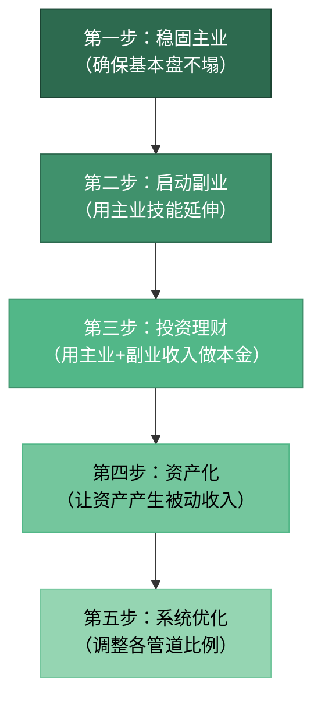
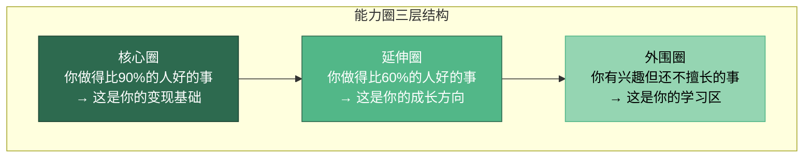
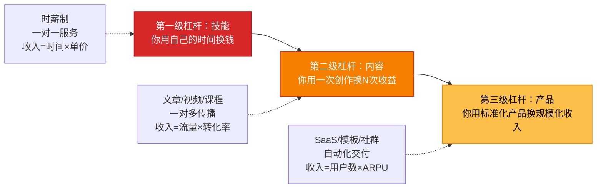
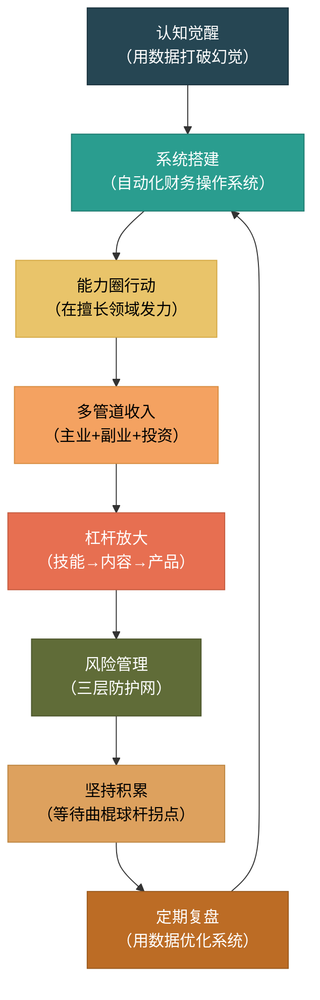

## 案例总结：六个案例的共同规律

六个案例，六种人生起点，六条不同的财富路径——但当我们把镜头拉远，俯瞰这六段经历时，会发现它们共享着同一套底层操作系统。这不是巧合，而是30-40岁财富加速的结构性规律在起作用。本节将从六个案例中提炼出可复制、可验证的共同模式，帮你建立"看透本质"的分析框架。

### 六个案例的核心数据回顾

在提炼规律之前，先用一张表把六个案例的关键数据拉齐，方便横向对比：

| 案例 | 人物画像 | 起步年收入 | 成熟期年收入 | 核心策略 | 达成周期 | 关键转折点 |
|:---:|------|:---:|:---:|------|:---:|------|
| 案例一 | 互联网产品经理，28岁，一线城市 | 25万 | 65万+（主业+副业+投资） | 收入飞轮：主业晋升+产品咨询副业+指数基金定投 | 5年 | 第3年副业收入超过主业30% |
| 案例二 | 传统行业销售经理，32岁，二线城市 | 18万 | 45万 | 行业迁移：从传统制造跳到新能源赛道 | 3年 | 完成新能源行业知识储备后的那次跳槽 |
| 案例三 | 双职工夫妻，均为30岁，新一线城市 | 家庭43万 | 家庭72万 | 家庭CFO制度：系统化收支管理+投资优化 | 4年 | 建立家庭资产负债表后的"财务觉醒" |
| 案例四 | 创业者，33岁，有技术背景 | 波动（0-50万） | 稳定80万+ | 创业+个人资产隔离：公司财务与个人财务严格分离 | 5年 | 第2年现金流转正 |
| 案例五 | 自由职业设计师，29岁，远程工作 | 12万 | 40万 | 非线性收入管理：项目制收入+作品资产化+保险自建 | 4年 | 建立"收入平滑基金"后告别焦虑 |
| 案例六 | 月光族转自律者，27岁，三线城市 | 8万（几乎无储蓄） | 净资产突破100万 | 系统化储蓄+定投+副业三管齐下 | 7年 | 第1年存下第一个5万后的正反馈循环 |

从这张表中可以提取出第一个关键洞察：**六个案例的起点差异巨大（年收入从8万到43万不等），但都实现了2-5倍的财富增长**。这意味着30-40岁的财富加速不是"高收入者的特权"，而是一套适用于不同起点的通用方法论。

### 共同规律一：都经历了"认知觉醒"的拐点

六个案例中，每一个主角都有一个清晰的"觉醒时刻"——在此之前，他们的财务行为是无意识的、被动的；在此之后，他们的每一笔钱都有明确的目的和去向。

**案例一（产品经理）的觉醒时刻**：在一次年终复盘中发现，自己年薪25万，但全年净存款只有3万。他用产品经理的思维画了一张"资金流向图"，发现每月有4000元花在了"不知道花在哪"的模糊消费上。这个发现让他开始系统化地追踪每一笔支出。

**案例三（双职工夫妻）的觉醒时刻**：结婚一年后第一次做家庭资产负债表，发现虽然家庭年收入43万，但扣除房贷、车贷、日常消费后，年净储蓄只有8万——远低于他们的预期。妻子说了一句话："我们赚的不少，但不知道钱去哪了。"

**案例六（月光族）的觉醒时刻**：27岁生日那天，银行卡余额217元。他发了一条朋友圈："工作三年，存款为零。"这条朋友圈收到了47个赞——他意识到，这不是他一个人的问题，而是一代人的困境。

这些觉醒时刻的共同特征是：**用具体数字打破了"感觉还不错"的幻觉**。人在没有数据的时候，会用情绪代替判断——"我觉得花得不多""应该存了一些"。只有当真实数字摆在面前时，行为改变才会发生。

**可复制的操作方法**：

觉醒不是靠"顿悟"，而是靠"诊断"。你需要做一次彻底的财务体检：

1. **拉出过去12个月的银行流水**，按类别分类（住房、餐饮、交通、娱乐、购物、其他）
2. **计算三个核心比率**：
   - 储蓄率 = （年收入 - 年支出）/ 年收入 × 100%
   - 消费弹性 = 非必要支出 / 总支出 × 100%（非必要支出指扣除住房、餐饮、交通后的部分）
   - 资产负债率 = 总负债 / 总资产 × 100%
3. **与同龄人基准对比**（30-30岁健康指标：储蓄率>25%，消费弹性<40%，资产负债率<50%）

如果储蓄率低于20%，说明你的"财务操作系统"有漏洞——不是赚得不够，而是留不住。

### 共同规律二：都构建了"多管道收入"结构

这是六个案例中**最显著的共同点**。没有一个案例的主角是只靠单一工资收入实现财富加速的。

| 案例 | 收入管道数量 | 管道构成 | 被动收入占比（成熟期） |
|:---:|:---:|------|:---:|
| 案例一 | 3条 | 主业工资 + 产品咨询副业 + 基金投资收益 | 25% |
| 案例二 | 2.5条 | 新行业工资 + 行业人脉带来的项目分红 + 定投收益 | 15% |
| 案例三 | 3条 | 丈夫工资 + 妻子工资 + 投资收益 | 20% |
| 案例四 | 3条 | 公司利润 + 个人投资收益 + 技术顾问收入 | 35% |
| 案例五 | 4条 | 设计项目 + 设计素材销售 + 在线课程 + 投资收益 | 45% |
| 案例六 | 3条 | 工资 + 自媒体副业 + 基金定投收益 | 30% |

**关键发现**：被动收入占比在15%-45%之间，平均约28%。这意味着在财富加速期，**主动收入仍然是主力**，但被动收入已经开始发挥"安全垫"和"加速器"的双重作用。

为什么多管道收入如此重要？因为它是**反脆弱系统的核心组件**。单管道收入就像独木桥——任何一次意外（裁员、行业下行、公司倒闭）都可能让你跌入谷底。多管道收入则像网状结构——任何一条管道断裂，其他管道仍然在供水。

**收入管道的搭建顺序有讲究**：



六个案例的主角都严格遵循了这个顺序。**没有任何一个案例是跳过主业直接做副业或投资的**。案例五（自由职业者）看似例外，但她在成为自由职业者之前，已经在设计公司积累了5年的专业能力和行业人脉——主业的"隐性积累"为自由职业的成功奠定了基础。

### 共同规律三：都建立了"系统"而非依赖"意志力"

这是最反直觉但最重要的规律。六个案例中，没有一个主角是靠"省钱省出来的"或"拼意志力拼出来的"。他们共同的做法是：**建立一套自动化运转的财务系统，然后让系统替他们工作**。

**案例一的系统**：
- 工资到账当天，自动转出40%到三个账户（投资账户20%、副业启动金10%、应急基金10%）
- 副业收入全部进入"再投资"池，用于购买学习资源和扩大影响力
- 每月最后一个周日做30分钟的"财务仪表盘"复盘

**案例三（双职工夫妻）的系统**：
- 建立"家庭CFO"制度：妻子负责日常记账和预算执行，丈夫负责投资决策和长期规划
- 每月1号自动扣款：房贷8000 + 教育金定投3000 + 养老金定投2000 + 保险费均摊1500
- 每季度一次"家庭财务会议"，时长不超过1小时，讨论下季度预算调整

**案例六（月光族）的系统**：
- 用"52周存钱法"强制储蓄（第1周存10元，第2周存20元……第52周存520元，全年存13780元）
- 设置"消费冷静期"：任何超过200元的非必要消费，等待48小时再决定
- 用记账App自动分类，每周日晚上花10分钟看一眼周报

**为什么系统比意志力更可靠？**

行为经济学家理查德·塞勒（Richard Thaler）的研究表明：人的意志力是一种**有限资源**，会随着使用而耗竭。你不可能每天、每笔消费都动用意志力去做"正确"的决定。但如果你把正确的决定**嵌入系统**（自动转账、自动分类、定期复盘），你只需要做一次决定，系统会帮你执行一万次。

这就是六个案例主角的共同秘密：**他们不是比别人更能忍耐，而是比别人更会设计系统**。

**建立个人财务系统的五个模块**：

| 模块 | 功能 | 工具/方法 | 执行频率 |
|------|------|------|:---:|
| 收入分配模块 | 工资到账自动分流 | 银行自动转账/支付宝"笔笔攒" | 每月1次 |
| 支出追踪模块 | 自动记录和分类消费 | 记账App（随手记/MoneyWiz） | 实时自动 |
| 预算控制模块 | 设定各类别上限 | 信封法/App预算功能 | 每月设定 |
| 投资执行模块 | 定时定额投资 | 基金定投/智能投顾 | 每月自动 |
| 复盘优化模块 | 检视系统运行效果 | Excel/Notion仪表盘 | 每月/每季度 |

### 共同规律四：都在"能力圈"内行动，没有盲目跨界

六个案例中，**每一个主角的副业或投资都与自己的主业能力高度相关**：

- 案例一（产品经理）→ 产品咨询副业（用的是主业积累的产品方法论和行业认知）
- 案例二（销售经理）→ 跳到新能源行业做销售（用的是销售能力，换的是行业赛道）
- 案例四（技术创业者）→ 技术顾问副业（用的是主业的技术深度）
- 案例五（设计师）→ 设计素材销售和在线课程（用的是主业的设计技能）

**反面案例**：没有一个案例的主角去做"完全陌生的领域"。案例六（月光族）的自媒体副业看似跨界，但他选择的是"个人成长和理财"领域——这正是他亲身经历过的转型过程，属于"用自己的经历变现"。

巴菲特的"能力圈"理论在这里完全适用：**你不需要什么都会，你只需要在你懂的领域做到足够好**。30-40岁的人最大的优势就是"积累了10年左右的行业经验和专业能力"，最大的错误就是"放弃这些积累，去追逐别人嘴里的风口"。

**如何找到自己的能力圈边界？**

用三个同心圆来定位：



**行动建议**：花30分钟做一个"能力盘点"——列出你工作中用到的所有技能，然后按"做得好/做得一般/还在学"三档分类。你的副业和投资决策，应该100%落在"做得好"的区域，80%落在"做得一般"的区域，尽量避免"还在学"的区域。

### 共同规律五：都经历了"先慢后快"的非线性增长

六个案例中，**没有一个是"一步登天"的**。每一个主角都在前1-2年经历了"看不到明显成果"的阶段。

| 案例 | 第1年成果 | 第2年成果 | 第3年成果 | 第4-5年成果 |
|:---:|------|------|------|------|
| 案例一 | 副业月入500，几乎可以忽略 | 副业月入2000，开始有感觉 | 副业月入5000，超过预期 | 副业月入1万+，收入飞轮成型 |
| 案例二 | 学习新能源知识，收入没变 | 考取证书，开始面试 | 跳槽成功，年薪涨40% | 晋升部门经理，年薪再涨25% |
| 案例六 | 存下第一个5万 | 净资产达到12万 | 净资产突破30万 | 净资产突破100万 |

**这个模式的数学本质是指数函数的"曲棍球杆曲线"**：

```text
财富
  ↑
  │                                    ╱
  │                                  ╱
  │                                ╱
  │                             ╱
  │                          ╱
  │                      ╱── 加速期（第3-5年）
  │                  ╱
  │            ╱╱
  │        ╱╱
  │    ╱╱  积累期（第1-2年）
  │╱╱
  └────────────────────────────────────→ 时间
```

在积累期（第1-2年），你的投入产出比看起来很差——花了很多时间学投资、做副业，但收入增长不明显。很多人在这个阶段放弃，回到"只靠工资"的舒适区。但那些坚持下来的人，会在第3年左右迎来"拐点"——副业开始有稳定的客户、投资开始产生可感知的收益、能力开始被市场认可。

**为什么是第3年左右出现拐点？**

这与"一万小时定律"的变体有关。安德斯·艾利克森（Anders Ericsson）的研究表明，刻意练习达到某个临界点后，能力会呈现"突然开窍"的跃升。在财富加速的语境中，这个临界点大约是**1000-2000小时的有效投入**——如果你每天投入1-2小时做副业或学习投资，大约需要2-3年达到这个临界点。

**给正在"积累期"的你的建议**：

1. **设定"过程目标"而非"结果目标"**：不要问"这个月副业赚了多少"，而要问"这个月我投入了多少小时在副业上"。结果不可控，但投入可控。
2. **建立"里程碑"而非"截止日期"**：不要说"3个月内副业月入5000"，而要说"3个月内完成10个咨询案例"。里程碑给你方向感，截止日期给你焦虑感。
3. **找到"最小正反馈"**：哪怕副业只赚了100元，也要认真对待——这100元证明了"你的能力有人愿意付费"。把这个正反馈放大，它会成为你坚持下去的燃料。

### 共同规律六：都重视"风险管理"而非只追求"收益最大化"

六个案例中，**每一个主角都在财富加速的同时建立了风险防线**：

| 案例 | 风险管理措施 | 应急基金规模 | 保险配置 |
|:---:|------|:---:|------|
| 案例一 | 主业+副业双保险 | 6个月生活费 | 百万医疗+重疾+定期寿险 |
| 案例二 | 跳槽前储备6个月生活费 | 8个月生活费 | 百万医疗+意外险 |
| 案例三 | 夫妻互保+家庭CFO制度 | 12个月生活费 | 四险齐全（医疗+重疾+寿险+意外） |
| 案例四 | 公司与个人资产严格隔离 | 12个月生活费 | 百万医疗+重疾+定期寿险+企业主责任险 |
| 案例五 | "收入平滑基金"+保险自建 | 9个月生活费 | 百万医疗+重疾+意外（自缴社保） |
| 案例六 | 先建应急基金再投资 | 6个月生活费 | 百万医疗+意外险 |

**关键发现**：六个案例的应急基金规模在6-12个月之间，平均约8.5个月。这远高于常见的"3-6个月"建议。为什么？因为30-40岁的人面临的风险更大（房贷、子女、父母），恢复周期更长（中年再就业难度高于年轻人），所以需要更厚的安全垫。

**风险管理的"三层防护网"模型**：

```text
第一层：应急基金（6-12个月生活费）
  ↓ 如果第一层不够
第二层：保险保障（重疾险+百万医疗+定期寿险+意外险）
  ↓ 如果第二层不够
第三层：副业收入/被动收入（在主业中断时维持基本生活）
```

六个案例的主角都至少建立了两层防护网，其中四个建立了完整的三层防护网。**没有任何一个案例是"裸奔"做投资或创业的**。

这个规律的深层含义是：**财富加速的前提是"不归零"**。一次重大风险事件（重疾、失业、创业失败）如果让你的净资产归零甚至变为负数，你之前所有的积累都将付诸东流。风险管理不是"浪费钱"，而是"保护你的积累不被清零"。

### 共同规律七：都善用"杠杆"——但杠杆的对象不同

这里的"杠杆"不是金融杠杆（借钱投资），而是**能力杠杆、平台杠杆和人脉杠杆**。六个案例的主角都不是"单打独斗"，而是借助了外部力量来放大自己的能力：

| 案例 | 杠杆类型 | 具体表现 | 放大效果 |
|:---:|------|------|------|
| 案例一 | 平台杠杆 | 在行业社区输出内容，建立个人品牌 | 咨询客户从熟人圈扩展到全国 |
| 案例二 | 人脉杠杆 | 通过行业论坛和展会建立新能源领域人脉 | 获得内推机会，跳过海投环节 |
| 案例三 | 系统杠杆 | 用自动化工具管理家庭财务 | 节省每月8小时的财务管理时间 |
| 案例四 | 团队杠杆 | 从个人接项目到组建小团队 | 项目承接能力提升3倍 |
| 案例五 | 产品杠杆 | 将一次性设计服务转化为可复用的素材包 | 单次劳动产生持续收入 |
| 案例六 | 内容杠杆 | 将个人转型经验写成自媒体内容 | 从0到5万粉丝，带来广告和咨询收入 |

**最典型的杠杆模式是"技能→内容→产品"的三级杠杆**：



六个案例的主角至少达到了第二级杠杆（内容杠杆），其中两个达到了第三级杠杆（产品杠杆）。**停留在第一级杠杆（纯技能变现）的人，财富增长的速度会显著慢于使用了更高级杠杆的人**。

### 共同规律八：都有"定期复盘"的习惯

这个规律看似平凡，但它是前七个规律能否持续运转的**保障机制**。六个案例中，每一个主角都有固定的复盘节奏：

| 案例 | 复盘频率 | 复盘内容 | 复盘时长 |
|:---:|:---:|------|:---:|
| 案例一 | 每月1次 | 收入飞轮各管道数据、投资收益率、副业客户反馈 | 30分钟 |
| 案例二 | 每季度1次 | 职业发展目标进展、行业趋势判断、技能储备清单 | 1小时 |
| 案例三 | 每季度1次 | 家庭收支执行情况、投资组合表现、保险覆盖检查 | 1小时 |
| 案例四 | 每月1次 | 公司财务状况、个人资产隔离执行、现金流预测 | 45分钟 |
| 案例五 | 每月1次 | 项目收入波动、收入平滑基金余额、新客户开发进度 | 30分钟 |
| 案例六 | 每周1次（前2年）→ 每月1次（之后） | 储蓄率、投资进度、副业增长数据 | 15-30分钟 |

**为什么复盘如此重要？**

因为**没有复盘的行动是盲目的**。你可以每天记账、每月投资、持续做副业，但如果你从不停下来看看"哪些有效、哪些无效、哪些需要调整"，你很可能在一条错误的路上越走越远。

复盘的本质是**用数据替代直觉**。六个案例的主角在复盘时，关注的不是"感觉怎么样"，而是"数据怎么说"：

- 储蓄率是否达标？（目标>30%）
- 投资收益率是否跑赢基准？（目标>8%年化）
- 副业收入增速是否符合预期？（目标年增长50%+）
- 保险覆盖是否跟上家庭责任变化？（每年检查一次）
- 资产配置比例是否需要再平衡？（每半年检查一次）

**一个极简的月度复盘模板**：

```text
【月度财务复盘】____年____月

1. 收入端
   - 主业收入：____元
   - 副业收入：____元
   - 投资收益：____元
   - 总收入：____元（环比变化：____%）

2. 支出端
   - 必要支出：____元
   - 非必要支出：____元
   - 总支出：____元
   - 储蓄率：____%

3. 资产端
   - 净资产：____元（环比变化：____元）
   - 投资组合表现：____%
   - 应急基金余额：____个月生活费

4. 本月最大收获：____________________
5. 本月最大浪费：____________________
6. 下月重点调整：____________________
```

### 九大共同规律的整合框架

把以上八个规律整合为一个可执行的框架：



这个框架是一个**循环系统**，而非线性流程。复盘的结果会反馈到系统搭建和能力圈行动中，形成持续优化的闭环。六个案例的主角都在不同阶段经历了这个循环，区别只在于他们处于循环的不同节点。

### 不同起点的差异化策略

虽然六个案例共享相同的底层规律，但**不同起点的人需要不同的优先级**：

| 起点类型 | 代表案例 | 优先级排序 | 核心策略 |
|------|:---:|------|------|
| 低收入+零储蓄 | 案例六（月光族） | ①系统搭建 ②能力圈 ③风险管理 | 先止血（控制支出），再造血（提升收入） |
| 中等收入+有储蓄 | 案例二（销售经理） | ①能力圈 ②多管道 ③杠杆放大 | 用已有积累做跳板，实现收入跃迁 |
| 高收入+高负债 | 案例三（双职工夫妻） | ①风险管理 ②系统搭建 ③投资优化 | 先保障后增长，避免"高收入高风险"陷阱 |
| 自由职业/创业 | 案例四、五 | ①风险管理 ②系统搭建 ③杠杆放大 | 收入波动大，先建安全垫再追求增长 |
| 已有副业基础 | 案例一（产品经理） | ①杠杆放大 ②投资优化 ③系统搭建 | 把已有的副业做大，而非开新管道 |

### 六个案例的"反模式"——他们共同避免了什么

除了共同做了什么，六个案例的主角也共同**避免了**以下错误：

1. **没有盲目追风口**：没有一个人去做当时最火但自己不懂的领域（如2021年的元宇宙、2023年的AI概念股）。他们都选择了与自己能力圈匹配的方向。

2. **没有过度杠杆**：没有一个人借钱投资或创业。案例四（创业者）虽然需要启动资金，但他用的是个人积蓄+小额天使投资，而非银行贷款或信用卡套现。

3. **没有忽视保险**：六个案例中，保险支出平均占年收入的3-5%。这个比例不高，但在关键时刻能起到"财务救生圈"的作用。

4. **没有牺牲生活质量**：没有一个人是靠"极度节俭"实现财富加速的。他们的储蓄率在25-45%之间，仍然保留了合理的消费空间。**财富加速的目标是"更好的生活"，而非"更苦的日子"**。

5. **没有孤军奋战**：案例三有伴侣协作，案例四有创业伙伴，案例一和案例六都有"同行者社群"。**财富加速是一场马拉松，有同伴的人更容易坚持到终点**。

### 从规律到行动：你的30天启动计划

基于以上八个共同规律，制定一个可执行的30天启动计划：

**第1周：认知觉醒**
- Day 1-2：拉出过去12个月的银行流水，计算储蓄率和消费弹性
- Day 3-4：做一个完整的"能力盘点"，识别你的核心能力圈
- Day 5-7：设定未来3年的财务目标（净资产、收入管道数、被动收入占比）

**第2周：系统搭建**
- Day 8-9：设置工资自动分流（至少分出25%到储蓄/投资账户）
- Day 10-11：安装记账App，设置自动分类规则
- Day 12-14：建立第一个投资定投计划（指数基金，每月自动扣款）

**第3周：能力圈行动**
- Day 15-17：基于能力盘点，确定副业方向（必须在核心能力圈内）
- Day 18-19：完成副业的最小可行产品（MVP）——比如写第一篇行业文章、接第一个小项目
- Day 20-21：找到3个同行者或加入相关社群

**第4周：风险管理+复盘**
- Day 22-23：检查保险配置，确保四险（医疗+重疾+寿险+意外）到位
- Day 24-25：建立应急基金目标（先存1个月生活费，逐步扩展到6个月）
- Day 26-28：做第一次月度财务复盘，用上面的模板
- Day 29-30：根据复盘结果，调整下个月的行动计划

### 写在最后：规律的本质

六个案例的共同规律，归根结底是一句话：**30-40岁的财富加速，不是靠运气、靠风口、靠省吃俭用，而是靠系统化地管理自己的能力、收入、支出、投资和风险**。

这个系统不需要你有多高的起点，不需要你有多聪明的头脑，不需要你有多好的运气。它只需要你做到三件事：

1. **看清现实**（认知觉醒，用数据而非感觉做决策）
2. **建立系统**（让正确的财务行为自动化运转）
3. **耐心执行**（相信复利和指数增长，在"看不到成果"的阶段坚持下去）

如果你能做到这三件事，你不需要成为任何案例中的主角——你只需要成为你自己故事里的主角。
