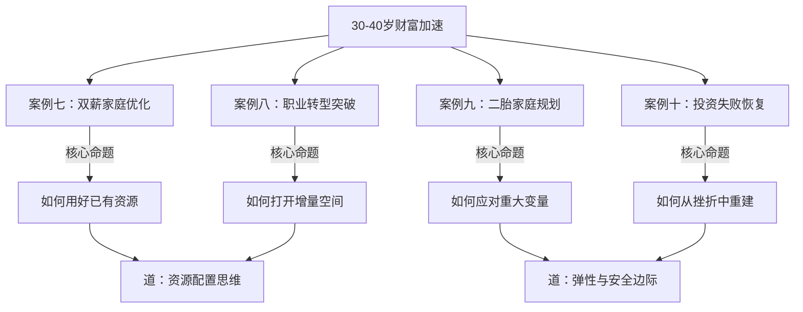
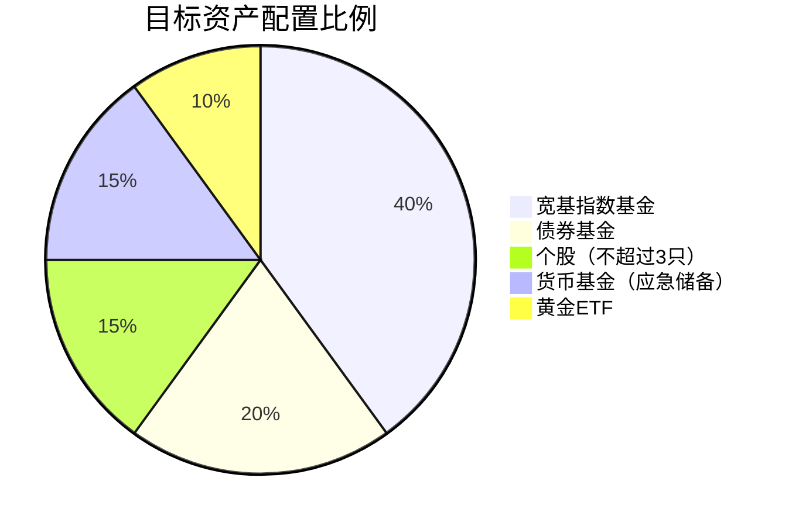
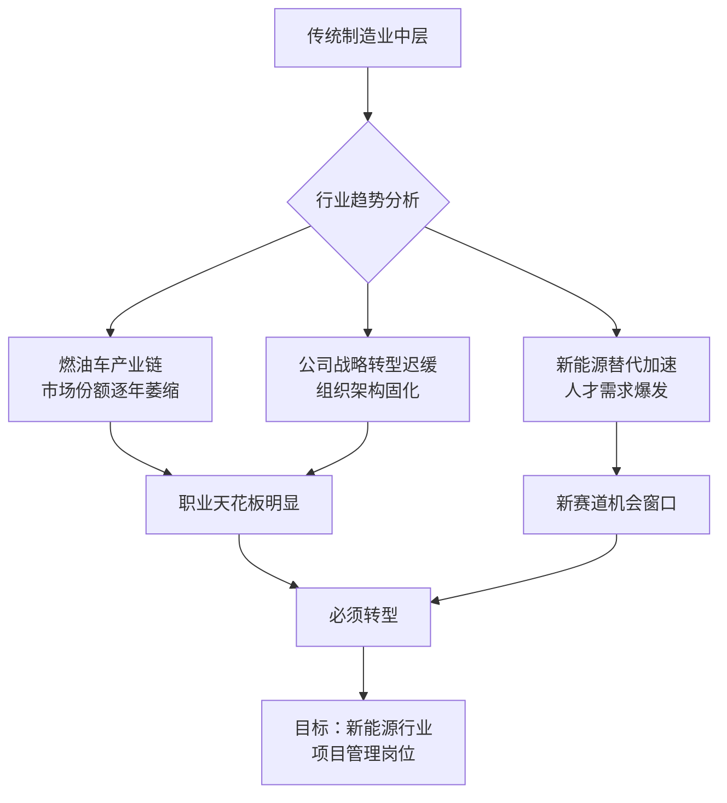
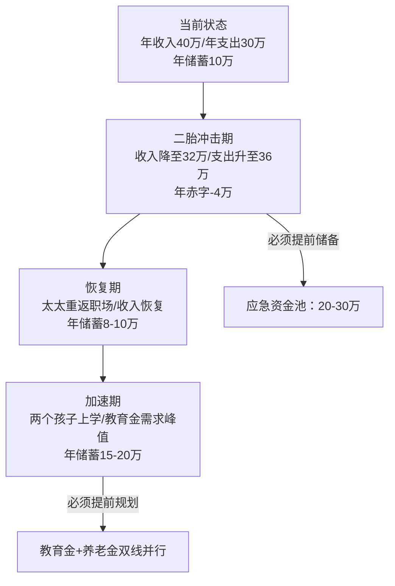
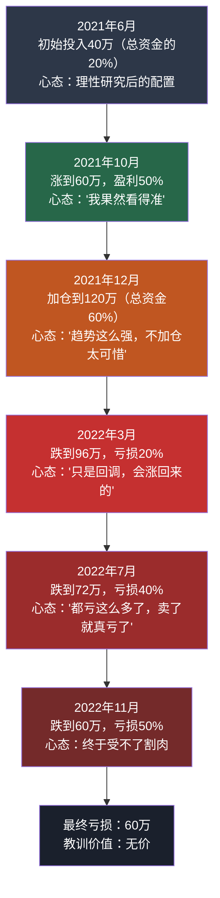

## 七、30-40岁财富加速的深度案例

> 本章通过四个典型案例，覆盖30-40岁阶段最常见的财富加速场景：**存量优化**、**增量突破**、**家庭结构变化应对**和**风险事件恢复**。每个案例从财务建模、决策逻辑、行为分析到可复用模板逐层展开，帮助读者建立自己的分析框架。

四个案例的核心逻辑关系如下：



---

### 案例七：双薪家庭的财务优化——存量资源的精细管理

#### 人物背景与初始状态

刘先生（32岁）和刘太太（30岁），结婚2年，暂无子女计划。两人均在一线城市工作，有自住房产一套。

| 维度 | 刘先生 | 刘太太 | 家庭合计 |
|------|--------|--------|----------|
| 职业 | 互联网产品经理 | 外企市场经理 | — |
| 年薪 | 25万 | 18万 | 43万 |
| 月到手 | ≈1.7万 | ≈1.3万 | ≈3.0万 |
| 公积金 | 3000元/月 | 2000元/月 | 5000元/月 |
| 职业稳定性 | 中（互联网波动） | 中高（外企相对稳） | 互补型 |
| 职业天花板 | 产品总监50-80万 | 市场总监40-60万 | — |

**资产负债全景**：

| 资产项目 | 金额（万元） | 负债项目 | 金额（万元） |
|----------|-------------|----------|-------------|
| 自住房产（市值） | 300 | 房贷余额 | 150 |
| 银行存款 | 15 | 信用卡应还 | 0.5 |
| 货币基金 | 5 | — | — |
| 股票/基金 | 15 | — | — |
| 公积金余额 | 8 | — | — |
| **资产合计** | **343** | **负债合计** | **150.5** |
| **净资产** | | | **192.5** |

**月度现金流拆解**：

```text
收入端：
  刘先生税后月薪        17,000
  刘太太税后月薪        13,000
  公积金（双边入账）     5,000   ← 很多人忽略这笔"隐形收入"
  ─────────────────────────
  月现金流合计           35,000

支出端：
  房贷月供               8,000
  伙食+日用              5,000
  交通+通讯              1,500
  社交+娱乐              2,000
  服饰+个护              1,500
  订阅服务（视频/健身等）   800
  保险费（月均摊）        1,200
  其他杂项               2,000
  ─────────────────────────
  月支出合计             22,000

月净现金流 = 35,000 - 22,000 = 13,000
年净储蓄 = 13,000 × 12 + 年终奖（约3万） ≈ 18.6万
```

#### 诊断：问题在哪里？

表面上看，年储蓄18.6万、储蓄率43%，已经不错。但深入分析会发现五个结构性问题：

**问题一：支出颗粒度粗糙**。2000元"其他杂项"和2000元"社交娱乐"没有细分，这两项加起来4.8万/年，是典型的"不知道钱花哪了"。

**问题二：投资配置严重失衡**。15万投资中80%是存款（实际收益约2%），20%是随机买入的基金，没有系统策略。实际年化收益约3%，跑不赢通胀。

**问题三：保险配置错位**。两人年缴保费1.44万，但保障内容以返还型为主，保额不足。真正的风险——重疾和意外——保障额度可能只有20-30万，远低于建议的年收入5-10倍。

**问题四：没有利用公积金**。每月5000元公积金入账，余额8万，除了抵扣房贷外没有充分利用。

**问题五：收入结构单一**。两人均为工资收入，没有任何被动收入来源，一旦失业现金流立即断裂。

#### 优化方案：四步走

##### 第一步：支出精细化管理（第1-2个月）

不是简单地"少花钱"，而是建立**支出分类-追踪-复盘**的闭环系统。

**具体操作**：
1. 使用记账App（推荐"随手记"或"Money Pro"），设置以下分类：
   - 固定支出：房贷、保险、物业、通讯
   - 生活必需：伙食、交通、日用品
   - 弹性消费：社交、娱乐、服饰、订阅
   - 自我投资：课程、书籍、考证
   - 其他：无法归类的临时支出
2. 连续记账3个月，生成支出报告
3. 找出"无感消费"——那些花了钱但对生活质量没有实质提升的项目

**预期效果**：

| 项目 | 优化前（月） | 优化后（月） | 月节省 | 年节省 |
|------|------------|------------|--------|--------|
| 订阅服务 | 800 | 300 | 500 | 6,000 |
| 社交娱乐 | 2,000 | 1,500 | 500 | 6,000 |
| 其他杂项 | 2,000 | 1,200 | 800 | 9,600 |
| 服饰个护 | 1,500 | 1,000 | 500 | 6,000 |
| **合计** | — | — | **2,300** | **27,600** |

> **注意**：伙食和交通不建议压缩，这是基础生活质量的底线。自我投资（课程、书籍）不仅不应压缩，还应适当增加——这是30-40岁阶段回报率最高的"投资"。

##### 第二步：保险配置重构（第2-3个月）

**原有配置问题诊断**：

| 险种 | 原有情况 | 问题 | 优化方案 |
|------|---------|------|---------|
| 重疾险 | 返还型，保额30万 | 保费贵、保额不足 | 换消费型，保额提到50万/人 |
| 定寿 | 无 | 家庭支柱无保障 | 加100万定寿/人（保至60岁） |
| 医疗险 | 无 | 大病自费风险高 | 加百万医疗险/人 |
| 意外险 | 保额10万 | 太低 | 提到100万/人 |

**优化后年保费预算**：

```text
重疾险（消费型）：刘先生 5000 + 刘太太 3500 = 8,500/年
定期寿险：       刘先生 1200 + 刘太太 600  = 1,800/年
百万医疗险：     刘先生 300 + 刘太太 250   = 550/年
意外险：         刘先生 300 + 刘太太 300   = 600/年
─────────────────────────────────────────
合计：11,450/年（月均954元）
```

对比原来的14,400/年，**年省2,950元，且总保额从约60万提升到约500万**。这就是"花更少的钱办更大的事"的典型案例。

##### 第三步：投资体系重建（第3-6个月）

原有投资的问题不是"收益低"，而是**没有体系**——没有资产配置策略，没有再平衡机制，没有风险控制规则。

**新的资产配置方案**（适用于年收入43万、风险承受能力中等的双薪家庭）：



**具体执行计划**：

| 资产类别 | 配比 | 月定投金额 | 推荐标的 | 预期年化 |
|----------|------|-----------|----------|---------|
| 宽基指数 | 40% | 5,200 | 沪深300ETF + 中证500ETF | 8-12% |
| 债券基金 | 20% | 2,600 | 纯债基金/二级债基 | 3-5% |
| 个股 | 15% | 1,950 | 深度研究后选择（不超过3只） | 不确定 |
| 货币基金 | 15% | 2,000（存量转入） | 余额宝/零钱通 | 2-3% |
| 黄金ETF | 10% | 1,300 | 黄金ETF联接 | 跟随金价 |

**定投纪律规则**：
1. **发工资日自动扣款**：设置基金定投在每月5号自动执行，避免"有钱不想投、想投没钱"的困境
2. **大跌加仓机制**：当沪深300单月跌幅超过5%时，从货币基金中额外投入一个月定投额
3. **半年再平衡**：每6个月检查一次各资产比例，偏离目标超过5个百分点时再平衡
4. **个股纪律**：单只个股亏损达到15%强制止损，盈利达到50%卖出一半锁定利润

**为什么选择这个配置而不是其他方案？**

30-40岁双薪无孩家庭的风险承受能力处于人生最高水平——两人收入互为安全垫，没有子女教育的刚性支出，距离退休还有25-30年。这意味着可以承受较高的短期波动以换取长期收益。但"高风险承受能力"不等于"应该去赌博"——所以个股比例控制在15%，且必须基于深度研究而非跟风。

##### 第四步：提前还贷的量化决策（第6个月）

很多家庭纠结"要不要提前还贷"。这个问题可以用一个简单的数学框架来回答：

**决策公式**：

```text
如果：预期投资年化收益率 > 房贷利率 × (1 - 你的边际税率)
那么：不提前还贷，资金用于投资
否则：提前还贷更划算
```

刘先生家庭的情况：
- 房贷利率：4.9%
- 预期投资年化：8%（基于上面的配置方案）
- 差额：3.1%

结论：**不提前还贷**。但这个结论有两个前提条件：

1. **投资纪律必须到位**。如果不提前还贷，但把钱花掉了而不是投资，那还不如还贷。必须确保这笔钱真的进入了投资账户。
2. **心理舒适度要纳入考量**。如果每月8000的房贷让你焦虑到失眠，那即使数学上不划算，适当还一部分降低月供也是合理的。财务优化的目标是"更好地生活"，不是"在Excel上最大化数字"。

**折中方案**：用公积金余额（8万）做一次性提前还款，降低月供约400元。公积金不能自由投资，用来还贷是最高效的用途。

#### 五年财务预测


| 年份 | 家庭年收入 | 年储蓄 | 投资资产 | 房产净值 | 总净资产 |
|------|-----------|--------|---------|---------|---------|
| 第0年 | 43万 | 18.6万 | 15万 | 150万 | 192万 |
| 第1年 | 46万 | 20万 | 40万 | 155万 | 215万 |
| 第2年 | 50万 | 22万 | 68万 | 160万 | 255万 |
| 第3年 | 53万 | 24万 | 100万 | 165万 | 295万 |
| 第4年 | 55万 | 25万 | 135万 | 170万 | 340万 |
| 第5年 | 58万 | 27万 | 175万 | 175万 | 400万 |

> **关键假设**：年收入增长5-8%，投资年化8%，房产年增值3%。如果投资收益更高或收入增长更快，第5年净资产可能突破450万。

#### 可复用模板：双薪家庭财务优化检查清单

```markdown
□ 第1个月：连续记账，建立支出分类
□ 第2个月：生成支出报告，识别无感消费
□ 第2个月：保险诊断——保额是否覆盖年收入5-10倍？
□ 第3个月：制定资产配置方案，开始定投
□ 第3个月：设置自动扣款，建立投资纪律
□ 第6个月：第一次投资再平衡
□ 第6个月：量化分析提前还贷的利弊
□ 每季度：家庭财务复盘会（夫妻共同参与）
□ 每年：保险检视、收入目标复盘、投资策略回顾
```

---

### 案例八：中年转型——从传统制造到新能源赛道

#### 人物背景与转型动因

赵先生，36岁，某传统制造企业（汽车零部件）中层管理者，管理15人团队，年薪20万。工作10年，从技术岗做到管理岗，但近3年薪资几乎原地踏步。

**转型的根本原因不是"钱少"，而是"看不到未来"**：



赵先生面临的核心矛盾是：**在原有赛道上，他的能力已经接近天花板；但在新赛道上，同样的能力可能值两倍的价格**。这就是"能力迁移"的价值——不是从零开始，而是把已有的能力放到一个更高的价值平台上。

#### 四阶段转型路径详解

##### 第一阶段：自我评估与方向锁定（第1-3个月）

这一步最容易被跳过，但恰恰是最重要的。很多人转型失败，不是因为能力不够，而是因为**方向选错了**。

**自我评估框架——四维诊断**：

| 维度 | 评估内容 | 赵先生的情况 | 权重 |
|------|---------|------------|------|
| 可迁移技能 | 哪些能力可以跨行业使用 | 项目管理、团队管理、供应链管理、质量控制 | 高 |
| 兴趣与热情 | 对新方向是否有持续的学习动力 | 对新能源行业关注3年，读过大量行业报告 | 高 |
| 资源网络 | 在目标行业是否有人脉基础 | 有2-3个前同事已转入新能源行业 | 中 |
| 风险承受力 | 转型失败的代价能否承受 | 有6个月应急金，配偶收入稳定 | 中 |

**方向锁定的三步法**：

1. **列出3-5个候选方向**：新能源车企、光伏企业、储能公司、风电企业、氢能初创
2. **做10场信息访谈**：通过LinkedIn、前同事、行业展会认识目标行业的人，了解真实的工作状态、薪资水平、发展前景
3. **用"交集法"决策**：选择"我的能力"+"行业需求"+"我的兴趣"三者交集最大的方向

赵先生最终选择了**新能源汽车零部件企业**——这是他原有行业经验（汽车零部件）和新方向（新能源）的最优交集。

##### 第二阶段：能力补齐与行业融入（第4-12个月）

转型不是"辞了职再找工作"，而是**在职期间完成所有准备工作，拿到offer后再跳**。这是30-40岁转型最重要的原则——因为你不是22岁的应届生，你有房贷、有家庭、有责任，你承受不起"空窗期"。

**赵先生的9个月能力补齐计划**：

| 月份 | 学习内容 | 投入时间 | 产出/验证 |
|------|---------|---------|----------|
| 4-5月 | 新能源行业知识体系（电池、电机、电控、BMS） | 每天1.5小时 | 读完10本专业书+3门在线课 |
| 5-6月 | PMP项目管理认证备考 | 每天2小时 | 通过PMP考试 |
| 6-8月 | 行业展会+论坛参与 | 每月1-2次 | 参加3场行业活动，交换名片50+张 |
| 7-9月 | 行业人脉深度经营 | 每周2-3次社交 | 建立20+有效行业联系 |
| 9-12月 | 求职准备+面试 | 每周投入 | 投递30+公司，面试10+场 |

**学习资源具体清单**：

```text
行业知识：
├── 书籍：《新能源汽车技术概论》《动力电池技术与应用》《汽车电子与控制》
├── 在线课：中国大学MOOC"新能源汽车技术"、Coursera"Electric Vehicles and Mobility"
├── 报告：中国汽车工业协会月度数据、GGII锂电行业报告
└── 公众号：电车汇、高工锂电、NE时代

证书：
├── PMP（项目管理专业人士认证）—— 中层管理岗的硬通货
├── 新能源汽车相关认证（如有）—— 加分项
└── 六西格玛绿带 —— 制造业背景的差异化优势

人脉建设：
├── LinkedIn主动连接目标公司员工
├── 行业展会（中国国际新能源汽车技术展、CIBF电池展）
├── 行业论坛（中国汽车论坛、新能源汽车产业发展论坛）
└── 前同事推荐（最高效的方式）
```

**人脉建设的具体方法**：不要一上来就问"你们公司招人吗"。正确的方式是：先提供价值（分享行业见解、帮忙对接资源），建立信任后再自然地聊到机会。赵先生的一个offer就来自他在展会上认识的一位供应链总监——两人聊了40分钟的行业趋势，对方主动问"你有没有考虑换到新能源来"。

##### 第三阶段：精准求职与谈判（第13-18个月）

**简历改造要点**：

传统制造业的简历语言和新能源行业不同。同一个项目经验，换一种表达方式，价值感知完全不同：

| 原始表述（制造业内行话） | 改造后（新能源行业语言） |
|------------------------|----------------------|
| 管理15人生产团队 | 领导15人跨职能团队，覆盖从研发到量产的全生命周期管理 |
| 降低废品率3% | 通过六西格玛方法论优化工艺流程，年度质量成本降低120万 |
| 完成新产品导入 | 主导3个新产品NPI项目，从APQP到SOP全流程交付，平均缩短上市周期2个月 |
| 协调供应商交期 | 管理20+供应商的供应链协同体系，交付准时率从85%提升至97% |

**面试中的关键策略**：

1. **不回避"行业经验不足"**：直接说"我在这个行业是新人，但我有10年的项目管理经验和快速学习能力，我过去9个月已经系统学习了新能源行业的知识体系"。坦诚比伪装更有说服力。
2. **展示行业洞察**：面试前研究目标公司的产品、技术路线、竞争对手，准备1-2个有深度的观点。赵先生在面试中分析了目标公司某款产品的供应链风险点，直接打动了面试官。
3. **薪资谈判的底线与空间**：

| 阶段 | 底线 | 目标 | 理想 |
|------|------|------|------|
| 初始offer | 22万 | 26万 | 30万 |
| 最终结果 | — | 28万 | — |

赵先生最终拿到了28万的offer——比原来涨了40%。他能拿到这个数字，PMP证书功不可没（新能源行业正处于快速扩张期，项目管理人才极度稀缺）。

##### 第四阶段：快速融入与价值证明（第19-36个月）

入职只是开始。前6个月的核心任务是**证明自己值得这份薪水**，具体策略：

1. **第一个月：少说多听**。了解公司文化、技术体系、团队关系，不急于改变什么。
2. **第二到三个月：找一个快速可见的成果**。赵先生接手了一个交付延迟的项目，用他的项目管理经验在一个月内把进度拉回正轨。这个成果让全公司都知道了"新来的那个人很靠谱"。
3. **第四到六个月：建立专业口碑**。主动输出行业方法论（如APQP流程优化建议），让同事和上级认识到你带来的不仅是"一个人"，而是"一整套方法论"。
4. **第七到十二个月：扩大影响力**。跨部门协作、参与公司级项目、带新人。

**两年后的结果**：赵先生晋升为项目管理部经理，管理25人团队，年薪涨到35万。更重要的是，他在新能源行业站稳了脚跟，职业前景从"天花板可见"变成了"空间广阔"。

#### 转型期间的财务安全网

转型不是赌博，必须有完整的财务安全网：

| 安全网层级 | 具体措施 | 赵先生的情况 |
|-----------|---------|------------|
| 应急储备金 | 6个月家庭支出（约15万） | ✓ 已有18万 |
| 配偶收入 | 配偶工作稳定，能覆盖基本生活 | ✓ 配偶年薪12万 |
| 社保不断缴 | 离职期间自行缴纳社保 | ✓ 计划已制定 |
| 投资策略不变 | 转型期间继续定投，不因焦虑而卖出 | ✓ 已设置自动定投 |
| 大额消费冻结 | 转型期间不做买房、换车等重大消费决策 | ✓ 已与配偶达成共识 |

#### 常见转型误区

| 误区 | 为什么是错的 | 正确做法 |
|------|------------|---------|
| "先辞职再准备" | 失去收入来源后焦虑会严重影响学习和面试质量 | 在职完成所有准备工作 |
| "完全从零开始" | 忽略了可迁移技能的巨大价值 | 找到新旧能力的交集 |
| "只看薪资涨幅" | 行业前景、成长空间、团队氛围同样重要 | 综合评估，至少面试3-5家 |
| "一个人闷头准备" | 缺乏行业信息和人脉支持 | 至少做10场信息访谈 |
| "急于证明自己" | 入职后用力过猛反而适得其反 | 前3个月以学习和观察为主 |

---

### 案例九：二胎家庭的财务规划——重大变量下的弹性设计

#### 人物背景与核心矛盾

陈先生（35岁）和陈太太（33岁），女儿3岁，计划1-2年内要二胎。这个家庭面临的核心矛盾是：**二胎带来的收入减少和支出增加会在短期内形成"财务剪刀差"**——收入往下走，支出往上走，中间的缺口需要提前填补。



#### 财务冲击的精确测算

**当前财务状况**：

```text
收入：
  陈先生年薪              25万
  陈太太年薪              15万
  ─────────────────────────
  合计                    40万

支出：
  房贷                    10万/年
  生活费（含女儿）        12万/年
  女儿教育（早教+兴趣班）   6万/年
  保险                    1.5万/年
  其他                    3万/年
  ─────────────────────────
  合计                    32.5万

年净储蓄 = 40 - 32.5 = 7.5万
```

**二胎后的财务冲击模型**：

| 冲击维度 | 具体项目 | 年增加/减少额 | 持续时间 |
|----------|---------|-------------|---------|
| **支出增加** | 奶粉+尿不湿+辅食 | +2.4万 | 3年 |
| | 保姆/托育费 | +3.6万 | 2年 |
| | 医疗+疫苗+体检 | +0.8万 | 持续 |
| | 婴儿用品（推车/床/衣服） | +1.5万（一次性） | 1年 |
| | 大宝教育不停 | 维持6万 | 持续 |
| **收入减少** | 陈太太产假期间收入下降 | -4万 | 6个月 |
| | 陈太太可能选择兼职/降薪 | -5万/年 | 2-3年 |
| **合计冲击** | | **首年约-14万** | — |

冲击后的现金流：

```text
收入减少后：25 + 10 = 35万（太太兼职）
支出增加后：32.5 + 8.3 = 40.8万
────────────────────────
年赤字 = 35 - 40.8 = -5.8万
```

这意味着**二胎后的前2年，家庭不仅没有储蓄，还需要动用储备金**。如果不提前准备，就会陷入财务焦虑。

#### 三阶段应对策略

##### 第一阶段：冲击前储备期（现在起1-2年）

**核心目标**：建立20-30万的"二胎专项基金"。

**资金来源拆解**：

| 来源 | 金额 | 说明 |
|------|------|------|
| 当前年储蓄 | 7.5万 × 2年 = 15万 | 自然积累 |
| 削减弹性支出 | 2万/年 × 2年 = 4万 | 减少外出旅游、高端消费 |
| 女儿教育优化 | 1万/年 × 2年 = 2万 | 早教转为亲子互动，质量不降成本降 |
| 双方年终奖 | 约4万 | 全额存入专项基金 |
| **合计** | **约25万** | — |

**这笔钱的存放方式**：

```text
25万分配：
├── 10万 → 银行大额存单（3个月期限，灵活性+收益性平衡）
├── 10万 → 货币基金（随时可取，应对突发支出）
└── 5万 → 短债基金（略高于货基收益，流动性好）
```

**绝对不能做的事**：把这笔钱投入股市或基金。这不是"投资的钱"，这是"保命的钱"，安全性和流动性是第一位的。

##### 第二阶段：冲击应对期（二胎出生后1-2年）

**核心目标**：在赤字期保持财务稳定，不动摇长期投资。

**关键决策点**：陈太太是否全职带娃？

| 方案 | 收入影响 | 支出影响 | 净效果 | 适合场景 |
|------|---------|---------|--------|---------|
| A：全职带娃2年 | -15万/年 | 省保姆费3.6万 | 净减少11.4万 | 家人可帮忙、重视亲自养育 |
| B：产后6个月恢复全职 | 仅产假期间-4万 | 需保姆3.6万 | 净减少7.6万 | 有可靠老人帮忙带娃 |
| C：转兼职/远程 | -5万/年 | 部分保姆费2万 | 净减少7万 | 公司支持灵活办公 |

**推荐方案B或C**，因为陈太太的职场连续性比省下的几万块钱更重要——30-33岁是女性职业发展的关键窗口期，中断2年后重返职场的难度和薪资损失远超眼前的节省。

**这个阶段的支出管控**：

1. **大宝教育降级不降质**：把年6万的早教+兴趣班改为3万（砍掉纯商业化早教，保留1-2个真正有发展价值的兴趣班，其余用亲子互动替代）
2. **婴儿用品"买精不买多"**：推车、安全座椅买好品牌的，衣服和玩具买二手的或亲友转赠的
3. **家庭保险检视**：二胎后家庭责任增加，两个大人的寿险保额需要提高

##### 第三阶段：恢复与加速期（二胎3岁以后）

**核心目标**：太太重返全职工作，开始双线积累——教育金和养老金。

**教育金规划**：

| 孩子 | 当前年龄 | 距大学 | 目标金额 | 月定投（年化8%） |
|------|---------|--------|---------|----------------|
| 大宝 | 3岁 | 15年 | 50万 | 1,500元/月 |
| 二宝 | 0岁 | 18年 | 50万 | 1,100元/月 |

**养老金规划**（假设60岁退休）：

| 项目 | 陈先生（35岁） | 陈太太（33岁） |
|------|--------------|--------------|
| 距退休 | 25年 | 27年 |
| 目标养老金 | 300万 | 200万 |
| 月定投（年化7%） | 3,500元/月 | 2,000元/月 |

**教育金+养老金月定投合计：8,100元/月**。这个数字看起来很大，但对应的是家庭年收入40万+的水平，占比约24%，在合理范围内。

#### 二胎家庭的常见财务陷阱

| 陷阱 | 具体表现 | 正确应对 |
|------|---------|---------|
| 过度补偿心理 | "亏欠了大宝"，给大宝疯狂报班 | 大宝最需要的是父母的陪伴，不是更多课程 |
| 忽视保险升级 | 家庭责任增加但保额没跟上 | 二胎后立即检视寿险和重疾险保额 |
| 教育军备竞赛 | "别人家孩子都在学，我家不能落后" | 按孩子兴趣和家庭预算理性选择，不跟风 |
| 太太职业牺牲 | 认为"反正有老公养"，放弃职业发展 | 太太的职场价值是家庭最重要的"保险"之一 |
| 没有应急储备 | 把所有钱都投入教育和生活 | 至少保留6个月支出的应急资金 |

---

### 案例十：投资失败的教训——从60万亏损中学到的风险管理课

#### 事件全景还原

吴先生，38岁，某互联网公司技术总监，年收入50万，有8年投资经验。在2021-2022年间，因重仓单一新能源股票亏损约60万，相当于他一年多的净收入。

这不是一个"运气不好"的故事，而是一个**行为金融学教科书级别的案例**——几乎每一个认知偏差都在其中起了作用。

**完整时间线与心理状态**：



#### 五个认知偏差的深度剖析

##### 偏差一：过度自信偏差（Overconfidence Bias）

**表现**：吴先生在第一笔投资盈利50%后，认为"自己看对了"，把成功归因于自己的分析能力，而非市场环境。

**真相**：2021年新能源板块整体涨幅超过60%，闭着眼睛买任何一只新能源股都能赚50%。吴先生的"精准判断"不过是站在了风口上——但他把"风的力量"当成了"自己的翅膀"。

**科学解释**：行为金融学研究表明，投资者在盈利后会显著高估自己的判断能力。这种"胜者效应"导致他们加大仓位、降低风控标准，为下一次亏损埋下伏笔。

**防错机制**：

```text
规则1：任何单笔投资盈利超过30%时，强制复盘——
       问自己："这笔收益中有多少是市场给的，多少是我自己的能力？"
规则2：盈利后加仓的金额不得超过原始投入的50%
规则3：任何时候单只股票仓位不得超过总资金的20%
```

##### 偏差二：锚定效应（Anchoring Effect）

**表现**：股价从150元跌到120元时，吴先生的心理"锚点"是150元的高点，认为120元是"便宜的"，所以继续持有。

**真相**：150元是泡沫顶点的价格，不是合理估值。用泡沫顶点作为"锚"来判断当前价格是否便宜，就像用房价最高点来判断现在是否该买房一样荒谬。

**防错机制**：

```text
规则：评估一只股票是否值得持有，不用"历史最高价"作为参考。
     使用的参考系是：
     1. 公司基本面（PE/PB/现金流折现）
     2. 行业平均估值水平
     3. 自己的买入成本（仅用于计算税务影响，不用于判断是否卖出）
```

##### 偏差三：损失厌恶与处置效应（Loss Aversion & Disposition Effect）

**表现**：股价跌到80元（亏损30%）时，吴先生的想法是"卖了就真的亏了，不卖还有机会回本"。

**真相**：这是行为金融学中最经典的认知偏差。研究表明，投资者对亏损的痛苦感受是同等金额盈利快感的2-2.5倍。这导致人们倾向于"割掉盈利的股票（锁定快乐）、持有亏损的股票（逃避痛苦）"——与正确做法完全相反。

**核心认知重建**：

```text
关键思维转换：
× "卖了就真的亏了"     →  ✓ "不卖已经在亏了，卖了只是确认亏损"
× "等回本再卖"         →  ✓ "这只股票未来走势与我的买入价无关"
× "亏损是暂时的"       →  ✓ "除非有明确的基本面改善证据，否则止损"
```

**止损规则的数学论证**：

| 亏损幅度 | 需要涨多少才能回本 |
|----------|-----------------|
| 10% | 11.1% |
| 20% | 25% |
| 30% | 42.9% |
| 50% | 100% |
| 70% | 233% |

看到这张表就明白了——**越晚止损，回本的难度呈指数级增长**。在亏损30%时止损，用剩下的70%资金去找一个涨43%的机会，远比等一只跌了50%的股票翻倍要现实得多。

##### 偏差四：沉没成本谬误（Sunk Cost Fallacy）

**表现**：吴先生在加仓时的想法是"我已经投了40万，如果不加仓，之前的分析和投入就白费了"。

**真相**：已经投入的钱是"沉没成本"，无论你接下来怎么做，这笔钱都不会回来。决策应该基于"从现在开始，哪种选择的预期收益更高"，而不是"我已经投入了多少"。

**防错机制**：

```text
每次加仓前的强制自问：
"如果我现在空仓，我会不会以当前价格买入这只股票？"
如果答案是"不会"，那就不要加仓。
```

##### 偏差五：确认偏差（Confirmation Bias）

**表现**：持有期间，吴先生只关注看多新能源的新闻和分析，自动过滤或贬低看空的信息。

**真相**：人类天生倾向于寻找支持自己已有观点的信息，忽略相反的证据。在投资中，这意味着你越持有某只股票，就越容易被"利好消息"包围——不是因为利好消息真的多了，而是因为你的眼睛自动过滤了利空。

**防错机制**：

```text
规则：持有一只股票期间，每个月必须花1小时专门阅读看空该股票的分析。
     如果发现任何一个看空论点你无法有效反驳，减仓25%。
```

#### 从亏损到重建：吴先生的恢复路径

**第一步：心理恢复（第1-2个月）**

亏损60万的心理冲击不亚于一次小型失业。吴先生经历了典型的五个阶段：否认（"市场会回来的"）→ 愤怒（"都是政策的错"）→ 讨价还价（"再等等看"）→ 沮丧（"我太蠢了"）→ 接受（"这是我的教训"）。

**关键行动**：
1. 暂停所有投资操作至少1个月，让情绪平复
2. 不要试图"把亏损赚回来"——这是最容易导致二次亏损的心态
3. 与配偶坦诚沟通，获得情感支持（隐瞒亏损会导致更大的心理压力）

**第二步：体系重建（第3-6个月）**

吴先生没有选择"再也不碰股票"，而是建立了一套完整的投资规则体系：

**新的投资规则手册**：

```markdown
## 仓位管理规则
1. 任何单只股票/基金的仓位不超过总资金的20%
2. 同一行业的总仓位不超过30%
3. 任何时候现金/货基比例不低于10%

## 买入规则
1. 必须完成研究报告后才能买入（不允许跟风买入）
2. 买入前必须回答：这家公司的核心竞争力是什么？3年后会更强还是更弱？
3. 分批建仓：首次买入不超过计划仓位的30%

## 卖出规则
1. 个股亏损达到15%强制止损，无例外
2. 个股盈利达到50%卖出一半，锁定利润
3. 基本面恶化（管理层变动、行业政策转向）立即清仓

## 情绪管理规则
1. 单日亏损超过5万时，不进行任何操作
2. 市场暴跌时（跌幅>3%），先关闭交易软件24小时
3. 每季度做一次投资复盘，记录当时的情绪和决策
```

**第三步：新配置执行（第7个月起）**

| 资产类别 | 配比 | 金额 | 策略 |
|----------|------|------|------|
| 宽基指数基金 | 40% | 48万 | 每月定投4万 |
| 债券基金 | 25% | 30万 | 一次性买入 |
| 个股（不超过3只） | 15% | 18万 | 深度研究后分批建仓 |
| 货币基金/现金 | 15% | 18万 | 应急储备+大跌加仓弹药 |
| 黄金ETF | 5% | 6万 | 对冲通胀和尾部风险 |

**两年后的结果**：新配置的年化收益约12%（主要受益于指数基金和债券基金的贡献），虽然没能"赚回"60万，但投资体系的重建让吴先生在后续的市场波动中始终保持理性——这才是比任何单笔收益都更有价值的收获。

#### 投资失败的自我诊断清单

如果你发现自己正在做以下任何一件事，请立即停下来审视：

```text
□ 单只股票/基金的仓位超过总资金的30%
□ 加仓的理由是"已经亏了这么多了"
□ 每天花超过30分钟看自己持仓股票的涨跌
□ 开始在社交媒体上搜索"XX股票还能涨吗"
□ 已经一个月没有看过相反观点的分析
□ 有"这次不一样"的想法
□ 在用"借来的钱"投资（包括信用卡套现、融资融券）
□ 投资决策是在情绪激动时做出的
```

---

### 四个案例的交叉分析

#### 不同人生阶段的财富加速核心策略对比

| 维度 | 案例七（存量优化） | 案例八（增量突破） | 案例九（变量应对） | 案例十（风险恢复） |
|------|------------------|------------------|------------------|------------------|
| 核心挑战 | 已有资源没用好 | 收入遇到天花板 | 重大生活变化 | 投资遭受重大损失 |
| 核心策略 | 精细化管理 | 能力迁移+行业切换 | 提前储备+弹性设计 | 认知重建+体系化 |
| 时间维度 | 1-5年渐进优化 | 1-3年全力冲刺 | 2-5年分阶段推进 | 6-12个月恢复 |
| 风险等级 | 低 | 中 | 中 | 高（已实现） |
| 关键成功因素 | 纪律和坚持 | 信息收集和人脉 | 提前规划和执行力 | 认知升级和情绪管理 |
| 最大陷阱 | "差不多就行"的心态 | "先辞职再准备" | "到时候再说" | "把亏损赚回来" |

#### 30-40岁财富加速的通用原则

从这四个案例中，我们可以提炼出适用于所有30-40岁人群的财富加速原则：

**原则一：先防守再进攻**。案例七的保险优化、案例九的应急储备、案例十的仓位管理——防守永远是第一位的。没有防守的进攻就是赌博。

**原则二：投资自己是最高回报的投资**。案例八中赵先生花9个月学习新行业知识，换来的是年薪从20万到35万的跨越——年化回报率超过300%，远超任何金融投资。

**原则三：提前规划降低冲击**。案例九的核心教训是"二胎不难，难的是没有提前准备"。所有可预见的重大变化（生育、换房、职业转换），都应该提前12-24个月开始财务准备。

**原则四：建立规则而非依赖直觉**。案例十的惨痛教训证明，在投资领域，直觉是最大的敌人。只有写下来的、可执行的规则，才能在情绪高涨时保护你。

**原则五：定期复盘，持续迭代**。四个案例的主人公都在某个时间节点做了关键的复盘和调整。没有一成不变的最优策略，只有不断适应变化的迭代过程。

> **本章核心信息**：30-40岁的财富加速不是靠某一个"神操作"，而是靠**正确的方向**+**持续的执行**+**不断的学习**。把本章四个案例当作镜子，找到最接近你当前处境的案例，从它的经验中汲取教训，从它的失误中避免重蹈覆辙。
