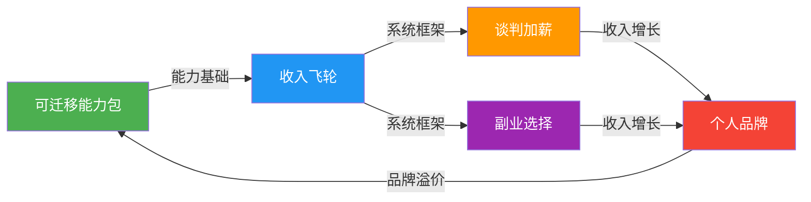
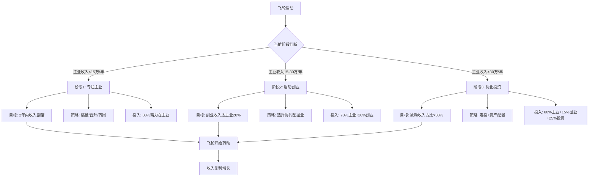
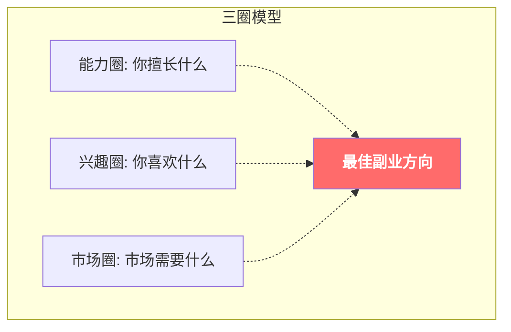
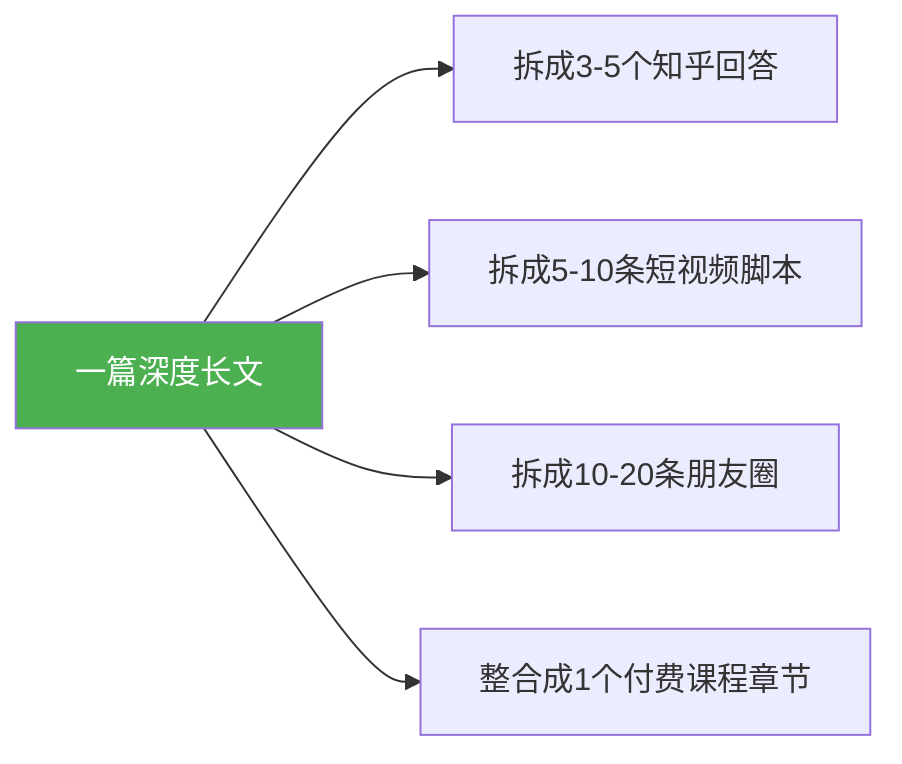
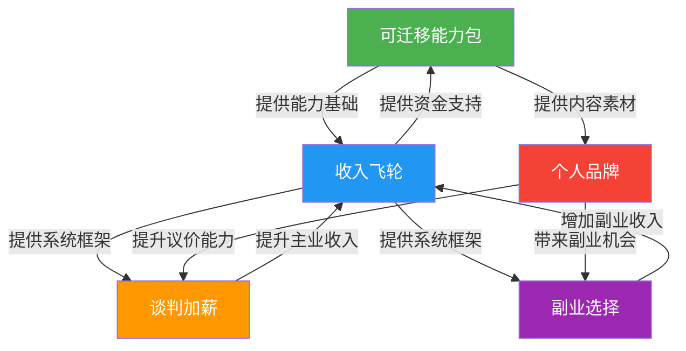

## 一、收入加速的五个核心技巧

30-40岁是职业生涯的"黄金加速期"。经过前十年的积累，你已经具备了一定的专业基础和行业认知，但距离真正的"收入跃迁"还有距离。本节介绍五个经过验证的核心技巧，帮助你在这十年里实现收入的非线性增长。

**为什么这十年如此关键？**

从人力资本理论来看，30-40岁是一个人"人力资本投资回报率"最高的阶段。你在20多年积累的知识、技能和人脉，在这个阶段开始产生复利效应。但如果策略不当，这十年也可能成为"高不成低不就"的尴尬期——职位上不去、收入涨不动、副业没精力。

五个技巧的关系如下：



---

### 技巧1：打造"可迁移能力包"

#### 什么是可迁移能力包？

可迁移能力包（Portable Skill Portfolio）是指一组不依赖于特定公司、行业或岗位，能在任何环境下创造价值的能力组合。它的核心价值在于：**无论外部环境如何变化——公司裁员、行业衰退、技术颠覆——你都能快速找到新的价值创造点。**

哈佛商学院教授克莱顿·克里斯坦森在《你要如何衡量你的人生》中指出：真正有竞争力的不是你当前的职位，而是你随身携带的能力。30-40岁最大的职业风险不是失业，而是"能力僵化"——你的技能只适用于当前岗位，离开这个环境就失去价值。

#### 能力包的三层架构

**第一层：核心硬技能（生存层）**

这是你的立身之本，必须做到行业前20%。

| 能力类别 | 具体技能 | 达标标准 | 提升路径 |
|---------|---------|---------|---------|
| 专业硬技能 | 编程/设计/财务/法律等 | 能独立交付高质量项目 | 考取行业顶级认证、参与开源项目 |
| 项目管理 | 进度/风险/资源管理 | 能管理10人以上团队、百万级预算 | PMP认证、实战项目复盘 |
| 数据分析 | Excel高级/SQL/Python | 能用数据驱动决策，而非凭感觉 | Kaggle实战、业务指标体系建设 |

**第二层：软技能（加速层）**

这些能力决定了你能走多远。

- **公开演讲**：不是"能说"，而是"能影响决策"。具体包括：结构化表达（金字塔原理）、故事化演讲（SCQA框架）、即兴发言（PREP法则：Point-Reason-Example-Point）。训练方法：加入Toastmasters演讲俱乐部，每周至少一次正式演讲练习。
- **商业写作**：不是"文笔好"，而是"能用文字推动业务"。包括：商业提案、项目报告、邮件沟通、公众号文章。核心原则：结论先行、数据支撑、行动导向。
- **跨部门协作**：30岁以后，你的价值越来越多地体现在"推动事情落地"而非"自己把事情做完"。关键能力：理解他人诉求、找到共同利益、管理冲突。

**第三层：战略能力（跃迁层）**

这些能力决定了你的收入上限。

- **商业判断力**：能识别"什么是好机会"。培养方法：每周精读一份行业研报、每月分析一个商业案例、每年复盘自己的决策。
- **资源整合能力**：能把不同的人、资金、信息组合起来创造价值。这不是"认识很多人"，而是"能让对的人在对的时间一起做对的事"。
- **逆境决策力**：在信息不完整、时间紧迫、压力巨大的情况下做出合理判断。这是高管和普通员工最核心的区别。

#### 实操：个人能力审计表

每年至少做一次能力审计。以下是具体操作方法：

```text
能力审计模板
━━━━━━━━━━━━━━━━━━━━━━━━━━━━━━
姓名：______  日期：______

1. 核心硬技能自评（1-10分）
   - 专业深度：___  （能否解决行业内复杂问题？）
   - 专业广度：___  （能否跨领域迁移？）
   - 工具熟练度：___ （效率是否在团队前列？）

2. 软技能自评（1-10分）
   - 表达能力：___  （能否30秒说清一个复杂问题？）
   - 写作能力：___  （能否写出让人愿意读完的邮件/报告？）
   - 影响力：___    （能否推动非下属的人配合你？）

3. 战略能力自评（1-10分）
   - 行业洞察：___  （能否预判行业趋势？）
   - 商业敏感：___  （能否识别商业机会？）
   - 资源网络：___  （需要资源时能找到人？）

4. 差距分析
   - 最大短板：___  （投入最多精力补齐）
   - 最大优势：___  （继续强化到极致）
   - 年度目标：___  （具体、可衡量）

5. 投资计划
   - 课程/认证：___ （预算：年收入5-10%）
   - 实战项目：___  （至少1个跨部门项目）
   - 导师/圈子：___  （至少1位行业导师）
━━━━━━━━━━━━━━━━━━━━━━━━━━━━━━
```

**投资回报参考**：根据LinkedIn 2024年职场调研，持续投资自身能力的人，在30-40岁期间的收入增速比不投资的人平均高出47%。建议每年拿出收入的5-10%用于能力提升，包括课程（30%）、书籍（10%）、行业会议（20%）、导师指导（30%）、工具订阅（10%）。

---

### 技巧2：建立"收入飞轮"

#### 飞轮的本质

"飞轮效应"（Flywheel Effect）源自吉姆·柯林斯《从优秀到卓越》。收入飞轮是指多个收入来源相互促进、形成正向循环的系统。它不是简单的"多打几份工"，而是让每个收入来源都能增强其他来源。

**关键区别**：

| 类型 | 多份工（并联模式） | 收入飞轮（循环模式） |
|------|------------------|------------------|
| 关系 | 各收入来源独立 | 各收入来源相互促进 |
| 精力 | 线性消耗（越做越累） | 复利增长（越做越轻松） |
| 天花板 | 受限于个人时间 | 受限于系统效率 |
| 风险 | 任一断掉独立影响 | 系统性缓冲 |
| 典型例子 | 白天上班+晚上送外卖 | 主业积累客户→副业服务客户→投资扩大规模 |

#### 三环飞轮架构

**第一环：主业稳定（占收入60-70%）**

主业是飞轮的动力源。30-40岁，主业的核心目标不是"保住工作"，而是"提升不可替代性"。

具体策略：
- **争取股权激励**：在互联网/科技行业，期权和RSU可能占总收入的30-50%。主动了解公司的股权激励政策，在绩效评估时明确提出诉求。
- **成为"关键人物"**：主动承担核心项目、解决遗留难题、建立跨部门影响力。让公司觉得"离不开你"。
- **建立行业声誉**：参加行业会议发言、在专业社区输出内容。当猎头主动找你时，你的议价能力会大幅提升。

**第二环：副业启动（占收入10-20%）**

副业的选择和运营是飞轮能否转动的关键。详见技巧4"副业选择的三圈模型"。

核心原则：
- 与主业协同：用主业积累的能力和资源做副业，而不是从零开始
- 从最小可行产品（MVP）开始：不要一开始就投入大量资金和时间
- 设定止损线：如果6个月没有正反馈，及时调整方向

**第三环：投资增长（占收入10-20%）**

投资是飞轮的"放大器"。不是让你成为投资专家，而是让你的钱为你工作。

具体策略：
- **定投为王**：每月固定金额买入宽基指数基金（如沪深300、中证500），不择时、不择股
- **长期持有**：至少持有5年以上，让复利发挥作用
- **学习基本分析**：理解市盈率（PE）、市净率（PB）、股息率等核心指标的含义

#### 飞轮启动的实操路径



**飞轮检查清单**（每季度审视一次）：

- [ ] 主业收入是否稳定增长？（年增速>15%为健康）
- [ ] 副业是否与主业形成协同？（是否在用主业积累的能力和资源）
- [ ] 投资是否在持续执行定投计划？（是否因市场波动中断）
- [ ] 三个收入来源是否在相互促进？（副业是否增强了主业能力？投资收益是否增加了副业本金？）
- [ ] 整体收入增速是否超过通胀+生活成本增速？

---

### 技巧3：谈判加薪的"三步法"

#### 为什么30-40岁必须学会谈判？

根据智联招聘2024年薪酬报告，**主动谈判加薪的员工，平均薪资比不谈判的同岗位员工高出23%**。30-40岁，你已经不是"新人"，谈判加薪不再是"讨要"，而是"价值交换"。

很多人不谈判的原因是：
1. **恐惧心理**：怕被拒绝、怕破坏关系、怕被认为"贪婪"
2. **不知道怎么谈**：不知道该说什么、该要多少
3. **信息不对称**：不知道自己值多少钱

以下三步法解决了这三个问题。

#### 第一步：建立价值档案

价值档案是你的"谈判弹药库"。它不是简单的工作总结，而是用数据证明你的价值。

**价值档案模板**：

```text
价值档案
━━━━━━━━━━━━━━━━━━━━━━━━━━━━━━
过去12个月的核心贡献：

1. 项目贡献（量化）
   - 项目名称：___
   - 你的角色：___
   - 量化成果：
     * 为公司节省了 ___万元成本
     * 为公司创造了 ___万元收入
     * 提升了 ___%的效率
     * 影响了 ___个客户/用户

2. 超出职责的贡献
   - 主动承担了___（不属于你岗位职责的工作）
   - 帮助团队解决了___（关键问题）
   - 培养了___名新人

3. 市场薪资数据
   - 同行业同岗位薪资范围：___-___万/年
   - 你的当前薪资：___万/年
   - 你期望的薪资：___万/年
   - 数据来源：猎聘/Boss直聘/猎头/同行交流

4. 竞争性筹码
   - 是否有其他offer：是/否
   - 猎头联系频率：___次/月
   - 行业人才供需：供不应求/基本平衡/供过于求
━━━━━━━━━━━━━━━━━━━━━━━━━━━━━━
```

**收集数据的方法**：
- 日常记录：每周花10分钟记录本周的核心贡献，不要等到年底才回忆
- 量化思维：把"做了很多事"转化为"节省了X万成本"或"提升了Y%效率"
- 市场调研：通过猎头、招聘网站、同行交流了解市场薪资水平

#### 第二步：选择正确的时机

时机选择直接影响谈判成功率。

| 时机 | 成功率 | 原因 | 注意事项 |
|------|-------|------|---------|
| 刚完成重大项目 | 85% | 价值刚被证明 | 趁热打铁，不要拖太久 |
| 年度绩效评估前后 | 70% | 公司预算周期 | 提前1-2个月沟通，不要等到评估当天 |
| 公司业绩好 | 75% | 有预算空间 | 关注公司财报和业务数据 |
| 获得外部offer | 60% | 有谈判筹码 | 慎用，可能破坏信任关系 |
| 公司裁员期间 | 15% | 预算收紧 | 除非你是不可替代的核心人员 |
| 刚入职不久 | 20% | 还没证明价值 | 至少工作满1年再谈 |

**最佳策略**：在平时就持续让领导看到你的价值，而不是等到谈判时才展示。每周的工作汇报、每月的成果总结，都是在为未来的谈判积累筹码。

#### 第三步：使用"锚定+让步"策略

这是经过行为经济学验证的谈判框架。

**谈判话术模板**：

```text
开场（表达感恩+提出诉求）：
"感谢公司这两年给我提供的成长机会。在过去一年里，我完成了[核心贡献1]和[核心贡献2]，
为团队带来了[量化成果]。基于我的贡献和市场薪资水平，我希望能将年薪调整到[目标金额]。"

锚定（提出高于预期的要求）：
"根据我了解的市场数据，同行业同岗位的薪资范围在[区间]，
我认为[锚定金额，比预期高20-30%]是比较合理的。"

让步（达成真实目标）：
"当然，我也理解公司的预算安排。如果一次性调整有困难，
我们可以讨论分阶段调整，或者在其他方面做一些补充，
比如[股权/培训预算/弹性工作/额外假期]。"

收尾（达成共识）：
"您觉得这个方案怎么样？我们能不能找到一个双方都满意的方案？"
```

**关键原则**：
- 锚定效应：先提出高于预期的要求，让最终结果更接近你的真实目标
- 给对方台阶：表达理解公司的难处，让对方有让步的空间
- 备选方案：如果薪资无法调整，谈判其他福利（股权、假期、培训预算、弹性工作等）
- 保持关系：谈判是价值交换，不是对抗。无论结果如何，保持专业和尊重

#### 加薪谈判的常见错误

| 错误 | 为什么是错的 | 正确做法 |
|------|------------|---------|
| 用"我需要钱"作为理由 | 你的需求不是公司的责任 | 用"我的价值"作为理由 |
| 和同事比较薪资 | 引发内部矛盾 | 用市场数据作为参考 |
| 威胁离职 | 破坏信任关系 | 用外部offer作为隐性筹码 |
| 在公开场合提 | 让领导难堪 | 私下一对一沟通 |
| 一次谈不成就放弃 | 放弃了后续机会 | 询问"需要我做到什么才能涨薪" |
| 只关注基本工资 | 忽略了其他有价值的福利 | 综合谈判（基本工资+奖金+股权+福利） |

---

### 技巧4：副业选择的"三圈模型"

#### 三圈模型的原理

三圈模型源自日本"ikigai"（生き甲斐）理念，被斯坦福设计学院广泛应用于职业规划。核心思想是：最佳副业方向位于三个圈的交集处。



**三个圈的具体评估方法**：

**能力圈评估**（回答以下问题）：
- 你做什么事情比80%的人做得好？
- 你的同事/朋友经常来找你帮忙做什么？
- 你有哪些被市场验证过的技能？（有人愿意为此付费）
- 你的核心竞争力是什么？

**兴趣圈评估**（回答以下问题）：
- 你在空闲时间主动做什么？
- 你看什么类型的内容最投入？
- 你愿意免费做什么？
- 什么事情让你进入"心流"状态？

**市场圈评估**（回答以下问题）：
- 什么人在为什么问题付费？
- 你的技能能解决什么痛点？
- 这个市场的规模有多大？
- 竞争格局如何？

#### 副业选择的决策矩阵

| 副业类型 | 启动成本 | 时间投入 | 天花板 | 与主业协同 | 适合人群 |
|---------|---------|---------|--------|-----------|---------|
| 技能咨询 | 低（0-5千） | 中（每周5-10h） | 中高 | 高 | 有专业技能的人 |
| 知识付费 | 低（0-1万） | 高（前期密集） | 高 | 高 | 有教学能力的人 |
| 技术外包 | 低（0-2千） | 中（项目制） | 中 | 高 | 技术岗位的人 |
| 自媒体 | 低（0-5千） | 高（持续输出） | 高 | 中 | 有表达欲的人 |
| 电商/代购 | 中（1-5万） | 高（运营密集） | 中 | 低 | 有供应链资源的人 |
| 房产投资 | 高（首付） | 低（管理少量） | 高 | 低 | 有资金积累的人 |
| 入股小生意 | 中高（5-20万） | 低（定期关注） | 中 | 看项目 | 有商业判断力的人 |

#### 副业启动的最小可行路径（MVP）

不要一开始就投入大量资金和时间。用最小成本验证可行性：

**第1周：市场验证**
- 在朋友圈/社群发布"我能提供XX服务，有人需要吗？"
- 在闲鱼/淘宝上架你的服务
- 目标：至少3个人表示感兴趣

**第2-4周：最小产品**
- 用最少的时间完成第一个"产品"（一篇付费文章、一次咨询、一个小项目）
- 目标：至少1个人愿意付费

**第2-3个月：迭代优化**
- 根据反馈优化产品
- 建立标准化流程
- 目标：月收入达到主业收入的5%

**第4-6个月：规模化**
- 如果验证成功，加大投入
- 如果验证失败，及时止损
- 目标：月收入达到主业收入的10-20%

#### 副业的三大红线

**红线1：不要做纯体力型副业**

送外卖、开滴滴、兼职服务员等纯体力型副业，天花板极低。你的时间单价无法提升，而且会消耗你提升核心能力的精力。

**例外情况**：如果你处于经济极度困难期（负债、失业），纯体力型副业是"生存手段"，不是长期策略。先活下去，再谈发展。

**红线2：不要做需要大量前期投入的副业**

开实体店、囤货、加盟等需要大量前期资金的副业，风险极高。30-40岁，你的试错成本比20多岁时高得多（有房贷、有家庭），不要把积蓄押在高风险项目上。

**红线3：不要做与主业完全冲突的副业**

如果你的副业需要占用大量工作时间，或者与主业存在利益冲突，最终可能两头都做不好。选择与主业协同的副业，让两边的能力和资源相互促进。

---

### 技巧5：打造个人品牌的"内容矩阵"

#### 为什么30-40岁必须建立个人品牌？

个人品牌不是"网红"或"出名"。它的本质是：**让对的人在对的时间找到你**。

具体价值：
1. **职业安全网**：当公司裁员时，有个人品牌的人更容易找到新机会
2. **议价能力**：当猎头主动找你时，你的谈判地位完全不同
3. **商业机会**：咨询、培训、合作等机会会主动找上门
4. **知识复利**：你输出的内容会持续为你带来价值，即使你在睡觉

LinkedIn 2024年数据显示：拥有活跃个人品牌的职场人，获得面试机会的概率比没有品牌的人高出3.2倍，薪资谈判时平均高出15-20%。

#### 内容矩阵的三层架构

**第一层：文字平台（深度内容）**

| 平台 | 内容类型 | 发布频率 | 核心指标 |
|------|---------|---------|---------|
| 微信公众号 | 深度分析、行业洞察 | 每周1-2篇 | 阅读量、转发率 |
| 知乎 | 专业问答、长文 | 每周2-3个回答 | 赞同数、收藏数 |
| 头条号 | 行业资讯、经验分享 | 每天1篇 | 推荐量、阅读量 |
| 简书/掘金 | 技术文章、项目复盘 | 每周1篇 | 收藏数、评论数 |

**第二层：视频平台（传播内容）**

| 平台 | 内容类型 | 发布频率 | 核心指标 |
|------|---------|---------|---------|
| B站 | 教程、解读、Vlog | 每周1-2条 | 播放量、完播率 |
| 抖音 | 知识点短视频 | 每天1条 | 播放量、关注转化率 |
| 视频号 | 行业观点、生活分享 | 每周3-5条 | 转发率、点赞率 |

**第三层：社交平台（日常曝光）**

| 平台 | 内容类型 | 发布频率 | 核心指标 |
|------|---------|---------|---------|
| 朋友圈 | 日常分享、行业动态 | 每天1-2条 | 点赞、私信咨询 |
| LinkedIn | 英文内容、国际视野 | 每周2-3条 | 连接请求数 |
| Twitter/X | 热点评论、技术讨论 | 每天1-2条 | 转发、关注数 |

#### 内容生产的实操框架

**选题公式**：

```text
好选题 = 你的专业 × 读者痛点 × 热点时机

示例：
- 专业（数据分析）× 痛点（不会用Excel）× 时机（年终总结季）
  → 《年终总结不会做？用这5个Excel技巧让你的报告脱颖而出》
- 专业（产品经理）× 痛点（面试焦虑）× 时机（金三银四）
  → 《产品经理面试的10个高频问题和满分回答》
```

**写作流程**：

1. **选题**（10分钟）：确定主题、目标读者、核心价值
2. **大纲**（15分钟）：列出3-5个核心观点，每个观点2-3个论据
3. **初稿**（60分钟）：不要追求完美，先把内容写出来
4. **优化**（30分钟）：调整结构、补充案例、优化标题
5. **发布**（10分钟）：选择平台、设置标签、定时发布

**内容复用策略**：一次创作，多次使用。



#### 个人品牌的核心原则

**原则1：持续输出 > 完美主义**

很多人因为追求完美而迟迟不开始。记住：先完成，再完美。一篇80分的文章持续发布，比一篇100分的文章永远不发布，价值大得多。

**原则2：专注 > 广泛**

不要什么都写。选择1-2个核心领域，持续深耕。当别人想到"数据分析"就想到你时，你的品牌就建立了。

**原则3：真实 > 包装**

不要伪装成"专家"。分享你的真实经验、踩过的坑、学到的教训。真实的内容比包装的内容更有说服力。

**原则4：互动 > 单向输出**

回复评论、参与讨论、帮助他人。个人品牌不是"自说自话"，而是"建立连接"。

#### 常见误区

| 误区 | 为什么是错的 | 正确做法 |
|------|------------|---------|
| "我没时间" | 每天30分钟就够了 | 利用碎片时间：通勤时构思、午休时写作 |
| "我不够专业" | 你不需要比所有人强 | 比你的目标读者强就够了 |
| "写了没人看" | 前100篇都是积累 | 关注内容质量，不关注数据 |
| "怕被人嘲笑" | 真正的专家不会嘲笑新手 | 把批评当作免费的反馈 |
| "要做就要做最好" | 完美主义是行动的敌人 | 先发出去，再迭代优化 |

---

### 五个技巧的协同关系

五个技巧不是独立的，而是相互支撑的系统：



**启动顺序建议**：

1. **先建立可迁移能力包**：没有能力，其他技巧都是空中楼阁
2. **再搭建收入飞轮**：用系统思维规划收入结构
3. **同步进行谈判加薪**：提升主业收入是飞轮的动力源
4. **适时启动副业**：当主业稳定后，用协同型副业扩展收入
5. **持续打造个人品牌**：让能力被看见，让机会主动找你

**30-40岁收入加速路线图**：

| 年龄 | 核心任务 | 收入目标 | 关键动作 |
|------|---------|---------|---------|
| 30-32 | 能力包搭建+主业深耕 | 年收入增长30-50% | 跳槽/晋升、考取认证、建立专业口碑 |
| 33-35 | 飞轮启动+副业试水 | 主业稳定、副业收入占比10% | 选择协同型副业、启动定投计划 |
| 36-38 | 飞轮转动+品牌建设 | 被动收入占比15% | 持续内容输出、扩大行业影响力 |
| 39-40 | 飞轮加速+资源整合 | 被动收入占比20%+ | 整合资源、考虑创业或合伙 |

---

### 本节自检清单

完成以下自检，评估你在收入加速方面的准备程度：

- [ ] 我完成了个人能力审计，知道自己最大的短板是什么
- [ ] 我有明确的收入结构规划（主业/副业/投资的比例）
- [ ] 我知道自己的市场价值，有谈判加薪的筹码
- [ ] 我已经验证过至少一个副业方向的可行性
- [ ] 我有持续输出内容的习惯（至少每月2篇）
- [ ] 我每年投入收入的5-10%用于能力提升
- [ ] 我有至少1位行业导师或同行交流圈
