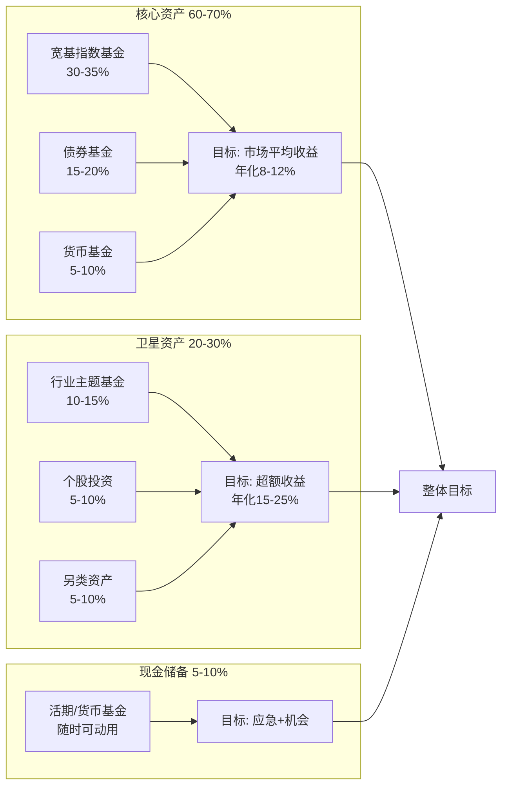
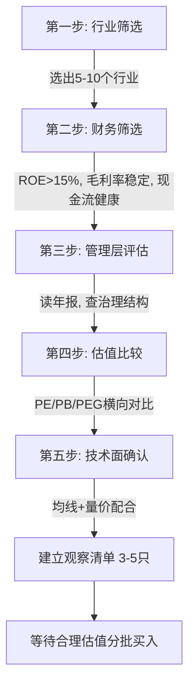
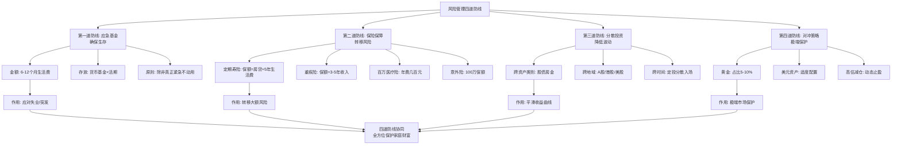

## 二、投资实战的五个核心技巧

上一节我们讨论了收入加速的五个技巧——那是"开源"。本节转向"投资"，解决的是另一个关键问题：**已经赚到的钱，如何让它持续增值？** 对于30-40岁的人群来说，收入已经进入稳定增长期，但投资经验可能才刚起步。这个阶段犯的最大错误不是"投得少"，而是"投得错"。

本节介绍五个实战技巧，从最易上手的定投策略，到需要专业判断的个股筛选和房产投资，最后落脚在风险管理——因为投资的前提是"活着"。

### 技巧6：定投的"微笑曲线"策略

#### 为什么定投最适合30-40岁

定投（定期定额投资）之所以被称为"懒人投资法"，不是因为它简单到不需要思考，而是因为它利用了一个数学优势：**在波动市场中，固定金额买入意味着价格低时买得多、价格高时买得少，自动拉低平均成本。** 这个现象在定投收益曲线上呈现出"微笑"形状——先跌后涨时，最终收益率高于同期一次性投入。

对于30-40岁的人群，定投有三个天然适配的理由：

1. **收入稳定**：每月有固定工资流入，天然适合"工资日扣款"模式
2. **时间充裕**：距离退休还有20-30年，足够穿越多个市场周期
3. **精力有限**：工作和家庭占据大量时间，无法盯盘操作

#### 定投的数学原理：为什么"微笑曲线"有效

假设每月定投1000元，基金净值经历如下变化：

| 月份 | 基金净值 | 投入金额 | 买入份额 | 累计份额 | 累计投入 | 市值 |
|------|----------|----------|----------|----------|----------|------|
| 第1月 | 1.00 | 1000 | 1000 | 1000 | 1000 | 1000 |
| 第2月 | 0.80 | 1000 | 1250 | 2250 | 2000 | 1800 |
| 第3月 | 0.60 | 1000 | 1667 | 3917 | 3000 | 2350 |
| 第4月 | 0.80 | 1000 | 1250 | 5167 | 4000 | 4134 |
| 第5月 | 1.00 | 1000 | 1000 | 6167 | 5000 | 6167 |

当净值回到1.00时（即"回到原点"），一次性投入的收益率是0%，但定投的收益率是**23.3%**（6167÷5000-1）。这就是微笑曲线的威力：市场下跌时积累的便宜份额，在反弹时被放大为超额收益。

#### 基础定投：适合新手的入门方案

**操作步骤：**

1. **选择平台**：支付宝、天天基金、蛋卷基金、各券商APP均可，选择费率最低的（申购费通常打1折，即0.15%）
2. **选择标的**：首选宽基指数基金（后面详述）
3. **设定金额**：月收入的15-30%，确保不影响日常生活
4. **设定日期**：选择工资到账后第2-3天自动扣款，避免"月底没钱"的问题
5. **坚持执行**：至少坚持一个完整市场周期（通常3-5年），期间不中断

**适合新手的定投标的推荐：**

| 标的 | 代码示例 | 跟踪指数 | 特点 | 适合人群 |
|------|----------|----------|------|----------|
| 沪深300ETF联接 | 110020 | 沪深300 | 大盘蓝筹，波动较小 | 保守型新手 |
| 中证500ETF联接 | 162711 | 中证500 | 中盘成长，弹性较大 | 稳健型投资者 |
| 创业板ETF联接 | 159915 | 创业板指 | 科技成长，波动最大 | 能承受高波动的投资者 |
| MSCI中国A50联接 | 013091 | MSCI A50 | 外资视角的核心资产 | 追求国际化的投资者 |

#### 进阶定投：估值驱动的智慧定投

基础定投是"傻瓜式"的每月固定金额，进阶定投则根据市场估值动态调整投入金额。核心逻辑是：**便宜时多买，贵时少买。**

**具体操作方法：**

以沪深300指数的市盈率（PE）百分位为锚：

| 市场状态 | PE百分位 | 定投倍数 | 每月投入（基准2000元） |
|----------|----------|----------|----------------------|
| 极度低估 | 0-20% | 2倍 | 4000元 |
| 较低估值 | 20-40% | 1.5倍 | 3000元 |
| 正常估值 | 40-60% | 1倍 | 2000元 |
| 较高估值 | 60-80% | 0.5倍 | 1000元 |
| 极度高估 | 80-100% | 0倍（暂停定投，开始分批止盈） | 0元 |

**如何查询PE百分位：**
- 韭圈儿（leeks.info）：免费，覆盖主流指数
- 且慢App的"温度计"功能：直观显示市场冷热
- 中证指数官网（csindex.com.cn）：权威数据来源

**真实案例：** 以2018-2023年的沪深300定投为例。2018年底市场极度低估（PE百分位约10%），此时加倍投入，到2021年初市场高估时（PE百分位约85%）开始减仓，期间定投年化收益率约15-18%，远高于同期盲目定投的8-10%。

#### 定投的三个致命误区

**误区1：定投就是"闭眼投"，不需要卖出**

很多人只学了"买入"的一半，忽略了"卖出"的另一半。定投的完整策略是"低估买入，高估卖出"。当市场进入高估区域，应当分批止盈——不是一次性全部卖出，而是分3-6次逐步卖出，避免错过后续上涨。

**误区2：下跌时恐慌停止定投**

这恰恰是最应该加投的时刻。微笑曲线的利润来源就是在低位积累份额。如果你在2018年底或2022年底停止定投，就错过了最低成本的买入机会。心理上难以接受"越跌越买"，但这正是定投反人性却有效的地方。

**误区3：选择主动管理基金做定投**

主动基金的管理费通常1.5%/年，而指数基金仅0.15-0.5%/年。长期来看，扣除费用后约80%的主动基金跑不赢指数。定投的核心优势是低成本积累份额，用高费率基金做定投，相当于自废武功。

### 技巧7：资产配置的"核心+卫星"法

#### 为什么资产配置比选股更重要

诺贝尔经济学奖得主哈里·马科维茨的研究表明：**投资组合90%以上的收益波动来自资产配置，而非个股选择或择时。** 换句话说，你把钱分配在股票、债券、现金的比例，比你买哪只股票重要得多。

Brinson等人1986年在《Financial Analysts Journal》发表的经典研究，分析了91只大型养老金10年的表现，结论是：资产配置解释了投资组合收益差异的93.6%。这个数字后来被多次修正（有学者认为实际影响是40-60%），但核心结论不变：**资产配置是投资中最重要的决策。**

#### 核心+卫星的架构逻辑

核心+卫星配置法将投资组合分为两部分：



**核心资产（60-70%）：** 这部分钱追求"稳稳的幸福"，目标是获得市场平均收益。选择低费率的宽基指数基金和债券基金，不做过多操作，长期持有。

**卫星资产（20-30%）：** 这部分钱追求超额收益，可以适度激进。选择你看好的行业主题基金或个股，但要控制在总资产的30%以内——即使卫星资产全部亏损，也不会影响你的整体财务安全。

**现金储备（5-10%）：** 始终保持一部分高流动性资产，用于应对突发需求和捕捉极端低估时的买入机会。

#### 不同资产规模的具体配置方案

**资产10-50万（积累期）：**

| 资产类别 | 配置比例 | 具体标的 | 年化目标 |
|----------|----------|----------|----------|
| 沪深300指数基金 | 30% | 场外联接基金 | 8-10% |
| 中证500指数基金 | 15% | 场外联接基金 | 10-12% |
| 债券基金 | 20% | 纯债基金/二级债基 | 4-6% |
| 行业主题基金 | 15% | 消费、医药、科技轮动 | 12-20% |
| 货币基金 | 10% | 余额宝等 | 2-3% |
| 其他（黄金ETF等） | 5% | 黄金ETF（518880） | 对冲功能 |
| 现金 | 5% | 银行活期 | 流动性 |

**资产50-200万（加速期）：**

| 资产类别 | 配置比例 | 具体标的 | 年化目标 |
|----------|----------|----------|----------|
| 宽基指数基金 | 35% | 沪深300+中证500+A50 | 8-12% |
| 优质个股 | 15% | 自选股（五维筛选法） | 15-25% |
| 债券基金 | 15% | 纯债+可转债 | 4-8% |
| 行业主题基金 | 10% | 看好行业的ETF | 12-20% |
| REITs | 5% | 公募REITs | 5-8% |
| 黄金 | 5% | 黄金ETF | 对冲功能 |
| QDII基金 | 5% | 纳斯达克100/标普500 | 全球分散 |
| 货币基金 | 5% | 高流动性产品 | 2-3% |
| 现金 | 5% | 银行活期 | 流动性 |

#### 再平衡：让配置"活"起来

配置不是"设完就忘"，需要定期再平衡。再平衡的本质是"卖高买低"——当某类资产涨幅过大导致比例偏离目标时，卖出一部分买入比例偏低的资产。

**再平衡规则：**

1. **定期再平衡**：每半年检查一次资产比例（建议6月底和12月底）
2. **阈值再平衡**：当任何一类资产偏离目标比例超过5个百分点时触发
3. **事件再平衡**：重大市场事件（如大跌超过20%）时检查并调整

**再平衡的实操示例：**

假设你的目标配置是股票60%、债券30%、现金10%，总资产100万。半年后股市大涨，股票涨到80万，债券涨到33万，现金10万，总资产123万。此时股票占比65%，偏离目标5个百分点，触发再平衡：

- 目标：股票73.8万（60%）、债券36.9万（30%）、现金12.3万（10%）
- 操作：卖出6.2万股票，买入3.9万债券，保留2.3万现金

**再平衡的成本考量：** 频繁再平衡会产生交易费用（基金申购赎回费通常0.5-1.5%），因此不要过于频繁。半年一次或阈值5%是经过验证的平衡点。

### 技巧8：个股投资的"五维筛选法"

#### 为什么要在30-40岁开始学选股

在资产配置做好"核心"部分之后，如果你对投资有兴趣且愿意投入时间学习，可以用5-10%的资金尝试个股投资。30-40岁开始学习选股的优势在于：

- 有一定资金积累，能承受试错成本
- 有行业工作经验，对某些行业有直觉判断
- 有足够的时间跨度来验证投资逻辑

但请牢记：**个股投资是锦上添花，不是雪中送炭。** 在做好指数基金配置之前，不要碰个股。

#### 维度一：行业前景（权重20%）

**判断框架：**

选择行业就像选择赛道，赛道决定了你跑步的难度。

| 判断维度 | 具体指标 | 好行业的标准 | 差行业的信号 |
|----------|----------|-------------|-------------|
| 生命周期 | 行业渗透率 | 渗透率<30%，处于成长早期 | 渗透率>70%，接近天花板 |
| 市场空间 | 行业规模及增速 | 年增速>15%，空间千亿以上 | 增速<5%，市场萎缩 |
| 竞争格局 | CR5集中度 | CR5>50%，格局清晰 | CR5<20%，混战阶段 |
| 政策环境 | 产业政策方向 | 政策鼓励，有补贴扶持 | 政策收紧，监管加强 |
| 技术壁垒 | 技术迭代速度 | 有护城河，技术壁垒高 | 技术同质化，易被替代 |

**当前值得关注的行业方向（仅供参考，非投资建议）：**
- 新能源产业链（光伏、储能、电动车）：渗透率仍在快速提升
- 半导体/芯片：国产替代逻辑长期存在
- 创新药/医疗器械：老龄化+消费升级驱动
- AI及数字化：新一轮技术革命的核心

**警惕的行业陷阱：**
- "赛道论"不等于"闭眼买"——再好的行业也有垃圾公司
- 热门行业往往估值偏高，需要等待合理价格
- 政策驱动的行业（如补贴退坡的新能源）需关注政策变化

#### 维度二：公司质地（权重30%）

公司质地是五个维度中权重最高的，因为好公司可以在好行业中脱颖而出，而烂公司在再好的赛道里也会掉队。

**核心财务指标详解：**

**1. ROE（净资产收益率）—— 最重要的单一指标**

ROE衡量的是股东每投入1块钱，公司能赚多少钱。巴菲特曾说："如果只能用一个指标选股，我选ROE。"

- **优秀标准**：连续5年ROE>15%，最好>20%
- **及格标准**：连续5年ROE>10%
- **警惕信号**：ROE突然大幅提升（可能是加了高杠杆）

ROE的杜邦分解可以帮你理解高ROE的来源：

```text
ROE = 净利润率 × 资产周转率 × 权益乘数
    = (净利润/营收) × (营收/总资产) × (总资产/股东权益)
```

- **高利润率驱动**（如茅台、腾讯）：最好的模式，说明有定价权
- **高周转驱动**（如沃尔玛、海底捞）：靠效率取胜，需要持续管理
- **高杠杆驱动**（如房地产、银行）：风险最大，利率变化时很脆弱

**2. 毛利率 —— 竞争力的晴雨表**

毛利率 =（营收-营业成本）/营收，反映的是产品/服务的定价权。

- 毛利率>50%：通常意味着强品牌或强技术壁垒（如白酒、软件）
- 毛利率30-50%：行业中有一定竞争优势
- 毛利率<20%：通常是同质化竞争激烈的行业（如零售、制造）

**关注趋势比绝对值更重要：** 毛利率逐年下降，说明竞争加剧或成本上升，即使绝对值仍高，也需警惕。

**3. 自由现金流 —— 利润的"含金量"**

自由现金流 = 经营活动现金流 - 资本支出。这是公司真正"赚到手"的钱，比净利润更难造假。

- **优秀标准**：自由现金流持续为正，且与净利润的比值>80%
- **警惕信号**：净利润很高但自由现金流为负——可能有大量应收账款或需要持续重资本投入

**4. 资产负债率 —— 杠杆的度**

- 资产负债率<50%：财务稳健
- 资产负债率50-70%：正常水平（因行业而异）
- 资产负债率>70%：高杠杆，需关注现金流能否覆盖债务

**注意：** 不同行业的合理负债率差异很大。银行、地产负债率80%以上是常态，但科技公司60%就偏高了。要和同行业对比，而非跨行业比较。

#### 维度三：管理层（权重20%）

好公司需要好管理。30-40岁的投资者通常有了一定的社会经验和判断力，这在评估管理层时是优势。

**评估管理层的四个角度：**

1. **行业经验**：管理层是否在行业深耕多年？空降的"明星CEO"在不熟悉的行业往往水土不服
2. **治理结构**：是否有独立董事？大股东是否一股独大？关联交易是否频繁？
3. **激励机制**：管理层是否持有公司股份？股权激励方案是否与长期业绩挂钩？
4. **言行一致性**：过去的承诺是否兑现？年报中的战略规划是否落地？

**快速判断方法：**
- 读公司近3年的年报"致股东的信"，看管理层的语言风格是否务实
- 搜索管理层的公开访谈，看他们对行业趋势的判断是否准确
- 查看公司上市以来的融资和分红记录——频繁融资却不分红的公司要警惕

#### 维度四：估值水平（权重20%）

好公司也需要好价格。再好的股票，买贵了也是亏钱。

**三种常用估值方法：**

**1. 市盈率（PE）—— 最直观的估值指标**

PE = 股价 / 每股收益，含义是"按当前盈利，多少年回本"。

| PE水平 | 含义 | 适用场景 |
|--------|------|----------|
| <10倍 | 低估或业绩衰退 | 需确认是否"价值陷阱" |
| 10-20倍 | 合理区间 | 大多数成熟公司的正常估值 |
| 20-30倍 | 偏高但可接受 | 适用于高成长公司 |
| >30倍 | 高估 | 除非有极强增长预期，否则回避 |

**注意：** PE不适用于亏损公司和周期性行业底部（此时PE可能极高甚至为负）。

**2. 市净率（PB）—— 适用于重资产行业**

PB = 股价 / 每股净资产，适合银行、地产、钢铁等重资产行业。

- PB<1：股价低于净资产，可能被低估（但也可能是基本面恶化）
- PB 1-2：正常区间
- PB>3：需有强成长性支撑

**3. PEG —— 成长股的估值利器**

PEG = PE / 未来3年的预期利润增速。彼得·林奇认为PEG<1的股票值得买入。

- PEG<0.8：明显低估
- PEG 0.8-1.2：合理
- PEG>1.5：偏贵

**PEG的关键问题**在于"未来3年的预期利润增速"——这是主观判断。建议参考券商研报的一致预期，但打个7折作为安全边际。

#### 维度五：技术面（权重10%）

技术面在五维筛选法中权重最低，但并非无用。它的价值在于**确认买入时机**和**设置止损位**，而非预测涨跌。

**三个实用的技术面信号：**

1. **均线系统**：股价站上20日均线且20日均线向上，说明短期趋势良好
2. **成交量**：放量突破关键阻力位是积极信号；缩量回调是健康的调整
3. **MACD金叉**：短期趋势转多的确认信号（但滞后性强，仅作辅助参考）

**技术面的正确用法：** 先用前四个维度选出好公司、好价格，再用技术面确认买入时机。绝不能反过来——先看技术面选股，再找基本面理由。

#### 五维筛选的完整工作流



**实操建议：** 不要试图找到"完美"的股票。五维筛选的目的是排除明显不合格的标的，将候选范围从几千只缩小到3-5只，然后持续跟踪，等待合理价格买入。

### 技巧9：房产投资的"租售比"判断法

#### 30-40岁的房产投资逻辑

对于很多30-40岁的人来说，房产可能已经是最大的资产。这个阶段面临的选择是：是否要再投资一套房产？房产投资的核心逻辑是：**现金流回报（租金）+ 资本增值（房价涨跌）。** 在当前"房住不炒"的政策基调下，现金流回报变得更加重要。

#### 租售比：房产投资的"PE"

租售比是房产投资中最核心的指标，相当于股票的市盈率。

**计算公式：**

```text
年租售比 = 年租金收入 / 房屋总价 × 100%
月租售比 = 月租金 / 房屋总价 × 1000（‰）
```

**国际通用标准：**

| 年租售比 | 投资价值 | 含义 | 中国现状 |
|----------|----------|------|----------|
| >5% | 高投资价值 | 20年以内可通过租金回本 | 极少见，通常在三四线城市 |
| 3-5% | 中等投资价值 | 20-33年回本 | 部分二线城市可达 |
| 1.5-3% | 投资价值低 | 33-67年回本 | 一线城市普遍水平 |
| <1.5% | 无投资价值 | 需要靠房价上涨才能获利 | 北京、上海核心区常见 |

**真实案例对比：**

| 城市/区域 | 房价（万） | 月租金（元） | 年租售比 | 判断 |
|-----------|-----------|-------------|----------|------|
| 三线城市市中心 | 80 | 3500 | 5.25% | 有投资价值 |
| 二线城市近郊 | 150 | 4000 | 3.2% | 中等 |
| 一线城市外环 | 400 | 6000 | 1.8% | 投资价值低 |
| 一线城市核心区 | 800 | 10000 | 1.5% | 不适合纯投资 |

#### 租售比之外的四个关键因素

租售比是基础筛选指标，但房产投资远不止这一个维度。

**1. 持有成本计算**

买房后并不只是"坐等收租"，还有持续的持有成本：

| 费用项目 | 年费用估算（以200万房产为例） | 占房价比 |
|----------|-------------------------------|----------|
| 贷款利息（如有） | 约4-6万/年（利率4%，贷款140万） | 2-3% |
| 物业费 | 约0.3-0.6万/年 | 0.15-0.3% |
| 维修基金/装修折旧 | 约0.5万/年 | 0.25% |
| 房产税（未来可能） | 约0.5-1.2万/年（假设0.5-1%） | 0.5-1% |
| 空置期损失 | 约0.5-1万/年（假设1-2个月空置） | 0.25-0.5% |
| **合计持有成本** | **约6-9万/年** | **3-4.5%** |

如果年租售比低于持有成本率，那么房产投资实际上是**现金流为负**的——你需要不断贴钱进去。

**2. 杠杆的双刃剑效应**

房产投资最大的特点是杠杆——首付30%就能撬动100%的资产。这意味着：

- 房价涨10%，你的本金收益是33%（杠杆放大）
- 房价跌10%，你的本金亏损也是33%（杠杆同样放大下跌）
- 利率上升时，月供增加侵蚀租金收益

**杠杆收益计算示例：**

假设购买一套200万的房产，首付60万，贷款140万，年利率4%，30年期：

- 月供约6,684元
- 年月供支出：80,208元
- 年租金收入：72,000元（月租6000元）
- 年现金流：72,000 - 80,208 = **-8,208元**

即使租售比看起来尚可（3.6%），加上贷款利息后现金流是负的。这意味着你需要每月额外补贴约700元，且完全依赖房价上涨来获利。

**3. 地段的"三圈理论"**

地段决定房产的保值增值能力，核心看三个圈：

- **交通圈**：距离地铁站/公交枢纽1公里以内，交通便利性直接决定租金和升值空间
- **生活圈**：周边3公里内有商超、医院、公园，生活便利度影响居住体验
- **教育圈**：是否对口优质学校，学区溢价在部分城市仍非常显著

**4. 流动性风险**

房产是流动性最差的主流资产之一。股票可以随时卖出，房产可能需要3-6个月甚至更久才能变现。在急需资金时，房产可能需要大幅折价才能快速出手。

#### 房产投资的决策清单

在决定是否投资一套房产前，逐项检查：

- [ ] 年租售比是否>3%（否则靠租金回本遥遥无期）
- [ ] 加上贷款利息和持有成本后，现金流是否为正
- [ ] 该区域过去5年的房价走势如何（是否稳定增长）
- [ ] 该区域的人口是流入还是流出（人口流出的区域房价难涨）
- [ ] 该区域的产业是否多元（单一产业城市风险大）
- [ ] 是否有足够的流动性储备（买房后不至于"all in"）
- [ ] 如果房价5年不涨，你是否仍能接受

**最后一个检查项是最关键的：** 如果你无法接受房价5年不涨的最坏情况，说明这笔投资超出了你的风险承受能力。

### 技巧10：风险管理的"四道防线"

#### 为什么风险管理排在最后但最重要

投资领域有句老话："牛市赚钱，熊市赚钱，只有猪被宰了。" 意思是：不懂风险管理的人，最终会被市场消灭。30-40岁正是家庭责任最重的阶段——上有老下有小，还有房贷车贷。一次重大风险事件（重疾、失业、意外）就可能让你多年积累化为乌有。

风险管理不是投资的"附加项"，而是投资的"前提条件"。

#### 四道防线的整体架构



#### 第一道防线：应急基金——生存的底线

应急基金是所有投资的前提。没有应急基金就去投资，等于在悬崖边跳舞。

**应急基金的三个要素：**

**1. 金额计算**

不是简单地说"存3-6个月生活费"，而是精确计算：

```text
月固定支出 = 房贷/房租 + 车贷 + 保险费 + 水电气物业
          + 伙食费 + 交通费 + 子女教育费 + 赡养费

应急基金 = 月固定支出 × 6（单收入家庭）
         = 月固定支出 × 4（双收入家庭）
```

**示例：** 一个三口之家，月固定支出8000元，单收入家庭应急基金 = 8000 × 6 = 48,000元；双收入家庭应急基金 = 8000 × 4 = 32,000元。建议再上浮20%作为缓冲，即单收入存6万，双收入存4万。

**2. 存放方式**

应急基金的核心要求是**绝对安全+随时可取**，收益率是次要的。

| 存放方式 | 年化收益 | 取出时间 | 安全性 | 推荐比例 |
|----------|----------|----------|--------|----------|
| 银行活期 | 0.2% | 即时 | 极高 | 30%（满足即时需求） |
| 货币基金 | 1.5-2% | T+0（限额1万） | 极高 | 50%（主力存放） |
| 短期理财 | 2-3% | T+1或定期 | 高 | 20%（稍长期限） |

**3. 纪律：什么时候可以动用**

只有以下情况可以动用应急基金：
- 失业（收入中断）
- 重大疾病或意外（医疗急需）
- 家庭重大变故（如自然灾害损失）

**绝对不能动用的情况：** 看到好股票想抄底、朋友推荐的"稳赚"投资、想买个包/手机奖励自己。

#### 第二道防线：保险保障——用小钱转移大风险

保险的本质是"用确定的小额支出（保费），转移不确定的大额风险（疾病/意外/身故）"。

**30-40岁必备的四大保险：**

**1. 定期寿险——保护家人**

定期寿险的含义：在保障期限内如果身故，保险公司赔付保额。

| 参数 | 建议值 | 说明 |
|------|--------|------|
| 保额 | 房贷余额 + 年支出×5 | 确保家人能还清房贷且维持5年生活 |
| 保障期 | 至60岁或65岁 | 覆盖家庭责任最重的时期 |
| 缴费期 | 20年或30年 | 拉长缴费期降低每年保费 |
| 年保费 | 约1000-3000元 | 30岁男性100万保额约1500元/年 |

**为什么是定期寿险而不是终身寿险：** 终身寿险贵3-5倍，且兼具"储蓄"功能导致保额不足。30-40岁应以保障为主，投资功能交给投资工具，不要混在一起。

**2. 重疾险——收入补偿**

重疾险不是用来支付医疗费的（那是医疗险的工作），而是在确诊重大疾病后一次性给付，用于弥补治疗期间的收入损失和康复费用。

| 参数 | 建议值 | 说明 |
|------|--------|------|
| 保额 | 年收入×3-5 | 弥补3-5年的收入损失 |
| 保障期 | 至70岁 | 覆盖工作年限 |
| 保障病种 | 28种高发重疾 | 不必追求"保100种"的噱头 |
| 年保费 | 约3000-8000元 | 30岁男性50万保额约5000元/年 |

**重疾险的常见误区：**
- 追求"多次赔付"：首次赔付的保额充足更重要
- 返还型重疾险：看似"不花钱"，实际保费贵50-100%
- 给孩子买重疾却不给大人买：大人才是家庭经济支柱，优先保障大人

**3. 百万医疗险——兜底大额医疗费**

百万医疗险覆盖住院医疗费用，保额通常100-600万，年保费仅200-800元（30岁左右），是性价比最高的保险产品。

**关键要点：**
- 注意是否保证续保（优选20年保证续保的产品）
- 注意免赔额（通常1万元，即1万以下自费，1万以上报销）
- 注意是否覆盖外购药（很多靶向药不在医院内购买）

**4. 意外险——最便宜的杠杆**

意外险保障意外身故和意外伤残，100万保额年保费仅100-300元。

**注意：** 意外险只保"意外"（外来的、突发的、非本意的、非疾病的），猝死在很多意外险中是不赔的（因为属于疾病）。选购时注意是否包含"猝死保障"。

**保险配置的优先级和预算分配：**

| 优先级 | 险种 | 年保费预算 | 保障功能 |
|--------|------|-----------|----------|
| 1（最优先） | 百万医疗险 | 200-800元 | 覆盖大额医疗费 |
| 2 | 意外险 | 100-300元 | 意外身故/伤残保障 |
| 3 | 定期寿险 | 1000-3000元 | 身故后保护家人 |
| 4 | 重疾险 | 3000-8000元 | 重疾后收入补偿 |
| **合计** | | **4300-12100元** | **约占年收入3-8%** |

**总保费控制在年收入的5-10%以内。** 超过10%说明保费支出过高，可能影响生活质量或投资积累。

#### 第三道防线：分散投资——不把鸡蛋放一个篮子

分散投资是最古老的风险管理原则，但很多人只是嘴上说说，并没有真正做到。

**分散投资的三个维度：**

**1. 跨资产类别分散**

不同资产类别的相关性不同——股票跌的时候债券可能涨，房产跌的时候黄金可能涨。持有多种资产可以平滑组合波动。

| 资产类别 | 与A股的相关性 | 在组合中的作用 |
|----------|--------------|---------------|
| A股 | 1.0 | 核心收益来源 |
| 债券 | -0.2~0.2 | 降低波动，稳定收益 |
| 黄金 | -0.1~0.3 | 通胀对冲，极端保护 |
| 美股（QDII） | 0.3~0.5 | 全球分散，科技成长 |
| REITs | 0.2~0.4 | 房地产敞口，稳定分红 |

**2. 跨地域分散**

只投资A股意味着把所有赌注押在一个市场。适度配置港股（通过港股通）和美股（通过QDII基金）可以降低单一市场风险。

**推荐的全球配置工具：**
- 港股通ETF（513550）：跟踪恒生指数
- 纳斯达克100 ETF（513100）：跟踪纳斯达克100
- 标普500 ETF（513500）：跟踪标普500
- 全球债券基金：投资全球债券市场

**3. 跨时间分散**

这就是定投的核心价值——不要一次性把所有钱投入市场，而是分批进入，降低"买在最高点"的风险。

#### 第四道防线：对冲策略——极端情况的保险

对冲策略是在前三道防线都建立之后的"终极保护"。核心思路是：持有一些与主流资产走势相反的资产，在极端情况下提供保护。

**1. 黄金配置（5-10%）**

黄金与股票的长期相关性很低甚至为负，在以下场景表现优异：
- 地缘政治危机（战争、制裁）
- 货币危机（恶性通胀、货币贬值）
- 股市系统性暴跌

**黄金的配置方式：**
- 黄金ETF（518880）：交易灵活，费率低
- 积存金：银行提供的黄金定投产品
- 实物金条：流动性差，但没有交易对手风险

**2. 美元资产（5-10%）**

人民币贬值时，美元资产提供保护。配置方式包括：
- QDII基金（投资美国市场的基金）
- 港股（港币与美元挂钩）

**3. 动态减仓——高估时的自我保护**

当市场整体估值进入极度高估区间（PE百分位>80%），逐步将权益资产比例降低至目标配置的70-80%，其余转入债券或现金。这不是"择时"——你不需要精确预测顶点，只需要在明显过热时适度保守。

#### 防线的建设顺序

四道防线必须按顺序建设，不能跳级：


**为什么要严格按顺序：**
- 没有应急基金，遇到突发情况只能卖出投资（可能亏损）
- 没有保险，一场大病就可能清空所有积蓄
- 没有分散投资，一次黑天鹅事件就可能损失惨重
- 没有对冲策略，极端熊市时可能损失50%以上

### 五个技巧的协同运用

这五个技巧不是孤立的，而是一个完整的投资实战体系：

| 技巧 | 角色 | 解决的问题 | 资金占比 |
|------|------|-----------|----------|
| 技巧6：定投策略 | 入场方法 | 何时买、买多少 | 核心仓位的买入方式 |
| 技巧7：核心+卫星 | 架构设计 | 钱怎么分配 | 整体组合结构 |
| 技巧8：五维选股 | 个股精选 | 卫星部分买什么 | 卫星资产内部选择 |
| 技巧9：租售比判断 | 房产决策 | 该不该买房投资 | 资产类别中的房产配置 |
| 技巧10：四道防线 | 风险底线 | 如何不亏大钱 | 保护全部资产 |

**实战应用顺序：** 先建四道防线（技巧10），再设计核心+卫星配置（技巧7），核心部分用定投执行（技巧6），卫星部分用五维选股（技巧8），房产投资用租售比独立判断（技巧9）。

### 常见误区与纠正

| 常见误区 | 错误逻辑 | 正确做法 |
|----------|----------|----------|
| "我要先学会炒股再理财" | 个股投资是锦上添花 | 先做好指数基金配置和风险管理 |
| "定投不用管，放着就行" | 忽视了卖出时机 | 高估时分批止盈 |
| "分散投资就是买很多只基金" | 买10只同类基金不算分散 | 跨资产类别、跨地域、跨时间分散 |
| "保险是骗人的" | 只看到不赔的案例 | 正确配置四大基础险种，每年几百到几千元 |
| "房产是最安全的投资" | 只看到过去的涨幅 | 用租售比和现金流客观评估 |
| "技术分析能预测涨跌" | 过度依赖K线图 | 技术面只是辅助确认，权重最低 |
