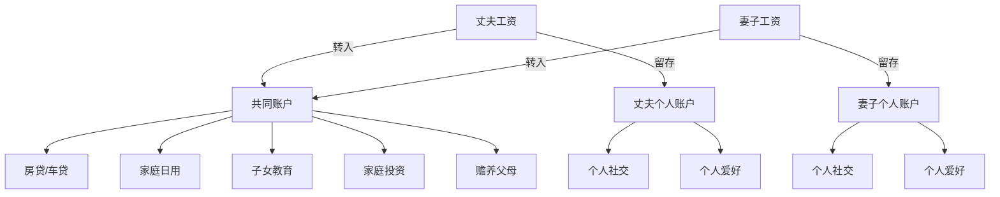
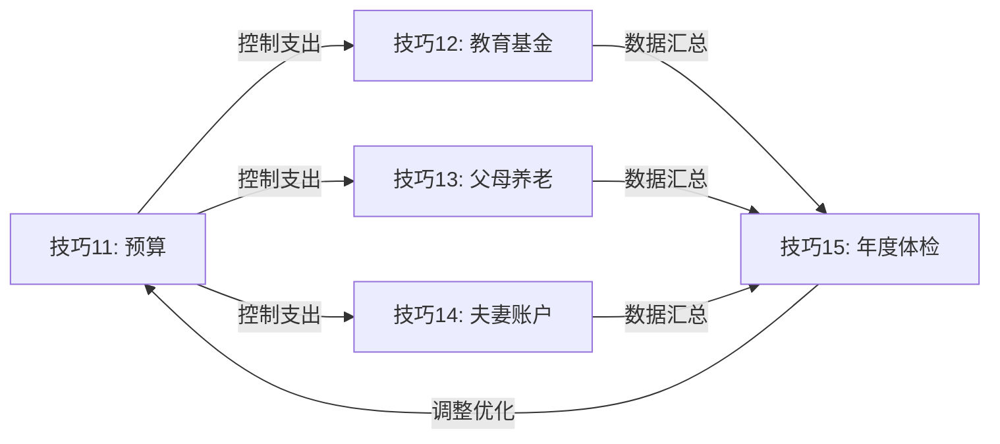

## 三、家庭财务管理的五个核心技巧

30-40岁是家庭财务压力最大的十年：上有父母需要赡养，下有子女需要抚育，中间还有房贷、车贷等刚性支出。这个阶段如果财务管理混乱，很容易陷入"月光"甚至负债的困境；如果管理得当，则能为后半生打下坚实的财务基础。

本节介绍五个经过验证的家庭财务管理核心技巧，从预算编制到年度复盘，形成一套完整的家庭财务管理体系。

### 技巧11：家庭预算的"50-30-20法则"

#### 为什么需要预算？

很多人觉得"记账没用""预算太死板"，但数据说明问题：根据中国人民银行2024年的调查，中国家庭平均储蓄率约为33%，但中位数远低于此——大量家庭储蓄率不足10%，甚至为负。预算不是限制自由，而是让每一分钱都有明确的去处，避免"不知道钱花哪儿了"的困境。

50-30-20法则由美国参议员Elizabeth Warren在《All Your Worth》一书中提出，经过全球数百万家庭验证，是兼顾生活质量和财务安全的经典框架。

#### 三类支出的详细拆解

**50%用于必要支出（Needs）**

必要支出是指维持家庭基本运转不可削减的开支：

| 支出项目 | 占比建议 | 说明 |
|---------|---------|------|
| 房贷/房租 | 25-30% | 不超过家庭月收入的30%，超过则考虑换房或增加收入 |
| 日常生活费 | 10-12% | 包括水电燃气、物业费、米面粮油、日用品 |
| 子女教育 | 5-8% | 学费、课外辅导、学习用品等刚性教育支出 |
| 交通费用 | 3-5% | 油费/公交地铁、车辆保养、保险 |
| 医疗保险 | 2-3% | 基本医保之外的商业保险月均摊 |

**30%用于弹性支出（Wants）**

弹性支出提升生活品质，但在财务紧张时可以压缩：

- **旅游娱乐**（8-10%）：年度旅游基金、周末活动、电影演出
- **社交应酬**（5-8%）：朋友聚餐、人情往来、节日礼物
- **购物消费**（8-10%）：服饰鞋包、电子产品、家居装饰
- **个人爱好**（5-7%）：健身、摄影、游戏、手办等

**20%用于储蓄投资（Savings & Investments）**

这是"先支付自己"的核心——工资到账后第一件事就是转走这部分：

- **强制储蓄**（5%）：存入高流动性账户，作为应急基金的补充
- **长期投资**（10%）：指数基金定投、养老金账户、子女教育基金
- **保险费用**（3%）：重疾险、寿险、意外险的年均摊
- **学习提升**（2%）：课程、书籍、证书考试等人力资本投资

#### 实操：如何落地50-30-20法则

**第一步：计算家庭月可支配收入**

```text
家庭月可支配收入 = 夫妻税后收入之和 - 五险一金个人部分
```

例如：丈夫税后15000元 + 妻子税后12000元 = 27000元/月

**第二步：设定三类支出上限**

```text
必要支出上限 = 27000 × 50% = 13500元
弹性支出上限 = 27000 × 30% = 8100元
储蓄投资下限 = 27000 × 20% = 5400元
```

**第三步：发工资当天自动执行**

设置银行自动转账：工资到账当天，自动将5400元转入投资账户和储蓄账户。剩下的钱才是可以花的。

> **关键原则**：不是"花剩下的才存"，而是"存完剩下的才花"。这个顺序决定了你是在为未来投资还是在为过去买单。

#### 常见误区与纠正

| 误区 | 纠正 |
|------|------|
| "50-30-20不适合高房贷城市" | 如果房贷超过30%，从弹性支出中借调，但储蓄率不低于15% |
| "收入太低没法按比例分配" | 收入越低越需要预算，先保证10%储蓄率，逐步提升 |
| "弹性支出月底看看剩多少" | 必须月初预算，否则月底基本没有剩余 |
| "预算定了就不能改" | 每季度微调一次，但储蓄率只能上调不能下调 |

---

### 技巧12：子女教育基金的"目标倒推法"

#### 教育成本的残酷现实

教育是家庭最大的长期支出之一，而且涨幅远超一般通胀。根据教育部数据，2010-2024年间，中国城镇家庭教育支出年均增长约8-10%，远高于CPI的2-3%。这意味着今天的100万教育储备，15年后可能只相当于今天的40-50万购买力。

#### 第一步：明确教育目标（分场景测算）

不同教育路径的成本差异巨大，必须根据家庭实际情况和教育理念提前规划：

| 教育路径 | 年均费用（2024年价） | 说明 |
|---------|-------------------|------|
| 国内公立K12+公立大学 | 2-5万/年 | 学费低，主要支出在课外辅导和生活费 |
| 国内公立K12+海外本科 | 30-50万/年 | 美英澳加主流留学国家 |
| 国内私立/国际学校K12+海外本科 | 15-25万/年（K12）+ 30-50万/年（本科） | 全程精英教育路线 |
| 国内公立K12+国内985/211 | 3-8万/年 | 性价比最高的路径 |

#### 第二步：计算总需求（含通胀调整）

以"国内公立K12 + 海外本科4年"为例，假设孩子现在3岁：

```text
当前海外本科年均费用：40万元（学费+生活费）
距离上大学时间：15年
假设教育通胀率：6%/年（高于一般通胀）
15年后年均费用：40 × (1.06)^15 ≈ 95.8万元
4年总费用：95.8 × 4 ≈ 383万元
```

再算K12阶段（课外辅导、兴趣班等）：

```text
当前年均课外支出：5万元
K12共12年，假设前6年3万/年，后6年8万/年
考虑通胀后总支出约：120-150万元
```

**教育总需求：约500-530万元**（15年周期）

#### 第三步：倒推每月定投金额

根据复利公式，已知终值求每期投入：

```text
终值FV = 530万元
月利率r = 8% ÷ 12 = 0.667%
期数n = 15 × 12 = 180个月

每月投入 = FV × r / ((1+r)^n - 1)
         = 5300000 × 0.00667 / ((1.00667)^180 - 1)
         ≈ 15,900元/月
```

如果觉得压力过大，可以调整策略：
- 降低教育目标（如选国内大学而非留学）
- 延长准备周期（从孩子出生就开始）
- 提高投资收益率（需要承担更多风险）
- 阶段性投入（前期少、后期多，配合收入增长）

#### 推荐的教育基金投资组合

| 孩子年龄 | 股票类占比 | 债券类占比 | 说明 |
|---------|-----------|-----------|------|
| 0-5岁 | 80% | 20% | 距离用钱时间长，可以承受高波动 |
| 6-10岁 | 60% | 40% | 逐步降低风险 |
| 11-15岁 | 40% | 60% | 接近用钱期，以稳健为主 |
| 16-18岁 | 20% | 80% | 随时可能用钱，以保本为主 |

具体产品建议：
- **股票类**：沪深300指数基金、中证500指数基金（定投，不择时）
- **债券类**：纯债基金、国债逆回购
- **教育金保险**：适合风险厌恶型家庭，但收益率通常低于自行投资

#### 常见误区

- **误区一**："等孩子大了再准备"——时间是复利最大的朋友，晚5年开始，每月投入可能要翻倍
- **误区二**："全买教育金保险"——保险的收益率通常只有3-4%，跑不赢教育通胀
- **误区三**："赌一把高收益"——教育基金是刚性支出，不能承受本金大幅亏损

---

### 技巧13：父母养老的"三层保障"

#### 为什么30-40岁必须开始规划父母养老？

这个年龄段的父母通常55-70岁，正处于或即将进入养老期。如果你现在不开始规划，5-10年后父母可能面临：养老金不足、医疗费用无着落、生活质量大幅下降。更糟糕的是，突发疾病可能瞬间掏空你的家庭储蓄。

根据国家统计局数据，2024年中国城镇退休人员月均养老金约3500元，农村居民养老保险月均仅约200元。这个水平在一二线城市远远不够。

#### 第一层：社保养老金——基础但可能不足

**排查清单：**

1. **确认父母社保类型**
   - 城镇职工养老保险：缴费满15年，退休后按月领取，金额与缴费基数和年限挂钩
   - 城乡居民养老保险：缴费档次从200元/年到6000元/年不等，退休后领取金额较低
   - 无社保：需要自行购买商业养老保险或完全依靠子女赡养

2. **测算养老金缺口**
```text
   月养老金缺口 = 父母月合理支出 - 社保月养老金
   
   例：父母月合理支出5000元，社保养老金3000元
   月缺口 = 5000 - 3000 = 2000元
   年缺口 = 2000 × 12 = 24000元
   ```

3. **补救措施**
   - 如果父母社保缴费不满15年：咨询当地社保局能否一次性补缴
   - 如果金额太低：考虑购买商业养老年金险，每月补充固定金额
   - 如果完全无社保：优先购买城乡居民养老保险（最高档次），再用商业保险补充

#### 第二层：医疗保障——防范"因病返贫"

医疗是老年人最大的财务风险。一场大病可能花费几十万，对中产家庭造成毁灭性打击。

**必须检查的保障清单：**

| 保障类型 | 是否必备 | 说明 |
|---------|---------|------|
| 城镇职工/居民医保 | 必备 | 报销比例50-85%，是医疗费用的第一道防线 |
| 惠民保/百万医疗险 | 强烈推荐 | 年费100-2000元，保额100-400万，报销医保外费用 |
| 重疾险 | 55岁以下推荐 | 55岁以上保费极高甚至无法投保，越早买越好 |
| 防癌险 | 无法买重疾险时的替代 | 健康告知宽松，三高人群也能投保 |
| 意外险 | 必备 | 老年人跌倒骨折等意外高发，年费仅100-300元 |

**关键提醒：**
- 父母55岁是投保的分水岭——55岁后重疾险几乎买不到或极贵，百万医疗险也可能拒保
- 如果父母有慢性病（高血压、糖尿病等），优先考虑防癌险和意外险
- 每年帮父母检查一次保单，确认续保状态和保障范围

#### 第三层：生活保障——确保日常质量

**每月固定赡养金**

根据家庭收入情况，每月给父母固定的生活费。建议不低于当地最低工资标准（2024年一线城市约2500元，二三线约1800元）。

**帮父母做好日常理财**

- 将父母的存款从活期转为大额存单或国债（年化2.5-3%）
- 警惕父母购买"高收益理财产品"——老年人是金融诈骗的高危人群
- 帮父母设置银行短信提醒，监控异常支出

**预留应急资金**

为父母单独准备一个应急账户，金额不低于10万元，用于突发医疗、紧急维修等情况。这笔钱放在货币基金或短期理财中，随时可取。

---

### 技巧14：夫妻财务的"共同账户+个人账户"模式

#### 为什么需要这种模式？

很多夫妻在财务管理上走两个极端：要么完全AA制（伤感情），要么完全合并（没自由）。"共同账户+个人账户"模式在两者之间找到平衡，既保证家庭大额支出有共同资金池，又保留个人财务自主权。

根据《中国家庭金融调查》报告，采用"共同+个人"混合模式的家庭，财务满意度比完全AA或完全合并的家庭高出23%。

#### 账户结构设计



#### 具体操作方案

**共同账户（占家庭总收入70-80%）**

由夫妻双方按收入比例存入。例如丈夫月入2万、妻子月入1万，总共同支出预算21000元：

```text
丈夫存入：21000 × (2/3) = 14000元
妻子存入：21000 × (1/3) = 7000元
```

共同账户承担的支出：
- 房贷、车贷（刚性，不可商量）
- 家庭日常生活费（设定月度预算上限）
- 子女教育费用（学费、辅导班、兴趣班）
- 家庭旅游基金（每年提取固定比例）
- 家庭投资账户（定投、理财）
- 赡养父母（双方父母统一标准或按需分配）

**个人账户（占家庭总收入20-30%）**

各自留存，自由支配，不需要向对方解释：
- 个人社交支出（朋友聚餐、同事随礼）
- 个人爱好支出（游戏充值、运动装备）
- 个人学习提升（课程、书籍）
- 给对方的礼物和惊喜

#### 关键规则：避免财务冲突的五条底线

1. **大额支出必须共同决策**：单笔超过2000元的非常规支出，需双方同意
2. **共同账户透明公开**：双方随时可以查看共同账户的收支明细
3. **个人账户互不干涉**：只要不影响共同账户的正常运转，个人支出不做审查
4. **定期财务会议**：每月花30分钟同步家庭财务状况，调整下月预算
5. **应急优先原则**：如果家庭遇到突发大额支出（如医疗），双方按比例从个人账户补充共同账户

#### 特殊情况处理

**收入差距大的夫妻**

如果一方收入远高于另一方（如10倍以上），不建议按比例分摊，而是：
- 高收入方承担全部共同账户
- 低收入方的收入全部作为个人账户
- 或者设定固定金额作为共同支出，超出部分高收入方承担

**全职妈妈/爸爸**

- 全职一方应有固定"工资"存入个人账户（金额由双方协商，建议不低于当地最低工资）
- 全职照顾家庭等同于工作，不应在财务上被边缘化
- 共同账户对双方完全平等，不存在"谁赚的多谁说了算"

---

### 技巧15：年度财务体检的"五看清单"

#### 为什么要做年度体检？

日常记账管的是"战术层面"，年度体检管的是"战略层面"。很多家庭记了三年账，储蓄率从没提升过，投资收益跑不赢通胀，保险保额已经跟不上家庭资产增长——因为缺少年度复盘和调整。

建议在每年12月最后一个周末，夫妻双方共同花2-3小时完成年度财务体检。

#### 一看：净资产增长率

**计算方法：**

```text
净资产 = 所有资产（现金+投资+房产+车辆） - 所有负债（房贷+车贷+信用卡+借款）
净资产增长率 = (年末净资产 - 年初净资产) / 年初净资产 × 100%
```

**健康标准：**

| 指标 | 优秀 | 合格 | 需警惕 |
|------|------|------|--------|
| 净资产增长率 | >15% | 8-15% | <8% |
| 是否跑赢通胀 | 超过CPI 2倍以上 | 超过CPI | 低于CPI |

如果净资产增长率持续低于通胀率，说明你的家庭财富在实际缩水——即使账面数字在增加。

#### 二看：储蓄率

**计算方法：**

```text
储蓄率 = (家庭年收入 - 家庭年支出) / 家庭年收入 × 100%
```

**健康标准：**

- **20%以下**：危险区，家庭抗风险能力极弱
- **20-30%**：及格线，基本能应对一般风险
- **30-40%**：良好，有余力进行额外投资
- **40%以上**：优秀，但也要确保不是过度压缩生活质量

如果储蓄率不达标，优先检查弹性支出是否有压缩空间，而不是削减必要的保险和教育投入。

#### 三看：投资收益

**计算方法：**

```text
投资收益率 = (年末投资市值 - 年初投资市值 - 年内新增投入) / (年初投资市值 + 年内新增投入/2) × 100%
```

**对比基准：**

- 沪深300指数年收益（反映A股大盘表现）
- 通货膨胀率（最低门槛）
- 银行大额存单利率（无风险收益参考）

如果你的投资收益率连续3年跑不赢沪深300指数，建议将主动投资转为指数基金定投——大多数主动型基金经理也跑不赢指数。

#### 四看：保险覆盖

**检查清单：**

1. **保额是否跟上家庭资产增长**
   - 房贷增加了，寿险保额是否相应提高？
   - 收入增加了，重疾险保额是否需要追加？

2. **保障是否覆盖主要风险**
   - 家庭经济支柱是否有足额寿险？（保额不低于年收入10倍）
   - 所有家庭成员是否有医疗险？
   - 是否有意外险覆盖日常意外风险？

3. **保费支出是否合理**
   - 家庭年保费支出建议为家庭年收入的5-8%
   - 低于5%可能保障不足，高于10%可能过度投保

4. **是否有重复或浪费的保单**
   - 多份医疗险不能重复报销，保留最好的一份即可
   - 返还型保险的实际收益率通常很低，考虑是否值得继续持有

#### 五看：目标进度

将年初设定的财务目标逐项检查：

| 目标 | 年初计划 | 实际进度 | 差距分析 | 调整方案 |
|------|---------|---------|---------|---------|
| 教育基金 | 定投1.2万/月 | 坚持10个月，2个月断缴 | 收入波动导致 | 设置自动扣款，避免断缴 |
| 应急基金 | 存满10万 | 已存8万 | 接近目标 | 下半年加大力度 |
| 父母养老 | 每月给5000元 | 全年执行到位 | 无差距 | 明年考虑帮父母补充医疗险 |
| 旅游基金 | 存2万 | 存了1.5万 | 略有不足 | 从弹性支出中调剂 |

#### 年度财务体检执行模板

建议用Excel或在线表格记录，每年一份，便于纵向对比：

```markdown
# 20XX年度家庭财务体检报告

## 基本信息
- 体检日期：20XX年12月XX日
- 参与人：丈夫XXX、妻子XXX

## 核心指标
- 家庭年收入：XXX万元
- 家庭年支出：XXX万元
- 储蓄率：XX%
- 净资产：XXX万元（增长XX%）
- 投资收益率：XX%

## 保险状况
- 家庭年保费支出：XXX元（占收入X%）
- 寿险保额：XXX万元
- 重疾险保额：XXX万元
- 医疗险：有/无

## 目标进度
（逐项列出各目标的完成情况）

## 下年计划
（根据体检结果制定明年的财务计划和调整）
```

---

### 五个技巧的协同关系

这五个技巧不是孤立的，而是构成一个完整的家庭财务管理闭环：



- **预算**是入口，决定每月有多少钱可以分配给各个方向
- **教育基金**和**父母养老**是两大核心长期目标，需要持续投入
- **夫妻账户模式**是执行机制，确保预算和投入能够落地
- **年度体检**是反馈机制，发现问题并调整下一年的预算和目标

每年的体检结果应该直接指导下一年的预算调整。如果教育基金进度落后，就从弹性支出中挤出更多；如果父母医疗保障不足，就调整保险支出；如果储蓄率下降，就审查哪些支出超出了预算。

家庭财务管理不是一劳永逸的事情，而是一个持续优化的过程。30-40岁建立好这套体系，40-50岁就会越来越轻松。
