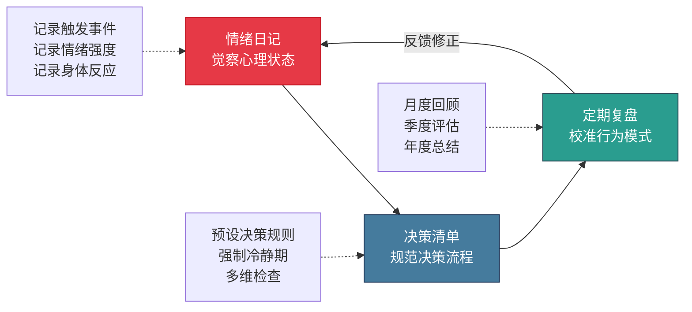
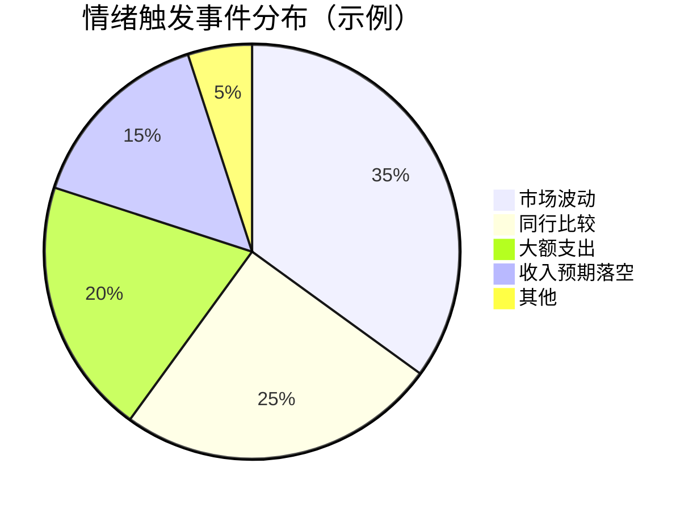
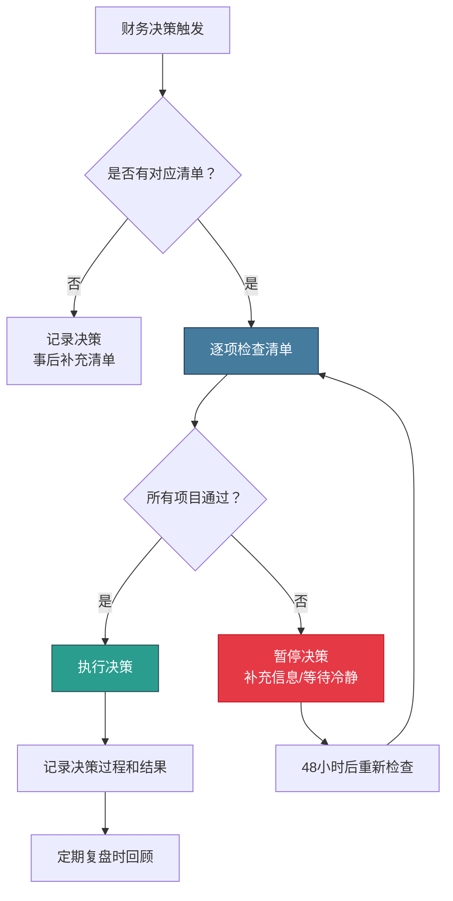
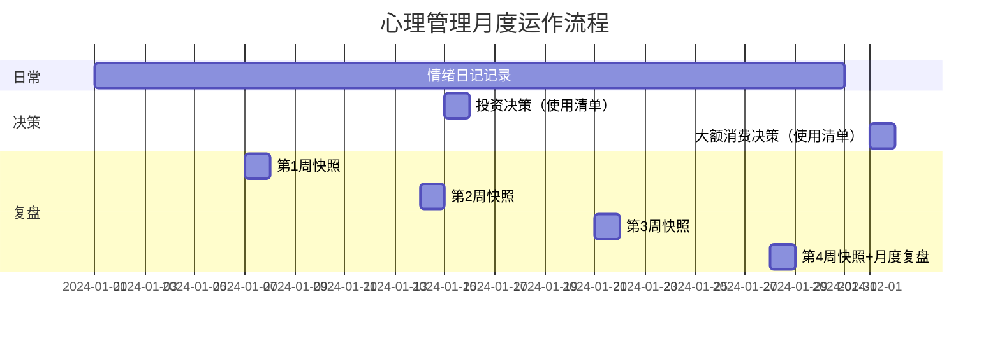

## 四、心理管理的三个核心技巧

30-40岁的财富加速，表面上看是收入、投资、资产配置的技术问题，底层却是一场心理战。行为金融学的研究反复证明：**投资者的最大敌人不是市场，而是自己的情绪**。诺贝尔经济学奖得主丹尼尔·卡尼曼（Daniel Kahneman）在《思考，快与慢》中指出，人类大脑有两套决策系统——快速直觉的"系统1"和慢速理性的"系统2"。在涉及金钱的决策中，系统1常常抢先反应：恐惧时急于抛售、贪婪时冲动加仓、焦虑时盲目跟风，而这些情绪化决策造成的损失，往往超过市场本身的波动。

30-40岁阶段的情绪挑战尤为严峻。你同时承受着房贷压力、子女教育、父母赡养、职业瓶颈等多重压力，这些压力会持续消耗你的心理资源，降低你做出理性财务决策的能力。心理学中的"自我损耗理论"（Ego Depletion）告诉我们：意志力是有限资源，当你在日常生活中不断消耗它来应对各种压力时，留给财务决策的"理性额度"就会大幅缩水。

这就是为什么你需要一套**系统化的心理管理工具**——不是靠意志力硬撑，而是靠流程和机制来保护你的决策质量。本节介绍的三个核心技巧——情绪日记、决策清单、定期复盘——构成一个完整的心理管理闭环：情绪日记帮你**觉察**心理状态，决策清单帮你**规范**决策流程，定期复盘帮你**校准**行为模式。



### 技巧一：情绪日记——把模糊的焦虑变成可管理的数据

#### 为什么情绪日记有效？

情绪日记的理论基础来自认知行为疗法（CBT）中的"情绪觉察"技术。CBT的核心假设是：**不是事件本身让你痛苦，而是你对事件的解读让你痛苦**。当你把情绪记录下来时，你实际上在做两件事：

1. **创建"观察者距离"**：记录情绪的那一刻，你从"沉浸者"变成了"观察者"，这个视角切换本身就降低了情绪强度。神经科学研究表明，当人用语言描述自己的情绪时，大脑杏仁核（情绪中枢）的活跃度会下降，前额叶皮层（理性中枢）的活跃度会上升。

2. **积累决策数据**：当你有了3个月的情绪记录，你会发现清晰的模式——比如"每次大盘暴跌超过3%时我会极度焦虑""每次看到同行晒收入时我会冲动消费"。这些模式是优化决策的宝贵数据。

美国加州大学洛杉矶分校（UCLA）的心理学家Matthew Lieberman的研究证实：给情绪贴标签（affect labeling）这个简单动作，就能显著降低负面情绪的强度。他的fMRI实验显示，当被试者用文字描述恐惧情绪时，杏仁核活动降低了约30%。

#### 情绪日记的标准模板

每次涉及金额超过月收入10%的财务决策，或者你感受到明显的财务焦虑时，填写以下模板：

```markdown
## 情绪日记 - [日期] [时间]

### 1. 触发事件
- 什么事件触发了我的情绪？（客观描述，不加评判）
  示例：看到基金账户本月亏损8000元

### 2. 情绪识别
- 我的主要情绪是什么？（从以下选择：焦虑/恐惧/愤怒/嫉妒/兴奋/贪婪/后悔/羞愧）
  示例：焦虑（7/10），恐惧（5/10）
- 情绪强度打分（1-10分）

### 3. 身体反应
- 我的身体有什么感觉？
  示例：心跳加速、胃部紧缩、手心出汗

### 4. 自动化想法
- 我脑海中第一个念头是什么？
  示例：「应该赶紧卖掉，不然会亏更多」
- 这个想法的证据是什么？反面证据是什么？

### 5. 理性评估
- 如果我最好的朋友遇到同样情况，我会怎么建议他？
- 一年后回头看，这件事还重要吗？
- 我的长期财务计划需要因此调整吗？

### 6. 决策记录
- 我最终做了什么决定？
- 这个决定是基于情绪还是基于计划？
```

#### 实操：如何坚持写情绪日记

情绪日记最大的挑战不是"不会写"，而是"坚持不下来"。以下是经过验证的坚持策略：

**策略一：降低启动门槛**

不要追求完美的记录。最初只需要记录三件事：触发事件、情绪类型、情绪强度。这三行字只需要30秒。等习惯建立后，再逐步补充完整模板。

**策略二：绑定已有习惯**

把情绪日记绑定到你每天必做的事情上。比如：每天晚上刷手机前，先花2分钟填写当天的财务情绪记录。或者每次打开股票APP之前，先在备忘录里写下当前的情绪状态。

**策略三：使用数字工具**

推荐使用手机备忘录或笔记App，随时可以记录。关键是**在情绪发生的当下就记录**，而不是等到晚上回忆——回忆时你的情绪已经平复，记录会失真。

**策略四：设置提醒**

在手机上设置每晚9点的提醒："今天有值得记录的财务情绪吗？"如果没有，点"跳过"；如果有，花2分钟记录。

#### 情绪日记的进阶用法：情绪模式分析

当你积累了1-3个月的情绪日记后，进行一次"情绪模式分析"：

| 分析维度 | 具体问题 | 行动方向 |
|:---:|------|------|
| 时间模式 | 哪些时间段情绪波动最大？（月初/月末/发薪日/还款日） | 在高波动时段预设应对方案 |
| 事件模式 | 哪类事件最容易触发负面情绪？（市场暴跌/同行晒收入/大额支出） | 针对高频触发事件建立"预设反应" |
| 情绪模式 | 哪种情绪出现频率最高？它通常导致什么行为？ | 识别最有害的情绪-行为链条 |
| 决策模式 | 情绪化决策 vs 理性决策的比例各是多少？ | 设定目标：将情绪化决策比例降至20%以下 |



#### 真实场景：情绪日记如何避免了一次重大损失

张先生，35岁，互联网行业中层，家庭月收入3.5万元，持有约40万元基金和股票。2024年某月，A股连续下跌一周，他的账户浮亏约4万元。他的情绪日记记录如下：

> **触发事件**：账户浮亏4万，同事说"赶紧跑，还要跌"。
> **情绪**：恐惧（8/10），焦虑（7/10）。
> **自动化想法**："全部清仓，保住剩下的钱。"
> **理性评估**：我的投资计划是3年以上，现在才持有8个月。历史上每次暴跌后都有反弹。如果现在卖出，就是把浮亏变成实亏。
> **最终决策**：不操作，按原计划继续定投。

两个月后市场反弹，他不仅回本还盈利约2万元。如果当时清仓，他将实亏4万元，且错过后续上涨。

这个案例的关键不在于"抄底"或"判断准确"，而在于情绪日记给了他**一个暂停键**——在情绪最强烈的时候，他没有立即行动，而是先记录、再评估。这30分钟的记录时间，就是情绪衰减的窗口期。

---

### 技巧二：决策清单——用规则代替临场判断

#### 为什么需要决策清单？

阿图·葛文德（Atul Gawande）在《清单革命》中记录了一个惊人的事实：密歇根州的ICU病房引入一张简单的5步检查清单后，中心静脉导管感染率从4%降到了接近零。这不是因为医生不知道这些步骤，而是因为在高压环境下，即使专家也会遗忘基本步骤。

财务决策同样如此。你知道应该分散投资、应该设止损、应该控制仓位，但在市场剧烈波动或生活压力叠加时，你很可能会"忘记"这些基本原则。**决策清单的作用不是教你知道什么，而是在你最容易犯错的时刻提醒你不要忘记什么**。

行为经济学家理查德·塞勒（Richard Thaler）和卡斯·桑斯坦（Cass Sunstein）提出的"助推"（Nudge）理论指出：改变人的行为最有效的方式不是教育，而是改变决策环境。决策清单就是一种自我助推——在你做决策之前，插入一个结构化的检查流程，让理性有机会介入。

#### 三大决策清单

根据30-40岁最常见的财务决策场景，你需要准备三张核心清单：

##### 清单一：投资决策清单

每次进行买入或卖出操作前，逐项检查：

```markdown
## 投资决策检查清单

### 买入检查
□ 1. 这笔投资在我的资产配置计划内吗？
      （不在计划内的投资→暂停，先更新配置方案）
□ 2. 我投入的资金是"闲钱"吗？
      （即3年内不需要动用的资金；不是→不买）
□ 3. 我能用一句话说明买入理由吗？
      （说不清楚→不买；理由是"别人都在买"→不买）
□ 4. 如果买入后立刻下跌30%，我能承受吗？
      （不能→减少投入金额）
□ 5. 我的单只持仓是否超过总资产的20%？
      （超过→不加仓，先分散）
□ 6. 我是否在情绪激动时做这个决策？
      （是→执行48小时冷静期）

### 卖出检查
□ 1. 卖出理由是什么？
      - 触发了预设的止损线？→执行
      - 达到了预设的止盈目标？→执行
      - 需要用钱？→执行
      - "感觉要跌"？→暂停，执行48小时冷静期
      - "亏得受不了"？→暂停，先填写情绪日记
□ 2. 卖出后资金去哪里？有明确的去向吗？
□ 3. 这个卖出决定是否符合我的长期投资计划？
```

##### 清单二：大额消费决策清单

单笔支出超过月收入20%时使用：

```markdown
## 大额消费决策检查清单

□ 1. 这是"需要"还是"想要"？
      （诚实回答；如果犹豫，大概率是"想要"）
□ 2. 我是否有这笔消费的预算？
      （没有预算→创建预算并等待至少一个完整消费周期）
□ 3. 48小时冷静期：
      - 我是否已经等待了至少48小时？
      - 48小时后，我的购买欲望是否依然强烈？
□ 4. 替代方案检查：
      - 有没有更便宜的替代品能满足同样需求？
      - 二手/租赁是否可行？
      - 延迟购买6个月会怎样？
□ 5. 机会成本计算：
      - 这笔钱如果用于投资，5年后价值多少？
      - 以年化8%计算：[金额] × 1.08^5 = [结果]
□ 6. 付款方式检查：
      - 是否使用了分期付款？（分期付款的真实年化利率通常在12-18%）
      - 是否动用了应急基金？
```

大额消费的48小时冷静期不是随意设定的。神经科学研究表明，购物冲动的多巴胺分泌高峰通常在产生欲望后的24-48小时内消退。等待48小时后，你会发现大约60-70%的冲动消费欲望会自然消失。

##### 清单三：重大人生决策清单

涉及职业变动、购房、创业等重大决策时使用：

```markdown
## 重大人生决策检查清单

### 信息检查
□ 1. 我是否收集了足够的信息？
      - 至少咨询了3位有相关经验的人？
      - 至少阅读了2本/篇相关资料？
      - 了解了最坏情况是什么？
□ 2. 我是否存在确认偏误？
      - 我是否只在寻找支持我想法的证据？
      - 反对意见的理由是什么？

### 财务检查
□ 3. 最坏情况下，家庭财务能否承受？
      - 计算最坏情况的财务影响
      - 应急基金能否覆盖6个月生活费？
□ 4. 这个决策对家庭其他成员的影响是什么？
      - 是否与伴侣充分讨论？
      - 是否考虑了子女和父母的需求？

### 时间检查
□ 5. 我是否给了自己足够的决策时间？
      - 职业变动：至少1个月的考虑期
      - 购房：至少3个月的考察期
      - 创业：至少6个月的准备期
□ 6. 10-10-10测试：
      - 这个决定10天后我会怎么想？
      - 10个月后呢？
      - 10年后呢？

### 可逆性检查
□ 7. 这个决策可逆吗？
      - 可逆决策→可以更快做决定，边做边调整
      - 不可逆决策→需要更多信息和更长的思考时间
```

#### 决策清单的使用原则

**原则一：在冷静时制定，在激动时执行**

决策清单必须在你情绪平稳、思维清晰时制定。它的价值恰恰在于：当你情绪激动时，你不需要思考"应该怎么做"，只需要按清单逐项检查。这就是清单的"外部化记忆"功能——把理性决策的规则固化在纸上，而不是依赖你随时可能崩溃的意志力。

**原则二：清单不是束缚，是保护**

有些人会觉得清单"限制了灵活性"。恰恰相反，清单保护的是你最重要的东西——长期财务目标。市场上的短期机会永远存在，但你的本金损失后很难恢复。清单帮你过滤掉90%的噪音决策，让你把精力集中在真正重要的10%上。

**原则三：定期更新，但不要在情绪中更新**

每季度回顾一次清单，根据实际情况调整。但绝对不要在情绪激动时修改清单——那等于在暴风雨中修改航行计划。



---

### 技巧三：定期复盘——从"做过"中提炼"会做"

#### 为什么复盘是最被低估的财富技能？

美国陆军有一种叫做"行动后回顾"（After Action Review, AAR）的训练方法，每次军事行动后都要回答四个问题：我们打算做什么？实际发生了什么？为什么会有差异？下次怎么做？这套方法后来被引入商业管理，成为GE、波音等公司的标准实践。

复盘的价值在于：它把你的经验从"感觉"变成"知识"。没有复盘，你只是"经历了"一件事；有了复盘，你"理解了"一件事。心理学研究显示，人类大脑对经验的天然编码是模糊和情绪化的——你记得"那件事让我很焦虑"，但不记得"焦虑导致我做了什么错误决定"。复盘通过结构化的回顾，把模糊的情绪记忆转化为清晰的行为模式。

对于30-40岁的财富管理，复盘的意义更加重大。这个阶段你做的每一个财务决策——投资、消费、职业选择——金额都在增大，影响都在加深。一个20多岁时犯的小错误（亏了几千块），到了30多岁可能变成大错误（亏了几万甚至几十万）。**复盘的成本最低，但回报最高**——你只需要花时间回顾，不需要花真金白银去"交学费"。

#### 三级复盘体系

##### 一级复盘：每周财务快照（15分钟）

每周日晚上花15分钟，填写以下模板：

```markdown
## 每周财务快照 - 第[ ]周

### 数字盘点
- 本周收入：_____元（来源：______）
- 本周支出：_____元（最大一笔：______）
- 本周结余：_____元
- 投资账户市值：_____元（较上周：+/- _____元）

### 行为检查
- 本周是否有计划外的大额支出？[ ] 是 [ ] 否
  如果是，触发原因是什么？______
- 本周是否做了投资操作？[ ] 是 [ ] 否
  如果是，操作理由是什么？______ 符合计划吗？______
- 本周情绪日记中记录了几条财务相关情绪？____条

### 一句话总结
本周我在财务方面做得最好的一件事：______
本周我在财务方面最需要改进的一件事：______
```

每周快照的核心价值不是精确到分的记账，而是**建立"财务觉察"的习惯**。很多人对自己的财务状况是"模糊感知"——大概知道收入多少、花了多少，但具体数字不清楚。每周15分钟的盘点，能让你从"模糊感知"升级为"清晰掌控"。

##### 二级复盘：月度财务复盘（60分钟）

每月最后一个周末，花60分钟进行深度复盘：

```markdown
## 月度财务复盘 - [年月]

### 一、数据回顾

| 指标 | 预算/目标 | 实际 | 差异 | 原因分析 |
|:---:|:---:|:---:|:---:|------|
| 月收入 | | | | |
| 月支出 | | | | |
| 储蓄率 | | | | |
| 投资收益 | | | | |
| 净资产变化 | | | | |

### 二、情绪分析
- 本月情绪日记共记录____条
- 最高频情绪类型：______
- 最大情绪波动事件：______
- 情绪化决策____次，理性决策____次
- 情绪化决策占比：____% （目标：<20%）

### 三、决策回顾
- 本月做出的重大财务决策：
  1. ____________
  2. ____________
- 回头看，这些决策中有哪些可以做得更好？
  ____________

### 四、目标追踪
- 本月设定的3个财务目标完成情况：
  1. [ ] ____________
  2. [ ] ____________
  3. [ ] ____________

### 五、下月计划
- 下月3个最重要的财务行动：
  1. ____________
  2. ____________
  3. ____________
- 需要提前准备的事项：______
```

月度复盘的关键是**趋势分析**。单个月的数据没有太大意义，但连续3个月的趋势能告诉你很多：储蓄率是否在持续提升？情绪化决策比例是否在下降？支出结构是否在优化？

##### 三级复盘：季度/年度财务深度审计（半天）

每季度和每年各做一次"深度审计"，这不是简单的数字汇总，而是一次**战略性反思**：

```markdown
## 季度/年度财务深度审计

### 一、资产全景
- 总资产：_____元
- 总负债：_____元
- 净资产：_____元（较上期变化：_____%）
- 资产结构明细：

| 资产类别 | 金额 | 占比 | 目标占比 | 调整建议 |
|:---:|:---:|:---:|:---:|------|
| 现金/货基 | | | | |
| 债券/固收 | | | | |
| 股票/权益 | | | | |
| 房产 | | | | |
| 保险 | | | | |
| 其他 | | | | |

### 二、收入结构分析
- 主业收入占比：____% （目标趋势：下降）
- 副业收入占比：____% （目标趋势：上升）
- 投资收入占比：____% （目标趋势：上升）
- 收入增长驱动力分析：______

### 三、行为模式总结
- 本季度情绪化决策的典型模式是什么？
  ____________
- 我的投资行为中最大的问题是什么？
  ____________
- 我的消费行为中最大的漏洞是什么？
  ____________

### 四、目标校准
- 年初设定的财务目标是否仍然合理？
- 是否需要调整目标或策略？
- 下一阶段的核心重点是什么？

### 五、知识差距
- 我在哪些方面的财务知识还明显不足？
- 需要学习什么？通过什么方式学？
```

#### 复盘中的关键分析框架

##### 框架一：预算偏差分析

预算偏差是复盘中最基础也最重要的分析。不是所有偏差都是坏事——你需要区分"好偏差"和"坏偏差"：

| 偏差类型 | 示例 | 性质 | 行动 |
|------|------|------|------|
| 正向偏差（优于预期） | 投资收益超预期 | 好 | 分析原因，看能否复制 |
| 可控负偏差 | 外卖支出超预算 | 坏 | 找到具体原因，调整习惯 |
| 不可控负偏差 | 突发医疗支出 | 中性 | 检查保障是否充足 |
| 结构性偏差 | 每月都在"其他"项超支 | 坏 | 重新划分预算类别 |
| 信号性偏差 | 连续3个月储蓄率下降 | 危险 | 立即深入分析根本原因 |

##### 框架二：决策质量评估

复盘时不要只看结果，要评估**决策质量**。一个好决策可能导致坏结果（黑天鹅事件），一个坏决策也可能带来好结果（运气）。你需要评估的是决策过程本身：

```markdown
## 决策质量评估矩阵

| 评估维度 | 评分(1-5) | 证据 |
|------|:---:|------|
| 信息充分性 | | 做决策前收集了多少信息？ |
| 情绪状态 | | 做决策时的情绪是冷静还是激动？ |
| 时间充裕度 | | 是深思熟虑还是仓促决定？ |
| 计划一致性 | | 是否符合长期财务计划？ |
| 风险评估 | | 是否考虑了最坏情况？ |
| 替代方案 | | 是否考虑了其他选项？ |
```

如果一个决策在以上6个维度的平均分低于3分，即使结果是好的，也应该标记为"需要改进的决策"——因为靠运气赢的钱，迟早会靠实力亏回去。

##### 框架三：收入飞轮健康度检查

这个框架用于评估你的财富增长系统是否在正向运转：

| 飞轮指标 | 健康标准 | 当前状态 | 趋势 |
|------|------|:---:|:---:|
| 主业收入年增长率 | >10% | | ↑/↓/→ |
| 副业收入绝对值 | 逐季增长 | | ↑/↓/→ |
| 投资本金持续投入 | 每月有新增 | | ↑/↓/→ |
| 被动收入占比 | 逐月提升 | | ↑/↓/→ |
| 总净资产月度变化 | 持续正增长 | | ↑/↓/→ |
| 应急基金充裕度 | ≥6个月支出 | | ↑/↓/→ |

如果超过3项指标趋势为↓，说明飞轮可能在减速，需要立即深入分析原因并制定纠正方案。

#### 复盘常见误区与纠正

**误区一：只看数字不看行为**

很多人复盘只关注"赚了多少钱""亏了多少钱"，却不分析背后的行为。纠正方法：每次复盘必须回答"我做了什么导致了这个结果"，而不是"结果是什么"。

**误区二：只做记录不做分析**

填写了一堆数据，但没有从中提炼出任何洞见。纠正方法：每次复盘结束前，强制自己写下至少一个"可执行的改进点"——不是"我要更理性"这种空话，而是"下次看到大盘跌3%以上时，我先做10个深呼吸再决定是否操作"这种具体行动。

**误区三：复盘频率不固定**

想起来了才复盘，忙了就跳过。纠正方法：在日历上固定复盘时间，设置提醒。每周日晚8点做快照，每月最后一个周六下午做月度复盘。把它当作和工作会议一样不可取消的约定。

**误区四：对过去的错误过度自责**

复盘的目的是改进，不是自我惩罚。如果你在复盘中发现自己犯了错误，正确的反应是"我学到了什么"，而不是"我怎么这么蠢"。自责会消耗心理资源，降低你未来做决策的质量。卡罗尔·德韦克（Carol Dweck）的成长型思维理论告诉我们：把错误看作学习机会，而不是能力不足的证据。

---

### 三个技巧的协同运作

这三个技巧不是独立的工具，而是一个**闭环系统**。情绪日记产生数据，决策清单使用这些数据来优化规则，定期复盘评估整个系统的效果并进行校准。

#### 月度运作流程示例



#### 一个完整的运作实例

以一位35岁的职场中层李女士为例，展示三个技巧如何协同运作：

**第1周**：李女士在情绪日记中记录——看到同事晒了新买的豪华SUV，产生了强烈的嫉妒情绪（8/10），脑海中闪过"我也应该换车"的念头。

**第1周快照时**：她注意到本周情绪日记中有3条与"同行比较"相关的情绪记录。她在复盘笔记中写下："我需要警惕'比较心理'导致的冲动消费。"

**第2周**：李女士的旧车出现了一次小故障，她真的开始考虑换车。但在大额消费清单的检查中，她发现：
- "需要"vs"想要"：旧车完全能满足日常需求，修一下只要2000元
- 48小时冷静期：等待后，换车欲望明显下降
- 机会成本：一辆25万的SUV，如果这笔钱投资10年（年化8%），价值约54万
- 结论：暂不换车，用2000元修好旧车

**月底复盘**：李女士在月度复盘中总结——本月通过情绪日记识别了"比较心理"模式，通过决策清单避免了一次约25万元的冲动消费。她把"同行比较"列为自己的头号情绪触发因素，并在决策清单中新增了一条规则："因比较心理产生的消费欲望，冷静期延长到7天。"

这就是三个技巧的协同效应：情绪日记提供了觉察，决策清单提供了保护，定期复盘提供了优化。

---

### 30-40岁特有的心理挑战与应对策略

#### 挑战一：同龄人比较的"隐形压力"

30岁之后，同学聚会、社交媒体上的"成功展示"会不断刺激你的比较心理。心理学家Leon Festinger的社会比较理论指出：人天生倾向于与相似的人比较来评估自己。30-40岁时，同龄人之间的差异急剧扩大——有人年薪百万，有人还在为房贷发愁——这种差距会让你产生强烈的焦虑。

**应对策略**：

1. **限制信息输入**：取关那些让你焦虑的社交媒体账号。信息的质量直接影响你的情绪质量。
2. **转换比较对象**：不要和"最成功的人"比较，和"一年前的自己"比较。你唯一需要赢的人是过去的自己。
3. **将嫉妒转化为信息**：当你嫉妒一个人时，问自己"他做了什么我能做到但没做的事"。嫉妒是方向信号，不是攻击指令。

#### 挑战二：决策疲劳导致的"默认选择"

30-40岁每天要做大量决策——工作、家庭、孩子、投资。心理学研究表明，决策数量越多，后续决策的质量越低。这就是为什么很多人"白天精打细算，晚上冲动网购"——一天的决策消耗殆尽后，你已经没有理性资源来控制消费了。

**应对策略**：

1. **自动化常规决策**：工资到账自动分配（储蓄/投资/生活费），定投自动扣款。减少需要动脑的决策数量。
2. **把重要决策放在早上**：上午是你意志力最充沛的时候，重大财务决策应该安排在这个时段。
3. **接受"足够好"**：不是每个决策都需要最优解。对于低影响的决策（比如今天吃什么），快速决定就好，把理性留给高影响的决策。

#### 挑战三："沉没成本"陷阱

30-40岁的人已经积累了一些"沉没成本"——一个读了但不喜欢的专业、一份投入了很多但看不到前途的工作、一只亏了很多但不甘心卖出的股票。沉没成本谬误让你基于"已经投入了多少"来决定"要不要继续"，而不是基于"未来能获得多少"。

**应对策略**：

1. **定期做"归零测试"**：问自己"如果我今天从零开始，我还会做同样的选择吗？"如果答案是否，你就应该考虑改变。
2. **区分"坚持"和"固执"**：坚持是基于理性分析的持续投入，固执是基于情绪（不甘心、害怕损失）的死守。
3. **设置"退出触发器"**：在开始一件事情之前就设定退出条件。比如投资某只股票前就设好止损线，而不是等到亏损了再纠结要不要卖。

#### 挑战四："现在享受"vs"延迟满足"的持续拉锯

行为经济学中的"双曲贴现"（Hyperbolic Discounting）现象在30-40岁尤为突出：眼前的一辆新车比10年后的100万存款更有诱惑力，即使你知道后者的实际价值更大。这不是因为你贪婪或愚蠢，而是因为人类大脑天生对即时奖励有更强的反应。

**应对策略**：

1. **给未来"具象化"**：不要想"10年后的财务自由"这种抽象概念，而是想象具体的场景——"10年后我可以不看老板脸色选择工作""孩子上大学时不用为学费发愁"。具象化能激活大脑的共情回路，让未来奖励更"真实"。
2. **设置"享乐预算"**：不要把所有钱都存起来（这会让你觉得生活没有乐趣），而是专门留出一小部分用于"无理由消费"。比如月收入的5-10%可以自由花，不需要理由。这样你既有满足感，又不影响大局。
3. **小奖励替代大挥霍**：想放松时，不要动辄出国旅行（花几万），可以试试一顿好的（花几百）、一个周末短途（花一两千）。奖励频率比单次金额更重要。

---

### 心理管理的长期价值

这三个技巧的价值不是立竿见影的——它们不会让你一夜之间变成投资高手，也不会让你立刻戒掉所有冲动消费。但如果你坚持6个月以上，你会发现三个显著变化：

1. **情绪波动对决策的影响明显降低**：你仍然会感到焦虑、恐惧、贪婪，但这些情绪不再直接控制你的行为。情绪日记让你建立了"觉察→暂停→评估"的反应链条，而不是"情绪→行动"的条件反射。

2. **决策质量系统性提升**：决策清单帮你过滤掉了大部分低质量决策，让你把有限的理性资源集中在真正重要的事情上。

3. **财务行为形成正向飞轮**：定期复盘让你不断从过去的行为中学习，每次复盘都是一次微调。6个月下来，你的财务行为模式会发生质的改变。

美国财务规划协会（FPA）的一项研究显示：有系统化财务行为管理习惯的人，其10年累计投资收益比没有此类习惯的人平均高出约2-3个百分点。这2-3个百分点的差距，以30-40岁的投资本金规模计算，可能意味着几十万元的差异。

**最终，心理管理不是关于"控制情绪"——情绪是人类的正常反应，不需要也做不到完全控制。心理管理是关于"在情绪存在的前提下，依然做出好的决策"。** 情绪日记帮你看见情绪，决策清单帮你隔离情绪，定期复盘帮你从情绪的后果中学习。三者结合，你就拥有了一套自我保护的决策系统——不依赖超人的意志力，只依赖简单的流程和坚持的习惯。

> **行动建议**：从今天开始，先做最简单的一件事——在手机备忘录里创建一个"情绪日记"文件夹，记录你今天在财务方面感受到的任何情绪。不需要完整模板，哪怕只写一句话："今天看到基金跌了，有点慌。" 这一句话，就是你心理管理系统的第一块基石。
