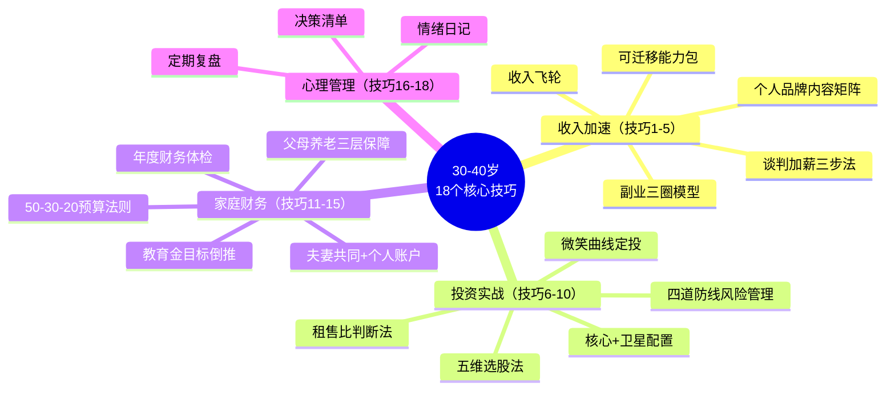
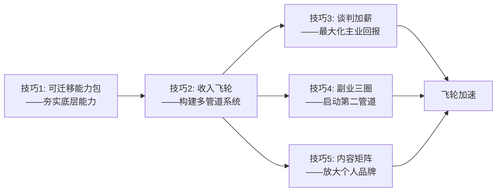
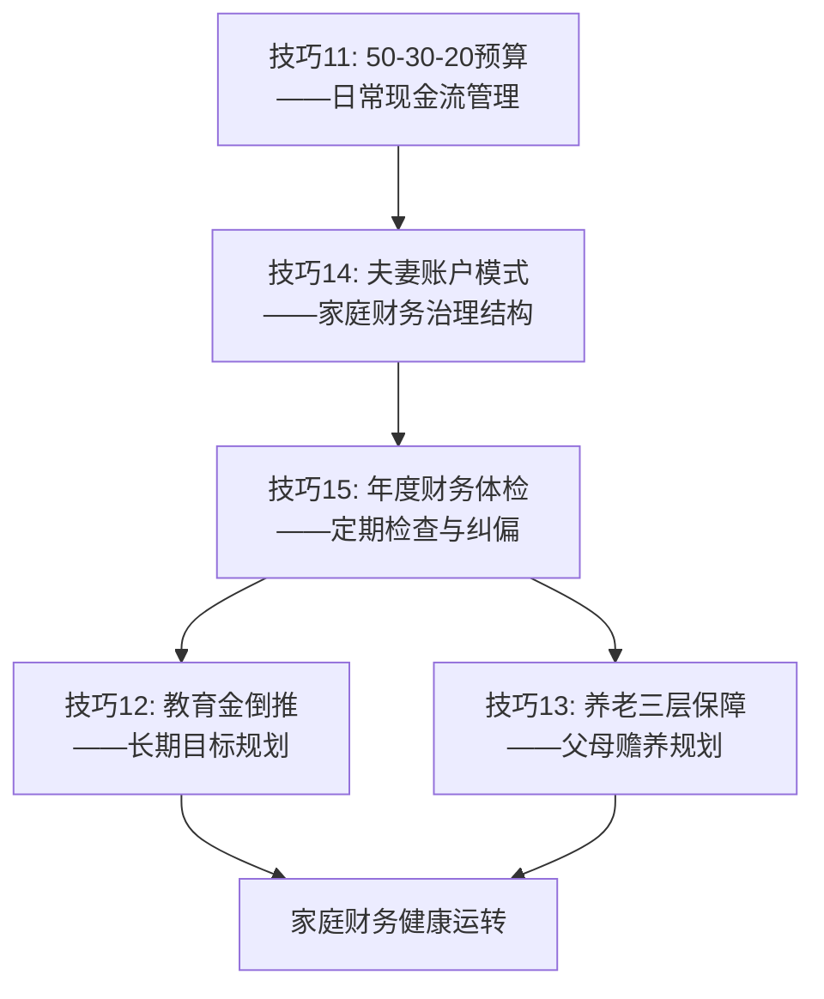
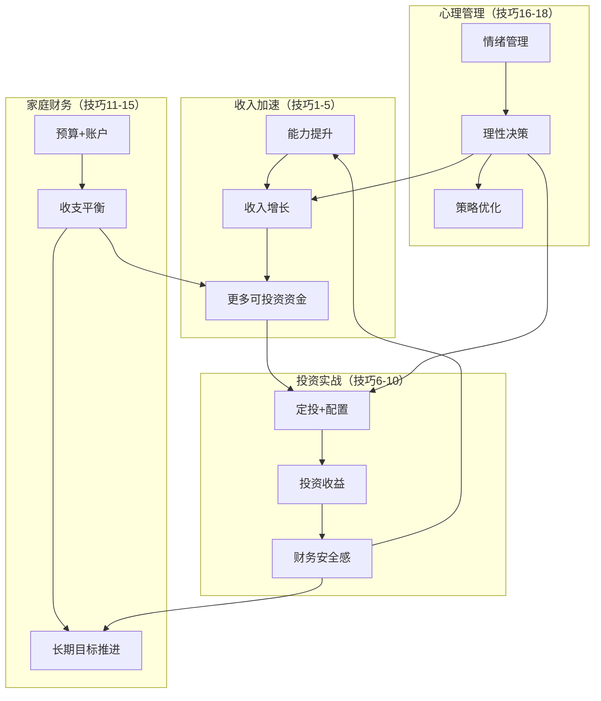

## 五、本章技巧总结

30-40岁的财富加速，不是靠某一个"灵光一现"的技巧，而是靠一套**相互咬合的系统**——收入、投资、家庭财务、心理管理四个模块同时运转，形成飞轮效应。本节将前四节共18个核心技巧进行结构化梳理，帮你建立全局视角，找到属于自己的行动优先级。

### 5.1 四大模块与18个技巧全景图

本章核心技巧按四个模块组织，每个模块解决一个关键问题：

| 模块 | 技巧编号 | 核心问题 | 核心方法 |
|:---:|:---:|:---:|:---|
| 收入加速 | 1-5 | 如何从线性增长转向指数增长？ | 能力包+飞轮+谈判+副业+品牌 |
| 投资实战 | 6-10 | 如何让钱稳定地生钱？ | 定投+配置+选股+房产+风控 |
| 家庭财务 | 11-15 | 如何像经营公司一样经营家庭？ | 预算+教育金+养老+夫妻财务+体检 |
| 心理管理 | 16-18 | 如何在焦虑中保持理性决策？ | 情绪记录+决策框架+定期复盘 |

### 5.2 收入加速模块：5个技巧的逻辑链

收入加速的5个技巧不是孤立的，它们构成一条**从能力到价值的变现链**：

**技巧1（可迁移能力包）→ 技巧2（收入飞轮）→ 技巧3（谈判加薪）→ 技巧4（副业三圈）→ 技巧5（内容矩阵）**

逻辑关系如下：

**核心要点回顾：**

| 技巧 | 一句话总结 | 关键行动 | 常见误区 |
|:---:|:---|:---|:---|
| 技巧1 | 构建"硬技能+软技能+高阶能力"三层能力包 | 每年投入收入的5-10%学习 | 只练硬技能，忽视沟通和战略思维 |
| 技巧2 | 主业60-70%+副业10-20%+投资10-20%，三条管道相互促进 | 先稳主业，再启副业，最后优化投资 | 三条管道同时铺开，精力分散 |
| 技巧3 | 建价值档案→选对时机→锚定+让步 | 量化贡献，用数据说话 | 只谈"我很努力"，不谈"我创造了多少价值" |
| 技巧4 | 能力圈∩兴趣圈∩市场圈 | 找到三圈交集再行动 | 做与主业无关的副业，或做纯体力型副业 |
| 技巧5 | 文字+视频+社交三平台持续输出 | 先完成再完美，频率>质量 | 追求完美主义导致从不开始 |

**收入加速的飞轮效应**：当5个技巧同时运转时，会产生乘数效应——能力提升带来加薪和更好的副业机会，副业收入增加投资本金，投资收益增强财务安全感，安全感让你敢于做更大胆的职业决策，进一步推动主业收入增长。这不是线性叠加，而是**指数级加速**。

### 5.3 投资实战模块：5个技巧的防御纵深

投资实战的5个技巧构成一个**从进攻到防守的完整体系**：

**技巧6（定投）→ 技巧7（配置）→ 技巧8（选股）→ 技巧9（房产）→ 技巧10（风控）**

| 技巧 | 定位 | 核心逻辑 | 适用场景 |
|:---:|:---:|:---|:---|
| 技巧6 | 基础进攻 | 估值越低买越多，利用"微笑曲线"摊薄成本 | 30-40岁的核心投资策略 |
| 技巧7 | 组合构建 | 核心60-70%（宽基指数+债券）+卫星20-30%（行业+个股+另类） | 资产配置的整体框架 |
| 技巧8 | 精选个股 | 行业前景20%+公司质地30%+管理层20%+估值20%+技术面10% | 有余力做个股研究时 |
| 技巧9 | 实物资产 | 租售比>5%才值得投资，综合考虑地段、学区、规划 | 购买投资性房产时 |
| 技巧10 | 全面防御 | 应急基金→保险→分散投资→对冲策略，四道防线层层递进 | 始终贯穿投资全过程 |

**投资模块的关键原则：**

1. **先防守再进攻**：技巧10的四道防线是地基，没有地基的进攻就是赌博。应急基金（6-12个月生活费）和保险保障（寿险+重疾+医疗+意外）必须先到位。
2. **定投是基本功**：30-40岁正处于收入增长期，每月有稳定的现金流，天然适合定投。估值定投（低估多买、高估少买）比普通定投收益更高。
3. **配置决定80%的收益**：学术研究表明，投资收益的80-90%来自资产配置，而非个股选择。先把"核心+卫星"配好，再考虑精选个股。
4. **再平衡纪律不可少**：每半年检查一次，偏离目标超过10%就调整。再平衡的本质是"高卖低买"的纪律化执行。

### 5.4 家庭财务模块：5个技巧的管理闭环

家庭财务的5个技巧构成一个**从日常到长期的管理闭环**：

**技巧11（预算）→ 技巧14（夫妻账户）→ 技巧15（年度体检）→ 技巧12（教育金）→ 技巧13（养老保障）**

| 技巧 | 管理维度 | 核心方法 | 执行频率 |
|:---:|:---:|:---|:---:|
| 技巧11 | 日常支出 | 50%必要+30%弹性+20%储蓄，先支付自己 | 每月 |
| 技巧12 | 子女教育 | 确定目标→计算总需求（含通胀）→倒推每月定投 | 每月定投+每年复查 |
| 技巧13 | 父母赡养 | 社保养老金+医疗保障+生活保障三层叠加 | 每季度确认 |
| 技巧14 | 夫妻关系 | 共同账户70-80%+个人账户20-30%，大额共决小额自主 | 每月对账 |
| 技巧15 | 整体健康 | 净资产增长率+储蓄率+投资收益+保险覆盖+目标进度 | 每年一次 |

**家庭财务管理的核心心智模型——"家庭CFO"思维：**

把家庭当作一家小公司来经营。你作为CFO，需要同时管理三件事：
- **现金流管理**（技巧11+14）：确保收入>支出，建立合理的消费结构
- **资本配置**（技巧12+13）：将结余分配到教育、养老、投资等不同用途
- **风险控制**（技巧15）：定期体检，发现问题及时纠偏

### 5.5 心理管理模块：3个技巧的内在支撑

心理管理是前三个模块的**底层操作系统**。如果心理状态不稳定，再好的财务策略也会被情绪化的决策摧毁。

| 技巧 | 作用 | 具体方法 | 使用频率 |
|:---:|:---:|:---|:---:|
| 技巧16 情绪日记 | 识别情绪触发点 | 记录每次财务决策时的情绪状态和决策结果 | 每次重大决策后 |
| 技巧17 决策清单 | 避免冲动决策 | 决策前过一遍清单：是否冲动？是否有数据支撑？是否考虑了最坏情况？ | 每次决策前 |
| 技巧18 定期复盘 | 持续优化策略 | 每月回顾投资操作、消费行为、职业进展 | 每月一次 |

**心理管理的底层逻辑：**

30-40岁面临的三大焦虑——社会比较焦虑、责任焦虑、意义焦虑——如果不加管理，会导致三种典型的行为陷阱：
- **过度冒险**：焦虑驱动下想"一把翻身"，All in高风险资产
- **过度保守**：觉得"怎么追都追不上"，放弃投资只存银行
- **消费补偿**：用物质消费填补意义的空虚，储蓄率持续下降

三个心理技巧的作用就是建立一个**"暂停-检查-决策"的缓冲机制**：情绪日记帮你"看见"自己的情绪模式，决策清单帮你"暂停"冲动行为，定期复盘帮你"检查"策略有效性。三者配合，让你在焦虑的环境中保持理性。

### 5.6 四大模块的协同关系

18个技巧不是各自独立的，它们之间存在紧密的协同关系：

**协同效应的关键节点：**

1. **收入→投资**（技巧2→技巧6/7）：收入飞轮产生的结余资金，通过定投和资产配置进入投资系统
2. **投资→收入**（技巧10→技巧1）：财务安全感让你敢于投资自己（学习、跳槽、创业），推动收入增长
3. **家庭→收入**（技巧11/14→技巧2）：良好的家庭财务管理确保结余率，为收入飞轮提供"燃料"
4. **心理→全部**（技巧16-18→全部）：理性决策能力贯穿所有模块，是整个系统的"操作系统"

### 5.7 按人生阶段的技巧优先级

不同子阶段，18个技巧的优先级不同。以下是按30-34岁、35-37岁、38-40岁三个阶段的优先级排列：

#### 30-34岁：打地基阶段

| 优先级 | 技巧 | 原因 |
|:---:|:---:|:---|
| P0 | 技巧1 可迁移能力包 | 能力是一切的基础，这个阶段投入产出比最高 |
| P0 | 技巧10 四道防线 | 尽早建立安全保障，越晚成本越高 |
| P0 | 技巧11 50-30-20预算 | 养成储蓄习惯，建立财务纪律 |
| P1 | 技巧2 收入飞轮 | 开始规划多管道收入，但不要急于铺开 |
| P1 | 技巧6 微笑曲线定投 | 尽早开始定投，利用时间的复利效应 |
| P1 | 技巧3 谈判加薪 | 主业收入是这个阶段的核心燃料 |
| P2 | 技巧16 情绪日记 | 开始记录，积累数据 |
| P2 | 技巧14 夫妻账户 | 如果已婚，建立家庭财务治理结构 |

#### 35-37岁：飞轮成型阶段

| 优先级 | 技巧 | 原因 |
|:---:|:---:|:---|
| P0 | 技巧2 收入飞轮 | 让三条管道真正转起来 |
| P0 | 技巧7 核心+卫星配置 | 投资本金积累到一定规模，需要系统化配置 |
| P0 | 技巧12 教育金倒推 | 子女教育进入规划期，越早开始压力越小 |
| P1 | 技巧4 副业三圈 | 启动与主业协同的副业 |
| P1 | 技巧5 内容矩阵 | 开始建立个人品牌 |
| P1 | 技巧15 年度体检 | 建立定期检查机制 |
| P1 | 技巧13 养老三层保障 | 父母年龄增长，养老需求日益紧迫 |
| P2 | 技巧17 决策清单 | 投资和职业决策越来越复杂，需要决策框架 |

#### 38-40岁：收割与转型阶段

| 优先级 | 技巧 | 原因 |
|:---:|:---:|:---|
| P0 | 技巧8 五维选股法 | 投资经验丰富后，可以尝试精选个股提高收益 |
| P0 | 技巧15 年度体检 | 全面检查十年成果，为40-50岁做准备 |
| P0 | 技巧18 定期复盘 | 系统性回顾，提炼可复用的方法论 |
| P1 | 技巧2 收入飞轮优化 | 飞轮已成型，重点是优化效率和扩大规模 |
| P1 | 技巧9 租售比判断 | 考虑是否增加实物资产配置 |
| P1 | 技巧7 配置再平衡 | 逐步降低权益比例，增加稳健资产 |

### 5.8 18个技巧的常见执行障碍与破解方法

知道技巧不等于能做到。以下是每个模块最常见的执行障碍和破解方法：

#### 收入加速模块的执行障碍

| 障碍 | 表现 | 破解方法 |
|:---|:---|:---|
| "没时间" | 总觉得工作太忙，没时间学新技能 | 每天30分钟碎片学习，一年=182小时，足够掌握一门新技能 |
| "不知道做什么副业" | 想了很多方向，一个都没开始 | 用三圈模型画出来，先做最小可行产品（MVP），花1周验证 |
| "不好意思谈加薪" | 怕被拒绝、怕影响关系 | 把谈加薪当作"价值汇报"而非"讨价还价"，用数据说话 |
| "内容写不出来" | 觉得自己没什么可分享的 | 你比80%的人多3-5年经验，这些经验就是内容 |

#### 投资实战模块的执行障碍

| 障碍 | 表现 | 破解方法 |
|:---|:---|:---|
| "看不懂" | 觉得投资太复杂，不知道从哪开始 | 从宽基指数定投开始，不需要看懂任何东西 |
| "怕亏钱" | 一看到亏损就想卖 | 设定"不看账户"规则，每月只看一次 |
| "追涨杀跌" | 市场涨了兴奋买入，跌了恐慌卖出 | 用估值定投的规则替代情绪判断 |
| "配置太复杂" | 觉得核心+卫星搞不清楚 | 先用最简单的60%沪深300+40%债券基金起步 |

#### 家庭财务模块的执行障碍

| 障碍 | 表现 | 破解方法 |
|:---|:---|:---|
| "另一半不配合" | 夫妻对财务观念不一致 | 从"共同账户+个人账户"模式开始，给彼此自由度 |
| "存不下钱" | 每月月光，不知道钱花哪了 | "先支付自己"：发工资当天自动转20%到投资账户 |
| "觉得保险浪费钱" | 觉得自己不会出事 | 计算"如果主要收入者倒下，家庭能撑多久" |
| "太远了不想规划" | 觉得教育金、养老金还有十几年 | 用倒推法算出每月需要多少，数字会逼你行动 |

#### 心理管理模块的执行障碍

| 障碍 | 表现 | 破解方法 |
|:---|:---|:---|
| "记不下来" | 觉得写情绪日记太麻烦 | 用手机备忘录，只记3个词：事件+情绪+决策 |
| "复盘没用" | 做了复盘但没有改变 | 复盘必须产出"一个行动项"，下次必须执行 |
| "决策清单太死板" | 觉得每次都要过清单很繁琐 | 只在涉及金额超过月收入的决策时使用 |

### 5.9 技巧组合的三种典型方案

根据不同的个人情况，18个技巧可以组合成三种典型方案：

#### 方案A：稳健型（适合风险承受能力较低、家庭负担较重的人）

| 重点投入的技巧 | 配比 |
|:---|:---:|
| 技巧10 四道防线 + 技巧11 预算 + 技巧14 夫妻账户 | 40%精力 |
| 技巧6 定投 + 技巧7 核心+卫星配置 | 30%精力 |
| 技巧1 可迁移能力包 + 技巧3 谈判加薪 | 20%精力 |
| 技巧16 情绪日记 + 技巧18 定期复盘 | 10%精力 |

**特点**：先建安全垫，再求增长。投资以宽基指数定投为主，权益比例控制在50%以内。

#### 方案B：进取型（适合收入稳定、有一定积蓄、风险承受能力较强的人）

| 重点投入的技巧 | 配比 |
|:---|:---:|
| 技巧2 收入飞轮 + 技巧4 副业三圈 + 技巧5 内容矩阵 | 35%精力 |
| 技巧7 核心+卫星 + 技巧8 五维选股 | 25%精力 |
| 技巧1 可迁移能力包 + 技巧3 谈判加薪 | 25%精力 |
| 技巧10 四道防线 + 技巧17 决策清单 | 15%精力 |

**特点**：收入和投资双管齐下，积极开拓副业，投资适当提高权益比例到60-70%。

#### 方案C：创业型（适合有明确创业方向、家庭经济基础较好的人）

| 重点投入的技巧 | 配比 |
|:---|:---:|
| 技巧1 可迁移能力包 + 技巧2 收入飞轮 | 30%精力 |
| 技巧4 副业三圈 + 技巧5 内容矩阵 + 技巧3 谈判加薪 | 30%精力 |
| 技巧10 四道防线（重点：应急基金要更厚） | 25%精力 |
| 技巧16 情绪日记 + 技巧17 决策清单 | 15%精力 |

**特点**：创业期间投资策略应偏保守（高现金比例），因为创业本身就是高风险投资。应急基金建议提高到12-18个月。

### 5.10 30天启动清单

不要试图同时执行18个技巧。以下是30天分步启动计划：

**第1周：建立基线**
- [ ] 用技巧11（50-30-20法则）梳理当前收支结构
- [ ] 用技巧15（年度体检五看清单）诊断当前财务健康状况
- [ ] 计算当前的"财务跑道"（应急基金能撑几个月）

**第2周：建立防线**
- [ ] 如果应急基金不足6个月，立即开始补充（技巧10）
- [ ] 检查保险覆盖情况：寿险、重疾、医疗、意外是否齐全（技巧10）
- [ ] 如已婚，与配偶讨论"共同账户+个人账户"模式（技巧14）

**第3周：启动增长**
- [ ] 开设定投账户，选择1-2只宽基指数基金开始定投（技巧6）
- [ ] 用三圈模型画出自己的副业方向（技巧4）
- [ ] 列出自己的"可迁移能力包"清单，找出最需要提升的1-2项（技巧1）

**第4周：建立机制**
- [ ] 设置自动转账：发工资日自动转20%到投资账户（技巧11）
- [ ] 开始记录情绪日记，至少记录3次财务相关的情绪事件（技巧16）
- [ ] 制定下一个月的复盘计划：每月最后一个周末做一次（技巧18）

### 5.11 一句话速查表

当你需要快速回忆某个技巧时，看这张表：

| # | 技巧名称 | 一句话记忆 |
|:---:|:---|:---|
| 1 | 可迁移能力包 | 硬技能打底+软技能加分+战略思维高阶 |
| 2 | 收入飞轮 | 主业60-70%+副业10-20%+投资10-20%，三管齐下 |
| 3 | 谈判加薪三步法 | 价值档案→选对时机→锚定让步 |
| 4 | 副业三圈模型 | 擅长∩喜欢∩市场需要=最佳副业 |
| 5 | 内容矩阵 | 文字+视频+社交三平台持续输出 |
| 6 | 微笑曲线定投 | 低估多买、正常正常买、高估少买 |
| 7 | 核心+卫星配置 | 核心60-70%稳如磐石，卫星20-30%灵活出击 |
| 8 | 五维选股法 | 行业20%+质地30%+管理层20%+估值20%+技术10% |
| 9 | 租售比判断法 | 年租金/房价>5%才值得投 |
| 10 | 四道防线 | 应急基金→保险→分散→对冲，层层递进 |
| 11 | 50-30-20法则 | 必要50%+弹性30%+储蓄20%，先支付自己 |
| 12 | 教育金倒推法 | 目标总额（含通胀）÷月数=每月定投额 |
| 13 | 养老三层保障 | 社保+医保+生活费，三层叠加 |
| 14 | 夫妻账户模式 | 共同70-80%+个人20-30%，大额共决小额自主 |
| 15 | 年度财务体检 | 净资产+储蓄率+投资收益+保险+目标，五看清单 |
| 16 | 情绪日记 | 事件+情绪+决策，看见自己的模式 |
| 17 | 决策清单 | 冲动？数据？最坏情况？三问检查 |
| 18 | 定期复盘 | 每月回顾，产出一个行动项 |

### 5.12 从技巧到系统：最终思考

18个技巧的真正价值，不在于你掌握了多少个"点"，而在于你能否将它们编织成一个**自运转的系统**。

一个理想的30-40岁财富加速系统应该是这样的：

1. **主业稳步增长**（技巧1+3），每年收入增速跑赢通胀5个百分点以上
2. **副业逐步启动**（技巧4+5），3-5年内副业收入达到主业的20-30%
3. **投资自动运转**（技巧6+7），定投自动扣款，半年做一次再平衡
4. **家庭财务有序**（技巧11+14），每月自动执行，年底做一次体检
5. **风险全面覆盖**（技巧10+13），保险到位，应急基金充足
6. **心理保持稳定**（技巧16+18），情绪有记录，决策有框架，策略有复盘

当这个系统运转起来后，你不需要每天盯着它——它会像一个设计良好的机器一样自动运行。你只需要每半年做一次"大保养"（再平衡+年度体检），每季度做一次"小检查"（复盘+调整）。

**记住：30-40岁的财富加速，不是靠某个神奇的技巧一招制胜，而是靠18个技巧组成的一个稳定运转的系统，日复一日地为你工作。** 系统的力量远大于个体技巧的力量——这正是"飞轮效应"的本质。
