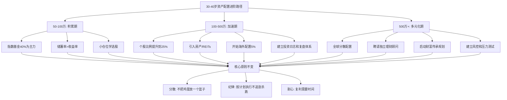

## 六、30-40岁的资产配置进阶

本节是"资产配置的科学方法"（理论基础第3节）的实操进阶版。理论基础已经讲清楚了核心-卫星配置法和生命周期理论的原理，这里解决三个实际问题：**不同资产规模该怎么做、怎么执行再平衡、怎么评估自己的组合是否健康**。

### 6.1 不同资产规模的配置策略

资产规模直接决定了你的可选工具、风险承受力和配置重心。100万和1000万的打法完全不同——前者要集中精力做大基数，后者要考虑分散和传承。

#### 6.1.1 资产50-100万：积累期的攻守兼备

这个阶段的核心矛盾是：**本金不够大，但时间窗口正好**。30-35岁、资产50-100万的人，距离退休还有25-30年，完全可以承受较高的波动去换取长期收益。但同时，本金小意味着每一笔亏损的绝对值虽然不大，但对心态的冲击不小。

**推荐配置方案：**

| 资产类别 | 配比 | 具体品种 | 预期年化 | 说明 |
|---------|------|---------|---------|------|
| 宽基指数基金 | 40% | 沪深300ETF、中证500ETF、创业板ETF | 8-12% | 核心仓位，长期持有 |
| 债券基金 | 20% | 纯债基金、短债基金 | 3-5% | 压舱石，降低组合波动 |
| 个股投资 | 15% | 自己研究过的2-5只股票 | 不确定 | 用小仓位练手，积累选股能力 |
| 现金储备 | 15% | 货币基金、银行活期 | 1.5-2.5% | 应急资金+等待机会的子弹 |
| 黄金/商品 | 10% | 黄金ETF、黄金ETF联接 | 跟随金价 | 对冲极端风险 |

**配置逻辑拆解：**

指数基金占40%是这个阶段的最优解，原因有三：第一，50-100万的本金规模下，个股研究的投入产出比不高——你花100小时研究一只股票，可能只持有5-10万元，对整体收益的影响有限；第二，指数基金天然分散，避免了个股黑天鹅；第三，A股的宽基指数长期年化收益在8-12%之间，足以跑赢通胀并实现资产增值。

个股投资控制在15%，是因为这个阶段的你确实需要学习选股——等到资产过了200万再开始就晚了。但用15%的仓位学习，即使全部亏损也不会伤筋动骨。

现金储备15%看似浪费收益，但30-40岁的人生变动极多（换工作、结婚、买房、生子），没有流动性储备的投资组合就像没有安全气囊的车——平时看不出来，出事时致命。

**这个阶段的三条铁律：**
1. 储蓄率比收益率更重要——每年多存5万，比收益率高1%的效果大得多
2. 不要借钱投资——杠杆在这个阶段的期望收益是负的
3. 把精力放在提升收入上，而不是研究K线图

#### 6.1.2 资产100-500万：加速期的系统化运作

进入这个阶段，你已经有了基本的投资经验，本金也足够做真正的资产配置。核心矛盾从"怎么赚到第一桶金"变成了"怎么让系统帮你赚钱"。

**推荐配置方案：**

| 资产类别 | 配比 | 具体品种 | 预期年化 | 说明 |
|---------|------|---------|---------|------|
| 宽基指数基金 | 30% | 沪深300、中证500、科创50 | 8-12% | 核心仓位适当压缩 |
| 个股投资 | 25% | 3-8只深度研究的股票 | 10-20% | 仓位提升，选股要更严格 |
| 债券基金 | 15% | 纯债基金、可转债基金 | 3-6% | 稳定器 |
| 房产相关 | 15% | 自住房产（如已购）或REITs | 3-8% | 实物资产锚定 |
| 现金储备 | 10% | 货币基金、大额存单 | 2-3% | 降低比例但仍保留 |
| 海外/另类 | 5% | QDII基金、港股通、黄金 | 跟随标的 | 开始全球化配置 |

**与50-100万阶段的关键差异：**

第一，个股比例从15%提升到25%。此时你已经有3-5年的投资经验，应该开始建立自己的投资体系。这个阶段的目标是从"买指数赚β"进化到"选股赚α"。但注意：如果你的个股投资过去3年没有跑赢沪深300，请把比例降回去。

第二，引入房产相关资产。如果已经有了自住房，这部分可以缩减或转为REITs。REITs的好处是不用操心物业管理和租客问题，同时享受不动产的现金流回报。

第三，开始考虑海外配置。5%的QDII或港股通看起来不多，但这是种子仓位——当你未来资产继续增长时，海外配置的比例会逐步提升到10-20%。

**100-500万阶段的进阶动作：**
1. 建立投资日志——记录每笔买卖的逻辑和结果，季度复盘
2. 学习用Excel或专业工具（且慢、蛋卷基金）做组合分析
3. 开始关注税收优化——基金分红方式选择、持有期超过1年免个税
4. 如果有房贷，评估提前还贷vs继续投资的收益率差异

#### 6.1.3 资产500万以上：多元化与传承规划

500万是一个分水岭。在这个阶段，你面临的核心矛盾从"增长"变成了"保全"——保住已经有的，比再多赚10%重要得多。

**推荐配置方案：**

| 资产类别 | 配比 | 具体品种 | 说明 |
|---------|------|---------|------|
| 宽基指数基金 | 25% | 沪深300、MSCI中国、标普500指数基金 | 全球分散的指数底仓 |
| 个股投资 | 20% | 5-10只深度研究的股票 | 选股体系已经成熟 |
| 债券/固收 | 15% | 国债、高评级企业债、银行理财 | 稳定现金流 |
| 房产 | 15% | 核心城市房产或REITs组合 | 实物资产对冲通胀 |
| 海外资产 | 10% | 美股、港股、海外债券基金 | 地域分散 |
| 另类投资 | 5% | 私募基金、股权投资、黄金 | 追求非相关收益 |
| 现金储备 | 10% | 分散在2-3家银行 | 流动性+安全性 |

**500万以上必须做的事：**

1. **聘请独立理财顾问**——不是银行客户经理（他们卖产品赚佣金），而是按时间收费的独立顾问（Fee-only）。费用通常在每年5000-20000元，但能帮你避免的错误远超这个成本。

2. **开始财富传承规划**——设立遗嘱、考虑保险（大额终身寿险可以规避遗产税，虽然中国目前没有遗产税，但未来政策存在不确定性）、了解家族信托的基本框架。

3. **建立风控体系**——单一资产不超过总资产的20%，单一行业不超过30%，单一市场（A股/美股/港股）不超过50%。

4. **定期做压力测试**——问自己：如果股市跌40%、房价跌30%、同时失业6个月，我的家庭财务能否撑住？如果答案是否，说明你的风险敞口太大。



### 6.2 资产再平衡的实操方法

再平衡是资产配置中**最容易被忽视、但对长期收益影响最大的操作**。学术研究表明，坚持再平衡的投资者比"设置好就不管"的投资者，长期年化收益能高出0.5-1.5%，同时波动性显著降低。

#### 6.2.1 再平衡的原理

假设你的目标配置是股票60%+债券40%。一年后，股票涨了30%，债券涨了5%。你的实际比例变成了股票68%+债券32%。此时你的组合比目标配置更激进——如果市场接下来大跌，你的损失会比预期更大。

再平衡的操作是：卖掉部分股票，买入债券，把比例恢复到60/40。这本质上是一个**系统化的"卖高买低"机制**——不需要你预测市场，只需要你遵守纪律。

#### 6.2.2 三种再平衡方法的对比

| 方法 | 操作方式 | 优点 | 缺点 | 适合人群 |
|------|---------|------|------|---------|
| 定期再平衡 | 每半年或每年固定日期调整 | 简单，不需要盯盘 | 可能在偏离很小时也操作，增加成本 | 大多数投资者 |
| 阈值再平衡 | 偏离目标超过5%（绝对值）时调整 | 只在偏离显著时操作，效率更高 | 需要定期检查，可能错过时机 | 有一定经验的投资者 |
| 现金流再平衡 | 新资金投入低配资产，不卖出 | 避免卖出产生的税费和交易成本 | 仅适用于持续有新资金流入的情况 | 还在持续储蓄的30-40岁人群 |

**对30-40岁人群的最佳实践：以现金流再平衡为主，定期再平衡为辅。**

具体操作：每个月你有新的储蓄要投入时，不要按固定比例分配，而是优先投入当前比例低于目标的资产类别。比如目标是指数基金40%，当前实际比例是45%，那这个月的新增资金就全部投债券或现金，不投指数基金。

每半年做一次全面检查，如果单个资产类别偏离目标超过5个百分点，就做一次卖出再平衡。

#### 6.2.3 再平衡的完整操作流程

**第一步：获取当前持仓数据**

把所有投资账户的数据汇总到一张表里：

```text
资产类别        | 账户1    | 账户2    | 账户3    | 合计      | 实际比例
----------------|----------|----------|----------|-----------|--------
沪深300ETF      | 150,000  | 50,000   | -        | 200,000   | 26.7%
中证500ETF      | 80,000   | -        | 20,000   | 100,000   | 13.3%
个股组合        | 120,000  | -        | 30,000   | 150,000   | 20.0%
纯债基金        | 100,000  | 50,000   | -        | 150,000   | 20.0%
货币基金        | 50,000   | 30,000   | 20,000   | 100,000   | 13.3%
黄金ETF         | 50,000   | -        | -        | 50,000    | 6.7%
----------------|----------|----------|----------|-----------|--------
合计            | 550,000  | 130,000  | 70,000   | 750,000   | 100%
```

**第二步：与目标配置对比**

```text
资产类别   | 目标比例 | 实际比例 | 偏差   | 目标金额 | 差额
-----------|----------|----------|--------|----------|--------
宽基指数   | 40%      | 40.0%    | 0.0%   | 300,000  | 0
个股投资   | 15%      | 20.0%    | +5.0%  | 112,500  | -37,500
债券基金   | 20%      | 20.0%    | 0.0%   | 150,000  | 0
现金储备   | 15%      | 13.3%    | -1.7%  | 112,500  | +12,500
黄金       | 10%      | 6.7%     | -3.3%  | 75,000   | +25,000
```

**第三步：执行调整**

- 个股超配37,500元——卖出37,500元个股
- 黄金低配25,000元——用卖出所得买入25,000元黄金ETF
- 现金低配12,500元——剩余12,500元转入货币基金

**第四步：记录和复盘**

记录本次再平衡的日期、操作内容、交易成本。半年后再做一次，对比两次的组合表现。

#### 6.2.4 再平衡的常见误区

**误区一：频繁再平衡**

有些人每周甚至每天都在调仓位。这是错误的——过度再平衡会产生大量交易成本（基金申赎费通常在0.1-1.5%），而且频繁操作容易被情绪左右。研究表明，月度以上的再平衡频率差异对长期收益的影响微乎其微，但交易成本的差异是实打实的。

**误区二：只再平衡不考虑市场环境**

虽然再平衡的核心是纪律，但在极端市场环境下可以适当灵活。比如2015年6月A股估值已经到了历史极端水平（沪深300市盈率超过18倍），此时如果再平衡要求你"卖掉债券买入股票"，反而是错误的。正确的做法是：在极端估值区域，允许偏离目标配置不超过10个百分点。

**误区三：忽略再平衡的税务影响**

基金持有不到7天赎回，费率通常高达1.5%。持有不到1年赎回，短期资本利得税（虽然中国目前对个人投资者暂免，但政策可能变化）。在做再平衡时，优先卖出持有期超过1年的资产，或者用新资金进行再平衡而不是卖出。

### 6.3 投资组合的风险评估

很多投资者只看收益不看风险，这是最大的认知盲区。一个年化收益15%但最大回撤60%的组合，对大多数人的心理承受力来说是灾难——你很可能在回撤30%时就割肉离场了，根本拿不到15%的收益。

#### 6.3.1 波动性（标准差）

波动性衡量的是收益率的离散程度。标准差越大，意味着你的账户余额波动越剧烈。

**各资产类别的典型年化波动率：**

| 资产类别 | 年化波动率 | 直观感受 |
|---------|-----------|---------|
| 货币基金 | 0.5-1% | 几乎感受不到波动 |
| 纯债基金 | 2-5% | 偶尔小亏，很快恢复 |
| 沪深300 | 20-25% | 经常单日涨跌2-3%，年度可能跌20% |
| 中证500 | 25-30% | 波动更大，但弹性也更大 |
| 创业板指 | 30-35% | 大起大落是常态 |
| 个股（蓝筹） | 25-40% | 取决于个股特性 |
| 个股（成长） | 40-60% | 需要强大的心理承受力 |

**如何计算组合的波动性？**

简单的近似公式：组合波动率 ≈ 各资产波动率的加权平均 × 相关系数修正因子

对于普通投资者，不需要精确计算，记住一个经验法则：**一个60%股票+40%债券的组合，波动率大约是纯股票组合的60-70%**。这就是资产配置降低风险的基本原理。

#### 6.3.2 最大回撤

最大回撤是指从历史最高点到最低点的最大跌幅。这个指标比波动率更直观——它告诉你的是：**最倒霉的情况下，你会亏多少钱**。

**主要指数的历史最大回撤（2005-2025年）：**

| 指数 | 最大回撤 | 发生时间 | 恢复时间 |
|------|---------|---------|---------|
| 沪深300 | -72% | 2007-2008年 | 约7年 |
| 沪深300 | -47% | 2015年 | 约3年 |
| 中证500 | -65% | 2015-2016年 | 约5年 |
| 创业板指 | -70% | 2015-2016年 | 约7年 |
| 纯债基金 | -5% | 2013年 | 约6个月 |

**最大回撤的实际意义：**

- 如果你的组合最大回撤是30%，你需要问自己：我能承受账户从100万变成70万吗？
- 如果答案是"不能"，你需要增加债券和现金的比例
- 如果答案是"能，但我老婆不能"，你需要和家庭成员达成共识

一个实用的方法：**用"夜间安睡测试"来评估你的风险承受力**——如果你晚上会因为投资亏损而失眠，说明你的仓位太重了。

#### 6.3.3 夏普比率

夏普比率衡量的是每承担一单位风险所获得的超额收益。公式为：

**夏普比率 = (组合收益率 - 无风险利率) / 组合波动率**

假设无风险利率为2%（货币基金收益率）：
- 组合A：年化收益12%，波动率15% → 夏普比率 = (12%-2%)/15% = 0.67
- 组合B：年化收益10%，波动率10% → 夏普比率 = (10%-2%)/10% = 0.80

组合B的夏普比率更高，说明它的风险调整后收益更好——虽然绝对收益低2个百分点，但你承担的风险更小，性价比更高。

**夏普比率的参考标准：**

| 夏普比率 | 评价 | 说明 |
|---------|------|------|
| < 0.5 | 差 | 不如买货币基金 |
| 0.5-1.0 | 一般 | 及格水平 |
| 1.0-1.5 | 良好 | 大多数优秀基金的水平 |
| 1.5-2.0 | 优秀 | 很少有策略能长期维持 |
| > 2.0 | 极好 | 非常罕见，需要警惕是否过度拟合 |

**如何查看自己组合的夏普比率？**

用天天基金网或且慢APP的组合分析功能，可以自动计算。如果手动计算，用过去3年的月度收益率数据，先算出年化收益率和年化波动率，再套公式。

#### 6.3.4 综合风险评估框架

把三个指标结合起来，建立你的组合健康检查表：

```text
组合健康检查（每季度做一次）
━━━━━━━━━━━━━━━━━━━━━━━━━━━

□ 波动率是否在承受范围内？
  - 如果你的波动率 > 20%，且你有房贷/车贷，考虑降低股票仓位

□ 最大回撤是否可承受？
  - 用历史最大回撤 × 你的当前持仓 = 可能的最大亏损金额
  - 这个金额是否影响你的基本生活？

□ 夏普比率是否合格？
  - 如果 < 0.5，说明你的组合性价比太低
  - 考虑增加债券比例或换成更分散的指数基金

□ 资产相关性是否足够低？
  - 如果你同时持有沪深300和上证50，它们的相关性高达0.95
  - 应该换成沪深300+中证500，相关性约0.8

□ 是否有极端风险敞口？
  - 单只股票是否超过总资产的10%？
  - 单一行业是否超过总资产的30%？
  - 是否用了杠杆（融资融券）？
```

### 6.4 基金选择的实操标准

资产配置确定之后，下一步是选择具体品种。这里给出可执行的筛选标准，不是推荐具体产品，而是教你如何筛选。

#### 6.4.1 指数基金的筛选标准

| 筛选维度 | 标准 | 原因 |
|---------|------|------|
| 基金规模 | > 5亿元 | 规模太小有清盘风险 |
| 跟踪误差 | < 0.5%/年 | 越小越好，说明复制精度高 |
| 费率 | 管理费+托管费 < 0.6%/年 | 指数基金拼的就是费率 |
| 成立时间 | > 3年 | 有足够历史数据评估 |
| 基金公司 | 前20大基金公司 | 流动性和运营稳定性更好 |

#### 6.4.2 主动基金的筛选标准（如果你选择个股以外的主动投资）

| 筛选维度 | 标准 | 原因 |
|---------|------|------|
| 基金经理任职时间 | > 3年 | 经历过完整牛熊周期 |
| 长期业绩 | 连续3年跑赢基准 | 确认超额收益的可持续性 |
| 最大回撤 | < 同类平均水平 | 风控能力 |
| 基金规模 | 10-100亿元 | 太小不稳定，太大船大难掉头 |
| 持仓集中度 | 前10大重仓股占比 < 50% | 过于集中风险高 |

### 6.5 常见配置误区与纠正

#### 误区一：把房产当万能资产

很多人30-40岁把大部分资产押在房产上。问题是：房产流动性差（卖一套房可能要3-6个月）、维护成本高（物业费、维修费、折旧）、政策风险大（限购限售、房产税预期）。建议自住房产价值不超过总资产的50%，投资性房产不超过30%。

#### 误区二：追热点行业基金

"新能源火了买新能源，AI火了买AI"——这是典型的追涨行为。行业主题基金的波动率是宽基指数的1.5-2倍，而且行业轮动很快。建议行业主题基金不超过总资产的15%，而且要选择你真正理解的行业。

#### 误区三：忽视费用的复利效应

管理费差0.5%看起来不多，但30年的复利效应是惊人的：

| 年份 | 管理费0.2%/年 | 管理费0.7%/年 | 差额 |
|------|-------------|-------------|------|
| 10年 | 100万→214万 | 100万→201万 | 13万 |
| 20年 | 100万→459万 | 100万→405万 | 54万 |
| 30年 | 100万→983万 | 100万→816万 | 167万 |

（假设底层资产年化收益10%）

指数基金的管理费通常在0.2-0.5%，主动基金在1.0-1.5%。长期投资优先选择低费率产品。

#### 误区四：不做再平衡

很多人设好配置比例后就再也不管了。3年后，股票可能从60%涨到80%，或者从60%跌到40%。不做再平衡的组合，风险特征会严重偏离你的预期。

#### 误区五：用短期资金做长期投资

股票基金适合3年以上不用的钱。如果你把明年要买房的首付投入股市，一旦遇到大跌，你将被迫割肉。**投资期限和资产类别的匹配，是资产配置中最基础也最容易被忽视的原则。**

### 6.6 实操工具与平台推荐

| 用途 | 工具/平台 | 说明 |
|------|----------|------|
| 基金购买 | 天天基金、蛋卷基金、支付宝 | 比较费率，选择最低的 |
| 组合分析 | 且慢、天天基金组合功能 | 自动计算波动率、夏普比率 |
| 记账 | 随手记、MoneyWiz | 记录收支和资产负债 |
| 数据查询 | 理杏仁、韭圈儿 | 查估值、查基金持仓 |
| Excel模板 | 自建 | 每季度更新一次资产明细 |

### 6.7 本节核心要点

1. **资产规模决定配置策略**——50-100万以指数基金为主力、100-500万开始系统化运作、500万以上注重多元化和传承
2. **再平衡是被严重低估的操作**——用现金流再平衡为主、定期再平衡为辅，每年至少做一次全面检查
3. **风险评估不能只看收益**——波动率、最大回撤、夏普比率三个维度缺一不可
4. **费用是隐形杀手**——管理费差0.5%，30年复利差167万
5. **纪律比判断更重要**——不追热点、不做择时、按计划执行再平衡
