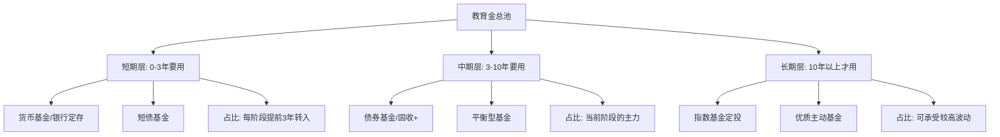

## 七、子女教育的财务规划

30-40岁是大多数家庭迎来第一个孩子的阶段，也是教育支出从"理论概念"变为"真金白银"的转折点。子女教育费用是家庭生命周期中仅次于住房的第二大刚性支出，而且几乎没有"延迟消费"的余地——孩子6岁必须上小学，18岁必须面对高考或留学选择。本节将从费用全景、资金规划、投资策略、教育保险、政策红利五个维度，构建一套完整的子女教育财务规划体系。

***

### 1. 教育费用全景：从出生到独立需要多少钱

#### 1.1 各阶段教育费用明细

很多家长对教育支出的认知停留在学费层面，实际上真正的教育总成本远比学费高得多。以下数据基于2024-2026年中国一二线城市中产家庭的实际支出统计：

| 阶段 | 年龄 | 公立路径（年均） | 私立/国际路径（年均） | 隐性成本说明 |
|------|------|-----------------|---------------------|-------------|
| 孕期-0岁 | 0-1 | 2-3万元 | 5-8万元 | 产检、月嫂、早教启蒙 |
| 早教期 | 1-3 | 3-5万元 | 8-15万元 | 早教班、绘本玩具、看护费 |
| 幼儿园 | 3-6 | 3-8万元 | 10-25万元 | 兴趣班、才艺培训占比大 |
| 小学 | 6-12 | 3-8万元 | 15-30万元 | 课外辅导、研学旅行、电子产品 |
| 初中 | 12-15 | 4-10万元 | 15-35万元 | 升学冲刺、竞赛培训 |
| 高中 | 15-18 | 3-8万元 | 20-40万元 | 高考/留学备考分化 |
| 本科（国内） | 18-22 | 3-8万元 | — | 学费+生活费+社交开支 |
| 本科（留学） | 18-22 | 25-60万元 | — | 美英最贵，日韩东南亚较便宜 |
| 硕士（留学） | 22-24 | 25-60万元 | — | 1-2年制，费用集中 |

**关键结论**：

- **公立路径总成本**：约80-200万元（从出生到本科毕业）
- **私立+留学路径总成本**：约250-600万元
- **如果两个孩子**：费用翻倍，但部分资源共享可节省15-20%

这些数字不包含通货膨胀因素。按年均3%的教育通胀率计算，一个今天出生的孩子读完大学时，实际费用会比上述数字高出40-60%。

#### 1.2 教育费用的三大特征

理解教育支出的本质特征，才能制定正确的储蓄策略：

**特征一：时间刚性强**。孩子到年龄就必须上学，没有"等一等再说"的选项。这意味着资金必须在特定时间点到位。

**特征二：递增趋势明显**。幼儿园到大学，单阶段费用持续攀升。尤其是选择留学路径时，费用会出现阶梯式跳跃。

**特征三：选择权溢价**。越早开始准备，未来的选择空间越大——有充足教育金的家庭可以在公立/私立/留学之间自由选择；没有准备的家庭只能被动接受唯一选项。

***

### 2. 教育金规划的核心方法论

#### 2.1 目标倒推法：从终局需求反算每月投入

教育金规划的第一步不是选择产品，而是计算"需要多少钱"和"现在开始够不够"。

**计算公式**：

```text
每月定投金额 = 目标终值 ÷ 复利终值系数 ÷ 已用月数

其中：
目标终值 = 各阶段预估费用之和（含通胀）
复利终值系数 = ((1+r)^n - 1) / r
r = 月化预期收益率
n = 剩余定投月数
```

**实操案例**：

假设孩子刚出生（0岁），目标准备200万元教育金（含留学选项），预期年化收益率7%（月化约0.583%），定投期18年（216个月）：

```text
复利终值系数 = ((1+0.00583)^216 - 1) / 0.00583 ≈ 377.3
每月定投 = 2,000,000 ÷ 377.3 ≈ 5,299元
```

这意味着从孩子出生起每月定投约5300元，18年后可积累200万元。如果延迟到孩子5岁才开始，每月需要投入约7900元——晚5年，每月多付近50%。

#### 2.2 分阶段配置策略

教育金不是一个单一账户，而是需要根据"用钱时间"进行分层管理：



**具体配置建议**：

| 投资期限 | 权益类占比 | 固收类占比 | 具体工具 | 预期年化 |
|----------|-----------|-----------|---------|---------|
| 10年以上 | 70-80% | 20-30% | 沪深300ETF + 中证500ETF + 纯债基金 | 7-10% |
| 5-10年 | 40-60% | 40-60% | 平衡混合基金 + 二级债基 + 银行理财 | 5-7% |
| 3-5年 | 20-30% | 70-80% | 偏债混合基金 + 大额存单 + 国债 | 3-5% |
| 3年以内 | 0-10% | 90-100% | 货币基金 + 银行定存 + 国债逆回购 | 2-3% |

**关键原则**：距离用钱时间越近，波动性越低。孩子上大学前3年，教育金应该全部转为低波动资产，绝不冒险。

#### 2.3 目标日期基金思维

国内部分基金公司推出了"目标日期型教育金基金"（如"2035教育"、"2040教育"），其本质是自动下滑轨道——随着目标日期临近，权益比例自动降低。这类产品适合不愿意手动调仓的家长。

如果你选择手动管理，也可以参考"100-孩子年龄"法则：

```text
权益类配置比例 = max(10%, 100 - 孩子当前年龄)
```

例如孩子5岁时配置95%权益+5%固收，孩子15岁时配置85%权益+15%固收。这个法则比较激进，更稳健的做法是用"80-孩子年龄"。

***

### 3. 教育金的六大工具对比

#### 3.1 工具总览

| 工具 | 流动性 | 收益预期 | 风险等级 | 适合场景 | 起投门槛 |
|------|--------|---------|---------|---------|---------|
| 银行定存/大额存单 | 低 | 2-3% | 极低 | 短期确定性需求 | 1元起/20万起 |
| 货币基金 | 高 | 1.5-2.5% | 极低 | 零钱归集、临时存放 | 1元 |
| 国债 | 低 | 2.5-3.5% | 极低 | 中长期保底 | 100元 |
| 教育金保险 | 极低 | 2.5-3.5% | 极低 | 强制储蓄+保障 | 年缴1000+ |
| 基金定投（指数） | 高 | 6-10% | 中高 | 长期增值核心工具 | 10-100元 |
| 银行理财产品 | 中 | 3-5% | 低中 | 中短期稳健增值 | 1元/1万 |

#### 3.2 教育金保险深度解析

教育金保险是很多家庭的第一反应，但需要理性看待：

**适合买的场景**：
- 自律性差，无法坚持长期定投
- 家庭收入稳定但结余不多，需要强制储蓄
- 希望同时获得保障功能（投保人身故/全残豁免保费）
- 已经有充足的投资配置，教育金保险作为"安全垫"

**不适合买的场景**：
- 家庭还在积累应急基金阶段
- 对资金流动性有较高要求
- 有较强的投资能力，能通过基金获取更高收益
- 只看了"预期收益"就下单，没看清"保证收益"

**避坑要点**：
1. **区分"保证收益"和"预期收益"**。很多产品的演示利率分低/中/高三档，只有低档是保证的，中高档只是假设。
2. **计算IRR（内部收益率）**。把教育金保险的所有现金流列出来，用Excel的IRR函数计算真实年化收益。大部分产品IRR在2-3%之间，低于同期国债。
3. **流动性代价极高**。前5年退保几乎必亏，10年内退保收益率远低于银行定存。这笔钱一旦投入，就是锁定到孩子上大学。
4. **保障功能可以单独买**。投保人豁免功能本质是定期寿险，单独购买每年只需几百元，捆绑在教育金保险里反而溢价严重。

**结论**：教育金保险的核心价值是"强制储蓄"和"心理安全感"，而非高收益。如果你能坚持基金定投，长期回报远高于保险产品。建议配置比例不超过教育金总目标的30%。

#### 3.3 529教育储蓄的中国替代方案

美国有529教育储蓄计划（税优账户），中国没有完全等价物，但可以通过以下组合获得类似效果：

1. **个人养老金账户**（年缴上限12000元，投资收益暂不征税）
2. **国债利息免税**
3. **基金持有超1年免征资本利得税**（目前中国公募基金个人投资者暂免）
4. **教育专项附加扣除**（每个子女每月2000元标准扣除，2023年起执行）

将这些政策叠加使用，可以在合法框架内最大化教育金的税后收益。

***

### 4. 三条教育金规划路线图

不同家庭条件适合不同的规划路线。以下是三条典型路线，包含完整的资金安排：

#### 4.1 路线A：公立为主+国内升学（经济型）

**总目标**：约80-120万元
**适用家庭**：双职工中产家庭，月结余8000-15000元

```text
时间轴规划：

出生-3岁：  每月定投2000元（指数基金为主）
            积累目标：8万元
            同时建立兴趣启蒙预算：每月500元

3-6岁：    定投调整为3000元/月（含幼儿教育开支）
            积累目标：20万元
            兴趣班预算：每月1000-2000元（选2个坚持）

6-12岁：   定投继续3000元/月，开始部分转入固收
            积累目标：45万元
            课外辅导预算：每月1500-3000元

12-15岁：  定投降至2000元/月（固收为主）
            积累目标：60万元
            升学冲刺预算：每月2000-4000元

15-18岁：  停止定投，全面转为固收/货基
            积累目标：80万元
            高考备考预算：每月2000-3000元

18-22岁：  每年提取3-8万元（学费+生活费）
            本科4年总提取：20-35万元
```

#### 4.2 路线B：私立学校+留学（精英型）

**总目标**：约250-400万元
**适用家庭**：高收入家庭，月结余20000元以上

```text
时间轴规划：

出生-3岁：  每月定投8000元（70%指数+30%主动基金）
            积累目标：32万元
            早教/私立幼儿园学费：每年8-15万

3-12岁：   定投调整为10000元/月
            积累目标：130万元
            私立学校学费+课外：每年12-25万

12-15岁：  定投继续8000元/月，开始分批转固收
            积累目标：200万元
            竇赛/标化培训：每年5-10万

15-18岁：  停止权益定投，全面固收化
            积累目标：260万元
            留学申请+托福/SAT：每年8-15万

18-22岁：  每年提取40-60万元（留学学费+生活费）
            4年总提取：160-240万元
            剩余资金可作为研究生阶段补充
```

#### 4.3 路线C：双轨准备（灵活型）

**总目标**：约150-200万元
**适用家庭**：希望保留选择权的家庭

核心思路是按"国内升学"的基础线准备，但通过投资增值争取达到"留学可选"的水平：

```text
基础线（必保）：
  - 每月定投4000-6000元
  - 18年积累目标：120-150万元
  - 覆盖国内本科+研究生全部费用

弹性线（看投资结果）：
  - 如果投资收益超预期，累计达到180-200万元
  - 可以在孩子15-16岁时做留学决策
  - 如果收益不及预期，走国内升学路径同样充足

决策节点：
  - 孩子12岁时评估：累计达到100万以上 → 留学路径可期
  - 孩子15岁时评估：累计达到150万以上 → 启动留学准备
  - 孩子16岁时最终决策：根据资金、孩子意愿、留学形势综合判断
```

这种"双轨策略"的优势在于：不把自己逼到必须留学的境地，也不因为没有准备而丧失选择权。教育金规划的本质不是"确定要花多少钱"，而是"保留最大的选择空间"。

***

### 5. 与教育金关联的财务安排

教育金不是一个孤立的账户，它和家庭其他财务安排深度关联。

#### 5.1 保险规划

家长本人是教育金最重要的"资产"。如果家长发生意外，教育金积累中断，孩子的教育路径可能被迫改变。

**必须配置的保险**：

| 险种 | 作用 | 保额建议 | 年缴保费参考 |
|------|------|---------|-------------|
| 定期寿险 | 家长身故时保障教育金来源 | 年收入×10，至少200万 | 30岁男性200万保额约2000-3000元/年 |
| 重疾险 | 大病期间收入中断的补偿 | 50-100万 | 30岁男性50万保额约5000-8000元/年 |
| 医疗险 | 大额医疗费用不侵蚀教育金 | 200-400万 | 百万医疗险约300-800元/年 |
| 意外险 | 意外伤残的收入补偿 | 100-200万 | 约200-500元/年 |

**核心原则**：先保大人再保小孩。大人的保障就是孩子最大的教育金保险。

#### 5.2 与房贷的协调

很多家庭同时承担房贷和教育金储蓄，现金流紧张是常态。协调原则：

1. **房贷月供 + 教育金定投 ≤ 家庭月收入的50%**。超过这个比例，生活质量会严重下降，也不可持续。
2. **如果有公积金贷款**（利率3.1%左右），优先保教育金定投。因为教育金的长期投资收益（7%+）高于房贷利率，提前还贷不如投资教育金。
3. **如果是商贷**（利率4%以上），需要根据利率水平动态调整。利率高于5%时，提前还贷和教育金定投各半；利率低于4%时，优先教育金定投。

#### 5.3 与养老规划的冲突

30-40岁的家庭面临一个经典矛盾：教育金和养老金都在争夺有限的储蓄额度。

**解决策略**：

```text
月收入分配优先级：

第一层：刚性支出（房贷+基本生活）     —— 50-60%
第二层：安全保障（保险+应急基金）     —— 10-15%
第三层：教育金储蓄                    —— 15-20%
第四层：养老金储蓄                    —— 10-15%
第五层：提升生活品质                  —— 剩余部分

关键认知：
- 教育金有明确的截止时间（孩子22岁），养老金没有
- 教育金缺口可以靠助学贷款弥补，养老金缺口无法借贷
- 因此：养老金优先级不应低于教育金
```

很多家长把所有储蓄都投入教育金，忽略养老金。等到孩子大学毕业，自己已经50多岁，养老金储备严重不足。这是"为孩子牺牲一切"的典型财务错误。

正确的做法是：教育金和养老金同步积累，两者的投资策略可以共享同一个投资组合，但心理账户要分开记账，确保两笔钱都不会被挪用。

***

### 6. 常见误区与纠正

#### 误区一：只存银行最安全

**错误认知**：教育金不能亏，所以全放银行定存。

**问题**：银行定存利率2-3%，教育通胀率3-5%，实际购买力在缩水。今天存的100万，18年后实际购买力可能只有60-70万。

**纠正**：根据用钱时间分层配置。10年以上的资金一定要配置权益类资产，用时间换取更高的收益。波动不等于风险，本金永久性缩水（跑不赢通胀）才是真正的风险。

#### 误区二：盲目追求留学

**错误认知**：留学=好前途，砸锅卖铁也要送出去。

**问题**：留学的投资回报率正在分化。名校热门专业的回报率依然很高，但普通大学的留学生回国后薪资并不突出，动辄200-300万的投入可能需要10年以上才能回本。

**纠正**：留学是手段不是目的。先评估孩子的学术能力、适应能力、职业方向，再决定是否留学。如果留学，优先考虑性价比高的目的地（如新加坡、德国、日本公立大学），而非盲目追求美英名校。

#### 误区三：什么都报班就是重视教育

**错误认知**：给孩子报10个兴趣班，教育支出越大越好。

**问题**：教育投入的边际效益递减。3个精心选择的长期坚持的兴趣班，效果远好于10个走马观花的短期体验。而且过度报班消耗现金流，压缩了真正重要的长期教育投资（如教育金储蓄）。

**纠正**：教育支出要"集中火力"。根据孩子的天赋和兴趣，选择1-3个方向长期投入。省下来的钱放入教育金定投账户，未来无论是留学还是深造都更有底气。

#### 误区四：等有钱了再开始

**错误认知**：现在收入低，等升职加薪了再存教育金。

**问题**：复利需要时间。同样的200万目标，从出生开始每月需5300元，从5岁开始需要7900元，从10岁开始需要13400元。每晚一年，每月负担增加10-15%。

**纠正**：金额不重要，开始最重要。即使每月只能存1000元，从孩子出生就开始，18年后也有21.6万元本金加上可观的复利收益。总比10年后再开始每月存5000元要好。

#### 误区五：忽视教育金的"专款专用"

**错误认知**：教育金和家庭储蓄混在一起，需要用的时候再取。

**问题**：混在一起的钱一定会被挪用——装修、买车、应急、旅游……"临时借用"的教育金很少能归还。

**纠正**：开一个独立账户（甚至独立银行），专门用于教育金储蓄。设定自动转账，发工资当天就划走。这个账户的钱视同"不存在"，除非教育相关支出，否则绝不触碰。

***

### 7. 进阶策略

#### 7.1 利用政策红利降低教育成本

**税收优惠**：

- 子女教育专项附加扣除：每个子女每月2000元（年24000元），夫妻双方可约定分摊或一方全额扣除。按最高边际税率45%计算，每年可节税10800元。
- 继续教育扣除：家长自己在职读研/考证，每月400元或取得证书当年3600元。

**住房公积金**：

- 部分城市允许提取公积金支付子女学费（需满足条件）
- 公积金贷款利率低于商贷，节省的利息差可以转投教育金

**教育补贴**：

- 各地有不同的教育补贴政策，如困难家庭助学金、优秀学生奖学金
- 部分企业有子女教育福利，如入学补贴、学费报销

#### 7.2 教育金与海外资产配置

如果家庭有留学计划，且留学目的地明确（如美国、英国），可以考虑：

1. **提前换汇定投**：在汇率低位时分批购入外汇，存入外币理财或购买外币基金。避免留学时集中换汇的汇率风险。
2. **QDII基金**：通过国内基金公司投资海外市场，如标普500指数基金、纳斯达克100基金。既享受海外市场的增长，又不需要外汇额度。
3. **港股/美股账户**：如果有港美股投资经验，可以直接配置海外教育相关的投资组合。

#### 7.3 教育金的"超额准备"处理

如果教育金在孩子上大学前已经超过目标金额，多余部分的处理策略：

1. **转化为研究生教育基金**：如果孩子有深造意愿，继续保留。
2. **转化为创业/婚房基金**：帮助孩子成年后的起步。
3. **回流到养老金池**：补充家长的养老金储备。
4. **捐赠/公益**：以孩子的名义捐赠，培养财商和公益意识。

***

### 8. 教育金规划检查清单

以下检查清单建议每年至少回顾一次（建议在孩子生日当月执行）：

```markdown
## 年度教育金体检

### 基础数据更新
- [ ] 更新孩子当前教育阶段和下一阶段时间节点
- [ ] 更新各阶段预估费用（参考最新物价和政策）
- [ ] 计算距离各教育节点的剩余时间

### 资金盘点
- [ ] 统计教育金账户当前总余额
- [ ] 计算过去一年实际收益率
- [ ] 对比目标进度（是否落后于计划曲线）
- [ ] 核查是否有资金被挪用

### 配置检查
- [ ] 权益/固收比例是否匹配孩子年龄
- [ ] 是否需要将近期要用的资金转入低风险资产
- [ ] 基金定投是否正常执行，是否需要调整金额
- [ ] 保险保障是否充足，是否需要加保

### 策略调整
- [ ] 评估是否需要调整教育路径（公立/私立/留学）
- [ ] 评估当前储蓄率是否可持续
- [ ] 评估教育金目标是否需要修正
- [ ] 制定下一年度的教育金储蓄计划

### 行动项
- [ ] 列出需要执行的具体调整动作
- [ ] 设定提醒日期确保执行
```

***

### 本节小结

子女教育财务规划的核心逻辑可以总结为三句话：

1. **尽早开始**——时间是复利最好的朋友，每晚一年开始，成本增加10-15%。
2. **分层配置**——根据用钱时间选择风险等级，远期博收益，近期保本金。
3. **专款专用**——独立账户、自动转账、年度体检，确保教育金不被挪用。

教育金规划不是一劳永逸的事，它需要随着家庭收入变化、教育政策调整、孩子成长情况持续优化。但只要遵循"时间换空间"的核心原则，任何收入水平的家庭都能为孩子准备好充足的教育基金。
