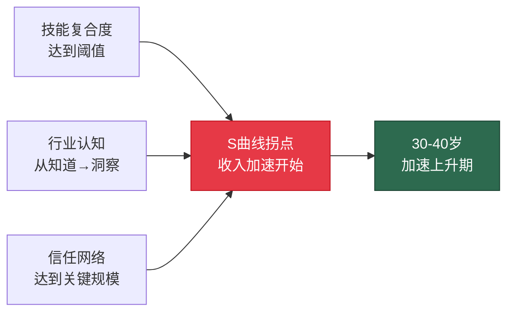
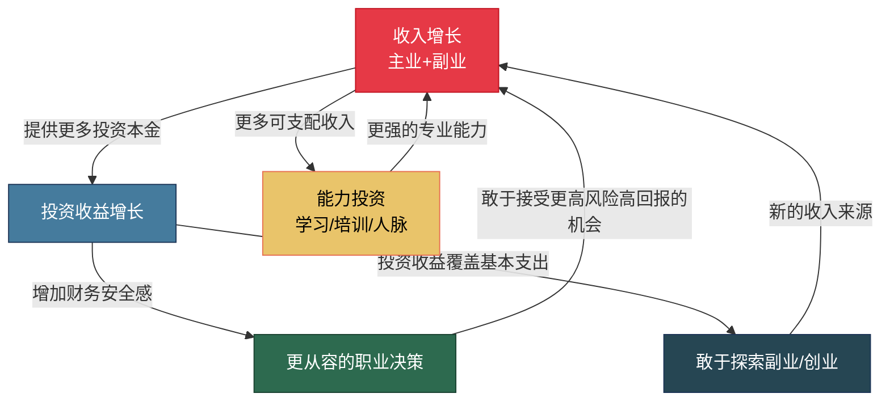
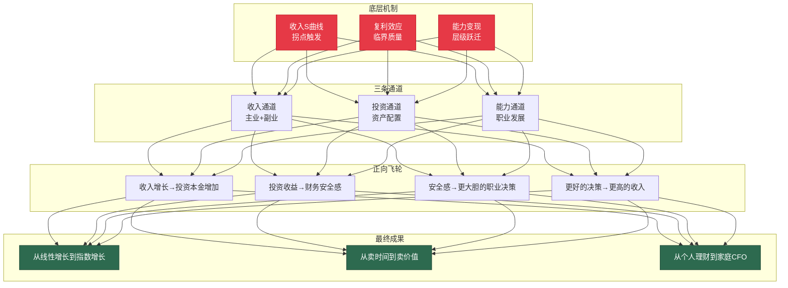

## 一、财富加速的底层逻辑

> **核心命题**：30-40岁的财富加速不是"赚更多钱"这么简单，而是三套底层机制在同一时间窗口叠加发力——收入S曲线进入陡峭段、复利效应突破临界质量、能力变现层级发生跃迁。理解这三套机制，你才能从"凭感觉赚钱"升级为"按规律加速"。

### 1.1 收入S曲线：为什么30-40岁是拐点

#### 1.1.1 S曲线的基本模型

大多数人的收入增长并非线性，而是遵循一条S形曲线（Sigmoid Curve）。这条曲线可以分为三个阶段：

| 阶段 | 对应年龄段 | 收入增速特征 | 驱动因素 |
|:---:|:---:|:---:|:---|
| **缓慢启动期** | 22-28岁 | 年增速5-10%，绝对值低 | 技能积累、行业认知、人脉初始建设 |
| **加速上升期** | 28-38岁 | 年增速10-25%，绝对值快速攀升 | 专业壁垒形成、管理/专家角色跃迁、复合技能叠加 |
| **增长平台期** | 38-50岁 | 年增速回落至3-8%，基数已高 | 增量空间缩小、精力边际递减、行业天花板 |

**关键数据**：根据智联招聘2024年薪酬报告，中国职场人薪资增速的峰值出现在30-35岁区间，平均年增速为12.8%，显著高于25-30岁的8.2%和35-40岁的7.1%。美国劳工统计局（BLS）的数据呈现类似规律：35-44岁年龄段的中位收入是25-44岁的1.5倍。

#### 1.1.2 拐点在哪里：识别你的加速起点

S曲线的拐点不是精确的年龄，而是由三个变量共同决定的"事件触发点"：

**变量一：技能复合度达到阈值**

单一技能的增长是线性的——你把Excel从80分练到95分，收入增长有限。但当两到三项核心技能形成"技能组合"时，会产生乘法效应。例如：

- 单独会写代码 → 初级程序员（年薪20万）
- 代码 + 业务理解 → 高级工程师（年薪40万）
- 代码 + 业务理解 + 团队管理 → 技术总监（年薪80万+股权）
- 代码 + 业务理解 + 团队管理 + 行业人脉 → CTO或创业（年薪150万+）

每一个"+"不是简单的加法，而是打开了一个新的收入层级。30岁左右，大多数人已经积累了足够多的"+"，技能复合度开始突破临界点。

**变量二：行业认知从"知道"变为"洞察"**

"知道"是信息层面——你知道行业有哪些公司、哪些产品、哪些技术路线。"洞察"是判断层面——你能预判行业趋势、识别机会窗口、评估风险概率。这种洞察通常需要5-8年的行业浸泡才能形成，对应恰好是28-35岁。

**变量三：信任网络达到关键规模**

职业发展的本质是"被信任的范围不断扩大"。20多岁，信任你的只有直属上级和几个同事；30多岁，信任你的应该扩展到跨部门领导、行业同行、客户决策者、合作伙伴。当信任网络达到一定规模，机会会主动找上门——猎头电话、合伙邀请、项目合作。这就是为什么很多人在30-35岁之间经历了一次"突然的职业起飞"，其实不是突然，而是信任网络的量变终于引发了质变。



#### 1.1.3 如何主动触发拐点

如果你已经30岁但感觉收入增长仍然缓慢，说明拐点尚未被触发。以下是加速触发的三条路径：

**路径一：主动叠加"第二技能"**

不要在同一维度上死磕（把同一技能从90分提到95分），而是在相邻维度上补短板。最有效的第二技能组合：

| 第一技能 | 最佳第二技能 | 乘法效果 |
|:---|:---|:---|
| 技术开发 | 产品思维 | 从"实现者"升级为"架构师" |
| 市场营销 | 数据分析 | 从"执行者"升级为"增长负责人" |
| 财务会计 | 业务战略 | 从"记账者"升级为"CFO" |
| 销售 | 行业解决方案 | 从"推销员"升级为"顾问式销售" |
| 设计 | 用户研究 | 从"美工"升级为"产品设计师" |

**路径二：进入"高信息密度"环境**

行业洞察不是坐在工位上能获得的，你需要主动进入信息密度高的环境：行业峰会、头部公司、核心项目组、高端社群。这些环境能让你在一年内获得普通环境三年才能积累的行业认知。

**路径三：有意识地扩展信任网络**

每月至少认识2-3个行业内的"关键节点人物"（决策者、意见领袖、资源持有者）。不是泛泛之交，而是通过提供价值建立深度信任。具体方法：主动分享行业洞察、帮助对方解决具体问题、引荐有价值的资源。

### 1.2 复利效应：30-40岁的临界质量

#### 1.2.1 复利的数学本质

复利的公式是：

```text
FV = PV × (1 + r)^n
```

其中 FV 是终值，PV 是初始本金，r 是年化收益率，n 是年数。这个公式看起来简单，但它蕴含一个反直觉的结论：**前期的增长几乎全部来自本金，后期的增长几乎全部来自利息**。

以每月定投5000元、年化收益10%为例：

| 年数 | 累计投入 | 账户总值 | 利息收益 | 利息占比 |
|:---:|:---:|:---:|:---:|:---:|
| 第5年 | 30万 | 38.7万 | 8.7万 | 22.5% |
| 第10年 | 60万 | 103.3万 | 43.3万 | 41.9% |
| 第15年 | 90万 | 208.0万 | 118.0万 | 56.7% |
| 第20年 | 120万 | 382.8万 | 262.8万 | 68.6% |
| 第25年 | 150万 | 663.4万 | 513.4万 | 77.4% |

注意第10年到第15年的变化：仅仅5年时间，利息收益从43.3万跳到118.0万——增长了74.7万。而前5年到第10年，利息增长只有34.6万。这就是复利的"加速效应"：**时间越长，每一单位时间产生的收益越大**。

#### 1.2.2 为什么30-40岁是复利的"临界质量"期

复利要真正发力，需要达到"临界质量"——本金规模大到利息收入开始产生实质性影响。这个临界质量大约是多少？

**临界质量的计算**：

假设你希望利息收入能覆盖一个月的基本生活开支（假设1万元/月，即12万元/年），年化收益率8%，那么你需要的本金是：

```text
临界质量 = 年支出 / 年化收益率 = 120,000 / 0.08 = 150万元
```

也就是说，当你的投资本金达到150万元时，仅靠投资收益就能覆盖基本生活开支。这在财务规划中被称为"半财务自由"——你不再完全依赖工资收入。

30-40岁恰好是从"积累本金"跨越到"突破临界质量"的关键窗口：

- **30岁起点**：假设你从25岁开始工作，到30岁积累了约20-50万元可投资资产
- **加速积累**：30-40岁期间，收入进入S曲线陡峭段，储蓄能力大幅提升
- **突破临界**：到38-40岁，如果你保持30%以上的储蓄率和8%以上的年化收益，本金大概率能突破100-200万元


#### 1.2.3 复利的三个加速器

单纯等待复利是不够的，你需要主动使用三个加速器：

**加速器一：提高储蓄率（增加PV）**

储蓄率是复利的"燃料"。从30%提升到40%，看似只多了10个百分点，但在20年时间尺度上，差异是巨大的：

| 储蓄率 | 月投入（假设月入2万） | 20年后本金（年化8%） |
|:---:|:---:|:---:|
| 20% | 4,000元 | 235万 |
| 30% | 6,000元 | 352万 |
| 40% | 8,000元 | 470万 |
| 50% | 10,000元 | 587万 |

储蓄率从30%提升到40%，20年后多出118万——这比大多数人一辈子的增量收入还多。

**加速器二：提高投资收益率（提高r）**

收益率从8%提升到12%，20年后的终值差异：

| 年化收益率 | 月投6000元×20年终值 |
|:---:|:---:|
| 6% | 277万 |
| 8% | 352万 |
| 10% | 455万 |
| 12% | 595万 |

每提升2个百分点的年化收益，20年后终值增加约100万。但要注意：**收益率的提升是有代价的**——更高的收益意味着更高的风险和更大的波动。不要为了追求12%的收益而承担可能亏损50%的风险。

**加速器三：延长时间（延长n）**

这是最容易被忽视的加速器。早开始5年，终值差异惊人：

| 开始年龄 | 投入年限 | 月投6000元×8%终值 |
|:---:|:---:|:---:|
| 25岁 | 30年 | 897万 |
| 30岁 | 25年 | 587万 |
| 35岁 | 20年 | 352万 |

25岁开始比35岁开始，同样每月6000元，终值多出545万。这就是为什么"现在就开始"比"等有钱了再开始"重要得多。

#### 1.2.4 复利的陷阱：负复利同样有效

复利是一把双刃剑。正向复利让财富指数增长，负向复利（负债利息）同样指数增长。信用卡分期的真实年化利率约为13-18%，网贷平台的真实年化利率可达24-36%。

**负债复利的毁灭性**：

假设你有5万元信用卡分期，年化利率15%，只还最低还款额（月供约1500元）：

- 第1年：累计还款1.8万，剩余本金约4.2万
- 第3年：累计还款5.4万，剩余本金约2.8万
- 第5年：累计还款9.0万，剩余本金约1.5万
- 还清时间：约4年3个月，累计还款约7.7万

5万元的负债，最终付出7.7万元——多付了2.7万元的利息。如果这5万元用于投资（年化8%），4年3个月后会变成6.9万元。一正一负，差距是9.6万元。

**核心原则：在启动正向复利之前，必须先消灭负向复利。** 年化利率超过10%的负债，优先偿还的优先级高于投资。

### 1.3 资产与负债：重新定义你的"财富"

#### 1.3.1 现金流视角的资产定义

罗伯特·清崎在《富爸爸穷爸爸》中给出了一个简单但深刻的定义：

> **资产是把钱放进你口袋的东西，负债是把钱从你口袋拿走的东西。**

这个定义与会计学不同。会计学中，你的自住房产是"资产"；但在现金流视角下，自住房产是"负债"——它每月产生房贷、物业费、维修费等现金流出，不产生任何现金流入。

用现金流视角重新审视30-40岁人群的常见"资产"：

| 项目 | 会计视角 | 现金流视角 | 真实性质 |
|:---|:---:|:---:|:---|
| 自住房产 | 资产 | 负债 | 消费品（提供居住价值，但消耗现金流） |
| 投资性房产（出租） | 资产 | 资产/负债 | 取决于租金是否覆盖房贷+维护成本 |
| 自用汽车 | 资产 | 负债 | 消费品（折旧+保险+油费+停车费） |
| 股票/基金 | 资产 | 资产 | 真正的资产（预期产生正收益） |
| 银行存款 | 资产 | 资产 | 真正的资产（但收益可能跑不赢通胀） |
| 学历证书 | 无形资产 | 条件性资产 | 只有在能转化为更高收入时才是资产 |
| 人脉关系 | 无形资产 | 条件性资产 | 只有在能转化为商业机会时才是资产 |

#### 1.3.2 "伪资产"辨析：你认为的资产可能是负债

30-40岁人群最容易犯的错误，是把"伪资产"当成真正的资产来积累：

**伪资产一：过度装修的自住房**

花30万装修一套自住房，不会增加任何现金流。从投资回报率看，这30万的回报是0%。如果这30万投入年化8%的投资组合，10年后会变成64.7万。过度装修的"机会成本"是34.7万。

当然，居住品质有其主观价值。关键是**区分"消费决策"和"投资决策"**——装修是消费，不要用"提升房产价值"来自我欺骗。

**伪资产二：超过实际需求的汽车**

一辆30万的汽车，5年持有成本（折旧+保险+油费+保养+停车）约为45-50万。如果用一辆15万的车替代，5年持有成本约为22-25万。差额25万用于投资（年化8%，5年），终值为36.7万。

**伪资产三：不能变现的社交**

频繁的应酬、酒局、无效社交，消耗了大量时间和金钱，但很少转化为真正的商业机会。30-40岁的时间是最宝贵的资源——每小时的机会成本可能是200-500元（按你的时薪计算）。把时间花在不能产生价值的社交上，本质上是在消耗资产。

**伪资产四：低效的"自我投资"**

不是所有的"学习"和"自我提升"都是好的投资。参加大量低质量的培训课程、购买大量不读的书籍、考取大量无用的证书——这些都是伪资产。真正的自我投资应该有明确的**投资回报预期**：这个技能/证书/知识，能在多长时间内，以多大比例提升我的收入？

#### 1.3.3 30-40岁的资产构建策略

理解了资产和负债的区别后，30-40岁的核心策略是：**减少真负债和伪资产，增加真资产**。

**资产构建的优先级排序**：

```text
第一优先：消灭高息负债（信用卡、网贷、消费贷）
    ↓
第二优先：建立应急基金（3-6个月生活费）
    ↓
第三优先：购买必要保险（重疾、医疗、寿险、意外）
    ↓
第四优先：构建投资组合（指数基金、优质股票、债券）
    ↓
第五优先：发展能产生现金流的副业/资产
    ↓
第六优先：优化消费结构（减少伪资产）
```

这个排序的底层逻辑是：**先堵住漏水口，再加大注水量**。很多人犯的错误是跳过前三步，直接进入第四步——把大量资金投入股市，但没有应急基金和保险。一旦遇到突发风险（失业、疾病），他们不得不在最差的时机卖出投资，反而亏损。

### 1.4 三条加速通道的叠加效应

30-40岁财富加速的核心秘密，不是某一条通道特别强，而是三条通道**同时发力**产生的叠加效应。

#### 1.4.1 三条通道的定义

| 通道 | 定义 | 30-40岁的典型表现 |
|:---:|:---|:---|
| **收入通道** | 主业+副业的收入增长 | 从月薪1.5万到月薪3-5万 |
| **投资通道** | 资产配置产生的收益 | 从月投2000到月投1-2万，年化8-12% |
| **能力通道** | 职业角色跃迁带来的价值提升 | 从执行者到管理者/专家/创业者 |

#### 1.4.2 叠加效应的数学模型

假设你在30岁时的月收入为1.5万元，储蓄率30%，年化投资收益8%：

**单一通道（仅收入增长）**：
- 收入年增10%，10年后月收入约3.9万元
- 储蓄率不变（30%），月储蓄1.17万元
- 累计投资终值（10年定投递增）：约210万元

**三通道叠加**：
- 收入年增10%，10年后月收入约3.9万元
- 储蓄率从30%逐步提升到40%（收入增长带来的边际储蓄率提升）
- 投资收益率从8%提升到10%（投资能力增长+更大资金量的配置灵活性）
- 副业从第3年开始产生收入，年增30%
- 累计财富终值：约380-420万元

叠加效应使得最终财富几乎翻倍。这就是为什么30-40岁的核心策略不是"专注于赚钱"或"专注于投资"，而是**同时推动三条通道**。

#### 1.4.3 正向飞轮：三条通道如何相互加速

三条通道不是独立运转的，它们会形成正向飞轮：



**飞轮的启动需要初始推力**。这个推力就是30-34岁的核心任务：用主业收入的快速增长提供第一桶金，用第一桶金启动投资，用投资收益和财务安全感支撑更勇敢的职业决策。一旦飞轮转起来，35-40岁的财富增速会远超你的预期。

### 1.5 能力变现模型：从卖时间到卖价值

#### 1.5.1 五个变现层级

30-40岁的职业发展，本质上是沿着"能力变现层级"不断攀升的过程：

| 层级 | 名称 | 收入公式 | 核心能力 | 年收入量级 | 典型角色 |
|:---:|:---:|:---|:---|:---:|:---|
| L1 | 执行层 | 收入 = 时薪 × 工时 | 专业技能 | 15-40万 | 高级工程师、资深设计师 |
| L2 | 管理层 | 收入 = 团队产出 × 分成比例 | 领导力+业务理解 | 40-100万 | 部门经理、项目总监 |
| L3 | 专家层 | 收入 = 判断力 × 杠杆倍数 | 行业洞察+方法论 | 60-200万 | 行业顾问、技术专家 |
| L4 | 决策层 | 收入 = 资源整合 × 风险溢价 | 战略思维+人脉网络 | 100万-无上限 | VP、合伙人、董事 |
| L5 | 创业层 | 收入 = 企业价值 × 股权比例 | 商业模式+团队管理 | 取决于企业规模 | 创始人、联合创始人 |

#### 1.5.2 层级跃迁的关键杠杆

**从L1到L2：学会"通过他人完成工作"**

L1的核心能力是"自己把事情做好"，L2的核心能力是"让团队把事情做好"。这个跃迁的关键不是"更努力"，而是学会授权、培养下属、建立流程。很多技术骨干升任管理者的失败，根本原因是仍然在用L1的方式做L2的工作——事必躬亲，不信任下属。

**从L2到L3：建立"可复用的方法论"**

L3的核心能力是"判断力"——知道什么该做、什么不该做、什么时候做。这种判断力来源于对行业的深度理解和对规律的提炼。你需要把零散的经验系统化为方法论，让别人可以学习和复制。

**从L3到L4：构建"资源网络"**

L4的核心能力是"资源整合"——你能调动多少资源来完成一件事。这需要广泛而深入的人脉网络，以及在行业中的信誉和影响力。

#### 1.5.3 30-40岁的跃迁时间表

| 年龄段 | 目标层级 | 核心任务 | 关键行动 |
|:---:|:---:|:---|:---|
| 30-33岁 | L1→L2 | 从执行者到管理者 | 主动承担管理职责、学习领导力、建立团队 |
| 33-36岁 | L2→L3 | 从管理者到专家 | 提炼方法论、建立行业影响力、输出专业内容 |
| 36-40岁 | L3→L4 | 从专家到决策者 | 扩展资源网络、参与战略决策、建立行业地位 |

不是每个人都要走到L4或L5。L3（专家层）已经能实现非常体面的收入（60-200万），而且工作压力和风险远低于L4和L5。关键是**找到最适合自己的层级**，然后在那个层级做到极致。

### 1.6 财富加速的宏观框架

将以上所有理论整合为一个统一的框架：



### 1.7 自我诊断：你在S曲线的哪个位置

完成以下评估，判断你当前在财富加速S曲线中的位置。每个维度1-5分（1=刚起步，5=已成熟）：

| 维度 | 评估问题 | 你的评分 |
|:---|:---|:---:|
| 技能复合度 | 你拥有几项可以独立变现的核心技能？ | ___/5 |
| 行业认知深度 | 你能否准确预判所在行业未来3年的趋势？ | ___/5 |
| 信任网络规模 | 有多少人会在有好机会时第一时间想到你？ | ___/5 |
| 投资本金规模 | 你的可投资资产是否已超过年收入的2倍？ | ___/5 |
| 收入管道数量 | 你有几条独立的收入来源？ | ___/5 |
| 被动收入占比 | 被动收入占总收入的比例是多少？ | ___/5 |

**评分解读**：

- **6-12分**：你还在S曲线的缓慢启动期，核心任务是积累技能和本金
- **13-18分**：你正在接近拐点，核心任务是叠加第二技能、扩展信任网络
- **19-24分**：你已进入加速期，核心任务是构建收入飞轮、突破复利临界质量
- **25-30分**：你处于加速期的黄金阶段，核心任务是最大化叠加效应、准备平台期转型

### 1.8 常见认知误区

**误区一："收入高 = 财务状况好"**

高收入不等于高净资产。如果你月入5万但月花4.5万，你的财务状况不如月入2万但月花1万的人。前者每月结余5000元，后者每月结余1万元——后者的财富积累速度是前者的2倍。

**衡量财务健康的核心指标不是收入，而是"财务净值增长率"**：

```text
财务净值增长率 = (月收入 - 月支出) / 总净资产 × 12
```

这个指标告诉你：你的财富每年以多大的百分比在增长。健康的财务净值增长率应该在15%以上。

**误区二："等有钱了再开始投资"**

这是最常见的认知陷阱。假设你从30岁开始每月定投3000元（年化8%），到60岁你有约450万元。如果你从35岁才开始，同样条件到60岁只有约295万元——晚了5年，少了155万元。

"等有钱了"永远不会来。投资的第一步不是"有钱"，而是"开始"。哪怕每月只投500元，也比"等有钱了再投"好一万倍。

**误区三："投资就是炒股"**

投资不等于炒股。投资的完整定义是：**将今天的资源分配到未来能产生更大回报的用途上**。这个定义下，以下都是"投资"：

- 学习一项新技能（投资自己的人力资本）
- 建立一个副业（投资自己的商业能力）
- 购买指数基金（投资金融市场）
- 参加行业峰会（投资自己的人脉网络）
- 购买必要的保险（投资风险对冲能力）

30-40岁的投资应该是**全方位的**——不仅投资金融资产，更投资自己的能力、人脉和健康。

**误区四："复利是富人的游戏"**

复利对小额资金同样有效，甚至更有效。每月定投1000元，年化8%，30年后终值是150万元。你不需要成为百万富翁才能享受复利——你只需要**开始**和**坚持**。

**误区五："风险越高收益越高"**

这句话只在"有效市场"中成立，而且只在长期维度上成立。短期内，高风险投资的收益分布是高度不确定的——你可能获得50%的收益，也可能亏损80%。

30-40岁的风险管理原则是：**在你能承受的损失范围内追求最大收益**。"能承受"的标准是：即使这笔投资全部亏损，你的生活质量不会受到实质性影响。

### 1.9 本节核心公式速查

| 公式名称 | 公式 | 用途 |
|:---|:---|:---|
| 复利终值 | FV = PV × (1 + r)^n | 计算投资终值 |
| 定投终值 | FV = PMT × [(1+r)^n - 1] / r | 计算定期定投终值 |
| 财务净值增长率 | (收入-支出)/净资产×12 | 衡量财富增长速度 |
| 财务跑道 | 应急基金 / 月支出 | 计算失业后的支撑月数 |
| 储蓄率 | (收入-支出) / 收入 × 100% | 衡量储蓄能力 |
| 被动收入覆盖率 | 被动收入 / 必要支出 × 100% | 衡量财务自由程度 |

### 1.10 本节行动清单

完成以下行动，将本节理论转化为实际成果：

1. **计算你的S曲线位置**：完成1.7节的自我诊断评估，记录你的总分和各项评分
2. **计算你的复利临界质量**：用"年支出 / 0.08"公式，计算你需要多少投资本金才能达到"半财务自由"
3. **盘点你的资产和负债**：用现金流视角（而非会计视角）重新分类你名下的所有项目
4. **识别你的伪资产**：列出你认为是资产但实际上是负债或消费的项目，计算它们的机会成本
5. **计算你的财务跑道**：用"应急基金 / 月支出"公式，计算你在失去收入后能支撑几个月
6. **制定5年财务目标**：基于本节的框架，设定5年后的目标净资产、目标储蓄率、目标被动收入覆盖率

> **记住**：理解底层逻辑是第一步，但真正的财富加速来自于行动。不要只是"知道了"，而要"做到了"。
