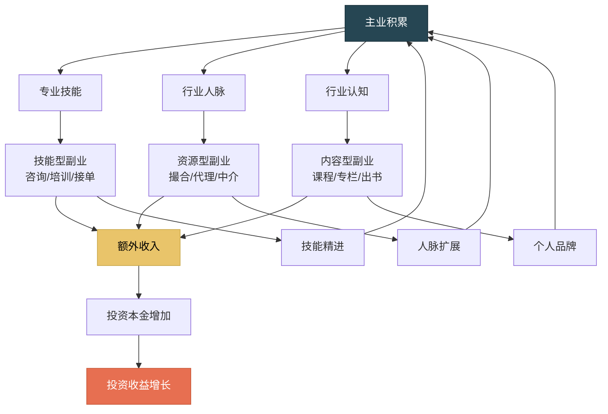
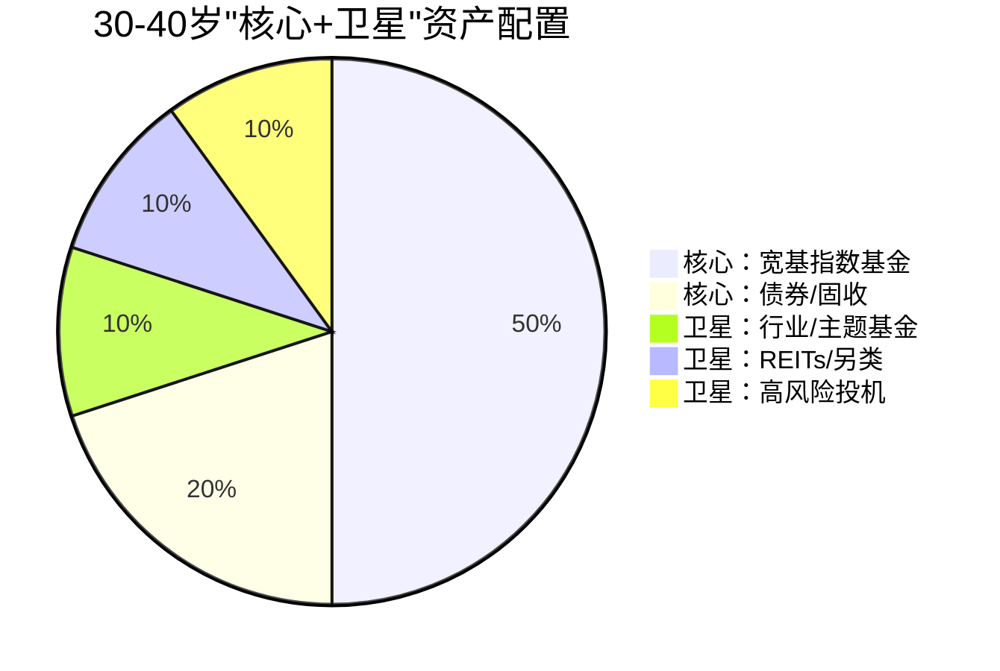
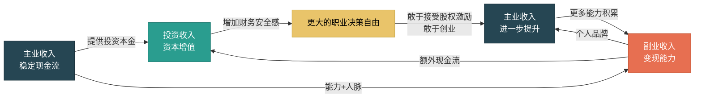

## 二、收入加速的三大引擎

30-40岁的收入增长，不应该是单一来源的线性爬升，而应该是三条收入管道同时运转、相互驱动的飞轮系统。我们将这三条管道称为"收入加速的三大引擎"——**主业收入、副业收入、投资收入**。

为什么是三个？因为单一收入来源存在两个致命缺陷：第一，它与你的时间直接绑定，一天只有24小时，收入天花板肉眼可见；第二，它存在单点故障风险，一旦主业出了问题（裁员、行业衰退、健康问题），整个家庭财务瞬间崩塌。三大引擎的本质是**风险分散+杠杆叠加**：主业提供稳定现金流和能力积累，副业将能力转化为额外收入和资产，投资让已积累的资金自动增值。三者相互喂养，形成正向循环。

### 2.1 引擎一：主业收入——从"打工者"到"合伙人"

#### 2.1.1 为什么主业仍然是第一引擎

很多人在30多岁时开始对主业产生倦怠感，觉得"打工没前途"，急于跳到副业或创业。这是一个危险的认知偏差。数据告诉我们一个残酷的事实：**对于绝大多数人来说，30-40岁的主业收入仍然是最大的收入来源，也是其他两个引擎的"燃料泵"**。

根据中国家庭金融调查（CHFS）的数据，中国城镇家庭的收入结构中，工资性收入占比长期维持在60-70%。即使在高收入群体（年收入50万以上）中，工资性收入仍然占到50%左右。副业和投资收入的增长需要时间积累，在起步阶段占比通常不超过20-30%。

主业的战略价值不仅在于现金流，更在于它提供的**三类隐性资产**：

| 隐性资产 | 具体内容 | 对其他引擎的杠杆作用 |
|:---:|------|------|
| **能力资产** | 专业技能、行业认知、方法论 | 直接转化为副业的竞争力 |
| **人脉资产** | 同事、客户、供应商、行业人脉 | 提供副业的第一批客户和合作伙伴 |
| **信用资产** | 职位头衔、公司背书、项目经历 | 降低副业的信任成本，提升投资时的判断力 |

如果你在35岁时因为急于搞副业而主业表现下滑，不仅主业收入停滞，还损失了这三类隐性资产的积累速度——这是很多人"越忙越穷"的根本原因。

#### 2.1.2 主业收入增长的四层跃迁模型

主业收入的增长不是简单的"每年加薪10%"，而是通过角色跃迁实现阶梯式突破。每一层跃迁的收入量级、核心能力和变现逻辑完全不同：

**第一层：专业执行层（L1）——卖时间**

这是大多数人在20-30岁达到的层级。你的收入取决于你个人的专业技能和工作时间。收入公式非常简单：

> 年收入 = 时薪 × 工作小时数

这一层的天花板非常明显。即使你是顶级程序员、顶级设计师，你一天最多工作12-14小时，一年最多工作300天，收入上限大约在40-60万（一线城市）。突破这个天花板的唯一方式是**改变收入公式中的变量**——不再是"我做多少小时赚多少钱"，而是"我创造多少价值赚多少钱"。

**突破L1的关键动作**：
- 在某一细分领域做到团队内前10%的专业水平
- 主动承担跨部门项目，展示你的全局视野
- 建立可复用的工作方法论（不是只有你能做，而是你总结出了别人也能学的方法）

**第二层：管理赋能层（L2）——卖团队产出**

从L1到L2的跃迁，本质是**从"自己干"到"让别人干"**。你的收入不再取决于你个人的工作时间，而是取决于你管理的团队的整体产出。一个管理10人团队的经理，其团队产出可能是他个人产出的5-8倍——即使管理本身消耗了他30%的时间，净产出仍然是原来的3.5-5.6倍。

收入公式变为：

> 年收入 = 团队人均产出 × 团队人数 × 你的分成比例

这一层的核心能力是**领导力和业务理解力**。很多优秀的专业人才在跃迁到L2时失败，原因不是能力不足，而是思维模式没有转换——他们仍然在用"做得最好"的标准要求自己，而不是用"让团队做得好"的标准要求自己。

**突破L2的关键动作**：
- 学会授权。你的工作成果 = 你的直接产出 + 你授权出去的工作成果
- 建立团队SOP（标准操作流程），让团队不依赖任何单一个人
- 向上管理：让你的上级看到你管理团队的能力，而不仅是你个人的执行力
- 学会用数据衡量团队产出，而非凭感觉评估

**第三层：专家决策层（L3）——卖判断力**

L3有两种路径可以到达：一条是从L2往上走（管理线），另一条是从L1深度专精（专家线）。管理线的L3是"高管"，专家线的L3是"行业专家/首席XX"。

这一层的核心是**判断力的价值**。一个错误的战略决策可能让公司损失数百万，一个正确的判断可能创造数千万的价值。因此，这一层的收入与你的判断质量直接挂钩。

> 年收入 = 你影响的决策金额 × 决策正确率 × 行业分成惯例

**突破L3的关键动作**：
- 建立行业认知框架：不是知道"发生了什么"，而是理解"为什么会发生"和"接下来会发生什么"
- 积累决策案例库：记录你做过的重要判断、当时的逻辑、最终的结果
- 扩大信息源：从行业内部扩展到跨行业、跨领域，建立"T型知识结构"
- 建立个人影响力：通过行业会议、专栏、咨询等方式输出你的判断

**第四层：资源整合层（L4）——卖资源整合能力**

L4是大多数30-40岁的人应该瞄准但不一定能达到的层级。这一层的核心不再是"做事"或"管人"，而是**"做局"**——整合不同方面的资源（资金、技术、人脉、渠道），创造单一资源无法实现的价值。

> 年收入 = 你整合的资源规模 × 资源配置效率 × 你的抽成比例

到达L4的人通常是：企业合伙人、业务线负责人、行业掮客、连续创业者。他们的收入模式已经完全脱离了"卖时间"，而是通过资源配置获取收益。

#### 2.1.3 主业收入加速的三个核心策略

**策略一：选择正确的赛道**

30-40岁主业收入的增速，50%取决于你的个人努力，50%取决于你所在的行业和公司。一个在夕阳行业做到极致的人，可能还不如一个在朝阳行业中等水平的人收入高。

选择赛道的三层评估框架：

| 评估维度 | 关键问题 | 数据来源 |
|------|------|------|
| **行业增速** | 这个行业未来5年的复合增长率是多少？ | 行业研究报告、上市公司财报 |
| **人才供需** | 这个行业的中高级人才是供不应求还是供过于求？ | 招聘平台数据、猎头报告 |
| **收入天花板** | 这个行业中做到前10%的人年收入是多少？ | 薪酬调研报告、同行交流 |

如果三个维度中有两个以上不理想，你应该认真考虑在35岁之前完成赛道切换。35岁之后切换的成本会急剧上升——你的行业人脉、专业积累、职级都会"清零重来"。

**策略二：构建"稀缺性"护城河**

你的收入上限取决于你的**可替代成本**。如果你明天离职，公司需要花多少钱、多长时间才能找到一个和你同等水平的人？这个数字就是你的"市场价"。

构建稀缺性的三条路径：

1. **深度专精**：在一个足够细分的领域做到前1%。比如"精通Flink实时计算引擎且有大规模集群运维经验的架构师"——全国可能不超过几百人。
2. **跨界组合**：将两个不常见但有价值的技能组合在一起。比如"既懂机器学习又懂金融风控的技术负责人"——单一技能的人很多，但组合技能的人很少。
3. **关系嵌入**：成为公司或行业中不可或缺的"连接节点"。比如你同时与技术团队、业务团队、客户都保持良好关系，你就是信息流的关键枢纽——换掉你的成本不仅是失去一个人，而是断裂一个网络。

**策略三：从"涨薪"到"涨权益"**

30-40岁主业收入最大的陷阱是**只追求涨薪，忽视权益积累**。工资是线性收入——你每个月工作，下个月才有收入；权益是指数资产——股权、期权、分红权、合伙份额，它们的价值可能在几年内翻几倍甚至几十倍。

在30-40岁阶段，你应该有意识地将一部分"现金收入预期"转化为"权益收入预期"：

- 在选择工作时，把股权/期权作为重要的评估因素（但要理解行权条件、稀释风险、流动性）
- 在公司内部争取业务线合伙人角色，获取利润分红权
- 如果是专业人士（律师、医生、咨询师），争取从"工薪制"转向"分成制"

一个简单的判断标准：如果你在一家公司的股权/期权未来5年可能价值200万，而你为了多拿10万年薪跳槽去了一个没有股权的公司，你大概率做了一个错误的决策。

#### 2.1.4 主业收入的常见陷阱

**陷阱一：舒适区陷阱**。在一家公司待了5-8年，工作得心应手，每年涨薪5-8%，感觉"还不错"。但如果你的市场价值每年增长15%，而你只拿到了5%的涨幅，你实际上每年在亏10%。很多人在30-40岁期间因为"舒适"而累积损失了数十万甚至上百万的潜在收入。

**应对**：每两年做一次"市场价值审计"——更新简历、参加面试、和猎头聊聊，了解自己的真实市场价。

**陷阱二：头衔幻觉**。升职加薪到管理层后，很多人的实际能力增长停滞了。他们忙于开会、汇报、处理人际关系，却没有积累真正有价值的可迁移能力。一旦公司变动（换领导、裁员、组织调整），他们发现自己在市场上并没有那么强的竞争力。

**应对**：每半年问自己一个问题——"如果明天失业，我凭现在的能力能在市场上拿到多少薪资？"如果答案让你不安，说明你的能力积累落后于你的头衔。

**陷阱三：行业锁定**。在一个行业待久了，你的所有技能、人脉、认知都围绕这个行业构建。如果这个行业进入下行周期，你面临的风险不是"换一家公司"，而是"换一个行业"——后者的难度和代价要大得多。

**应对**：有意识地积累"可迁移能力"——项目管理、数据分析、商业写作、公开演讲、团队管理——这些能力在任何行业都适用。

### 2.2 引擎二：副业收入——打造第二增长曲线

#### 2.2.1 副业的战略定位

副业不是"多打一份工"，不是"利用业余时间赚零花钱"。在收入飞轮体系中，副业的核心战略定位是**将你的能力资产转化为独立于主业的收入流**。

为什么30-40岁是启动副业的最佳时机？有三个结构性原因：

1. **能力积累到了变现临界点**。20多岁时你的专业能力还在积累阶段，能提供的价值有限。30多岁时你在某一领域已经有了5-10年的积累，具备了"教别人"和"帮别人"的水平。
2. **人脉网络已经形成**。副业的第一批客户通常来自主业积累的人脉——同事、客户、行业伙伴。30多岁的人脉网络已经足够支撑一个小型业务的启动。
3. **财务缓冲已经建立**。副业在起步阶段通常收入不稳定，有主业收入作为缓冲，你才能承受初期的"投入大于产出"阶段，而不至于因为经济压力而放弃。

#### 2.2.2 副业的三种类型与选择框架

副业从商业模式上可以分为三种类型，它们的收入特征、风险水平和适合人群完全不同：

**类型A：技能型副业——用时间换钱，但换的是更高的单价**

这是最常见、最容易启动的副业类型。你利用主业积累的专业技能，在业余时间为客户提供服务。

| 维度 | 说明 |
|------|------|
| **典型形式** | 技术顾问、兼职审计、设计接单、法律咨询、翻译、培训讲师 |
| **收入特征** | 稳定但线性，与投入时间正相关 |
| **启动成本** | 极低（几乎为零） |
| **收入天花板** | 有限——你一天最多工作4-6小时副业，时薪再高也有上限 |
| **核心风险** | 与主业存在时间和精力冲突；如果副业和主业是同一技能，两者同时出问题时没有缓冲 |
| **适合人群** | 主业技能市场价值高、时薪在300元以上的人 |

技能型副业的关键指标是**时薪**。如果你主业时薪是200元，副业时薪也应该在200元以上——否则你实际上在"降薪加班"。判断一个技能型副业是否值得做的公式：

> 副业价值 = (副业时薪 - 主业时薪) × 投入时间 + 能力积累价值 + 人脉拓展价值

如果副业时薪低于主业时薪，但后两项价值足够大（比如能帮你建立个人品牌、拓展新行业人脉），仍然值得做。

**类型B：内容型副业——一次创作，持续变现**

这是30-40岁最应该认真考虑的副业类型。你将专业知识和经验转化为可复制的内容产品——课程、专栏、电子书、付费社群、视频教程——然后以较低的边际成本反复销售。

| 维度 | 说明 |
|------|------|
| **典型形式** | 在线课程、付费专栏、电子书、付费社群、短视频/播客 |
| **收入特征** | 前期投入大、见效慢，但后期边际成本趋近于零（睡后收入） |
| **启动成本** | 中等（时间成本为主，可能需要设备和平台投入） |
| **收入天花板** | 高——不受时间限制，理论上可以无限增长 |
| **核心风险** | 前期6-12个月可能几乎没有收入；内容质量需要持续维护和更新 |
| **适合人群** | 有表达能力、愿意长期坚持、主业技能有市场需求的人 |

内容型副业的数学模型与技能型完全不同。假设你花3个月制作一门在线课程，总投入200小时。课程定价299元，第一年卖了200份，收入59,800元——折合时薪约300元，看起来和技能型副业差不多。但第二年你没有再投入时间，课程又卖了300份，收入89,700元——你的"时薪"变成了无穷大。第三年、第四年……只要内容不过时，收入就会持续流入。

这就是**内容资产的复利效应**：你的每一份内容都是一份"数字资产"，它在你睡觉时也在为你工作。与技能型副业"做一小时赚一小时"的模式相比，内容型副业的长期回报要高出一个数量级。

**类型C：投资型副业——用钱生钱，获取资本收益**

投资型副业的本质是**用资金参与商业活动，获取资本回报**。它不需要你投入时间（或只需要极少的决策时间），但需要你有本金和判断力。

| 维度 | 说明 |
|------|------|
| **典型形式** | 入股朋友的公司、天使投资、房产投资、域名投资、数字资产 |
| **收入特征** | 完全被动，但波动性大——可能赚很多，也可能亏很多 |
| **启动成本** | 高——需要闲置资金 |
| **收入天花板** | 理论上无上限，但与本金规模和投资能力正相关 |
| **核心风险** | 本金损失风险；流动性差（投入的钱可能几年取不出来）；信息不对称（你不如创业者了解业务） |
| **适合人群** | 已有充足的应急基金和稳健投资组合、有50万以上可承受全部亏损的闲置资金的人 |

投资型副业有一个关键认知：**它应该用"亏得起"的钱去做**。天使投资的行业平均成功率不到10%，这意味着你投10个项目，大概有9个会失败。如果你投入的钱是你不能承受损失的，你不仅会面临财务风险，还会承受巨大的心理压力——这种压力会影响你的判断力，导致更差的投资决策。

#### 2.2.3 副业选择的决策矩阵

面对具体的副业机会时，用以下五个维度进行评分（每项1-5分），总分20分以上的副业值得认真考虑：

| 评估维度 | 评估标准 | 评分(1-5) |
|------|------|:---:|
| **协同性** | 与主业的能力、人脉、资源是否有协同？能否反哺主业？ | |
| **可积累性** | 是否能产生可复用的资产（内容、品牌、系统）？还是做完就没了？ | |
| **边际成本** | 每增加一单位收入，需要增加多少投入？是否趋近于零？ | |
| **时间弹性** | 是否可以灵活安排时间？是否与主业时间冲突？ | |
| **退出成本** | 如果不想做了，能以多低的成本退出？沉没成本有多大？ | |

一个典型的对比：周末给人做技术咨询（技能型副业）vs 录制一套技术课程（内容型副业）。前者在协同性（5分）、时间弹性（3分）上得分高，但在可积累性（1分）、边际成本（1分，每小时都在消耗时间）上得分低。后者在可积累性（5分）、边际成本（5分）上得分高，但在时间弹性（2分，前期录制需要大块时间）上得分中等。综合来看，内容型副业的长期价值更高。

#### 2.2.4 副业启动的最小可行路径

很多人在副业上失败，不是因为选错了方向，而是因为**起步时做了太多准备工作，迟迟没有开始赚钱**。以下是经过验证的最小可行路径：

**第一步：验证需求（1-2周）**

不要先做产品，先验证有没有人愿意为你的技能/知识付费。最简单的验证方式：
- 在你的朋友圈/行业社群发布一条"我能提供XX服务/内容"的消息，看有没有人响应
- 在知乎、小红书等平台回答相关问题，看是否有人进一步咨询
- 找3-5个目标用户深度访谈，了解他们的真实痛点和付费意愿

**第二步：最小产品（2-4周）**

用最小的成本做出一个可以交付的产品：
- 技能型：一份服务说明+报价单，准备接第一单
- 内容型：一篇深度长文或一个30分钟的分享视频，发到平台上测试
- 投资型：先用极小的金额（比如1万元）尝试一个投资机会

**第三步：获取第一批付费用户（1-2个月）**

第一批用户不要追求规模，要追求**质量和反馈**：
- 以较低的价格甚至免费提供服务/内容，换取真实的使用反馈
- 收集用户评价和改进建议
- 用第一批用户的成功案例作为后续获客的"社会证明"

**第四步：迭代优化（持续）**

根据用户反馈持续改进产品/服务，逐步提高价格，扩大获客渠道。当副业月收入稳定达到主业月收入的20-30%时，说明这个副业方向是成立的，值得加大投入。

#### 2.2.5 副业与主业的协同模型

副业最大的风险不是"赚不到钱"，而是**与主业产生冲突**——时间冲突、精力冲突、利益冲突。一个好的副业应该是主业的"放大器"，而不是主业的"竞争者"。

副业与主业产生冲突的三个信号：
1. 主业绩效明显下降——如果主管开始对你的工作质量提出批评，立刻审视副业是否占用了太多精力
2. 身体发出警告——长期睡眠不足、频繁生病、注意力下降
3. 副业客户与主业公司存在利益竞争——这是法律和职业道德的红线，一旦触碰可能两头皆失

### 2.3 引擎三：投资收入——让钱为你工作

#### 2.3.1 投资收入的本质：时间的盟友

投资收入与主业、副业收入的根本区别在于：**它不与你的时间挂钩**。你的钱在你睡觉、休假、生病时仍然在工作。这就是所谓的"睡后收入"——但更准确地说，它是"资本的劳动报酬"。

投资收入的数学本质是**复利函数**。爱因斯坦（虽然这句话是否真的出自他有争议）说过："复利是世界第八大奇迹。"不管谁说的，数学不会骗人：

> 终值 = 本金 × (1 + 年化收益率)^年数

举一个具体的例子来说明复利的力量：假设你从30岁开始，每月定投5000元到一个年化收益8%的投资组合中：

| 年龄 | 累计投入本金 | 投资终值 | 其中收益部分 |
|:---:|:---:|:---:|:---:|
| 35岁 | 36万 | 44.2万 | 8.2万（23%） |
| 40岁 | 72万 | 109.5万 | 37.5万（34%） |
| 45岁 | 108万 | 206.8万 | 98.8万（48%） |
| 50岁 | 144万 | 349.2万 | 205.2万（59%） |
| 55岁 | 180万 | 559.8万 | 379.8万（68%） |
| 60岁 | 216万 | 871.6万 | 655.6万（75%） |

到60岁时，你的投资收益（655.6万）已经是你投入本金（216万）的3倍多——**钱生的钱远超你亲手存的钱**。而且越到后期，收益的占比越大，这就是复利的"加速度"效应。

但这里有一个关键前提：**你必须在30-40岁这个窗口期启动投资，而且不能中断**。如果你从40岁才开始同样的定投计划，到60岁时终值只有382.5万——少了489万，整整差了一倍多。晚10年开始投资，代价是终身财富减少56%。

#### 2.3.2 投资收入的三个收益层级

不同风险水平的投资工具产生不同层级的收益，理解这个分层结构是建立投资体系的基础：

**第一层：保值层（年化3-6%）——跑赢通胀**

这一层的目标不是赚钱，而是**确保你的钱不会被通胀悄悄吃掉**。中国的CPI长期在2-3%左右，但实际的生活成本上涨（尤其是教育、医疗、住房）通常高于官方CPI。如果你把钱放在活期存款（年化0.2%左右），10年后购买力会缩水20-30%。

| 工具 | 预期年化 | 流动性 | 风险 | 适用场景 |
|------|:---:|:---:|:---:|------|
| 货币基金（余额宝等） | 1.5-2.5% | 极高 | 极低 | 日常备用金、应急资金 |
| 银行大额存单 | 2.5-3.5% | 中 | 极低 | 1-3年内确定要用的钱 |
| 国债 | 2.5-3.5% | 中 | 极低 | 稳健型投资者的核心配置 |
| 纯债基金 | 3-6% | 高 | 低 | 2-5年的中期资金 |
| 银行理财产品（R2级） | 3-5% | 中 | 低 | 1-3年的中期资金 |

**第二层：增长层（年化8-15%）——实现财富增长**

这一层是30-40岁投资的**主战场**。通过承担适度的风险（短期可能亏损20-30%），获取长期8-15%的年化收益。对于大多数人来说，这一层的核心工具是**指数基金定投**。

| 工具 | 预期年化 | 最大回撤风险 | 适合持有期 | 说明 |
|------|:---:|:---:|:---:|------|
| 沪深300指数基金 | 8-12% | -30%~-50% | 5年以上 | 跟踪A股大盘，长期年化约10% |
| 中证500指数基金 | 10-15% | -40%~-60% | 5年以上 | 中小盘成长股，波动更大但长期收益更高 |
| 全球指数基金（MSCI全球） | 8-12% | -30%~-50% | 5年以上 | 分散单一国家风险 |
| REITs（不动产信托） | 6-10% | -20%~-40% | 3年以上 | 兼具股票增长性和房产租金收益 |
| 混合型基金（偏股） | 8-12% | -20%~-40% | 3年以上 | 基金经理主动管理，费率较高 |

为什么指数基金是增长层的首选？一个数据可以说明：在美国市场，过去20年里，**超过90%的主动管理基金跑输了标普500指数**。换句话说，你花高额管理费请的专业基金经理，大概率还不如你直接买指数基金。这个结论在中国市场同样成立——长期来看，大部分主动基金无法持续跑赢指数。

**第三层：跃迁层（年化15%以上）——实现财富跃迁**

这一层的预期收益很高，但风险同样巨大。你需要做好**全部本金亏损**的心理准备。

| 工具 | 预期年化 | 本金亏损概率 | 适合人群 | 说明 |
|------|:---:|:---:|------|------|
| 个股投资 | -100%~+∞ | 中高 | 有深入研究能力的人 | 个股可能退市，本金全部损失 |
| 天使/VC投资 | -100%~+1000% | 极高 | 有行业资源和判断力的人 | 90%以上的项目会失败 |
| 创业 | -100%~+∞ | 高 | 有商业能力和执行力的人 | 创业失败率超过90% |
| 期权/期货 | -100%~+∞ | 高 | 有专业交易能力的人 | 杠杆交易，可能亏光甚至穿仓 |

跃迁层的核心原则是**"小仓位、广撒网"**。将你可投资资金的10-20%分配到这一层，投10-20个项目，每个项目只占总资产的1-2%。只要其中1-2个成功，整体回报就能覆盖其他失败项目的损失。

#### 2.3.3 资产配置的科学方法

投资收益的90%来自资产配置，而不是选股或择时。这是金融学研究中被反复验证的结论——Brinson等人1986年发表在《Financial Analysts Journal》上的经典论文表明，投资组合收益差异的93.6%可以用资产配置来解释。

30-40岁的推荐配置框架——**"核心+卫星"配置法**：

**核心部分（70%）**：宽基指数基金+债券/固收，目标是获取市场平均收益。这部分不需要频繁操作，买入后长期持有，定期再平衡。

**卫星部分（30%）**：行业基金、REITs、个股、另类投资，目标是获取超额收益。这部分需要更多的研究和判断，也是你投资能力的"练兵场"。

**配置比例的动态调整**——生命周期法则：

你的权益类（股票类）资产比例应该随年龄递减。一个简单的公式是：

> 权益类比例 = 100 - 年龄

30岁时70%权益+30%固收，40岁时60%权益+40%固收。但这只是一个起点，实际配置还需要考虑：

- **收入稳定性**：如果副业收入已经稳定，可以适当提高权益比例（因为即使短期亏损，不影响生活）
- **负债水平**：如果房贷压力大，应该降低权益比例（因为你的现金流已经在为房贷服务，没有余力承受投资亏损）
- **风险承受能力**：这不仅是财务问题，更是心理问题。如果你在投资亏损20%时会失眠、焦虑、想割肉，说明你的权益比例超出了心理承受能力

**再平衡策略**：每半年或每年做一次再平衡——当某类资产的占比偏离目标比例超过5个百分点时，卖出超配的、买入欠配的，恢复到目标比例。这看似简单的操作，实际上是一个"自动的高抛低吸"机制：涨多了自然卖、跌多了自然买。

#### 2.3.4 投资收入的常见误区

**误区一：追求高收益，忽视风险**

"我要年化20%以上的收益"——这种心态是投资亏损的最大根源。在金融学中，收益和风险是正相关的——没有高收益低风险的投资机会，任何声称"保本高收益"的产品都是骗局。

一个简单的检验标准：如果一个投资机会的预期收益显著高于同期贷款利率（比如银行贷款利率4%，某个投资承诺15%），你需要非常警惕——要么风险被隐藏了，要么就是庞氏骗局。

**误区二：频繁交易**

很多30多岁的人把股市当赌场，频繁买卖，追涨杀跌。数据反复证明：**交易频率与投资收益呈负相关**。加州大学Barber和Odean的经典研究发现，交易最频繁的投资者，年化收益比交易最少的投资者低7个百分点——大部分收益被交易成本（手续费、印花税、买卖价差）和情绪化决策吃掉了。

**正确做法**：制定投资计划后，90%的时间应该"什么都不做"——买入、持有、再平衡。只有在市场出现极端情况（估值大幅偏离历史均值）时才做大的调整。

**误区三：忽视费用**

很多人选择基金时只看历史收益，不看管理费和交易成本。一个年化管理费1.5%的主动基金和一个年化管理费0.15%的指数基金，30年后的终值差异可能是**几十万甚至上百万**。

> 假设初始投资50万，年化收益10%：
> - 扣除0.15%管理费：30年后终值 = 50万 × (1+9.85%)^30 = 830万
> - 扣除1.5%管理费：30年后终值 = 50万 × (1+8.5%)^30 = 560万
> - 差异：270万

管理费1.35%的差异，30年吞噬了270万的财富。这就是为什么指数基金长期跑赢大多数主动基金的核心原因之一。

**误区四：不做应急基金就投资**

投资的第一步不是"买什么"，而是**确保你有足够的应急资金**。如果你把所有钱都投入了股市，突然失业或遇到大额支出，你不得不在市场低点卖出——这是最糟糕的投资决策。

应急基金的标准：6-12个月的家庭刚性支出（房贷、生活费、保险费），以货币基金或大额存单的形式持有。这笔钱不是用来赚钱的，而是用来**保护你的投资组合不在最差的时候被迫卖出**。

### 2.4 三大引擎的协同效应

三大引擎不是独立运行的三条线，而是一个相互驱动的系统。理解它们之间的协同机制，才能真正发挥"飞轮效应"。

#### 2.4.1 引擎间的正向循环

循环1：**主业 → 投资 → 主业**
主业收入提供投资本金 → 投资收益增长 → 你有了"财务跑道" → 你敢于在主业上做更大胆的决策（比如接受股权激励而非纯现金、比如从稳定大公司跳到高增长创业公司）→ 主业收入进一步提升。

循环2：**主业 → 副业 → 主业**
主业积累的能力和人脉 → 转化为副业收入 → 副业过程中建立个人品牌和新的人脉 → 反哺主业的竞争力和议价能力。

循环3：**副业 → 投资 → 副业**
副业产生的额外现金流 → 增加投资本金 → 投资收益提供了"试错空间" → 你可以在副业上做更大胆的投入。

#### 2.4.2 引擎优先级：先修引擎一，再开引擎二和三

三大引擎虽然应该同时运转，但**启动顺序**非常重要。错误的顺序会导致资源分散、每条线都做不深。

**正确的启动顺序**：

1. **先稳固引擎一（主业）**。确保主业收入稳定增长，职业发展路径清晰。这是整个系统的"地基"——地基不稳，上面建什么都会塌。
2. **启动引擎三（投资）**。同时开始学习投资，建立定投习惯。投资不需要你花太多时间，但需要尽早开始——因为时间是投资最重要的变量。
3. **在主业稳定后启动引擎二（副业）**。当主业收入稳定、投资习惯建立之后，用"多余"的能力和时间启动副业。

很多人犯的错误是：主业还没站稳就想搞副业，结果两边都做不好。或者主业收入不错但从来不投资，白白浪费了10年的复利时间。

#### 2.4.3 收入结构的健康指标

到40岁时，你的收入结构应该达到以下健康状态：

| 指标 | 健康标准 | 警戒线 | 说明 |
|------|------|------|------|
| 主业收入占比 | 50-60% | >80% | 如果超过80%，说明你过度依赖单一收入来源 |
| 副业收入占比 | 15-25% | <5% | 如果在40岁时副业收入仍不到5%，说明第二曲线没有建立 |
| 投资收入占比 | 15-25% | <5% | 如果投资收入仍不到5%，说明你浪费了10年的复利时间 |
| 总被动收入占比 | 20-30% | <10% | 被动收入（投资+内容型副业的睡后收入）占比过低，抗风险能力弱 |
| 收入来源数量 | ≥3个 | =1个 | 只有一个收入来源是最危险的状态 |

这些指标不是一夜之间达到的——它是你30-40岁这十年持续建设的结果。30岁时可能90%靠主业，10%靠投资；35岁时可能是70%主业、10%副业、20%投资；40岁时理想状态是55%主业、25%副业、20%投资。

### 2.5 三大引擎的启动时间表

将三大引擎的建设分配到30-40岁的三个阶段：

| 阶段 | 主业引擎 | 副业引擎 | 投资引擎 |
|:---:|------|------|------|
| **30-34岁** | 冲刺L2管理层或L3专家层；争取股权/期权；做一次赛道评估 | 探索副业方向；用"最小可行路径"验证需求；建立第一个内容产品 | 建立定投习惯；学习资产配置基础；建立应急基金 |
| **35-37岁** | 巩固管理/专家地位；争取更高层级的权益；拓展行业影响力 | 副业收入稳定达到主业的15-20%；建立个人品牌；优化副业产品 | 资产配置体系成型；开始尝试卫星配置（行业基金、REITs等） |
| **38-40岁** | 评估是否需要进一步跃迁（L3→L4）或保持现状；为40-50岁做职业规划 | 副业收入稳定达到主业的20-30%；建立可脱离个人时间的被动收入系统 | 调整配置比例（降低权益，增加固收）；建立完整的投资纪律和复盘机制 |

### 2.6 本节核心框架总结

三大引擎的本质可以用一个公式来概括：

> **总收入 = 主业收入（能力变现）+ 副业收入（能力溢出变现）+ 投资收入（资本增值）**

它们之间的关系是：
- **主业是引擎一**：提供稳定的现金流、能力积累和人脉资源，是其他两个引擎的"燃料泵"
- **副业是引擎二**：将主业积累的能力"溢出"变现，同时建立独立于主业的收入来源和个人品牌
- **投资是引擎三**：让已积累的资金自动增值，通过复利效应实现财富的指数增长

三个引擎不是"选一个"的关系，而是"按顺序启动、同时运转"的关系。30-40岁这十年的核心任务，就是把这三个引擎全部启动并让它们形成正向循环——飞轮一旦转起来，40-50岁的你将拥有远超同龄人的财务自由度和人生选择权。

---

> **关键认知**：收入加速不是"更努力地工作"，而是"改变收入的结构"。从单一收入来源到三大引擎并行，从线性增长到指数增长——这是30-40岁最重要的财富战略转型。
