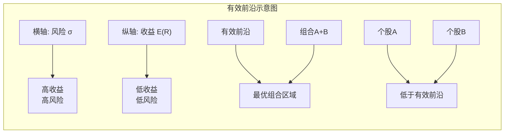
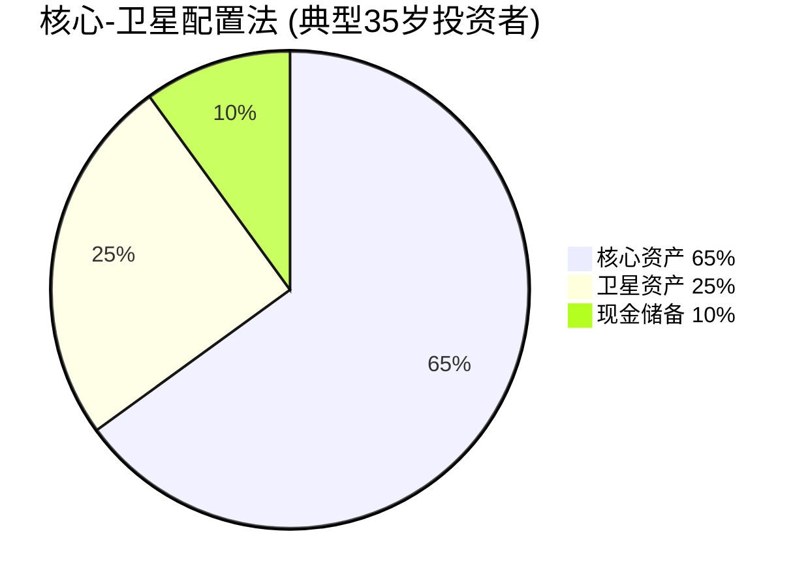
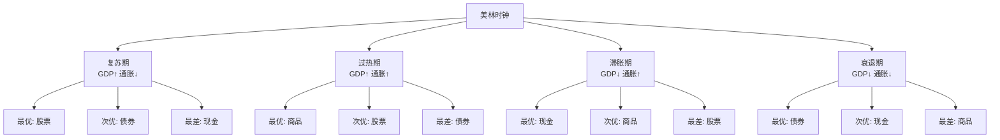

## 三、资产配置的科学方法

资产配置（Asset Allocation）是投资领域中被研究最多、却最容易被普通投资者忽视的环节。1986年，Gary Brinson、Hood和Beebower在《金融分析师期刊》上发表了开创性论文《投资组合收益的决定因素》，通过对91只大型养老基金1974-1983年数据的分析，得出结论：**投资组合收益差异的93.6%可以用资产配置来解释**，而非选股或择时。后续研究（Ibbotson和Kaplan在2000年）进一步验证了这一结论，并指出资产配置对投资组合波动性的解释程度甚至高达99%。

这意味着：你买了哪只股票、什么时候买入卖出，远没有"把多少钱分配到股票、债券、现金、房产"这个宏观决策重要。对于30-40岁的投资者来说，资产配置不是"高级技巧"，而是**必须掌握的基本功**。

### 3.1 为什么资产配置比选股更重要？

#### 3.1.1 "选股幻觉"的数学陷阱

大多数投资者将精力集中在"选到好股票"上，但统计数据显示这个策略存在根本性缺陷：

- **美国市场数据**：标普500指数在2002-2022年的年化回报约为9.8%，但J.P. Morgan的调查显示，同期普通投资者的年化回报仅约3.6%——差距的主要原因是频繁交易和追涨杀跌。
- **中国市场数据**：2010-2020年，沪深300指数年化回报约5.8%，但中国证券投资基金业协会的调查表明，同期"炒股票"的散户中，盈利者不到20%。
- **选股的统计劣势**：在任何一年中，约有40-50%的个股会跑输市场指数。如果你想通过选股持续战胜市场，你需要在超过一半的年份里做出正确判断——这在统计上极其困难。

这些数据的结论不是"选股无用"，而是**选股的边际收益远低于资产配置**。一个合理的资产配置方案，即使完全不选股（只买指数基金），长期收益也会超过绝大多数"精心选股"的投资者。

#### 3.1.2 资产配置的三层含义

资产配置在实践中分为三个层次，每一层解决不同层面的问题：

| 层次 | 名称 | 决策内容 | 30-40岁重点关注 |
|:---:|------|---------|:---:|
| L1 | **战略资产配置（SAA）** | 确定长期目标比例（如60%股票+30%债券+10%现金） | ★★★ |
| L2 | **战术资产配置（TAA）** | 根据市场状况短期微调（如经济衰退期临时增加债券） | ★★ |
| L3 | **动态资产配置** | 使用算法/模型实时调整 | ★ |

对于30-40岁的个人投资者，**L1是核心**，L2是进阶，L3一般不需要。本章的重点在L1和L2。

### 3.2 现代投资组合理论：资产配置的数学基础

#### 3.2.1 Markowitz均值-方差模型

1952年，Harry Markowitz发表了《投资组合选择》论文，奠定了现代投资组合理论（Modern Portfolio Theory, MPT）的基础，并因此获得1990年诺贝尔经济学奖。MPT的核心思想可以用一句话概括：**不要把所有鸡蛋放在一个篮子里——但也不要把每个篮子里放一样多的鸡蛋。**

模型的基本假设是：
- 投资者追求收益最大化、风险最小化
- 风险可以用收益的方差（或标准差）来衡量
- 通过组合不同资产，可以在不降低预期收益的情况下降低风险

关键公式：

$$E(R_p) = \sum_{i=1}^{n} w_i \cdot E(R_i)$$

$$\sigma_p^2 = \sum_{i=1}^{n} \sum_{j=1}^{n} w_i \cdot w_j \cdot \sigma_i \cdot \sigma_j \cdot \rho_{ij}$$

其中 $w_i$ 是资产 $i$ 的配置比例，$E(R_i)$ 是预期收益，$\sigma_i$ 是标准差，$\rho_{ij}$ 是资产 $i$ 和 $j$ 的相关系数。

这个公式的含义是：组合的风险不仅取决于每只资产自身的波动性，更取决于**资产之间的相关性**。当相关系数 $\rho_{ij}$ 小于1时，组合的风险会低于各资产风险的加权平均值——这就是**分散化的魔力**。

#### 3.2.2 相关性：分散化的灵魂

相关系数的取值范围是 $[-1, +1]$：

| 相关系数 | 含义 | 分散化效果 |
|:---:|------|:---:|
| +1.0 | 完全同涨同跌 | 无分散化效果 |
| +0.5 | 大部分同向 | 分散化效果有限 |
| 0.0 | 不相关 | 较好的分散化效果 |
| -0.5 | 大部分反向 | 很好的分散化效果 |
| -1.0 | 完全反向 | 理想的对冲效果 |

**中国主要资产类别的历史相关系数（2010-2023年估算）：**

|  | 沪深300 | 中证500 | 中证全债 | 黄金 | 货币基金 |
|:---:|:---:|:---:|:---:|:---:|:---:|
| **沪深300** | 1.00 | 0.85 | -0.15 | -0.05 | 0.02 |
| **中证500** | 0.85 | 1.00 | -0.10 | -0.03 | 0.01 |
| **中证全债** | -0.15 | -0.10 | 1.00 | 0.20 | 0.40 |
| **黄金** | -0.05 | -0.03 | 0.20 | 1.00 | 0.05 |
| **货币基金** | 0.02 | 0.01 | 0.40 | 0.05 | 1.00 |

**核心洞察**：
- 沪深300与中证500高度正相关（0.85），单纯同时持有这两者分散效果有限
- 债券与股票呈负相关（-0.15），这是经典"股债配置"的理论基础
- 黄金与股票几乎不相关（-0.05），可以作为有效的分散化工具
- 货币基金与其他资产几乎不相关，但收益率低，主要用于流动性储备

#### 3.2.3 有效前沿与最优组合

Markowitz模型推导出一个重要概念——**有效前沿（Efficient Frontier）**：在所有可能的资产组合中，存在一组"最优组合"——在给定风险水平下提供最高收益，或在给定收益水平下风险最低。这些最优组合连成的曲线就是有效前沿。

有效前沿给30-40岁投资者的启示是：
1. **分散投资不是简单的"多买几只股票"**——你需要配置**不同资产类别**（股票、债券、商品、房产），而不是在同一资产类别内买很多只。
2. **存在一个"最优"的风险-收益平衡点**——你的年龄、收入、家庭状况决定了你应该在有效前沿的哪个位置上。
3. **超过有效前沿上的某一点后，增加风险不再带来足够的收益补偿**——这就是"边际收益递减"在投资中的体现。

### 3.3 五大经典资产配置模型详解

#### 3.3.1 核心-卫星配置法（Core-Satellite）

**这是最适合30-40岁人群的资产配置方法**，由Vanguard创始人John Bogle推广，核心思想是：将投资组合分为"核心"（稳定、低成本、长期持有）和"卫星"（灵活、高弹性、适度调整）两部分。

**具体配置方案：**

**核心资产（60-70%）——稳健增长基石**

| 资产类别 | 占比建议 | 推荐标的（中国） | 年化目标 | 持有期 |
|---------|:---:|---------|:---:|:---:|
| 沪深300指数基金 | 25-30% | 天弘沪深300ETF联接、易方达沪深300ETF | 8-10% | 5年以上 |
| 中证500指数基金 | 10-15% | 南方中证500ETF、广发中证500ETF联接 | 8-12% | 5年以上 |
| 纯债基金 | 15-20% | 易方达纯债A、招商产业债A | 3-5% | 3年以上 |
| 可转债基金 | 5-10% | 兴全可转债、汇添富可转债A | 5-8% | 3年以上 |

核心资产的操作原则：
- **买入后持有**，不做择时，不追热点
- **定期定额投资**，利用"微笑曲线"效应降低平均成本
- 核心资产的选择标准：**费率低、规模大、跟踪误差小**

**卫星资产（20-30%）——捕捉超额收益**

| 资产类别 | 占比建议 | 推荐标的 | 风险等级 | 调整频率 |
|---------|:---:|---------|:---:|:---:|
| 行业主题基金 | 10-15% | 科技ETF、新能源ETF、医药ETF | 高 | 季度审视 |
| 个股投资 | 5-10% | 自选成长股 | 高 | 持续跟踪 |
| REITs | 5% | 中金普洛斯REIT、华安张江光大REIT | 中 | 半年审视 |
| 黄金ETF | 5% | 华安黄金ETF、博时黄金ETF | 中低 | 半年审视 |

卫星资产的操作原则：
- 可以做适度的**择时和轮动**，但控制频率（每月不超过一次调整）
- 单一卫星资产的亏损不应超过总投资组合的3%
- 卫星资产的收益是"锦上添花"，不是"雪中送炭"——核心资产才是收益的压舱石

**现金储备（10%）——流动性与机会成本**

| 形式 | 占比 | 年化收益 | 流动性 | 用途 |
|------|:---:|:---:|:---:|------|
| 货币基金（余额宝/零钱通） | 5% | 1.5-2.5% | T+0/T+1 | 日常应急 |
| 银行活期/通知存款 | 3% | 0.2-1.5% | 即时 | 极端应急 |
| 短期国债逆回购 | 2% | 1.5-3.0% | 1-7天 | 季末/年末加息期 |

现金储备的操作原则：
- 保持**3-6个月家庭支出**的流动性
- 现金储备不是"浪费"，而是一种**战略资源**——它让你在市场暴跌时有子弹抄底
- 不要追求现金储备的收益，它的价值在于**选择权**

#### 3.3.2 生命周期资产配置理论

生命周期配置理论的核心思想是：**随着年龄增长，你的风险承受能力下降，应该逐步降低高风险资产的比例**。最经典的公式是"100法则"（或其变体）。

**经典公式与修正：**

| 公式 | 计算方法 | 适用场景 |
|------|---------|---------|
| **100法则** | 权益比例 = 100 - 年龄 | 最简化版本，仅作参考 |
| **110法则** | 权益比例 = 110 - 年龄 | 30-40岁人群更适用，因为平均寿命延长 |
| **120法则** | 权益比例 = 120 - 年龄 | 高收入、高风险承受能力者 |
| **修正版** | 权益比例 = 100 - 年龄 + 收入稳定性系数 - 负债系数 | 最接近实际需求 |

**修正版公式详解：**

- **收入稳定性系数**（-10到+15）：
  - 公务员/国企/事业单位：+10到+15（收入极其稳定，可以承受更多风险）
  - 外企/大型民企管理层：+5到+10
  - 民企普通员工/自由职业者：0
  - 创业者/收入波动大：-5到-10

- **负债系数**（-15到0）：
  - 房贷月供/月收入 > 50%：-15
  - 房贷月供/月收入 30-50%：-10
  - 房贷月供/月收入 < 30%：-5
  - 无房贷或已还清：0

**实际计算示例：**

> 张先生，35岁，互联网公司中层管理者（收入稳定性+5），房贷月供占月收入35%（负债系数-10）。权益比例 = 100 - 35 + 5 - 10 = 60%。即他的投资组合中，股票类资产应占60%左右。

> 李女士，32岁，公务员（收入稳定性+15），无房贷（负债系数0）。权益比例 = 100 - 32 + 15 - 0 = 83%。她可以承受较高的权益配置。

**生命周期配置的三个阶段（30-40岁）：**

| 阶段 | 年龄 | 权益比例 | 债券比例 | 现金比例 | 核心策略 |
|:---:|:---:|:---:|:---:|:---:|------|
| 爬坡期 | 30-33 | 65-75% | 20-25% | 5-10% | 高仓位积累，容忍波动 |
| 飞轮期 | 34-37 | 60-70% | 25-30% | 5-10% | 攻守兼备，优化结构 |
| 收割期 | 38-40 | 55-65% | 30-35% | 5-10% | 稳中求进，为下阶段过渡 |

**100法则的三个致命缺陷：**

1. **忽视个人差异**：同样35岁，月入5万且无房贷的程序员，与月入1.5万背着房贷的销售员，风险承受能力天差地别——但他们按100法则算出的权益比例完全相同（65%）。
2. **忽视资产绝对规模**：100法则只看比例，不看金额。35岁时投资组合10万和100万的人，即使比例相同，面对亏损的心理承受力完全不同。
3. **不考虑市场估值**：当沪深300的PE分位数处于历史90%以上（极端高估）时，机械地按100法则配置65%的股票是危险的；当PE分位数处于历史10%以下（极端低估）时，65%又过于保守。

**因此，100法则只能作为起点，最终方案必须结合修正公式和个人情况综合判断。**

#### 3.3.3 永久组合（Permanent Portfolio）

由Harry Browne在1998年提出，灵感来自奥地利经济学派的经济周期理论。核心思想是：经济环境只有四种状态，每种状态下都有一类资产表现最好，因此等比例配置四类资产可以在任何环境下都保持正收益。

| 经济状态 | 最优资产 | 配置比例 |
|---------|---------|:---:|
| 繁荣期（经济扩张、温和通胀） | 股票 | 25% |
| 通胀期（高通胀、货币贬值） | 黄金 | 25% |
| 衰退期（经济收缩、通缩） | 长期国债 | 25% |
| 危机期（流动性枯竭、恐慌） | 现金 | 25% |

**永久组合的中国实践调整：**

原版永久组合基于美国市场，直接套用到中国市场需要调整：

- **长期国债**：中国国债品种不如美国丰富，可用10年期国债ETF或政金债ETF替代
- **现金**：货币基金收益率偏低，可用同业存单指数基金替代
- **黄金**：华安黄金ETF或博时黄金ETF

调整后的配置：
- 沪深300ETF：25%
- 华安黄金ETF：25%
- 十年国债ETF/政金债ETF：25%
- 同业存单指数基金：25%

**永久组合的优缺点：**

| 优点 | 缺点 |
|------|------|
| 极度简单，无需择时 | 权益比例过低（仅25%），30-40岁可能过于保守 |
| 波动性极低（年化波动率约6-8%） | 在长期牛市中会大幅跑输纯股票组合 |
| 心理压力小，容易坚持 | 黄金25%的占比可能偏高，增加机会成本 |
| 不需要任何投资知识 | 中国市场国债的波动性高于美国 |

**适合人群**：极度厌恶风险、没有时间研究投资、心理承受能力较弱的30-40岁投资者。建议在此基础上提高权益比例到35-40%以适应年龄特征。

#### 3.3.4 风险平价模型（Risk Parity）

2005年由Bridgewater（桥水基金）创始人Ray Dalio系统化提出，其核心思想颠覆了传统资产配置：**不是按金额分配，而是按风险贡献分配**。

传统配置（60%股票+40%债券）看似均衡，但实际上：
- 股票的波动率约为债券的5-8倍
- 60%的股票贡献了组合约90%的风险
- 这本质上是一个"伪分散"的组合——你承担的几乎全是股票风险

风险平价的目标是让**每类资产对组合总风险的贡献相等**。具体操作：

1. 计算每类资产的波动率（$\sigma$）
2. 配置比例与波动率成反比：$w_i \propto \frac{1}{\sigma_i}$
3. 低波动率的资产配置更高比例（通常通过加杠杆实现）

**简化版风险平价方案（30-40岁，无杠杆）：**

由于真正的风险平价需要大量债券和杠杆，对个人投资者不完全适用。以下是简化版：

| 资产类别 | 风险贡献目标 | 简化配置比例 | 标的 |
|---------|:---:|:---:|---------|
| 权益（A股） | 33% | 40-45% | 沪深300ETF + 中证500ETF |
| 债券 | 33% | 30-35% | 中证全债指数基金 + 国债ETF |
| 商品（黄金） | 17% | 10-15% | 黄金ETF |
| 现金类 | 17% | 10-15% | 货币基金 + 同业存单 |

**风险平价的核心价值**：它提醒你，**名义比例 ≠ 风险比例**。当你觉得"我已经很保守了，只配了60%股票"时，实际上你承担的风险中90%来自股票。30-40岁投资者应该至少认识到这个偏差，并有意识地通过增加债券和黄金配置来平衡风险来源。

#### 3.3.5 美林时钟模型（Merrill Lynch Investment Clock）

由美林证券在2004年提出，基于美国1973-2004年的经济数据，将经济周期分为四个阶段，每个阶段有不同的最优资产配置。

**美林时钟的中国实践注意事项：**

美林时钟在中国市场的有效性存在争议。中国市场的特点是：
- **政策驱动性强**：央行的货币政策、财政刺激等对市场的影响远大于经济周期本身
- **经济周期不典型**：中国经常出现"经济下行但股市大涨"（如2014-2015年）或"经济向好但股市不涨"的情况
- **传导机制不同**：中国的通胀与资产价格的关系不如美国清晰

**结论**：美林时钟可以作为理解经济周期的思维框架，但不建议机械执行。30-40岁投资者更应该关注的是：当经济指标发出明确信号时（如CPI连续3个月突破3%、PMI连续6个月低于荣枯线），对战术配置做适度调整。

### 3.4 再平衡策略：让配置方案真正生效

#### 3.4.1 为什么必须再平衡？

资产配置不是"设置好就不管"。假设你的目标是60%股票+30%债券+10%现金，一年后如果股票大涨30%而债券涨5%，你的实际比例会变成约69%股票+27%债券+4%现金——风险敞口显著偏高，远超你的目标风险水平。

**不进行再平衡的代价：**
- **2007年案例**：60/40股票债券配置，如果2007年初设定后不做再平衡，到2007年底股票占比会膨胀到75%以上。2008年金融危机中，这个组合的跌幅远大于原始60/40配置。
- **长期数据**：Vanguard的研究表明，1926-2019年期间，定期再平衡的60/40组合年化收益为8.7%，波动率11.2%；不做再平衡的同类组合年化收益8.3%，波动率12.8%——再平衡在降低波动的同时略微提高了收益。

**再平衡的本质是"卖高买低"的纪律化执行**。它不需要你预测市场，只需要你遵守规则——这恰恰是普通投资者最难做到的事。

#### 3.4.2 三种再平衡策略详解

**策略一：时间驱动再平衡（Calendar Rebalancing）**

| 频率 | 适用场景 | 优缺点 |
|:---:|---------|-------|
| 每季度 | 高波动市场、战术配置 | 优点：跟踪紧密；缺点：交易成本高 |
| 每半年 | 一般投资者推荐 | 平衡了跟踪精度和成本 |
| 每年 | 长期投资者、被动配置 | 优点：成本最低；缺点：可能错过极端偏离 |

**操作步骤：**
1. 在固定日期（如每年1月1日或7月1日）检查各资产类别的实际比例
2. 计算与目标比例的偏离值
3. 卖出超配资产，买入低配资产
4. 考虑交易成本——如果调整金额小于组合总值的1%，可以跳过

**策略二：阈值触发再平衡（Threshold Rebalancing）**

设定偏离阈值，当任何资产类别的实际比例偏离目标超过阈值时触发再平衡。

**阈值设定建议：**

| 资产类别 | 目标比例 | 阈值 | 触发条件 |
|---------|:---:|:---:|---------|
| 权益类 | 60% | ±5% | 实际 < 55% 或 > 65% |
| 债券类 | 30% | ±5% | 实际 < 25% 或 > 35% |
| 现金类 | 10% | ±3% | 实际 < 7% 或 > 13% |

**策略三：现金流再平衡（Cash Flow Rebalancing）——最适合30-40岁**

这是最实用的方法：**不卖出任何资产，只通过新增资金的分配来实现再平衡**。

操作逻辑：
- 你每月有新增可投资资金（如1-2万元）
- 不再按固定比例分配，而是优先投向当前"低于目标"的资产
- 如果股票已经超过目标比例，本月新增资金全部投向债券和现金

**示例：**

| 资产 | 目标 | 当前实际 | 偏离 | 本月新增资金1万的分配 |
|------|:---:|:---:|:---:|:---:|
| 股票 | 60% | 68% | +8%（超配） | 0元 |
| 债券 | 30% | 25% | -5%（低配） | 7000元 |
| 现金 | 10% | 7% | -3%（低配） | 3000元 |

现金流再平衡的优势：
- **零卖出成本**（无赎回费、无资本利得税）
- **心理压力小**（不需要做"卖出赚钱资产"的痛苦决策）
- **操作简单**（每月投资时顺带完成）
- **适合定投人群**（30-40岁大多在定投阶段）

#### 3.4.3 再平衡的税务考量

对于通过券商、基金公司直接投资的个人投资者，再平衡涉及的税务问题主要是：

- **公募基金分红**：个人投资者暂免个人所得税
- **基金赎回**：暂无资本利得税（但有赎回费）
- **股票交易**：卖出时缴纳印花税（0.05%，2023年8月28日起减半）

**实操建议**：在中国市场，由于暂无资本利得税，再平衡的主要成本是赎回费（持有不到7天通常1.5%，持有超过2年通常免赎回费）。因此：
- 优先使用**现金流再平衡**（零成本）
- 需要卖出时，优先卖出持有时间超过2年的份额（免赎回费）
- 年底前进行再平衡，可以合理利用"先进先出"原则优化赎回费

### 3.5 不同资产规模的配置方案

资产配置不是一刀切，不同规模的可投资资产需要不同的策略重心。

#### 3.5.1 起步阶段：可投资资产10-50万

**目标**：积累本金、建立投资习惯、控制下行风险

| 资产类别 | 配置比例 | 推荐标的 | 操作建议 |
|---------|:---:|---------|---------|
| 宽基指数基金 | 40-50% | 沪深300ETF联接、中证500ETF联接 | 每月定投，不择时 |
| 纯债基金 | 20-25% | 易方达纯债A、招商产业债A | 一次性买入或分3个月建仓 |
| 个股/行业基金 | 10-15% | 学习阶段，控制仓位 | 不超过总投入的15% |
| 黄金 | 5-10% | 黄金ETF | 定投或一次性配置 |
| 现金 | 10-15% | 货币基金 | 保持3-6个月应急 |

**重点策略**：
- 以**定投**为主要投资方式，利用时间换空间
- 这个阶段最大的敌人是"觉得本金太少，想搏一把"——**坚持纪律比追求收益更重要**
- 不要碰杠杆（融资融券、场外配资）
- 学习时间 > 操作时间：把精力放在建立知识体系上

#### 3.5.2 成长阶段：可投资资产50-200万

**目标**：优化收益、建立体系、开始多元化

| 资产类别 | 配置比例 | 推荐标的 | 操作建议 |
|---------|:---:|---------|---------|
| 宽基指数基金 | 30-35% | 沪深300ETF + 中证500ETF + 创业板ETF | 继续定投，适当调整品种 |
| 精选个股 | 15-20% | 5-8只经过深入研究的成长股 | 不超过10只，集中精力研究 |
| 纯债基金+可转债 | 15-20% | 纯债A + 可转债基金 | 债券部分做组合 |
| 海外资产 | 5-10% | QDII基金（纳斯达克100、标普500） | 分散A股单一市场风险 |
| REITs | 5% | 公募REITs | 分享不动产收益 |
| 黄金 | 5-10% | 黄金ETF | 战略配置，不交易 |
| 现金 | 5-10% | 货币基金+同业存单 | 保持4-6个月应急 |

**重点策略**：
- 开始**自上而下**的分析：先确定大类资产比例，再选具体标的
- 引入**海外资产**，降低单一市场风险
- 建立**投资日志**，记录每笔交易的逻辑和反思
- 开始学习**估值方法**（PE、PB、DCF），为个股投资打基础

#### 3.5.3 进阶阶段：可投资资产200万以上

**目标**：风险精细化管理、开始考虑传承、寻求专业协助

| 资产类别 | 配置比例 | 推荐标的 | 操作建议 |
|---------|:---:|---------|---------|
| 权益类 | 50-55% | 指数基金+精选个股+行业基金 | 国内+海外配置 |
| 固定收益 | 20-25% | 纯债+可转债+银行理财 | 关注信用风险 |
| 另类资产 | 10-15% | 私募基金+REITs+黄金+大宗商品 | 提高准入门槛的品种 |
| 海外资产 | 10-15% | QDII+港股通+美股（如有渠道） | 分散地域风险 |
| 现金 | 5-10% | 结构性存款+大额存单+货币基金 | 利用大额议价 |

**重点策略**：
- 考虑聘请**独立理财顾问**（非银行销售人员）
- 开始关注**税务筹划**（利用个人养老金账户、企业年金等税优工具）
- 建立**家庭资产配置手册**，确保配偶了解整体方案
- 如果资产规模超过500万，开始考虑**家族信托**等传承工具

### 3.6 行为金融学陷阱：资产配置中的心理敌人

资产配置方案再完美，如果执行者的心态出问题，一切都白搭。以下是30-40岁投资者在资产配置中最常见的行为陷阱：

#### 3.6.1 损失厌恶（Loss Aversion）

Daniel Kahneman和Amos Tversky的前景理论揭示：**亏损1万元的痛苦感是盈利1万元快乐感的2-2.5倍**。这意味着：
- 你在股票上涨5%时急于"锁定利润"卖出
- 你在股票下跌10%时死守不止损，期待"回本"
- 你在市场暴跌时恐慌卖出，完美错过了底部反弹

**应对策略**：
- 将投资组合的**查看频率从每天降低到每月一次**
- 制定**书面的投资计划和再平衡规则**，严格按计划执行
- 记住：**不操作往往就是最好的操作**

#### 3.6.2 锚定效应（Anchoring）

你会不自觉地被某个"锚点"影响判断：
- "这只股票我买的时候50元，现在40元，等回到50元我再卖"——但50元可能永远回不去了
- "这个基金去年涨了30%，今年应该也能涨这么多"——过去的收益不代表未来
- "别人说沪深300到5000点是底部"——别人的预测不是你的锚点

**应对策略**：
- 再平衡的依据应该是**实际比例与目标比例的偏离**，而不是"这只资产是赚是亏"
- 忘记你的买入价，只关注**当前持有理由是否还成立**

#### 3.6.3 过度自信（Overconfidence）

"我研究了三个月，这只股票一定会涨"——研究表明，过度自信是散户亏损的首要原因。30-40岁的人尤其容易犯这个错误：你有了一些投资经验、读了一些书，觉得自己已经"懂了"。

**数据警示**：
- 全球对冲基金的中位数年化收益，在2009-2019年间跑输了标普500指数
- 世界上最专业的投资机构都难以持续战胜市场，何况个人投资者

**应对策略**：
- 核心资产部分**坚决不做主动管理**，只买指数基金
- 如果你想证明自己的选股能力，用卫星资产中**不超过总投资10%的资金**来验证
- 设立"半年回顾"机制：如果你的主动管理部分连续两年跑输指数，就应该认输并转入被动配置

#### 3.6.4 从众心理（Herd Behavior）

"同事都在买某某基金，我也买一点"、"网上说现在该抄底了"。从众心理会让你在**最贵的时候买入**（因为大家都在买，形成共识）、**最便宜的时候卖出**（因为恐慌情绪传染）。

**历史案例**：
- 2015年6月A股暴跌前夕，大量散户在5000点以上跑步入场
- 2020年3月全球疫情恐慌时，很多人在底部卖出股票和基金
- 2021年初"基金热"时，大量年轻人在抱团股估值历史最高位买入消费、医药基金

**应对策略**：
- **反直觉纪律**：当身边所有人都在谈论某个投资机会时，提高警惕而非加大投入
- **估值纪律**：当沪深300的PE分位数超过80%时，自动降低权益比例；低于30%时，自动增加
- **独立思考**：你的投资决策应该基于**你自己的分析和计划**，而非他人的行动

### 3.7 中国市场的特殊考量

#### 3.7.1 A股的高波动性特征

A股市场的波动性显著高于成熟市场：
- 沪深300的年化波动率约为25-30%，标普500约为15-18%
- A股"牛短熊长"的特点意味着：大部分时间你可能处于浮亏状态
- 政策对市场的影响巨大（如2015年清理配资、2018年去杠杆、2024年活跃资本市场）

**对资产配置的影响**：
- 在A股配置中，应该**更加注重债券和现金的"稳定器"作用**
- 建议A股配置中，指数基金占比不低于70%——个股在高波动市场中风险更大
- 利用A股的高波动性进行**更积极的再平衡**——波动越大，再平衡的超额收益越高

#### 3.7.2 中国债券市场的特殊性

- **刚性兑付打破**：2018年以来，信用债违约事件增加，纯债基金不再"绝对安全"
- **国债收益率走势**：中国10年期国债收益率从2014年的4.6%下降到2024年的2.3%左右，债券牛市已持续多年
- **可转债的中国特色**：A股的可转债市场是全球最活跃的，具有"下有保底、上不封顶"的独特属性，是30-40岁投资者的优质配置工具

**债券配置建议**：
- 以**利率债（国债、政金债）为主**，信用债为辅
- 可转债基金可以替代部分纯债基金，提高收益弹性
- 关注债券久期：利率下行期用长久期债（10年期），利率上行期用短久期债（1-3年期）

#### 3.7.3 实操工具与平台

| 需求 | 推荐平台/工具 | 费用 | 特点 |
|------|-------------|------|------|
| 场内ETF交易 | 各大券商APP | 佣金万1-万3 | 实时交易、品种全 |
| 场外基金定投 | 天天基金、蚂蚁基金 | 申购费1折（0.12-0.15%） | 定投功能好、品种全 |
| 账户管理 | 天天基金APP"持仓分析" | 免费 | 可查看资产配置比例 |
| 记账与追踪 | 雪球、且慢 | 免费 | 社区讨论+实盘追踪 |
| 宏观经济指标 | 国家统计局、央行官网 | 免费 | 第一手数据 |
| 基金筛选 | 天天基金"基金筛选" | 免费 | 按费率、规模、业绩筛选 |

### 3.8 常见误区与纠正

| 误区 | 错误逻辑 | 正确认知 |
|------|---------|---------|
| "分散就是多买几只基金" | 买了10只A股基金就分散了 | 真正的分散需要跨资产类别（股票+债券+商品） |
| "债券收益太低，不如全买股票" | 看不上3-5%的债券收益 | 债券是组合的"减震器"，2018年全买股票会亏30% |
| "黄金不产生利息，没用" | 只看现金流，不看对冲价值 | 黄金与股票相关性极低，是组合的"保险" |
| "定投就是无脑买入" | 任何时点都一样买 | 高估值时降低定投额、低估值时增加，效果更好 |
| "再平衡太麻烦" | 懒得调 | 不再平衡等于让市场决定你的风险敞口 |
| "我年轻，亏得起" | 30岁不怕亏 | 30岁有房贷有家庭，一次大亏可能影响数年生活 |
| "等我有钱了再做配置" | 本金太少不值得 | 1万元和100万元的配置原则完全相同，习惯比金额重要 |
| "跟着大V买就行" | 依赖他人决策 | 大V不承担你的亏损，且利益冲突不可避免 |

### 3.9 深度进阶：Black-Litterman模型简介

对于希望深入理解资产配置的进阶读者，这里简要介绍Black-Litterman模型——它是Goldman Sachs在1990年提出的，解决了Markowitz模型的一个关键缺陷：**对输入参数极度敏感**。

Markowitz模型的问题是：如果你稍微改变一下某类资产的预期收益假设（比如从8%改成9%），最优配置可能会剧烈变化（从30%变成50%）。这在实践中几乎不可用。

Black-Litterman的解决方案是：
1. 从**市场均衡**出发（假设当前市场价格已经反映了所有信息）
2. 将你的**个人观点**（比如"我认为A股未来3年年化收益10%"）与市场均衡进行**贝叶斯融合**
3. 得出一个**更稳健**的最优配置

**对个人投资者的启示**：
- 不要完全忽视市场的"共识"——市场价格包含了大量信息
- 你的"个人观点"应该有足够强的证据支撑才值得加入
- 当你对自己的判断不够确信时，**更加贴近市场均衡配置**（即全球市值加权的股债比例）是更安全的选择

### 3.10 本节核心行动清单

读完本节后，你应该立即执行以下五步：

**第一步：诊断现状（本周完成）**
- 列出你当前所有的投资资产及其金额
- 计算各类资产的实际比例
- 用修正版公式计算你的目标权益比例

**第二步：制定方案（两周内完成）**
- 选择一个配置模型作为基础框架（推荐核心-卫星法）
- 根据你的资产规模和年龄，确定目标比例
- 写下你的《投资配置说明书》——包括目标比例、再平衡规则、应急方案

**第三步：执行调整（一个月内完成）**
- 如果实际比例与目标偏离超过10%，制定3-6个月的渐进调整计划
- 设置定投计划，每月自动执行
- 将现金储备建立到位

**第四步：建立再平衡纪律（持续执行）**
- 在日历上标注再平衡检查日期（每半年一次）
- 使用现金流再平衡优先，必要时卖出再平衡
- 每次再平衡后记录操作日志

**第五步：持续学习（终身执行）**
- 阅读推荐书单：《漫步华尔街》（Burton Malkiel）、《投资最重要的事》（Howard Marks）、《资产配置的艺术》（David Darst）
- 每年回顾一次自己的配置方案是否仍然适合
- 随着资产增长和人生阶段变化，逐步升级配置方案

> **记住**：资产配置不是一次性的决定，而是一个持续优化的过程。30-40岁最重要的投资决策不是"买哪只股票"，而是"在股票、债券、黄金、现金之间如何分配"。把这个决策做对了，你的长期收益大概率会超过90%的投资者。
