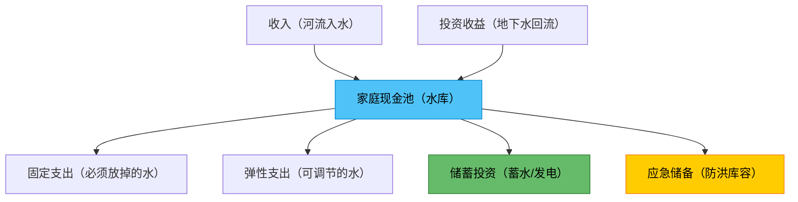
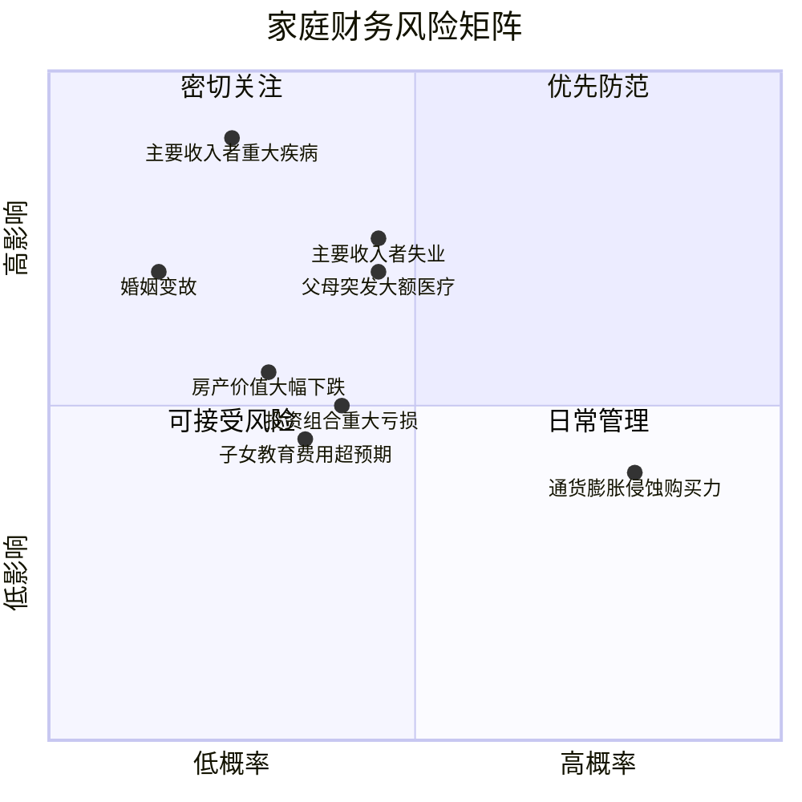
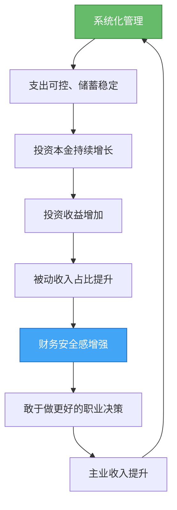

## 四、家庭财务管理的系统框架

30-40岁是个人财务向家庭财务转型的关键阶段。结婚、买房、生子——这些人生大事不仅改变了你的生活方式，更从根本上改变了你的财务结构。一个人时，你只需要管好自己的收支；但组建家庭后，你面对的是一个多变量、长周期、高耦合的财务系统。

很多30多岁的人收入不低，但总觉得"钱不够用"。问题往往不在收入端，而在管理端——他们用管理个人钱包的方式管理家庭财务，就像用记事本管理一家百人公司一样，工具和方法完全不匹配。

本节从系统工程的视角，构建家庭财务管理的完整理论框架。这不是"教你省钱"，而是教你像经营企业一样经营家庭——建立资产负债表、管理现金流、配置资本、控制风险。

### 1. 为什么家庭财务管理需要"系统框架"？

#### 1.1 从"管钱"到"管系统"的认知跃迁

大多数人对财务管理的理解停留在"收支管理"层面：赚多少、花多少、存多少。这种理解在单身阶段勉强够用，但在家庭阶段会彻底失效。原因在于，家庭财务与个人财务有本质区别：

| 维度 | 个人财务 | 家庭财务 |
|:---:|:---:|:---:|
| **决策主体** | 一个人，决策简单 | 多人，需要协商和共识 |
| **收入结构** | 单一工资收入为主 | 双收入+可能的被动收入 |
| **支出结构** | 弹性大，可随时调整 | 刚性支出占比高（房贷、教育、医疗） |
| **时间跨度** | 3-5年规划即可 | 需要20-30年的长期规划 |
| **风险敞口** | 个人风险，影响有限 | 家庭风险，牵一发动全身 |
| **目标复杂度** | 单一目标（如买房） | 多目标并行（教育、养老、保障、投资） |

家庭财务管理的本质是一个**多目标、长周期、资源受限的优化问题**。你需要在有限的家庭收入下，同时满足多个有时相互冲突的目标——既要还房贷，又要存教育金，还要准备养老金，同时保持合理的生活质量。这正是为什么需要"系统框架"而不是"零散技巧"。

#### 1.2 家庭财务管理的"冰山模型"

很多人只看到家庭财务的"水面之上"部分——收入、支出、存款。但真正决定家庭财务健康的，是水面之下的系统结构：

```mermaid
graph TD
    subgraph 水面之上【可见层面】
        A[收入] --> B[支出]
        B --> C[结余]
    end
    subgraph 水面之下【系统层面】
        D[资产负债结构]
        E[现金流管道]
        F[风险防御体系]
        G[资本配置策略]
        H[税务效率优化]
        I[代际财务规划]
    end
    水面之上 --- 水面之下
    
    style 水面之上 fill:#e8f5e9,stroke:#4caf50,color:#000
    style 水面之下 fill:#e3f2fd,stroke:#2196f3,color:#000
```

- **资产负债结构**决定了你的财务底座是否稳固
- **现金流管道**决定了你的财务运转是否顺畅
- **风险防御体系**决定了你能否抵御意外冲击
- **资本配置策略**决定了你的财富能否持续增值
- **税务效率优化**决定了你实际到手的收益有多少
- **代际财务规划**决定了你是否在为下一代挖坑或铺路

只关注"收入-支出-结余"的人，就像只看仪表盘不看发动机的司机——车能跑，但你不知道什么时候会抛锚。

#### 1.3 系统框架的核心理念：CFO思维

"家庭CFO"不是修辞手法，而是一种真实的管理思维。一家公司的CFO关注三件事，家庭CFO同样关注这三件事：

**第一，流动性管理（Liquidity Management）**

公司CFO确保企业有足够的现金应对日常运营和突发事件。家庭CFO同样需要确保：家庭账上有足够的钱支付每月刚性支出（房贷、学费、生活费），同时有足够的应急储备应对突发状况（失业、疾病）。

流动性管理的核心指标是**流动比率**：

```text
家庭流动比率 = 流动资产（现金+活期+货币基金） / 月刚性支出

健康标准：
  ≥ 3个月 → 基本安全
  ≥ 6个月 → 良好
  ≥ 12个月 → 优秀（高风险行业建议达到此水平）
```

很多家庭的流动比率不到1个月——工资到账后还完信用卡、房贷、花呗，账上只剩几千块。一旦遇到突发支出（比如家电坏了、孩子生病），就不得不借钱或卖出投资。

**第二，资本结构管理（Capital Structure Management）**

公司CFO决定企业的负债比例——借多少钱、借什么钱、什么时候还。家庭CFO同样需要管理家庭的负债结构。

家庭负债的核心原则是**"好负债"与"坏负债"的区分**：

| 负债类型 | 定义 | 典型例子 | 处理策略 |
|:---:|:---:|:---:|:---:|
| 好负债 | 用于购买增值资产或提升收入能力的负债 | 房贷（自住刚需）、教育贷款 | 合理利用，控制杠杆率 |
| 中性负债 | 用于消费但利率较低的负债 | 车贷（0利率分期）、装修贷 | 谨慎使用，确保不影响现金流 |
| 坏负债 | 用于消费且利率高的负债 | 信用卡分期（年化12-18%）、网贷（年化15-36%） | 立即偿还，绝不新增 |

**家庭资产负债率**是衡量负债健康程度的核心指标：

```text
家庭资产负债率 = 家庭总负债 / 家庭总资产 × 100%

健康标准：
  < 30% → 非常健康，财务自由度高
  30-50% → 正常范围，有房贷的家庭通常在此区间
  50-70% → 需要警惕，偿债压力较大
  > 70% → 危险区域，任何收入波动都可能导致财务危机
```

**第三，投资回报管理（Return on Investment）**

公司CFO负责资本配置——把钱投到回报最高的地方。家庭CFO同样需要决定：家庭结余应该投到哪里？

但家庭投资与企业投资有一个关键区别：**家庭投资的首要目标不是最大化收益，而是在可承受的风险水平下实现目标收益**。因为家庭投资的钱是"输不起"的钱——孩子的教育金、父母的养老金、家庭的应急储备金，这些钱如果亏损，影响的不是财务报表，而是家人的生活质量。

### 2. 家庭资产负债表：你的财务底片

#### 2.1 什么是家庭资产负债表？

家庭资产负债表（Personal/Family Balance Sheet）是一张反映家庭在**某个时间点**财务状况的快照。它回答一个根本问题：**你家到底有多少钱？**

很多人对自己的财务状况有错觉。他们觉得自己"还行"——月薪两万、有房有车。但如果你把房贷、车贷、信用卡欠款都算进去，净资产可能是负数。

资产负债表的公式极其简单：

```text
净资产 = 总资产 - 总负债
```

但"简单"不等于"不重要"。这张表是所有家庭财务决策的基础——你的投资策略、保险规划、教育金准备、退休规划，都必须建立在准确的资产负债表之上。没有这张表，你所有的财务规划都是在沙滩上盖楼。

#### 2.2 家庭资产的分类与估值

家庭资产分为四大类，每类的估值方法不同：

**第一类：流动资产（Liquid Assets）**

流动性最高，可以在短时间内（通常1-3个工作日内）变现的资产。

| 资产项目 | 估值方法 | 说明 |
|---------|---------|------|
| 现金及活期存款 | 账面价值 | 直接看银行余额 |
| 货币基金（余额宝等） | 账面价值 | 随时可赎回 |
| 定期存款 | 账面价值（注意提前支取会损失利息） | 可作为应急资金的一部分 |
| 短期理财（<1年） | 账面价值或市值 | 看产品类型，净值型看最新净值 |

**第二类：投资资产（Investment Assets）**

以增值为目的持有的资产，价值随市场波动。

| 资产项目 | 估值方法 | 说明 |
|---------|---------|------|
| 股票/股票基金 | 最新市值 | 用年末收盘价计算 |
| 债券/债券基金 | 最新市值或面值+应计利息 | 净值型看最新净值 |
| 银行理财产品 | 最新净值 | 注意区分净值型和预期收益型 |
| 黄金 | 最新市价 × 持有克数 | 纸黄金看账户，实物金看当日金价 |
| 数字资产（加密货币等） | 最新市价 | 波动极大，建议保守估值 |
| 其他投资（P2P、信托等） | 本金 + 已确认收益 - 可能损失 | 高风险资产需要谨慎估值 |

**第三类：固定资产（Fixed Assets）**

流动性低、变现周期长的资产。

| 资产项目 | 估值方法 | 说明 |
|---------|---------|------|
| 自住房产 | 参考同小区近期成交价 | 不是挂牌价，是实际成交价。可通过链家、贝壳等平台查询 |
| 投资房产 | 参考同小区近期成交价 | 投资房产还需扣除未还房贷 |
| 车辆 | 参考二手车平台估价 | 车辆是贬值资产，每年折旧10-20% |
| 家具家电 | 购买价 × 折旧系数 | 通常按5-10年折旧，残值率低 |
| 收藏品/艺术品 | 专业估价或近期拍卖成交价 | 流动性极低，建议保守估值或不计入 |

**第四类：无形资产（Intangible Assets）**

不直接产生现金流，但代表未来经济利益的资产。

| 资产项目 | 估值方法 | 说明 |
|---------|---------|------|
| 公积金账户余额 | 账面价值 | 可用于购房或退休后提取 |
| 企业年金/职业年金 | 账面价值 | 退休后才能领取 |
| 社保养老账户累计额 | 账面价值（个人缴纳部分） | 可通过社保APP查询 |
| 知识产权/专利 | 评估价值或预期收益折现 | 除非已有明确变现渠道，否则建议保守估值或不计入 |

**估值的核心原则：保守原则**

在不确定的情况下，选择较低的估值。原因很简单：高估资产会让你产生虚假的安全感，低估资产会让你更谨慎、更有动力去积累。特别是在做重大财务决策（如是否可以承受换房、是否可以辞职创业）时，保守估值能帮你避免灾难性错误。

#### 2.3 家庭负债的全面梳理

很多家庭对自己的负债只有模糊的概念——"房贷还有大概100多万"。但精确的负债数据是制定还款策略和投资策略的前提。

| 负债项目 | 需要记录的信息 | 为什么重要 |
|---------|--------------|-----------|
| 房贷 | 剩余本金、月供金额、利率、还款方式（等额本息/等额本金）、剩余期限 | 房贷通常是家庭最大的负债，利率差异直接影响总利息支出 |
| 车贷 | 剩余本金、月供金额、利率、剩余期限 | 车贷利率通常较高，是否值得提前偿还需要计算 |
| 信用卡欠款 | 当期账单金额、最低还款额、分期金额及利率 | 信用卡分期年化利率通常12-18%，是最昂贵的"坏负债" |
| 消费贷/花呗/借呗 | 欠款金额、利率、还款日 | 消费贷利率差异大，需要逐一确认 |
| 亲友借款 | 借款金额、是否有利息、约定还款时间 | 虽然无利息，但影响人际关系和财务规划 |
| 其他负债 | 具体条款 | 不遗漏任何负债项目 |

#### 2.4 家庭资产负债表的编制实操

以下是一个典型的30-40岁双职工家庭的资产负债表示例：

```text
═══════════════════════════════════════════════
      张先生家庭资产负债表（2024年12月31日）
═══════════════════════════════════════════════

【资产方】
┌─────────────────────────────────┬──────────┐
│ 流动资产                        │          │
│   现金及活期存款                │   30,000 │
│   货币基金（余额宝）            │   50,000 │
│   定期存款（6个月到期）         │  100,000 │
│ 小计                            │  180,000 │
├─────────────────────────────────┼──────────┤
│ 投资资产                        │          │
│   沪深300指数基金               │  150,000 │
│   中证500指数基金               │   80,000 │
│   债券基金                      │   60,000 │
│   股票账户                      │  120,000 │
│   黄金ETF                       │   30,000 │
│   银行理财产品                  │  100,000 │
│ 小计                            │  540,000 │
├─────────────────────────────────┼──────────┤
│ 固定资产                        │          │
│   自住房产（市值）              │2,500,000 │
│   车辆（二手估价）              │  120,000 │
│ 小计                            │2,620,000 │
├─────────────────────────────────┼──────────┤
│ 无形资产                        │          │
│   公积金账户余额                │  150,000 │
│   社保养老个人账户              │  120,000 │
│ 小计                            │  270,000 │
├─────────────────────────────────┼──────────┤
│ 总资产                          │3,610,000 │
└─────────────────────────────────┴──────────┘

【负债方】
┌─────────────────────────────────┬──────────┐
│ 房贷（剩余本金）                │1,500,000 │
│ 车贷（剩余本金）                │   80,000 │
│ 信用卡当期账单                  │   15,000 │
│ 花呗欠款                        │    3,000 │
│ 总负债                          │1,598,000 │
└─────────────────────────────────┴──────────┘

【净资产】
  净资产 = 3,610,000 - 1,598,000 = 2,012,000元

【关键指标】
  资产负债率 = 1,598,000 / 3,610,000 = 44.3%（正常范围）
  流动比率 = 180,000 / 15,000（月刚性支出）= 12个月（优秀）
  投资资产占比 = 540,000 / 3,610,000 = 15.0%（可提升空间大）
  房产占比 = 2,500,000 / 3,610,000 = 69.3%（偏高，注意资产集中风险）
═══════════════════════════════════════════════
```

**编制频率建议**：每半年编制一次（6月底和12月底），便于纵向对比资产增长趋势。如果正在进行重大财务调整（如提前还贷、大额投资），可以在调整前后各编制一次。

#### 2.5 资产负债表的分析框架

编制资产负债表只是第一步，更重要的是从中提取关键信息来指导决策。

**分析维度一：资产流动性分析**

```text
流动资产占比 = 流动资产 / 总资产 × 100%

  < 5% → 危险，几乎没有应急能力
  5-15% → 偏低，建议增加流动资产
  15-30% → 正常
  > 30% → 流动性充裕，但可能错失投资收益
```

**分析维度二：资产集中度分析**

资产集中度衡量你的财富是否过度依赖某一类资产。最常见的问题是**房产占比过高**——很多中国家庭70%以上的资产是房产。如果房价下跌20%，你的净资产可能缩水一半以上。

```text
资产集中度 = 单一资产类别 / 总资产 × 100%

单一类别超过50% → 集中风险较高
单一类别超过70% → 集中风险极高，需要有意识地分散
```

**分析维度三：负债成本分析**

不是所有负债都需要急着还。关键是比较**负债利率**和**投资收益率**：

```text
决策规则：
  如果负债利率 > 投资收益率 → 优先还债
  如果负债利率 < 投资收益率 → 保持负债，用余钱投资
  如果负债利率 ≈ 投资收益率 → 优先还债（因为还债无风险，投资有风险）
```

例如：房贷利率3.5%，而你的指数基金定投年化收益8%——这种情况下，不建议提前还贷，而是把多余的钱投入指数基金。但如果信用卡分期年化15%，而你的投资收益只有8%——必须先还清信用卡。

### 3. 家庭现金流管理：让钱有序流动

#### 3.1 现金流是家庭财务的"血液"

如果说资产负债表是"体检报告"，那现金流就是"实时心电图"。一个家庭可能净资产很高（比如有一套价值300万的房子），但如果现金流断裂（没有收入、没有流动资产），照样会陷入财务危机——你不能用房子去超市买东西。

现金流管理的核心目标是：**确保在任何时点，家庭的现金流入都大于或等于现金流出**。

#### 3.2 家庭现金流的三类结构

**第一类：经营性现金流（Operating Cash Flow）**

日常收支产生的现金流，是家庭财务的基础。

```text
经营性现金流 = 工资收入 + 副业收入 + 其他经常性收入 - 日常支出 - 固定支出

其中：
  固定支出 = 房贷 + 车贷 + 保险费 + 物业费 + 子女学费（每月固定、不可削减）
  日常支出 = 餐饮 + 交通 + 日用品 + 通讯费（每月可调整）
```

经营性现金流为正是家庭财务健康的基本前提。如果连经营性现金流都是负数（入不敷出），你必须立即行动：要么增加收入，要么削减支出。

**第二类：投资性现金流（Investment Cash Flow）**

投资活动产生的现金流，包括投资收益和资本变动。

```text
投资性现金流 = 投资收益（分红+利息+资本增值） - 新增投资投入

  正值 → 投资在"产出"，你开始从投资中获得净现金
  负值 → 投资在"吸收"，你还在往投资中注入资金（积累期正常现象）
```

在30-40岁阶段，投资性现金流通常为负——你还在积累投资本金。但到了40-50岁，理想情况下投资性现金流应该逐步转正。

**第三类：融资性现金流（Financing Cash Flow）**

借贷活动产生的现金流。

```text
融资性现金流 = 新增贷款 - 偿还贷款本金

  正值 → 在增加杠杆（如新购房产）
  负值 → 在去杠杆（如提前还贷）
```

#### 3.3 家庭现金流的"水库模型"

理解家庭现金流最直观的方式是用水库模型：



- **入水口**（收入）要尽量多——提升主业收入、开拓副业、增加投资收益
- **固定出水口**（房贷、保险、学费）是刚性的，无法调节
- **弹性出水口**（消费、娱乐）是可以调节的阀门
- **蓄水层**（投资）是让"水"增值的方式
- **防洪库容**（应急储备）是应对极端情况的安全垫

现金流管理的关键操作：

1. **先蓄水再放水**：工资到账后，先转走储蓄投资部分（20%以上），剩下的才是可以花的
2. **监控水位**：每周检查一次账户余额，确保不低于安全水位（月刚性支出的2倍）
3. **调节阀门**：当入水减少（如收入下降）时，优先关小弹性出水口，最后才动蓄水层
4. **维护防洪库容**：应急基金始终保持在6个月刚性支出以上，任何情况下不动用（除非真正的紧急情况）

#### 3.4 现金流断裂的预警信号

以下任何一个信号出现，都意味着你的现金流可能即将断裂：

| 预警信号 | 严重程度 | 应对措施 |
|---------|:---:|---------|
| 每月结余不足收入的10% | ⚠️ 警告 | 审查弹性支出，寻找压缩空间 |
| 需要用信用卡分期来维持生活 | 🔴 严重 | 立即削减所有非必要支出 |
| 信用卡最低还款都吃力 | 🔴🔴 危险 | 考虑出售非核心资产，优先偿还高息负债 |
| 借新债还旧债 | 🚨 紧急 | 债务重组，必要时寻求专业帮助 |
| 账户余额低于月支出的2倍 | ⚠️ 警告 | 暂停所有非紧急投资，补充流动资金 |
| 投资被迫在亏损时卖出 | 🔴 严重 | 调整资产配置，增加流动性资产比例 |

### 4. 家庭财务风险管理框架

#### 4.1 风险管理的理论基础：风险矩阵

家庭面临的风险可以从两个维度来评估：**发生概率**和**影响程度**。通过风险矩阵，你可以识别哪些风险需要优先处理：



- **右上象限（高概率+高影响）**：必须优先防范——如主要收入者失业、父母大额医疗
- **左上象限（低概率+高影响）**：必须有预案——如主要收入者重大疾病、婚姻变故
- **右下象限（高概率+低影响）**：日常管理——如通货膨胀、小额意外支出
- **左下象限（低概率+低影响）**：可以接受——如小额投资亏损

#### 4.2 风险管理的四层防御体系

家庭风险管理不是买一份保险就完事，而是一个多层次的防御体系：

**第一层：应急基金（风险缓冲层）**

应急基金是家庭风险管理的第一道防线，作用类似于企业的现金储备。它的目标不是增值，而是**确保在任何突发情况下，家庭都能维持正常运转至少6个月**。

```text
应急基金规模 = 月刚性支出 × 6-12

存放要求：
  - 高流动性：随时可取，T+0或T+1到账
  - 低风险：不能有任何本金损失的可能
  - 独立账户：不与日常消费账户混用

推荐存放方式：
  - 货币基金（余额宝、零钱通等）：年化约1.5-2%，T+0可取
  - 银行活期存款：年化约0.2%，但即时可用
  - 短期国债逆回购：年化约1.5-3%，期限灵活
```

**第二层：保险保障（风险转移层）**

保险的本质是**用小额确定性支出（保费）替代大额不确定性损失（风险事件）**。对于30-40岁的家庭，以下保险是"必选项"而非"可选项"：

| 保险类型 | 保障对象 | 保额建议 | 年保费参考 | 优先级 |
|---------|---------|---------|-----------|:---:|
| 定期寿险 | 家庭经济支柱 | 年收入的10倍+房贷余额 | 1000-3000元 | 最高 |
| 重疾险 | 全家 | 30-50万/人 | 3000-8000元/人 | 最高 |
| 百万医疗险 | 全家 | 100-400万 | 200-2000元/人 | 高 |
| 意外险 | 全家 | 50-100万 | 100-500元/人 | 高 |
| 车险 | 有车家庭 | 按车辆价值 | 3000-8000元 | 必须 |

保险配置的核心原则是**"先保障后理财"**——先把保障型保险（寿险、重疾、医疗、意外）配齐，再考虑理财型保险（年金险、增额终身寿）。很多家庭犯的错误是买了大量理财型保险，保障型保险却严重不足。

**第三层：投资分散（风险分散层）**

通过资产配置的分散化，降低单一资产类别下跌对家庭财富的影响。这部分内容在"三、资产配置的科学方法"中有详细论述，此处仅强调一个核心原则：**不要把所有鸡蛋放在一个篮子里，但也不要放在太多篮子里**。

理想的分散是3-5个相关性低的资产类别（如股票、债券、黄金、REITs），而不是20只不同行业的股票（它们的相关性很高，下跌时会一起跌）。

**第四层：收入多元化（风险对冲层）**

最深层的风险管理不是买保险或分散投资，而是**确保家庭收入不依赖于单一来源**。

```text
收入来源依赖度 = 单一收入来源 / 家庭总收入 × 100%

  > 80% → 高度依赖，风险极大
  60-80% → 中度依赖，需要发展替代收入
  < 60% → 相对健康，有抗风险能力
```

收入多元化的路径包括：双职工家庭结构、副业收入、投资收益、租金收入等。即使副业收入目前占比很小（比如只有5%），它的存在本身就降低了"零收入"的风险。

#### 4.3 保险规划的理论框架

保险规划的核心是**需求分析法**——先算出你需要多少保障，再选择合适的产品。

**寿险需求计算：**

```text
寿险保额 = 家庭负债总额 + 子女教育金需求 + 父母赡养金需求 + 配偶5年生活费 - 现有流动资产

示例：
  房贷余额：150万
  子女教育金需求（至大学毕业）：100万
  父母赡养金（10年）：60万
  配偶5年生活费：50万
  现有流动资产：-30万
  ──────────────────
  寿险保额需求：330万元
```

**重疾险需求计算：**

```text
重疾险保额 = 治疗费用 + 3-5年收入损失 + 康复费用

一般建议：
  一线城市：50万以上
  二三线城市：30万以上
  有房贷家庭：保额需覆盖房贷余额
```

### 5. 家庭财务管理的生命周期视角

#### 5.1 家庭财务生命周期模型

家庭财务不是静态的，而是随着家庭生命周期的演进而动态变化的。理解这个周期，才能在每个阶段做出正确的财务决策：


30-40岁通常横跨**育儿期**和**成长期**，这是家庭财务压力最大、但也是财富增长潜力最大的阶段：

| 阶段 | 财务特征 | 核心任务 | 风险承受力 |
|:---:|---------|---------|:---:|
| 单身期 | 收入低但无负担，储蓄率高 | 打基础、建习惯 | 高 |
| 新婚期 | 双收入、购房压力 | 建立共同财务制度 | 中高 |
| **育儿期** | **支出激增、收入增长** | **平衡消费与积累** | **中** |
| **成长期** | **收入高峰期、负债递减** | **加速积累、分散投资** | **中高** |
| 成熟期 | 收入稳定、子女独立 | 保全财富、规划退休 | 中低 |
| 退休期 | 收入下降、医疗支出增 | 控制支出、稳健投资 | 低 |

#### 5.2 30-40岁的特殊财务挑战

30-40岁是财务生命周期中**唯一需要同时应对多个重大财务目标**的阶段：

1. **房贷还款**：通常是家庭最大的月度固定支出，占收入的25-40%
2. **子女养育**：从出生到幼儿园、小学，教育和养育费用逐年递增
3. **父母赡养**：父母开始进入养老期，医疗费用增加
4. **职业投资**：需要持续投入时间和金钱提升职业技能
5. **退休准备**：越早开始，复利效应越显著
6. **应急储备**：家庭责任越大，需要的安全垫越厚

这六个目标同时存在，但资源有限，不可能全部最大化。因此需要**优先级排序**：

```text
优先级金字塔（从底到顶）：

  ┌─────────────────┐
  │   退休准备       │  ← 最容易被忽视，但影响最深远
  ├─────────────────┤
  │   职业投资       │  ← 提升收入能力是一切的基础
  ├─────────────────┤
  │   子女教育       │  ← 刚性支出，但可以分阶段准备
  ├─────────────────┤
  │   父母赡养       │  ← 道义责任，需要提前规划
  ├─────────────────┤
  │   房贷还款       │  ← 刚性支出，但利率低时不急提前还
  ├─────────────────┤
  │   应急储备       │  ← 最底层，一切决策的前提
  └─────────────────┘
```

应急储备是地基——没有它，上面的一切都可能坍塌。房贷还款虽然金额大，但它是可预测的刚性支出，反而不需要太多额外精力。最容易被忽视的是**退休准备**——30多岁的人总觉得"还早"，但35岁开始准备和45岁开始准备，最终的退休金差距可能是2-3倍。

#### 5.3 家庭财务目标的SMART分解

每个财务目标都需要用SMART原则来具体化：

| 原则 | 含义 | 错误示例 | 正确示例 |
|:---:|:---:|---------|---------|
| **S**pecific（具体） | 明确的目标 | "多存点钱" | "建立12万元应急基金" |
| **M**easurable（可衡量） | 有数字标准 | "投资收益要好" | "年化收益率不低于8%" |
| **A**chievable（可实现） | 力所能及 | "3年存100万"（月薪1万） | "3年存30万" |
| **R**elevant（相关） | 与家庭整体目标一致 | "买辆跑车" | "为孩子建立教育基金" |
| **T**ime-bound（有时限） | 有明确截止日期 | "以后再说" | "2026年12月31日前完成" |

### 6. 家庭财务管理的数字化工具体系

#### 6.1 工具选择的原则

家庭财务管理工具的选择应遵循三个原则：

1. **简单优于复杂**：如果你不会用复杂的财务软件，用Excel记账比用专业软件但从不维护要好得多
2. **自动化优于手动**：能自动导入银行流水的工具比手动输入的工具好，因为"坚持"是最大的瓶颈
3. **安全优于功能**：财务数据是高度敏感的个人信息，选择有信誉保障的工具

#### 6.2 推荐工具矩阵

| 需求 | 推荐工具 | 特点 | 适合人群 |
|------|---------|------|---------|
| 日常记账 | 随手记、MoneyWiz | 多账户管理、自动分类 | 需要精细管控支出的家庭 |
| 预算管理 | YNAB、Excel模板 | 信封预算法、零基预算 | 需要严格预算控制的家庭 |
| 投资追踪 | 且慢、天天基金 | 持仓分析、收益统计 | 有投资组合需要管理的家庭 |
| 综合管理 | Excel/Google Sheets | 完全自定义、灵活 | 有一定财务知识的家庭 |
| 资产负债表 | 腾讯自选股、雪球 | 多账户汇总 | 投资账户较多的家庭 |

#### 6.3 自动化财务管理系统搭建

最高级的家庭财务管理是**"自动驾驶"**——一旦系统搭建完成，日常只需要极少的人工干预。

搭建步骤：

**第一步：收入自动分流（工资到账当天自动执行）**

```text
工资账户
  ├── 自动转账30% → 投资账户（定投基金自动扣款）
  ├── 自动转账10% → 应急/储蓄账户
  ├── 自动转账50% → 家庭共同账户（房贷、生活费）
  └── 剩余10% → 个人账户（自由支配）
```

**第二步：支出自动记录**

使用支持银行流水自动导入的记账APP，或设置信用卡消费提醒自动汇总。

**第三步：投资自动执行**

设置基金定投的自动扣款，每月固定日期自动买入。这不仅省去择时的烦恼，还能利用"微笑曲线"效应——市场下跌时自动买入更多份额。

**第四步：月度自动报告**

利用记账APP的月报功能，或在Excel中设置公式自动生成月度财务报告。每月花15分钟浏览即可，不需要每天记账。

**第五步：季度调整**

每季度花1小时审视整体财务状况：预算是否需要调整？投资组合是否需要再平衡？保险是否需要更新？

### 7. 常见误区与纠正

#### 误区一："记账就够了"

**表现**：每天花30分钟记账，精确到每一笔1元的支出，但从不做预算、不做资产负债表、不做投资规划。

**问题**：记账是"记录过去"，不是"规划未来"。精确的记账如果不能转化为决策依据，就是浪费时间。

**纠正**：记账的目的是发现问题并指导决策。建议把记账时间控制在每天5分钟以内（用自动导入），把省下的时间用于做预算、分析资产负债表、优化投资组合。

#### 误区二："收入高就不用管"

**表现**：家庭月收入5万以上，觉得"反正花不完"，不做任何财务管理。

**问题**：高收入不等于高净资产。没有系统管理的高收入家庭，可能在不知不觉中积累大量隐性负债（过度消费、投资失误、税务浪费），一旦收入中断，财务状况会迅速恶化。

**纠正**：收入越高，管理越重要。因为高收入意味着更大的财务决策空间，同时也意味着更大的犯错空间。月入5万的家庭如果储蓄率只有10%，其财务韧性可能不如月入2万但储蓄率40%的家庭。

#### 误区三："投资就是买股票/基金"

**表现**：把"家庭财务管理"等同于"投资"，把所有注意力放在选股、选基金上。

**问题**：投资只是家庭财务管理的一个环节。如果你没有应急基金、没有足够的保险、没有合理的预算，再好的投资收益也可能被一次意外清零。

**纠正**：投资是"锦上添花"，应急基金和保险才是"雪中送炭"。先搭建好财务管理的底层框架（应急基金→保险→预算→投资），再把精力放在投资优化上。

#### 误区四："夫妻各管各的更省心"

**表现**：夫妻双方各自管理各自的收入和支出，家庭共同支出AA制分摊。

**问题**：AA制在家庭财务管理中会造成信息不对称和目标不一致。一方可能在积极储蓄投资，另一方可能在大量消费负债。更严重的是，一旦遇到需要大额资金的突发情况（如家人大病），AA制的协调成本会急剧上升。

**纠正**：建议采用"共同账户+个人账户"模式（详见核心技巧部分），既保证家庭财务的统一管理，又保留个人财务的自主空间。关键是建立定期的财务沟通机制——每月至少一次"家庭财务会议"。

#### 误区五："保险是骗人的"

**表现**：因为听过"保险理赔难"的说法，拒绝购买任何商业保险。

**问题**：保险是家庭风险管理的核心工具。没有保险的家庭，就像没有消防系统的商场——平时没事，出事就是灾难。

**纠正**：保险产品本身不骗人，骗人的是不专业的销售和不合理的预期。买保险需要注意：(1) 明确需求再选产品，不要被推销；(2) 仔细阅读条款，特别是免责条款和等待期；(3) 如实告知健康状况，否则理赔时可能被拒；(4) 优先保障型（寿险、重疾、医疗、意外），后考虑理财型。

#### 误区六："先还清房贷再说"

**表现**：把所有多余的钱都用于提前还贷，不做任何投资。

**问题**：在当前低利率环境下（2024年首套房贷利率约3.0-3.5%），提前还贷的实际收益很低。同样的钱如果投入年化收益6-8%的指数基金，长期来看能创造更多财富。

**纠正**：是否提前还贷取决于一个简单比较——**房贷利率 vs 你的投资收益率**。如果你能稳定获得高于房贷利率的投资收益，就不应该提前还贷。但如果你没有任何投资经验，提前还贷是"无风险收益"，也是一个合理的选择。

### 8. 进阶：家庭财务管理的"飞轮效应"

当你把上述框架的各个模块——资产负债表、现金流管理、风险防御、投资配置、自动化系统——都搭建完成并运转起来后，家庭财务管理会进入一个**正向循环的飞轮效应**：



这个飞轮一旦转起来，每一轮循环都会比上一轮更强。这就是30-40岁建立家庭财务管理体系的真正价值——不是为了解决眼前的问题，而是为了构建一个**能自我加速的财富增长系统**。

系统化管理→支出可控→投资本金增长→收益增加→被动收入提升→安全感增强→更好的职业决策→收入提升→更多投资本金……这个循环每转一圈，你的财务状况就改善一分。30-40岁搭建好这个飞轮，40-50岁你就能享受它带来的加速度。

---

> **本节核心要义**：家庭财务管理不是"省钱"，不是"记账"，不是"买基金"——它是一个由资产负债管理、现金流管理、风险管理、投资配置、税务优化和代际规划共同构成的**系统工程**。30-40岁是搭建这个系统的最佳窗口期——你的收入已经足够支撑系统运转，你的时间还足够长让系统产生复利效应，你的试错空间还足够大去调整和优化。从今天开始，用CFO的思维经营你的家庭财务。
