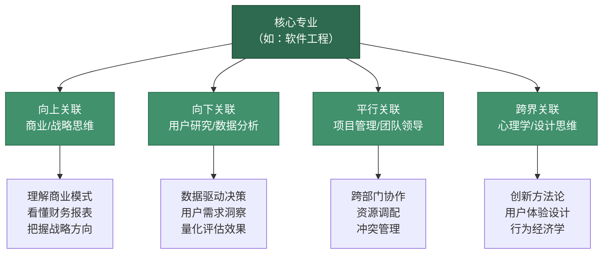
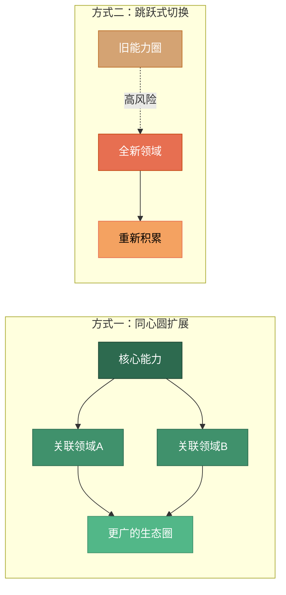
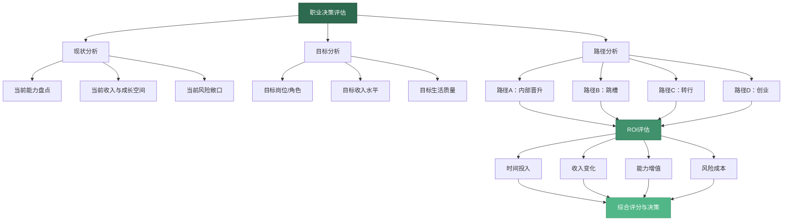
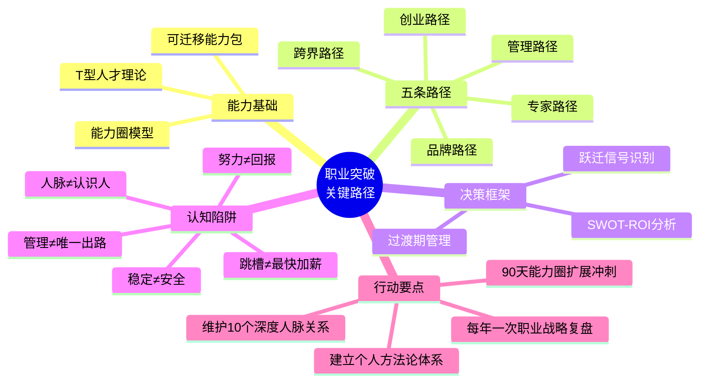

## 五、职业突破的关键路径

30-40岁是职业生涯的**分水岭**。你在20多岁时积累的专业基础、行业认知和人脉资源，到了这个阶段需要完成一次质变——从"卖时间"转向"卖价值"，从"做得好"转向"想得对"和"带得动"。这次质变不是自然发生的，它需要清晰的路径设计和有意识的能力构建。

本节将系统拆解职业突破的理论框架，帮你识别自己当前所处的位置，找到最适合自己的突破路径，并避开那些让无数人在30多岁陷入职业瓶颈的认知陷阱。

### 5.1 T型人才理论：职业突破的能力结构基础

#### 5.1.1 什么是T型人才

T型人才理论最早由麦肯锡公司提出，后被IDEO设计公司广泛传播。这个理论用字母"T"的形状来描述理想的能力结构：

- **横杠（—）**代表知识的广度——你对多个领域都有基本的理解和认知
- **竖杠（|）**代表专业深度——你在某个核心领域拥有精深的专业能力

```text
    ←————— 广度：跨领域知识 —————→
    管理  财务  技术  市场  人力  法务
    ─────────────────┬──────────────
                     │
                     │  深度：核心专业
                     │
                     │  行业洞察
                     │
                     │  方法论体系
                     │
                     │  实战经验
                     │
                     ▼
```

为什么30-40岁必须成为T型人才？因为纯专才（只有竖杠）在30岁之后面临严重的**天花板效应**——你能解决的技术问题越来越细分，但组织需要的是能整合多领域知识解决复杂问题的人。纯通才（只有横杠）则面临**可替代性风险**——什么都知道一点，但没有一项能做到极致。

#### 5.1.2 T型人才的四个进化阶段

T型能力不是一蹴而就的，它有明确的进化路径：

| 阶段 | 形态 | 典型年龄 | 能力特征 | 收入模式 |
|:---:|:---:|:---:|------|:---:|
| 第一阶段 | I型（专才） | 22-28岁 | 单一领域深入，执行力强 | 卖时间 |
| 第二阶段 | T型初阶 | 28-32岁 | 一专多能，开始跨领域学习 | 卖专业 |
| 第三阶段 | T型高阶 | 32-37岁 | 深度+广度兼备，能整合资源 | 卖方案 |
| 第四阶段 | π型/梳型 | 37-45岁 | 多个深度领域，战略视野 | 卖判断力 |

30-40岁的核心任务是从第二阶段推进到第三阶段。具体来说，你需要在保持核心专业深度的同时，至少在2-3个关联领域建立"够用"的认知水平。

#### 5.1.3 构建T型能力的实操方法

**纵向深化：建立专业护城河**

专业深度不是工作年限的自然产物。一个工作10年的人，可能只是把第一年的经验重复了10次。真正的深度来自三个维度：

1. **方法论沉淀**：把你解决过的问题抽象成可复用的方法论。比如，一个资深产品经理不只是"做过很多产品"，而是能清晰地说出"从0到1的产品验证五步法""用户增长的三个杠杆点"等方法论框架。

2. **案例库积累**：系统性地记录和复盘你的关键决策。每个重要项目结束后，花1小时写一份"决策复盘文档"——当时面临什么选择、你选了什么、为什么、结果如何、如果重来会怎么做。10年积累下来，这份案例库就是你最核心的职业资产。

3. **行业认知深度**：不仅知道自己岗位的事，还要理解整个行业的价值链——上游供应商的逻辑、下游客户的决策机制、竞争对手的策略、监管政策的走向。这种行业认知深度是AI无法替代的。

**横向拓展：建立跨领域连接**

横向拓展不是"什么都学一点"，而是有策略地选择与核心能力形成**协同效应**的领域：



横向拓展的优先级判断标准：**这个知识能否让我在核心领域创造更大的价值？**如果答案是"能"，优先学；如果答案是"只是有趣"，放到休闲时间。

### 5.2 能力圈模型：知道自己"能做什么"比"想做什么"更重要

#### 5.2.1 能力圈的三层结构

投资大师沃伦·巴菲特提出的"能力圈"（Circle of Competence）概念，同样适用于职业发展。你的能力圈由三层同心圆构成：

```text
┌─────────────────────────────────────────────┐
│  外层：认知圈（你知道存在的领域）              │
│  ┌─────────────────────────────────────┐     │
│  │  中层：学习圈（你正在学习的领域）     │     │
│  │  ┌─────────────────────────────┐     │     │
│  │  │  核心：能力圈              │     │     │
│  │  │  （你能创造卓越价值的领域） │     │     │
│  │  └─────────────────────────────┘     │     │
│  └─────────────────────────────────────┘     │
└─────────────────────────────────────────────┘
```

- **核心能力圈**：你在这个领域不仅能完成任务，还能创造超出预期的价值。别人遇到这个领域的问题会第一时间想到你。
- **学习圈**：你对这些领域有基础认知，正在系统性地学习和实践，但还没有达到能独立创造卓越价值的程度。
- **认知圈**：你知道这些领域的存在，了解基本概念，但不具备实操能力。

#### 5.2.2 能力圈与职业突破的关系

职业突破的本质是**能力圈的扩展与跃迁**。但扩展方式有两种，效果截然不同：

**方式一：同心圆扩展（推荐）**
从核心能力圈向外逐步扩展。先在核心领域建立绝对优势，再向关联领域延伸。这种方式的风险低、确定性高，因为你在扩展过程中始终有核心能力作为"安全垫"。

**方式二：跳跃式切换（高风险）**
放弃现有能力圈，进入一个全新的领域。比如从程序员转行做销售，从金融行业跳到互联网。这种方式的风险极高，因为你需要从零开始积累，而在30-40岁，你承受不起太长的"收入低谷期"。



#### 5.2.3 识别和扩展能力圈的四步法

**第一步：能力盘点**

列出你所有的工作技能，按以下维度评分（1-5分）：

| 技能名称 | 熟练度 | 市场需求 | 稀缺性 | 热情度 | 综合得分 |
|------|:---:|:---:|:---:|:---:|:---:|
| 示例：数据分析 | 4 | 5 | 3 | 4 | 4.0 |
| 示例：团队管理 | 3 | 4 | 3 | 3 | 3.25 |
| 示例：公开演讲 | 2 | 3 | 2 | 4 | 2.75 |

综合得分 = (熟练度 × 0.3 + 市场需求 × 0.3 + 稀缺性 × 0.2 + 热情度 × 0.2)

得分4.0以上的技能属于你的核心能力圈，3.0-4.0属于学习圈，3.0以下属于认知圈。

**第二步：市场需求验证**

你的能力再强，如果市场不需要，也无法变现。验证方法：
- 在招聘网站搜索相关岗位，统计需求量和薪资范围
- 与行业猎头交流，了解市场对你这类能力的真实需求
- 观察你所在行业的头部公司，他们最缺什么人才

**第三步：找到扩展方向**

能力圈扩展的最佳方向是**核心能力与市场需求的交叉地带**：

| | 市场需求高 | 市场需求低 |
|:---:|:---:|:---:|
| **你能力强** | 核心变现区（深耕） | 兴趣保留区（维持） |
| **你能力弱** | 重点发展区（扩展） | 放弃区（忽略） |

重点发展区就是你能力圈扩展的优先方向。

**第四步：制定扩展计划**

每个扩展方向需要一个90天冲刺计划：

- **第1-30天（输入期）**：系统学习该领域的基础理论，阅读3-5本核心书籍，完成1-2门在线课程
- **第31-60天（实践期）**：在工作中寻找应用机会，主动承担相关项目，或者通过副业/志愿者方式实践
- **第61-90天（输出期）**：将学习成果输出为可展示的成果——一份分析报告、一个内部分享、一篇专业文章

### 5.3 职业突破的五条关键路径

30-40岁的职业突破并非只有一条路。根据你的能力结构、风险偏好和人生目标，有五条截然不同的路径可供选择。

#### 5.3.1 路径一：从执行者到管理者

这是最传统也最常见的职业突破路径。你从"自己干得好"转向"让团队干得好"。

**跃迁的核心挑战**

执行者和管理者需要的能力完全不同。很多技术骨干升任管理者后表现平庸，不是因为他们不够聪明，而是因为管理需要一套全新的能力系统：

| 维度 | 执行者思维 | 管理者思维 |
|------|------|------|
| 价值来源 | 个人产出 | 团队整体产出 |
| 时间分配 | 80%做事+20%沟通 | 30%做事+50%沟通+20%思考 |
| 成功标准 | 任务完成质量 | 团队目标达成率 |
| 核心技能 | 专业深度 | 领导力、沟通力、决策力 |
| 反馈周期 | 短（天/周） | 长（月/季度） |
| 风险承受 | 个人风险 | 团队风险 |

**管理者能力的五个支柱**

1. **目标管理**：能把模糊的战略方向拆解成团队可执行的具体目标。掌握OKR（目标与关键结果）或KPI体系的设计与落地。
2. **人才管理**：能识别、招聘、培养和留住优秀人才。30多岁的管理者最常见的错误是只关注业务而忽视团队建设。
3. **沟通管理**：能向上管理（向领导汇报和争取资源）、向下管理（激励和指导团队）、横向管理（跨部门协作）。
4. **决策管理**：能在信息不完整的情况下做出合理的决策，并承担决策后果。
5. **自我管理**：能管理自己的情绪、精力和时间。管理者的崩溃往往不是因为业务压力，而是因为情绪失控。

**典型跃迁时间线**

```text
28-30岁：技术骨干，开始带1-2人的小项目
    ↓
30-33岁：一线经理，管理5-10人团队
    ↓
33-36岁：中层管理者，管理多个团队（20-50人）
    ↓
36-40岁：高级管理者/总监，管理部门（50-200人）
```

**关键转折点**：从一线经理到中层管理者。一线经理仍然深度参与业务，但中层管理者需要"通过他人达成目标"——这是最痛苦也最关键的能力跃迁。很多管理者在35岁左右卡在这一步，因为他们无法放手让下属去做自己能做得更好的事。

#### 5.3.2 路径二：从专业者到行业专家

不是每个人都适合做管理。如果你的核心热情在于解决复杂问题而非管理团队，那么"专家路径"可能更适合你。

**专家的三级进化**

| 级别 | 称号 | 价值来源 | 年收入参考 | 典型特征 |
|:---:|------|------|:---:|------|
| L1 | 资深专业者 | 解决已知问题的效率 | 30-60万 | 熟练掌握行业工具和流程 |
| L2 | 领域专家 | 解决未知问题的能力 | 60-150万 | 能定义问题、设计方案、推动落地 |
| L3 | 行业权威 | 定义行业标准和方向 | 150万+ | 能影响行业走向、被同行引用和追随 |

**从L1到L2的关键跃迁**

L1到L2的核心区别不是"知道更多"，而是**从"解题者"变为"出题者"**。L1解决别人定义好的问题，L2自己发现和定义问题。

具体方法：
1. **建立个人方法论体系**：把你解决复杂问题的过程提炼成可教授的方法论。这不仅帮你自己理清思路，也是建立专业影响力的基础。
2. **主动定义问题**：不要等领导或客户给你需求。主动发现组织或行业中的痛点，提出解决方案，推动落地。
3. **跨项目复盘**：不要只复盘单个项目，要跨项目寻找模式——为什么类似的问题反复出现？根本原因是什么？如何系统性地解决？

**从L2到L3的关键跃迁**

L2到L3的核心区别是**从"被需要"变为"被追随"**。L2是组织里解决问题的人，L3是行业内定义方向的人。

具体方法：
1. **输出行业洞见**：定期发表行业分析、趋势预测、方法论文章。不是写公众号鸡汤，而是有深度、有数据、有独立判断的专业内容。
2. **参与行业标准制定**：加入行业协会、参与标准制定、在行业会议上发表演讲。
3. **培养下一代专家**：真正的行业权威不是独占知识，而是通过培养人才来扩大自己的影响力网络。

**专家路径的收入模型**

专家路径的收入天花板不一定低于管理路径。关键在于你如何将专业能力**产品化**：

- **咨询收入**：按小时或按项目收费，资深行业专家的咨询费率可达3000-10000元/小时
- **培训收入**：企业内训、公开课、在线课程，单场培训费可达2-10万元
- **内容收入**：专栏、书籍、付费社群，建立持续的被动收入
- **顾问/独立董事**：以行业专家身份担任多家公司的顾问或独立董事

#### 5.3.3 路径三：从雇员到创业者

创业是风险最高但潜在回报也最大的职业突破路径。30-40岁创业的优势在于：你有足够的行业积累、人脉资源和判断力来降低创业的盲目性。

**创业的三种模式**

| 模式 | 含义 | 风险等级 | 启动条件 | 收入特征 |
|------|------|:---:|------|------|
| 副业创业 | 在职期间启动，验证后再全职 | 低 | 时间+技能 | 初期兼职收入 |
| 平台创业 | 加入创业公司担任合伙人/高管 | 中 | 行业资源+管理能力 | 低底薪+股权 |
| 独立创业 | 离职后全身心投入 | 高 | 资金+团队+商业计划 | 不确定，可能为零 |

**30-40岁创业的理性决策框架**

创业不应该是一个"热血冲动"的决定，而应该是一个经过理性分析的战略选择。以下是决策框架：

```text
创业决策矩阵
━━━━━━━━━━━━━━━━━━━━━━━━━━━━━━━━━━━━━━━━
[必须满足的条件] —— 缺一不可
  ✓ 你识别了一个真实的市场需求（不是你觉得需要，是市场证明需要）
  ✓ 你有能力满足这个需求（核心团队+技术/资源）
  ✓ 你的财务跑道至少12个月（家庭开支+创业启动资金）
  ✓ 你的家庭支持你的决定（配偶的理解是最大的隐性资源）

[加分条件] —— 越多越好
  + 你已经有付费客户或意向客户
  + 你的创业方向与你的核心能力圈高度重合
  + 你有可信赖的合伙人（互补型，而非相似型）
  + 你对失败有心理准备和应对方案
━━━━━━━━━━━━━━━━━━━━━━━━━━━━━━━━━━━━━━━━
```

**创业与职业发展的关系**

即使创业失败，30-40岁的创业经历也不会"白费"。创业过程中培养的商业思维、资源整合能力和抗压能力，会让你在回归职场后具备更强的竞争力。关键是：**不要在创业过程中烧光所有积蓄**。保留足够的"安全垫"，让自己即使失败也能体面地重新开始。

#### 5.3.4 路径四：跨界融合——行业×功能的矩阵突破

在今天的职业市场中，最有竞争力的人才往往不是"纯专才"或"纯通才"，而是**跨界融合型人才**——他们在两个或多个领域的交叉点上创造了独特的价值。

**跨界融合的公式**

```text
职业竞争力 = 行业知识 × 功能技能 × 独特视角
```

举例：
- 金融 × 技术 × 用户体验 = 金融科技产品经理（FinTech PM）
- 医疗 × 数据科学 × 商业 = 医疗数据商业化专家
- 教育 × 内容运营 × 心理学 = 教育内容产品设计专家

每个领域的单项能力可能有很多人比你强，但在交叉点上，你可能是唯一一个或极少数人。这种**稀缺性**就是你的职业护城河。

**跨界融合的三个策略**

1. **行业迁移**：带着你的核心能力进入一个新行业。比如，一个在传统零售行业做了8年的运营专家，带着成熟的运营方法论进入新零售或跨境电商——你的运营能力是通用的，但新行业急需有经验的人。
2. **功能叠加**：在现有行业内增加一个新的功能维度。比如，一个软件工程师学习产品设计，成为一个"能写代码的产品经理"或"懂产品的技术负责人"。
3. **视角创新**：用A行业的方法论解决B行业的问题。比如，用互联网的"增长黑客"方法论解决传统制造业的获客问题。

#### 5.3.5 路径五：个人品牌化——从"被找到"到"被追随"

在信息爆炸的时代，"酒香也怕巷子深"。30-40岁是建立个人品牌的最佳时机——你有足够的专业积累来输出有价值的内容，同时还有足够长的职业生涯来享受品牌红利。

**个人品牌的底层逻辑**

个人品牌不是"自我营销"或"打造人设"，而是**系统性地展示你的专业能力和价值主张**。它的核心是三个问题：

1. **你是谁？**（你的专业身份和核心能力）
2. **你能解决什么问题？**（你的价值主张）
3. **为什么应该信任你？**（你的证明材料——案例、成果、口碑）

**个人品牌建设的四层金字塔**

```text
            ┌──────────┐
            │  行业权威  │  ← 出书、演讲、顾问
            │ （被追随） │
          ┌─┴──────────┴─┐
          │   领域专家    │  ← 深度文章、行业报告
          │  （被引用）   │
        ┌─┴──────────────┴─┐
        │    内容创作者     │  ← 专栏、视频、社群
        │   （被关注）      │
      ┌─┴──────────────────┴─┐
      │      专业执行者       │  ← 项目成果、客户评价
      │      （被认可）       │
      └──────────────────────┘
```

每一层都是下一层的基础。你不能跳过"被认可"直接成为"行业权威"——没有扎实的专业成果作为支撑，所谓的"个人品牌"只是空中楼阁。

**个人品牌的变现路径**

个人品牌的价值不仅在于"知名度"，更在于它能为你创造**可量化的经济价值**：

- **职业机会**：好的个人品牌会让你收到更多高质量的工作机会，而不必主动投简历。据LinkedIn数据，拥有活跃个人品牌的职场人士，收到猎头联系的频率是普通人的3-5倍。
- **议价能力**：当你的专业能力被行业广泛认可时，你在薪资谈判中拥有更强的议价权。
- **副业收入**：个人品牌是副业的流量入口。咨询、培训、内容付费等副业模式都依赖于你的专业影响力。
- **创业基础**：如果你未来选择创业，个人品牌就是你的"零成本获客渠道"。

### 5.4 职业跃迁的时机判断与决策框架

#### 5.4.1 识别"跃迁信号"

职业突破不是你想突破就能突破的，它需要合适的时机。以下是五个信号，表明你正处于跃迁窗口期：

**信号一：成长曲线趋于平缓**

如果你在同一岗位上连续12-18个月没有明显的能力成长或新的挑战，说明你已经"吃透"了当前角色的营养。继续待下去不会让你变得更强，只会让你变得更舒适——而舒适是职业发展最大的敌人。

**信号二：市场对你的估值高于当前雇主**

当猎头频繁联系你、同行公司愿意开出高30%以上的薪资来挖你时，说明市场认为你的价值被低估了。这时你需要认真评估：是当前平台限制了你的发展，还是你只需要一次内部谈判来重新定价。

**信号三：你开始对"更大的问题"感兴趣**

如果你的关注点从"怎么把这个功能做好"转向"我们应该做什么产品"或"这个行业未来会怎样"，说明你的认知已经在向更高层级跃迁。这时你需要一个能匹配你新认知水平的角色。

**信号四：你积累了足够的"可迁移资产"**

可迁移资产包括：行业人脉网络、个人方法论体系、行业认知深度、可展示的成功案例。当这些资产积累到一定程度时，跃迁的风险会显著降低——因为你即使失败，也有"退路"。

**信号五：外部环境出现结构性变化**

行业政策变化、技术革新、市场格局重组等外部变化，会创造大量的新机会。在这些变化面前，所有人几乎站在同一起跑线上——这对你来说是弯道超车的最佳时机。

#### 5.4.2 职业决策的SWOT-ROI分析框架

传统的SWOT分析过于定性，无法帮你做出具体的决策。这里引入一个结合ROI（投资回报率）思维的改良框架：



每条路径的综合评分公式：

```text
路径吸引力 = (收入提升预期 × 0.3 + 能力增值预期 × 0.3 + 生活质量改善 × 0.2) / (时间投入 × 0.1 + 风险成本 × 0.1)
```

评分最高的路径不一定就是你应该选择的路径——如果你的风险承受能力较低，可能需要选择评分第二但风险更小的路径。关键是**让决策过程从"感觉"变为"分析"**。

#### 5.4.3 跃迁过渡期的管理策略

职业跃迁不是瞬间完成的，它有一个过渡期。在这个过渡期中，你需要同时管理"旧角色的收尾"和"新角色的准备"。

**过渡期的三个阶段**

| 阶段 | 时长 | 核心任务 | 关键风险 |
|------|------|------|------|
| 试探期 | 1-3个月 | 探索新方向，验证假设 | 犹豫不决，错过时机 |
| 准备期 | 3-6个月 | 积累新能力，建立新关系 | 精力分散，两边都做不好 |
| 切换期 | 1-3个月 | 正式切换角色，快速适应 | 适应压力，自我怀疑 |

**过渡期的财务管理**

职业跃迁期往往伴随着收入波动。你需要在跃迁前做好以下财务准备：

1. **应急基金**：至少覆盖6-12个月家庭开支的现金储备
2. **保险保障**：确保在跃迁期间（尤其是创业或自由职业阶段）保险不中断
3. **负债控制**：跃迁前尽量降低不必要的负债，减少固定支出压力
4. **配偶沟通**：与配偶达成共识，明确跃迁期间的家庭财务安排

### 5.5 职业突破中的常见认知陷阱

#### 陷阱一："努力就会有回报"

这是最常见也最危险的认知陷阱。在职场中，**方向比努力更重要**。一个在夕阳行业拼命加班的人，其收入增长可能远不如一个在风口行业正常工作的人。30-40岁最需要的不是"更努力"，而是"更聪明地选择"。

**纠正方法**：每年花1-2天做一次"职业战略复盘"。问自己：我目前的努力方向，是否指向一个有增长空间的市场？如果不是，我需要调整方向还是调整方法？

#### 陷阱二："稳定就是安全"

很多人在30多岁选择"稳定"——不跳槽、不冒险、不改变。但真正的稳定不是"待在同一个地方不动"，而是**拥有随时能找到同等或更好机会的能力**。在AI快速发展的时代，一个岗位的"稳定"可能在18个月内被打破。

**纠正方法**：建立"可迁移能力包"——无论外部环境如何变化，你都能凭借以下能力快速找到新机会：
- 核心专业能力（你的"一技之长"）
- 沟通与协作能力（跨团队、跨文化的工作能力）
- 学习能力（快速掌握新知识和新技能的能力）
- 人脉网络（行业内的关系网络）

#### 陷阱三："管理路径是唯一出路"

很多公司在设计晋升通道时，只有"管理"一条路。这让很多优秀的技术专家被迫走上管理岗位，结果既丢掉了专业优势，又没有真正掌握管理能力。

**纠正方法**：主动与公司沟通"双通道"发展路径——管理通道（M序列）和专业通道（P序列）。如果公司没有专业通道，你可以通过以下方式创造自己的"专家路径"：
- 成为公司的内部培训师
- 参与行业标准制定或技术评审
- 在外部建立专业影响力（写文章、做演讲）

#### 陷阱四："跳槽是加薪最快的方式"

跳槽确实能在短期内带来薪资提升（通常15-30%），但频繁跳槽会损害你的长期职业发展。每份工作不到2年就跳槽的人，很难获得真正有深度的项目经验和管理经验。

**纠正方法**：遵循"3年原则"——每份工作至少做满3年。第1年是学习期（熟悉业务和团队），第2年是贡献期（创造显著价值），第3年是收获期（获得晋升或更大的职责）。如果3年后仍然没有成长空间，再考虑跳槽。

#### 陷阱五："人脉就是认识很多人"

很多人把"人脉建设"理解为"多参加活动、多加微信"。但真正有价值的人脉不是"认识多少人"，而是**有多少人在关键时刻愿意为你背书或提供帮助**。

**纠正方法**：把人脉建设的重心从"广度"转向"深度"。维护10个深度关系（互相信任、互相帮助的同行或前辈），比认识1000个"点赞之交"更有价值。具体方法：
- 定期与行业前辈交流（每季度至少1次深度对话）
- 主动帮助同行解决问题（先付出，后收获）
- 加入高质量的行业社群（筛选门槛高的社群，成员质量通常更高）

### 5.6 五条路径的对比与选择

不同的人适合不同的路径。以下框架帮你快速判断哪条路径最适合自己：

| 评估维度 | 路径一：管理 | 路径二：专家 | 路径三：创业 | 路径四：跨界 | 路径五：品牌 |
|:---:|:---:|:---:|:---:|:---:|:---:|
| 核心能力要求 | 领导力+沟通力 | 专业深度+方法论 | 商业嗅觉+执行力 | 学习力+整合力 | 表达力+专业力 |
| 风险等级 | 中低 | 低 | 高 | 中 | 中低 |
| 收入天花板 | 高 | 中高 | 极高 | 高 | 中高 |
| 工作生活平衡 | 差 | 中 | 差 | 中 | 好 |
| 适合的性格 | 外向、善于协调 | 专注、追求极致 | 冒险、自驱力强 | 好奇心强、适应力强 | 善于表达、有感染力 |
| 可叠加性 | 可叠加路径二/五 | 可叠加路径五 | 可叠加路径一/二 | 可叠加路径五 | 可叠加路径二/四 |

**关键洞察**：这五条路径不是互斥的。最成功的职业突破往往是**多条路径的组合**——比如"专家+个人品牌"（成为行业KOL）、"管理+创业"（带着管理经验创业）、"跨界+专家"（在交叉领域成为稀缺人才）。

选择路径时，不要问"哪条路最好"，而要问"哪条路最适合我现在的处境和长期目标"。最好的路径是：**你有能力走、有热情走、市场有需求的那条路**。

### 5.7 本节核心框架总结



> **记住：30-40岁的职业突破不是一次性的事件，而是一个持续的过程。你需要做的不是找到"正确的路"然后一路走到底，而是在前进的过程中不断调整方向、积累能力、把握时机。最好的职业策略是：保持核心能力的持续深化，同时对新机会保持开放和敏锐。**
