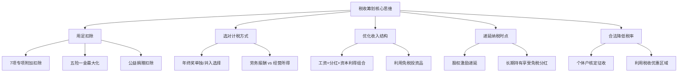

## 七、税收筹划基础

### 1. 为什么30-40岁必须懂税收筹划

30-40岁是收入增长最快的阶段，也是税负从"无所谓"变成"肉疼"的阶段。月薪从1万涨到3万，个税从几百变成几千；年终奖从一个月工资变成数万元，税差可以达到数千元；开始有股权激励、兼职收入、投资收益，每一项都有不同的税务处理方式。

**税收筹划的核心定义**：在法律允许的范围内，通过对经营、投资、理财等活动的事先安排和规划，充分利用税法提供的优惠和差别待遇，以减轻税负、递延纳税、降低税务风险的合法行为。

关键区分——

| 概念 | 定义 | 性质 | 后果 |
|------|------|------|------|
| **税收筹划** | 在税法框架内优化纳税方案 | 合法 | 受法律保护 |
| **避税** | 利用税法漏洞减少税负 | 合法但不合理 | 可能被堵漏 |
| **逃税** | 隐瞒收入、虚开发票等 | 违法 | 补税+罚款+刑责 |
| **抗税** | 以暴力手段拒绝纳税 | 严重违法 | 刑事责任 |

本文所有方法均属于合法的税收筹划范畴。

### 2. 中国个人所得税体系全景

#### 2.1 综合所得税率表（2024年适用）

中国个税采用超额累进税率，综合所得（工资薪金、劳务报酬、稿酬、特许权使用费）适用以下税率：

| 级数 | 全年应纳税所得额 | 税率 | 速算扣除数 |
|------|-----------------|------|-----------|
| 1 | 不超过36,000元 | 3% | 0 |
| 2 | 36,000-144,000元 | 10% | 2,520 |
| 3 | 144,000-300,000元 | 20% | 16,920 |
| 4 | 300,000-420,000元 | 25% | 31,920 |
| 5 | 420,000-660,000元 | 30% | 52,920 |
| 6 | 660,000-960,000元 | 35% | 85,920 |
| 7 | 超过960,000元 | 45% | 181,920 |

**应纳税所得额 = 综合所得收入额 - 6万元基本减除 - 专项扣除 - 专项附加扣除 - 其他扣除**

#### 2.2 其他所得类型及税率

| 所得类型 | 税率 | 计税方式 |
|----------|------|----------|
| 经营所得 | 5%-35%超额累进 | 收入-成本-费用 |
| 利息、股息、红利 | 20% | 按次计征 |
| 财产租赁 | 20%（住房10%） | 收入-费用 |
| 财产转让 | 20% | 转让收入-原值-费用 |
| 偶然所得 | 20% | 按次计征 |

#### 2.3 综合所得年度汇算清缴

每年3月1日至6月30日进行上一年度汇算清缴。核心公式：

```text
年度应退（补）税额 = [(综合所得收入额 - 60000 - 专项扣除 - 专项附加扣除
                      - 其他扣除 - 公益慈善捐赠) × 税率 - 速算扣除数]
                     - 已预缴税额
```

**汇算清缴常见结果**：
- 退税：年中换工作、有劳务报酬预扣率高于综合税率、专项附加扣除未及时申报
- 补税：多处取得工资、年中入职导致基本减除重复享受

### 3. 七大专项附加扣除深度解析

专项附加扣除是税收筹划中**最基础、最普适、风险最低**的工具，务必用足。

#### 3.1 子女教育

- **扣除标准**：每个子女每月2,000元（2023年9月起提至2,000，此前为1,000）
- **适用范围**：年满3岁至博士研究生，境内境外均可
- **扣除方式**：父母各扣50%，或一方扣100%
- **筹划要点**：让收入高、税率高的一方全额扣除。例如丈夫适用25%税率、妻子适用10%税率，由丈夫扣除每年可多省 24,000 × (25%-10%) = 3,600元

#### 3.2 继续教育

- **学历（学位）继续教育**：每月400元，最长48个月
- **职业资格继续教育**：取得证书当年一次性扣3,600元
- **筹划要点**：30-40岁正是考取各类职业资格的高峰期（CPA、法考、一建等），每个证书省税 3,600 × 对应税率。即使不为减税，考证本身也是增值，税务优惠相当于额外激励

#### 3.3 大病医疗

- **扣除标准**：医保目录内自付部分累计超过15,000元的，在80,000元限额内据实扣除
- **扣除方式**：本人或配偶扣除，未成年子女由父母扣除
- **注意**：只能在年度汇算清缴时扣除，平时预扣不能用

#### 3.4 住房贷款利息

- **扣除标准**：每月1,000元
- **适用条件**：首套住房贷款，最长240个月
- **筹划要点**：
  - 夫妻婚前各有首套房贷，婚后可选择其中一套，由购买方扣100%或双方各扣50%
  - 与住房租金扣除不可同时享受，需选择更有利的方案
  - 若一方在工作城市有房、另一方租房，有房一方扣贷款利息，租房一方不能扣租金

#### 3.5 住房租金

- **扣除标准**：直辖市/省会/计划单列市1,500元/月；市辖区户籍人口>100万的1,100元/月；其他800元/月
- **适用条件**：本人及配偶在主要工作城市无自有住房
- **筹划要点**：选择扣除标准时按工作城市确认，不要填错城市档次

#### 3.6 赡养老人

- **扣除标准**：独生子女每月3,000元；非独生子女分摊每月3,000元，每人不超过1,500元
- **适用条件**：被赡养人年满60周岁
- **2023年新变化**：扣除标准从每月2,000元提高到3,000元
- **筹划要点**：
  - 非独生子女之间可以约定分摊比例（书面协议），让收入最高、税率最高的人多分摊
  - 约定分摊优先于均摊，但需要签订书面协议留存备查

#### 3.7 3岁以下婴幼儿照护

- **扣除标准**：每个婴幼儿每月2,000元（2023年9月起提至2,000）
- **扣除方式**：父母各扣50%，或一方扣100%
- **筹划要点**：与子女教育扣除逻辑一致，由高税率方全额扣除

**专项附加扣除优化组合示例**：

| 场景 | 可用扣除项 | 年扣除总额 | 适用25%税率时年省税 |
|------|-----------|-----------|-------------------|
| 已婚有1孩、有房贷、赡养父母 | 子女教育+房贷利息+赡养老人 | 72,000元 | 18,000元 |
| 已婚有2孩、租房、赡养父母 | 子女教育×2+住房租金+赡养老人 | 90,000元 | 22,500元 |
| 单身、有房贷、继续教育 | 房贷利息+继续教育 | 16,800元 | 4,200元 |
| 已婚有3孩（含1个婴幼儿）、有房贷、赡养父母、继续教育 | 子女教育×2+婴幼儿照护+房贷利息+赡养老人+继续教育 | 112,800元 | 28,200元 |

### 4. 年终奖计税：单独计税 vs 并入综合所得

#### 4.1 政策背景

全年一次性奖金可选择单独计税（不并入综合所得），政策延续至2027年12月31日。

#### 4.2 单独计税方法

将年终奖除以12个月，按月度税率表确定税率和速算扣除数：

| 月均奖金 | 税率 | 速算扣除数 |
|----------|------|-----------|
| ≤3,000 | 3% | 0 |
| 3,000-12,000 | 10% | 210 |
| 12,000-25,000 | 20% | 1,410 |
| 25,000-35,000 | 25% | 2,660 |
| 35,000-55,000 | 30% | 4,410 |
| 55,000-80,000 | 35% | 7,160 |
| >80,000 | 45% | 15,160 |

**应纳税额 = 年终奖 × 适用税率 - 速算扣除数**

#### 4.3 关键陷阱：年终奖的"雷区"

单独计税存在"多发一块钱、多交几千税"的陷阱：

| 年终奖金额 | 税额 | 税后收入 | 陷阱分析 |
|-----------|------|---------|---------|
| 36,000元 | 1,080元 | 34,920元 | 正常 |
| 36,001元 | 3,390元 | 32,611元 | 多发1元，税后少2,309元 |
| 144,000元 | 14,190元 | 129,810元 | 正常 |
| 144,001元 | 27,390元 | 116,611元 | 多发1元，税后少13,199元 |
| 300,000元 | 58,590元 | 241,410元 | 正常 |
| 300,001元 | 72,340元 | 227,661元 | 多发1元，税后少13,749元 |
| 420,000元 | 103,990元 | 316,010元 | 正常 |
| 420,001元 | 127,840元 | 292,161元 | 多发1元，税后少23,849元 |

**年终奖"临界点"**：36,000 / 144,000 / 300,000 / 420,000 / 660,000 / 960,000

**实操建议**：与HR确认年终奖发放方案，如果金额恰好在临界点附近，宁可少拿一点（差额部分通过其他形式补偿，如福利、培训预算等）。

#### 4.4 单独计税 vs 并入综合所得的选择策略

**核心判断逻辑**：

```text
如果综合所得应纳税所得额 ≤ 0（扣除后为负或为零）
  → 并入综合所得更优（利用剩余扣除额度抵扣年终奖）

如果综合所得应纳税所得额 > 0
  → 分别计算两种方案的税额，取较低者
```

**典型场景对比**：

| 场景 | 年薪 | 年终奖 | 扣除总额 | 单独计税税额 | 并入综合所得税额 | 更优方案 |
|------|------|--------|---------|-------------|----------------|---------|
| 扣除充足 | 20万 | 5万 | 15万 | 1,440元 | 480元 | 并入 |
| 扣除一般 | 30万 | 8万 | 10万 | 7,480元 | 12,480元 | 单独 |
| 高收入 | 50万 | 15万 | 12万 | 14,190元 | 26,190元 | 单独 |
| 超高收入 | 80万 | 30万 | 15万 | 58,590元 | 78,990元 | 单独 |

**规律**：扣除额度充裕时并入更省；扣除额度紧张时单独计税更省。每年汇算清缴时都可以重新选择，不必在年初决定。

### 5. 社保与公积金的税务优化

#### 5.1 "五险一金"的税务效应

社保和公积金在税前扣除，本身不产生个税。但缴纳基数和比例的选择会影响到手收入和税负。

**公积金的特殊地位**：
- 公积金单位和个人缴纳部分均免个税
- 公积金存款利率1.5%（高于银行活期）
- 公积金贷款利率3.1%（远低于商贷4.2%+）
- 提取条件宽松（购房、租房、退休等）

**筹划建议**：在政策允许范围内（5%-12%），尽量提高公积金缴纳比例。虽然到手现金减少，但综合考虑免税、低息贷款、单位等额缴纳等因素，公积金的实际回报率远高于表面利率。

#### 5.2 补充公积金与企业年金

- **补充公积金（补充住房公积金）**：部分城市允许，税前扣除，进一步增加免税福利
- **企业年金**：个人缴费不超过本人缴费工资计税基数的4%标准内，暂从应纳税所得额中扣除

### 6. 投资理财中的税收筹划

#### 6.1 不同投资品的税负对比

| 投资品 | 所得税 | 增值税 | 印花税 | 综合税负 |
|--------|--------|--------|--------|---------|
| 银行存款利息 | 0%（免征） | — | — | 0% |
| 国债利息 | 0%（免征） | — | — | 0% |
| 股票转让差价 | 0%（个人免征） | — | 0.05%（卖出） | 极低 |
| 股票分红（持股>1年） | 0%（免征） | — | — | 0% |
| 股票分红（持股≤1个月） | 20% | — | — | 20% |
| 股票分红（1个月<持股≤1年） | 10% | — | — | 10% |
| 基金分红 | 0%（个人免征） | — | — | 0% |
| 基金转让差价 | 0%（个人免征） | — | — | 0% |
| 房产转让 | 20%或核定 | 视情况 | 0.05% | 5%-20% |
| 黄金实物 | 0%（暂免） | — | — | 0% |
| P2P/民间借贷利息 | 20% | — | — | 20% |

#### 6.2 投资持有期与税负优化

股票分红的持有期差异是最重要的投资税收筹划点之一：

```text
持股≤1个月：分红税20%
1个月<持股≤1年：分红税10%
持股>1年：分红税0%
```

**实操建议**：
- 高股息股票（银行、公用事业等）应考虑长期持有（>1年），享受免税分红
- 短线交易追求价差收益，分红税影响较小
- 分红登记日前后买卖需注意持有期，避免从"免税"变成"缴税"

#### 6.3 基金投资的税收优势

公募基金对个人投资者有独特的税收优惠：
- 买卖差价免征个税和增值税
- 分红免征个税
- 这使得公募基金成为个人投资中税负最低的标准化工具之一

#### 6.4 房产相关税收

**卖房**：
- "满五唯一"（持有满5年且为家庭唯一住房）免征个人所得税
- 不满五或不唯一：差额的20%或全额的1%-2%（各地不同）
- 增值税：不满2年全额5%（附加税另计），满2年免征

**买房**：
- 契税：首套房90平以下1%、90平以上1.5%；二套房1%-2%
- 通过合理安排首套/二套认定顺序优化契税

**筹划建议**：
- 卖房前确认是否满足"满五唯一"条件
- 如果有多套房，优先卖不满足免税条件的
- 夫妻间房产更名、离婚析产等方式需谨慎，虚假操作有法律风险

### 7. 副业收入与自由职业的税务处理

#### 7.1 不同副业形式的税务对比

| 收入形式 | 所得类型 | 税率 | 预扣方式 | 年终汇算 |
|----------|----------|------|----------|----------|
| 兼职劳务费 | 劳务报酬 | 20%-40%预扣 | 支付方代扣 | 并入综合所得 |
| 自由撰稿/讲课 | 劳务报酬或稿酬 | 同上（稿酬享7折） | 支付方代扣 | 并入综合所得 |
| 注册个体户接单 | 经营所得 | 5%-35% | 自行申报 | 不并入综合所得 |
| 注册个人独资企业 | 经营所得 | 5%-35% | 自行申报 | 不并入综合所得 |

#### 7.2 劳务报酬的预扣陷阱

劳务报酬预扣率远高于综合所得最终税率，是导致退税的主要原因之一：

| 每次收入额 | 预扣预缴税额 | 实际税负（若年收入20万） |
|-----------|-------------|----------------------|
| 5,000元 | 800元 | 约320元（汇算后可退480） |
| 10,000元 | 1,600元 | 约640元（汇算后可退960） |
| 20,000元 | 3,200元 | 约1,280元（汇算后可退1,920） |
| 50,000元 | 10,000元 | 约4,000元（汇算后可退6,000） |

**结论**：有大量劳务报酬收入的人，汇算清缴时大概率退税，务必在每年3-6月申报。

#### 7.3 个体户/个独企业的筹划空间

当副业收入达到一定规模（年10万以上），注册个体户或个人独资企业可能有税务优势：

- **核定征收**：部分地区对小规模个体户实行核定应税所得率（通常10%），实际税负远低于劳务报酬
- **增值税优惠**：小规模纳税人月销售额10万以下免征增值税（季度30万以下）
- **经营所得独立计税**：不与工资薪金合并，可利用两套税率表

**警告**：核定征收政策持续收紧，2021年以来大量明星、主播利用"税收洼地"注册空壳企业被查处。个体户/个独企业必须有真实业务，不能纯粹为了避税而注册空壳。

### 8. 股权激励的税务处理

#### 8.1 常见股权激励类型

| 类型 | 税目 | 计税时点 | 税率 |
|------|------|----------|------|
| 股票期权 | 工资薪金 | 行权时 | 3%-45% |
| 限制性股票 | 工资薪金 | 解禁时 | 3%-45% |
| 股票增值权 | 工资薪金 | 行权时 | 3%-45% |
| 非上市公司股权 | 财产转让 | 转让时 | 20% |

#### 8.2 上市公司股权激励优惠

符合条件的上市公司股权激励，在2027年12月31日前，不并入综合所得，全额单独适用综合所得税率表计税。这意味着可以享受更优惠的税率结构。

#### 8.3 非上市公司递延纳税

符合条件的非上市公司股权激励，可在取得股权激励时暂不纳税，递延至转让股权时按20%税率纳税。条件包括：
- 属于境内居民企业的股权激励计划
- 激励标的为本公司股权
- 激励计划经公司董事会或股东（大）会审议通过
- 持有期限不少于3年

### 9. 公益捐赠的税收筹划

#### 9.1 扣除规则

- 通过境内公益性社会组织或县级以上政府进行的公益捐赠
- 不超过应纳税所得额30%的部分可以扣除
- 向特定机构（如中国红十字基金会等）的捐赠可全额扣除

#### 9.2 筹划方法

```text
例：年应纳税所得额50万元，适用25%税率
捐赠15万元（30%上限）：
  应纳税所得额 = 50万 - 15万 = 35万
  税额 = 35万 × 25% - 31,920 = 55,580元
  不捐赠税额 = 50万 × 25% - 31,920 = 93,080元
  节税 = 93,080 - 55,580 = 37,500元
  实际捐赠成本 = 150,000 - 37,500 = 112,500元
```

相当于国家帮你"报销"了25%的捐赠。捐赠既做了好事又省了税，是高收入人群的重要筹划手段。

#### 9.3 操作要点

- 保留捐赠票据（公益事业捐赠统一票据），汇算清缴时填报
- 通过个税APP填写捐赠信息时，准确填写"捐赠凭证号"和"捐赠金额"
- 可以选择在预扣预缴时扣除（需向扣缴单位提供票据），或在汇算清缴时扣除

### 10. 税收筹划的常见误区与风险

#### 10.1 十大常见误区

| 误区 | 真相 | 风险 |
|------|------|------|
| 不申报劳务报酬就不会被查 | 金税四期大数据比对，支付方已代扣申报 | 补税+滞纳金+0.5-5倍罚款 |
| 用亲属账户收款可以避税 | 资金流水可追溯，关联交易是重点监控对象 | 补税+罚款，情节严重移送司法 |
| 年终奖单独计税一定更优 | 需要具体计算，部分情况并入更省 | 多缴税 |
| 公积金比例越高越好 | 超过12%的部分不能税前扣除 | 无税务优惠 |
| 换工作就不需要汇算 | 多处取得收入必须汇算 | 未汇算被追缴 |
| 公司报销不需要交税 | 超标福利、与收入相关的补贴需缴税 | 被认定为隐性收入 |
| 个体户不用交税 | 年收入超过免税额度仍需缴税 | 补税+罚款 |
| 投资亏损可以抵扣工资税 | 投资亏损与综合所得互不抵扣 | 不可抵扣 |
| 买房卖房可以随意定价 | 明显偏低且无正当理由会被核定 | 被税务机关重新核定 |
| 税收筹划就是少交税 | 好的筹划包括递延纳税、降低风险等 | 过度筹划适得其反 |

#### 10.2 金税四期下的风险提示

金税四期（2024年全面推行）实现了以下监控能力的跃升：

- **银行数据联网**：大额交易、可疑交易自动推送给税务机关
- **多部门数据共享**：市场监管、社保、海关、住建等数据打通
- **发票全链条监控**：虚开发票无处遁形
- **个人关联画像**：个人、家庭、关联企业的资金流向全景监控

**底线原则**：所有筹划方案必须基于真实业务、保留完整凭证、符合政策本意。任何"聪明"的避税方案在大数据面前都不堪一击。

### 11. 30-40岁税收筹划实操清单

#### 11.1 年度必做事项

- [ ] **1月**：确认上年度专项附加扣除信息，更新变化项（如新生儿、父母满60岁等）
- [ ] **1月**：与HR确认年终奖计税方式选择
- [ ] **3-6月**：完成上年度个人所得税汇算清缴
- [ ] **6月**：确认公积金缴纳基数调整（每年7月调整）
- [ ] **12月**：梳理全年收入结构，预估汇算清缴结果
- [ ] **随时**：取得公益捐赠票据后及时归档

#### 11.2 按收入水平的筹划优先级

**年收入10-20万**：
1. 用足专项附加扣除（最高可减税数千元至万元）
2. 年终奖计税方式优化
3. 公积金比例适当提高

**年收入20-50万**：
1. 上述所有基础措施
2. 副业收入的合理税务安排（劳务报酬 vs 经营所得）
3. 投资品选择的税收效率考量
4. 公益捐赠筹划

**年收入50万以上**：
1. 上述所有措施
2. 股权激励的税务规划
3. 综合考虑收入结构优化（工资+分红+资本利得的组合）
4. 专业税务顾问咨询（年省税额可能达数万元，远超咨询费用）

### 12. 个人所得税APP实操指南

#### 12.1 专项附加扣除填报路径

```text
个人所得税APP → 办&查 → 专项附加扣除填报 → 选择扣除项 → 填写信息 → 选择申报方式
```

#### 12.2 汇算清缴操作路径

```text
个人所得税APP → 办&查 → 综合所得年度汇算 → 选择年度 → 确认收入和扣除信息
→ 选择年终奖计税方式 → 提交申报 → 申请退税（绑定银行卡）
```

#### 12.3 常见操作问题

- **Q**：忘记填专项附加扣除怎么办？
  **A**：可以在汇算清缴时补充填报，多缴的税会退回

- **Q**：换了工作单位，专项附加扣除需要重新填吗？
  **A**：不需要。在APP中修改扣缴单位即可，信息自动迁移

- **Q**：夫妻双方都在不同城市工作，住房租金怎么填？
  **A**：各自在各自工作城市填报，标准按各自工作城市档次确定

### 13. 总结：税收筹划的核心思维



税收筹划不是一次性行为，而是贯穿全年的持续优化过程。30-40岁的你正处于收入上升期，现在掌握的每一个筹划技巧，都会在未来十年为你节省数万甚至数十万元。与其抱怨税高，不如花时间了解规则、用好规则。
