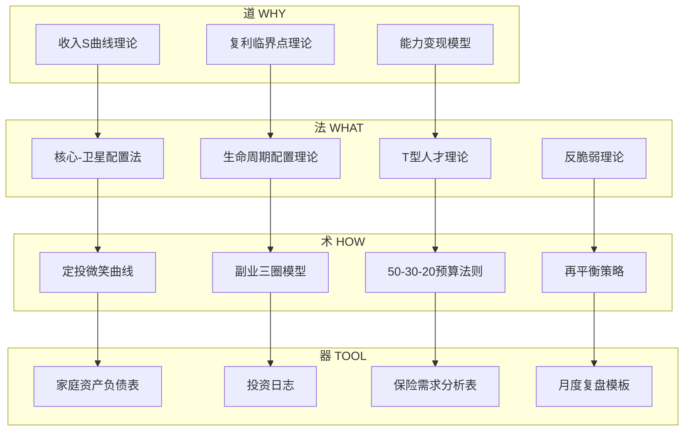
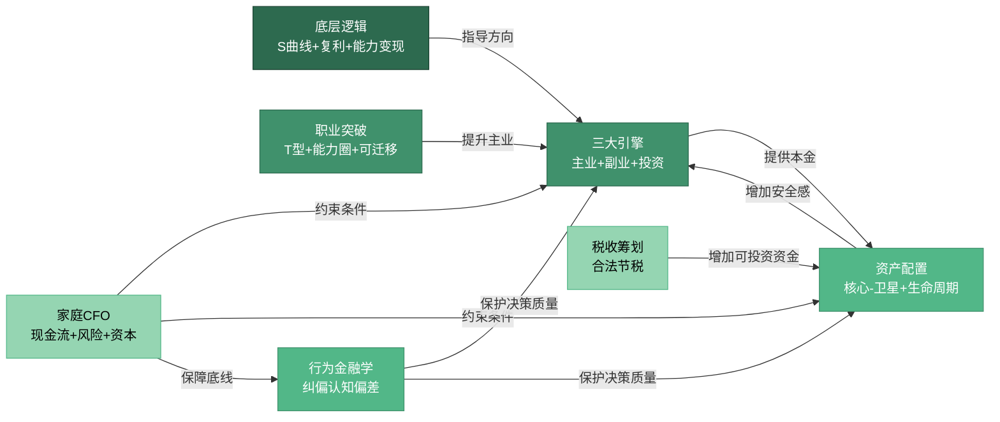

## 八、本章理论框架总结

本章理论基础部分共涉及七大理论模块：财富加速的底层逻辑、收入加速的三大引擎、资产配置的科学方法、家庭财务管理的系统框架、职业突破的关键路径、心理账户与行为金融学、税收筹划基础。本节将这些分散的理论整合为一个统一的分析框架，帮助读者建立"全景式"的理论认知——不是零散的知识点，而是一张可以反复使用的思维地图。

### 8.1 道法术器四层理论架构

本章所有理论可以按照"道法术器"四个层次组织。理解这个层次结构，比记住任何单个理论都重要——因为它决定了你在不同场景下应该调用哪一层的知识。

| 层次 | 核心问题 | 对应理论 | 产出物 |
|:---:|:---:|------|:---:|
| **道** | 为什么30-40岁是加速窗口？ | 收入S曲线理论、复利临界点理论、能力变现模型 | 战略判断力 |
| **法** | 应该遵循什么原则？ | 核心-卫星配置法、生命周期配置理论、T型人才理论、反脆弱理论 | 决策框架 |
| **术** | 具体怎么操作？ | 定投微笑曲线、副业三圈模型、50-30-20预算法则、再平衡策略 | 执行方法 |
| **器** | 用什么工具落地？ | 家庭资产负债表、投资日志、保险需求分析表、月度复盘模板 | 可执行工具 |

四层之间是"自上而下指导，自下而上验证"的关系：道指导法的方向，法约束术的范围，术决定器的选择；反过来，器的使用反馈修正术的偏差，术的实践检验法的适用性，法的迭代推动道的认知升级。

### 8.2 七大理论模块的核心要义

#### 8.2.1 财富加速的底层逻辑——"道"的基石

这是整章的理论根基，回答一个根本问题：**为什么30-40岁是财富加速的黄金窗口？**

**收入S曲线理论**：个人收入增长不是线性的，而是呈现S形曲线。20-30岁处于S曲线的底部，收入缓慢增长；30-40岁处于S曲线的陡峭上升段，收入增速达到峰值；40-50岁进入S曲线的顶部，增速放缓。美国劳工统计局数据显示，35-44岁中位收入是25-34岁的1.5倍；中国城镇非私营单位中，10-15年工作经验群体的平均工资是应届毕业生的2.2-2.8倍。错过S曲线的陡峭上升段，后续追赶的代价将呈指数级增长。

**复利临界点理论**：复利效应需要两个条件——足够高的收益率和足够大的本金基数。30岁之前，即使收益率很高（如年化10%），由于本金小（如5万元），绝对收益有限（每年5000元）。但到35岁左右，当可投资本金达到30-50万元时，8%的年化收益意味着每年2.4-4万元的被动收入——这已经相当于一个月的工资。这就是"复利临界点"：本金积累到一定程度后，投资收益开始对总收入产生实质性影响。

**能力变现模型**：职业收入的本质是能力的市场定价。该模型将能力变现分为五个层级——L1执行层（卖时间，15-40万）、L2管理层（卖团队产出，40-100万）、L3专家层（卖判断力，60-200万）、L4决策层（卖资源整合能力，100万以上）、L5创业/合伙（卖企业价值，取决于企业规模）。30-40岁的核心跃迁目标是从L1到L2或L3，实现从"做得好"到"想得对"和"带得动"的转变。

三个理论共同指向一个结论：**30-40岁是"高增速+中等试错成本"的唯一组合窗口**。20-30岁试错成本低但收入基数低；40-50岁收入基数高但试错成本和恢复周期都大幅上升。

#### 8.2.2 收入加速的三大引擎——"法"的战略方向

收入飞轮理论指出，单一收入来源的增长近似线性，但三条收入管道（主业、副业、投资）的叠加效果是乘法关系。

**主业引擎**：从"打工者"到"合伙人"的四层跃迁——专业能力变现→管理能力变现→资源整合变现→创业/合伙人。每一层跃迁的核心都是让价值不再与时间挂钩。30-40岁主业收入的加速不来自"更努力地加班"，而来自角色转变：从执行者到管理者，从管理者到决策者。

**副业引擎**：副业的三圈模型——你的兴趣圈、能力圈、市场需求圈的交集就是最佳副业方向。副业的战略意义不仅是额外收入，更是"收入安全垫"：当主业受到冲击时，副业收入可以缓冲财务压力，让你在职业决策上拥有更大的从容空间。

**投资引擎**：收入飞轮的加速器。主业收入提供投资本金→投资收益增加财务安全感→财务安全感让你敢于在主业上做更大胆的决策→更好的决策带来更高的主业收入。这个正向循环一旦建立，财富增长将从线性变为指数。

三大引擎的数学关系：假设主业年增长12%、副业年增长30%（从零起步的初期高增速）、投资年化收益8%，在副业从0到有、投资本金从小到大的过程中，整体增速会呈现明显的指数特征。

#### 8.2.3 资产配置的科学方法——"法"的执行原则

资产配置的核心逻辑是**相关性对冲**：不同资产类别在不同经济环境下的表现是负相关或低相关的。股票在经济扩张期表现好，债券在衰退期表现好，黄金在通胀期表现好，现金在危机期最有价值。

**核心-卫星配置法**：最适合30-40岁人群。核心资产（60-70%）配置宽基指数基金和优质蓝筹，目标长期年化8-12%；卫星资产（20-30%）配置行业主题基金和成长股，捕捉超额收益；现金储备（10%）保持流动性，应对突发需求和等待投资机会。

**生命周期配置理论**：权益类资产比例 = 100 - 年龄 - 家庭负债系数。35岁有房贷且收入稳定，权益比例约60%；35岁无房贷且有副业收入，权益比例可到70%。随着年龄增长，权益比例逐步降低，债券和现金比例逐步升高。

**再平衡策略**：每年或每半年检查一次资产配置比例，偏离目标超过5个百分点时进行调整。再平衡的本质是"纪律性地高抛低吸"——卖出涨多的资产、买入跌多的资产，迫使你克服追涨杀跌的人性弱点。

**投资中的时间维度**：30-40岁距离退休还有20-30年，这意味着你能承受更大的短期波动，换取更高的长期回报。但这也意味着你需要避免两种极端——过于保守（全部存银行，被通胀吞噬）和过于激进（全部押注个股，一次暴跌可能心理崩溃）。

#### 8.2.4 家庭财务管理的系统框架——"法"的组织形式

家庭财务管理不是"个人理财的简单升级"，而是一个从个人到系统的质变。这个质变的核心是从"管钱"到"管系统"。

**家庭CFO三件事**：

1. **现金流管理**：确保家庭收入大于支出，建立合理的消费结构。核心工具是50-30-20预算法则——50%用于必要支出（房贷、伙食、交通）、30%用于个人发展和生活品质提升、20%用于储蓄和投资。
2. **风险控制**：通过保险和应急基金，确保任何单一风险不会摧毁家庭财务。应急基金应覆盖6-12个月的家庭刚性支出，存放在货币基金或银行活期中，不参与任何风险投资。
3. **资本配置**：将家庭结余分配到不同的投资工具中，实现长期增值。遵循"先保障后增值"的原则——保险配齐、应急基金到位之后，剩余资金才进入投资。

**家庭资产负债表**：这是家庭财务管理的基础工具。资产端包括：现金及等价物、投资资产（股票、基金、债券、房产）、自用资产（自住房、车辆）。负债端包括：房贷余额、车贷余额、信用卡欠款、其他借款。净资产 = 总资产 - 总负债。每月更新一次，跟踪净资产增长趋势。

**关键认知**：很多30多岁的人只做投资（资本配置），不做现金流管理和风险控制。他们把钱投入股市或基金，却没有建立应急基金，没有购买足够的保险。一旦遇到失业或疾病，他们不得不在最差的时机卖出投资——这比不投资更糟糕。

#### 8.2.5 职业突破的关键路径——"道"的能力建设

职业发展理论的核心是**从卖时间到卖价值**的转变。

**T型人才理论**：横向是广度（跨领域知识、通用技能、行业理解），纵向是深度（专业领域的精通程度）。30-40岁需要在纵向深度上建立不可替代性（成为某个领域的专家），同时在横向广度上保持开放（理解上下游、跨行业的知识）。

**可迁移能力包**：无论你换行业、换公司、换岗位，这些能力都随身携带——沟通表达、项目管理、数据分析、系统思维、团队领导、商业判断。30-40岁应该有意识地构建自己的可迁移能力包，因为它是你职业安全感的真正来源。

**能力圈模型**：你的能力圈有三个区域——舒适区（你擅长的）、学习区（你正在发展的）、恐慌区（你完全不了解的）。30-40岁的能力建设策略是：稳定舒适区的核心能力，持续扩展学习区的边界，但不要贸然进入恐慌区。跳槽或转行应该基于你的能力圈扩展，而非对当前工作的厌倦。

#### 8.2.6 心理账户与行为金融学——"道"的认知纠偏

行为金融学揭示了人类在财务决策中的系统性偏差，这些偏差在30-40岁尤为突出，因为这个阶段涉及的财务决策金额更大、影响更深远。

**心理账户**：人们会把钱分到不同的"心理账户"中，对不同账户的钱采取不同的态度。例如，年终奖和工资虽然都是钱，但人们更倾向于"挥霍"年终奖。纠正方法：建立"统一资金池"意识，所有收入进入同一个账户，按统一规则分配。

**损失厌恶**：人们对损失的痛苦感受是同等收益快乐感受的2-2.5倍。这导致两种典型错误——亏损时死扛不卖（因为卖出意味着"确认损失"），盈利时过早卖出（因为害怕利润回吐）。纠正方法：建立明确的止损和止盈规则，并在情绪平稳时预设执行条件。

**锚定效应**：人们会过度依赖第一个接触到的数字作为判断基准。买房时看到原价500万、打折到450万，会觉得"赚了50万"——但实际上450万是否合理，应该基于市场估值而非原价。纠正方法：做任何重大财务决策前，先独立建立估值框架，再看市场价格。

**从众效应**：看到同事都在炒股、朋友都在买房、网上都在推某只基金，就跟着做。纠正方法：区分"独立判断"和"跟风行动"，任何投资决策都必须基于自己的分析框架，而非他人的行为。

**决策疲劳**：30-40岁面临大量财务决策（买房、投资、保险、教育、养老），决策质量会随数量增加而下降。纠正方法：把重复性决策变成规则（如每月自动定投、年度保险检视），把精力留给真正需要判断力的重大决策。

#### 8.2.7 税收筹划基础——"法"的合规边界

税收筹划是30-40岁容易忽视但影响深远的理论模块。当收入达到一定水平后，税收成为影响实际可支配收入的重要因素。

**税收筹划的核心原则**：合法合规是底线，"节税"不等于"逃税"。税收筹划的本质是在税法允许的范围内，通过合理的收入结构安排和扣除项目利用，降低税负。

**30-40岁常见的税收筹划空间**：

1. **专项附加扣除**：子女教育（每个子女每月1000元）、继续教育（每月400元或每年3600元）、住房贷款利息（每月1000元）、住房租金（每月800-1500元）、赡养老人（每月2000元）、3岁以下婴幼儿照护（每个婴幼儿每月1000元）。很多家庭没有充分利用这些扣除项目，导致多缴税。
2. **公积金最大化**：在政策允许范围内，尽量提高公积金缴存比例。公积金不仅免税，还是一种强制储蓄。
3. **年终奖计税方式选择**：年终奖可以选择单独计税或并入综合所得计税。当年收入较高时，单独计税通常更有利；当年收入较低时，并入综合所得可能更优。需要根据具体情况计算比较。
4. **投资收益的税务安排**：股票持有超过1年，股息红利免征个人所得税；基金持有超过1年，赎回时免征增值税。长期持有不仅是投资策略，也是税务策略。

**税收筹划的误区**：不要为了省税而做不合常理的安排（如虚构业务、拆分收入），税务稽查的代价远大于省下的税款。也不要因为"嫌麻烦"而放弃合理的扣除——每年多缴几千到几万元的税，十年累积下来是一笔可观的财富流失。

### 8.3 理论间的关联网络

七大理论模块不是孤立的，它们之间存在密切的因果关系和反馈回路。理解这些关联，才能真正掌握本章的理论体系。

**关键关联一：底层逻辑→收入引擎→资产配置**

收入S曲线理论告诉你"现在是加速期"，复利临界点理论告诉你"本金积累到什么程度投资才真正发力"，能力变现模型告诉你"如何提升主业收入层级"。这三个理论共同决定了收入三大引擎的优先级——在30-34岁阶段，主业引擎是第一优先级，因为它是投资本金的主要来源；在35-37岁阶段，三大引擎应该同步运转；在38-40岁阶段，投资引擎的权重应该逐步提升。

**关键关联二：家庭CFO→约束所有决策**

家庭CFO框架是所有财务决策的"约束条件"。它规定了：应急基金必须先于投资（风险控制优先于收益追求）、保险必须先于投资（保障优先于增值）、家庭现金流必须健康（支出结构合理才能有投资本金）。没有家庭CFO框架的人，投资决策容易陷入两个极端——要么过度激进（没有应急基金，一旦急需用钱就被迫在低点卖出），要么过度保守（因为没有保险兜底，不敢承受任何投资风险）。

**关键关联三：行为金融学→保护所有决策**

行为金融学理论是所有财务决策的"认知保护层"。它不告诉你应该买什么、卖什么，而是告诉你你的大脑会在哪些地方欺骗你。心理账户让你对不同来源的钱区别对待，损失厌恶让你死扛亏损、过早止盈，锚定效应让你被不合理的价格基准误导，从众效应让你放弃独立判断。知道这些偏差的存在，是避免它们的第一步。

**关键关联四：税收筹划→放大投资本金**

税收筹划是"被动增收"——不需要多工作一分钟，只需要合理利用税法中的扣除项目和优惠政策，就能增加实际可支配收入。一个充分利用专项附加扣除的家庭，每年可能节省5000-20000元的税款。这笔钱如果投入定投，20年后的复利效果相当可观。

### 8.4 十年三阶段的理论应用矩阵

理论的价值在于应用。下面是七大理论在30-34岁、35-37岁、38-40岁三个阶段的具体应用重点。

| 理论模块 | 30-34岁（收入爬坡期） | 35-37岁（飞轮成型期） | 38-40岁（加速收获期） |
|------|------|------|------|
| **底层逻辑** | 识别自己在S曲线上的位置，确认复利临界点的距离 | 验证飞轮是否开始转动，收入增速是否超越线性 | 评估S曲线是否接近拐点，为40-50岁做准备 |
| **收入引擎** | 主业为主（80%精力），副业探索（15%），投资学习（5%） | 三大引擎并行（50/25/25），飞轮效应显现 | 主业稳定（40%），副业成熟（25%），投资加大（35%） |
| **资产配置** | 建立定投习惯，权益比例60-70%，以学习为主 | 核心-卫星成型，权益比例55-65%，开始再平衡 | 权益比例逐步降至50-60%，增加债券和固收比重 |
| **家庭CFO** | 建立应急基金（6个月），配齐基础保险 | 完善保障体系（重疾+寿险+医疗），编制家庭资产负债表 | 优化资产结构，启动教育金和养老规划 |
| **职业突破** | 巩固专业深度，开始学习管理技能 | 完成L1→L2跃迁，构建T型能力结构 | 从L2→L3跃迁，建立个人品牌和行业影响力 |
| **行为金融学** | 认识自己的投资心理弱点，建立投资纪律 | 在实践中修正偏差，建立决策检查清单 | 形成稳定的投资哲学，不再受市场情绪左右 |
| **税收筹划** | 了解专项附加扣除，确保每项都充分利用 | 优化收入结构，合理利用年终奖计税方式 | 综合筹划家庭税负，考虑长期税务规划 |

### 8.5 理论整合的实践检验框架

理论是否有效，需要通过实践检验。以下是检验本章理论框架的四个维度：

**维度一：收入增速是否超越线性？**

检验方法：计算过去3年的年均收入增速。如果每年增速基本相同（如每年增长10%），说明收入仍在S曲线的线性段；如果增速在加快（从8%到12%再到18%），说明飞轮效应开始显现。

**维度二：被动收入占比是否在提升？**

检验方法：计算被动收入（投资收益+副业收入）占总收入的比例。30-34岁目标5-10%，35-37岁目标15-20%，38-40岁目标25-30%。如果比例停滞不前，说明收入引擎没有同步运转。

**维度三：净资产增长是否超越工资增长？**

检验方法：比较年度净资产增速和年度工资增速。如果净资产增速持续低于工资增速，说明投资收益没有跑赢储蓄积累——可能的原因是投资收益率过低、资产配置不合理、或者支出过高侵蚀了投资本金。

**维度四：财务安全感是否在提升？**

检验方法：问自己一个问题——"如果明天失业，我的家庭能维持目前的生活水平多久？"30-34岁目标6个月，35-37岁目标12个月，38-40岁目标24个月以上。如果这个数字没有增长，说明风险管理不到位。

### 8.6 理论体系的核心公式速查

| 公式名称 | 公式 | 说明 |
|------|------|------|
| 复利终值 | FV = PV × (1+r)^n | PV=现值，r=年化收益率，n=年数。10万元年化8%，20年后变为46.6万元 |
| 权益配比（生命周期） | 权益% = 100 - 年龄 - 负债系数 | 负债系数：无房贷=0，有房贷=5-10，高杠杆=10-15 |
| 储蓄率 | 储蓄率 = (收入-支出) / 收入 × 100% | 目标>30%。储蓄率是财富积累中唯一完全可控的变量 |
| 财务自由度 | FI = 被动收入 / 生活支出 | FI≥1即实现财务自由。30-40岁目标从0.1提升到0.3-0.5 |
| 财务跑道（月） | 跑道 = 流动资产 / 月刚性支出 | 包含应急基金和可快速变现的投资资产 |
| 投资回报率 | 年化收益 = (期末/期初)^(1/年数) - 1 | 考虑时间加权的真实收益率，而非简单总收益 |
| 72法则 | 翻倍年数 ≈ 72 / 年化收益率% | 年化8%约9年翻倍，年化12%约6年翻倍 |

### 8.7 常见理论误用与纠正

**误用一：把收入S曲线当作"必然会发生的事"**

纠正：S曲线描述的是统计规律，不是个人命运。如果你在夕阳行业的执行层，你的个人S曲线可能已经接近顶部。S曲线的陡峭上升段需要你主动创造——通过行业切换、能力升级、角色跃迁来"激活"它，而非被动等待。

**误用二：过度依赖复利公式，忽视本金积累的难度**

纠正：复利公式FV=PV×(1+r)^n中，PV（本金）是最关键的变量。年化收益从8%提升到12%（提升50%），20年后终值差异约为2.3倍；但本金从10万提升到30万（提升200%），终值差异直接是3倍。30-40岁阶段，**提升储蓄率和收入水平**比追求高投资收益率更重要。

**误用三：把资产配置当作"买了就不动"**

纠正：资产配置需要定期再平衡。如果初始配置是60%股票+30%债券+10%现金，一年后股市大涨，股票占比可能变成75%——这时候你实际上承担了超出计划的风险。再平衡不是择时，而是纪律——每年或每半年检查一次，偏离超过5个百分点就调整。

**误用四：把家庭CFO等同于"记账"**

纠正：记账只是现金流管理的起点，不是终点。家庭CFO的核心是三件事——现金流管理（收支结构优化）、风险控制（保险+应急基金）、资本配置（投资组合管理）。只记账不做后两项，就像公司只有出纳没有CFO——你知道钱花到哪了，但不知道钱应该怎么分配。

**误用五：用行为金融学知识"合理化"自己的错误决策**

纠正：知道自己有损失厌恶不等于能克服它。行为金融学的价值在于帮你建立**制度性防线**——预设止损规则、自动化投资、定期再平衡——用规则替代情绪，用系统替代意志力。"我知道自己有损失厌恶"是第一步，"我设置了自动止损所以不需要在恐慌时做决定"才是真正的解决方案。

**误用六：把税收筹划理解为"逃税"或"找关系"**

纠正：合法税收筹划的本质是**充分利用税法中明确规定的优惠政策**。专项附加扣除、公积金免税、长期持有股票免征股息税——这些都是税法白纸黑字写明的权利，不使用它们不是"守法"，而是"放弃权利"。每年多缴几千到几万元的税，十年累积下来是一辆家用车的钱。

### 8.8 理论框架的自我进化机制

理论不是一成不变的教条，而是一个需要持续迭代的认知框架。以下是保持理论框架有效性的三条原则：

**原则一：以数据验证理论，而非以理论裁剪现实**

每隔半年做一次"理论-现实"对照：理论预测你的收入增速应该加快，实际增速是多少？理论建议你权益配置60%，你的风险承受力是否匹配？如果理论预测与现实持续偏离，需要修正的可能是理论的前提假设（比如你的行业不在S曲线的上升段），而非坚持一个不适用的模型。

**原则二：区分"普遍规律"和"个人情境"**

本章的理论框架基于统计数据和群体规律，但每个人的具体情况不同。收入S曲线的拐点在不同行业差异很大（互联网30岁可能就到了，体制内可能要35岁）。资产配置的权益比例需要根据个人风险偏好和家庭负债调整。理论提供的是"锚点"和"起点"，而非"答案"和"终点"。

**原则三：理论的最终目的是减少决策成本**

一个好的理论框架应该让你在面对财务决策时**更快、更准、更少焦虑**。如果某个理论让你更焦虑、更犹豫、更不知所措，要么是你还没有真正理解它，要么是它不适用于你当前的阶段。暂时搁置，等到更合适的时机再回来理解。

> **一句话总结**：30-40岁的财富加速不是靠某一个理论或技巧实现的，而是靠"底层逻辑指引方向、收入引擎提供动力、资产配置放大收益、家庭CFO控制风险、职业突破提升上限、行为金融学纠偏认知、税收筹划减少损耗"这七大理论模块协同运转。任何一个模块的缺失，都会让整体效率大打折扣。
