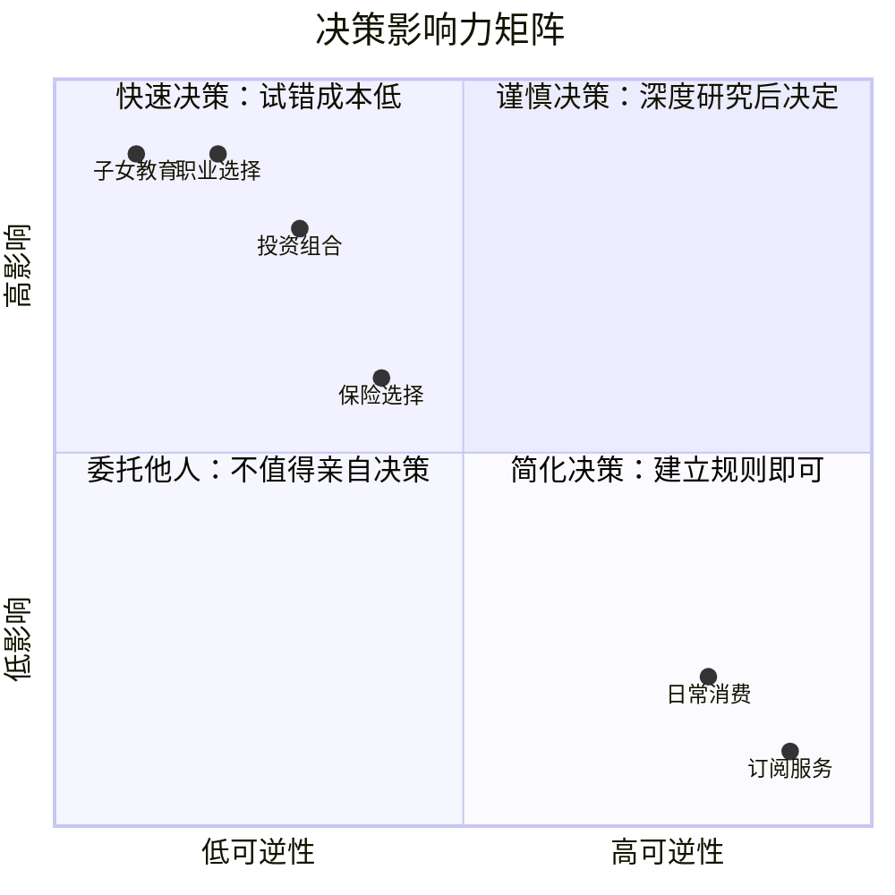

## 九、30-40岁的财富加速心理学

30-40岁是财富积累的关键加速期，也是心理博弈最为复杂的十年。这一阶段的个体面临收入增长放缓、家庭责任加重、职业天花板逼近等多重压力，而能否突破这些瓶颈，很大程度上取决于心理层面的调适与升级。本章从心理学理论出发，系统剖析这一阶段的财富心理机制，提供科学的认知框架和实操工具。

### 9.1 中年转折期的心理画像

#### 9.1.1 发展心理学视角下的30-40岁

心理学家丹尼尔·莱文森（Daniel Levinson）在《男人的四季》中提出，30-40岁处于"安定阶段"（Settling Down Period），核心任务是在社会结构中建立稳定位置。埃里克·埃里克森（Erik Erikson）的心理社会发展理论则将此阶段归入"繁殖vs停滞"（Generativity vs. Stagnation）的冲突期——个体要么通过创造价值获得满足感，要么陷入重复和空虚。

对于财富积累而言，这一发展任务直接映射为：

| 发展任务 | 财富层面的表现 | 心理挑战 |
|---------|--------------|---------|
| 建立稳定位置 | 资产结构成型、收入渠道固化 | 害怕改变、路径依赖 |
| 繁殖感 | 投资下一代、传承财富 | 教育焦虑、遗产规划压力 |
| 自我价值确认 | 用财富衡量人生成就 | 攀比心理、价值迷失 |
| 角色整合 | 多重财务角色（子女/父母/投资者） | 角色冲突、精力分散 |

#### 9.1.2 四维焦虑模型

30-40岁的财富焦虑不是单一来源，而是四个维度的叠加效应。理解这个模型有助于精准定位焦虑根源并制定针对性策略。

**维度一：收入焦虑**

收入增长曲线在30-40岁普遍出现拐点。麦肯锡的研究显示，高收入国家劳动者的收入增长在35岁左右显著放缓，40岁时增长曲线趋于平缓。与此同时，同龄人的收入分化加剧——一些人进入高管行列，另一些人仍在基层挣扎。社会比较理论（Festinger, 1954）解释了这种比较为何如此痛苦：人类天生倾向于与相似群体进行向上比较，而社交媒体放大了这种效应。

**维度二：支出焦虑**

这一阶段的支出结构呈现"三明治"特征：上有父母养老（中国家庭平均每月养老支出2000-5000元）、中有房贷车贷（一线城市月供普遍占收入30-50%）、下有子女教育（K12阶段年均教育支出3-10万元）。心理学中的"资源保存理论"（Hobfoll, 1989）指出，当个体感知到资源（时间、金钱、精力）持续流失而补充不足时，会产生强烈的防御性焦虑。

**维度三：资产焦虑**

资产负债表的健康度在这一阶段开始显现。净资产为负（负债大于资产）的人群比例在30-35岁达到峰值。更深层的心理机制来自"心理账户"理论（Richard Thaler）：人们对不同来源和用途的钱赋予不同的心理权重。例如，房贷被视为"必要支出"而投资亏损被视为"失败"，这种认知扭曲导致非理性的财务决策。

**维度四：时间焦虑**

"时间不够用"的感觉在30-40岁最为强烈。发展心理学称之为"时间视角转换"：20多岁时感知未来是无限的，30岁后开始意识到时间的有限性。这种紧迫感既是压力源，也是行动的催化剂——关键在于如何将其转化为建设性的改变而非焦虑的循环。

#### 9.1.3 焦虑的神经科学机制

理解焦虑的生理基础有助于更好地管理它。当面对财务压力时，杏仁核（amygdala）激活"战斗或逃跑"反应，释放皮质醇和肾上腺素。长期的财务焦虑会导致慢性皮质醇升高，这不仅损害决策能力（前额叶皮层功能下降），还会引发冲动性消费和回避行为。

神经科学家安东尼奥·达马西奥（Antonio Damasio）的"躯体标记假说"解释了为什么财务决策常常被情绪左右：过往的财务经历（如投资亏损）会在身体层面形成"标记"，影响未来的判断。30-40岁积累了足够多的财务经历，这些标记的干扰效应也最为显著。

**应对策略体系**：

1. **认知重评**（Cognitive Reappraisal）：斯坦福大学James Gross的情绪调节研究表明，重新解读事件的意义比压抑情绪更有效。例如，将"我的投资亏了"重新框架为"我用这笔学费学到了什么"。
2. **正念觉察**：每天10分钟的正念冥想可以降低杏仁核的反应性。推荐使用身体扫描法：关注财务焦虑时身体的感觉（胸口紧缩、胃部不适），仅观察不评判。
3. **情绪日记**：记录每次财务决策时的情绪状态，识别情绪与决策之间的模式。使用格式：日期→事件→情绪（1-10分）→决策→结果。
4. **社会支持网络**：与2-3位可信赖的朋友建立"财务互助小组"，定期分享和讨论，避免独自承受。

### 9.2 认知偏差与行为经济学

#### 9.2.1 影响财富积累的六大认知偏差

行为经济学的创始人丹尼尔·卡尼曼（Daniel Kahneman）和阿莫斯·特沃斯基（Amos Tversky）的研究揭示了人类决策中的系统性偏差。以下六种偏差在30-40岁的财务决策中最为常见：

**偏差一：损失厌恶（Loss Aversion）**

人们面对损失的痛苦感是同等收益快乐感的2-2.5倍。这意味着：
- 你亏掉1万元的痛苦，需要赚到2-2.5万元才能抵消
- 这导致投资组合过于保守，错失长期收益
- 典型表现：死守亏损股票不卖、只存定期不投资

**实操纠正**：
- 设定"预承诺规则"：投资前写明止损线和止盈线，机械执行
- 使用"后悔最小化框架"（Jeff Bezos提出）：想象80岁的自己回望此刻，会后悔没有冒险还是后悔没有保守？

**偏差二：锚定效应（Anchoring Effect）**

第一个接收到的数字会成为判断的"锚点"。在财务场景中：
- 房产中介先报高价，后续降价让人感觉"便宜"
- 薪资谈判中，先开口的一方设定锚点
- 股票的"历史最高价"成为心理预期的锚

**实操纠正**：
- 做任何财务决策前，先独立评估合理价值，再参考他人报价
- 使用"从零开始"思维：假设你没有这个资产，今天以当前价格会买入吗？
- 在薪资谈判中，如果对方先报价，用"这个数字低于我的预期，能否重新评估？"来重置锚点

**偏差三：现状偏差（Status Quo Bias）**

人们对维持现状有天然偏好，即使改变明显有利。在财富场景中：
- 明明知道应该换工作，却一直拖着
- 理财产品到期后自动续期，从不比较其他选择
- 一直在同一家银行，从未比较过利率

**实操纠正**：
- 每年进行一次"默认值审计"：检查所有自动续期、默认选项是否仍是最优选择
- 引入"日落条款"：所有财务安排默认有1年有效期，到期必须主动决策是否继续

**偏差四：心理账户（Mental Accounting）**

Thaler发现人们会把钱分门别类放入不同的"心理账户"，并根据账户类别做出不同决策：
- 年终奖被当作"意外之财"而挥霍
- 房租收入被视为"稳定收入"不舍得投资
- 从股市赚的钱和工资赚的钱有完全不同的"花钱速度"

**实操纠正**：
- 建立统一的资产净值表，所有资产一视同仁
- 任何收入进账后，按既定比例分配，不区分来源
- 问自己："如果这笔钱是工资收入，我会这样花吗？"

**偏差五：可得性偏差（Availability Bias）**

人们倾向于根据容易回忆的案例来判断概率。媒体对"炒股暴富"或"投资血亏"的夸张报道扭曲了风险认知：
- 看到朋友炒股赚钱，高估自己的投资能力
- 听到某基金暴跌，对所有基金产生恐惧
- 社交媒体上的炫富内容扭曲了对"正常"财富水平的预期

**实操纠正**：
- 做投资决策前，查看历史统计数据而非依赖个案
- 建立"参考类别"：找100个和你类似背景的人，看他们的投资收益分布，而非只看最好和最坏的案例
- 限制社交媒体消费，设定每日浏览时长上限

**偏差六：过度自信偏差（Overconfidence Bias）**

70-80%的司机认为自己的驾驶水平高于平均——这种系统性的过度自信在投资领域同样普遍。30-40岁的人因为有一定经验，过度自信的风险更高：
- 高估自己的选股能力
- 低估风险，使用过高杠杆
- 频繁交易导致佣金侵蚀收益（研究显示，交易最频繁的投资者收益比平均水平低6.5%）

**实操纠正**：
- 记录所有投资决策的逻辑和结果，定期复盘
- 使用"事前验尸法"（Pre-mortem）：在做决策前，假设这个决策已经失败了，分析可能的失败原因
- 设定交易频率上限，例如每月最多调整一次投资组合

#### 9.2.2 认知偏差的自我检测清单

定期使用以下清单评估自己的决策质量：

```markdown
## 财务决策偏差检测表

### 决策前检查
- [ ] 我是否因为"不想损失"而拒绝了一个明显更好的选择？
- [ ] 我的判断是否被某个数字锚定了？（报价、历史价格、他人的收入）
- [ ] 我选择现状是因为它真的最优，还是只是"懒得改"？
- [ ] 这笔钱如果来自不同来源，我会做出同样的决策吗？
- [ ] 我的判断依据是统计数据，还是几个印象深刻的故事？
- [ ] 我有多大的把握认为自己的判断是对的？如果是80%以上，是否有过度自信的可能？

### 决策后复盘
- [ ] 如果时间倒流，我还会做同样的选择吗？
- [ ] 我的决策逻辑是什么？结果是运气还是能力？
- [ ] 有哪些信息是我当时忽略的？
```

### 9.3 决策疲劳与认知资源管理

#### 9.3.1 决策疲劳的科学基础

心理学家Roy Baumeister的"自我损耗"（Ego Depletion）理论指出，意志力和决策能力是有限资源，会在使用后暂时耗尽。以色列法官假释决策的经典研究显示：上午的假释批准率为65%，临近午餐时降至接近0%——不是因为犯人不同，而是法官的决策能量耗尽了。

30-40岁每天需要做出约35,000个有意识的决策，其中财务相关决策约占5-10%。当认知资源耗尽时：
- 倾向于选择默认选项（现状偏差加剧）
- 冲动消费增加
- 风险偏好变得不稳定（有时过于保守，有时过于冒险）
- 拖延重要决策

#### 9.3.2 决策能量的四层管理模型

**第一层：消除——减少不必要的决策**

将重复性决策转化为自动化规则，彻底消除决策需求。

| 领域 | 自动化规则示例 | 实现方式 |
|------|--------------|---------|
| 收入分配 | 工资到账日自动转账50%至投资账户 | 银行自动转账 |
| 日常消费 | 每月固定预算，用完即止 | 专用消费卡+余额提醒 |
| 投资执行 | 每月15日定投指数基金 | 基金APP定投功能 |
| 账单支付 | 所有固定账单自动扣款 | 银行代扣/支付宝自动缴费 |
| 保险续费 | 设置日历提醒，提前30天决策 | 日历APP+续保对比表 |

**第二层：批处理——集中处理同类决策**

将同类决策集中在一个时间段处理，减少上下文切换的损耗。

- **周批处理**：每周日花30分钟处理本周的非紧急财务决策（是否续费某个订阅、是否购买某个非必需品）
- **月批处理**：每月最后一个周末进行家庭财务会议，处理月度重大决策
- **季批处理**：每季度进行一次投资组合审视和调整
- **年批处理**：每年1月进行年度财务规划，6月进行中期审视

**第三层：优先级排序——聚焦关键决策**

使用"决策影响力矩阵"来分配有限的决策能量：



**第四层：补充能量——维持决策质量**

- **生理基础**：充足的睡眠（7-8小时）是决策质量的前提。睡眠不足时，前额叶皮层功能下降30-40%
- **时间选择**：重要财务决策安排在上午10-12点或下午3-5点（认知高峰期），避免在饥饿、疲劳或情绪激动时做决策
- **决策间隔**：两个重要决策之间至少间隔30分钟，让认知资源部分恢复
- **环境管理**：在安静、整洁的环境中做决策，减少外部干扰对认知资源的消耗

#### 9.3.3 预设规则库（决策模板）

以下是经过验证的财务决策预设规则，可以直接采用或根据个人情况调整：

**消费决策规则**：
- **48小时规则**：单笔非必需消费超过2000元，等待48小时再决定
- **时薪换算规则**：将价格换算为工作时长（如月薪2万，一小时约114元），评估是否值得
- **使用频率规则**：单价÷预期使用次数=单次成本，单次成本超过10元的物品需要额外评估
- **替代品规则**：购买前思考"我已有的什么东西可以替代它？"

**投资决策规则**：
- **1/N规则**：任何单一资产不超过总资产的1/N（N=资产种类数量）
- **5%规则**：高风险投资（个股、加密货币）不超过总资产的5%
- **再平衡规则**：任何一类资产偏离目标配置超过5个百分点时触发再平衡
- **新闻过滤规则**：短期新闻不影响长期投资计划，除非基本面发生根本变化

**职业决策规则**：
- **3年规则**：同一岗位超过3年没有实质性成长（技能、收入、影响力），主动寻找变化
- **30%规则**：跳槽薪资涨幅低于30%且没有其他显著优势（行业、成长空间），不值得
- **20%规则**：将至少20%的工作时间投入可迁移技能的学习和实践

### 9.4 长期主义的心理机制与实践

#### 9.4.1 为什么30-40岁最容易放弃长期主义？

长期主义的敌人不是无知，而是心理机制的系统性干扰。理解这些机制是坚持长期主义的前提。

**机制一：双曲贴现（Hyperbolic Discounting）**

人类对即时奖励的偏好远高于理性模型的预测。获得100元的快乐，在"现在"和"一年后"之间的差异，不是线性的时间价值差异，而是指数级的心理差异。这解释了为什么：
- 明知道应该存钱，却忍不住买买买
- 明知道定投长期有效，却在市场下跌时停止
- 明知道学习重要，却选择刷手机

**机制二：峰终定律（Peak-End Rule）**

诺贝尔奖得主丹尼尔·卡尼曼发现，人们对体验的记忆取决于两个时刻：最强烈的瞬间（峰值）和结束时的感受（终值）。在投资场景中，市场暴跌的恐惧（峰值）和最近一次交易的结果（终值）会扭曲对整体投资经历的判断，导致放弃长期策略。

**机制三：社会比较压力**

30-40岁是同龄人财富分化的加速期。看到同龄人通过炒股、创业、拆迁"一夜暴富"，长期主义的缓慢积累显得苍白无力。社会比较理论指出，人们倾向于向上比较，这种比较在信息不对称的情况下（只看到他人的成功，看不到失败）尤其有害。

**机制四：里程碑焦虑**

30岁、35岁、40岁是社会文化设定的"人生里程碑"。当这些时间节点到来而财富目标未达成时，会触发强烈的时间压力，促使个体放弃长期策略转而追求短期收益。这种"冲刺心态"在马拉松式的财富积累中几乎必然导致失败。

#### 9.4.2 长期主义的五维支撑系统

**维度一：自动化执行**

将长期策略转化为无需意志力的自动行为：
- 设置工资日自动转账至投资账户
- 设置自动定投（指数基金、养老基金）
- 设置自动账单支付，避免因遗忘产生的焦虑
- 将"不做任何事"设为默认选项——不交易比频繁交易更好

**维度二：可视化进展**

"进步原则"（Amabile & Kramer, 2011）研究表明，感知到进展是维持动力的最强因素。
- 建立"财富仪表盘"：每月更新一次，展示资产净值、储蓄率、投资回报的趋势
- 使用复利计算器展示10年、20年后的预期资产
- 记录"里程碑日记"：每达到一个财务里程碑（第一个10万、第一个100万），写下感受和经过

**维度三：认知锚定**

主动设定有利于长期主义的心理锚点：
- 阅读沃伦·巴菲特的年度股东信，理解复利思维
- 阅读《金钱心理学》（Morgan Housel），理解时间的力量
- 将投资期限设定为"至少10年"，而非"今年能赚多少"
- 每天早上花5分钟回顾长期目标，强化"为什么"

**维度四：社群支持**

- 加入2-3个长期投资社群（如指数基金定投群、价值投资群）
- 找到1-2位志同道合的"财务伙伴"，定期交流进展
- 参加线下财务规划工作坊，建立真实的人际连接
- 避免"暴富群"和"炒股群"，这些环境会放大短期主义的诱惑

**维度五：压力缓冲**

建立应急基金作为"心理安全网"，减少短期压力对长期策略的干扰：
- 应急基金规模：6-12个月的生活支出
- 存放位置：高流动性、低风险（货币基金、短期理财）
- 心理作用：知道自己有"退路"，才能在市场恐慌时保持理性

#### 9.4.3 延迟满足的科学训练

沃尔特·米歇尔（Walter Mischel）的"棉花糖实验"后续研究发现，能够延迟满足的儿童在成年后的收入、健康和人际关系方面都表现更好。更重要的是，延迟满足是可以训练的能力。

**训练方法一：心理距离法**

将诱惑抽象化。实验发现，想象棉花糖是"天上的云朵"而非"甜美的糖果"，可以帮助儿童等待更长时间。在财务场景中：
- 把购物欲望想象成"大脑的化学反应"而非"我需要这个东西"
- 用第三人称思考："Kyle会怎么决定？"而非"我想要吗？"
- 将消费金额换算成未来的复利收益

**训练方法二：执行意图法**

Peter Gollwitzer的"执行意图"（Implementation Intention）理论提出，使用"如果...那么..."格式的具体计划，可以将行动执行率提高2-3倍：
- "如果我有购买冲动，那么我会等待24小时后再决定"
- "如果市场下跌超过10%，那么我会加仓而非恐慌卖出"
- "如果收到年终奖，那么我会先存50%再考虑消费"

**训练方法三：环境设计**

James Clear在《原子习惯》中强调，改变环境比改变意志力更有效：
- 删除购物APP的推送通知
- 将投资APP放在手机首屏，将购物APP放在最后一页
- 取消信用卡免密支付，增加消费的"摩擦力"
- 将储蓄账户设为"不显示余额"，减少频繁查看

**训练方法四：小步渐进**

- 第一周：每天延迟一次小额消费冲动（如少买一杯咖啡）
- 第二周：将延迟时间延长到2小时
- 第三周：尝试对中等金额（500元以下）执行48小时规则
- 逐步建立延迟满足的"肌肉记忆"

### 9.5 自我效能感与财务自信

#### 9.5.1 班杜拉的自我效能理论

心理学家阿尔伯特·班杜拉（Albert Bandura）的自我效能理论指出，个体对自己完成特定任务能力的信念，直接影响其行为选择、努力程度和坚持时间。在财富场景中：

- **高财务自我效能**：相信自己能够通过学习和实践提升财务状况，愿意面对挑战，遇到挫折能快速恢复
- **低财务自我效能**：认为"我不擅长理财"、"投资是有钱人的事"，回避财务决策，遇到亏损就彻底放弃

自我效能的四个来源及其在财务领域的应用：

| 来源 | 定义 | 财务实操 |
|------|------|---------|
| 掌握经验 | 亲身成功的经历 | 从简单的储蓄目标开始，逐步增加难度 |
| 替代经验 | 观察他人的成功 | 阅读普通人通过长期投资实现财务自由的案例 |
| 言语说服 | 他人的鼓励和反馈 | 寻找理财导师或加入学习社群 |
| 情绪唤醒 | 身心状态的影响 | 在平静、自信的状态下做财务决策 |

#### 9.5.2 财务自信的阶梯式建设

**第一阶段：认知建设（1-3个月）**
- 阅读3-5本经典理财书籍（推荐：《小狗钱钱》→《富爸爸穷爸爸》→《漫步华尔街》→《聪明的投资者》）
- 学习基础财务概念：复利、通货膨胀、资产配置、风险收益比
- 建立个人资产负债表，清晰了解自己的财务现状

**第二阶段：小额实践（3-6个月）**
- 开始每月定投500-1000元的指数基金
- 记录每笔投资的逻辑和结果
- 第一次完整经历一个市场周期（上涨→下跌→回升）

**第三阶段：体系构建（6-12个月）**
- 制定完整的资产配置计划
- 建立应急基金
- 开始学习税务优化、保险规划等进阶主题
- 形成自己的投资哲学和原则

**第四阶段：能力外化（12个月以上）**
- 能够独立分析和评估投资机会
- 能够向家人解释财务决策的逻辑
- 能够帮助身边的人建立基础的财务规划
- 形成稳定的投资风格和风险控制体系

#### 9.5.3 内控型人格与财务成功

心理学家Julian Rotter的"控制点理论"（Locus of Control）区分了两种人格类型：

- **内控型**：相信结果主要由自己的行为和决策决定
- **外控型**：相信结果主要由运气、命运或他人决定

研究表明，内控型人格在财务积累方面表现显著更好，因为：
- 更主动地学习和规划
- 更愿意承担责任和风险
- 更少受市场噪音和他人影响
- 遇到挫折时倾向于寻找解决方案而非抱怨环境

**如何培养内控型财务思维**：
- 将"市场不好所以亏了"改为"我选择了不适合市场环境的策略"
- 将"工资太低存不下钱"改为"我还没有找到提高收入的方法"
- 将"理财太复杂我学不会"改为"我还没有投入足够的时间学习"
- 注意：内控不等于自我苛责，而是聚焦于可控因素并采取行动

### 9.6 财富心理学的实操工具箱

#### 9.6.1 财务情绪温度计

每天花2分钟给自己的财务情绪打分（1-10分），并记录触发事件。持续30天后分析模式：

```markdown
## 财务情绪日记模板

| 日期 | 情绪分(1-10) | 触发事件 | 自动想法 | 理性替代想法 | 行动 |
|------|-------------|---------|---------|-------------|------|
| 6/25 | 3 | 股票跌了5% | 我不适合投资 | 短期波动是正常的，我投资的是长期 | 无操作，执行计划 |
| 6/26 | 8 | 收到奖金 | 应该好好犒劳自己 | 先按规则分配，再考虑消费 | 按50/30/20分配 |
```

#### 9.6.2 财务决策检查清单

在做出任何重大财务决策前，逐项检查：

```markdown
## 重大财务决策检查清单

### 信息层面
- [ ] 我是否收集了足够的信息？（至少3个独立来源）
- [ ] 我是否考虑了相反的观点？
- [ ] 我的信息来源是否可靠？是否有利益冲突？

### 认知层面
- [ ] 我当前的情绪状态如何？是否适合做决策？
- [ ] 我是否受到了锚定效应的影响？
- [ ] 我是否在做现状偏好的决策？
- [ ] 如果这笔钱来自不同来源，我的决策会不同吗？

### 风险层面
- [ ] 最坏的情况是什么？我能承受吗？
- [ ] 我是否为最坏情况准备了应对方案？
- [ ] 这个决策的可逆性如何？

### 时间层面
- [ ] 一年后我会如何看待这个决策？
- [ ] 十年后呢？
- [ ] 这个决策是否经得起时间检验？
```

#### 9.6.3 年度心理财务体检

每年进行一次全面的心理财务体检，评估自己的心理状态是否支持长期财富积累：

```markdown
## 年度心理财务体检表

### 焦虑水平评估
- 我对财务状况的焦虑程度（1-10）：___
- 焦虑是否影响了我的日常生活和睡眠？（是/否）
- 焦虑的主要来源是什么？

### 认知偏差评估
- 我是否经常因为"不想损失"而错过机会？
- 我的决策是否经常被他人或媒体影响？
- 我是否高估了自己的投资能力？

### 长期主义评估
- 我是否坚持执行了年初制定的投资计划？
- 我因为市场波动做了多少次非计划内的交易？
- 我的资产配置是否与长期目标一致？

### 自我效能评估
- 我对自己管理财务的能力有多大信心（1-10）？
- 我今年学到了哪些新的财务知识？
- 我帮助了哪些人改善财务状况？

### 行动计划
- 明年我最想改善的财务心理习惯是什么？
- 我计划采取哪些具体行动？
- 我需要什么支持？
```

### 9.7 常见误区与纠正

#### 误区一：认为"心态好"就够了

**错误表现**：读了几本理财书，心态调整好了，就认为自己已经准备好积累财富了。

**纠正方法**：心态是必要条件而非充分条件。还需要：系统的知识体系、可执行的计划、持续的行动、定期的复盘。心态是"发动机"，但还需要"燃料"（知识）和"方向盘"（计划）。

#### 误区二：过度追求"无情绪"

**错误表现**：试图完全消除财务决策中的情绪，认为"理性"就是"无感情"。

**纠正方法**：达马西奥的研究表明，完全无法体验情绪的人反而做出更差的决策。目标不是消除情绪，而是觉察情绪、理解情绪、不让情绪主导决策。情绪是信息源，不是决策者。

#### 误区三：用心理学理论为自己的行为找借口

**错误表现**："我有损失厌恶，所以我保守投资是合理的"、"我有现状偏好，所以不换工作是正常的"。

**纠正方法**：识别偏差的目的是克服它，而不是合理化它。正确的做法是：识别偏差→设计对冲机制→执行对冲策略→复盘效果。

#### 误区四：忽视身体对心理的影响

**错误表现**：只关注心理层面的调整，忽视睡眠、运动、饮食对决策质量的影响。

**纠正方法**：神经科学研究一致表明，充足的睡眠、规律的运动和健康的饮食是认知功能的基础。在追求财务目标的同时，必须维护好身体这个"硬件"。建议：每周150分钟中等强度运动、每天7-8小时睡眠、减少精加工食品摄入。

#### 误区五：独自承受财务压力

**错误表现**：认为财务问题是个人隐私，不愿与任何人分享，独自承受压力。

**纠正方法**：心理学研究反复证明，社会支持是应对压力的最有效资源之一。建立2-3层的支持网络：伴侣/家人（情感支持）、财务互助小组（经验支持）、专业理财师/心理咨询师（专业支持）。注意：分享不等于求助，有时候只是"说出来"就能显著降低焦虑。

### 9.8 进阶：行为改变的科学框架

#### 9.8.1 跨理论模型（Transtheoretical Model）

心理学家James Prochaska提出的"行为改变阶段模型"，可以帮助理解自己在财务行为改变过程中处于哪个阶段，以及下一步该做什么：

| 阶段 | 特征 | 财务场景示例 | 下一步行动 |
|------|------|------------|-----------|
| 前意向期 | 没有改变的打算 | "理财是有钱人的事" | 接收信息，引发思考 |
| 意向期 | 考虑改变但未行动 | "我应该学学理财" | 评估利弊，制定计划 |
| 准备期 | 计划在30天内行动 | "下个月开始定投" | 设定具体日期和金额 |
| 行动期 | 已经开始改变（<6个月） | "我已经定投3个月了" | 建立奖励机制，防止复发 |
| 维持期 | 持续行动超过6个月 | "定投已经成为习惯" | 识别高危情境，制定应对策略 |

#### 9.8.2 动机访谈法在自我对话中的应用

动机访谈法（Motivational Interviewing）原本是心理咨询技术，但其核心原则可以用于自我对话，增强内在动机：

- **表达同理**：对自己说"我理解你为什么想买这个，工作这么辛苦犒劳自己很正常"
- **发展矛盾**：接着问"但这个购买和你的长期目标一致吗？"
- **支持自我效能**：最后说"你之前成功地克制过类似冲动，这次也可以"

这种自我对话比简单的"不要买"更有效，因为它尊重了情绪、激活了理性思考、强化了自我效能。

#### 9.8.3 从知道到做到的差距

"知识-行动差距"（Knowledge-Action Gap）是行为科学的核心难题。研究显示，仅有知识不足以改变行为，还需要：

1. **触发器**：设定环境触发，如手机提醒、视觉提示（在钱包里放一张写有长期目标的卡片）
2. **简化**：将目标行为简化到最低门槛（如"每天只记一笔账"而非"记录所有开支"）
3. **即时反馈**：建立快速反馈机制，让行为结果尽快可见（如每完成一次定投就在日历上打勾）
4. **社会承诺**：公开宣布自己的财务目标，利用社会压力促进执行
5. **身份认同**：将"我在做投资"转变为"我是一个投资者"——身份认同比行为改变更持久

本章的核心信息是：财富积累不仅是技术和策略问题，更是心理和行为问题。30-40岁的财富加速，首先要加速的是心理认知的升级。当你理解了自己的心理机制，就能将内耗转化为动力，将焦虑转化为行动，将短期诱惑转化为长期复利。
