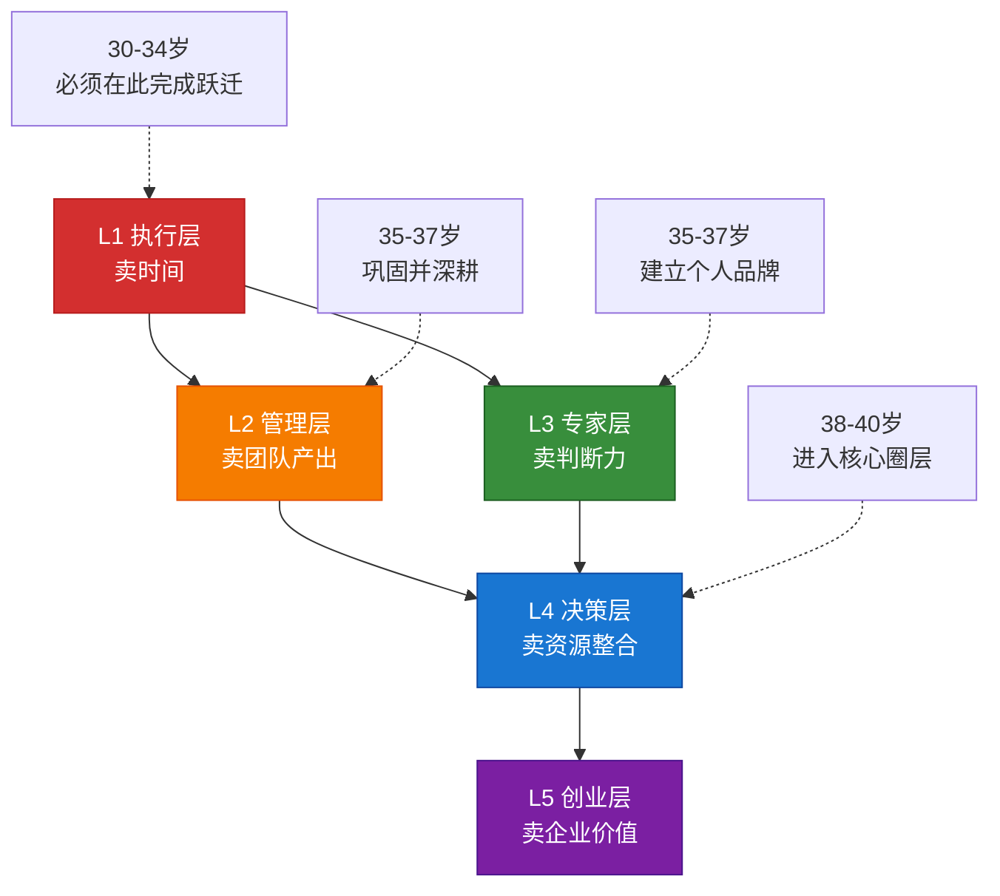
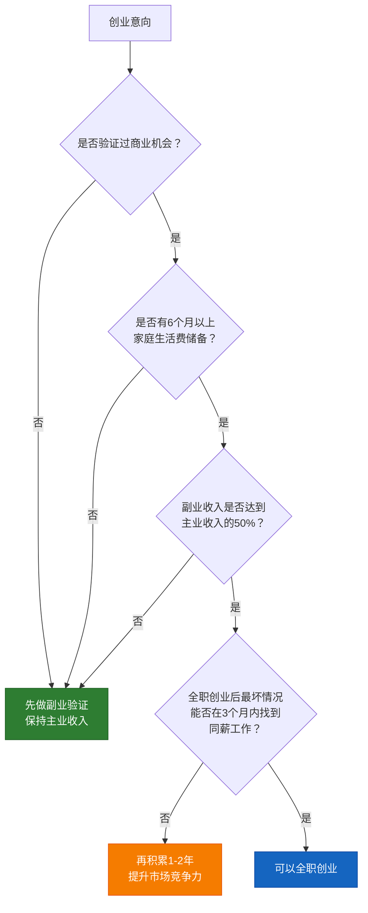
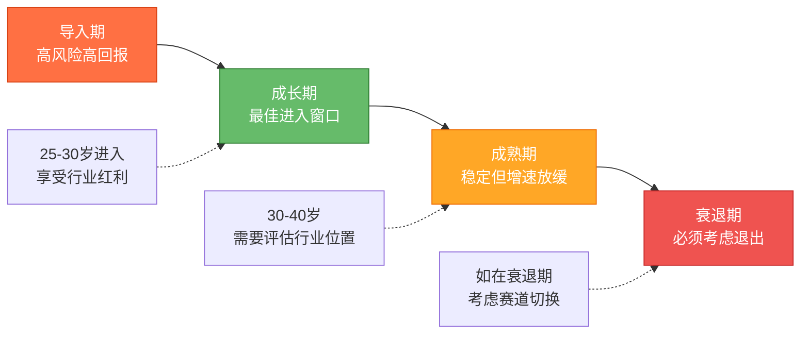
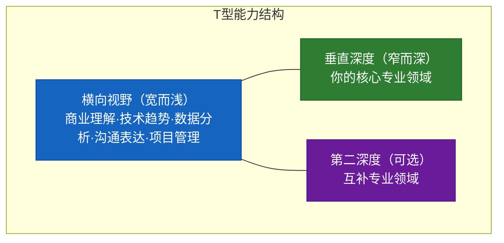
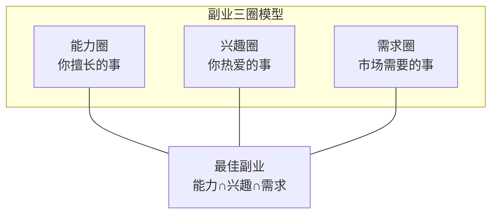

## 十、30-40岁的职业发展策略

### 10.1 为什么职业是30-40岁财富加速的第一引擎

在所有财富增长的变量中，职业收入是最大的单因子。假设你30岁时年收入30万，投资收益率8%，年度投资本金10万——即使你投资水平再高，投资收益也不过8000元。但如果你在5年内把年收入从30万提升到60万，每年多出的30万收入，其财富增量远超任何投资技巧能带来的收益。

这就是**收入杠杆原理**：在30-40岁阶段，提升主业收入的边际财富效应，是优化投资收益的3-10倍。职业发展不是"赚钱的手段之一"，而是"财富加速的第一引擎"。

职业收入在30-40岁的特殊地位，还体现在三个维度：

| 维度 | 具体表现 | 财富影响 |
|:---:|------|------|
| **规模效应** | 收入基数大，每1%的增长绝对值可观 | 年薪60万涨10%=6万，相当于投资75万本金的年化收益 |
| **确定性** | 职业收入是最可预测、最稳定的现金流 | 为投资和生活提供安全底座，降低整体财务风险 |
| **乘数效应** | 收入提升同时增加储蓄率、投资本金、信用额度 | 一条收入线的增长带动整个财务系统的加速 |

### 10.2 能力变现的五级模型：你处在哪一层？

30-40岁的职业发展，本质上是**能力变现层级的跃迁**。不同层级的收入模式、核心能力和天花板截然不同：

| 变现层级 | 角色定义 | 收入模式 | 核心能力 | 典型年收入 | 天花板 |
|:---:|------|------|------|:---:|------|
| **L1 执行层** | 个人贡献者 | 卖时间（按小时/月计薪） | 专业技能熟练度 | 15-40万 | 天花板低：受制于可用工时 |
| **L2 管理层** | 团队负责人 | 卖团队产出（管理杠杆） | 领导力+业务理解 | 40-100万 | 中等：受制于管理半径 |
| **L3 专家层** | 行业专家/顾问 | 卖判断力（知识杠杆） | 行业洞察+方法论沉淀 | 60-200万 | 较高：知识无边界 |
| **L4 决策层** | 高管/合伙人 | 卖资源整合能力 | 战略思维+人脉网络 | 100万-无上限 | 高：取决于决策质量 |
| **L5 创业层** | 创始人/股东 | 卖企业价值（资本杠杆） | 商业模式设计+团队管理 | 取决于企业规模 | 理论上无上限 |

**30-40岁的核心目标：至少从L1跃迁到L2或L3。**

如果你在40岁时仍然停留在L1——纯执行层，面临的风险是致命的：更年轻的L1执行者薪资要求更低、精力更充沛、对新技术的适应性更强。你将陷入"年龄-成本"剪刀差的困境。



**跃迁的关键不是"更努力"，而是改变价值创造的方式：**

- **L1→L2**：从"自己做得好"转向"让团队做得好"。你需要学会任务分配、进度管理、绩效辅导、向上管理。最关键的认知转变是：你的KPI不再是你个人的产出，而是你团队的总产出。
- **L2→L3**：从"管好一个团队"转向"定义正确的事"。你需要沉淀可复用的方法论，建立行业影响力，让别人为你的"判断力"付费。最关键的认知转变是：你的价值不在于做了多少事，而在于你做出过多少正确的关键决策。
- **L1→L3（跳过L2）**：适用于技术、研究、咨询等领域。走专家路线不需要管理团队，但需要在垂直领域做到极致深度。

### 10.3 三条职业路径的深度拆解

30-40岁通常面临三条主要的职业路径选择。每条路径有不同的能力要求、收入曲线和风险特征：

#### 10.3.1 路径一：管理线——从主管到高管

**适用人群**：擅长沟通协调、喜欢带领团队、有较强的政治敏感度。

**典型晋升路径**：

| 阶段 | 职位层级 | 管理幅度 | 核心挑战 | 薪酬结构变化 |
|:---:|------|:---:|------|------|
| 30-33岁 | 基层主管/经理 | 3-8人 | 从自己干活到安排别人干活 | 基本工资占比仍>70% |
| 33-36岁 | 中层经理/总监 | 10-30人 | 跨部门协作、向上管理 | 奖金+股票占比上升到30-40% |
| 36-40岁 | 高级总监/VP | 30-100+人 | 战略思维、组织建设 | 股权激励占比可达50%+ |

**管理线的五个关键能力建设**：

1. **任务分配与授权**。学会把工作按"能力匹配度"和"成长价值"两个维度分配给团队成员，而不是只分配自己不想做的"杂活"。好的授权是双赢：下属获得成长机会，你获得管理杠杆。
2. **向上管理**。你的晋升不取决于你觉得自己干得好不好，而取决于你的上级和上级的上级觉得你干得好不好。学会定期汇报成果（而非过程）、管理上级预期、在关键时刻争取资源和曝光机会。
3. **跨部门影响力**。到了中层以上，你需要影响与你没有汇报关系的人——其他部门的负责人、外部合作伙伴、客户高管。这需要"非权力影响力"：专业信誉、互惠网络、个人品牌。
4. **组织诊断能力**。高管的核心能力不是"做事"，而是"识别什么该做、什么不该做"。学会用系统思维看待组织问题：是人的问题还是流程的问题？是战略问题还是执行问题？是短期问题还是结构性问题？
5. **商业敏感度**。从"完成任务"转向"理解业务"。你需要知道公司靠什么赚钱、利润率在哪里、客户为什么买单、竞争对手在做什么。这决定了你在高层会议中能否提出有价值的见解。

**管理线的典型陷阱**：

- **技术退化陷阱**：升为管理者后不再碰技术细节，5年后发现自己既做不了技术也做不好管理，成为"悬浮管理者"。对策：保持对核心业务的技术理解深度，不需要亲自写代码但需要能评审技术方案。
- **忠诚度陷阱**：在一家公司待太久，错过外部更好的机会。对策：每2年做一次市场测试（面试2-3家），了解自己的市场价值。
- **政治内耗陷阱**：花太多精力在办公室政治上，忽略了真正的能力提升。对策：70%精力做好业务，20%用于向上管理和跨部门协作，10%用于应对政治。

#### 10.3.2 路径二：专家线——从熟练工到行业权威

**适用人群**：深度思考型、有强烈好奇心、不喜欢管人但喜欢钻研。

**典型发展路径**：

| 阶段 | 能力层级 | 标志性特征 | 收入模式 |
|:---:|------|------|------|
| 30-33岁 | 高级执行者 | 能独立解决复杂问题 | 月薪+项目奖金 |
| 33-36岁 | 领域专家 | 能设计方法论并推广 | 月薪+咨询收入+讲课 |
| 36-40岁 | 行业权威 | 被行业认可为"谁"之一 | 多元收入：薪资+咨询+出书+培训+顾问 |

**专家线的三根支柱**：

1. **深度知识体系**。不是知道得多，而是理解得深。普通人知道"这个工具怎么用"，专家知道"这个工具为什么这样设计、什么场景下会失效、替代方案各有什么优劣"。建立深度知识体系的方法：每个核心概念至少追问三层"为什么"，用费曼学习法检验自己的理解——如果你不能向一个外行解释清楚，说明你自己还没真正理解。
2. **可复用方法论**。专家的核心资产不是"经验"（经验是个人的、不可转移的），而是"方法论"（方法论是结构化的、可教的）。你需要把解决问题的思路抽象为框架、流程、清单，让别人能按你的方法复制你的成果。
3. **个人品牌与影响力**。在一个信息过载的时代，"做得好"和"被认为做得好"同样重要。专家线的变现依赖于行业认可——你需要让目标受众知道你、信任你、愿意为你的判断付费。

**个人品牌的建设路径**（按投入产出比排序）：

| 渠道 | 投入 | 产出 | 适合阶段 | 具体做法 |
|------|:---:|------|:---:|------|
| 技术博客/公众号 | 低 | 中 | 30岁起 | 每周1篇深度文章，持续6个月建立初始影响力 |
| 行业会议分享 | 中 | 高 | 32岁起 | 从公司内部分享开始，逐步扩展到行业会议 |
| 专业社群运营 | 中 | 中 | 30岁起 | 在垂直社群（知乎、GitHub、行业论坛）持续输出高质量回答 |
| 出版/课程 | 高 | 高 | 35岁起 | 当积累足够内容后，系统化输出为书籍或在线课程 |
| 企业顾问/咨询 | 低 | 极高 | 35岁起 | 利用业余时间为2-3家企业提供顾问服务 |

#### 10.3.3 路径三：创业线——从打工人到企业主

**适用人群**：高风险承受能力、强烈的自主意识、有明确的商业机会洞察。

**30-40岁创业的独特优势**：

- **行业积累**：10年工作经验让你看到真实的市场需求和行业痛点
- **人脉资源**：积累了供应商、客户、合作伙伴等人脉网络
- **判断力**：踩过的坑让你比20多岁的创业者更懂得规避风险
- **信用背书**：行业履历和个人品牌降低了融资和获客难度

**30-40岁创业的独特约束**：

- **家庭责任**：有房贷、子女教育等刚性支出，无法承受长期无收入
- **机会成本高**：放弃的高管薪资可能是百万级别
- **心理负担重**：不再像20多岁那样"输了从头再来"

**创业时机的决策框架**：



**最稳妥的创业路径——"副业先行"模式**：

1. **阶段一（6-12个月）**：在保持主业的前提下，利用晚间和周末验证商业想法。目标是获得第一批付费客户，确认需求真实存在。
2. **阶段二（12-18个月）**：副业收入达到主业收入的30-50%。开始优化商业模式，建立可复制的获客和交付流程。
3. **阶段三（决策点）**：副业收入稳定达到主业收入的50%以上，且有6个月以上的家庭储备金。此时可以考虑全职创业，或者继续以"轻创业"模式运转。

### 10.4 行业评估与赛道切换

30-40岁最重大的战略决策之一，是**评估你所在行业的长期趋势**。如果你在一个结构性衰退的行业中拼命内卷，再多的努力也只是在一条下沉的船上擦甲板。

#### 行业生命周期与你的位置



#### 行业评估的四个维度

| 维度 | 评估问题 | 数据来源 | 红线指标 |
|------|------|------|------|
| **市场容量** | 这个行业的总盘子还在增长吗？ | 行业研报、上市公司财报 | 连续3年行业增速<GDP增速 |
| **技术替代** | AI/自动化能在多大程度上替代这个行业的工作？ | 技术趋势报告、岗位消失数据 | 50%+的岗位可被自动化 |
| **政策环境** | 监管趋势是收紧还是放松？ | 政策文件、监管动态 | 行业被列入限制类或淘汰类 |
| **人才供需** | 行业人才是供不应求还是严重过剩？ | 招聘平台数据、薪资趋势 | 岗位薪资连续3年下降 |

**赛道切换的决策树**：

- 如果四个维度中有**3个以上亮红灯**→必须切换赛道，越快越好
- 如果有**2个亮红灯**→需要制定Plan B，同时开始积累目标行业的能力和人脉
- 如果只有**1个亮红灯**→保持警觉，关注趋势变化，不需要立即行动
- 如果**全部绿灯**→继续深耕，享受行业红利

**赛道切换的具体方法**：

1. **技能迁移分析**：列出你当前行业的核心技能，评估哪些技能在目标行业有需求。例如：传统行业的销售能力可以迁移到SaaS行业；制造业的供应链管理能力可以迁移到电商行业。
2. **降维切入**：不要期望在新行业直接获得同等级别的职位。通常需要接受1-2年的"降维期"——以略低于原行业的职位和薪资切入，换取行业转换的机会。
3. **桥梁岗位**：寻找同时需要两个行业经验的岗位。例如：传统银行数字化转型岗位需要银行经验+互联网经验；车企智能驾驶岗位需要汽车行业经验+AI经验。这类岗位是赛道切换的最佳切入点。

### 10.5 T型能力结构：30-40岁的能力建设蓝图

30-40岁的能力建设，不能再像20多岁时那样"什么都学一点"。你需要建立**T型能力结构**——一个足够深的垂直专业（T的竖线）+ 一个足够宽的横向视野（T的横线）。



**垂直深度的建设原则**：

1. **选择"难而正确"的方向**。容易学的技能容易被替代。选择那些需要5-10年积累、有较高学习曲线的领域——这些领域天然形成护城河。
2. **建立"技能栈"而非"技能点"**。一个孤立的技能价值有限，但多个互补技能的组合可以创造独特价值。例如：数据分析技能（常见）+ 行业知识（中等）+ 沟通能力（常见）= 能用数据讲故事的行业分析师（稀缺）。
3. **定期进行"市场验证"**。每6个月在招聘平台上搜索你的目标岗位，看看市场需求是否与你的能力建设方向一致。如果市场在变化，你需要及时调整学习方向。

**横向视野的五个必修领域**：

| 领域 | 学习目标 | 学习方式 | 优先级 |
|------|------|------|:---:|
| **商业理解** | 理解你所在公司的商业模式、利润来源、竞争格局 | 读公司年报、参与业务讨论、读商学院案例 | 最高 |
| **技术趋势** | 了解AI、大数据、云计算等技术对行业的影响 | 关注科技媒体、参加技术分享、动手体验AI工具 | 最高 |
| **数据分析** | 能用数据支持决策，而非仅凭经验判断 | 学SQL基础、Excel高级功能、基础统计学 | 高 |
| **沟通表达** | 能清晰表达复杂观点、有效说服他人 | 结构化写作训练、演讲练习、向上汇报实践 | 高 |
| **财务知识** | 理解财务报表、ROI计算、成本结构 | 读《财务智慧》、学习基础会计知识 | 中 |

### 10.6 薪酬谈判：被低估的收入加速器

研究表明，**在职业生涯中系统性地进行薪酬谈判的人，一生总收入比从不谈判的人高100-500万**。30-40岁是薪酬谈判的黄金期——你有足够的市场价值作为筹码，也有足够的经验来识别合理的薪资水平。

#### 薪酬谈判的三个时机

| 时机 | 成功率 | 涨幅范围 | 关键策略 |
|------|:---:|:---:|------|
| **入职谈判** | 最高 | 10-30% | 你有最大的谈判筹码——公司已经决定要你 |
| **晋升谈判** | 高 | 15-40% | 提前3-6个月开始铺垫，用业绩数据说话 |
| **年度调薪** | 中 | 5-15% | 主动提出，不要等HR通知；准备市场数据 |

#### 入职薪酬谈判的五步法

**第一步：信息收集**。在面试前，通过招聘平台（猎聘、脉脉、LinkedIn Salary Insights）、同行交流、猎头沟通等渠道，了解目标岗位的市场薪资范围。你需要知道三个数字：该岗位的市场25分位、50分位、75分位薪资。

**第二步：锚定高位**。当被问到期望薪资时，报出市场75分位的数字（而非50分位）。锚定效应会使得最终结果更接近你的报价。话术示例："根据我对市场的了解和我的经验背景，我期望的总包在XX-XX之间。当然，具体数字我们可以根据整体福利方案来讨论。"

**第三步：谈判总包而非单项**。不要只盯着基本工资。总包包括：基本工资、绩效奖金、股票/期权、签字费、搬迁补贴、年假天数、弹性工作安排、培训预算等。在基本工资谈判空间有限时，可以尝试在其他维度争取更多。

**第四步：给对方台阶**。如果HR说"超出了我们的预算"，不要硬顶。回应："我理解每个岗位有薪资范围。如果基本工资有上限，我们能否在股票或签字费方面做一些调整？"这给了对方灵活性，也展示了你的合作态度。

**第五步：书面确认**。口头谈好的条件，要求以书面offer确认。特别注意：股票的数量、授予时间表、行权条件；奖金的计算方式和发放条件；试用期薪资是否打折。

#### 内部涨薪的策略

内部涨薪比外部跳槽难度更大，因为存在**信息不对称和锚定效应**——HR会以你当前薪资为基准进行调整。但内部涨薪的好处是不需要承担跳槽的风险和适应成本。

**内部涨薪的核心策略——"提前铺垫，用数据说话"**：

1. **每年1月**：与上级确认本年度的绩效目标和评估标准。确保这些目标是具体的、可衡量的。
2. **每个季度**：向上级同步进展，记录关键成果（用数字量化：提升了XX%、节省了XX万、获得了XX客户）。
3. **每年9-10月**：在年度调薪周期前，主动约上级进行"职业发展对话"。展示你过去一年的成果，表达你对薪酬调整的期望，并提供市场薪资数据作为参考。
4. **关键话术**："过去一年我在XX方面取得了XX成果（数据支撑）。根据我对市场薪资的了解，同类岗位的薪资范围在XX-XX之间。我希望我的薪酬能够反映我对团队的贡献和市场的合理水平。"

**如果涨薪请求被拒**，不要沮丧。明确询问："要达到XX薪资水平，我需要在哪些方面做出什么成果？"这既展示了你的进取心，也为你明确了努力方向。如果连续两年涨薪请求被拒且原因不清晰，你需要认真考虑外部机会。

### 10.7 职业发展的三个子阶段策略

参照本章概览的阶段划分，30-40岁的职业发展在三个子阶段有不同的战略重心：

#### 30-34岁：能力证明期

**核心任务**：从"有潜力的人"变成"被证明的人"。

这个阶段你已经积累了5-8年的工作经验，但行业对你的认知可能还是"年轻有潜力的后辈"。你需要用**可量化的成果**来证明自己的价值。

**关键行动清单**：

1. **争取1-2个"高可见度"项目**。主动承担公司层面的重要项目，哪怕这意味着更大的工作量和更高的失败风险。成功完成一个高可见度项目，胜过默默完成十个日常任务。
2. **建立专业口碑**。在团队内外建立"靠谱"的标签——答应的事一定做到，做到的事超出预期。职场中的信任是一点一滴积累的，但可以一次失误就毁掉。
3. **开始管理向上关系**。不要以为"做好本职工作就够了"。你需要让你的上级、上级的上级知道你的存在和贡献。方法：定期发送工作周报/月报、在关键会议上主动发言、在公司内部做知识分享。
4. **完成第一次薪资跳跃**。无论是通过内部晋升还是外部跳槽，在34岁之前把收入提升到一个新台阶（通常是从L1级别的基础薪资跃迁到L1级别顶部或L2级别基础）。
5. **明确自己的长期路径**：管理线、专家线还是创业线？这个决定越早做出越好，因为不同路径的能力积累重点不同。

#### 35-37岁：定位确立期

**核心任务**：在组织或行业中确立自己的"标签"——你是"那个在XX方面最专业的人"。

这个阶段是职业发展的**黄金窗口**。你有足够的经验做出高质量判断，有足够的精力承担高强度工作，有足够的年龄获得信任。错过了这个窗口，38-40岁的选择空间会显著缩小。

**关键行动清单**：

1. **如果走管理线**：争取管理一个10人以上的团队，或者一个跨部门项目组。开始学习组织管理（而非仅仅是任务管理）——如何招聘、如何培养下属、如何建设团队文化。
2. **如果走专家线**：开始系统化输出——写行业文章、在会议上做分享、建立行业社群。目标是在37岁之前，让行业内的人提到某个领域时能联想到你的名字。
3. **建立行业人脉网络**。30-34岁积累的人脉主要在公司内部；35-37岁你需要把人脉扩展到行业层面。方法：参加行业峰会并做分享、加入行业协会或专业委员会、在LinkedIn/脉脉上保持活跃。
4. **评估是否需要赛道切换**。如果你的行业正在结构性衰退（参见10.4节），35-37岁是最后的低成本切换窗口。等到38-40岁，切换的难度和代价会大幅上升。
5. **开始积累"非工资收入"能力**。无论是咨询、培训、写作还是投资，开始建立主业之外的收入能力。这不仅是财务安全网，也为未来的创业积累客户和经验。

#### 38-40岁：价值收割期

**核心任务**：最大化这个窗口期的职业回报，同时为40-50岁做好准备。

这个阶段，多年积累的能力、人脉、品牌开始集中变现。但你同时也需要思考：**40岁之后，我的职业竞争力如何保持？**

**关键行动清单**：

1. **争取最高的职位或客户单价**。这个阶段你应该达到管理线的VP/高级总监级别，或专家线的行业知名顾问级别。如果你的职位和收入远低于同龄人的中位水平，需要认真复盘过去5年的选择。
2. **建立可迁移的"职业资产"**。所谓职业资产，是指不依赖于当前雇主、可以随你"带走"的东西：行业人脉、个人品牌、方法论体系、客户资源、专业声誉。40岁之后，这些职业资产比你在任何一家公司的职位更重要。
3. **制定"40岁以后"的职业策略**。你打算在现有公司继续深耕？跳槽到更大平台？全职创业？还是半退休式地做顾问？不同的选择需要不同的准备——现在开始准备，永远不嫌早。
4. **培养接班人**。如果你走管理线，培养接班人是向上晋升的前提——没有接班人，你上级不敢提拔你。如果你走专家线，培养团队中的年轻人也是扩大影响力的重要方式。
5. **进行"职业健康体检"**。系统评估：我的核心技能在3年后还有市场吗？我的行业在5年后还会增长吗？我的身体能支撑当前的工作强度吗？我的家庭关系因为工作受到了多大影响？

### 10.8 AI时代的职业生存策略

AI对30-40岁职场人的冲击，不是"会不会发生"的问题，而是"已经发生"的问题。ChatGPT发布后的18个月内，已有大量内容创作、数据分析、初级编程、客服等岗位被AI显著影响。

#### 哪些能力会被AI替代？哪些不会？

| 能力类别 | AI替代风险 | 30-40岁对策 |
|------|:---:|------|
| 信息检索和整合 | 极高 | 停止以"我知道得多"为竞争力 |
| 标准化内容生产 | 高 | 转向需要深度洞察和原创观点的内容 |
| 初级数据分析 | 高 | 学习使用AI工具加速分析，聚焦解读和决策 |
| 模式化的项目管理 | 中高 | 加强人际沟通、冲突处理等"软技能" |
| 复杂问题诊断 | 中低 | 积累跨领域经验和判断力，这是AI短期内做不到的 |
| 人际关系和信任构建 | 低 | 面对面的沟通、谈判、团队激励是人类的持久优势 |
| 创造性战略思维 | 低 | AI可以辅助方案生成，但最终的判断和取舍仍需人类 |
| 伦理判断和价值决策 | 极低 | 这是人类不可替代的核心领域 |

#### 与AI协作的三层能力模型

**第一层：工具使用者**（大多数人在这一层）。会用ChatGPT写邮件、用Midjourney做PPT配图、用Copilot辅助写代码。这一层的竞争优势很短暂——当所有人都会用时，它就不再是优势。

**第二层：流程重构者**（30-40岁应该达到的层级）。不只是用AI完成单个任务，而是重新设计整个工作流程。例如：用AI自动收集行业数据→AI生成初步分析报告→你进行深度解读和判断→用AI生成可视化图表→你向管理层汇报。这种"人机协作流程"可以把一个原本需要3天的工作压缩到3小时。

**第三层：AI产品/业务设计者**（少数人能达到）。能识别业务中哪些环节可以用AI优化，设计AI驱动的产品或服务，甚至创建AI相关的业务。这一层需要同时理解业务和技术，30-40岁的行业经验+AI知识的组合正好适合。

### 10.9 副业策略：30-40岁的第二收入管道

副业在30-40岁不仅是"赚外快"，更是**职业安全网和创业试验田**。但副业选择必须遵循战略逻辑，而不是什么火做什么。

#### 副业选择的"三圈模型"

最优的副业位于三个圈的交集：

1. **你擅长什么**（能力圈）：你在主业中积累的核心技能
2. **你热爱什么**（兴趣圈）：你愿意在工作之余投入时间的事情
3. **市场需要什么**（需求圈）：有人愿意为此付费



#### 30-40岁副业的五个方向

| 方向 | 启动难度 | 收入天花板 | 与主业协同度 | 适合人群 |
|------|:---:|:---:|:---:|------|
| **咨询/顾问** | 低 | 高 | 极高 | 有行业专长的专家型人才 |
| **培训/讲师** | 中 | 中高 | 高 | 擅长表达和教学的人 |
| **自媒体/内容** | 低 | 中 | 中 | 有写作或视频制作能力的人 |
| **技术服务** | 中 | 中 | 高 | 技术岗位从业者 |
| **电商/代购** | 中 | 中 | 低 | 有供应链资源的人 |

**副业的时间管理原则**：

- **工作日**：每天投入1-2小时（晚上9-11点），专注于高价值任务
- **周末**：半天集中处理需要大块时间的任务
- **总投入**：每周不超过10小时——主业仍然是你的第一收入来源
- **止损规则**：如果副业在6个月内没有任何收入迹象，需要复盘方向选择

### 10.10 职业发展的常见误区与纠正

| 误区 | 真相 | 纠正方法 |
|------|------|------|
| "做好本职工作就够了" | 职场晋升50%靠业绩，50%靠能见度和关系 | 每周花2小时做向上管理和跨部门社交 |
| "跳槽才能涨薪" | 频繁跳槽（每1-2年）会形成负面标签 | 在一家公司至少待3年，积累深度成果后再跳 |
| "35岁是职业天花板" | 35岁危机的本质是"能力停止成长"而非年龄 | 持续学习新技能，保持市场竞争力 |
| "管理比专业更有前途" | 强行走管理线但缺乏领导力，比专家线更危险 | 诚实地评估自己的天性，选择最适合的路径 |
| "行业选错了就完了" | 赛道切换虽然有成本，但35岁前仍可行 | 做技能迁移分析，找到跨行业的桥梁岗位 |
| "副业会分散精力" | 战略性副业能反哺主业，提供安全网和新视角 | 选择与主业协同度高的副业方向 |
| "证书越多越好" | 没有实际应用的证书只是"安慰剂" | 只考与职业目标直接相关的、有市场认可度的证书 |
| "人脉就是认识人多" | 100个点头之交不如10个深度互信的关系 | 重点经营30个核心人脉，定期深度交流 |

### 10.11 职业发展的年度复盘框架

每年年底（建议12月最后一周），用以下框架对全年职业发展进行系统复盘：

```markdown
## 职业年度复盘模板

### 一、成果盘点
- 本年度最值得骄傲的3个职业成果是什么？
- 这些成果的量化影响是什么？（节省XX万/提升XX%/获得XX客户）
- 这些成果中，有多少是"高可见度"的（上级/公司层面知晓）？

### 二、能力评估
- 我的核心技能在市场上的价值是上升还是下降？
- 本年度我学到了哪些新技能/新知识？
- 我的"技能栈"距离目标岗位还差什么？

### 三、关系网络
- 本年度我新增了多少个"有价值"的行业人脉？
- 我的30个核心人脉关系维护得如何？
- 有没有人能在关键时刻为我推荐机会或背书？

### 四、市场定位
- 如果今天重新找工作，我能拿到什么级别的offer？
- 我的行业在5年后的前景如何？
- 我是否需要考虑赛道切换？

### 五、下一年规划
- 职业目标：下一年要达到什么里程碑？
- 能力目标：要补齐哪些技能短板？
- 关系目标：要拓展哪些关键人脉？
- 收入目标：薪酬要达到什么水平？通过什么路径？
```

### 10.12 从职业收入到财富加速的闭环

职业发展的终极目的不仅是"赚更多的钱"，而是**建立一个正向循环的财富加速系统**：


这个循环一旦启动，就会越转越快。但**启动的钥匙是职业发展**——没有收入增长，后面的一切都是空谈。这正是为什么职业发展策略是30-40岁财富加速的"第一引擎"。

**最终建议**：不要把职业发展和财富管理分开思考。你的每一个职业决策——是否跳槽、是否转行、是否创业、是否接受新挑战——都应该从"这对我的长期财富积累有什么影响"的角度来评估。职业是手段，财富自由是目标，二者必须对齐。
