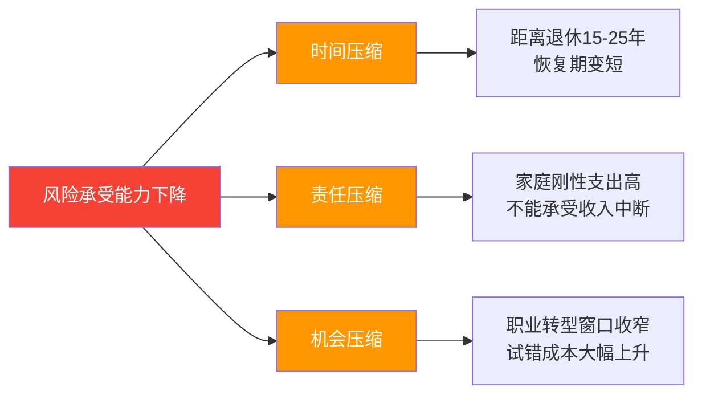
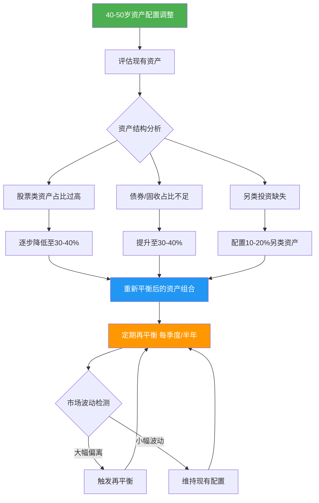
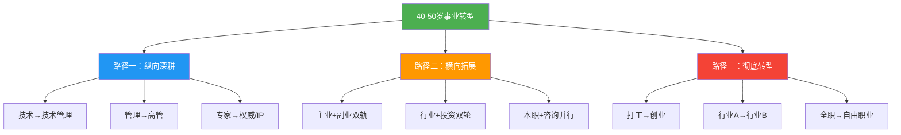
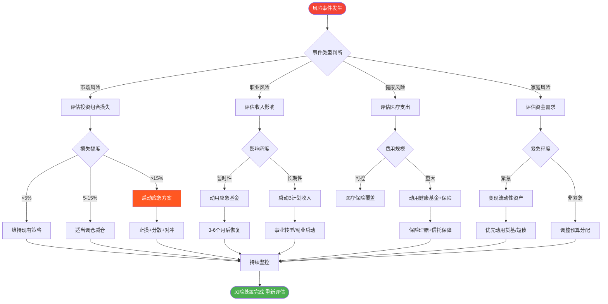

# 第十九章：40-50岁：稳健期

> "真正的财富不是你赚了多少钱，而是你能留住多少钱，以及让这些钱为你工作多久。" —— 罗伯特·清崎

40-50岁是人生的黄金十年。你的收入通常达到职业生涯的峰值，专业积累已经转化为不可替代的市场价值，但与此同时，家庭责任也最为沉重——子女教育进入关键期，父母健康开始走下坡路，而留给退休准备的时间窗口正在收窄。

这个阶段的核心矛盾是：**收入最高，但容错率最低**。20多岁投资失败可以从头再来，40多岁一次重大失误可能影响整个家庭的未来十年。因此，稳健期的财富管理不是追求收益率最大化，而是在保住已有积累的前提下实现可持续增长，同时为退休和财富传承搭建框架。

本章将从阶段特点、资产配置、财富传承、事业转型、风险管理五个维度，为你提供一套系统的稳健期搞钱策略。

---

## 19.1 阶段特点分析

### 19.1.1 收入达到峰值，但增长曲线趋平

**各职业类型收入现状**：

| 职业类型 | 一线城市年薪范围 | 二线城市年薪范围 | 收入来源构成 |
|----------|-----------------|-----------------|-------------|
| 企业高管（VP/总监） | 80-300万 | 40-120万 | 基本工资40%+绩效奖金30%+股权/期权20%+其他10% |
| 技术专家（架构师/Fellow） | 60-200万 | 30-80万 | 基本工资50%+绩效奖金25%+股权15%+技术咨询10% |
| 企业主/合伙人 | 波动大，通常100万+ | 波动大，通常50万+ | 企业利润分红为主，可能有投资收益 |
| 专业人士（律师/医生/会计师） | 50-200万 | 30-80万 | 执业收入70%+投资/咨询30% |
| 自由职业/个体 | 波动大，20-100万 | 波动大，10-50万 | 项目收入为主，被动收入为辅 |

**收入的三个关键特征**：

1. **峰值但不增长**。根据智联招聘数据，中国职场人薪资增长在35-45岁之间达到拐点，此后年均增速从8-12%降至3-5%。这意味着你不能指望"下一份工作涨薪30%"来解决财务问题。

2. **收入多元化程度最高**。经过20年积累，你的收入来源通常已经从单一工资扩展为"工资+投资收益+副业/咨询+租金"的组合。这种多元化是好事，但也意味着你需要管理的财务面更广。

3. **隐性收入价值凸显**。这个阶段的收入不仅是现金，还包括公司提供的住房补贴、子女教育补贴、商业保险、股权激励等隐性福利。评估总收入时不要忽略这些。

**关键认知**：40-50岁是收入的高峰期，但也是支出最高的阶段。典型的中产家庭在这个阶段的月支出可能是20多岁时的3-5倍。如何在高收入的同时控制支出、避免"生活方式膨胀"（lifestyle inflation），是这个阶段的核心财务挑战。

### 19.1.2 家庭责任达到顶峰

**"三明治一代"的财务压力矩阵**：

| 责任类型 | 具体内容 | 年均支出估算 | 持续时间 |
|----------|---------|-------------|---------|
| 子女教育 | 高中学费/补习/兴趣班 | 5-15万 | 3年 |
| 子女教育 | 大学学费+生活费（国内） | 3-8万 | 4年 |
| 子女教育 | 大学学费+生活费（留学） | 30-60万 | 3-4年 |
| 子女教育 | 研究生/深造 | 5-40万 | 2-3年 |
| 父母赡养 | 日常生活费 | 2-6万 | 持续 |
| 父母赡养 | 医疗费用（慢性病管理） | 3-10万 | 持续 |
| 父母赡养 | 重大疾病治疗 | 10-50万（一次性） | 不确定 |
| 父母赡养 | 护理/养老院费用 | 6-24万 | 数年 |
| 房贷 | 如果仍有房贷 | 6-20万 | 视剩余年限 |
| 家庭日常 | 生活开支、保险、社交 | 10-20万 | 持续 |

以一个典型的一线城市双职工家庭为例，40-50岁期间的年均刚性支出可能在40-80万元。如果两个孩子中有一个计划留学，年支出峰值可能突破100万。这就是为什么说"40多岁的人不敢生病、不敢失业"——财务缓冲空间确实比20多岁时小得多。

**应对策略**：不要等到支出来了才想办法。从40岁开始，就应该为每一项重大支出建立专项基金（sinking fund），提前3-5年开始积累。

### 19.1.3 经验和资源达到巅峰，但面临贬值风险

**20年积累的三大资产**：

1. **专业壁垒**：在自己的领域有深厚的专业判断力，这种能力不容易被年轻人替代。但前提是你的技能没有被技术变革淘汰——想想过去十年被移动互联网、AI冲击的那些岗位。

2. **人脉网络**：20年积累的行业人脉是巨大的隐性资产。研究表明，高薪岗位中60-70%是通过人脉推荐获得的，而不是公开招聘。但人脉需要维护，长期不经营的关系会逐渐失效。

3. **资金积累**：如果从25岁开始合理理财，到40岁时应该积累了相当的资产基础。但如果之前理财意识薄弱，这个阶段可能还在"补课"。

**贬值风险**：经验的价值取决于行业的变化速度。在快速变化的行业（如互联网、科技），5年前的经验可能已经过时；在稳定行业（如医疗、法律、金融），经验的价值随时间递增。你必须评估自己的经验是在"增值"还是在"折旧"。

### 19.1.4 风险承受能力显著下降

**风险承受能力的三重压缩**：

**量化你的风险承受能力**：

- **可承受的最大投资亏损** =（总资产 - 房产 - 应急基金 - 3年刚性支出）× 30%。例如：总资产500万，房产200万，应急基金30万，3年刚性支出150万，那么可承受的最大亏损 =（500-200-30-150）× 30% = 36万。
- **收入中断缓冲期** = 应急基金 ÷ 月支出。这个数字应该至少是6个月，理想状态是12个月。
- **投资回本时间**：如果投资亏损30%，需要上涨43%才能回本；亏损50%，需要上涨100%。40多岁的你没有太多时间等待回本。

**关键认知**：40-50岁的投资哲学应该从"如何赚更多"转变为"如何不亏钱"。巴菲特的第一条投资规则是"不要亏钱"，第二条是"不要忘记第一条"——这对40多岁的人来说尤其适用。

---

## 19.2 核心策略一：资产配置——从进攻转向防守

### 19.2.1 资产配置的生命周期调整

在40-50岁这个阶段，资产保值增值是核心任务。你需要从追求高收益转向追求稳健收益，从成长型投资转向价值型投资。

**经典年龄配置法则的修正**：

传统上有一个简单的配置法则：股票比例 = 100 - 年龄。40岁对应60%股票，50岁对应50%股票。但这个法则过于简化，实际配置需要考虑以下因素：

| 调整因素 | 偏保守调整 | 偏激进调整 |
|----------|-----------|-----------|
| 收入稳定性 | 公务员/国企：可适当提高股票比例 | 自由职业/销售：降低股票比例 |
| 家庭负担 | 子女多/父母健康差：降低股票比例 | 子女独立/父母健康好：可适当提高 |
| 已有资产 | 资产充足（>年支出20倍）：可提高 | 资产不足：降低股票比例 |
| 投资经验 | 经验丰富：可提高主动管理比例 | 经验不足：以指数基金为主 |
| 退休准备 | 已有充足养老金：可适当提高 | 养老金不足：降低股票比例 |

### 40-50岁资产配置调整路径图

> **关键原则：** 40-50岁的资产配置核心是"降波增稳"——降低组合波动性，增加稳定现金流来源。建议每季度检视一次资产配置比例，当偏离目标超过5个百分点时进行再平衡。

### 19.2.2 推荐资产配置方案

**保守型配置（适合风险承受能力较低者）**：

| 资产类别 | 配置比例 | 具体标的 | 预期年化收益 | 最大回撤 |
|----------|---------|---------|-------------|---------|
| 国债/政策性金融债 | 30% | 10年期国债、国开债 | 2.5-3.5% | <3% |
| 银行理财/大额存单 | 25% | R2级理财、3年期大额存单 | 3-4% | <1% |
| 高股息股票/红利基金 | 20% | 中证红利指数、银行/公用事业股 | 4-8% | 15-25% |
| 债券基金 | 15% | 纯债基金、短债基金 | 3-5% | 2-5% |
| 黄金/商品 | 5% | 黄金ETF | 5-8% | 10-15% |
| 现金/货币基金 | 5% | 货币基金、活期理财 | 1.5-2.5% | <0.5% |
| **综合预期** | **100%** | | **3.5-5%** | |

**均衡型配置（适合大多数40-50岁人群）**：

| 资产类别 | 配置比例 | 具体标的 | 预期年化收益 | 最大回撤 |
|----------|---------|---------|-------------|---------|
| 宽基指数基金 | 25% | 沪深300、中证500 | 6-10% | 20-35% |
| 高股息股票 | 15% | 银行、保险、消费龙头 | 5-8% | 15-25% |
| 债券/固收 | 30% | 国债、债券基金、银行理财 | 3-5% | 2-5% |
| 房产/REITs | 15% | 投资性房产或公募REITs | 4-8% | 10-20% |
| 黄金/另类 | 10% | 黄金ETF、商品基金 | 5-8% | 10-15% |
| 现金/应急 | 5% | 货币基金 | 1.5-2.5% | <0.5% |
| **综合预期** | **100%** | | **5-7.5%** | |

**进取型配置（适合资产充足、风险承受能力较强者）**：

| 资产类别 | 配置比例 | 具体标的 | 预期年化收益 | 最大回撤 |
|----------|---------|---------|-------------|---------|
| 股票（A股+港股+美股） | 40% | 宽基指数+行业龙头+海外QDII | 8-12% | 25-40% |
| 债券/固收 | 25% | 国债、债券基金 | 3-5% | 2-5% |
| 房产/REITs | 15% | 核心城市房产、公募REITs | 4-8% | 10-20% |
| 另类投资 | 15% | 黄金、私募股权、艺术品 | 6-12% | 15-30% |
| 现金/应急 | 5% | 货币基金 | 1.5-2.5% | <0.5% |
| **综合预期** | **100%** | | **6.5-9.5%** | |

### 19.2.3 现金流投资策略

40-50岁应该特别注重投资产生的现金流（股息、利息、租金），而不仅仅是资产增值。现金流的价值在于：它不需要你卖出资产就能获得收益，可以在市场下跌时提供持续的收入来源，心理上也更容易坚持长期投资。

**三大现金流来源实操**：

**1. 股息收入**

高股息策略是40-50岁投资者的核心策略之一。选择标准：
- 连续5年以上稳定分红
- 股息率在3%以上（当前价格计算）
- 分红比例在30-70%之间（太低说明不愿分享，太高说明增长乏力）
- 企业基本面稳健，ROE在10%以上

推荐关注的高股息行业：银行（股息率5-7%）、公用事业（3-5%）、高速公路（4-6%）、煤炭（5-8%）、消费龙头（2-4%但增长稳定）。

**2. 租金收入**

房产投资在40-50岁仍然有价值，但需要更精细的计算：
- **租金回报率** = 年租金 ÷ 房产市值。一线城市通常1.5-2.5%，二线城市2-4%，三四线城市3-5%
- **真实回报率** = 租金回报率 - 房贷利率 - 维护成本（约1-2%）- 空置损失（约5-10%）
- 如果租金回报率低于房贷利率，说明房产投资在"烧钱"，需要重新评估

**3. 利息收入**

债券和固收产品提供最稳定的现金流：
- 国债：每半年付息一次，安全性最高
- 企业债/债券基金：月度或季度分红
- 银行理财：到期一次性支付或按月分配

**现金流组合示例**（以500万可投资资产为例）：

| 来源 | 投入金额 | 年现金流 | 月均现金流 |
|------|---------|---------|-----------|
| 高股息组合 | 150万 | 约9万（6%股息率） | 7,500元 |
| 债券基金 | 150万 | 约6万（4%收益率） | 5,000元 |
| 投资性房产 | 150万 | 约4.5万（3%净租金回报） | 3,750元 |
| 银行理财/大额存单 | 50万 | 约1.8万（3.5%收益率） | 1,500元 |
| **合计** | **500万** | **约21.3万** | **约17,750元** |

这个现金流组合每年产生约21万元被动收入，相当于每月1.7万元。虽然不能完全覆盖家庭支出，但已经能覆盖基本生活开支，为你提供财务安全感和职业选择的自由度。

---

## 19.3 核心策略二：财富传承——为下一代搭建财务框架

### 19.3.1 为什么40岁就要开始规划传承

很多人认为财富传承是60岁以后才需要考虑的事情，这是一个严重的认知误区。原因有三：

1. **法律工具需要时间建立**。家族信托的设立、遗嘱的完善、保险架构的搭建，都不是一朝一夕能完成的。越早开始，选择越多，成本越低。

2. **税务筹划需要提前布局**。虽然中国目前没有遗产税，但未来开征的可能性不能排除。提前通过保险、信托等工具进行安排，可以在政策变化时占据主动。

3. **意外不可预测**。40多岁正是事业最繁忙的阶段，健康风险也在上升。没有传承规划，一旦发生意外，家庭可能陷入遗产纠纷、资产冻结等困境。

### 19.3.2 遗产规划三件套

**1. 遗嘱——最基础的传承工具**

遗嘱在中国经常被忽视，但它是财富传承的法律基础。没有遗嘱，遗产将按法定继承顺序分配，可能与你的意愿不符。

遗嘱的五种法定形式及其优劣：

| 形式 | 要求 | 优点 | 缺点 | 建议 |
|------|------|------|------|------|
| 自书遗嘱 | 亲笔书写、签名、注明日期 | 简单、私密 | 容易被质疑真实性 | 适合简单家庭 |
| 代书遗嘱 | 两个以上见证人，其中一人代书 | 适合书写困难者 | 见证人要求严格 | 配合视频录制 |
| 打印遗嘱 | 两个以上见证人，每页签名 | 清晰、规范 | 法律要求严格 | 最推荐的形式 |
| 录音录像遗嘱 | 两个以上见证人 | 直观、难以篡改 | 技术要求高 | 作为补充证据 |
| 公证遗嘱 | 到公证处办理 | 法律效力最高 | 需要亲自到场 | 资产复杂时推荐 |

**实操建议**：采用"打印遗嘱+公证遗嘱"双轨制。打印遗嘱处理日常资产分配，公证遗嘱处理核心资产（房产、公司股权等）。每3-5年更新一次。

**2. 保险——兼具保障和传承功能**

保险在财富传承中的独特价值在于：保险金不属于遗产，不需要经过遗产继承程序，可以直接给付给指定受益人。这意味着保险金不会被冻结、不会被用于偿还被保险人的债务（在合理范围内）。

40-50岁推荐的传承型保险配置：

| 保险类型 | 功能 | 推荐保额 | 年缴保费（参考） | 适合人群 |
|----------|------|---------|-----------------|---------|
| 定期寿险 | 覆盖家庭责任期风险 | 年收入的10-15倍 | 5,000-20,000元 | 所有人 |
| 终身寿险（增额型） | 长期增值+传承 | 100-500万 | 50,000-200,000元 | 资产充足者 |
| 年金险 | 补充退休现金流 | 根据退休缺口计算 | 30,000-100,000元 | 养老金不足者 |
| 重疾险 | 覆盖重大疾病收入损失 | 50-100万 | 10,000-30,000元 | 所有人 |

**3. 家族信托——高净值家庭的终极工具**

家族信托是将资产委托给信托公司管理，按照你设定的条件和时间分配给受益人。它的核心优势是资产隔离——信托资产独立于委托人和受益人的个人资产，不会被债务追索、离婚分割。

设立家族信托的门槛和要点：
- **门槛**：通常1000万起，部分信托公司300万起（保险金信托）
- **适合人群**：可投资资产超过1000万的家庭
- **核心条款设计**：
  - 分配条件：子女完成学业、达到特定年龄、创业等
  - 保护条款：防止子女挥霍、防止离婚分割
  - 激励条款：鼓励子女工作、创业的奖励机制
  - 应急条款：重大疾病、意外事故的紧急分配

**保险金信托**：如果家族信托门槛太高，可以考虑保险金信托。将大额终身寿险的保险金纳入信托管理，门槛通常在100-300万保额起。这是"中产版家族信托"，兼具保险的杠杆效应和信托的隔离功能。

### 19.3.3 税务筹划

虽然中国目前没有遗产税和赠与税，但以下税务问题仍需关注：

1. **房产过户的税务成本**。房产通过继承、赠与、买卖三种方式过户，税务成本差异巨大。继承方式成本最低（免征增值税和个税，仅需少量公证费），但需要被继承人去世后才能办理。生前赠与需要缴纳3%的契税。买卖方式的税费取决于房屋情况。

2. **股权传承的税务规划**。企业主的股权传承需要考虑企业所得税、个人所得税等问题。通过合理的股权架构设计（如有限合伙持股平台），可以降低传承的税务成本。

3. **海外资产的申报义务**。如果你有海外资产（海外房产、海外投资、海外银行账户），需要了解CRS（共同申报准则）下的信息交换义务和税务申报要求。

---

## 19.4 核心策略三：事业转型——从执行者到资源调配者

### 19.4.1 40-50岁事业转型的三条路径

40多岁的事业转型不是从零开始，而是在已有积累的基础上进行"方向调整"。这个阶段有三条主要的转型路径：

**路径一：纵向深耕（推荐指数：★★★★★）**

这是风险最低、成功率最高的路径。你在同一个领域深耕20年，现在要做的是把专业能力转化为管理能力或行业影响力。

具体方式：
- **技术转管理**：从个人贡献者转变为团队领导者。关键能力：团队建设、项目管理、跨部门协调、向上管理。学习方式：EMBA/高管培训+导师辅导+实战锻炼。
- **管理转高管**：从部门负责人进入核心决策层。关键能力：战略思维、商业判断、资源整合、资本运作。学习方式：董事会观察、行业峰会、高端人脉圈。
- **专家转IP**：将专业知识转化为个人品牌。关键方式：出版书籍、开设课程、行业演讲、媒体曝光。变现方式：咨询费、课程收入、品牌合作。

**路径二：横向拓展（推荐指数：★★★★☆）**

在保持主业的同时，开辟第二收入来源。这种方式的风险在于精力分散，但好处是即使副业失败，主业不受影响。

具体方式：
- **主业+咨询**：利用行业经验为其他公司提供咨询服务。收费标准：5,000-20,000元/天，取决于专业领域和知名度。
- **主业+投资**：用积累的资金进行天使投资或股权投资。关键原则：单笔投资不超过可投资资产的5%，总天使投资不超过可投资资产的20%。
- **主业+内容创作**：通过公众号、视频号、知乎等平台分享专业知识，积累粉丝后通过广告、课程、咨询变现。

**路径三：彻底转型（推荐指数：★★★☆☆）**

这是风险最高的路径，但对某些人来说可能是必要的。40多岁创业的优势是经验丰富、人脉广泛、资金充足；劣势是试错成本高、家庭负担重、精力不如年轻人。

创业的"安全准则"：
- 至少准备2年的生活费作为安全垫
- 家庭核心资产（自住房、教育基金、养老金）不动用
- 选择自己有资源优势的领域，而不是追逐风口
- 先用最小可行产品（MVP）验证商业模式，再大规模投入
- 设定明确的止损线：如果X个月内没有达到Y目标，就放弃

### 19.4.2 不同职业类型的转型建议

| 职业类型 | 推荐转型方向 | 具体路径 | 风险等级 | 预期回报 |
|----------|------------|---------|---------|---------|
| 技术专家 | 技术VP/CTO→技术顾问/创业者 | 管理能力提升→技术咨询→技术创业 | 中 | 高 |
| 产品经理 | 产品总监→产品VP→独立产品顾问 | 团队管理→业务线负责人→咨询 | 中 | 中高 |
| 销售人员 | 销售总监→渠道合伙人→自主代理 | 管理大团队→掌握渠道资源→创业 | 中 | 中高 |
| 金融从业者 | 投资总监→私募合伙人→家族办公室 | 投资能力证明→募资→独立运作 | 中高 | 高 |
| 教师/医生/律师 | 科室主任/合伙人→独立执业→IP | 专业深耕→品牌建设→多元变现 | 低 | 中高 |
| 公务员/国企 | 处级→厅级→下海创业/咨询 | 体制内晋升→积累资源→市场化 | 高 | 高 |

### 19.4.3 事业转型的财务准备

转型不是拍脑袋决定，而是需要精心的财务准备：

1. **应急基金加码**：从标准的3-6个月提升到12-24个月的生活费。如果你计划创业，这个数字应该更高。

2. **保险加固**：转型期间收入可能不稳定，需要确保保险覆盖充足，特别是重疾险和定期寿险。

3. **负债清理**：在转型前尽量还清高息负债（信用卡、消费贷），降低每月固定支出。

4. **家庭沟通**：转型涉及整个家庭的生活质量变化，必须与配偶充分沟通，达成共识。

---

## 19.5 核心策略四：保险配置——构建家庭财务安全网

### 19.5.1 40-50岁的保险需求变化

与30多岁相比，40-50岁的保险需求发生了显著变化：

| 维度 | 30多岁 | 40-50岁 | 变化原因 |
|------|--------|---------|---------|
| 重疾险 | 优先级最高 | 仍然重要但保费大幅上升 | 年龄增长，发病率上升 |
| 定期寿险 | 高保额 | 适当降低（房贷减少、储蓄增加） | 家庭负债减少 |
| 医疗险 | 百万医疗 | 高端医疗（关注就医体验） | 对医疗品质要求提高 |
| 年金险 | 优先级低 | 优先级大幅提升 | 距退休时间缩短 |
| 长期护理险 | 基本不考虑 | 开始关注 | 父母护理经验的启示 |

### 19.5.2 推荐保险配置方案

**年收入50-100万家庭的参考方案**：

| 险种 | 被保险人 | 保额 | 年缴保费（40岁男性参考） | 核心作用 |
|------|---------|------|------------------------|---------|
| 重疾险 | 夫妻双方 | 各50万 | 约15,000-25,000元/人 | 收入补偿 |
| 定期寿险 | 经济支柱 | 200-300万 | 约5,000-8,000元 | 家庭责任保障 |
| 高端医疗险 | 全家 | 500-1000万 | 约20,000-40,000元/家庭 | 就医品质 |
| 增额终身寿险 | 经济支柱 | 100-300万 | 约50,000-150,000元 | 传承+储蓄 |
| 年金险 | 夫妻双方 | 按退休缺口计算 | 约50,000-100,000元 | 退休现金流 |
| 意外险 | 全家 | 各100万 | 约1,000-2,000元/人 | 意外保障 |
| **年缴总保费** | | | **约15-35万** | |

**重要提醒**：保险费用不应超过家庭年收入的10-15%。如果保费压力过大，优先配置重疾险和定期寿险，年金险和增额终身寿险可以后续补充。

### 19.5.3 买保险的常见误区

**误区一：只给孩子买保险，大人裸奔**

正确做法：先保大人，再保孩子。大人是家庭的经济支柱，大人出问题对孩子的影响远大于孩子生病对家庭的影响。

**误区二：追求返还型保险，觉得"不亏"**

返还型保险的保费通常是消费型的2-3倍。多交的保费如果自己投资，30年后的收益通常高于返还金额。除非你确信自己完全不会理财，否则消费型保险+自己投资是更优解。

**误区三：一份保险保所有**

没有任何一款保险产品能覆盖所有风险。正确的做法是"组合配置"——重疾险管大病、寿险管身故、医疗险管医疗费、意外险管意外。

**误区四：买完保险就不管了**

保险配置需要每3-5年检视一次。家庭情况变化（收入增减、子女出生、房贷变化）时，保险配置也需要相应调整。

---

## 19.6 核心策略五：教育金规划——为子女的未来投资

### 19.6.1 教育费用的严峻现实

教育费用是40-50岁家庭最大的刚性支出之一，而且几乎不可能削减。以下是国内教育的费用参考：

| 教育阶段 | 国内公立 | 国内私立/国际 | 海外留学 |
|----------|---------|-------------|---------|
| 高中（3年） | 3-5万 | 30-60万 | 60-120万 |
| 本科（4年） | 8-15万 | 60-120万 | 120-240万 |
| 硕士（2年） | 5-10万 | 30-60万 | 60-120万 |
| 博士（3-4年） | 基本免费+补贴 | 较少 | 60-150万 |

如果一个孩子从高中开始走国际路线到硕士毕业，总费用可能在300-600万元。两个孩子就是600-1200万。这个数字足以让任何家庭感到压力。

### 19.6.2 教育金的积累策略

**原则：尽早开始，专款专用，投资适度保守**

教育金的投资与普通投资不同，因为它有明确的时间节点——你不能推迟孩子的入学时间。因此，距离用钱时间越近，投资应该越保守。

| 距离用钱时间 | 股票类比例 | 债券类比例 | 现金类比例 |
|-------------|-----------|-----------|-----------|
| 10年以上 | 50-60% | 30-40% | 10% |
| 5-10年 | 30-40% | 40-50% | 10-20% |
| 3-5年 | 15-25% | 50-60% | 20-30% |
| 1-3年 | 0-10% | 40-50% | 40-50% |
| 1年以内 | 0% | 20-30% | 70-80% |

**实操方案**：为每个孩子建立独立的教育金账户。每月定投一笔资金到该账户，根据距离用钱的时间调整投资组合。例如，孩子现在10岁，8年后需要大学学费，那么前5年可以偏积极配置，后3年逐步转为保守配置。

---

## 19.7 风险管理：构建三层防御体系

### 19.7.1 风险控制决策流程图

> **风险控制铁律：** 40-50岁必须建立"三层防御体系"——第一层：6-12个月应急基金（现金/货基）；第二层：充足保险覆盖（重疾+寿险+医疗险）；第三层：多元化投资分散风险。任何单一风险事件都不应动摇整个财务根基。

### 19.7.2 三层防御体系详解

**第一层：应急基金（6-12个月生活费）**

应急基金是财务安全的第一道防线。40-50岁的应急基金应该比年轻人更充足，因为：
- 家庭刚性支出更高
- 找到同级别工作的时间可能更长
- 不能承受收入中断对家庭的冲击

存放方式：
- 50%放在货币基金（随时可取，收益1.5-2.5%）
- 30%放在短期银行理财（7天/1个月，收益2-3%）
- 20%放在活期存款（应对即时需求）

**第二层：保险覆盖**

40-50岁是健康风险开始上升的阶段。一份完善的保险配置可以在风险发生时保护家庭财务不受毁灭性打击。具体配置方案见19.5节。

**第三层：多元化投资**

不把鸡蛋放在一个篮子里。这不仅是资产类别的分散（股票、债券、房产、黄金），还包括：
- 地域分散：A股+港股+美股
- 时间分散：定投而非一次性投入
- 策略分散：价值+成长+红利

### 19.7.3 四大风险的应对策略

**市场风险**：投资组合下跌超过15%时启动应急方案。具体措施：停止追加投入→评估下跌原因→如果是系统性风险则持有不动→如果是个股风险则止损换仓→等待市场企稳后逐步加仓。

**职业风险**：收入中断或大幅下降。具体措施：立即启动应急基金→削减非必要支出→激活人脉网络寻找新机会→启动副业或咨询收入→如果需要则接受降薪但保持在职。

**健康风险**：自己或家人大病。具体措施：第一时间启动保险理赔→评估医疗费用缺口→如果费用巨大则动用投资资产中的债券部分→避免在市场低位卖出股票。

**家庭风险**：离婚、遗产纠纷等。具体措施：咨询专业律师→保护核心资产（房产、公司股权）→通过协商解决而非诉讼→如果涉及子女抚养则优先保障子女利益。

---

## 19.8 常见误区与避坑指南

### 19.8.1 过度保守：把所有钱放在银行

**问题表现**：
- 只投资银行存款和国债，年化收益不到3%
- 对股票、基金等投资品种完全排斥
- 认为"不亏就是赚"

**为什么这是个问题**：假设你的年支出是30万，现有存款300万。如果全部放在银行（年化2%），而通胀率是3%，那么你的实际购买力每年缩水1%，20年后300万的实际购买力只相当于现在的约245万。你以为在"保值"，实际上在"贬值"。

**纠正方法**：将资产分为"安全垫"和"增长池"两部分。安全垫（6-12个月生活费+近期大额支出）放在银行存款和货币基金；增长池则需要适当配置股票、基金等权益类资产，以跑赢通胀为目标。

### 19.8.2 反过来过度激进：用杠杆博翻盘

**问题表现**：
- 中年危机驱动的"最后一搏"心态
- 加杠杆投资股票、期货、加密货币
- 被"高收益"项目吸引，投入大量资金

**真实案例**：某45岁企业高管，年薪150万，因为觉得"再不搏就没机会了"，用200万本金加3倍杠杆投资股市，结果遇到市场下跌30%，不仅亏光本金还倒欠100多万。原本殷实的家庭陷入困境，不得不卖房还债。

**纠正方法**：40-50岁不是"最后一搏"的阶段，而是"稳扎稳打"的阶段。如果之前的积累不够，正确的做法是增加收入、控制支出、延长投资时间，而不是用杠杆赌一把。记住：你没有时间等回本。

### 19.8.3 忽视健康：用身体换钱

**问题表现**：
- 长期高强度工作，忽视体检和运动
- "等忙完这阵子就去体检"——永远在忙
- 饮食不规律、睡眠不足、压力过大

**数据警示**：40-50岁是心脑血管疾病、癌症等重大疾病的高发期。中国每年新发癌症病例约450万，其中40-60岁占比超过50%。一次重大疾病的治疗费用通常在30-100万，还不包括收入损失和康复费用。

**纠正方法**：
- 每年做一次全面体检，重点关注：心血管（血脂、血压、心电图）、肿瘤标志物、肝肾功能、胃肠镜（每3-5年）
- 每周至少运动3次，每次30分钟以上
- 保证7小时睡眠
- 学会管理压力：冥想、运动、社交、心理咨询

### 19.8.4 过度投资子女教育

**问题表现**：
- 为了"不输在起跑线"投入大量教育费用
- 送孩子出国读书但不考虑投资回报
- 牺牲自己的退休准备来支持子女教育

**理性分析**：教育是投资，但不是所有教育投资都有正回报。一个关键原则是：**不要用自己退休的钱来投资子女的教育**。因为你可以贷款供孩子读书，但没有人会贷款给你养老。

**纠正方法**：
- 评估教育投资的性价比：留学费用300万，毕业后年薪增加10万，需要30年才能回本（不考虑时间价值）
- 与子女坦诚沟通家庭的财务状况
- 让子女参与教育费用的承担（助学贷款、勤工俭学）
- 优先保障自己的退休准备

### 19.8.5 中年危机驱动的冲动消费

**问题表现**：
- 买豪车、奢侈品来"犒赏自己"
- 冲动投资房产、商铺
- 参与高风险投机（加密货币、艺术品、收藏品）

**心理机制**：中年危机的本质是对"时间流逝"的焦虑。有些人通过消费来缓解这种焦虑，但消费带来的快感是短暂的，财务压力却是长期的。

**纠正方法**：给自己设定一个"冷静期"——任何超过月收入10%的消费决策，至少等72小时再做。把"犒赏自己"的方式从消费转向体验：旅行、学习新技能、培养爱好。

---

## 19.9 案例分析：三种典型场景

### 案例一：45岁企业高管的滑翔路径

**背景**：
老张，45岁，互联网公司VP，年薪120万（含股权激励）。妻子42岁，全职照顾家庭。两个孩子：大儿子17岁（高二，计划留学），小女儿12岁（初一）。房贷余额80万，月供8000元。现有资产：投资资产约300万，自住房产市值约500万。

**核心挑战**：
1. 大儿子3年后留学，预计需要200-300万
2. 自己在互联网行业，45岁面临"35岁危机"的延伸
3. 妻子没有独立收入，家庭完全依赖他的收入
4. 父母年事渐高，医疗支出可能增加

**策略**：

*资产配置调整*：
- 将300万投资资产重新配置：100万债券/固收（为留学准备）、100万高股息组合、70万指数基金、30万黄金
- 每月储蓄5万：2万存入留学基金、1万投入养老金、2万继续投资

*事业策略*：
- 短期（1-2年）：在现有岗位上最大化收入，争取更多股权激励
- 中期（3-5年）：建立行业影响力（出版、演讲、咨询），为转型做准备
- 长期（5年后）：转型为行业顾问或创业

*保险加固*：
- 购买200万定期寿险（覆盖到子女独立）
- 增加重疾险保额至100万
- 为妻子购买50万重疾险

**五年后成果**：
- 大儿子顺利留学，费用通过留学基金覆盖
- 投资资产增长到约450万
- 已建立个人品牌，咨询收入每年约30万
- 总资产约1200万（含房产）

### 案例二：48岁传统行业老板的财富传承

**背景**：
王总，48岁，经营一家制造业企业，年利润约300万。妻子45岁，在企业担任财务。一个儿子22岁，刚大学毕业，不想接班。企业净资产约2000万，个人资产约1500万（含投资和房产）。

**核心挑战**：
1. 儿子不愿意接班，企业面临传承困境
2. 行业竞争加剧，企业利润可能下滑
3. 资产过于集中在企业，个人流动性不足
4. 需要考虑如何在退休前将企业价值转化为个人财富

**策略**：

*企业传承规划*：
- 方案A：引入职业经理人，逐步退出日常管理
- 方案B：寻找合适的买家，出售企业
- 方案C：将企业股份装入家族信托，聘请专业团队管理

*资产配置多元化*：
- 从企业利润中每年提取200万用于个人投资
- 配置方向：50%股票基金、30%债券/固收、10%黄金、10%海外资产
- 目标：5年内将个人流动性资产从400万提升到1500万

*财富传承安排*：
- 设立家族信托（1000万起），保护核心资产
- 购买大额终身寿险（500万保额），实现定向传承
- 制定遗嘱，明确企业和个人资产的分配方案

### 案例三：42岁双职工家庭的半退休规划

**背景**：
夫妻双方均为42岁，丈夫是IT架构师（年薪60万），妻子是医生（年薪40万）。一个女儿10岁。现有投资资产约200万，房产市值约400万（无房贷）。双方父母均有退休金，负担较轻。

**核心目标**：50岁时实现"半退休"——不再需要全职工作，靠被动收入+兼职收入覆盖生活开支。

**策略**：

*支出优化*：
- 当前年支出约40万，目标控制在35万以内
- 50岁时被动收入目标：25万/年（覆盖70%支出）

*投资加速*：
- 每月储蓄4万（储蓄率约50%）
- 投资组合：40%指数基金、30%高股息股票、20%债券、10%REITs
- 8年后投资资产目标：500-600万（假设年化收益7%）

*半退休收入结构*：
- 被动收入：约25万/年（股息+利息+租金）
- 兼职收入：丈夫IT咨询（15-20万/年）、妻子医疗咨询（10-15万/年）
- 合计：50-60万/年，超过支出目标

---

## 19.10 具体行动方案

### 19.10.1 月度财务管理框架

**目标储蓄率**：40-60%（根据收入水平和家庭负担调整）

**月度资金分配**：

| 用途 | 比例 | 具体说明 |
|------|------|---------|
| 投资基金 | 35-45% | 股票基金、债券基金、指数基金定投 |
| 保险基金 | 10-15% | 重疾险、寿险、年金险保费 |
| 教育基金 | 10-15% | 子女教育专项储蓄 |
| 养老基金 | 10-15% | 养老金专项储蓄（社保+商业养老+个人投资） |
| 应急基金补充 | 5% | 直到达到6-12个月生活费目标 |
| 生活品质 | 10-15% | 旅行、爱好、社交、自我提升 |

**执行纪律**：
1. 发工资当天自动转账：投资账户、保险账户、教育账户
2. 使用记账软件追踪支出（推荐：随手记、MoneyWiz）
3. 每月第一个周末做一次月度财务复盘
4. 每季度调整一次投资配置

### 19.10.2 年度财务检视清单

每年年初（或生日月），花半天时间完成以下检视：

- [ ] 更新资产负债表：列出所有资产和负债，计算净资产
- [ ] 评估投资收益：计算过去一年的投资收益率，与基准对比
- [ ] 检视保险配置：是否有新增风险未覆盖？保额是否充足？
- [ ] 更新遗嘱：家庭情况是否有变化？遗嘱是否需要修改？
- [ ] 评估职业发展：过去一年职业是否有进展？是否需要调整方向？
- [ ] 检视教育基金：距离子女用钱还有多久？基金是否充足？
- [ ] 健康体检报告：是否有需要关注的健康指标？
- [ ] 更新财务目标：根据情况变化调整3-5年财务目标

### 19.10.3 投资执行纪律

**定投纪律**：
- 每月固定日期（如发工资日第二天）自动扣款
- 不因市场涨跌改变定投金额
- 市场大跌时可以适当增加投入（但不超过计划金额的150%）

**再平衡纪律**：
- 每季度末检查资产配置比例
- 偏离目标超过5个百分点时进行再平衡
- 再平衡时卖出超配资产、买入低配资产

**止损纪律**：
- 单只股票亏损超过20%时评估是否止损
- 单只基金亏损超过15%时评估原因
- 整体组合亏损超过10%时启动风险评估

---

## 19.11 40-50岁搞钱的六大黄金法则

### 法则一：稳健为王，控波增稳

在40-50岁这个阶段，稳健是第一要务。不是追求最高收益，而是追求风险调整后的最优收益。核心指标不是"赚了多少"，而是"最大回撤控制在多少"。一个年化8%但最大回撤40%的组合，不如一个年化6%但最大回撤15%的组合——因为你承受不起40%的亏损。

### 法则二：现金流为本，被动收入优先

这个阶段应该逐步从"用时间换钱"过渡到"用钱生钱"。目标是让被动收入逐步覆盖生活开支。每增加1万元被动收入，就减少1万元对工资的依赖。当被动收入能覆盖100%生活开支时，你就实现了财务自由。

### 法则三：传承趁早，未雨绸缪

不要等到退休才考虑财富传承。40岁开始规划，你有10-20年的时间来完善传承架构。早规划意味着更多选择、更低成本、更充分的准备。

### 法则四：健康是最大的复利

健康是1，财富是后面的0。没有健康，一切归零。40-50岁投资健康，回报率远超任何金融产品。每天运动30分钟，每年做一次全面体检，保持良好的作息和心态——这是你对自己最好的投资。

### 法则五：终身学习，保持进化

40多岁不是学习的终点，而是新一轮学习的起点。行业在变、技术在变、市场在变，不学习就会被淘汰。但这个阶段的学习应该更有针对性——不是泛泛地"学新东西"，而是围绕职业发展和财富管理进行深度学习。

### 法则六：平衡人生，享受过程

追求财富的最终目的是过上更好的生活。如果为了赚钱而牺牲了健康、家庭、快乐，那就本末倒置了。40-50岁应该是人生最成熟的阶段——有足够的智慧知道什么是重要的，有足够的资源去追求真正想要的生活。

---

## 本章小结

40-50岁是搞钱的稳健期，核心任务可以概括为"一稳二传三转四保五学"：

1. **稳——资产配置稳健化**：从进攻型转向防守型，降低波动、增加现金流
2. **传——财富传承规划**：遗嘱+保险+信托，三件套缺一不可
3. **转——事业转型升级**：从执行者到资源调配者，从单一收入到多元收入
4. **保——保险和健康保障**：构建三层防御体系，投资健康
5. **学——持续学习进化**：保持竞争力，为下半程蓄力

这个阶段最重要的心态转变是：从"我能赚多少"转变为"我能留住多少、让它增长多久"。稳健不是保守，而是用更聪明的方式管理财富。

***

## 学习资源推荐

### 书籍
- 《聪明的投资者》—— 本杰明·格雷厄姆（价值投资的圣经，40岁以上必读）
- 《投资最重要的事》—— 霍华德·马克斯（风险控制的精髓）
- 《财富的逻辑》—— 陈志武（理解中国财富管理的独特逻辑）
- 《家族财富传承》—— 刘彦斌（中文环境下最实用的传承指南）
- 《百岁人生》—— 琳达·格拉顿（长寿时代的财务规划思维）
- 《钱：7步创造终身收入》—— 托尼·罗宾斯（系统化的财务规划框架）

### 课程
- EMBA/高管培训课程（提升管理能力和商业视野）
- 私人银行/家族办公室的客户讲座（了解高净值人群的财富管理方法）
- 得到/混沌学园的商业课程（持续学习的便捷渠道）
- CFA/CFP相关课程（系统学习投资和财务规划）

### 工具
- 资产配置工具：且慢、蛋卷基金的智能投顾功能
- 记账工具：随手记、MoneyWiz、YNAB
- 保险规划工具：深蓝保、小雨伞的保险方案对比
- 遗嘱工具：中华遗嘱库（专业遗嘱服务机构）

***

## 本章行动清单

**本月完成**：
- [ ] 盘点家庭所有资产和负债，制作资产负债表
- [ ] 计算当前的储蓄率和被动收入覆盖率
- [ ] 检视现有保险配置，识别保障缺口

**三个月内完成**：
- [ ] 根据本章的配置建议，调整投资组合
- [ ] 为子女教育建立专项基金
- [ ] 制定或更新遗嘱

**半年内完成**：
- [ ] 补齐保险配置的缺口
- [ ] 制定事业转型的初步计划（如有需要）
- [ ] 建立年度财务检视的习惯

**持续执行**：
- [ ] 每月定投，保持纪律
- [ ] 每季度复盘投资配置
- [ ] 每年做一次全面财务检视
- [ ] 每年做一次全面体检

***

*下一章，我们将讨论50岁以上的收获期策略——如何将一生的积累转化为可持续的退休生活。*
