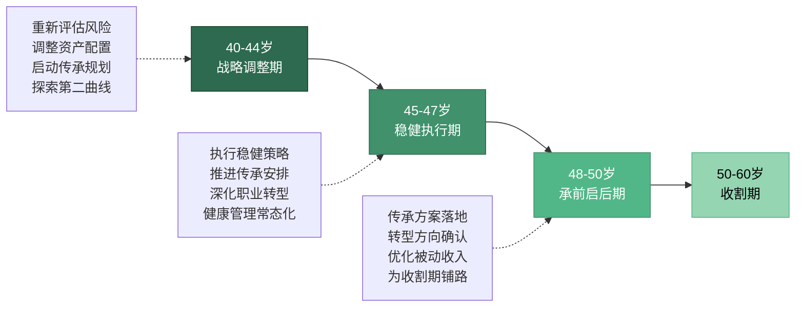

# 第19章 40-50岁：稳健期

## 为什么40-50岁需要从"进攻"转向"稳健"？

40岁到50岁，是人生财富管理的关键转折期。如果说30-40岁是"加速跑"，那么40-50岁就是"匀速跑"——你不再需要追求最快的速度，而是要确保能跑到终点。

这不是一句鸡汤，而是有数据支撑的客观判断。根据中国国家统计局2023年数据，城镇非私营单位就业人员中，40-49岁群体的平均工资处于职业生涯的最高区间，但工资增速已从前一个十年的年均8-12%放缓到3-5%。换句话说，**收入基数在最高点，但增长引擎已经换挡**。

与此同时，你的"恢复周期"在急剧拉长。30岁时，一次投资亏损20%，你有30年时间让它回本；45岁时，同样的亏损只有15年恢复期——而且这15年里你还要面对子女教育、父母养老、职业转型等刚性支出。这意味着你的容错空间在系统性收窄。

根据招商银行2023年《中国私人财富报告》，40-50岁高净值人群的核心关注点从"财富增值"转向"财富保全"的比例高达67%。而在30-40岁群体中，这一比例仅为28%。这个数据清晰地表明：**40-50岁，你的财富策略需要从"增长优先"转向"稳健优先"**。

### 40-50岁与前后十年的本质区别

要理解这十年的独特性，最有效的方法是与前后两个阶段进行系统对比：

| 维度 | 30-40岁（加速期） | 40-50岁（稳健期） | 50-60岁（收割期） |
|:---:|:---:|:---:|:---:|
| **收入特征** | 高增速、指数化可能 | 高基数、增速放缓 | 增速见顶或下降 |
| **核心任务** | 集中突破、构建飞轮 | 守成果、规划传承 | 消化积累、准备退休 |
| **投资策略** | 攻守兼备、本金充实 | 稳健优先、保全导向 | 防御为主、现金流优先 |
| **风险承受** | 中高（仍有回旋余地） | 中低（恢复周期变长） | 低（无法承受重大损失） |
| **试错成本** | 中等（有家庭责任） | 高（牵一发动全身） | 极高（没有时间重来） |
| **职业角色** | 管理者/专家/创业者 | 领导者/决策者/转型者 | 顾问/半退休/传承者 |
| **家庭状态** | 建房育儿、上有老下有小 | 子女教育关键期、父母高龄 | 子女独立、养老压力减轻 |
| **心理状态** | 焦虑与动力并存 | 从容或倦怠并存 | 接纳或遗憾并存 |
| **财富重心** | 积累与增值 | 保全与传承 | 消化与分配 |
| **时间优势** | 还有20-25年 | 只剩10-20年 | 接近终点 |

从表中可以看出，40-50岁是**"高基数+高试错成本"的组合**。30-40岁你有时间和空间去承受风险，50-60岁你已经完成了大部分积累；但40-50岁，你既有足够多的钱需要保护，又没有足够多的时间去从重大失误中恢复。这种"进退两难"的处境，正是这个阶段最核心的矛盾。

### 十年分三段：40-44岁、45-47岁、48-50岁

这十年不是铁板一块，可以清晰地划分为三个阶段，每个阶段的核心策略截然不同：

**40-44岁——战略调整期**

这是从"加速期"向"稳健期"过渡的关键窗口。你的收入可能仍然在增长，但增速已经明显放缓。核心任务是：重新评估风险承受能力，调整资产配置结构，启动财富传承规划的前期准备，开始探索"第二曲线"的可能性。

**45-47岁——稳健执行期**

这是稳健期的"核心阶段"。你的资产配置应该已经完成从"进攻型"向"稳健型"的转换。核心任务是：严格执行稳健型投资策略，推进财富传承的法律和税务安排，深化职业转型的探索（如果需要），将健康管理纳入日常财务规划。

**48-50岁——承前启后期**

这是稳健期的"收尾阶段"，也是为50-60岁"收割期"做准备的关键期。核心任务是：确保财富传承方案已经落地执行，确认职业转型的方向和路径（或者确认继续深耕当前领域），优化被动收入结构，使其能够在50岁后覆盖基本生活需求。

## 本章核心观点

### 核心观点一：从增长导向到保全导向——资产配置的"换挡"

30岁时，你可以承受较大的投资风险，因为时间站在你这边。但到了40-50岁，你的"时间优势"在逐渐减少。一次重大投资失误，可能需要5-10年才能恢复。

这个转变的本质是**风险收益比的重新计算**。假设你45岁，距离退休还有15年。如果你的投资组合亏损30%（约等于2015年A股股灾的幅度），你需要大约4年时间才能回本（假设年化收益8%）。这4年里，你不仅无法享受复利增长，还要承受巨大的心理压力，甚至可能在最差的时机卖出——将账面亏损变成实际亏损。

但"保全导向"不等于"什么都不做"。40-50岁的资产配置核心是**"滑翔路径"**——随着年龄增长，逐步降低权益类资产比例，增加防御性资产比例。这不是一夜之间的转换，而是一个持续10年的渐进过程。

具体而言，40-50岁的资产配置应该遵循以下原则：

- **权益类资产比例**：从40岁的55-60%，逐步下降到50岁的40-45%
- **固定收益类资产**：从40岁的25-30%，逐步上升到50岁的35-40%
- **现金及等价物**：始终保持10-15%的流动性
- **另类资产**（黄金、REITs等）：始终保持5-10%的对冲配置

### 核心观点二：从积累财富到规划传承——越早越好

40-50岁，你应该开始思考财富传承的问题。这不是"太早"——越早规划，越能利用时间优势实现财富的平稳过渡。

财富传承的核心不是"把钱给孩子"，而是**建立一套可持续运转的财富管理系统**。这个系统包括三个层面：

**第一层：资产传承**——通过遗嘱、保险、信托等法律工具，确保资产在代际之间平稳转移。重点是避免遗产纠纷、减少税务损失、保持资产的流动性。

**第二层：能力传承**——培养下一代的财商，让他们具备管理和增值财富的能力。数据显示，70%的家族财富在第二代手中缩水，90%在第三代手中消失。真正需要传承的不是钱本身，而是"赚钱和管钱的能力"。

**第三层：价值观传承**——传递正确的财富观：财富是工具而非目的，是责任而非特权。这比任何法律工具都重要，因为价值观决定了下一代如何使用他们继承的财富。

### 核心观点三：从职业发展到事业转型——找到你的"第二曲线"

查尔斯·汉迪的"第二曲线"理论指出，任何事业都会经历S型的成长曲线。当第一条曲线到达顶点之前，你应该开始培育第二条曲线。

40-50岁，你的第一条职业曲线可能已经接近或到达顶点。此时，你需要认真思考：**我的第二曲线是什么？**

职业转型在这个阶段通常有四种模式：

| 转型模式 | 适用人群 | 典型路径 | 收入特征 |
|:---:|:---:|:---:|:---:|
| 纵向深化 | 行业专家 | 从执行者→行业权威/顾问 | 收入稳定，时薪提升 |
| 横向迁移 | 通用管理者 | 从本行业→相邻行业/投资 | 收入可能先降后升 |
| 创业突破 | 有资源积累者 | 从打工者→创业者 | 收入波动大，上限高 |
| 半退休 | 财务基本自由者 | 从全职→兼职/顾问 | 收入下降，时间自由 |

关键是：**不要等到被迫转型才开始准备**。如果你在45岁时才开始思考"如果明天失业怎么办"，你已经晚了。最好的转型时机是在你还"不需要"转型的时候——这时你有从容的心态、充裕的资源和充足的时间去试错。

### 核心观点四：从个人决策到家庭治理——建立"家庭财务委员会"

这个阶段，你的财务决策不再只影响自己，而是影响整个家庭——包括配偶、子女、父母。你需要建立"家庭财务治理体系"，让每个家庭成员都参与到财务管理中来。

"家庭财务治理"不是"全家一起管钱"，而是建立一套**清晰的决策机制和信息共享机制**。具体包括：

- **财务信息透明**：配偶双方对家庭的资产、负债、收入、支出有完整的认知
- **重大决策协商**：超过一定金额（如10万元）的投资或支出，需要双方同意
- **子女财商教育**：让子女从小参与家庭财务讨论，培养正确的金钱观
- **应急预案制定**：全家人都知道在紧急情况下（如主要收入者丧失工作能力）如何应对

很多家庭的财务问题不是"钱不够"，而是"信息不对称"和"决策不一致"。建立家庭财务治理体系，可以从根本上减少因财务问题引发的家庭矛盾。

### 核心观点五：从忽视健康到重视健康——健康是最大的"隐性资产"

40-50岁，健康开始成为最大的"隐性资产"。一次大病可能耗尽多年积蓄。根据中国精算师协会的数据，40岁以上人群罹患重大疾病的概率在20年内超过50%。而重大疾病的平均治疗费用在30-50万元，如果加上康复费用和收入损失，总成本可能超过100万元。

但"重视健康"不应该停留在"每年做一次体检"的层面。你需要把健康管理纳入财务规划的范畴，建立一套**"健康-财务"联动管理系统**：

- **健康投资**：每年投入1-2万元用于健身、营养、睡眠管理
- **健康保险**：确保重疾险、医疗险的保额充足且覆盖全面
- **健康储备**：预留50-100万元的医疗专项基金
- **健康风险评估**：根据家族病史和个人体检结果，评估未来10年的健康风险敞口

**记住：健康不是省钱的地方，而是最值得投资的资产。** 每花1元在预防上，可以节省8-10元的治疗费用。

## 40-50岁的财富心理地图

40-50岁不仅是财务数字的变化，更是心理状态的深刻转变。理解这些心理变化，才能制定真正有效的财富策略。

### 三种典型心理状态

**从容型**（约30%的人群）：前十年积累了足够的财富和能力，对未来的财务状况有信心。这类人需要警惕的是"过度自信"——认为自己过去的成功经验可以继续适用，忽视了环境和自身条件的变化。

**焦虑型**（约45%的人群）：虽然收入不低，但面对子女教育、父母养老、职业不确定性等多重压力，总觉得"不够"。这类人容易犯两种错误：过度冒险（想"一把翻身"）或过度保守（干脆把钱全部存银行）。

**倦怠型**（约25%的人群）：对工作失去热情，对财务规划缺乏动力，处于"混日子"的状态。这类人最大的风险是"温水煮青蛙"——在不知不觉中错过最佳的转型和规划窗口。

### 克服心理障碍的三个认知框架

**框架一：从"追赶思维"到"赛道思维"**

40-50岁，很多人还在用30岁时的"追赶思维"——总是跟别人比收入、比资产、比职位。但这个阶段更需要的是"赛道思维"——找到适合自己的赛道，按照自己的节奏前进。你不需要比所有人跑得快，只需要确保自己在正确的赛道上，用可持续的速度前进。

**框架二：从"最大化收益"到"最小化遗憾"**

30岁时，你的目标是"最大化收益"——抓住每一个机会。但40-50岁时，更理性的目标是"最小化遗憾"——避免那些可能让你后悔的重大失误。问自己："10年后回头看，我会因为没做这件事而后悔吗？"如果答案是"会"，那就去做。如果答案是"不确定"，那就再等等。

**框架三：从"个人英雄"到"系统思维"**

40-50岁，你最大的优势不是个人能力，而是你有能力构建一个"系统"——包括投资系统、职业发展系统、家庭财务系统。个人英雄主义在这个阶段已经不够用了，你需要的是一个即使你暂时缺席也能正常运转的系统。

## 40-50岁的宏观环境与时代背景

个人财富规划不能脱离时代背景。40-50岁的人正处于职业生涯的"后半程"，同时面临着独特的宏观环境变化。

### 人口结构变化的影响

中国正在快速进入老龄化社会。根据国家统计局数据，2023年中国60岁以上人口已达2.97亿，占总人口的21.1%。预计到2035年，这一比例将超过30%。这意味着：

- **养老金压力增大**：第一支柱（基本养老保险）的替代率可能进一步下降
- **医疗费用上升**：老龄化社会的医疗支出增速将超过GDP增速
- **护理需求爆发**：失能老人的护理费用将成为很多家庭的沉重负担

对于40-50岁的人而言，这意味着你不能完全依赖社会养老体系，必须建立**个人养老的"第二支柱"和"第三支柱"**——企业年金、个人养老金账户、商业养老保险和个人投资组合。

### 利率与资产价格环境的变化

过去20年中国房地产的黄金时代已经结束。40-50岁的人需要重新审视"房子=最好投资"的旧认知：

- 一线城市的房产收益率（租金/房价）已经降至1.5-2%，低于银行定期存款利率
- 人口流入放缓的二三线城市，房产面临长期贬值压力
- "房住不炒"政策下，房产的金融属性在减弱

这意味着你需要将更多的资产从房产中释放出来，配置到更多元化的投资组合中。对于持有多套房产的家庭，需要认真评估是否应该卖出部分房产、将资金转移到流动性更好、收益更稳定的投资工具中。

### AI与技术变革的冲击

40-50岁的人面临一个独特的挑战：你的部分职业能力可能被AI取代，但你积累的行业理解、人脉关系和判断力是AI无法替代的。关键是**从"与AI竞争"转向"与AI协作"**。

具体而言，你需要在50岁之前完成以下能力升级：

- 学会使用AI工具提升工作效率（而不是被AI取代）
- 将你的隐性经验转化为显性知识（让AI能辅助你，而非替代你）
- 发展AI难以替代的能力：复杂判断、人际关系、创意洞察、领导力

## 本章学习目标

读完本章，你将能够：

1. **理解40-50岁的战略定位**：明确这十年在人生财富规划中的"换挡"角色，理解生命周期财务理论、人力资本与金融资本的转换规律、以及"25倍法则"等退休规划核心工具。
2. **掌握稳健型资产配置方法**：学会"滑翔路径"配置法、"桶型配置"策略、动态再平衡技术，在控制风险的前提下实现财富的稳健增长。
3. **启动财富传承规划**：掌握遗嘱制定、保险传承、家族信托等核心工具，学会子女财商培养的系统方法，为财富的代际传递奠定基础。
4. **规划职业转型路径**：理解"第二曲线"理论，学会"经验资本化"的方法，掌握半退休模式的财务和心理准备，为50岁以后的人生做好职业规划。
5. **建立家庭财务治理体系**：学会组织家庭财务会议、制定家庭财务应急预案、培养全家人的财务意识，从"个人理财"升级为"家庭财务治理"。
6. **将健康管理纳入财务规划**：理解健康与财富的深层关联，掌握40-50岁阶段的体检策略、运动方案、饮食调整和压力管理方法。
7. **识别并克服行为金融学陷阱**：了解禀赋效应、沉没成本、损失厌恶等心理偏差在40-50岁的特殊表现，建立理性的投资和决策框架。
8. **制定十年行动路线图**：结合自身情况，制定40-44岁、45-47岁、48-50岁三个阶段的具体目标和行动方案。

## 适合谁读？

本章的目标读者分为五类，每一类都能从本章中获得不同的价值：

**第一类：40-50岁，资产积累到一定程度但不知道如何"守住"的人**

你可能在30-40岁通过投资、创业或职业发展积累了数百万甚至上千万的资产。但你发现，过去让你赚钱的方法——高风险投资、全力拼事业、高强度工作——现在可能不再适用了。你需要学会"换挡"，从进攻转为防守，但又不想让财富停滞不前。本章将教你如何在"稳健"和"增长"之间找到平衡。

**第二类：面临职业瓶颈或中年危机的职场人士**

你可能在公司里已经做到了中高层，但发现上升空间有限；或者你所在的行业正在衰退，担心被淘汰；或者你对当前的工作已经失去了热情，但又不敢轻易改变。本章将帮你理清思路，找到适合自己的"第二曲线"。

**第三类：开始思考财富传承问题的家庭**

你的子女正在长大，父母正在变老。你开始思考：如何确保我的财富能顺利传给下一代？如何培养子女的财商，避免"富不过三代"？如何安排父母的养老？本章将提供系统化的传承规划框架。

**第四类：希望为退休做好充分准备的中年人**

你距离退休还有10-20年，你知道现在是做准备的关键期，但不确定应该准备什么、准备多少。本章将用"25倍法则"等工具帮你量化退休目标，并提供具体的积累路径。

**第五类：希望将健康管理纳入财务规划的人**

你可能已经开始感受到身体的变化——精力不如从前、体检报告上的异常项在增加。你知道健康很重要，但不确定如何将它与财务规划结合起来。本章将建立"健康-财务"联动的管理框架。

## 阅读建议

本章的核心主题是"稳健"。在阅读过程中，建议你带着以下三个问题来思考：

1. **我的风险承受能力是否需要调整？** 如果你的投资组合仍然沿用30岁时的高风险配置，你需要认真评估是否应该"换挡"。
2. **我的财富传承方案是否已经启动？** 如果你还没有遗嘱、没有考虑过资产传承的税务安排、没有开始培养子女的财商，你需要尽快行动。
3. **我的"第二曲线"准备好了吗？** 如果你的全部收入仍然依赖单一来源（工资），你需要开始探索多元化收入的可能性。

**阅读路线图：**

| 阅读顺序 | 小节 | 主题 | 预计阅读时间 | 核心收获 |
|:---:|:---:|------|:---:|----------|
| 1 | 01 理论基础 | 稳健期的底层逻辑 | 40分钟 | 理解生命周期财务理论、风险承受能力变化、资产配置理论 |
| 2 | 02 核心技巧 | 资产配置与传承实战 | 50分钟 | 掌握动态配置、桶型策略、传承工具、职业转型方法 |
| 3 | 03 实战案例 | 六个真实案例 | 30分钟 | 从他人经验中提炼可复用的转型和传承模式 |
| 4 | 04 常见误区 | 十大稳健期陷阱 | 25分钟 | 识别并规避这个阶段最常见的错误 |
| 5 | 05 练习方法 | 实操工具与模板 | 30分钟 | 制定个人十年行动计划 |
| 6 | 06 本章小结 | 核心要点与行动清单 | 15分钟 | 巩固所学，启动执行 |
| 7 | 07 深度拓展 | 进阶主题 | 25分钟 | 为高级读者提供更多深度内容 |

**特别提示**：如果你时间有限，建议优先阅读"02 核心技巧"和"04 常见误区"。前者给你"应该做什么"，后者告诉你"不应该做什么"——两者结合，能让你在最短时间内获得最大的实用价值。对于40-50岁的人来说，"不做什么"往往比"做什么"更重要。

## 本章结构

| 小节 | 主题 | 核心内容 |
|:---:|------|----------|
| 01 | 理论基础 | 生命周期财务理论（莫迪利安尼假说）与人力资本/金融资本的转换规律；风险承受能力的年龄曲线与"序列风险"概念；资产配置的滑翔路径理论与桶型配置法；财富传承的三个维度（资产、能力、价值观）与遗产规划框架；第二曲线理论与经验资本化方法；健康管理与财务规划的量化关联；行为金融学在40-50岁的特殊表现（禀赋效应、损失厌恶、过度自信）；税务筹划的三个层次 |
| 02 | 核心技巧 | 资产配置调整五大技巧（动态配置、安全垫构建、高分红策略、再平衡阈值法、对冲策略）；财富传承五大技巧（遗嘱制定、保险传承、家族信托、子女财商培养、家庭财务会议）；职业转型五大技巧（第二曲线试水、经验资本化、人脉变现、半退休模式、跨界深化）；健康管理五大技巧（重点体检、运动333法则、地中海饮食、睡眠管理、压力管理） |
| 03 | 实战案例 | 企业高管的"滑翔路径"转型全记录；传统行业老板的财富传承方案设计；中年转行的自由职业者转型路径；双职工家庭的半退休规划实践；投资失误后的资产重建之路；健康危机后的财务重构案例；六个案例的共同规律提炼 |
| 04 | 常见误区 | "收入高=财务安全"的认知陷阱；"投资保守=投资安全"的过度防御；"不谈遗产=不吉利"的文化障碍；"靠经验就够了"的职业固化；"健康是年轻人的事"的健康忽视；"家庭财务各管各的"的治理缺失；"退休还早"的规划拖延；"只看收益不看税"的税务盲区；"把所有鸡蛋放一个篮子"的集中风险；"用30岁策略管50岁钱"的策略错配 |
| 05 | 练习方法 | 风险承受能力评估问卷；退休金需求计算模板（25倍法则）；滑翔路径资产配置工作表；家庭资产负债表编制指南；遗产规划清单与法律文件模板；第二曲线探索工作表；健康-财务联动评估表；十年分阶段行动路线图模板 |
| 06 | 本章小结 | 核心要点回顾；30天行动清单；关键公式速查表；推荐书单与学习资源 |
| 07 | 深度拓展 | 行为金融学在中年阶段的深度应用；全球视野下的退休规划对比；长寿风险与应对策略；家族办公室与超高净值传承方案 |

***

> **记住：40-50岁不是"老了"，而是"成熟了"。** 你拥有的最大优势是经验、人脉和判断力——这些是年轻人无法比拟的。关键是用好这些优势，而不是盲目追求年轻人的冒险策略。这个阶段的财富管理，本质上是在做一道"平衡题"——在增长与风险、现在与未来、个人与家庭、财富与健康之间找到最优解。做对了这道题，你将在50岁以后拥有从容选择的自由；做错了这道题，你可能需要用余生来弥补。
