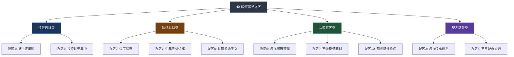
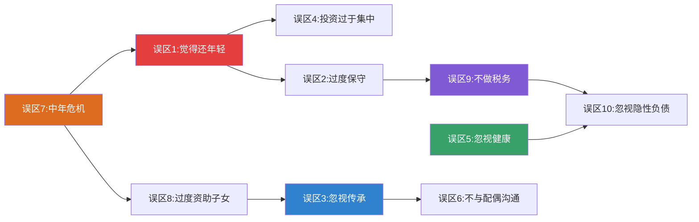

# 第19章 常见误区：40-50岁财富稳健的十大陷阱

## 为什么40-50岁是"踩坑高发期"？

40-50岁的人往往有一种矛盾的心理状态：一方面，他们积累了相当的财富和经验，自信满满；另一方面，面对人生的"下半场"，焦虑和迷茫开始浮现。这种矛盾使得他们特别容易陷入一些看似合理、实则有害的财富误区。

行为金融学的研究表明，人在40-50岁阶段最容易犯两类错误：**惯性错误**（沿用过去有效的策略，忽视环境变化）和**情绪错误**（被恐惧、焦虑、攀比等情绪左右决策）。本章的十大误区，基本可以归入这两类。

理解误区的价值不仅在于"避坑"，更在于建立正确的思维框架。每一个误区的背后，都隐藏着一个需要你掌握的核心原则。

---

## 误区一：觉得自己还年轻，不需要调整策略

### 误区的典型表现

这类投资者的口头禅通常是：

- "我才45岁，还能承受高风险"
- "30岁那年我亏了40%不也回来了吗？"
- "现在调整策略太保守了，至少再冲几年"
- 继续沿用30岁时的投资策略，股票仓位保持在80%以上
- 不愿意降低高风险资产（个股、期货、加密货币）的配置比例

### 为什么这个想法是错的？——恢复时间的数学

这个误区的致命之处在于，它忽视了一个简单的数学事实：**亏损的恢复难度随年龄指数增长**。

假设你在不同年龄亏损了30%，需要多少年才能恢复到原来的资产水平？

| 年龄 | 亏损比例 | 恢复所需年化收益率10% | 恢复所需年数 | 恢复完成时的年龄 |
|:----:|:-------:|:-------------------:|:----------:|:-------------:|
| 30岁 | -30% | 10% | 约3.5年 | 33-34岁 |
| 40岁 | -30% | 10% | 约3.5年 | 43-44岁 |
| 45岁 | -30% | 10% | 约3.5年 | 48-49岁 |
| 48岁 | -30% | 10% | 约3.5年 | 51-52岁 |

看起来恢复年数一样？问题在于：**30岁亏损后还有30年可以继续增长，48岁亏损后只剩下7-12年**。同样的恢复时间，对最终退休资产的影响天差地别。

用复利公式算一笔账：

- **情景A**：30岁时有100万，亏损30%到70万，之后年化10%，到60岁时 = 70万 × (1.1)^30 ≈ **1,221万**
- **情景B**：48岁时有500万，亏损30%到350万，之后年化10%，到60岁时 = 350万 × (1.1)^12 ≈ **1,100万**

情景B的本金是A的5倍，但因为亏损发生在"最后阶段"，最终资产反而更少。这就是**序列风险**（Sequence of Returns Risk）——亏损发生的时点比亏损本身更关键。

### 行为金融学的解释

这种误区源于两种心理偏差：

1. **可得性偏差**（Availability Bias）：你记得30岁时亏损后"回来了"的经历，但忘记了那次恢复花了多长时间、错过了多少其他机会。
2. **过度自信偏差**（Overconfidence Bias）：过去的成功让你高估自己的风险承受能力。你以为自己能承受30%的亏损，但当真的看到账户缩水150万时，你的反应可能完全不同。

### 正确的做法

**第一步：重新评估风险承受能力**

每5年做一次正式的风险评估，不是凭感觉，而是用数字说话：

- 计算你的"最大可承受亏损金额"——不是百分比，是绝对金额。比如：家庭年支出50万，应急基金需要150万（3年），如果你总净资产800万，那么最大可承受亏损 = 800万 - 150万 = 650万的20% = 130万。超过这个数字，你的生活质量就会受到实质性影响。

**第二步：采用"100法则"调整股票比例**

经典公式：股票配置比例 = 100 - 年龄。

- 40岁：60%股票
- 45岁：55%股票
- 50岁：50%股票

这是一个起点，你可以根据个人情况上下浮动10%，但不要偏离太多。

**第三步：建立"分层防护"**

不要把所有资金放在同一个风险级别上。参见本章"核心技巧"部分的桶型资产配置法，将资金分为安全桶、收入桶和增长桶。

---

## 误区二：过度保守，错失增长机会

### 误区的典型表现

- 把80%以上的资产存在银行活期或定期
- 完全不参与股票、基金等权益类投资
- 对任何带"风险"二字的产品都本能排斥
- 只信任"保本保息"的产品
- 听到"亏损"就紧张，但从没算过通胀的侵蚀速度

### 为什么过度保守也是风险？——通胀的隐形刀

过度保守最大的风险不是"少赚了"，而是**你的购买力在持续缩水**。

假设你有500万现金，全部存在银行：

| 年份 | 银行利率(假设) | 通胀率(假设) | 实际收益率 | 500万的实际购买力 |
|:----:|:----------:|:---------:|:-------:|:------------:|
| 第1年 | 2.0% | 3.0% | -1.0% | 495万 |
| 第5年 | 2.0% | 3.0% | -1.0% | 476万 |
| 第10年 | 2.0% | 3.0% | -1.0% | 452万 |
| 第15年 | 2.0% | 3.0% | -1.0% | 430万 |
| 第20年 | 2.0% | 3.0% | -1.0% | 409万 |

**20年后，你的500万只值409万的购买力——你"安全"地亏了91万。**

而且，以上假设通胀率只有3%。如果考虑到教育费用（年增长5-8%）、医疗费用（年增长8-10%）、养老服务（年增长6-8%），实际的购买力缩水更为严重。

### 过度保守的心理根源

1. **损失厌恶放大**：行为金融学发现，人对损失的痛苦感受是同等收益快乐感受的2-2.5倍。40-50岁的人因为家庭责任重，损失厌恶往往更强，导致他们宁可"确定地亏"（被通胀侵蚀）也不愿"可能地赚"（承受波动）。
2. **控制幻觉的反面**：银行存款给人一种"完全掌控"的感觉——数字不会上下波动。但这种"掌控感"是虚假的，因为你无法控制通胀。
3. **锚定效应**：如果在30岁时经历过一次较大的投资亏损，这个记忆会成为"锚"，让你此后对所有投资都持负面态度。

### 40-50岁应该承担多少风险？

关键原则：**你需要承担"足够的"风险，而不是"最大的"风险。**

什么是"足够的"风险？就是能让你的投资收益率**超过通胀率2-3个百分点**的风险水平。

以中国当前的经济环境为例：
- 目标收益率 = 通胀率3% + 溢价3% = **6%年化**
- 要实现6%的年化收益率，你需要将**30-50%**的资产配置在权益类（股票、基金）产品中
- 其余50-70%配置在债券、银行理财、货币基金等低风险产品中

### 正确的做法

**第一步：理解"风险-收益"的对应关系**

| 资产类别 | 预期年化收益 | 最大回撤 | 适合比例(45岁) |
|:------:|:---------:|:------:|:-----------:|
| 货币基金 | 1.5-2.5% | 几乎为零 | 10-15% |
| 银行理财/债券基金 | 3-5% | -2~-5% | 25-30% |
| 混合基金 | 5-8% | -10~-20% | 15-20% |
| 股票基金/指数基金 | 8-12% | -20~-40% | 20-30% |
| 黄金/另类资产 | 5-8% | -10~-20% | 5-10% |

**第二步：从"定投指数基金"开始**

如果你完全没有投资经验，最简单的起步方式是每月定投沪深300指数基金或中证500指数基金。定投的好处是：

- 不需要择时，避免"买在高点"的心理压力
- 利用"微笑曲线"效应，下跌时买入更多份额
- 历史数据表明，A股定投3年以上的正收益概率超过80%

**第三步：设定合理的收益预期**

年化6-10%是40-50岁投资者的合理预期。不要追求15%以上的收益率——那通常意味着你需要承担可能亏损30%以上的风险。

---

## 误区三：忽视财富传承规划

### 误区的典型表现

- "我还年轻，不需要想这些"
- "等老了再说"
- 没有遗嘱，没有保险，没有信托
- 不了解继承法的基本规定
- 从未和配偶或子女讨论过财产安排

### 为什么40岁就要开始规划传承？

很多人以为传承规划是"临终前"的事情。这是一个危险的误解。传承规划的核心不是"临终安排"，而是**"系统性的资产结构优化"**，越早做越好。

**数据警示**：

根据中国裁判文书网的数据，遗产继承纠纷案件从2015年的约8万件增长到2023年的超过15万件，年均增长约8%。最常见的纠纷原因包括：

1. 没有遗嘱（占40%以上）：法定继承的分配方式往往不符合当事人的意愿
2. 遗嘱形式不合法（占20%）：口头遗嘱、自书遗嘱缺乏见证人
3. 财产范围不清晰（占15%）：婚前财产与婚后财产混淆
4. 继承人之间的利益冲突（占25%）：兄弟姐妹、配偶与父母之间的矛盾

**时间杠杆**：传承规划越早做，可用的工具越多、成本越低。

- 40岁开始规划：可以用保险（杠杆比高）、信托（资产增值空间大）、赠与（每年免税额度累计）
- 55岁开始规划：保险杠杆比降低（保费贵）、信托增值空间缩小、赠与时间有限

### 一个真实的警示案例

张先生，48岁，某企业主，突然因心梗离世，未留下遗嘱。他的资产包括：公司股权价值2000万、两套房产共1200万、银行存款300万。

**没有遗嘱的后果**：

- 公司股权：妻子、两个子女、张先生的父母（假设在世）均有继承权，各得约400万的股权。公司治理陷入混乱，合伙人要求退股
- 两套房产：同样需要5人分割，变现困难，引发家庭矛盾
- 银行存款：被冻结用于偿还企业债务和税务，家庭短期内现金流断裂
- 妻子需要同时处理丧事、企业经营、家庭财务、遗产诉讼——精神和经济双重打击

**如果有规划**：

- 生前设立家族信托，将公司股权装入信托，指定妻子和子女为受益人
- 购买500万终身寿险，指定妻子为受益人，身故后立即获得现金流
- 立下公证遗嘱，明确房产分配方案
- 与合伙人签订股东协议，约定股权回购条款

同样的资产，结果天壤之别。

### 正确的做法

**第一步：梳理资产清单**

制作一份完整的资产清单，包括：

- 不动产（房产、土地）
- 金融资产（存款、股票、基金、保险）
- 企业资产（股权、合伙份额）
- 其他资产（知识产权、收藏品、数字资产）
- 负债（房贷、车贷、担保）

**第二步：选择传承工具组合**

| 传承工具 | 优势 | 劣势 | 适合场景 |
|:------:|:----:|:----:|:------:|
| 遗嘱 | 简单、成本低 | 需要公证才更有法律效力，可能被挑战 | 所有人的基本配置 |
| 保险 | 杠杆效应、指定受益人、快速给付 | 保费成本、保额限制 | 需要为家人提供即时现金流 |
| 信托 | 资产隔离、灵活分配、税务优势 | 门槛高（通常100万起）、管理费 | 高净值家庭、复杂家庭结构 |
| 赠与 | 简单直接 | 每年免税额度有限（直系亲属间目前无明确限额但需注意反避税） | 小额资产的提前转移 |
| 遗赠扶养协议 | 保障老人晚年 | 灵活性差 | 无子女或子女不赡养 |

**第三步：与家人沟通**

传承规划不是秘密行动。你需要：

- 与配偶共同讨论资产安排方案
- 在适当的时候与成年子女沟通家族财务状况
- 让家人知道遗嘱和保险的存放位置
- 指定一位"家庭财务应急人"——在你无法处理事务时接管

---

## 误区四：投资过于集中

### 误区的典型表现

- 所有投资都在公司股票上（尤其是上市公司员工）
- 70%以上的资产都是房产
- 把所有钱押在一个行业（比如全部买银行股或全部买科技股）
- 重仓一两只股票，占比超过总资产的30%
- "我在这个行业干了20年，我比基金经理更懂"——典型的过度自信

### 集中投资的毁灭性案例

**案例一：安然公司员工**

2001年安然破产前，公司鼓励员工将401(k)退休金全部购买安然股票。结果公司破产后，员工不仅失去了工作，退休金也化为乌有——超过600亿美元的退休金蒸发。

**案例二：房地产集中**

中国很多家庭的资产结构是：房产占70-80%，金融资产仅占20-30%。当房地产市场下行时（如2022-2024年的调整），这些家庭的净资产大幅缩水，且房产流动性差，急需资金时无法快速变现。

**案例三：行业集中**

某投资者2020年重仓教育行业股票，占总资产60%。2021年"双减"政策出台后，相关股票暴跌70-90%，该投资者损失超过300万。

### 分散投资的科学依据——现代投资组合理论

诺贝尔经济学奖得主马科维茨（Harry Markowitz）的现代投资组合理论（MPT）证明了一个关键结论：**分散投资是唯一的"免费午餐"**。

什么意思？通过将资金分配到相关性低的资产类别中，你可以在**不降低预期收益的情况下降低风险**。

一个简单的例子：
- 资产A：预期收益10%，波动率20%
- 资产B：预期收益10%，波动率20%
- 如果A和B的相关系数为0（完全不相关），各投50%：组合预期收益仍为10%，但波动率降到约14%
- 如果A和B的相关系数为-1（完全负相关），各投50%：波动率降到0

现实中完全负相关的资产很少，但不同资产类别之间的相关性通常远低于1，分散投资就能显著降低组合波动。

### 正确的做法

**第一步：跨资产类别分散**

| 资产类别 | 建议配置比例(45岁) | 作用 |
|:------:|:-------------:|:----:|
| 国内股票 | 25-35% | 长期增长 |
| 债券/固收 | 25-35% | 稳定收益 |
| 房产(自住除外) | 10-20% | 抗通胀 |
| 黄金 | 5-10% | 避险 |
| 海外资产 | 5-10% | 地域分散 |
| 现金/货基 | 10-15% | 流动性 |

**第二步：跨地域分散**

不要只投资A股。考虑配置：
- 港股（通过港股通或QDII基金）
- 美股（通过QDII基金或海外券商）
- 新兴市场基金

**第三步：设定单只资产的"上限规则"**

- 单只股票：不超过总资产的5%
- 单个行业：不超过总资产的20%
- 单一资产类别：不超过总资产的50%
- 自住房产不计入投资资产（它是消费品，不是投资品）

**第四步：定期再平衡**

每半年或一年检查一次资产配置比例，当偏离目标超过5个百分点时进行再平衡。比如目标股票30%，实际涨到38%时，卖出8%转入债券或现金。

---

## 误区五：忽视健康管理

### 误区的典型表现

- "工作太忙，没时间运动"
- "身体还行，不需要体检"
- 用健康换取财富，长期熬夜、高压工作
- 不重视体检报告中的"小问题"
- 认为健康管理是"退休后的事"

### 健康问题的财务冲击

健康不是独立于财务规划之外的事情——它是财务规划中**最大的不确定性因素**。

**一组触目惊心的数据**：

- 中国重大疾病平均治疗费用：30-50万元（含自费药品和进口器材可达80-120万）
- 癌症5年生存率：约40%（意味着60%的人在确诊后5年内离世或丧失劳动能力）
- 重大疾病后平均康复时间：2-3年，期间收入下降50-80%
- 40-50岁是慢性病的高发期：高血压（30%+）、高血脂（25%+）、糖尿病（10%+）、脂肪肝（20%+）

一次重大疾病的总财务影响 = 直接医疗费用 + 收入损失 + 康复费用 + 护理费用，通常在100-300万元。这个数字足以让一个中产家庭"返贫"。

### 健康投资的ROI（投资回报率）

把健康管理当作一项投资来看：

- **投入**：每年健身会员 + 健康饮食增量 + 体检费用 ≈ 1.5-3万元
- **回报1**：降低重大疾病风险 → 可能节省50-100万医疗费用
- **回报2**：保持工作能力 → 每年多赚20-50万
- **回报3**：延长健康寿命 → 多享受5-10年高质量退休生活
- **回报4**：减少医疗支出 → 退休金的购买力提升

没有任何一项金融投资能提供如此高的"风险调整后回报"。

### 正确的做法

**第一步：建立年度体检制度**

40-50岁每年必须做一次全面体检，重点关注：

| 检查项目 | 频率 | 关注指标 | 预警信号 |
|:------:|:---:|:------:|:------:|
| 心血管检查 | 每年 | 血压、血脂、心电图、颈动脉超声 | 血压>140/90、LDL>3.4 |
| 肝脏检查 | 每年 | 肝功能、腹部超声 | 转氨酶升高、脂肪肝 |
| 肿瘤筛查 | 每年 | 肿瘤标志物、低剂量CT(肺)、肠镜(5年) | 标志物异常升高 |
| 血糖检查 | 每年 | 空腹血糖、糖化血红蛋白 | 空腹>6.1、HbA1c>5.7% |
| 骨密度检查 | 每2年 | T值 | T值<-1.0 |
| 眼底检查 | 每年 | 眼底血管 | 动脉硬化征象 |

**第二步：每周运动计划**

推荐的运动组合：

- **有氧运动**：每周3-4次，每次30-45分钟（快走、慢跑、游泳、骑车）
- **力量训练**：每周2次，每次30分钟（深蹲、俯卧撑、哑铃、弹力带）
- **柔韧性训练**：每天10分钟（拉伸、瑜伽）
- **日常活动**：每天步行8000步以上

**第三步：饮食和睡眠管理**

- 减少高油高盐高糖食物的摄入
- 增加蛋白质摄入（每公斤体重1-1.2克）
- 每天摄入足够的蔬菜水果（500克以上）
- 保证每晚7-8小时的睡眠
- 控制饮酒量（男性每天不超过25克酒精）

**第四步：压力管理**

40-50岁是工作和家庭压力的高峰期。长期压力会导致：免疫力下降、心血管疾病风险增加、睡眠质量下降、决策能力下降。

推荐的压力管理方法：
- 每天10分钟冥想或深呼吸
- 每周至少1天完全放松（不工作、不想工作）
- 建立"压力出口"：运动、爱好、社交
- 必要时寻求专业心理咨询

---

## 误区六：不与配偶沟通财务问题

### 误区的典型表现

- 一个人做所有财务决策，配偶只是"通知对象"
- 不告诉配偶家庭的真实财务状况（尤其是债务）
- 夫妻对财务目标不一致，但从不讨论
- 各管各的钱，没有统一的家庭财务视角
- 把"谈钱伤感情"当作借口

### 为什么财务沟通如此重要？

**原因一：风险备份**

如果你突然离世或丧失行为能力，配偶需要能够接管家庭财务。如果配偶对家庭资产、负债、保险、投资一无所知，可能会：

- 错过保险理赔时效
- 无法找到重要的财务文件
- 做出错误的投资决策（比如在市场低点恐慌卖出）
- 被不良金融机构或个人欺骗

**原因二：财务分歧是离婚的主因之一**

多项研究表明，财务问题是婚姻冲突的第一大原因，超过家务分配、子女教育和性生活。常见的财务冲突包括：

- 消费观不一致（一方节俭一方大方）
- 风险偏好不一致（一方保守一方激进）
- 对子女教育投入的分歧
- 对赡养双方父母的分歧
- 对家庭财务目标（买房、换车、旅行）的优先级排序

**原因三：协同效应**

夫妻共同管理财务的效果远好于各管各的。共同管理可以：

- 避免重复投资或遗漏
- 利用双方的风险偏好差异实现更好的资产配置
- 在重大决策上互相制衡，避免冲动行为
- 共同学习，提升全家的财商水平

### 正确的做法

**第一步：建立定期家庭财务会议制度**

建议每月或每季度召开一次"家庭财务会议"，时间约1-2小时，议程包括：

1. 回顾上个月/季度的收入和支出
2. 检查投资组合的表现
3. 讨论近期的重大财务决策
4. 确认下个月/季度的预算
5. 讨论长期财务目标的进展

**第二步：制作家庭资产负债表**

夫妻双方共同制作一份家庭资产负债表，包括：

| 类别 | 项目 | 金额 | 备注 |
|:----:|:----:|:----:|:----:|
| 资产 | 房产（市值） | ? | 评估价或最近成交参考 |
| 资产 | 银行存款 | ? | 所有账户汇总 |
| 资产 | 投资账户 | ? | 股票、基金、理财 |
| 资产 | 保险现金价值 | ? | 终身寿险、年金险 |
| 资产 | 其他资产 | ? | 车辆、收藏品等 |
| 负债 | 房贷余额 | ? | 剩余本金 |
| 负债 | 车贷余额 | ? | 剩余本金 |
| 负债 | 信用卡欠款 | ? | 当期账单 |
| 负债 | 其他负债 | ? | 亲友借款等 |
| **净资产** | | **?** | **资产 - 负债** |

**第三步：明确分工和决策权限**

- 日常支出（<5000元）：各自决定
- 中等支出（5000-50000元）：双方协商
- 大额支出（>50000元）：必须双方一致同意
- 投资决策：共同讨论，明确风险上限

**第四步：共同学习财务知识**

- 一起阅读一本理财入门书
- 一起听一个财务规划的课程
- 一起咨询一位理财顾问

学习的过程本身就是沟通的过程。

---

## 误区七：被"中年危机"情绪左右

### 误区的典型表现

- "我这辈子就这样了"
- 对未来失去信心，觉得不会再有大的突破
- 看到年轻人的成功感到焦虑和嫉妒
- 做出冲动的财务决策：裸辞创业、赌博式投资、报复性消费
- 用物质消费来填补内心的空虚

### 中年危机的本质

心理学家Daniel Levinson的研究表明，中年危机（约40-55岁）的核心是**身份重构**——你从"我是谁"转向"我要成为谁"。这个过程中，焦虑和迷茫是正常的，关键是如何管理这些情绪。

中年危机在财务层面的表现通常有三种模式：

**模式一：恐慌型**

- 觉得自己"来不及了"，开始激进投资
- 追逐高风险高收益的产品（P2P、虚拟币、期货）
- 结果往往是重大亏损

**模式二：放弃型**

- 觉得"就这样了"，放弃财务规划
- 不再关注投资，任由资产"躺平"
- 结果是被通胀侵蚀，退休生活质量下降

**模式三：消费补偿型**

- 用物质消费来缓解焦虑（买豪车、名表、奢侈品）
- 消费水平超过收入能力
- 结果是储蓄率下降，债务增加

### 正确的做法

**第一步：区分"情绪"和"事实"**

当你感到焦虑时，拿出纸笔写下：
- 我现在的净资产是多少？
- 我现在的年收入是多少？
- 我现在的储蓄率是多少？
- 我距离退休还有多少年？

用数字代替感觉。大多数40-50岁的人，实际财务状况比他们"感觉"的要好得多。

**第二步：制定"70岁愿景"**

不要只看"眼前"，也不要只看"退休"。想象一下你70岁时理想的生活状态：

- 你住在哪里？
- 你每天做什么？
- 你和谁在一起？
- 你的健康状况如何？
- 你的财务状况如何？

然后反推：从现在到70岁，你需要做什么？需要存多少钱？需要学习什么技能？

**第三步：找到"可控的行动"**

焦虑往往来自"不可控感"。对抗焦虑的最好方法是找到你能控制的事情，并立即行动：

- 你能控制储蓄率——每月多存1000元
- 你能控制投资组合的分散度——重新平衡一次
- 你能控制学习——读一本理财书、学一个新技能
- 你能控制健康管理——今天开始运动

**第四步：避免在情绪低谷时做重大决策**

给自己一个规则：任何重大的财务决策（辞职、创业、大额投资、大额消费），都要"冷静期"至少30天。30天后还想做，再做。

---

## 误区八：过度资助子女

### 误区的典型表现

- 帮子女买房的首付甚至全款
- 替子女还信用卡、车贷
- 无条件满足子女的经济需求
- 子女工作后仍然"啃老"
- 为了资助子女，压缩自己的退休储蓄

### 为什么过度资助适得其反？

**对子女的伤害**：

1. **丧失独立性**：当一切都被安排好时，子女缺乏动力去自我奋斗。心理学家称之为"习得性无助"——不是他们不能，而是他们觉得不需要。
2. **延迟成熟**：经济上没有压力的人，往往在其他方面也缺乏紧迫感。职业发展、人际关系、问题解决能力都可能滞后。
3. **扭曲的财富观**：如果金钱来得太容易，子女可能不懂得珍惜，也不会管理金钱。

**对自己的伤害**：

1. **退休资金缺口**：假设你每年资助子女10万，连续10年就是100万。如果这100万以8%的年化收益率增长20年，到你退休时价值约466万——这是你退休生活质量的巨大差异。
2. **心理不平衡**：如果牺牲了自己的退休生活质量来资助子女，你可能会在内心积累不满，影响亲子关系。
3. **无法应对意外**：如果你把钱都给了子女，自己遇到重大疾病或紧急情况时，反而需要向子女伸手——这对双方都是一种尴尬。

### 一个关键的数字

退休规划专家建议：**在确保自己的退休资金充足之前，不要资助子女的大额支出。**

计算公式：

- 你的退休目标金额 = 年支出 × 25（基于4%法则）
- 假设退休后年支出30万 → 退休目标 = 750万
- 如果你目前净资产500万，还有10年退休 → 你还差250万，每年需要额外储蓄约25万（假设投资收益能覆盖部分缺口）
- 这意味着你现在应该把多余的收入用于自己的退休储蓄，而不是资助子女

### 正确的做法

**第一步：明确"资助红线"**

- 紧急情况可以资助（医疗、法律等）
- 教育投资可以资助（但要设定上限）
- 奢侈消费不资助
- 首套房可以提供部分帮助（不超过你净资产的10%），但不全款
- 第二套房、豪车等不资助

**第二步：用"借贷"替代"赠与"**

如果确实需要资助子女，可以设计为借贷关系：
- 签订借款协议（不需要利息，但要有还款计划）
- 设定还款期限（比如5-10年）
- 这不是为了真的要回钱，而是培养子女的责任感

**第三步：优先保障自己的退休**

- 每月先存够自己的退休储蓄（至少收入的15-20%）
- 然后再考虑资助子女的金额
- 如果资助会影响自己的退休规划，就要勇于说"不"

**第四步：培养子女的财商**

与其给钱，不如教子女如何赚钱和管钱：
- 鼓励子女制定自己的储蓄计划
- 与子女分享你的投资经验和教训
- 让子女参与家庭财务会议（适当时）

---

## 误区九：不做税务筹划

### 误区的典型表现

- 从来不研究税收政策
- 不了解专项附加扣除的具体项目和金额
- 错过合法的税收减免机会
- 年终奖选择错误的计税方式
- 投资时只看收益，不看税后收益
- 把"税务筹划"等同于"逃税"

### 税务筹划不是"逃税"

首先要明确一个概念：税务筹划是在**合法合规**的前提下，通过合理的安排来降低税负。它和逃税有本质区别：

| 维度 | 税务筹划 | 逃税 |
|:----:|:------:|:----:|
| 合法性 | 完全合法 | 违法 |
| 方式 | 利用税收优惠政策 | 隐匿收入、虚报支出 |
| 后果 | 合法节税 | 罚款、刑事责任 |
| 可持续性 | 长期有效 | 随时可能被查处 |

### 40-50岁的税务筹划空间

40-50岁通常是收入最高的阶段，也是税务筹划空间最大的阶段。主要筹划方向包括：

**方向一：充分利用专项附加扣除**

2024年起，中国个人所得税的专项附加扣除包括：

| 扣除项目 | 扣除标准 | 常见遗漏 |
|:------:|:------:|:------:|
| 子女教育 | 2000元/月/孩 | 3岁以下婴幼儿照护 |
| 继续教育 | 400元/月(学历)或3600元/年(职业资格) | 只知道学历教育 |
| 大病医疗 | 超1.5万部分，限额8万/年 | 忘记保留医疗票据 |
| 住房贷款利息 | 1000元/月 | 夫妻间最优分配 |
| 住房租金 | 800-1500元/月(视城市) | 与房贷利息不能同时享受 |
| 赡养老人 | 3000元/月 | 独生子女vs非独生子女的区别 |
| 3岁以下婴幼儿照护 | 2000元/月/孩 | 容易被忽略 |

一对夫妻如果有2个孩子、赡养老人、有房贷，每月可扣除的金额 = 2×2000 + 3000 + 1000 = 8000元，年扣除额96000元。如果边际税率为20%，每年可节省税款约19200元。

**方向二：年终奖的计税方式选择**

年终奖可以选择"单独计税"或"并入综合所得"。哪种更优取决于你的收入水平：

- 年综合所得应纳税所得额在36000元以下：通常选择"并入综合所得"更优
- 年综合所得应纳税所得额较高：通常选择"单独计税"更优
- 最准确的方法：两种方式都算一遍，选税额低的那个

**方向三：投资收益的税务优化**

- **股票**：持有期超过1年的股息红利免征个人所得税；A股买卖差价暂免个人所得税
- **基金**：基金分红暂不征收个人所得税；基金赎回差价暂免个人所得税
- **房产**：满5年且唯一住房免征个人所得税；注意"满五唯一"的认定
- **保险**：保险赔款免征个人所得税；年金险的收益在领取时才纳税

### 正确的做法

**第一步：年底做一次"税务审计"**

每年12月，花1-2小时检查：
- 所有专项附加扣除是否都已申报
- 是否有遗漏的扣除项目
- 年终奖的计税方式是否选择了最优方案
- 是否有可以合理安排的收入和支出

**第二步：利用个人养老金账户**

每年可存入12000元，享受税前扣除。对于边际税率20%的人，每年可节省2400元税款。

**第三步：企业主的额外筹划**

如果你是企业主，额外的筹划空间包括：
- 合理选择企业组织形式
- 利用研发费用加计扣除等税收优惠政策
- 合理安排薪酬结构（工资+奖金+股权激励的比例）

**第四步：咨询专业税务顾问**

如果年收入超过50万或有复杂的资产结构，建议每年花3000-5000元咨询一次专业税务顾问。好的税务建议可能为你节省数万元。

---

## 误区十：忽视"隐性负债"

### 误区的典型表现

- 只关注显性负债（房贷、车贷），从不计算隐性负债
- 没有为子女教育、父母养老、自己的退休做专门的储蓄计划
- 用"到时候再说"来逃避规划
- 认为"收入会一直涨"，不需要特别准备

### 什么是"隐性负债"？

隐性负债是指**你未来必须承担的、但目前还没有出现在资产负债表上的大额支出承诺**。40-50岁人群的隐性负债通常包括：

| 隐性负债项目 | 预估金额(元) | 时间窗口 | 紧迫程度 |
|:----------:|:---------:|:------:|:------:|
| 子女大学教育(国内) | 15-30万/4年 | 5-15年 | 中 |
| 子女留学(如适用) | 100-200万/2-4年 | 5-15年 | 高 |
| 子女婚嫁 | 20-50万 | 10-20年 | 中 |
| 父母养老(10-20年) | 50-100万 | 即刻-20年 | 高 |
| 父母医疗(大病储备) | 30-50万 | 随时可能 | 紧急 |
| 自己的退休生活(20-30年) | 300-750万 | 10-20年 | 最高 |
| 自己的医疗储备 | 50-100万 | 10-30年 | 高 |
| 住房改善/维修 | 20-50万 | 不确定 | 低 |

把这些隐性负债加起来，一个典型的40-50岁中产家庭面临的隐性负债总额可能在**500-1200万元**。

### 为什么"到时候再说"是最危险的策略？

**理由一：时间杠杆消失**

隐性负债最大的特点是"时间确定性"——你知道它一定会来。子女18岁要上大学，这是确定的。如果你在子女10岁时开始准备，有8年时间；如果你在子女16岁时才开始准备，只有2年时间。8年和2年的差距，不仅仅是时间——是复利效应的巨大差异。

假设大学费用30万，投资收益率8%：
- 8年前开始准备：每月存2300元
- 2年前开始准备：每月存10800元

提前准备的月储蓄额只有临时抱佛脚的**1/5**。

**理由二：多线作战的压力**

40-50岁的人往往同时面对多个隐性负债：子女教育、父母养老、自己的退休。如果你不提前规划，这些隐性负债可能在同一个时间段集中爆发，造成巨大的财务压力。

### 正确的做法

**第一步：列出你的隐性负债清单**

拿出纸笔，列出你未来10-30年可能面临的所有大额支出，估算金额和时间。

**第二步：为每个隐性负债设立"专款专用"的储蓄账户**

- 子女教育基金：每月定投到一个专门的基金账户
- 父母养老基金：每月存入一个高流动性的账户
- 退休基金：利用个人养老金账户+商业养老保险+基金定投
- 医疗基金：存入货币基金或短期理财

**第三步：计算"隐性负债覆盖率"**

公式：隐性负债覆盖率 = 已准备资金 / 隐性负债总额

- 覆盖率 > 80%：优秀，继续保持
- 覆盖率 50-80%：良好，加大储蓄力度
- 覆盖率 30-50%：需要关注，制定加速计划
- 覆盖率 < 30%：紧急，需要立即行动

**第四步：每年更新一次隐性负债清单**

随着生活变化（升职加薪、子女长大、父母健康变化），你的隐性负债也在变化。每年年底更新一次清单，调整储蓄计划。

---

## 十大误区的关联分析

这十大误区不是孤立存在的，它们之间有着密切的关联。理解这些关联，可以帮助你更系统地避免误区。

**核心关联链**：

1. **心理→行为链**：中年危机（误区7）→ 觉得还年轻（误区1）或过度保守（误区2）→ 投资决策失误
2. **规划缺失链**：忽视传承（误区3）+ 不与配偶沟通（误区6）→ 家庭财务混乱
3. **成本叠加链**：忽视健康（误区5）+ 忽视隐性负债（误区10）→ 财务危机集中爆发
4. **效率损失链**：不做税务筹划（误区9）+ 过度资助子女（误区8）→ 长期财富积累效率大幅下降

---

## 误区自检清单

用以下清单逐项检查自己是否陷入了误区。每一项都对应一个明确的行动项。

| 序号 | 自检问题 | 风险等级 | 如果回答"否" |
|:----:|:------:|:------:|:----------:|
| 1 | 我的投资策略是否根据年龄做了调整？ | 高 | 立即重新评估风险承受能力 |
| 2 | 我的投资是否足够分散（跨资产类别、跨地域）？ | 高 | 本周内检查并调整资产配置 |
| 3 | 我是否制定了财富传承计划（遗嘱、保险）？ | 高 | 本月内完成遗嘱和保险规划 |
| 4 | 我是否有定期体检和运动习惯？ | 高 | 本周预约体检，制定运动计划 |
| 5 | 我是否与配偶共同管理家庭财务？ | 中 | 本周召开第一次家庭财务会议 |
| 6 | 我是否被"中年危机"情绪影响了财务决策？ | 中 | 列出近3年的重大财务决策，检查是否有冲动成分 |
| 7 | 我是否过度资助了子女？ | 中 | 计算资助总额，评估对退休计划的影响 |
| 8 | 我是否做了税务筹划（专项附加扣除、年终奖计税方式）？ | 中 | 本月内检查并优化税务安排 |
| 9 | 我是否计算了"隐性负债"总额？ | 高 | 本周内完成隐性负债清单 |
| 10 | 我是否有足够的应急基金（6-12个月生活费）？ | 高 | 本月内检查并补足应急基金 |

**评分标准**：

- **0-2项"否"**：优秀，你已经建立了良好的财务习惯
- **3-4项"否"**：良好，但需要针对薄弱环节制定改进计划
- **5-6项"否"**：警告，你的财务规划存在明显漏洞，建议本月内开始系统性改进
- **7项以上"否"**：紧急，建议立即预约专业理财顾问，进行全面的财务诊断

---

## 从误区到正途：30天行动计划

知道误区是第一步，从误区中走出来才是关键。以下是一个30天的行动计划，帮助你系统性地纠正这些问题。

### 第一周：诊断

- **Day 1-2**：完成上述自检清单，识别最大的3个问题
- **Day 3-4**：制作家庭资产负债表，列出隐性负债清单
- **Day 5-7**：与配偶召开第一次家庭财务会议，讨论诊断结果

### 第二周：止损

- **Day 8-9**：检查投资组合的分散度，是否过度集中在某类资产
- **Day 10-11**：检查税务安排，确认所有专项附加扣除已申报
- **Day 12-14**：检查保险配置，确保重疾险和医疗险保额充足

### 第三周：规划

- **Day 15-17**：制定隐性负债的储蓄计划，设立专用账户
- **Day 18-19**：预约体检和运动计划
- **Day 20-21**：开始起草遗嘱（可以先用模板，后续再请律师公证）

### 第四周：执行

- **Day 22-24**：调整投资组合（如果需要再平衡）
- **Day 25-27**：设立每月自动转账（储蓄、定投）
- **Day 28-30**：建立家庭财务会议的定期日程（每月第一个周日）

**核心原则**：不要试图一次解决所有问题。每次只聚焦1-2个最重要的问题，解决后再处理下一个。循序渐进，持之以恒。

---

## 本节核心要点回顾

> **40-50岁财富管理的最大敌人不是市场波动，而是认知盲区和行为惯性。**

十大误区的本质，归结为三个核心教训：

1. **主动调整，而非被动等待**：你的财务策略需要随着年龄、收入、家庭状况的变化而调整。"过去有效"不等于"现在有效"。
2. **系统规划，而非零散应对**：把投资、保险、税务、传承、健康作为一个整体来规划，而不是各自为政。
3. **尽早行动，而非"到时候再说"**：复利效应不仅适用于投资，也适用于规划。越早开始，成本越低、效果越好。

记住：**犯错不可怕，可怕的是不知道自己在犯错。** 如果你在自检清单中发现了问题，说明你已经有了自我觉察的能力——这是改变的第一步，也是最重要的一步。
