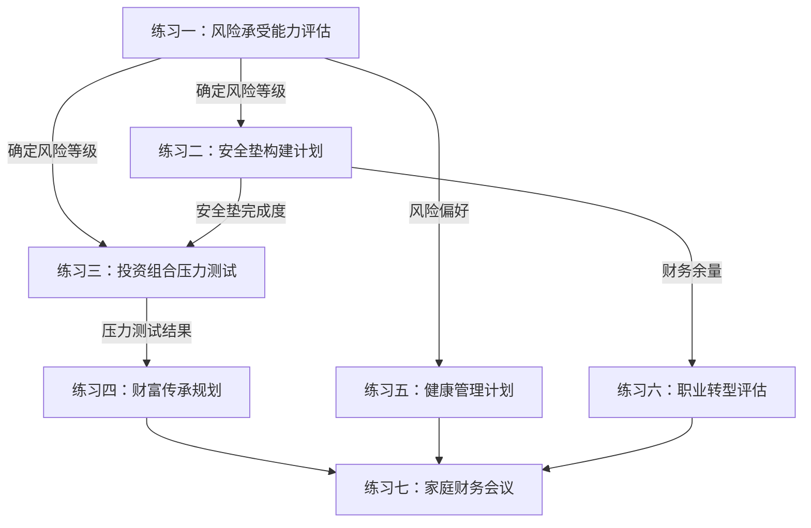

# 第19章 练习方法：40-50岁财富稳健的实操训练

本章提供七个实操练习，覆盖40-50岁财富稳健期的核心维度。每个练习都不是"填空题"——它是一次完整的自我诊断和行动计划制定过程。建议按顺序完成，因为后面的练习依赖前面的结论。

**练习之间的逻辑关系：**



**完成时间预估：** 全部七个练习约需6-8小时。建议分3次完成：第一次做练习一、二（约2小时），第二次做练习三、四（约2小时），第三次做练习五、六、七（约2-3小时）。

---

## 练习一：风险承受能力重新评估

### 为什么40-50岁必须重新评估？

30岁时你可能是个激进型投资者，但到了45岁，情况完全不同了。有三个因素在变化：

1. **恢复时间缩短**：30岁亏损30%，你有30年恢复；45岁亏损30%，只剩15年。同样幅度的亏损，后果完全不同。
2. **责任加重**：子女教育、父母养老、房贷——任何一个环节出问题，都需要稳定的现金流。
3. **收入增长放缓**：40岁以后，工资涨幅通常从10-15%下降到3-5%，"用时间换空间"的余地变小。

风险承受能力不是一成不变的。每两年做一次评估，是40-50岁阶段的基本纪律。

### 步骤

**第1步：回答以下问题（每题1-5分）**

| 问题 | 评分标准 | 你的评分 |
|------|----------|---------|
| 1. 距离退休还有多少年？ | ≤3年=1分，4-7年=2分，8-11年=3分，12-15年=4分，≥16年=5分 | |
| 2. 如果投资亏损30%，你会怎么做？ | 立即卖出=1分，卖出一部分=2分，观望不动=3分，少量加仓=4分，继续持有或加仓=5分 | |
| 3. 你的收入稳定性如何？ | 自由职业/无固定收入=1分，收入波动大=2分，基本稳定但有裁员风险=3分，体制内或稳定企业=4分，多重稳定收入来源=5分 | |
| 4. 你有多少应急基金？ | 没有=1分，1-3个月=2分，4-6个月=3分，7-12个月=4分，12个月以上=5分 | |
| 5. 你的家庭负担有多重？ | 有老人+子女+房贷=1分，三项占二=2分，三项占一=3分，基本无负担=4分，无任何负担=5分 | |
| 6. 你的投资经验有多少年？ | 无经验=1分，1-3年=2分，4-7年=3分，8-14年=4分，15年以上=5分 | |
| 7. 你的健康状况如何？ | 有慢性病或重大病史=1分，一般偏弱=2分，基本健康=3分，良好=4分，每年体检全部正常且有运动习惯=5分 | |
| 8. 你是否有主要收入以外的收入来源？ | 没有=1分，偶尔有兼职=2分，有稳定的副业=3分，有被动收入（租金/分红）=4分，有多个被动收入来源=5分 | |

**第2步：计算总分并确定风险等级**

| 总分区间 | 风险等级 | 特征描述 |
|----------|---------|---------|
| 8-16分 | **保守型** | 你的风险承受能力较低。保本是第一优先级，收益目标跑赢通胀即可。适合以债券和货币基金为主。 |
| 17-24分 | **稳健型** | 你有一定的风险承受能力，但需要严格控制波动。适合"核心+卫星"配置——大部分资金在低波动资产，小部分参与权益市场。 |
| 25-32分 | **平衡型** | 你的风险承受能力较好，可以承受中等波动。适合股债均衡配置，但需要设置止损线和再平衡机制。 |
| 33-40分 | **进取型** | 你的风险承受能力较强，但40-50岁阶段仍需谨慎。即使得分高，也不建议股票配置超过60%。 |

**重要提醒：** 如果你在第2题（亏损反应）和第7题（健康状况）中得分≤2，无论总分多少，都建议自动下调一个等级。因为这两项反映了你的"心理承受力"和"身体承受力"——它们比财务数据更能预测你在真实下跌中的行为。

**第3步：根据风险等级调整资产配置**

以下是40-50岁各风险等级的资产配置建议（百分比）：

| 资产类别 | 保守型 | 稳健型 | 平衡型 | 进取型 |
|----------|--------|--------|--------|--------|
| 货币基金/活期理财 | 20% | 15% | 10% | 5% |
| 短期债券基金 | 30% | 20% | 10% | 5% |
| 中长期债券基金 | 20% | 20% | 20% | 15% |
| 宽基指数基金（沪深300/中证500） | 15% | 25% | 35% | 40% |
| 红利/高股息基金 | 5% | 10% | 10% | 15% |
| 黄金ETF | 5% | 5% | 5% | 5% |
| 海外市场基金 | 0% | 5% | 5% | 10% |
| 另类投资（REITs等） | 5% | 0% | 5% | 5% |
| **合计** | **100%** | **100%** | **100%** | **100%** |

**配置逻辑说明：**
- **保守型**：以货币基金+短期债券为"安全垫"（50%），中长期债券提供略高收益（20%），指数基金保留增长潜力（15%）。适合即将退休或收入不稳的人群。
- **稳健型**：债券类合计55%提供稳定基础，权益类（指数+红利）35%追求增长，黄金5%对冲极端风险。适合大多数40-50岁人群。
- **平衡型**：权益类（指数+红利+海外）50%与固收类40%接近均衡，适合收入稳定、有充足应急基金的人群。
- **进取型**：权益类（指数+红利+海外）65%为主，但仍保留30%固收类。即使你很激进，40岁以后也不应孤注一掷。

**常见错误：**
- ❌ 照搬30岁时的配置方案——你的风险承受力已经变了
- ❌ 只看总分不看单项——某一项特别低（如健康=1分）需要特殊处理
- ❌ 评估完就不管了——40-50岁阶段每两年必须重新评估
- ❌ 只评估财务风险，不评估心理风险——你能"承受"亏损和你能"安然入睡"是两回事

### 频率
每两年做一次全面评估。如果发生重大生活事件（失业、离婚、重病、继承遗产等），立即重新评估。

---

## 练习二：安全垫构建计划

### 为什么40-50岁需要3-5年安全垫？

"安全垫"是你在任何市场条件下都能不动用投资组合的财务缓冲。30岁时，1-3个月的应急基金就够了——大不了重新找工作。但40-50岁，情况更复杂：

- **再就业周期长**：40岁以上被裁员，平均再就业周期6-12个月（30岁以下仅2-3个月）
- **刚性支出增加**：子女教育、父母医疗——这些不能因为市场下跌就暂停
- **心理防线**：有安全垫的人，在市场下跌20%时能保持理性；没有安全垫的人，会被迫在底部卖出

安全垫不是"收益最低的资金"，它是"让你在其他地方赚到钱的基础设施"。

### 步骤

**第1步：计算每月必要支出**

| 支出项目 | 金额（元） | 说明 |
|---------|-----------|------|
| 房贷/房租 | | 包括公积金还款部分 |
| 日常生活费 | | 食品、水电、通讯、日用品 |
| 子女教育 | | 学费、课外班、生活费（按当前水平） |
| 赡养父母 | | 如果父母需要经济支持 |
| 保险费用 | | 商业保险的年缴/月缴 |
| 交通费用 | | 车贷、油费、公共交通 |
| 医疗支出 | | 慢性病用药、定期复查 |
| 其他必要支出 | | 物业费、维修费等 |
| **月支出合计** | | |

**计算技巧：** 不要用"平均月支出"，要用"维持体面生活的最低月支出"。意思是——如果明天失业，你每个月至少需要多少钱才能不降低基本生活质量？把"可选支出"（旅游、奢侈品、高端餐饮）排除在外。

**第2步：计算安全垫目标**

| 安全垫层级 | 月数 | 计算公式 | 适用场景 |
|-----------|------|---------|---------|
| 基础安全垫 | 12个月 | 月支出 × 12 | 单一收入来源、体制外工作者的最低标准 |
| 标准安全垫 | 24个月 | 月支出 × 24 | 双收入家庭、有副业收入者的建议标准 |
| 充裕安全垫 | 36个月 | 月支出 × 36 | 自由职业者、企业主、收入不稳定者的理想标准 |
| 超级安全垫 | 60个月 | 月支出 × 60 | 接近半退休状态、即将转型者的目标标准 |

**第3步：评估现有安全垫**

安全垫应该是分层存放的——不同层级的资金放在不同流动性的地方：

| 安全垫层级 | 存放位置 | 流动性 | 建议金额 | 你的现状 |
|-----------|---------|--------|---------|---------|
| 第一层：即时可用 | 货币基金/活期理财/银行活期 | T+0或T+1 | 3-6个月支出 | |
| 第二层：短期可用 | 短期债券基金/国债逆回购 | T+1到T+3 | 6-12个月支出 | |
| 第三层：中期储备 | 中期债券基金/大额存单 | 可赎回但有锁定期 | 12-24个月支出 | |
| **合计** | | | **目标：24-36个月** | |

**分层的意义：** 第一层应对突发急需（突然失业、家人生病），第二层应对短期困难（3-6个月的收入中断），第三层应对中期危机（行业衰退、长期找不到工作）。三层合计构成完整的安全垫体系。

**第4步：制定补充计划**

| 项目 | 你的数据 |
|------|---------|
| 安全垫缺口（目标 - 现有） | ______ 元 |
| 每月可投入安全垫的金额 | ______ 元 |
| 预计完成时间（缺口 ÷ 月投入） | ______ 个月 |
| 资金来源 | □ 工资结余 □ 年终奖 □ 投资收益 □ 其他______ |

**加速策略：**
- **年终奖优先法**：每年年终奖的50-70%直接划入安全垫，直到达标
- **收入增长转移法**：每次加薪，将加薪部分的全部金额自动转入安全垫
- **投资收益截留法**：当投资盈利超过预期时，将超额部分转入安全垫
- **消费降级法**：压缩非必要支出6-12个月，将节省的资金全部投入安全垫

**常见错误：**
- ❌ 把安全垫和投资资金混在一起——需要动用时可能正好是市场低点
- ❌ 安全垫放太多在活期——3-6个月的活期就够了，多余的应该放在短期债券基金
- ❌ 觉得安全垫达标了就不管了——支出会变、收入会变，安全垫目标也要调整
- ❌ 用安全垫去"抄底"——安全垫的钱永远不能动，不管市场多便宜

### 频率
每年评估一次。如果家庭支出结构发生变化（子女上大学、父母需要护理等），立即重新计算。

---

## 练习三：投资组合压力测试

### 什么是压力测试？

压力测试就是问自己一个残酷的问题："如果最坏的情况发生，我的财务会不会崩溃？"银行和保险公司每年都要做压力测试，你的家庭财务同样需要。

这个练习的核心价值不在于"预测未来"，而在于**提前发现脆弱点**。发现了脆弱点，你就能在风暴来临前加固它。

### 步骤

**第1步：列出当前投资组合**

| 资产类别 | 具体产品/标的 | 金额（元） | 占比 | 流动性（变现天数） |
|---------|-------------|-----------|------|------------------|
| 股票/股票基金 | | | % | |
| 债券/债券基金 | | | % | |
| 货币基金 | | | % | |
| 银行存款/大额存单 | | | % | |
| 房产（净值） | | | % | |
| 黄金 | | | % | |
| 保险（现金价值） | | | % | |
| 企业股权 | | | % | |
| 其他 | | | % | |
| **合计** | | | **100%** | |

**填写说明：** 房产填"净值"（市价-剩余贷款），保险填"现金价值"（退保能拿回的钱），企业股权填"可变现估值"。不要高估任何资产的流动性——卖房可能需要3-6个月，企业股权转让可能需要1年以上。

**第2步：模拟极端场景**

以下是40-50岁阶段最需要测试的五个极端场景：

**场景1：股市下跌40%（参照2008年/2015年）**

| 项目 | 计算过程 | 你的数据 |
|------|---------|---------|
| 股票类资产现值 | | ______ 元 |
| 下跌40%后价值 | 现值 × 0.6 | ______ 元 |
| 股票部分亏损 | 现值 × 0.4 | ______ 元 |
| 组合总资产减少比例 | 亏损 ÷ 组合总值 | ______ % |
| 你能安然持有不卖出吗？ | □ 能 □ 不能 | |

**判断标准：** 如果组合总资产减少超过20%，或者你无法回答"能安然持有"，说明权益配置过高。

**场景2：失业12个月（参照40+再就业数据）**

| 项目 | 你的数据 |
|------|---------|
| 12个月必要支出 | ______ 元 |
| 失业期间保险保障（如有） | ______ 元 |
| 需要从投资中取出 | ______ 元 |
| 取出后组合剩余 | ______ 元 |
| 需要在市场低点卖出吗？ | □ 是 □ 否 |
| 安全垫能覆盖多少个月？ | ______ 个月 |

**判断标准：** 如果安全垫覆盖不足12个月，或者需要在市场低点卖出资产，说明安全垫不足。

**场景3：重大疾病（参照常见大病治疗费用）**

| 项目 | 你的数据 |
|------|---------|
| 预估医疗费用（自费部分） | ______ 元（参考：癌症30-80万，心脏手术15-40万） |
| 治疗期间收入损失（6个月） | ______ 元 |
| 重疾险赔付金额 | ______ 元 |
| 医疗险报销后自费 | ______ 元 |
| 总资金缺口 | ______ 元 |
| 需要动用投资多少？ | ______ 元 |

**判断标准：** 如果重疾险+医疗险不能覆盖大部分费用，或者动用投资后组合大幅缩水，说明保险保障不足。

**场景4：利率大幅上升（参照2022-2023年加息周期）**

| 项目 | 你的数据 |
|------|---------|
| 你的房贷利率类型 | □ 固定 □ LPR浮动 |
| 如果利率上升2%，月供增加 | ______ 元 |
| 你的债券基金预计亏损 | ______ 元（利率每上升1%，长期债券约亏5-8%） |
| 你能承受吗？ | □ 能 □ 不能 |

**场景5：突发大额支出（子女留学/父母护理/房屋维修）**

| 项目 | 你的数据 |
|------|---------|
| 未来3年可能的大额支出 | ______ 元 |
| 这些支出是否有专项储蓄？ | □ 有 □ 部分有 □ 没有 |
| 如果没有专项储蓄，从哪里出？ | |

**第3步：根据测试结果调整**

| 测试结果 | 需要采取的行动 |
|----------|--------------|
| 场景1未通过（无法承受40%下跌） | 降低权益类配置10-20%，增加债券类资产 |
| 场景2未通过（安全垫不足12个月） | 暂停非必要投资，优先补充安全垫 |
| 场景3未通过（保险保障不足） | 补充重疾险（保额≥年收入5倍）和百万医疗险 |
| 场景4未通过（利率敏感度高） | 缩短债券久期，考虑提前还部分房贷 |
| 场景5未通过（大额支出无准备） | 为每项大额支出建立专项储蓄账户 |
| 全部通过 | 恭喜！每年重测一次即可 |

**常见错误：**
- ❌ 只测一个场景就放心了——你需要通过所有场景
- ❌ 用"正常情况"代替"极端情况"——压力测试就是要测最坏的情况
- ❌ 测完了不做调整——发现问题不解决，等于没测
- ❌ 忽略"组合效应"——失业+市场下跌可能同时发生

### 频率
每年做一次。如果投资组合发生重大调整（买入新资产、资产大幅波动等），立即重测。

---

## 练习四：财富传承规划工作表

### 为什么40-50岁就要开始规划传承？

很多人的第一反应是"我还年轻，不急"。但传承规划有几个时间窗口一旦错过，成本会大幅增加：

- **保险杠杆**：40岁买终身寿险的保费比50岁便宜40-60%。越早规划，杠杆越高。
- **信托架构**：家族信托的设立需要时间，从规划到落地通常需要6-12个月。
- **税务安排**：部分传承工具（如赠与、保险）需要满足一定的持有期限才能享受税务优惠。
- **财商教育**：培养下一代的理财能力，至少需要5-10年——现在开始，到他们真正需要管理财富时才来得及。

### 步骤

**第1步：资产清单**

| 资产类型 | 具体项目 | 市场价值（元） | 权属人 | 负债（元） | 净值（元） | 是否有遗嘱安排 |
|---------|---------|--------------|--------|-----------|-----------|--------------|
| 房产（自住） | | | | | | □ 有 □ 无 |
| 房产（投资） | | | | | | □ 有 □ 无 |
| 银行存款 | | | — | — | | □ 有 □ 无 |
| 股票/基金 | | | — | — | | □ 有 □ 无 |
| 保险（寿险/年金） | | | | — | | □ 有 □ 无 |
| 企业股权 | | | | | | □ 有 □ 无 |
| 车辆 | | | | | | □ 有 □ 无 |
| 其他 | | | | | | □ 有 □ 无 |
| **合计** | | | | | | |

**关键提醒：** "权属人"这一列非常重要。很多家庭的资产登记在一方名下，如果该方突然离世，资产可能被冻结，直到完成继承手续（通常需要3-6个月）。建议至少将部分流动性资产设置为联名账户。

**第2步：传承对象与分配方案**

| 传承对象 | 关系 | 年龄 | 传承金额/比例 | 传承方式 | 特殊考虑 |
|---------|------|------|-------------|---------|---------|
| | | | | | □ 未成年需监护人 □ 有特殊需求 □ 无 |
| | | | | | □ 未成年需监护人 □ 有特殊需求 □ 无 |
| | | | | | □ 未成年需监护人 □ 有特殊需求 □ 无 |

**分配原则：**
- **公平不等于平均**：根据各继承人的实际需求和能力分配，而非简单平分
- **有条件传承**：可以设定条件（如完成大学教育、达到一定年龄等），防止挥霍
- **预留弹性**：分配方案不要定死，留出10-20%的灵活空间应对未来变化

**第3步：传承工具选择**

| 工具 | 适用场景 | 优势 | 劣势 | 费用 | 最佳启动年龄 |
|------|---------|------|------|------|------------|
| **遗嘱** | 所有人群的基础传承工具 | 费用低、可随时修改、覆盖全部资产 | 需要公证或见证，可能被质疑效力，无法避免遗产纠纷 | 公证费200-1000元 | 越早越好 |
| **人寿保险** | 需要定向传承、杠杆放大资产 | 指定受益人不受遗产纠纷影响，有杠杆效应（保费<保额），赔付速度快 | 需要健康核保，年龄越大保费越高，部分产品流动性差 | 年缴保费视保额而定 | 40-45岁（此时健康和费率最优） |
| **家族信托** | 高净值家庭（可投资资产≥1000万） | 资产隔离保护，可设定复杂的传承条件，跨代传承 | 门槛高，设立费用高，管理费持续产生 | 设立费5-20万+年管理费0.5-1% | 45岁以后（资产规模稳定时） |
| **赠与** | 希望提前转移部分资产 | 程序简单，立即生效 | 不可撤销，失去资产控制权，可能涉及赠与税 | 过户税费 | 根据具体需求 |
| **保险金信托** | 中高净值家庭（300-1000万） | 结合保险杠杆和信托灵活性，门槛低于纯信托 | 产品选择有限，需要同时对接保险和信托机构 | 保险保费+信托管理费 | 40-50岁 |
| **遗嘱信托** | 有特殊传承需求（如保护弱势继承人） | 通过遗嘱设立，生前不影响资产使用 | 遗嘱效力风险，执行可能受阻 | 律师费+信托管理费 | 45岁以后 |

**第4步：子女财商培养计划**

传承不仅是"传钱"，更是"传能力"。一个不会管理财富的继承人，1000万也可能在5年内化为乌有。

| 年龄段 | 培养内容 | 具体方法 | 频率 |
|--------|---------|---------|------|
| 12-15岁 | 基础理财概念 | 给零用钱并要求记账，开设青少年银行账户，讨论家庭消费决策 | 日常渗透 |
| 15-18岁 | 投资入门 | 用小额资金（如5000元）开立基金账户，一起研究和决策，讨论盈亏 | 每月一次 |
| 18-22岁 | 独立管理 | 让孩子管理自己的大学生活费，引导制定预算和储蓄计划 | 每季度复盘 |
| 22-25岁 | 实战投资 | 给一笔"试错资金"（如5-10万），要求独立管理并定期汇报 | 半年复盘 |
| 25岁+ | 家族财务参与 | 逐步告知家庭财务状况，参与传承讨论，了解家族资产结构 | 年度家庭会议 |

**第5步：行动计划**

| 行动项 | 截止日期 | 负责人 | 进展状态 |
|--------|---------|--------|---------|
| 制定/更新遗嘱 | | | □ 未开始 □ 进行中 □ 已完成 |
| 购买/调整传承用保险 | | | □ 未开始 □ 进行中 □ 已完成 |
| 咨询信托公司（如适用） | | | □ 未开始 □ 进行中 □ 已完成 |
| 与配偶沟通传承意愿 | | | □ 未开始 □ 进行中 □ 已完成 |
| 开始子女财商教育 | | | □ 未开始 □ 进行中 □ 已完成 |
| 整理资产清单并告知配偶 | | | □ 未开始 □ 进行中 □ 已完成 |

### 频率
每3年全面更新一次。以下事件发生时必须立即更新：婚姻状况变化、子女成年、继承遗产、购买大额资产、企业股权变动。

---

## 练习五：健康管理计划

### 健康与财务的关系

这不是一个"额外的练习"，而是整个财务规划的基础。让我们用数据说话：

- **重大疾病平均治疗费用**：癌症30-80万元，心脏搭桥手术15-40万元，器官移植50-100万元
- **40-50岁慢性病发病率**：高血压30%+，高血脂25%+，糖尿病10%+，脂肪肝20%+
- **因病致贫率**：中国因病致贫的家庭占贫困户总数的42%
- **一次大病的隐性成本**：不仅是医疗费，还有6-24个月的收入损失、康复费用、护理费用

把健康管理看作"投资"：每年花3000-5000元在体检、运动、健康饮食上，可以避免未来可能的30-80万元医疗支出。这是你做过的最好的投资之一。

### 步骤

**第1步：健康现状评估**

| 评估项目 | 正常范围 | 你的数据 | 风险等级 | 改善计划 |
|---------|---------|---------|---------|---------|
| BMI（体重÷身高²） | 18.5-24 | | □正常 □偏高 □偏低 | |
| 腰围 | 男<90cm 女<85cm | | □正常 □超标 | |
| 血压 | <140/90mmHg | | □正常 □偏高 □高血压 | |
| 空腹血糖 | <6.1mmol/L | | □正常 □偏高 □糖尿病 | |
| 总胆固醇 | <5.2mmol/L | | □正常 □偏高 | |
| 甘油三酯 | <1.7mmol/L | | □正常 □偏高 | |
| 转氨酶（ALT） | <40U/L | | □正常 □偏高 | |
| 运动频率 | ≥3次/周 | | □达标 □不足 □无 | |
| 睡眠时长 | 7-8小时/天 | | □达标 □不足 □过多 | |
| 吸烟 | 不吸烟 | | □不吸烟 □已戒 □吸烟 | |
| 饮酒 | 适量或不饮 | | □不饮 □适量 □过量 | |
| 压力水平 | 可控 | | □低 □中 □高 □极高 | |

**第2步：运动计划（333法则）**

333法则：每周至少3次，每次至少30分钟，心率达到最大心率的60-70%（最大心率 ≈ 220 - 年龄）。

**40-50岁推荐运动方案：**

| 运动类型 | 推荐项目 | 频率 | 时长 | 注意事项 |
|----------|---------|------|------|---------|
| 有氧运动 | 快走、游泳、骑行、椭圆机 | 3-4次/周 | 30-45分钟 | 避免高冲击运动（跑步需注意膝盖） |
| 力量训练 | 哑铃、弹力带、自重训练 | 2-3次/周 | 20-30分钟 | 预防肌肉流失（40岁后每年流失1-2%） |
| 柔韧性 | 瑜伽、拉伸、太极 | 2-3次/周 | 15-20分钟 | 预防关节僵硬和运动损伤 |
| 平衡训练 | 单脚站立、太极、平衡板 | 2次/周 | 10-15分钟 | 预防跌倒（40岁后平衡能力下降） |

**如果你目前完全没有运动习惯，从这里开始：**
- 第1-2周：每天快走15分钟
- 第3-4周：每天快走20分钟
- 第5-6周：每天快走30分钟
- 第7-8周：加入每周2次简单力量训练
- 第9周起：逐步过渡到完整的333方案

**第3步：饮食计划**

| 饮食原则 | 具体标准 | 你的现状 | 改善目标 |
|----------|---------|---------|---------|
| 蔬菜水果 | 每天5份以上（约500g蔬菜+200g水果） | | |
| 优质蛋白 | 每周鱼类2-3次，鸡蛋每天1个，豆类每周3次 | | |
| 红肉控制 | 每周不超过2次，每次不超过100g | | |
| 全谷物 | 占主食的1/3以上（糙米、燕麦、全麦） | | |
| 盐摄入 | 每天不超过5g（约一啤酒瓶盖） | | |
| 油摄入 | 每天不超过25g | | |
| 糖摄入 | 每天添加糖不超过25g | | |
| 饮水 | 每天1.5-2升 | | |
| 加工食品 | 尽量减少（火腿肠、方便面、罐头等） | | |
| 饮酒 | 男性每天≤2个酒精单位，女性≤1个（1单位≈1罐啤酒/1杯红酒） | | |

**第4步：体检计划**

40-50岁必查项目（除常规体检外）：

| 检查项目 | 频率 | 说明 | 费用参考 |
|----------|------|------|---------|
| 肠胃镜 | 每3-5年 | 结直肠癌筛查，40岁以上发病率显著上升 | 500-2000元 |
| 低剂量螺旋CT | 每1-2年 | 肺癌筛查，尤其吸烟者 | 300-800元 |
| 肿瘤标志物 | 每年 | CEA/AFP/CA199等 | 200-500元 |
| 颈动脉超声 | 每1-2年 | 评估动脉硬化程度 | 200-400元 |
| 骨密度检测 | 每2年 | 骨质疏松筛查（女性尤其重要） | 100-300元 |
| 眼底检查 | 每年 | 糖尿病/高血压视网膜病变 | 100-200元 |
| 甲状腺超声+功能 | 每年 | 甲状腺结节发病率高达50%+ | 200-400元 |
| 前列腺检查（男性） | 每年 | PSA+超声 | 200-400元 |
| 乳腺检查（女性） | 每年 | 乳腺超声或钼靶 | 200-500元 |
| 宫颈检查（女性） | 每年 | TCT+HPV | 300-600元 |

**年度体检预算：** 基础体检+专项检查，约3000-8000元/年。这笔钱是"健康安全垫"的一部分，和财务安全垫同等重要。

### 频率
每月检查一次运动和饮食执行情况（可以和配偶互相监督）。每年更新体检计划。每季度评估一次整体健康趋势。

---

## 练习六：职业转型可行性评估

### 为什么40-50岁需要评估职业转型？

这个年龄段的职业风险正在急剧上升：

- **35岁现象**：许多企业对35岁以上员工的招聘意愿下降
- **AI替代风险**：中层管理、标准化知识工作正在被自动化替代
- **体力和精力下降**：996模式越来越难持续
- **天花板效应**：在很多行业，45岁以后晋升空间极为有限

但这不意味着"无路可走"。40-50岁恰恰是经验资本化的最佳时期——你积累了20年的行业认知、人脉和判断力，这些是年轻人无法复制的。

### 步骤

**第1步：现状评估**

| 评估维度 | 1分 | 3分 | 5分 | 你的评分 | 备注 |
|---------|-----|-----|-----|---------|------|
| 工作满意度 | 厌倦、痛苦 | 一般、能忍受 | 热爱、有成就感 | | |
| 收入增长空间 | 几乎无增长 | 缓慢增长 | 仍有较大空间 | | |
| 职业发展前景 | 即将被淘汰 | 维持现状 | 持续上升 | | |
| 工作生活平衡 | 严重失衡 | 勉强平衡 | 良好平衡 | | |
| 身心健康影响 | 严重损害 | 有一定影响 | 基本无影响 | | |
| 技能市场需求 | 技能已过时 | 仍有需求 | 需求旺盛 | | |
| 人脉资源价值 | 有限 | 有一定价值 | 非常有价值 | | |

**评分解读：**

| 总分（35分满分） | 建议 |
|-----------------|------|
| 7-14分 | **强烈建议转型**。当前职业正在消耗你的健康和时间，且看不到改善空间。立即启动第二曲线探索。 |
| 15-21分 | **建议探索新方向**。现状尚可但有隐忧。利用业余时间试水新方向，不要裸辞。 |
| 22-28分 | **优化现状**。当前职业仍有价值，但需要主动寻找增长点或横向拓展。 |
| 29-35分 | **继续深耕**。你在一个好的位置上。保持竞争力，同时开始为"退休后"做准备。 |

**第2步：能力盘点**

将你的能力分为三类：

**A类：核心专业能力**（你在当前领域的独特优势）
1. ____________________
2. ____________________
3. ____________________

**B类：可迁移能力**（在任何领域都有价值的能力）
1. ____________________
2. ____________________
3. ____________________

**C类：隐性能力**（你可能没意识到但很有价值的能力）

以下隐性能力清单供参考，勾选你具备的：
- □ 跨部门协调能力（经常组织跨团队项目）
- □ 谈判能力（能说服别人接受你的方案）
- □ 教学/带人能力（培养过多名下属/新人）
- □ 危机处理能力（处理过突发状况并成功解决）
- □ 资源整合能力（能调动人脉解决复杂问题）
- □ 行业洞察力（能预判行业趋势）
- □ 写作/表达能力（能清晰表达复杂概念）
- □ 数据分析能力（能从数据中发现问题和机会）

**第3步：第二曲线探索**

根据你的能力盘点，列出3个可能的第二曲线方向：

| 方向 | 市场需求（1-5） | 个人兴趣（1-5） | 能力匹配（1-5） | 启动成本（1-5，5=最低） | 现有资源（1-5） | 综合评分 |
|------|---------------|---------------|---------------|---------------------|---------------|---------|
| 方向1：______ | | | | | | /25 |
| 方向2：______ | | | | | | /25 |
| 方向3：______ | | | | | | /25 |

**第二曲线的常见方向（供参考）：**

| 方向 | 适合人群 | 启动难度 | 收入潜力 | 典型案例 |
|------|---------|---------|---------|---------|
| 咨询/顾问 | 行业资深人士 | 中 | 高（日薪3000-20000元） | 企业高管→独立管理顾问 |
| 培训/教育 | 有教学能力的专家 | 低 | 中高（课程收入） | 技术专家→在线课程讲师 |
| 自媒体/内容创作 | 有表达能力和独特观点的人 | 低 | 中（广告+付费内容） | 行业从业者→行业KOL |
| 投资/理财 | 有投资经验且资金充足的人 | 高 | 高（但风险也高） | 企业管理者→天使投资人 |
| 小型创业 | 有资源和商业洞察力的人 | 高 | 高（但不确定性大） | 职业经理人→细分领域创业 |
| 跨界融合 | 有两个领域经验的人 | 中 | 中高 | 金融+技术→金融科技顾问 |

**第4步：行动计划**

**原则：不要裸辞。** 40-50岁转型的最佳策略是"骑驴找马"——利用业余时间探索新方向，等到新方向的收入达到现有收入的50-70%时，再考虑全职切换。

| 阶段 | 时间 | 目标 | 具体行动 | 成功标志 |
|------|------|------|---------|---------|
| 探索期 | 0-3个月 | 验证方向可行性 | 调研目标市场、访谈从业者、评估竞争格局、做SWOT分析 | 完成调研报告，确定1-2个可行方向 |
| 试水期 | 3-9个月 | 用最小成本验证 | 兼职/副业试水、建个人品牌、接小项目、建MVP | 获得第一个付费客户或第一个收入 |
| 加速期 | 9-18个月 | 建立稳定收入流 | 扩大客户群、优化产品、建团队、提升品牌 | 副业收入达到主业的30-50% |
| 切换期 | 18-24个月 | 完成职业切换 | 辞职/半退休、全职投入新方向、建立稳定的商业模式 | 新方向收入达到原收入的70%+ |

**风险控制：**
- 探索期投入不超过储蓄的5%
- 试水期投入不超过储蓄的10%
- 在新方向收入稳定前，保留6个月以上的安全垫
- 和配偶充分沟通，获得支持

### 频率
每2年做一次全面评估。即使你目前不想转型，也要保持对市场趋势的敏感度——因为有时候，不是你选择转型，而是时代替你做了选择。

---

## 练习七：家庭财务会议模拟

### 为什么需要家庭财务会议？

中国家庭的财务决策大多是"一个人说了算"——通常是收入更高的一方。这带来三个问题：

1. **信息不对称**：如果决策者突然离世或丧失行为能力，配偶可能完全不了解家庭财务状况
2. **目标不一致**：一方想提前退休，另一方想换大房子——没有沟通，矛盾会越来越大
3. **责任感缺失**：不参与决策的家庭成员，对家庭财务没有"主人翁意识"，花钱可能大手大脚

家庭财务会议的目的不是"算账"，而是"共识"——让每个家庭成员都了解家庭的财务状况、共同目标和各自的责任。

### 步骤

**第1步：确定会议规则**

在第一次正式会议之前，先和配偶达成以下共识：

| 议题 | 你们的约定 |
|------|----------|
| 会议频率 | 建议：每季度一次正式会议，每月一次简单对账 |
| 参加人员 | 建议：夫妻必须参加，子女根据年龄选择性参加 |
| 会议时长 | 建议：60-90分钟，不要超过2小时 |
| 基本规则 | □ 不指责 □ 不翻旧账 □ 数据说话 □ 共同决策 |
| 决策机制 | □ 共同同意 □ 各自负责领域 □ 金额门槛制（如5000以下各自决定） |
| 会议记录 | □ 需要（建议记录决议和行动项） □ 不需要 |

**第2步：准备会议数据**

每次会议前，准备以下数据（可以用Excel或记账App导出）：

| 数据项 | 来源 | 准备人 |
|--------|------|--------|
| 家庭资产负债表 | 银行App+投资平台+房产估值 | |
| 近3个月收支明细 | 记账App/银行流水 | |
| 投资组合表现 | 券商/基金App | |
| 保险保障清单 | 保险合同 | |
| 子女教育费用情况 | 学校通知+课外班账单 | |
| 父母赡养费用 | 实际支出记录 | |
| 近期大额支出计划 | 双方沟通 | |

**第3步：标准议程模板**

```text
家庭财务会议议程
━━━━━━━━━━━━━━━━━━━━━━━━━━━━━━━━
时间：____年____月____日 ____:____ - ____:____
地点：____________________
参加人员：____________________

一、回顾上次会议决议（15分钟）
   - 上次决定的事项完成情况
   - 未完成事项的原因和新计划

二、财务状况总览（20分钟）
   - 净资产变化（vs上季度）
   - 收支情况（vs预算）
   - 投资表现（vs基准）
   - 安全垫状况

三、近期重大事项讨论（20分钟）
   - 需要共同决定的消费/投资/借贷
   - 保险是否需要调整
   - 是否有意外收入/支出

四、未来规划讨论（20分钟）
   - 短期目标（1年内）进展
   - 中期目标（3-5年）进展
   - 长期目标（10年+）调整
   - 子女教育/父母养老进展

五、行动计划（10分钟）
   - 本次会议决议
   - 各自负责的行动项和截止日期

六、下次会议安排（5分钟）
   - 时间
   - 需要提前准备的数据
━━━━━━━━━━━━━━━━━━━━━━━━━━━━━━━━
```

**第4步：沟通技巧**

家庭财务会议最大的挑战不是"数据"，而是"沟通"。以下是经过验证的沟通技巧：

| 场景 | 错误说法 | 正确说法 |
|------|---------|---------|
| 对方花钱过多 | "你怎么又乱花钱？" | "我注意到这个月XX支出比预算多了30%，我们看看怎么调整？" |
| 投资亏损 | "都怪你当初非要买那只股票" | "这只股票的表现不如预期，我们讨论一下是否需要调整策略" |
| 目标不一致 | "你的想法不现实" | "我理解你的想法，我们看看怎么在现有条件下找到平衡点" |
| 对方不愿参与 | "你总是不关心家里的事" | "这个决定会影响我们两个人，我需要你的意见" |
| 做重大决策 | "我已经决定了" | "我有一个想法，想听听你怎么看" |

**第5步：模拟会议**

在正式召开第一次家庭财务会议之前，建议先进行一次"模拟会议"：

1. 和配偶花15分钟，各自写下对未来3年的3个财务目标
2. 交换看看，找出共同目标和分歧点
3. 针对分歧点，各用5分钟阐述理由
4. 尝试达成一个双方都能接受的折中方案
5. 记录下来，作为第一次正式会议的讨论基础

**常见错误：**
- ❌ 把财务会议变成"批斗会"——目的是共识，不是追究责任
- ❌ 只讨论问题不讨论成就——先肯定做得好的地方，再讨论需要改进的
- ❌ 不让子女参与——12岁以上的子女应该开始了解家庭财务的基本情况
- ❌ 会议频率太高或太低——太高变成负担，太低失去连续性，季度最合适
- ❌ 只有数字没有感情——财务决策涉及价值观和人生目标，不只是数字游戏

### 频率
每季度一次正式会议。每月一次简单的对账（可以用微信/支付宝的账单功能，5分钟即可）。重大财务决策前，随时召开临时会议。

---

## 练习总结与执行路线图

### 七个练习的核心价值

| 练习 | 解决什么问题 | 对应本章核心概念 | 优先级 |
|------|------------|----------------|--------|
| 练习一：风险评估 | 我能承受多大的风险？ | 滑翔路径 | ★★★ 最高 |
| 练习二：安全垫 | 我的财务底线在哪里？ | 安全垫 | ★★★ 最高 |
| 练习三：压力测试 | 极端情况下我会崩溃吗？ | 桶型配置 | ★★☆ 高 |
| 练习四：传承规划 | 我的财富如何传给下一代？ | 财富传承 | ★★☆ 高 |
| 练习五：健康管理 | 我的"健康资产"在增值还是贬值？ | 健康资产 | ★★☆ 高 |
| 练习六：职业转型 | 我需要转型吗？转型可行吗？ | 第二曲线 | ★☆☆ 中 |
| 练习七：家庭会议 | 家庭成员的财务目标一致吗？ | 家庭财务治理 | ★☆☆ 中 |

### 建议执行路线图

**第1周（约2小时）：**
1. 完成练习一（风险评估）——确定你的风险等级
2. 完成练习二（安全垫）——了解你的财务底线

**第2周（约2小时）：**
3. 完成练习三（压力测试）——用风险等级和安全垫数据做压力测试
4. 根据压力测试结果，调整资产配置和保险

**第3周（约2-3小时）：**
5. 完成练习四（传承规划）——开始制定传承方案
6. 完成练习五（健康管理）——制定健康改善计划

**第4周（约2小时）：**
7. 完成练习六（职业转型）——评估是否需要转型
8. 完成练习七（家庭会议）——和配偶召开第一次正式财务会议

**之后：** 按照每个练习标注的频率，定期回顾和更新。

### 完成自检清单

完成所有练习后，检查你是否能回答以下问题：

- □ 我的风险等级是什么？对应的资产配置方案是什么？
- □ 我的安全垫有多少个月？放在哪里？
- □ 如果股市跌40%，我的组合会亏多少？我能承受吗？
- □ 如果我突然离世，配偶知道所有资产在哪里吗？
- □ 我上次体检是什么时候？有哪些指标需要关注？
- □ 我的职业前景如何？是否有Plan B？
- □ 我和配偶在财务目标上是否一致？

**如果以上7个问题你都能清晰回答，恭喜——你已经为40-50岁的财富稳健打下了坚实的基础。**

---

> **记住：40-50岁，"稳健"比"增长"更重要。定期评估和调整，不要一成不变。与家人共同参与，不要独自承担。**
