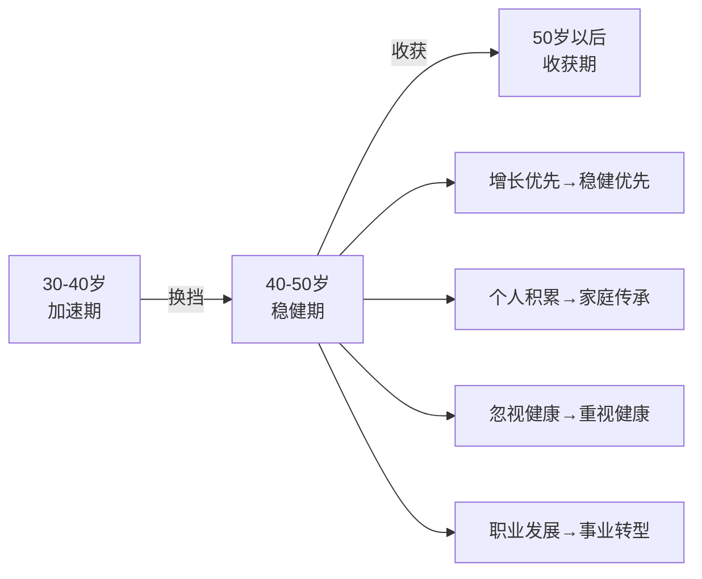
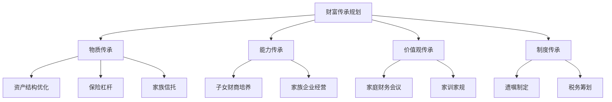

# 第19章 本章小结：40-50岁，稳健是最大的智慧

## 一、本章核心命题

40-50岁是财富管理的"换挡期"——不是踩刹车，而是从高转速的低挡切换到低转速的高挡。这个阶段的核心任务可以用一句话概括：**从"增长优先"转向"稳健优先"，在守住已有财富的基础上实现稳健增长，同时启动财富传承的系统性规划**。

为什么必须换挡？三个数字说明一切：

| 维度 | 30岁 | 45岁 |
|------|------|------|
| 投资亏损50%后的恢复时间 | 30年 | 15年 |
| 家庭财务责任的高峰 | 中等 | 最高 |
| 健康风险的累积程度 | 低 | 明显上升 |

30岁时，时间站在你这边，一次亏损可以慢慢恢复；45岁时，容错空间急剧缩小，一次重大失误可能打乱整个退休计划。这不是悲观，而是客观规律——理解这个规律，才是做出正确决策的起点。

## 二、五大核心概念深度回顾

本章提出的五大核心概念，不是孤立的理财技巧，而是构成了一个完整的思维框架——从资产配置到风险缓冲，从传承规划到健康保障，层层递进，缺一不可。

### 2.1 滑翔路径：不是急刹车，而是优雅着陆

滑翔路径（Glide Path）是生命周期投资理论的核心实践。它的本质是：**随着年龄增长，逐步降低高风险资产的比例，增加防御性资产**。

关键在于"逐步"二字。很多人要么不调整（45岁还满仓股票），要么急刹车（一夜之间全换成存款），两种极端都有问题。正确的做法是每年降低2-3个百分点的权益类资产比例，用5-10年时间完成从"增长型"到"稳健型"的过渡。

以45岁为例，一个合理的滑翔路径是：

| 年龄 | 权益类资产 | 固收类资产 | 现金及等价物 |
|------|-----------|-----------|------------|
| 45岁 | 50% | 35% | 15% |
| 47岁 | 47% | 38% | 15% |
| 49岁 | 44% | 41% | 15% |
| 50岁 | 40% | 45% | 15% |

这不是"不投资"，而是"更聪明地投资"——用确定性换取安全性，用时间换空间。

### 2.2 安全垫：让你在暴风雨中从容不迫

安全垫是40-50岁投资者最重要的"心理防线"和"财务防线"。它由三层构成：

- **第一层（1年内）**：货币基金、银行活期，约30-50万元。随时可取，应对突发支出。
- **第二层（2-3年）**：短期债券基金、银行理财，约60-100万元。流动性稍低，但收益更高。
- **第三层（3-5年）**：中期债券、高分红股票，约100-150万元。为中长期需求提供保障。

安全垫的核心作用不是"赚钱"，而是"防灾"：

1. **市场下跌时**：你不需要被迫卖出亏损的股票，避免"割肉"。
2. **失业或收入下降时**：你有3-5年的时间从容调整，不必恐慌。
3. **遇到投资机会时**：你有"子弹"可以在低点加仓，而不是望洋兴叹。

安全垫未满之前，不进行高风险投资——这是40-50岁投资者的第一条铁律。

### 2.3 桶型配置：把鸡蛋放在不同的"桶"里

桶型配置（Bucket Strategy）是本章推荐的最适合40-50岁人群的资产配置方法。它的核心思想是：**根据资金的使用时间，将资产分成不同的"桶"，每个桶采用不同的投资策略**。

| 桶 | 时间范围 | 资产配置 | 目标 |
|----|---------|---------|------|
| 短期桶 | 0-3年 | 货币基金、短期债券 | 保本、随时可用 |
| 中期桶 | 3-10年 | 债券基金、高分红股票 | 稳健增长、抗通胀 |
| 长期桶 | 10年以上 | 指数基金、成长股 | 追求更高收益 |

桶型配置的精妙之处在于：短期桶确保你不会在市场下跌时被迫卖出长期资产，长期桶确保你不会因为过度保守而错失增长机会。三个桶各司其职，互不干扰。

### 2.4 财富传承：越早规划，越能掌握主动权

40-50岁启动传承规划不是"太早"，而是"刚好"。这个年龄段的优势在于：

- **资产规模已足够大**，传承规划有意义
- **时间充裕**，可以利用保险杠杆、信托架构等工具逐步实施
- **精力充沛**，能够理性地做出决策而非仓促安排

传承不仅是"传钱"，更是"传能力"和"传价值观"。一个完整的传承规划包括四个维度：

### 2.5 健康资产：最大的"隐性资产"

健康是本章反复强调的主题，因为它与财务规划密不可分。一次重大疾病的财务冲击可以用数据量化：

| 项目 | 估算金额 |
|------|---------|
| 重大疾病治疗费用（自费部分） | 30-80万元 |
| 治疗期间收入损失（1-3年） | 30-150万元 |
| 康复和护理费用 | 10-30万元 |
| **合计财务冲击** | **70-260万元** |

这意味着，一次重大疾病可能直接消耗掉你10-20年的积蓄。因此，健康管理不是"生活态度"，而是"财务策略"。40-50岁是慢性病预防的最后关键窗口期——过了这个窗口，很多健康问题将不可逆。

## 三、核心技巧体系回顾

本章围绕四大领域各提出了五个核心技巧，形成了一个完整的实操工具箱。

### 3.1 资产配置调整的五个核心技巧

| 技巧 | 核心逻辑 | 关键要点 |
|------|---------|---------|
| 动态资产配置法 | 根据估值和经济周期灵活调整 | PE<12时加仓股票，PE>18时减仓；不追求"完美时机"，追求"大致正确" |
| 安全垫构建法 | 先保命再赚钱 | 三层结构（1年/3年/5年），安全垫未满不进行高风险投资 |
| 高分红策略 | 从"赚差价"转向"收租" | 40岁20%→45岁30%→50岁40%，逐步增加分红资产比例 |
| 再平衡阈值法 | 纪律性地维持配置比例 | 偏离目标超过5%时触发再平衡，每季度检查一次 |
| 对冲策略入门 | 用防御性资产对冲系统性风险 | 黄金5-10%（负相关）、国债（避险）、全球分散（降低相关性） |

### 3.2 财富传承规划的五个核心技巧

| 技巧 | 核心逻辑 | 关键要点 |
|------|---------|---------|
| 遗嘱制定三步法 | 确保财产按意愿分配 | 清点资产→明确分配→公证备案；避免口头遗嘱的法律风险 |
| 保险传承杠杆法 | 用小额保费撬动大额传承 | 终身寿险指定受益人，保险金不纳入遗产，免债务追索 |
| 家族信托入门 | 专业化的跨代传承工具 | 设定受益条件（年龄/学业），隔离债务风险，适合资产500万以上家庭 |
| 子女财商培养五步法 | 传能力比传钱更重要 | 认知→实践→参与→独立→传承，每个阶段有对应的家庭活动 |
| 家庭财务会议四步法 | 让全家参与财务管理 | 每季度一次，议程包括：回顾→现状→讨论→分工，透明是最好的传承 |

### 3.3 职业转型的五个核心技巧

| 技巧 | 核心逻辑 | 关键要点 |
|------|---------|---------|
| 第二曲线试水法 | 不辞职也能探索新方向 | 业余时间验证→小规模试错→确认可行后再全职投入 |
| 经验资本化产品化方法 | 把20年经验变成可售卖的产品 | 咨询、培训、课程、出版——四种变现路径 |
| 人脉变现价值交换法 | 从"认识人"到"用好人脉" | 不是求人办事，而是创造双赢的价值交换 |
| 半退休模式3-2-2法 | 渐进式过渡而非突然退出 | 3天核心工作+2天弹性工作+2天休息，逐步降低工作强度 |
| 跨界学习T型深化法 | 在专业深度基础上拓展宽度 | 纵向深耕本专业，横向学习相邻领域，形成独特的复合能力 |

### 3.4 健康管理的五个核心技巧

| 技巧 | 核心逻辑 | 关键要点 |
|------|---------|---------|
| 体检重点筛查法 | 40岁后体检不能"走过场" | 心脑血管、肿瘤标志物、消化系统是重点；有家族史的项目要加频 |
| 运动333法则 | 最低有效运动量 | 每周3次、每次30分钟、心率达最大心率的60-80% |
| 饮食地中海饮食法 | 得舒饮食+地中海饮食的结合 | 多蔬果、多鱼类、少红肉、适量橄榄油和坚果 |
| 睡眠7小时法则 | 睡眠是身体的"维修时间" | 40岁后睡眠质量下降，需要更严格的作息纪律 |
| 压力管理四个出口 | 压力不释放就会"内爆" | 运动、社交、兴趣、冥想——四个压力释放通道 |

## 四、十大常见误区与纠正

本章总结了40-50岁最容易掉入的十个陷阱。每一个误区都有一个"看起来合理"的表面逻辑，但背后的真相往往相反。

| 序号 | 误区 | 表面逻辑 | 背后真相 | 正确做法 |
|------|------|---------|---------|---------|
| 1 | 觉得自己还年轻，不需要调整策略 | "我才45岁，还能承受高风险" | 恢复时间从30年缩短到15年，容错空间急剧缩小 | 每5年重新评估风险承受能力 |
| 2 | 过度保守，错失增长机会 | "安全第一，全部存银行" | 通胀每年侵蚀2-3%的购买力，过度保守等于确定亏损 | 保持30-50%的股票配置 |
| 3 | 忽视财富传承规划 | "我还年轻，等老了再说" | 突发意外时没有规划的家庭面临资产冻结和遗产纠纷 | 现在就开始制定遗嘱 |
| 4 | 投资过于集中 | "我对这个行业最了解" | 集中投资可能带来毁灭性亏损，40岁后承受不起 | 跨资产、跨地域、跨行业分散 |
| 5 | 忽视健康管理 | "工作太忙，没时间运动" | 一次重大疾病可能耗尽多年积蓄 | 年度体检+规律运动+健康饮食 |
| 6 | 不与配偶沟通财务问题 | "我来管钱就行" | 一方突然失能时另一方无法接管；财务分歧是离婚首因 | 每季度开家庭财务会议 |
| 7 | 被"中年危机"情绪左右 | "我这辈子就这样了" | 冲动辞职或高风险投资往往雪上加霜 | 保持理性，客观评估后再行动 |
| 8 | 过度资助子女 | "孩子需要我帮忙" | 消耗自己的退休资金，也剥夺子女独立成长的机会 | 设定资助上限和条件 |
| 9 | 不做税务筹划 | "税务是财务的事" | 40-50岁收入最高，税务筹划空间最大，每年可省数万 | 充分利用专项附加扣除和薪酬结构优化 |
| 10 | 忽视"隐性负债" | "我没有贷款压力" | 子女教育、父母养老、自己的退休都是隐性负债 | 列出所有未来大额支出并制定储蓄计划 |

**自检方法**：对照以上十个误区，如果有3个以上"中招"，说明你需要立即调整策略。

## 五、六个实战案例的共同规律

本章的六个案例覆盖了40-50岁最常见的财务场景：企业高管的滑翔路径转型、传统行业老板的财富传承、中年转行的自由职业者、双职工家庭的半退休规划、投资失误后的重建、健康危机后的财务重构。

这六个看似不同的故事，提炼出了五条共同规律：

**规律一：先守后攻，安全垫优先**。每一个成功案例的主人公，都首先确保了3-5年的安全垫，然后才进行后续的资产调整或职业转型。没有安全垫的"转型"是赌博。

**规律二：分散是唯一的"免费午餐"**。六个案例中有四个的初始问题都与"过度集中"有关——集中持有公司股票、集中投资房产、集中押注单一行业。分散之后，风险大幅降低，收益反而更稳定。

**规律三：传承规划越早越好**。案例二中的传统行业老板，因为提前5年启动了家族信托和保险传承规划，成功规避了企业经营风险对家庭资产的波及。如果等到问题出现再规划，代价会大得多。

**规律四：职业转型是"渐进式"的**。成功的转型都不是"裸辞创业"，而是"在职试水→验证模式→逐步过渡"。半退休模式（3-2-2法）是最优雅的过渡方式。

**规律五：健康管理是财务规划的一部分**。案例六中的主人公因为忽视健康管理，一场大病消耗了80万积蓄和两年收入。如果提前做好体检和保险保障，这个数字可以减少80%以上。

## 六、行动清单：从读完到做完

知识不落地等于零。以下是按优先级排列的行动清单，覆盖本周、本月和本季度三个时间维度。

### 本周内完成（紧急且重要）

- [ ] **重新评估风险承受能力**：完成练习一的8题评分表，确定自己当前的风险等级（保守型/稳健型/平衡型/进取型），并对照建议配置比例检查现有组合是否需要调整
- [ ] **检查应急基金是否充足**：计算家庭每月必要支出总额，确认应急基金是否覆盖3-5年。如果不足，制定每月补充计划
- [ ] **安排一次全面体检**：重点筛查心脑血管、肿瘤标志物、消化系统。如果超过1年未体检，这是最高优先级

### 本月内完成（重要但可规划）

- [ ] **对投资组合做一次压力测试**：模拟三个极端场景——股市下跌40%、失业12个月、重大疾病。如果任何一个场景下财务会"崩溃"，立即增加保险保障和安全垫
- [ ] **开始制定遗嘱**：清点家庭资产、明确分配意愿、咨询律师。即使只是草稿，也比没有强
- [ ] **与配偶开一次家庭财务会议**：使用练习七的议程模板，确保双方都了解家庭的真实财务状况，共同制定下一阶段的财务目标

### 本季度完成（重要且需持续跟进）

- [ ] **调整资产配置**：根据风险评估结果，制定滑翔路径计划，逐步降低高风险资产比例。目标：每年降低2-3个百分点的权益类资产
- [ ] **完善保险保障体系**：检查重疾险保额是否达到年收入3-5倍、寿险保额是否覆盖家庭负债和5-10年生活费用、是否需要补充长期护理保险
- [ ] **评估职业转型的可能性**：完成练习六的可行性评估。如果总分低于15分，开始探索"第二曲线"方向，用业余时间进行小规模试水
- [ ] **建立家庭应急档案**：包括保险信息汇总、重要文件存放位置、紧急联系人清单。确保配偶知道这些信息在哪里

## 七、本章知识图谱

```mermaid
graph TD
    A[第19章：40-50岁稳健期] --> B[理论基础]
    A --> C[核心技巧]
    A --> D[实战案例]
    A --> E[常见误区]
    A --> F[练习方法]
    A --> G[深度拓展]

    B --> B1[生命周期财务理论]
    B --> B2[风险承受能力变化]
    B --> B3[资产配置生命周期理论]
    B --> B4[财富传承基础理论]
    B --> B5[职业转型理论]
    B --> B6[健康管理与财务规划]
    B --> B7[行为金融学应用]
    B --> B8[税务筹划进阶理论]

    C --> C1[资产配置5技巧]
    C --> C2[财富传承5技巧]
    C --> C3[职业转型5技巧]
    C --> C4[健康管理5技巧]

    D --> D1[高管滑翔路径]
    D --> D2[财富传承]
    D --> D3[中年转行]
    D --> D4[半退休规划]
    D --> D5[投资重建]
    D --> D6[健康危机重构]

    E --> E1[十大误区+自检清单]

    F --> F1[风险评估]
    F --> F2[安全垫构建]
    F --> F3[压力测试]
    F --> F4[传承规划]
    F --> F5[健康管理]
    F --> F6[职业转型评估]
    F --> F7[家庭财务会议]

    G --> G1[保值增值策略]
    G --> G2[中年风险管理]
    G --> G3[退休规划精算]
    G --> G4[遗产规划]
    G --> G5[健康投资回报]
    G --> G6[中年创业]
    G --> G7[人生规划整合]
```

## 八、关键数据速查

以下汇总本章涉及的核心数据指标，方便快速查阅：

| 指标 | 建议值 | 说明 |
|------|--------|------|
| 权益类资产比例（45岁） | 40-50% | 随年龄逐步降低 |
| 安全垫规模 | 3-5年生活支出 | 三层结构：1年+2-3年+3-5年 |
| 高分红资产比例（45岁） | 30% | 40岁20%→50岁40%逐步增加 |
| 再平衡触发阈值 | 偏离目标5% | 每季度检查一次 |
| 黄金配置比例 | 5-10% | 对冲工具，非主要收益来源 |
| 重疾险保额 | 年收入3-5倍 | 弥补治疗期间收入损失 |
| 寿险保额 | 负债+教育+5-10年生活费 | 减去已有资产 |
| 运动频率 | 每周3次×30分钟 | 333法则 |
| 家庭财务会议 | 每季度1次 | 夫妻双方必须参加 |
| 风险评估复评 | 每2年1次 | 情况变化时随时复评 |
| 储蓄率 | >30% | 安全垫未满前建议更高 |

## 九、最后的话

40-50岁，你最大的优势不是"年轻"，而是"成熟"。你拥有20年的行业经验、积累了人脉和判断力、对风险有了切身的感受——这些是年轻人用钱都买不到的资产。关键是用好这些优势，而不是盲目追求年轻人的冒险策略。

这个阶段，"不做什么"往往比"做什么"更重要：

- **不要冒过大的风险**——你的恢复时间在缩短
- **不要忽视健康管理**——健康是你最大的隐性资产
- **不要推迟传承规划**——越早越从容
- **不要独自承担所有压力**——与配偶共同面对，与专业人士合作

**记住：40-50岁，稳健是最大的智慧。守住财富，比赚到财富更难，也更重要。**

***

> **下一步**：进入第20章，学习50岁以上阶段的财富收获策略——如何将前半生的积累转化为稳定的现金流和有质量的晚年生活。
