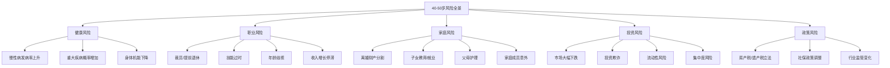
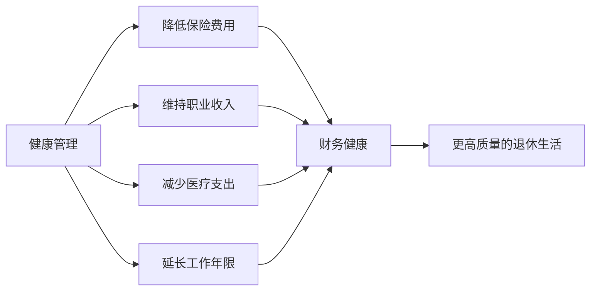

# 深度拓展：40-50岁的财富保值与系统性人生规划

40-50岁是人生的"财富巅峰期"，也是风险最集中的十年。本章从财富保值增值、风险管理、退休精算、遗产规划、健康投资、中年创业、人生整合七个维度展开深度分析，为读者提供从理论到实操的完整框架。

---

## 一、财富保值增值策略

### 1.1 40-50岁的财务特征与心态转变

40-50岁是收入的巅峰期，也是风险的高发期。大多数人在这一阶段的收入达到职业生涯最高点，家庭净资产也处于峰值。然而，距离退休只有10-20年，容错空间急剧缩小。

**心态转变的核心逻辑：** 从追求资产的快速增值，转向注重资产的保值和稳健增长。这不是"保守"，而是"理性"。

一个直观的对比：

| 指标 | 30岁投资者 | 45岁投资者 |
|------|-----------|-----------|
| 亏损50%后回本所需收益 | 100% | 100% |
| 距退休时间 | 30年 | 15年 |
| 可承受的最大回撤 | 40%-50% | 20%-30% |
| 恢复亏损的时间压力 | 低 | 高 |
| 家庭财务责任 | 较轻 | 最重 |

45岁时投资亏损50%，同样需要100%的收益才能回本，但恢复窗口只有15年。更关键的是，45岁的人往往承担着房贷、子女教育、父母赡养三重压力，一次重大亏损可能动摇整个家庭的财务根基。

### 1.2 资产配置的生命周期调整

#### "100法则"及其变体

最基础的资产配置法则：**股票类资产比例 = 100 - 年龄**

| 年龄 | 100法则 | 110法则（进取型） | 120法则（激进型） |
|------|---------|------------------|------------------|
| 40岁 | 60% | 70% | 80% |
| 45岁 | 55% | 65% | 75% |
| 50岁 | 50% | 60% | 70% |

**重要提醒：** 这些法则只是起点。实际配置需根据收入稳定性、家庭负担、健康状况、风险偏好调整。一个收入稳定的公务员和一个收入波动的企业主，即使同龄，配置也应该截然不同。

#### 权益类资产的精细化配置

不是所有股票都是"高风险"。40-50岁应该将股票投资的重心从"资本增值型"转向"股息收入型"：

**股息收入策略的选股标准：**

| 筛选维度 | 具体标准 | 说明 |
|---------|---------|------|
| 股息连续性 | 连续10年以上稳定分红 | 证明公司有稳定的现金流和分红意愿 |
| 股息率 | 3%-5%以上 | 低于3%不足以提供有意义的现金流 |
| 分红增长 | 每年分红金额稳定增长 | 跑赢通胀，实际购买力不缩水 |
| 自由现金流 | 自由现金流覆盖分红2倍以上 | 确保分红可持续，不是借债分红 |
| 资产负债率 | 低于行业平均水平 | 低负债才有能力持续分红 |
| 行业属性 | 消费、公用事业、银行、保险 | 抗周期能力强，现金流稳定 |

**A股高股息组合示例（选股逻辑参考）：**
- 银行股：四大行+优质股份行，股息率4%-6%
- 公用事业：电力、水务、燃气，现金流稳定
- 消费龙头：白酒、乳制品、调味品，品牌溢价高
- 基础设施：高速公路、港口，收费模式确定性强

#### 固收类资产的配置层次

不是买一个"债券基金"就够了。40-50岁的固收配置应该分层：

| 层次 | 资产类型 | 预期收益 | 流动性 | 适合金额 |
|------|---------|---------|--------|---------|
| 第一层：现金管理 | 货币基金、银行活期理财 | 1.5%-2.5% | T+0/T+1 | 3-6个月支出 |
| 第二层：短期稳健 | 短债基金、同业存单基金 | 2%-3.5% | T+1 | 6-12个月支出 |
| 第三层：中期收益 | 中长期纯债基金、国债 | 3%-4.5% | 持有3个月以上 | 1-3年目标资金 |
| 第四层：增强收益 | 可转债基金、REITs、优先股 | 4%-7% | 持有1年以上 | 长期配置资金 |

#### 全球资产配置的实操路径

不要将所有资产集中在单一市场。中国经济增速放缓、人民币汇率波动、A股结构性分化，都要求投资者具备全球视野。

**普通人可操作的全球配置方式：**

| 渠道 | 最低门槛 | 覆盖市场 | 费率 | 适合人群 |
|------|---------|---------|------|---------|
| QDII基金 | 10元起 | 美股、港股、欧洲、日本、新兴市场 | 管理费1%-1.5% | 所有投资者 |
| 港股通 | 50万元 | 港股 | 佣金+印花税 | 资产50万以上 |
| 美股券商 | 无门槛 | 全球 | 佣金极低 | 有海外账户的投资者 |
| 黄金ETF | 1元起 | 黄金 | 管理费0.5% | 对冲配置 |
| 全球债券基金 | 100元起 | 全球债券 | 管理费0.3%-0.8% | 稳健配置 |

### 1.3 投资组合再平衡的操作指南

再平衡是40-50岁投资者最被忽视但最重要的纪律。不做再平衡，你的组合会不知不觉地偏向高风险资产（涨得多的占比变大），在市场崩盘时承受远超预期的损失。

#### 阈值再平衡法（推荐）

**核心规则：** 当任何一类资产的偏离度超过目标比例±5%时，触发再平衡。

```text
示例：
目标配置：股票50% + 债券35% + 黄金10% + 现金5%
当前实际：股票58% + 债券28% + 黄金9% + 现金5%

触发条件：股票偏离+8%（超过5%阈值），债券偏离-7%（超过5%阈值）

操作：卖出部分股票，买入债券，恢复目标比例
```

#### 再平衡的频率与成本控制

| 方式 | 频率 | 优点 | 缺点 | 适合场景 |
|------|------|------|------|---------|
| 日历再平衡 | 每季度/半年一次 | 简单易执行 | 可能错过最佳时机 | 不愿频繁操作的投资者 |
| 阈值再平衡 | 偏离超阈值时 | 更精准 | 需要持续监控 | 有一定时间管理组合的投资者 |
| 现金流再平衡 | 有新资金投入时 | 零交易成本 | 效果有限 | 定投型投资者 |

**实操建议：** 采用"阈值+现金流"组合法。日常用新资金（工资结余、股息分红）向低配资产倾斜；当偏离超过阈值时，做大额调仓。每半年做一次全面审视。

#### 再平衡的税务优化

在中国，基金赎回和股票卖出都可能产生税务影响：
- 股票：卖出时缴纳0.1%印花税
- 基金：赎回时如持有不足7天，收取1.5%惩罚性赎回费
- 基金：持有超过1年免赎回费（多数基金）

**优化策略：**
1. 优先用新资金再平衡，减少卖出操作
2. 赎回基金时确保持有超过1年
3. 利用"先进先出"规则，先赎回成本最高的份额
4. 年底前检查是否有亏损持仓可以"税损收割"

### 1.4 防御性资产的深度解析

#### 黄金配置

黄金不是为了赚钱，而是为了在危机时保命。过去20年，黄金在每次重大危机中都表现出了优秀的对冲能力：

| 危机事件 | 黄金涨幅 | A股表现 |
|---------|---------|--------|
| 2008年全球金融危机 | +25% | -65% |
| 2011年欧债危机 | +10% | -22% |
| 2020年新冠疫情 | +25% | -12%（短期） |
| 2022年俄乌冲突 | +8% | -15% |

**配置建议：** 黄金占投资组合的5%-15%。低于5%对冲效果有限，高于15%会拖累整体收益。

**黄金投资方式对比：**

| 方式 | 门槛 | 流动性 | 持有成本 | 适合金额 |
|------|------|--------|---------|---------|
| 黄金ETF（如518880） | 100元 | T+1 | 管理费0.5%/年 | 1万-50万 |
| 银行纸黄金 | 1克起 | T+0 | 点差0.5-1元/克 | 1万以下 |
| 实物金条 | 10克起 | 较差 | 加工费+保管成本 | 长期持有 |
| 黄金积存 | 1元起 | T+1 | 手续费0.5% | 定投型 |

#### REITs（不动产投资信托基金）

REITs是40-50岁投资者的理想防御性资产——提供稳定的现金流分红（年化4%-8%），同时与股票和债券的相关性较低。

**中国公募REITs现状（截至2024年）：**
- 已上市30余只，覆盖产业园区、高速公路、仓储物流、保障性住房等
- 分红率通常在4%-8%之间
- 与A股相关性较低，具有分散风险的价值

**注意事项：**
- REITs的价格也会波动，不是"保本"产品
- 流动性不如股票和ETF，交易量较小
- 底层资产的经营状况直接影响分红和价格

---

## 二、中年风险管理的系统化框架

### 2.1 40-50岁的风险全景图

40-50岁面临的风险类型比任何年龄段都更复杂。不是单一风险，而是多重风险的叠加：



### 2.2 四层风险防御体系

#### 第一层：预防措施——从源头降低风险发生概率

| 风险类型 | 预防措施 | 投入成本 | 预期效果 |
|---------|---------|---------|---------|
| 健康风险 | 每年全面体检+专项筛查 | 3000-8000元/年 | 早期发现率提升60%以上 |
| 职业风险 | 每年投入200+小时学习新技能 | 时间+培训费 | 保持市场竞争力 |
| 投资风险 | 学习投资知识，设定纪律规则 | 时间 | 避免情绪化决策 |
| 家庭风险 | 定期家庭沟通，维护关系 | 时间+精力 | 降低离婚和家庭矛盾概率 |

**40-50岁体检重点项目（区别于常规体检）：**

| 检查项目 | 频率 | 目的 | 参考费用 |
|---------|------|------|---------|
| 低剂量螺旋CT（肺部） | 每年 | 肺癌早期筛查 | 300-500元 |
| 胃肠镜 | 每3-5年 | 消化道肿瘤筛查 | 500-2000元 |
| 颈动脉超声 | 每年 | 心脑血管风险评估 | 200-300元 |
| 肿瘤标志物全套 | 每年 | 多种癌症初筛 | 500-1000元 |
| 骨密度检测 | 每2年 | 骨质疏松筛查 | 100-200元 |
| 眼底检查 | 每年 | 糖尿病/高血压并发症 | 100-200元 |
| 甲状腺超声+功能 | 每年 | 甲状腺疾病筛查 | 200-400元 |
| 心脏超声 | 每2年 | 心脏结构和功能评估 | 300-500元 |

#### 第二层：保险保障——用小钱转移大风险

40-50岁是保险保障的"最后窗口期"——过了50岁，很多保险要么买不了，要么贵得离谱。

**40-50岁保险配置方案：**

| 险种 | 建议保额 | 年缴保费参考 | 核心作用 |
|------|---------|-------------|---------|
| 重疾险 | 年收入×3-5倍 | 8000-20000元 | 弥补治疗期间收入损失 |
| 百万医疗险 | 200-400万 | 1000-3000元 | 覆盖大额医疗费用 |
| 定期寿险 | 家庭负债+5-10年生活费 | 3000-8000元 | 身故后家庭财务安全 |
| 意外险 | 100-200万 | 300-1000元 | 意外伤残/身故保障 |
| 长期护理险 | 根据需求 | 2000-8000元 | 失能后护理费用 |

**保额计算的精确方法：**

重疾险保额 = 治疗费用（30-50万）+ 康复费用（10-20万）+ 收入损失（年收入×3-5年）

定期寿险保额 = 房贷余额 + 子女教育费用（大学+留学约100-200万）+ 父母赡养费用 + 配偶10年生活费 - 已有储蓄和投资

**40-50岁购买保险的注意事项：**
1. **如实告知健康状况**——带病投保、隐瞒病史，理赔时100%被拒
2. **先保障后理财**——先把保障型保险配齐，有余力再考虑年金险
3. **优先给家庭经济支柱投保**——谁赚钱多先保谁，不是先保孩子
4. **注意等待期**——重疾险通常有90-180天等待期，越早买越好
5. **定期审视保单**——每2-3年检查一次保额是否足够，保障是否过时

#### 第三层：财务缓冲——确保任何情况下都能撑过去

**应急基金的层次设计：**

| 层次 | 金额 | 存放位置 | 可动用时间 | 用途 |
|------|------|---------|-----------|------|
| 即时可用 | 3个月支出 | 银行活期/货币基金 | 即时 | 突发支出 |
| 短期缓冲 | 3-6个月支出 | 短债基金/银行理财 | T+1至3天 | 失业/收入中断 |
| 中期储备 | 6-12个月支出 | 中期债券基金 | 3-7天 | 重大变故 |

**40-50岁应急基金的特殊考虑：**
- 金额应覆盖所有固定支出（房贷、保险、子女教育、父母赡养）
- 如果收入来源单一（如只有工资），应急基金应提高到12个月
- 如果有慢性病或家族病史，应额外预留医疗应急金

#### 第四层：应急预案——最坏情况下的行动方案

每个40-50岁的家庭都应该有一份书面的《家庭应急预案》，内容包括：

**《家庭应急预案》模板：**

```text
一、紧急联系人
  - 配偶/家人：姓名、电话、工作单位
  - 信任的朋友/亲属：姓名、电话、关系
  - 家庭律师：姓名、电话、律所
  - 财务顾问：姓名、电话、机构

二、重要文件清单及存放位置
  - 房产证：存放位置____
  - 保险合同：存放位置____
  - 银行卡/存折：存放位置____
  - 投资账户信息：存放位置____
  - 遗嘱原件：存放位置____
  - 身份证/户口本：存放位置____

三、保险信息汇总
  - 重疾险：公司____ 保单号____ 保额____
  - 医疗险：公司____ 保单号____ 保额____
  - 寿险：公司____ 保单号____ 保额____
  - 意外险：公司____ 保单号____ 保额____

四、资产清单
  - 银行存款：银行____ 金额____
  - 投资账户：券商____ 金额____
  - 房产：地址____ 价值____ 贷款余额____
  - 其他资产：____

五、负债清单
  - 房贷：银行____ 余额____ 月供____
  - 车贷：银行____ 余额____ 月供____
  - 其他负债：____

六、应急操作流程
  1. 联系家人和紧急联系人
  2. 拨打保险公司报案电话
  3. 联系家庭律师
  4. 保留所有医疗/事故相关票据
```

---

## 三、退休规划的精算方法论

### 3.1 退休规划的底层逻辑

退休规划的本质是回答一个问题：**在不工作的情况下，你的钱能支撑你多久？**

这个问题的变量只有三个：
1. **你每年需要多少钱？**（支出）
2. **你的钱能产生多少收益？**（投资回报）
3. **你需要撑多少年？**（预期寿命）

### 3.2 退休金需求的精算模型

#### 第一步：估算退休后年支出

退休后的支出不是简单地"打七折"。需要逐项分析：

| 支出类别 | 退休前（月均） | 退休后（月均） | 变化原因 |
|---------|--------------|--------------|---------|
| 房贷/房租 | 8000 | 0（假设还清） | 60岁前应还清房贷 |
| 子女教育 | 5000 | 0（假设独立） | 子女已工作 |
| 交通通勤 | 2000 | 500 | 不再上班 |
| 餐饮 | 3000 | 3000 | 基本不变 |
| 医疗保健 | 1000 | 3000 | 年龄增长，医疗支出增加 |
| 旅游休闲 | 2000 | 4000 | 退休后时间充裕 |
| 日用品/物业 | 2000 | 2000 | 基本不变 |
| 保险 | 2000 | 1500 | 部分保险到期 |
| 人情往来 | 1500 | 1000 | 减少 |
| 其他 | 2000 | 2000 | 基本不变 |
| **合计** | **28500** | **17000** | **约60%** |

**注意：** 这只是"基本生活"。如果退休后想保持较高生活品质（旅游、兴趣爱好、社交），月支出可能在2-3万元。

#### 第二步：估算退休后收入来源

| 收入来源 | 估算方法 | 月均参考金额 |
|---------|---------|------------|
| 基本养老金 | 缴费年限×缴费基数×替代率公式 | 3000-8000元 |
| 企业年金 | 企业缴费+个人缴费+投资收益 | 1000-3000元 |
| 商业养老保险 | 根据保单约定 | 2000-5000元 |
| 投资收益 | 投资组合×年化收益率÷12 | 根据资产规模 |
| 租金收入 | 房产月租金 | 2000-8000元 |

**社保养老金的估算方法：**

中国城镇职工基本养老金由两部分组成：

```text
基础养老金 = (当地上年度在岗职工月平均工资 + 本人指数化月平均缴费工资) ÷ 2 × 缴费年限 × 1%

个人账户养老金 = 个人账户储存额 ÷ 计发月数

计发月数：60岁退休=139个月，55岁退休=170个月，50岁退休=195个月
```

**简化估算：** 如果缴费30年、缴费基数为社平工资的100%，退休后基本养老金大约相当于退休前工资的40%-50%。

#### 第三步：计算退休金缺口

```text
退休金缺口 = 退休后年支出 - 退休后年收入

示例：
退休后月支出：20000元（年24万）
退休后月收入：养老金5000 + 企业年金2000 + 租金3000 = 10000元（年12万）
年缺口：24万 - 12万 = 12万元
```

#### 第四步：计算需要积累的退休金总额

这是最关键的一步。不能简单地用"缺口×退休年数"，必须考虑通货膨胀和投资收益。

**精算公式（考虑通胀和投资收益）：**

```text
所需退休金 = 年缺口 × [(1+r)^n - 1] / [r × (1+r)^n]

其中：
r = 实际收益率 = 投资收益率 - 通货膨胀率
n = 退休年数（预期寿命 - 退休年龄）
```

**不同场景下的计算结果（年缺口12万元）：**

| 退休年数 | 实际收益率2% | 实际收益率3% | 实际收益率4% |
|---------|------------|------------|------------|
| 20年 | 197万 | 179万 | 163万 |
| 25年 | 235万 | 210万 | 188万 |
| 30年 | 270万 | 237万 | 209万 |
| 35年 | 301万 | 261万 | 227万 |

**解读：** 如果60岁退休、预期寿命90岁（退休30年）、实际收益率3%，需要积累约237万元退休金。如果投资能力更强（实际收益率4%），只需要209万。

### 3.3 退休规划的三大精算风险

#### 风险一：通货膨胀侵蚀

假设年通胀率3%，20年后购买力下降约45%。现在每月花1万元能过的生活，20年后需要约1.8万元。

**应对策略：**
1. 退休金积累目标按通胀调整后的金额计算
2. 退休后的投资组合中保持一定比例的权益类资产（30%-40%），跑赢通胀
3. 考虑通胀保护型资产：REITs、黄金、通胀保护债券

#### 风险二：长寿风险——"人活着，钱没了"

这是退休规划中最被低估的风险。中国人的预期寿命持续增长：

| 年份 | 平均预期寿命 | 一线城市预期寿命 |
|------|------------|----------------|
| 2000年 | 71.4岁 | 76-78岁 |
| 2010年 | 74.8岁 | 78-80岁 |
| 2020年 | 77.3岁 | 80-83岁 |
| 2030年（预测） | 79-80岁 | 83-85岁 |

如果你现在45岁，还有35-40年的预期寿命。退休后可能活25-35年。**规划时应按95岁甚至100岁来计算。**

**应对策略：**
1. 按最长可能寿命（100岁）规划
2. 购买终身年金保险，提供"活多久领多久"的现金流
3. 退休后投资组合中保持30%-40%的权益资产，确保长期增值
4. 建立"永不耗尽"的提前提取规则：每年只提取投资组合的3%-4%

#### 风险三：医疗费用膨胀

人一生中约80%的医疗费用发生在60岁以后。医疗费用的增速通常高于一般通胀。

| 费用类型 | 当前参考金额（年） | 20年后预估（年通胀5%） |
|---------|----------------|---------------------|
| 日常门诊+药品 | 5000-10000元 | 13000-26000元 |
| 住院费用（中等） | 2-5万/次 | 5-13万/次 |
| 长期护理（养老院） | 6-24万/年 | 16-63万/年 |
| 重大疾病治疗 | 30-100万 | 80-265万 |

**应对策略：**
1. 单独建立"医疗专项基金"，金额不低于50万元
2. 配置充足的医疗保险（百万医疗险+重疾险）
3. 保持健康生活方式，从源头降低医疗支出
4. 了解并利用国家医保政策、大病保险、惠民保

### 3.4 退休规划的分阶段行动清单

| 年龄段 | 核心任务 | 具体行动 |
|--------|---------|---------|
| 40-45岁 | 确定目标，建立框架 | 确定退休年龄和生活方式→计算退休金缺口→制定积累计划→检查社保缴费情况 |
| 45-50岁 | 加速积累，优化策略 | 每年更新退休规划→评估积累进度→考虑商业养老保险→研究退休居住安排 |
| 50-55岁 | 精细化调整 | 优化社保领取策略→制定退休后投资策略→安排退休后日常生活→考虑半退休模式 |
| 55-60岁 | 最终确认 | 确认退休日期→完成所有财务安排→建立退休后日常节奏→准备心理过渡 |

### 3.5 "4%法则"的中国化修正

美国的"4%法则"（每年从投资组合中提取4%，可以支撑30年退休生活）在中国需要修正：

**修正因素：**
- 中国通胀率较高（2%-4%），美国历史通胀约2%
- 中国投资市场波动性较大
- 中国医疗费用增速较快
- 中国没有完善的通胀保护型金融产品

**中国化建议：** 将提取率从4%下调到3%-3.5%。即：
```text
退休所需投资资产 = 年缺口 / 3.5%

示例：年缺口12万
退休所需投资资产 = 12万 / 3.5% = 343万元
```

---

## 四、遗产规划的系统化实施

### 4.1 遗产规划的必要性

遗产规划不是"有钱人的专利"。任何有资产、有家庭的人都需要遗产规划。没有遗产规划，你的财产将按照法定继承顺序分配——这往往不是你真正想要的结果。

**没有遗产规划的代价：**

| 场景 | 后果 | 严重程度 |
|------|------|---------|
| 未立遗嘱 | 财产按法定继承分配，可能违背本人意愿 | 高 |
| 遗嘱形式不合法 | 遗嘱被法院认定无效 | 极高 |
| 未指定保险受益人 | 保险金纳入遗产，可能被用于偿还债务 | 高 |
| 未做资产隔离 | 企业债务可能波及家庭资产 | 极高 |
| 未考虑税务因素 | 继承人可能面临意外的税务负担 | 中 |

### 4.2 中国遗产规划的法律框架

#### 遗嘱的六种法定形式

《民法典》规定了六种遗嘱形式，每种有不同的生效要件：

| 遗嘱形式 | 核心要求 | 优点 | 缺点 | 推荐指数 |
|---------|---------|------|------|---------|
| 自书遗嘱 | 亲笔书写全文+签名+注明年月日 | 最简便，无需他人配合 | 笔迹鉴定争议 | ★★★★ |
| 代书遗嘱 | 2个以上见证人+代书人+遗嘱人签名+日期 | 适合书写困难者 | 见证人资格争议 | ★★★ |
| 打印遗嘱 | 2个以上见证人+每页签名+日期 | 清晰易读 | 《民法典》新增，判例少 | ★★★ |
| 录音录像遗嘱 | 2个以上见证人+记录姓名/日期 | 记录遗嘱人真实意愿 | 技术保存问题 | ★★★ |
| 口头遗嘱 | 仅限危急情况+2个以上见证人 | 紧急情况可用 | 危急解除后失效 | ★ |
| 公证遗嘱 | 经公证机关公证 | 法律效力最强 | 费用较高，修改不便 | ★★★★★ |

**关键提示：** 《民法典》取消了"公证遗嘱效力优先"的规定。现在以最后一份遗嘱为准。但公证遗嘱的证明力仍然最强，建议优先采用。

#### 遗嘱无效的常见原因

| 无效原因 | 说明 | 如何避免 |
|---------|------|---------|
| 见证人不合格 | 继承人、与继承人有利害关系的人不能做见证人 | 选择无利害关系的见证人 |
| 意思表示不真实 | 受胁迫、欺骗所立遗嘱无效 | 确保自由意志，必要时录音录像 |
| 处分了他人财产 | 只能处分自己的财产 | 明确区分个人财产和夫妻共同财产 |
| 未保留必要份额 | 未给缺乏劳动能力又没有生活来源的继承人保留必要份额 | 确保法定最低份额 |
| 形式要件缺失 | 缺少签名、日期等 | 严格按照法定形式制作 |

### 4.3 保险传承的杠杆效应

人寿保险是遗产规划中最被低估的工具。它的核心优势：

1. **指定受益人**——保险金直接支付给受益人，不纳入遗产
2. **杠杆效应**——用较少的保费撬动较大的保额
3. **税务优势**——目前保险金免征个人所得税
4. **债务隔离**——指定了受益人的保险金不用于偿还被保险人的债务
5. **隐私保护**——保险金分配无需经过继承程序，不公开

**保险传承的操作要点：**

| 要点 | 说明 |
|------|------|
| 必须指定受益人 | 不指定或写"法定"，保险金将纳入遗产 |
| 受益人可以是多人 | 可以指定顺序和比例，如"配偶60%，子女40%" |
| 受益人可以变更 | 投保人可以随时变更受益人 |
| 注意保费来源 | 保费应来自合法收入，避免被认定为恶意避债 |
| 保额适度 | 保额过大可能被质疑为赌博性投保 |

### 4.4 家族信托入门

家族信托是高净值家庭（通常1000万以上可投资资产）的进阶传承工具。

**家族信托的核心功能：**

| 功能 | 说明 | 适合场景 |
|------|------|---------|
| 资产隔离 | 信托资产独立于委托人、受托人、受益人的固有财产 | 企业主防经营风险波及家庭 |
| 条件分配 | 设定分配条件（如子女考上大学、年满30岁） | 防止子女挥霍、激励正向行为 |
| 跨代传承 | 可以指定多代受益人 | 实现"富过三代" |
| 专业管理 | 由信托公司专业管理 | 不擅长投资的家庭 |
| 隐私保护 | 信托分配不公开 | 保护家庭隐私 |

**家族信托的门槛和成本：**

| 项目 | 参考标准 |
|------|---------|
| 最低设立金额 | 通常1000万元起 |
| 设立费用 | 资产规模的1%-2% |
| 年度管理费 | 资产规模的0.5%-1% |
| 信托期限 | 通常10-50年，可更长 |

### 4.5 遗产规划的实操路线图

```text
第一步：资产盘点（1-2周）
  ├── 列出所有资产：房产、存款、投资、保险、企业股权、知识产权等
  ├── 列出所有负债：房贷、车贷、担保等
  ├── 明确资产性质：个人财产还是夫妻共同财产
  └── 估算资产总值

第二步：确定传承意愿（1-2周）
  ├── 各继承人的分配比例
  ├── 是否有特殊条件（如子女完成学业、结婚等）
  ├── 是否有慈善捐赠意愿
  └── 与配偶充分沟通，达成一致

第三步：选择传承工具组合（咨询专业人士）
  ├── 遗嘱：覆盖所有资产的基本分配
  ├── 保险：指定受益人的定向传承
  ├── 信托：有条件的资产隔离和分配
  ├── 赠与：生前部分转移
  └── 股权架构：企业资产的传承安排

第四步：文件制作与执行（1-3个月）
  ├── 起草遗嘱（建议请律师审核）
  ├── 购买/调整保险
  ├── 设立信托（如需要）
  ├── 办理赠与手续（如需要）
  └── 所有文件妥善保管，告知关键人

第五步：定期审视与更新（每3-5年）
  ├── 家庭状况变化：结婚、离婚、子女出生、继承人变化
  ├── 资产状况变化：大幅增减、资产类型变化
  ├── 法律法规变化：遗产税、信托法等
  └── 传承意愿变化
```

---

## 五、健康投资的财务回报分析

### 5.1 健康是回报率最高的"资产"

40-50岁是慢性病预防的最后关键窗口期。这个阶段的健康投资，不是"花钱买健康"，而是"用今天的确定性投入，换取未来的不确定性大幅降低"。

**健康投资的ROI（投资回报率）分析：**

| 投资项目 | 年投入 | 预期回报 | ROI估算 |
|---------|--------|---------|---------|
| 规律运动 | 5000-10000元（装备+场地） | 降低心血管病风险30%-50%，减少医疗支出，提升工作效率 | 300%-500% |
| 年度体检 | 3000-8000元 | 早期发现率提升60%+，早期治疗费用仅为晚期的1/5-1/10 | 500%-1000% |
| 健康饮食 | 每月多支出500-1000元 | 降低慢性病发病率，减少医疗支出 | 200%-400% |
| 充足睡眠 | 改善睡眠环境投入2000-5000元 | 提升工作效率20%-30%，降低疾病风险 | 400%-600% |
| 心理健康 | 心理咨询500-1500元/次 | 降低抑郁/焦虑风险，维护人际关系和工作能力 | 200%-300% |

### 5.2 运动投资的具体方案

**40-50岁的运动处方：**

| 运动类型 | 频率 | 时长 | 具体方式 | 健康收益 |
|---------|------|------|---------|---------|
| 有氧运动 | 每周3-5次 | 每次30-45分钟 | 快走、慢跑、游泳、骑行 | 心肺功能、体重管理 |
| 力量训练 | 每周2-3次 | 每次30-40分钟 | 哑铃、弹力带、自重训练 | 肌肉量维持、骨密度、代谢率 |
| 柔韧性训练 | 每天 | 10-15分钟 | 瑜伽、拉伸 | 关节灵活性、损伤预防 |
| 平衡训练 | 每周2-3次 | 10-15分钟 | 单脚站立、太极 | 预防跌倒 |

**运动333法则：** 每周至少3次，每次至少30分钟，心率达到最大心率的60%-70%（最大心率≈220-年龄）。

### 5.3 健康投资的常见误区

| 误区 | 真相 | 纠正方法 |
|------|------|---------|
| 健康投资就是买保健品 | 大部分保健品效果未经科学验证 | 把保健品的钱花在体检和运动上 |
| 年轻时不用关注健康 | 40-50岁已进入慢性病高发期 | 从现在开始，永远不晚 |
| 健康投资太花时间 | 每天30分钟运动+合理饮食就够了 | 算一算生病住院要花多少时间 |
| 没有症状就代表健康 | 很多重大疾病早期没有症状 | 定期体检，不靠感觉判断 |
| 体检越贵越好 | 关键是检查项目要匹配年龄和风险 | 按年龄和家族病史选择专项检查 |

### 5.4 健康管理与财务规划的联动

健康状况直接影响保险、投资、职业等多个财务维度：



---

## 六、中年创业的风险控制与路径选择

### 6.1 中年创业的优劣势深度分析

| 维度 | 优势 | 劣势 |
|------|------|------|
| 经验 | 10-20年行业积累，洞察力强 | 可能形成思维定式，路径依赖 |
| 人脉 | 行业内广泛的关系网络 | 人脉可能在原行业，跨行创业用不上 |
| 资金 | 有一定积蓄，可支撑初期投入 | 失败代价大，影响家庭财务安全 |
| 心态 | 更成熟，抗压能力强 | 可能过于谨慎，错失机会 |
| 学习力 | 理解力强，能快速把握本质 | 学习新事物的速度可能下降 |
| 时间 | 管理效率高 | 家庭责任重，可投入时间有限 |

### 6.2 中年创业的五种安全路径

#### 路径一：副业试水模式（风险最低）

```text
阶段1：在职期间启动副业（3-6个月验证期）
  - 利用业余时间测试商业模式
  - 投入不超过月收入的20%
  - 设定明确的验证指标（如月收入达到主业的30%）

阶段2：副业稳定后考虑全职（6-12个月）
  - 副业收入稳定且有增长趋势
  - 储备24个月家庭生活费用
  - 获得配偶的理解和支持

阶段3：全职投入（进入正式创业）
  - 辞职全力投入
  - 设定止损条件
  - 保持与行业的连接，保留回归职场的可能
```

**适合的副业方向：** 自媒体/知识付费、咨询服务、电商、自由职业

#### 路径二：经验产品化模式

将20年行业经验转化为可规模化的产品或服务：

| 经验类型 | 产品化形式 | 启动成本 | 收入天花板 |
|---------|-----------|---------|-----------|
| 行业知识 | 在线课程、培训、咨询 | 低（几千元） | 中等（年50-200万） |
| 技术能力 | SaaS工具、技术咨询 | 中等（5-20万） | 高（年100万+） |
| 行业资源 | 平台、中介、撮合服务 | 中等（10-50万） | 高（年100万+） |
| 管理经验 | 企业教练、管理咨询 | 低（几千元） | 中等（年50-150万） |

#### 路径三：合伙创业模式

不独自承担所有风险，而是与互补的合伙人合作：

**合伙创业的选择标准：**
1. 能力互补——你出经验，对方出技术或资金
2. 年龄互补——中年人+年轻人的组合最佳
3. 风险共担——出资比例明确，责任清晰
4. 退出机制——提前约定退出条件和股权回购方式

#### 路径四：投资型创业

以投资者而非经营者的身份参与创业：

| 方式 | 最低投入 | 预期回报 | 风险等级 | 参与程度 |
|------|---------|---------|---------|---------|
| 天使投资 | 10-50万/个项目 | 10-100倍（成功项目） | 极高 | 低 |
| 加盟连锁 | 20-100万 | 年回报15%-30% | 中等 | 中等 |
| 合伙开店 | 10-50万 | 年回报10%-20% | 中等 | 中等 |
| 私募股权基金 | 100万起 | 年化8%-15% | 中等 | 极低 |

#### 路径五：半退休模式

不是非黑即白——不是"全职工作"就是"完全退休"。半退休模式是中间态：

**半退休的3-2-2法则：**
- 3天：用于带来收入的活动（咨询、兼职、投资管理）
- 2天：用于学习和兴趣发展
- 2天：用于家庭和休闲

### 6.3 中年创业的止损框架

在创业前必须设定明确的止损条件：

| 维度 | 止损条件 | 触发后的行动 |
|------|---------|------------|
| 财务止损 | 个人投入达到50万且连续6个月未盈利 | 清算资产，回归职场 |
| 时间止损 | 创业18个月仍未达到盈亏平衡 | 重新评估商业模式 |
| 家庭止损 | 配偶明确表示不满或家庭关系明显恶化 | 调整投入或暂停创业 |
| 健康止损 | 出现明显的健康问题（失眠、焦虑、慢性病加重） | 降低强度或暂停 |
| 市场止损 | 核心客户流失超过50%或行业发生根本性变化 | 转型或退出 |

---

## 七、40-50岁的人生规划整合框架

### 7.1 "人生资产负债表"

借鉴财务报表的概念，建立一张涵盖所有维度的"人生资产负债表"：

| 资产类别 | 具体内容 | 当前状态评分（1-10） | 提升计划 |
|---------|---------|-------------------|---------|
| 财务资产 | 现金、投资、房产、保险 | | |
| 人力资本 | 知识、技能、经验、行业声誉 | | |
| 社会资本 | 人脉、关系、影响力、口碑 | | |
| 健康资本 | 身体状况、精力水平、心理状态 | | |
| 精神资本 | 价值观、人生意义、内心平静 | | |
| 家庭资本 | 家庭关系、子女教育、伴侣关系 | | |

| 负债类别 | 具体内容 | 当前压力评分（1-10） | 应对策略 |
|---------|---------|-------------------|---------|
| 财务负债 | 房贷、车贷、消费贷 | | |
| 家庭责任 | 赡养父母、抚养子女 | | |
| 健康负债 | 慢性病、不良习惯、体检异常 | | |
| 职业负债 | 技能过时、行业衰退风险 | | |
| 关系负债 | 不健康的人际关系、未解决的矛盾 | | |

**使用方法：** 每年做一次全面评估。分数低于6分的资产项是需要重点提升的，分数高于7分的负债项是需要优先解决的。

### 7.2 五维平衡模型

40-50岁的人生规划不是单一维度的优化，而是五个维度的平衡：

```text
          事业/财务
           ★★★★★
          /        \
    健康 ★★★★★    ★★★★★ 家庭
          \        /
    精神 ★★★★★    ★★★★★ 社交
```

**平衡的关键原则：**
1. 任何一个维度低于3分，整个系统都会崩溃
2. 不需要每个维度都是满分，但不能有短板
3. 不同阶段可以有不同侧重，但长期偏废必有代价
4. 配偶是最重要的"合伙人"，家庭维度是其他维度的基础

### 7.3 "下半场"的规划方法论

40-50岁是人生的"中场"。利用这个时间节点做一次全面的人生审计：

**人生审计的五个问题：**

1. **成就审计：** 过去20年，我最骄傲的3件事是什么？最遗憾的3件事是什么？
2. **关系审计：** 我最珍惜的5段关系是什么？哪些关系需要修复或加强？
3. **能力审计：** 我最擅长什么？哪些能力正在贬值？需要培养什么新能力？
4. **健康审计：** 我的健康状况如何？哪些习惯需要改变？
5. **意义审计：** 我为什么而活？我希望留下什么？

**下半场规划的行动框架：**

| 维度 | 核心问题 | 3年目标 | 1年行动 |
|------|---------|---------|---------|
| 事业 | 我的"第二曲线"是什么？ | | |
| 财务 | 退休金缺口是多少？ | | |
| 家庭 | 如何建立家庭治理体系？ | | |
| 健康 | 哪些健康习惯需要建立？ | | |
| 精神 | 什么让我感到充实和有意义？ | | |
| 社交 | 我需要什么样的社交圈？ | | |

### 7.4 中年危机的重新定义

"中年危机"不是一种病，而是一个信号——提醒你停下来审视自己的人生。与其被危机情绪左右，不如将其转化为重新规划的动力。

**中年危机的四种典型表现及应对：**

| 表现 | 核心焦虑 | 积极转化 |
|------|---------|---------|
| 职业倦怠 | "我的工作没有意义" | 重新定义工作的意义，或探索"第二曲线" |
| 身体焦虑 | "我不再年轻了" | 把健康投资提上日程，建立运动习惯 |
| 关系危机 | "我和伴侣/孩子越来越远" | 重建亲密关系，增加高质量相处时间 |
| 存在焦虑 | "我的人生就这样了吗？" | 重新定义成功，找到新的使命和热情 |

### 7.5 最终的核心理念

40-50岁不是衰退的开始，而是成熟的巅峰。这个阶段的核心理念：

1. **从"更多"到"足够"**——不是追求更多的财富，而是拥有足够的财富支撑想要的生活
2. **从"快"到"稳"**——不是追求最快的增长，而是确保能持续增长
3. **从"独行"到"共建"**——不是独自承担一切，而是与家人共同规划
4. **从"外求"到"内修"**——不是向外寻找答案，而是向内探索意义

**真正的财务自由不是拥有最多的钱，而是拥有选择权——选择如何度过自己的时间，选择与谁共度余生，选择什么才是自己真正想要的生活。**

---
