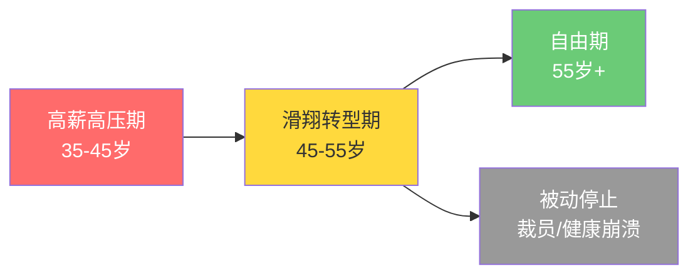
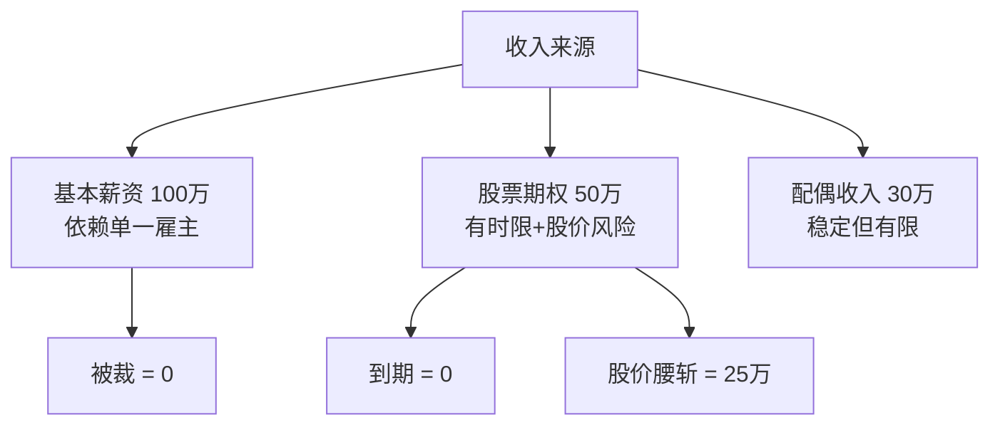
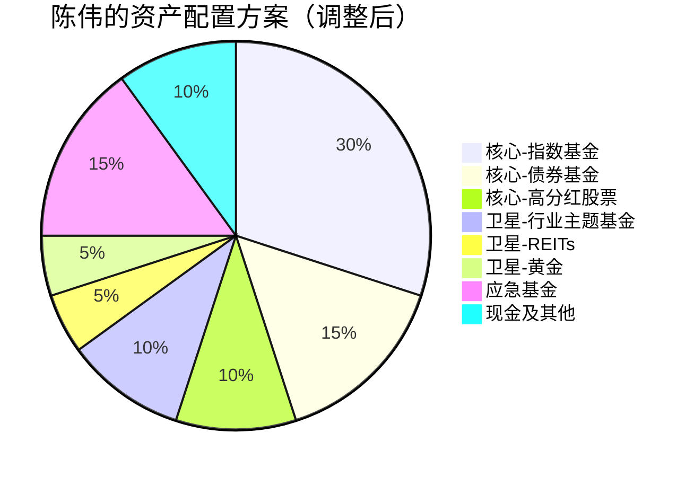
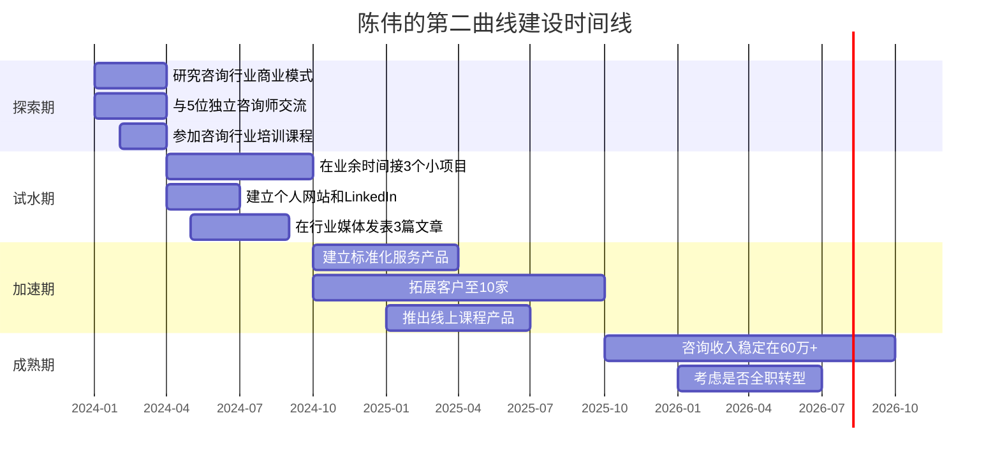

## 案例一：企业高管的"滑翔路径"转型

> 46岁的上市公司副总裁，年薪150万，家庭净资产800万——看似光鲜的履历背后，隐藏着收入断崖、健康透支和方向迷失三重危机。本案例完整记录了他如何用5年时间，从"高薪高压"平稳过渡到"中收入高质量"的人生状态。

### 一、什么是"滑翔路径"

"滑翔路径"（Glide Path）原本是目标日期基金（Target-Date Fund）中的核心概念——随着退休日期临近，基金自动将资产从高风险的股票逐步转向低风险的债券，就像飞机降落前的滑翔阶段，平稳降低高度而非骤然坠落。

将这个概念延伸到职业和人生规划中，**"滑翔路径"转型**指的是：在职业生涯的最后10-15年，主动、渐进地从高强度高收入模式过渡到可持续的低压力生活方式，而非等到被迫停止（裁员、健康崩溃）才仓促应对。

滑翔路径的核心理念有三条：

1. **主动降速优于被动刹车**：自己选择何时减速、以何种方式减速，远比被外力逼停来得从容
2. **收入替代而非收入消失**：用新的收入来源逐步替代旧的，而非等旧的没了再找新的
3. **生活质量是终极指标**：收入只是手段，健康、自由、家庭关系才是目的

### 二、案例背景：陈伟的全景画像

#### 2.1 个人档案

| 维度 | 具体信息 |
|------|----------|
| 姓名 | 陈伟（化名） |
| 年龄 | 46岁 |
| 职位 | 某A股上市公司副总裁（分管市场） |
| 年薪 | 150万（其中股票期权约50万） |
| 工作强度 | 每周60-70小时，频繁出差 |
| 健康状况 | 高血压（服药中）、脂肪肝（中度）、颈椎病 |
| 家庭 | 已婚，妻子38岁在事业单位，两个孩子（15岁、12岁） |
| 居住 | 一线城市，自住房一套（市值400万）+投资房一套（市值200万） |

#### 2.2 财务全景

陈伟请了专业理财顾问做全面财务体检，结果如下：

**收入结构（年）：**

| 来源 | 金额 | 占比 |
|------|------|------|
| 基本薪资 | 100万 | 55.6% |
| 股票期权 | 50万 | 27.8% |
| 配偶收入 | 30万 | 16.7% |
| **合计** | **180万** | **100%** |

**支出结构（年）：**

| 类别 | 金额 | 占比 |
|------|------|------|
| 房贷还款 | 18万 | 22.5% |
| 子女教育 | 25万 | 31.3% |
| 生活开支 | 20万 | 25.0% |
| 医疗保健 | 5万 | 6.3% |
| 保险 | 4万 | 5.0% |
| 其他（社交应酬、家庭旅行、节日礼品） | 8万 | 10.0% |
| **合计** | **80万** | **100%** |

**资产负债表：**

| 资产类别 | 金额 | 占比 | 备注 |
|----------|------|------|------|
| 公司股票 | 300万 | 30% | 锁定期即将结束 |
| 其他股票基金 | 120万 | 12% | 散户操作，无系统策略 |
| 银行理财 | 80万 | 8% | 低风险低收益 |
| 自住房产 | 400万 | 40% | 自住，无变现计划 |
| 投资房产 | 200万 | 20% | 出租中，月租8000 |
| **资产合计** | **1100万** | | |
| 房贷余额 | -100万 | | |
| **净资产** | **约1000万** | | |

**关键财务指标：**

| 指标 | 陈伟的实际值 | 健康标准 | 评估 |
|------|-------------|----------|------|
| 储蓄率 | 55% | >30% | ✅ 优秀 |
| 流动性比率 | 1.2倍月支出 | >6倍 | ❌ 严重不足 |
| 负债收入比 | 10% | <35% | ✅ 安全 |
| 投资集中度 | 公司股票占投资资产60% | 单一标的<20% | ❌ 极度集中 |
| 被动收入占比 | 5.3%（租金） | >30% | ❌ 严重不足 |
| 保险覆盖度 | 基本社保 | 补充商业保险 | ⚠️ 不足 |

### 三、问题诊断：三重危机

#### 3.1 危机一：收入结构的脆弱性

陈伟的核心问题是**收入高度依赖单一雇主和单一激励形式**。150万年薪中，50万来自股票期权，这部分收入有三个致命弱点：

- **时间限制**：股权激励计划还有2年到期，到期后能否续约存在不确定性
- **公司绑定**：一旦离职，期权可能作废或大幅折价
- **市场风险**：股价下跌直接侵蚀这部分收入的价值

即使不考虑期权，100万基本薪资也高度依赖于公司对他的"需要程度"。46岁在互联网/科技行业已经是"高龄"高管，一旦组织架构调整，被优化的风险真实存在。

#### 3.2 危机二：资产配置的集中风险

300万公司股票占投资资产的60%，这是典型的"把鸡蛋放在一个篮子里"。更糟糕的是，陈伟的薪资也来自同一家公司——**他的收入和资产同时暴露在同一家公司的经营风险之下**。

历史上无数案例证明这种模式的危险性：

- **安然事件（2001年）**：员工401(k)退休金中70%以上是公司股票，公司破产后退休金归零
- **雷曼兄弟（2008年）**：高管持有的公司股票一夜之间变成废纸
- **国内案例**：多家互联网公司股价暴跌50%以上，持有公司股票的员工资产大幅缩水

**核心原则**：你的收入来源（工资）和你的投资组合（资产）应该尽可能分散。如果两者都集中在同一家公司，等于把"收入风险"和"投资风险"叠加在一起。

#### 3.3 危机三：健康的隐性负债

高血压、脂肪肝、颈椎病——这些"中年标配"看似常见，实则是未来巨额医疗支出的定时炸弹：

| 健康问题 | 当前状态 | 10年后可能状态 | 潜在年均医疗支出 |
|----------|----------|---------------|----------------|
| 高血压 | 药物控制 | 可能引发心脑血管事件 | 2-20万（含住院） |
| 脂肪肝 | 中度 | 可能进展为肝纤维化 | 1-10万 |
| 颈椎病 | 间歇性发作 | 可能需要手术治疗 | 3-8万 |

更关键的是，健康问题直接影响职业能力——一个经常需要住院、无法出差的高管，其职场价值会迅速下降。**健康不仅是财务规划的一部分，更是财务规划的前提条件。**

### 四、解决方案：四步滑翔路径

陈伟和理财顾问共同制定了为期5年的"滑翔路径"计划，分为四个并行推进的阶段。

#### 4.1 第一步：财务体检与紧急处置（0-3个月）

**目标**：消除最紧急的风险点。

**行动清单：**

1. **减持公司股票**
   - 立即卖出60%（180万），保留40%（120万）观望
   - 分3个月卖出，每月卖出60万，避免对股价造成冲击
   - 注意：需咨询税务顾问，合理安排卖出时点以优化资本利得税
   - 为什么要保留40%？因为如果期权计划续约，仍有一定上涨空间；同时一次全卖可能影响在职期间的公司信任

2. **建立应急基金**
   - 目标金额：100万（覆盖12-15个月家庭支出）
   - 存放位置：70万在货币基金（随时可取）+ 30万在银行活期
   - 这笔钱的作用不是增值，而是在最坏情况（突然失业）下给家庭足够的缓冲时间

3. **补充保险**
   - 为陈伟购买：重疾险（保额100万）+ 定期寿险（保额200万）+ 高端医疗险
   - 为配偶购买：重疾险（保额50万）+ 定期寿险（保额100万）
   - 年保费预算：约6-8万
   - **为什么要买高端医疗险？** 因为陈伟的健康状况意味着未来可能频繁就医，高端医疗险可以覆盖私立医院、专家门诊，节省大量排队和等待时间

4. **健康干预**
   - 预约三甲医院全面体检（不是单位的例行体检，而是专项深度检查）
   - 建立健康档案，记录所有指标的基线数据
   - 开始药物治疗优化（咨询专科医生，调整降压方案）

#### 4.2 第二步：资产重新配置（3-12个月）

**目标**：建立稳健的资产配置框架。

**新配置方案（"核心+卫星"模型）：**

**具体操作：**

| 层级 | 资产类别 | 目标比例 | 金额（约700万投资资产） | 产品选择 |
|------|----------|----------|------------------------|----------|
| 核心层（70%） | 沪深300指数基金 | 25% | 175万 | 华泰柏瑞沪深300ETF（510300） |
| | 中证500指数基金 | 10% | 70万 | 南方中证500ETF（510500） |
| | 纯债基金 | 15% | 105万 | 易方达稳健收益债券A |
| | 高分红蓝筹 | 10% | 70万 | 银行股+公用事业股组合 |
| | 中短债基金 | 10% | 70万 | 作为安全垫的第二层 |
| 卫星层（20%） | 行业主题基金 | 10% | 70万 | 消费/医药/新能源各配一部分 |
| | REITs | 5% | 35万 | 公募REITs（保障性租赁住房类） |
| | 黄金ETF | 5% | 35万 | 华安黄金ETF（518880） |
| 流动层（10%） | 货币基金+银行活期 | 10% | 70万 | 余额宝/银行T+0理财 |

**配置逻辑说明：**

- **为什么指数基金占大头？** 主动管理基金长期跑赢指数的概率不到20%，且管理费高出2-3倍。对46岁的陈伟来说，低成本、分散化的指数基金是最优选择
- **为什么要有REITs？** REITs提供稳定的分红收益（通常4-8%），且与股票市场相关性较低，是分散风险的好工具
- **为什么保留黄金？** 黄金是"乱世英雄"，在通胀上升、地缘政治风险加大时提供对冲。5%的比例不会拖累整体收益，但能在极端情况下提供保护
- **为什么高分红蓝筹放在核心层？** 因为陈伟未来需要稳定的现金流，高分红股票（银行、电力、高速公路）的股息率通常在4-6%，是构建"工资替代"收入的基础

**再平衡规则：**
- 每年12月检查一次各资产类别的实际比例
- 当某类资产偏离目标比例超过5个百分点时进行再平衡
- 再平衡时优先卖出涨得多的、买入跌得多的（反人性但正确）

#### 4.3 第三步：第二曲线建设（12-36个月）

**目标**：建立不依赖原雇主的独立收入来源。

陈伟的优势分析：

| 优势维度 | 具体内容 | 变现潜力 |
|----------|----------|----------|
| 行业经验 | 20年市场管理经验 | ⭐⭐⭐⭐⭐ |
| 人脉网络 | 大量供应商、客户、同行 | ⭐⭐⭐⭐ |
| 专业技能 | 市场战略、品牌建设、团队管理 | ⭐⭐⭐⭐ |
| 个人品牌 | 行业峰会演讲嘉宾、媒体曝光 | ⭐⭐⭐ |
| 学历背景 | MBA + 海外工作经历 | ⭐⭐⭐ |

**第二曲线路线图：**

**具体执行步骤：**

**阶段一：探索（第1-3个月）**
- 研究目标客户群体：中小企业（年营收5000万-5亿）的市场战略需求
- 与5位已经独立的咨询师深度交流，了解行业真实面貌（收入、获客、挑战）
- 确定核心服务方向：帮中小企业做市场战略规划和品牌建设
- 评估竞争格局：谁在做？收费多少？陈伟的差异化优势在哪？

**阶段二：试水（第4-12个月）**
- 利用人脉获取前3个客户，以低于市场价30%的"试水价"提供服务
- 每个项目控制在2-4周，目的是验证服务流程和客户反馈
- 建立个人网站（不需要复杂，一个单页介绍+案例展示即可）
- 在行业媒体或公众号发表2-3篇专业文章，建立专业形象
- **关键指标**：3个客户中至少2个愿意推荐给别人 = 服务验证成功

**阶段三：加速（第13-24个月）**
- 将咨询服务"产品化"——标准化服务流程、定价体系、交付模板
- 客户数量目标：从3个扩展到10个
- 推出"高端工作坊"产品：2天1夜的企业内训，收费3-5万/场
- 开始录制线上课程（内容来自实际咨询经验），上线知识付费平台
- **关键指标**：年度咨询收入达到30万

**阶段四：成熟（第25-36个月）**
- 形成"咨询+课程+工作坊"的三轮驱动收入模型
- 考虑是否从上市公司全职离职
- 如果离职，收入结构应为：咨询40万 + 课程15万 + 投资收益15万 = 70万
- 如果不离职，副业收入作为"安全垫"，增强对主业的议价能力

#### 4.4 第四步：健康管理系统化（贯穿全程）

**目标**：将健康管理从"想起来才做"变成"系统化执行"。

**健康管理体系：**

| 维度 | 具体行动 | 频率 | 预期效果 |
|------|----------|------|----------|
| 体检 | 三甲医院深度体检 | 每年1次 | 早发现早干预 |
| 运动 | 游泳/快走/力量训练 | 每周3次，每次45分钟 | 改善血压、减脂 |
| 饮食 | 减少应酬、控制盐分、增加蔬果 | 每日执行 | 改善脂肪肝 |
| 睡眠 | 23:00前入睡，保证7小时 | 每日执行 | 恢复精力 |
| 心理 | 正念冥想、心理咨询 | 每周2次冥想，每月1次咨询 | 管理压力 |
| 医疗 | 遵医嘱服药、定期复查 | 按医嘱执行 | 控制慢性病 |

**健康管理的财务逻辑：**

很多高管认为"健康管理"和"财务规划"是两件独立的事。事实上，它们是高度耦合的：

- **健康支出是投资，不是成本**：每年花5万在健康管理上（体检、运动、营养师），可以避免未来50万的医疗支出
- **健康是职业能力的基础**：一个精力充沛的高管，其工作效率和决策质量远高于慢性疲劳的高管
- **健康影响保险成本**：如果现在不管理健康，未来购买保险时可能面临加费、除外甚至拒保

### 五、执行过程中的关键决策点

#### 5.1 卖出公司股票的时机选择

陈伟最初犹豫是否应该卖出公司股票。他的顾虑是："万一我卖了之后股价涨了呢？"

理财顾问的回答是：**你不是在做股票投机，你是在做风险管理。**

核心逻辑：

| 策略 | 股价涨了 | 股价跌了 |
|------|----------|----------|
| 不卖 | 赚了50万（纸面） | 亏了100万（真金白银） |
| 卖出60% | 少赚30万，但其他资产也涨了 | 少亏60万，生活不受影响 |

**卖出的决策框架：**
- 如果这笔钱对你很重要（应急、教育、养老），就不应该承担集中风险
- 如果你无法承受最坏情况（股价腰斩），就应该卖出
- 如果你"需要"它涨，说明你承担不起这个风险

最终陈伟分3个月卖出了60%的公司股票，成交均价比决策时的股价高了5%——这是一个幸运的结果，但即使卖出后股价涨了20%，从风险管理角度看，这个决策仍然是正确的。

#### 5.2 全职转型还是兼职过渡

第18个月时，陈伟面临一个关键选择：咨询业务已经有了稳定客户，是否应该从上市公司全职离职？

**两个方案的对比分析：**

| 维度 | 方案A：继续全职+兼职 | 方案B：全职转型 |
|------|---------------------|----------------|
| 收入 | 150万（主业）+ 15万（副业）= 165万 | 50万（咨询）+ 15万（投资）= 65万 |
| 时间自由度 | 极低（每周70+小时） | 高（每周40小时） |
| 健康 | 持续恶化 | 可以系统恢复 |
| 家庭 | 严重缺席 | 充分参与 |
| 心理压力 | 极高 | 中等 |
| 职业满足感 | 下降（重复性工作） | 上升（自主选择） |
| 风险 | 高（依赖单一雇主） | 中（多元化收入） |

**陈伟的决策过程：**

他没有立即做出选择，而是用6个月时间做了三件事：

1. **计算"自由数字"**：家庭最低年支出50万 × 25年（假设活到75岁）= 1250万。当前净资产1000万，加上未来5年的积累，可以达到这个数字
2. **和妻子深度沟通**：确认家庭愿意从"高消费模式"切换到"适度消费模式"（子女教育支出可以从25万/年降到15万/年）
3. **给自己设定了"触发条件"**：如果咨询年收入连续6个月超过5万/月（即年化60万），就启动全职转型

最终陈伟在第30个月时全职离职，当时咨询年收入已达55万，加上投资收益15万，家庭总收入约70万——比巅峰时期少了近100万，但生活质量大幅提升。

### 六、五年后的结果

**财务状态（51岁）：**

| 指标 | 5年前（46岁） | 5年后（51岁） | 变化 |
|------|--------------|--------------|------|
| 年收入 | 180万 | 80万（咨询60+投资20） | -55.6% |
| 年支出 | 80万 | 50万 | -37.5% |
| 储蓄率 | 55% | 37.5% | -17.5pp |
| 投资资产 | 500万 | 700万 | +40% |
| 被动收入占比 | 5.3% | 25% | +19.7pp |
| 投资集中度 | 60%单一公司 | <5%单一标的 | ✅ 分散 |
| 家庭净资产 | 1000万 | 1500万 | +50% |

**生活状态：**

| 维度 | 5年前 | 5年后 |
|------|-------|-------|
| 工作时间 | 每周60-70小时 | 每周35-40小时 |
| 出差频率 | 每月4-5次 | 每月1-2次（自己选择） |
| 运动频率 | 几乎没有 | 每周3次 |
| 血压控制 | 不稳定 | 正常范围 |
| 脂肪肝 | 中度 | 轻度（逆转中） |
| 家庭晚餐 | 每月不到5次 | 每周4-5次 |
| 子女关系 | 疏远 | 亲密 |
| 睡眠质量 | 差（经常失眠） | 良好 |
| 心理状态 | 焦虑、迷茫 | 从容、有掌控感 |

### 七、可复用的方法论

从陈伟的案例中，可以提炼出适用于所有40-50岁职场人的"滑翔路径"方法论：

#### 7.1 财务健康度自检清单

| 检查项 | 健康标准 | 你的现状 | 差距 |
|--------|----------|----------|------|
| 应急基金 | ≥12个月支出 | ____ | ____ |
| 投资集中度 | 单一标的<20% | ____ | ____ |
| 被动收入占比 | >30% | ____ | ____ |
| 保险覆盖 | 重疾+寿险+医疗 | ____ | ____ |
| 储蓄率 | >30% | ____ | ____ |
| 负债收入比 | <35% | ____ | ____ |

#### 7.2 "滑翔路径"五步法

1. **体检**（第1个月）：请专业顾问做全面财务体检，了解自己的真实财务状况
2. **止血**（第1-3个月）：消除最紧急的风险（集中持仓、保险不足、应急基金缺失）
3. **重建**（第3-12个月）：建立新的资产配置框架，开始第二曲线探索
4. **加速**（第12-36个月）：扩大第二曲线收入，优化资产配置
5. **着陆**（第36-60个月）：根据第二曲线的成熟度决定是否全职转型

#### 7.3 常见陷阱

| 陷阱 | 表现 | 正确做法 |
|------|------|----------|
| "等到准备好了再开始" | 永远在准备，永远不开始 | 先做最小可行版本（MVP） |
| "收入不能降" | 害怕任何收入下降，死守高薪 | 关注现金流而非总收入 |
| "我还能再干几年" | 延迟决策，直到被迫停止 | 主动规划，把握节奏 |
| "投资收益能覆盖一切" | 过度乐观估计投资回报 | 用保守假设做规划（年化5-6%） |
| "家人不需要参与" | 独自决策，忽视家庭意见 | 家庭是利益共同体，必须共同参与 |

### 八、关键启示

陈伟的案例告诉我们三个核心真理：

**1. "降速"不等于"退步"**

从年薪150万到年收入80万，数字上是下降了47%。但用另一个指标衡量——每小时收入：150万÷3500小时（全年工作时间）= 428元/小时 → 80万÷1800小时 = 444元/小时。**时薪反而提高了**。更不用说健康、家庭关系、心理状态的全面改善。

**2. 风险管理比收益追求更重要**

46岁，距离退休还有15-20年。这个阶段，保住本金、控制风险，远比追求高收益重要。一个年化8%但波动率15%的组合，不如一个年化6%但波动率5%的组合——因为前者可能在某一年亏损30%，迫使你在最糟糕的时点卖出。

**3. 第二曲线要趁早建设**

陈伟最庆幸的决定是在46岁就开始建设第二曲线，而不是等到50岁被裁时才开始。3年的时间差，意味着他有足够的时间试错、调整、积累——如果等到被迫转型，他将面临巨大的心理压力和财务压力，做出的决策质量会大打折扣。

> **行动建议**：如果你正处于40-50岁阶段，今天就做三件事：① 计算你的"自由数字"；② 检查你的投资集中度；③ 和你的伴侣进行一次深度的"未来规划"对话。不需要完美的计划，但需要开始行动。

***
