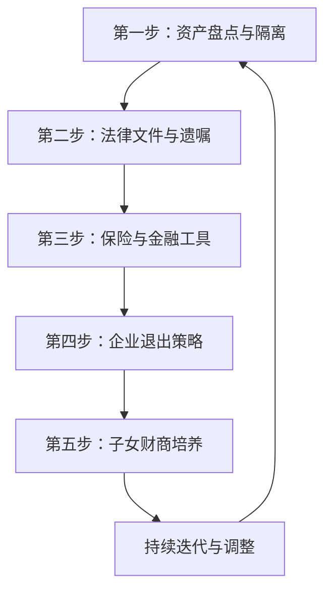

## 案例二：传统行业老板的财富传承

### 背景

王建国，48岁，浙江温州人，经营一家中型阀门制造企业已有22年。企业年产值约8000万元，员工120人，年净利润约600万元。已婚，育有一子一女——儿子王明辉26岁，大学毕业后在杭州一家互联网公司做产品经理；女儿王明瑶22岁，正在读研究生。

家庭资产概况：

| 资产类别 | 金额（万元） | 占比 |
|---------|------------|------|
| 企业股权（账面） | 3,000 | 37.5% |
| 房产（3套） | 2,500 | 31.3% |
| 银行理财/存款 | 1,200 | 15.0% |
| 股票基金 | 800 | 10.0% |
| 其他（车辆、收藏等） | 500 | 6.2% |
| **家庭净资产合计** | **8,000** | **100%** |

王建国的身体状况尚可，但长期伏案和出差导致颈椎病和轻度脂肪肝。妻子李秀芳46岁，全职太太，偶尔帮忙处理企业的财务报销。

### 面临的核心问题

**问题一：企业接班悬而未决**

王建国经营阀门企业22年，从一个家庭作坊做到年营收近亿的规模。但他心里清楚，传统制造业的利润空间在逐年压缩——原材料涨价、人工成本上升、环保合规投入增加，净利润率从十年前的15%降到了现在的7.5%。

儿子王明辉明确表示不想接手工厂。他在互联网行业做得不错，年薪40万，觉得制造业"太累、太慢、太传统"。女儿还在读书，未来大概率也不会回来。

王建国试过从老员工中培养接班人，但发现了一个现实问题：职业经理人管不好温州的家族企业。他先后请了两位厂长，一位管不住老员工，另一位拿着高薪却把客户资源往自己口袋里装。

**问题二：资产过度集中**

王建国80%以上的财富与企业绑定——企业股权、厂房、应收账款。这意味着：

- 如果行业下行，企业和个人资产同时缩水
- 如果发生法律纠纷（如产品质量诉讼），可能波及家庭资产
- 如果急需用钱，企业资产变现周期长、折价大

他身边已经有同行因为资产集中吃过亏。2019年，一位做紧固件的朋友因为主要客户破产，应收账款变成坏账，企业现金流断裂，最后不得不低价卖掉厂房还债，个人资产也被牵连。

**问题三：传承缺乏规划**

王建国没有任何传承规划——没有遗嘱、没有保险安排、没有家族信托、甚至没有和子女正式讨论过"如果我出了意外，家里怎么办"。

他的想法很朴素："我还年轻，不着急。"但他也隐约意识到，身边已经有同龄人因为突发疾病或意外离世，留下一地鸡毛。

**问题四：税务风险**

企业存在一些历史遗留的税务问题——早年间的不规范操作留下了隐患。如果未来要转让股权或进行资产过户，可能面临补税和罚款。王建国粗略估算过，如果按正规流程处理，涉及的税费可能高达数百万元。

**问题五：子女财商参差不齐**

儿子王明辉收入不错但花钱大手大脚，月光族一个，没有任何投资习惯。女儿王明瑶虽然学业优秀，但对金钱完全没有概念，觉得"家里有钱就够了"。

王建国担心的是：如果有一天把财富交给他们，他们能不能守得住？

### 解决方案

王建国在一位做财富管理的大学同学建议下，组建了一个由律师、会计师、理财顾问和保险经纪人组成的专业团队，用了六个月时间，制定了一套系统的财富传承方案。

**第一步：企业与个人资产隔离（0-3个月）**

这是最紧急的任务。王建国在律师的指导下做了以下安排：

1. **规范企业治理结构**。将个人独资企业改制为有限责任公司，明确股权结构——王建国持股70%，妻子李秀芳持股30%。这样做的好处是：企业债务以注册资本为限，不会无限追索到个人资产。

2. **建立家庭资产防火墙**。将家庭自住房产和部分金融资产登记在妻子名下，与企业资产形成隔离。同时将一套投资性房产过户到子女名下（通过赠与方式，利用每年的免税额度分步操作）。

3. **清理历史税务问题**。聘请税务师事务所对企业近五年的账务进行全面审计，主动补缴了约80万元的税款和滞纳金。虽然短期看是一笔不小的支出，但消除了未来传承时"秋后算账"的风险。

**第二步：制定遗嘱和法律文件（3-6个月）**

王建国在律师的协助下完成了以下法律文件：

1. **公证遗嘱**。明确了在不同情况下的资产分配方案：
   - 如果夫妻双方同时离世：企业股权由儿子继承60%、女儿继承40%（儿子多分是因为考虑他未来可能参与企业管理）；房产由女儿继承两套、儿子继承一套（平衡分配）；金融资产由配偶、子女三人均分。
   - 如果仅王建国离世：企业股权由妻子代持，待子女具备能力后再过户。

2. **意定监护协议**。鉴于父母年迈（均已70多岁），王建国与妻子互为意定监护人，确保在一方丧失行为能力时，另一方有权代为处理财产和医疗事务。

3. **股东协议补充条款**。在公司章程中增加了"股东身故后的股权处理条款"——如果王建国意外离世，其他股东有优先购买权，但价格不低于经审计的净资产的1.2倍。这保护了家族利益，也避免了企业因股权纠纷陷入混乱。

**第三步：保险配置（同步进行）**

保险经纪人根据王建国的家庭情况，设计了一套"保险传承+保障"方案：

| 保险类型 | 保额（万元） | 年缴保费（元） | 目的 |
|---------|------------|--------------|------|
| 定期寿险 | 500 | 28,000 | 覆盖企业贷款和家庭基本需求 |
| 终身寿险 | 300 | 85,000 | 财富传承，身故后受益人获得保险金 |
| 重大疾病险 | 200 | 42,000 | 覆盖大病治疗费用和收入损失 |
| 高端医疗险 | - | 35,000 | 解决就医品质问题 |
| 年金保险 | - | 100,000 | 退休后提供稳定现金流 |
| **合计** | - | **290,000** | - |

年缴保费约29万元，占家庭年收入的1.6%，在可承受范围内。

其中终身寿险是传承的核心工具——王建国身故后，受益人（妻子和子女）将获得300万元保险金，这笔钱不属于遗产，不需要经过继承程序，不受企业债务影响，且免征个人所得税。这就是前文提到的"保险杠杆传承法"的实际应用。

**第四步：家族信托搭建（6-12个月）**

王建国拿出500万元设立了家族信托，这是他财富传承方案中最重要的一步：

- **委托人**：王建国
- **受托人**：某信托公司
- **受益人**：妻子李秀芳（第一受益人）、儿子王明辉和女儿王明瑶（第二受益人）
- **信托规模**：500万元初始资金，后续计划每年追加100万元

信托的分配规则经过精心设计：

1. **妻子的生活保障**：每月从信托中支取3万元作为生活费，终身有效。
2. **子女教育激励**：子女每取得一项学历或职业资格证书，可获得一次性奖励10万元。
3. **创业支持**：子女如果创业，可申请最高50万元的启动资金，但需要提交商业计划书并经信托委员会审核。
4. **约束条款**：如果受益人涉及违法犯罪、赌博或吸毒，信托分配自动暂停。

这个设计的核心逻辑是：**既保障基本生活，又激励正向行为，同时设置底线约束**。王建国最担心的"败家"问题，通过信托机制得到了制度化的解决。

**第五步：子女财商培养（长期）**

王建国意识到，再多的制度设计，都不如让子女具备真正的财富管理能力。他开始了系统性的财商培养：

**对儿子王明辉：**

- 每月给他看企业财务报表（脱敏版），让他理解"钱是怎么赚的"
- 鼓励他学习投资，先从模拟盘开始，半年后允许用10万元实盘操作
- 和他讨论企业的战略方向，虽然他不接手，但作为股东需要具备判断力
- 请他帮忙分析企业数字化转型的方案——利用他的互联网背景

**对女儿王明瑶：**

- 给她一本家庭财务账本，让她记录自己半年的收支
- 带她参加了一次家族信托的受益人会议，让她了解信托的运作方式
- 推荐她阅读《富爸爸穷爸爸》《小狗钱钱》等入门书籍
- 和她讨论"如果给你100万，你会怎么安排"，引导她建立投资思维

**第六步：企业退出策略规划（1-3年）**

王建国开始认真思考企业的未来。他评估了三条路径：

| 路径 | 优势 | 劣势 | 适合情况 |
|------|------|------|---------|
| 找职业经理人团队 | 保留股权收益 | 管理风险大 | 子女不接手但行业仍有前景 |
| 卖给同行或PE | 一次性变现 | 可能被低估 | 行业下行、想彻底退出 |
| 培养内部合伙人 | 激励团队 | 退出不彻底 | 核心团队可靠 |

经过反复权衡，王建国选择了"内部合伙人+逐步退出"的方案：

1. 将20%的股权以优惠价格转让给三位核心高管（生产副总、销售总监、技术总工），绑定他们的利益。
2. 用3年时间逐步交接管理权，自己退居"董事长"角色，只管战略和财务。
3. 5年内如果企业经营稳定，再转让30%股权，自己保留20%作为财务投资。

这个方案的好处是：既保证了企业的平稳过渡，又实现了王建国的"软着陆"，还保留了一部分股权收益。

### 执行成果

三年后（王建国51岁），传承方案初见成效：

| 指标 | 规划前 | 规划后 | 变化 |
|------|-------|-------|------|
| 企业持股比例 | 100% | 50% | ↓50% |
| 个人可投资资产 | 2,000万 | 3,500万 | ↑75% |
| 企业与个人资产隔离度 | 约20% | 约80% | ↑300% |
| 保险保障总额 | 0 | 1,000万 | 从无到有 |
| 信托资产规模 | 0 | 800万 | 从无到有 |
| 子女财商评估 | 基础级 | 进阶级 | 显著提升 |
| 工作时间 | 70小时/周 | 30小时/周 | ↓57% |
| 企业净利润率 | 7.5% | 9.2% | ↑22.7% |

最后一条数据出乎王建国的意料——他退居二线后，年轻管理团队反而更有干劲，企业利润率不降反升。这验证了一个道理：**老板"放手"有时候比"抓紧"更有利于企业发展**。

### 深度复盘：六个关键决策的得与失

**决策一：主动补税80万——"花钱买安心"**

当时很多人觉得王建国"傻"，主动补税等于自掏腰包。但三年后的变化证明这是明智之举：金税四期上线后，税务大数据比对让很多"历史问题"暴露无遗。王建国身边至少三位同行因为历史税务问题被查，补税加罚款动辄数百万。而王建国因为已经"洗干净"了，反而省了更大的麻烦。

**教训**：税务合规的"成本"是确定的，但不合规的"代价"是不确定的——而且往往大得多。

**决策二：用家族信托而非直接赠与——"制度管人"**

王建国最初的想法是直接把资产转给子女。但律师给他算了一笔账：如果直接赠与，子女获得资产后完全由自己支配，没有任何约束机制。而家族信托虽然有管理费用（每年约4万元），但提供了制度化的保障。

更重要的是，信托的分配规则是王建国和妻子共同商定的，体现了他们的价值观和教育理念。即使他们不在了，信托仍然会按照既定规则运行。这是一种"跨越时间的爱"。

**决策三：保险配置——"有备无患"**

王建国曾觉得每年花29万买保险"太贵"。但保险经纪人给他看了一个数据：在中国，40-55岁是重大疾病的高发期，平均每分钟就有7.5人被确诊为癌症。一旦发生重疾，不仅治疗费用高昂，企业经营也会受到严重影响。

保险的本质是"用确定的小额支出，对冲不确定的大额风险"。对于企业主来说，保险不仅是个人保障，更是企业经营的"安全垫"。

**决策四：子女差异化培养——"因材施教"**

王建国没有用同一套方法教育两个孩子，而是根据他们的特点制定了不同的培养方案。儿子有商业头脑但缺乏耐心，所以让他从投资实盘开始，培养对数字的敏感度。女儿感性细腻但缺乏财务意识，所以从记账和阅读入门，循序渐进。

两年后的效果：儿子开始主动阅读企业财报，甚至帮王建国发现了一个供应商报价异常的问题。女儿则养成了记账习惯，每月结余率稳定在40%以上。

**决策五：内部合伙人模式——"利益共同体"**

王建国在转让股权时，没有选择一次性卖给外部投资者，而是优先让内部高管持股。这个决策的核心逻辑是：**企业最大的资产是人，而留住人最好的方式是让他们成为"主人"**。

股权激励后，三位核心高管的工作积极性明显提升。生产副总主动推动精益生产改革，一年节省成本120万；销售总监开拓了两个新市场，新增营收800万；技术总工带领团队完成了两个专利申请。

**决策六：退出节奏——"循序渐进"**

王建国没有选择"一步到位"的退出方式，而是分阶段逐步放手。这个节奏的好处是：

1. 给管理团队足够的适应时间
2. 在过程中验证团队的能力
3. 保留一定的控制权作为"安全网"
4. 根据实际情况灵活调整后续计划

### 常见误区警示

在帮助王建国制定方案的过程中，团队总结了传统行业老板在财富传承中的五个典型误区：

**误区一："我还年轻，不着急"**

王建国自己也曾有过这种想法。数据显示，中国企业家的平均退休年龄是55岁，但规划传承的最佳时间是45-50岁——因为好的传承方案需要3-5年的时间来执行和调整。等到"不得不"的时候再规划，往往已经错过了最佳窗口。

**误区二："把钱给孩子就行了"**

直接给钱是最简单但最危险的传承方式。没有配套的财商教育和制度约束，"富不过三代"的魔咒很难打破。中国民营经济研究会的数据显示，家族企业传承的成功率只有30%左右，而失败案例中超过60%与"继承人能力不足"有关。

**误区三："买几份保险就够了"**

保险是传承工具之一，但不是全部。一个完整的传承方案需要法律文件（遗嘱、信托）、金融工具（保险、投资）、治理结构（股东协议、家族宪章）和人力资本培养（财商教育）四个维度的配合。单靠保险解决不了企业接班、资产隔离和子女教育的问题。

**误区四："传承是死后的事"**

传承不仅仅是"我走了以后钱怎么分"，更包括"我活着的时候怎么教"。王建国在规划过程中最大的感悟是：传承的核心不是"传钱"，而是"传能力"。一个有能力的子女，即使只继承10%的资产，也能把它做大；一个没有能力的子女，即使继承100%，也可能很快败光。

**误区五："找一个好律师就够了"**

传承是一个系统工程，需要律师、会计师、理财顾问、保险经纪人甚至心理咨询师的协同配合。单一专业人士只能解决局部问题，无法提供全局性的方案。王建国的经验是：**一个好的财富管理团队，比一个好的律师重要得多**。

### 可复用的传承规划框架

基于王建国的案例，我们可以提炼出一个适用于传统行业企业主的"五步传承框架"：

每一步的核心任务：

| 步骤 | 核心任务 | 关键产出 | 时间周期 |
|------|---------|---------|---------|
| 资产盘点与隔离 | 梳理家庭与企业资产，建立防火墙 | 资产清单、隔离方案 | 0-3个月 |
| 法律文件与遗嘱 | 制定遗嘱、意定监护、股东协议 | 公证遗嘱、法律文件包 | 3-6个月 |
| 保险与金融工具 | 配置保险、设立家族信托 | 保险方案、信托合同 | 3-12个月 |
| 企业退出策略 | 规划接班人、股权转让、管理权交接 | 退出路线图、股权协议 | 1-3年 |
| 子女财商培养 | 系统性财商教育、实践锻炼 | 培养计划、评估报告 | 长期 |

### 关键启示

**1. 财富传承的本质是"能力传承"**

王建国最大的收获不是建立了完善的法律和金融架构，而是意识到：传承的核心不是"给钱"，而是"给能力"。一个有财商、有判断力、有责任感的下一代，才是家族财富最可靠的"保险"。

**2. 资产隔离是传承的基础**

在做任何传承安排之前，首先要确保企业资产和个人资产有清晰的边界。这不仅是财务安全的需要，也是法律合规的要求。

**3. 传承规划要趁早**

48岁的王建国已经开始觉得"有点晚了"——如果他能在45岁甚至40岁就开始规划，方案会更从容、成本会更低、效果会更好。

**4. 专业团队不可或缺**

传承涉及法律、税务、金融、保险、企业管理等多个领域，没有一个人能精通所有领域。组建一个靠谱的专业团队，是传承成功的关键保障。

**5. 传承是一个持续迭代的过程**

没有"一劳永逸"的传承方案。家庭情况、市场环境、政策法规都在变化，传承方案也需要定期审视和调整。王建国计划每两年对方案进行一次全面复盘，确保方案始终与实际情况匹配。

***
