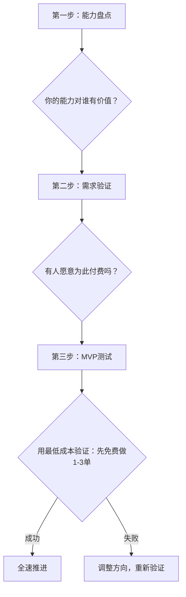

## 案例三：中年转行的自由职业者——从零到月入过万的副业自由之路

### 一、案例背景

#### 人物画像

李明（化名），43岁，原某制造企业中层管理者，负责供应链运营。已婚，有一个正在读高中的孩子。家庭净资产约350万（含房产、存款和少量基金），配偶在事业单位工作，家庭年收入约45万。

#### 核心困境

李明面临的问题在40-50岁人群中极具代表性：

1. **职业天花板明显**：所在行业持续萎缩，公司连续两年缩减编制，晋升通道几乎关闭
2. **年龄歧视真实存在**：43岁在制造业跳槽，简历投出去石沉大海是常态
3. **收入增长停滞**：年薪25万已经三年没有涨过，扣除通胀实际购买力在下降
4. **心理焦虑加剧**：看到同龄人被优化后长期失业，担心自己成为下一个

但他也拥有40-50岁人群的典型优势：

- 20年行业经验，对供应链管理有深度理解
- 积累了大量上下游人脉关系
- 有一定的积蓄，短期内不至于断粮
- 孩子即将上大学，家庭开支即将迎来一个"窗口期"

#### 转型动机

2022年底，李明的一个前同事创业开了一家小型跨境电商公司，找到他帮忙做供应链咨询。这次偶然的机会让他意识到：自己积累的行业经验，对于中小企业来说是非常稀缺的资源。与其等着被优化，不如主动出击，把经验变成收入。

### 二、转型前的系统准备（0-6个月）

中年转行做自由职业，绝不是一拍脑袋的事。李明花了整整6个月做准备，这个阶段的核心任务是"在岸上学游泳"。

#### 2.1 自我盘点：梳理可变现的能力清单

李明做了一次彻底的自我审计，将自己的能力分为三层：

| 能力层级 | 具体内容 | 变现潜力 | 目标客户 |
|---------|---------|---------|---------|
| **核心能力** | 供应商开发与管理、成本控制、供应链优化 | 高 | 中小制造企业、跨境电商 |
| **辅助能力** | 项目管理、团队培训、流程优化 | 中 | 各类中小企业 |
| **可迁移能力** | 数据分析、Excel/ERP系统操作、商务谈判 | 中 | 广泛 |

**关键发现**：李明发现自己最强的能力——"帮企业找到靠谱供应商并把采购成本降下来"——恰恰是中小企业最痛的痛点。大企业有成熟的采购体系，小企业全靠老板一个人摸索。

#### 2.2 市场验证：确认需求真实存在

李明没有急于辞职，而是用了3个月时间做市场调研：

**线上调研**：
- 在知乎、小红书搜索"供应链咨询""采购外包"等关键词，发现大量中小企业主在求助
- 加入了5个跨境电商交流群，观察群里的痛点讨论
- 在猪八戒、威客网等平台搜索类似服务，了解定价和竞争格局

**线下验证**：
- 约了8位中小企业主朋友吃饭聊天，直接询问"如果有人帮你做供应链优化，你愿意付多少钱"
- 得到的反馈：6个人表示愿意尝试，预算在5000-20000元/项目不等
- 2个人当场表示"你可以先帮我看看"

**结论**：需求真实存在，而且竞争远没有想象中激烈——大多数供应链专家都在大企业里，真正出来做独立咨询的人很少。

#### 2.3 财务安全垫建设

李明制定了严格的"安全垫"计划：

```text
转型前财务清单：
├── 应急基金：准备18个月家庭基本开支（约30万）放在货币基金
├── 保险配置：全家重疾险+医疗险已覆盖，额外购买了意外险
├── 负债管理：房贷余额60万，月供4500，压力可控
├── 配偶收入：配偶年收入20万，覆盖家庭基本开支的70%
└── 最坏打算：如果1年内副业收入低于5万，重新找工作
```

**核心原则**：绝不在没有安全垫的情况下裸辞。副业收入稳定达到主业50%之前，主业不能丢。

### 三、试水阶段：边上班边做副业（6-18个月）

#### 3.1 从免费开始，建立第一批口碑

李明的策略是"先免费、再低价、最后正价"：

**第一批客户（免费期，1-3个月）**：
- 帮前同事的跨境电商公司做了供应商筛选，采购成本降低了15%
- 帮一个做外贸的朋友做了一次供应链诊断，给出了详细的优化方案
- 帮一个做内贸的小企业主谈下了两个新供应商

**为什么从免费开始？** 因为自由职业者最大的挑战不是能力，而是信任。43岁转型，没有作品集、没有案例、没有口碑，客户凭什么相信你？免费服务是最快建立信任的方式。

#### 3.2 打造服务产品

经过3个月的免费实践，李明把自己的服务标准化为三个产品：

| 服务产品 | 内容 | 定价 | 交付周期 | 目标客户 |
|---------|------|------|---------|---------|
| **供应链诊断** | 全面分析客户的供应链现状，出具诊断报告和优化建议 | 3000-5000元 | 1-2周 | 所有中小企业 |
| **供应商开发** | 根据客户需求，筛选、评估、推荐合格供应商 | 8000-15000元 | 1-2个月 | 制造业、跨境电商 |
| **供应链顾问** | 按月提供供应链管理咨询，含定期会议和随时沟通 | 5000-10000元/月 | 持续 | 有长期需求的企业 |

**定价逻辑**：
- 参考市场上同类服务的价格（猪八戒网上供应链咨询报价普遍在3000-20000元）
- 考虑到自己的经验水平，定价略低于市场均价（初期需要靠性价比打开市场）
- 设置阶梯价格，让客户可以从低门槛的"诊断"服务开始尝试

#### 3.3 个人品牌建设

李明用了3个渠道建立个人品牌：

**渠道一：微信公众号**
- 每周发布1篇供应链管理相关的干货文章
- 内容方向：中小企业的供应链避坑指南、供应商谈判技巧、成本控制实操
- 6个月积累了1200个粉丝，虽然不多但都是精准人群

**渠道二：知乎/小红书回答**
- 专门回答"如何找供应商""怎么降低采购成本"等问题
- 用真实案例和数据说话，建立专业形象
- 知乎回答累计获得2万+赞同

**渠道三：行业社群**
- 加入了10个跨境电商、制造业相关的社群
- 在群里主动回答问题，不推销，只提供价值
- 通过社群认识了大量潜在客户

**关键心得**：个人品牌不是一天建成的，需要持续输出有价值的内容。李明每天花1小时写文章、回答问题，坚持了6个月才看到明显效果。

#### 3.4 副业收入增长曲线

| 月份 | 副业收入 | 累计客户数 | 客户来源 |
|------|---------|-----------|---------|
| 第7个月 | 2000元 | 1 | 前同事介绍 |
| 第8个月 | 3000元 | 2 | 社群认识 |
| 第9个月 | 5000元 | 3 | 知乎客户 |
| 第10个月 | 4000元 | 4 | 老客户介绍 |
| 第11个月 | 6000元 | 5 | 社群认识 |
| 第12个月 | 8000元 | 6 | 公众号客户 |
| 第13个月 | 7000元 | 7 | 老客户介绍 |
| 第14个月 | 10000元 | 9 | 多渠道 |
| 第15个月 | 9000元 | 10 | 老客户介绍 |
| 第16个月 | 12000元 | 12 | 多渠道 |
| 第17个月 | 11000元 | 13 | 老客户介绍 |
| 第18个月 | 13000元 | 15 | 多渠道 |

**关键转折点**：第14个月副业收入突破1万元，这是一个重要的心理节点。在此之前，李明一直在犹豫"要不要辞职"；在此之后，他开始认真规划全职转型。

### 四、全职转型阶段（18-30个月）

#### 4.1 辞职时机的判断标准

李明没有冲动辞职，而是设定了明确的"毕业条件"：

```text
全职转型的5个必要条件：
1. 副业月收入连续3个月超过1万元 ✓（第14-16个月达成）
2. 存款足以覆盖18个月家庭开支 ✓（已准备30万应急基金）
3. 配偶完全支持 ✓（配偶看到了副业的增长潜力）
4. 已有稳定的客户来源 ✓（50%以上收入来自老客户介绍）
5. 对最坏情况有预案 ✓（如失败，可以重新找工作或做兼职）
```

#### 4.2 辞职后的关键动作

**第一件事：注册个体工商户**
- 选择个体户而非公司，因为初期规模小，个体户税负更低
- 经营范围：企业管理咨询、供应链管理服务
- 开设对公账户，开始正规化经营

**第二件事：升级服务定价**
- 供应链诊断：5000-8000元
- 供应商开发：15000-25000元
- 供应链顾问：8000-15000元/月
- 涨价的理由：全职投入后服务质量和响应速度大幅提升，客户也认可

**第三件事：建立服务流程**


#### 4.3 自由职业的收入结构优化

全职后，李明开始有意识地优化收入结构：

| 收入来源 | 占比 | 特点 | 优化方向 |
|---------|------|------|---------|
| **项目制服务** | 50% | 一次性收入，需要持续获客 | 逐步提高客单价 |
| **月度顾问** | 30% | 稳定现金流，复购率高 | 增加长期客户数量 |
| **知识付费** | 10% | 边际成本低，可规模化 | 开发课程和电子书 |
| **培训授课** | 10% | 单次收入高，但不稳定 | 积累口碑，增加邀约 |

**关键策略**：逐步提高"月度顾问"和"知识付费"的占比，因为这两项收入更稳定、更可持续。项目制收入虽然高，但波动大，不能过度依赖。

### 五、成熟阶段的经营成果（30个月以后）

#### 5.1 核心数据对比

| 指标 | 转型前（主业） | 起步期（副业） | 成熟期（全职） |
|------|--------------|--------------|--------------|
| 月收入 | 21000元 | 0-5000元 | 15000-25000元 |
| 年收入 | 25万 | 约6万（第一年副业） | 20-25万 |
| 客户数 | — | 0 | 15-20个（含6个月度客户） |
| 复购率 | — | — | 60%以上 |
| 工作时间 | 50小时/周 | 10小时/周（副业） | 30-35小时/周 |
| 通勤时间 | 2小时/天 | — | 0（居家办公） |

#### 5.2 生活质量的变化

收入看似和转型前持平，但生活质量大幅提升：

- **时间自由**：每周少工作15-20小时，通勤时间归零
- **地点自由**：可以在家办公，也可以在咖啡厅、图书馆
- **选择自由**：可以挑选客户和项目，不再忍受无意义的会议和内耗
- **成长自由**：大量时间用于学习和输出，专业能力持续提升
- **家庭关系改善**：有更多时间陪伴家人，夫妻关系和亲子关系明显好转

#### 5.3 财务管理的进阶

自由职业的财务管理比上班族更复杂，李明建立了一套完整体系：

**税务筹划**：
- 个体户核定征收，综合税负约3-5%（远低于上班族的个税税率）
- 合理利用小微企业税收优惠政策
- 每季度申报，聘请兼职会计处理账务

**收入管理**：
- 开设专门的经营账户，业务收入和个人生活费分开管理
- 每月固定日给自己"发工资"15000元，剩余利润留在经营账户
- 经营账户的余额作为业务扩展基金和应急储备

**投资规划**：
- 每月定投指数基金3000元（维持长期投资习惯）
- 保持18个月应急基金不动
- 开始配置商业养老保险，为退休做准备

### 六、踩过的坑与关键教训

#### 6.1 最大的坑：低估了"不确定性焦虑"

李明坦言，自由职业最大的挑战不是赚钱，而是心理适应：

> "前半年，每个月收入都不一样，有时候一个月只有3000块。我老婆虽然嘴上不说，但我能感觉到她的焦虑。我自己也经常失眠，反复问自己'是不是做错了决定'。"

**应对方法**：
- 建立"收入缓冲池"：把高收入月份的多余收入存起来，低收入月份从池子里取
- 每周记录"成就日志"，记录本周完成的项目、客户的好评、新增的能力
- 加入自由职业者社群，和同频的人交流，减少孤独感

#### 6.2 第二个坑：定价太低

李明最初定价时总觉得自己"没有品牌溢价"，不敢收高价。结果发现：

- 定价太低反而让客户怀疑你的能力
- 低价客户往往要求最多、最难伺候
- 收入天花板被自己压死了

**调整策略**：
- 每半年评估一次定价，根据口碑和案例积累逐步涨价
- 用"价值锚定法"报价：不说"我收你1万块"，而说"这个项目帮你节省的成本是10万，我收你1万"
- 设立最低服务门槛，过滤掉预算不足的客户

#### 6.3 第三个坑：不会拒绝

自由职业初期，什么项目都接，结果把自己累垮了：

- 接了一个和自己专业不匹配的项目，交付质量差，差点砸了口碑
- 同时服务太多客户，响应速度下降，老客户有意见
- 帮朋友的朋友做了免费咨询，结果对方不仅不感恩，还觉得你"不过如此"

**教训**：
- 只接自己擅长的项目，宁可少赚钱也不能砸口碑
- 同时服务的项目不超过5个，保证质量
- 免费服务只给前3个种子客户，之后一律收费

#### 6.4 第四个坑：忽视了身体管理

自由职业时间自由，但也很容易作息紊乱。李明有过一段时间每天工作到凌晨2点，结果体检发现血脂异常。

**调整**：
- 设定固定的工作时间：9:00-18:00，中间休息1.5小时
- 每天运动30分钟（快走或游泳）
- 每年全面体检一次

### 七、中年转行做自由职业的核心方法论

#### 7.1 "三步验证法"：确认你的方向是对的



#### 7.2 "收入四象限"：规划你的收入结构

| | 高频 | 低频 |
|---|------|------|
| **高客单价** | 月度顾问服务（稳定现金流） | 项目制大单（爆发性收入） |
| **低客单价** | 知识付费/小课（规模化收入） | 单次咨询（入门级服务） |

**优先发展顺序**：
1. 先做高频低客单价（建立口碑和案例）
2. 再做高频高客单价（核心收入来源）
3. 然后做低频高客单价（锦上添花）
4. 最后做低频低客单价（规模化放量）

#### 7.3 "信任飞轮"：让客户自己找上门

```text
专业内容输出 → 吸引精准流量 → 转化为付费客户 → 产出成功案例
       ↑                                              ↓
       ←←←←←←←←←← 反哺内容和口碑 ←←←←←←←←←←←←←←←←←←
```

李明的经验是：当你有了10个以上的真实成功案例，并且持续输出专业内容，客户会自己找上门来。到那个阶段，你不再需要主动获客，80%的收入来自老客户介绍和内容引流。

### 八、给同类人群的实操建议

#### 8.1 适合做自由职业的条件自检

在决定转行之前，先回答以下问题：

- [ ] 你有至少一项可以独立交付的专业技能吗？
- [ ] 这项技能的市场需求是否真实存在？
- [ ] 你是否能承受6-12个月的收入不稳定期？
- [ ] 你的家庭财务是否有足够的安全垫（12-18个月开支）？
- [ ] 你的配偶是否理解和支持？
- [ ] 你是否具备自我管理和持续学习的能力？
- [ ] 你是否愿意花时间做个人品牌建设和内容输出？

如果以上7个问题中有3个以上回答"否"，建议先解决这些问题再考虑转型。

#### 8.2 推荐的行动时间表

| 阶段 | 时间 | 核心任务 | 关键里程碑 |
|------|------|---------|-----------|
| **准备期** | 第1-3个月 | 能力盘点、市场调研、安全垫建设 | 完成能力清单和市场验证报告 |
| **试水期** | 第4-9个月 | 边上班边做副业，免费或低价获取第一批客户 | 完成3个以上成功案例 |
| **增长期** | 第10-18个月 | 建立个人品牌，扩大客户来源，优化服务产品 | 副业月收入稳定超过1万元 |
| **转型期** | 第19-24个月 | 辞职全职做自由职业，注册个体户，升级服务 | 全职后第一个完整季度收入超过5万 |
| **成熟期** | 第25个月以后 | 优化收入结构，建立被动收入，规划长期发展 | 年收入稳定在20万以上 |

#### 8.3 中年自由职业者的独特优势

不要觉得自己"太老了"才开始。40-50岁做自由职业，反而有几个年轻人不具备的优势：

1. **经验深度**：20年行业经验不是2-3年经验的人能替代的，你的判断力和解决问题的能力是真正的护城河
2. **人脉广度**：多年积累的人脉是最高效的获客渠道，一个介绍胜过一百次推销
3. **信任成本低**：客户更愿意信任一个有阅历、有经验的中年人，而不是刚毕业的年轻人
4. **抗压能力强**：经历过职场的风风雨雨，面对自由职业的不确定性，心理韧性更强
5. **财务基础好**：通常有一定的积蓄，不需要从零开始，有更长的"试错窗口"

### 九、关键启示

李明的案例揭示了中年转行做自由职业的三个核心真相：

**第一，自由职业不是"逃避职场"，而是"换一种方式工作"。** 如果你在职场上做不到专业和自律，自由职业只会更难。自由职业的"自由"指的是时间和地点的自由，不是纪律和标准的自由。

**第二，副业是最好的"转型孵化器"。** 在主业还在的时候，用业余时间验证方向、积累案例、建立品牌，远比裸辞后从零开始安全得多。李明用了18个月的副业期，才最终确认"这条路走得通"。

**第三，40-50岁的经验是真正的"资产"。** 年轻人可以靠体力和时间换钱，中年人应该靠经验和判断力赚钱。自由职业的本质是"把经验产品化"，而这恰恰是中年人最擅长的事。

***
