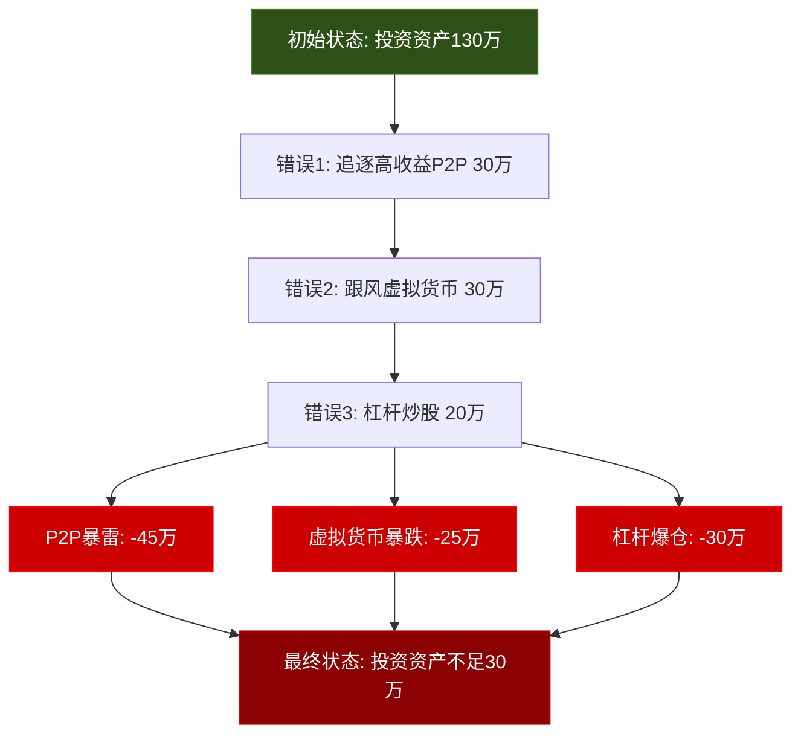
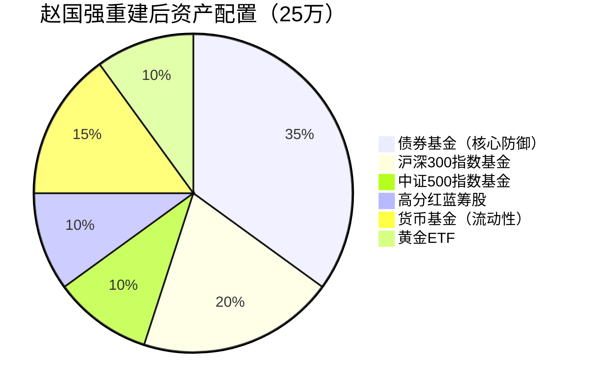

## 案例五：投资失误后的"重建之路"

### 案例背景

赵国强，47岁，某二线城市制造业中层管理者，年收入约45万。妻子李芳在一家事业单位工作，年收入约12万。两人育有一个正在读高二的儿子。家庭净资产曾经达到约350万，但因一系列投资失误，在两年内缩水至不足150万。

**关键时间节点：**
- 2021年初：家庭净资产约350万（房产200万 + 投资资产130万 + 现金20万）
- 2021年中：跟风投入某P2P平台及虚拟货币，初始投入50万
- 2021年底：追加投入至80万，同时加杠杆炒股
- 2022年中：P2P平台暴雷损失45万，虚拟货币亏损25万，股票杠杆爆仓亏损30万
- 2022年底：投资资产从130万缩水至不足30万，家庭净资产跌至约150万

### 问题诊断：一次投资失误的"多米诺骨牌效应"

赵国强的投资失误并非单一事件，而是一连串错误决策的连锁反应。深入分析其失败路径，对40-50岁投资者具有极强的警示意义。

**错误一：追逐高收益，忽视风险评估**

2021年初，赵国强在朋友介绍下接触到某P2P平台，承诺年化收益12%-18%。当时银行理财收益仅3%-4%，巨大的收益差距让他心动。他没有做任何风险评估，仅凭朋友"投了两年都正常兑付"的经验，就投入了30万。

**错误二：追涨杀跌，情绪化操作**

P2P初期收益如期到账后，赵国强信心大增，追加投入至50万。与此同时，他看到身边同事炒虚拟货币赚了钱，又拿出30万投入虚拟货币。这种"别人赚了我也要赚"的心态，是行为金融学中典型的"羊群效应"。

**错误三：加杠杆放大风险**

在虚拟货币和P2P之外，赵国强还开通了股票融资融券账户，以1:1的杠杆买入某热门股票。他完全没有意识到，杠杆会同时放大收益和亏损——当股票下跌10%时，实际亏损是20%。

**错误四：缺乏止损纪律**

当P2P平台开始出现延迟兑付的预警信号时，赵国强没有及时撤出，反而安慰自己"平台这么大，不会倒"。当虚拟货币下跌30%时，他选择"死扛"而不是止损。这种"沉没成本谬误"让他错过了最后的逃生窗口。

**错误五：忽视资产配置的基本原则**

赵国强的全部投资资产130万中，高风险投资（P2P+虚拟货币+杠杆炒股）占比超过60%，完全没有债券、保险等防御性资产。这严重违反了"40-50岁投资者应以稳健为主"的基本原则。

### 重建之路：五步系统性修复方案

#### 第一步：心理重建——接受损失，停止自责（第1-2个月）

投资失误后的第一个挑战不是财务问题，而是心理问题。赵国强在亏损发生后，经历了典型的"投资创伤后应激反应"：

- **否认阶段**（第1-2周）：反复查看账户，希望亏损是"显示错误"
- **愤怒阶段**（第3-4周）：愤怒于平台、愤怒于介绍自己投资的朋友、愤怒于自己
- **抑郁阶段**（第2个月）：失眠、食欲下降、对工作失去兴趣
- **接受阶段**（第3个月）：开始正视现实，寻求解决方案

**赵国强采取的心理修复措施：**

1. **专业心理咨询**：每周一次，持续3个月，帮助他处理投资失败带来的焦虑和自责情绪。心理咨询师帮助他认识到：投资失误是决策过程的问题，不是个人价值的否定。

2. **家庭沟通**：赵国强选择向妻子坦白全部亏损。虽然李芳最初非常愤怒和失望，但两人通过深入沟通，达成了"共同面对、一起重建"的共识。这一步至关重要——隐瞒只会让问题恶化。

3. **设定"止损心态"**：赵国强学会了一个关键认知——"已经亏损的钱不是你的钱"。纠结于沉没成本只会阻碍前进。

#### 第二步：财务体检——摸清家底，制定基准线（第2-3个月）

在心理状态稳定后，赵国强请一位独立理财顾问做了全面的家庭财务分析：

**资产负债表（2022年底）：**

| 类别 | 项目 | 金额（万元） |
|------|------|------------|
| **资产** | 自住房产 | 160 |
| | 投资性房产 | 80 |
| | 剩余投资资产 | 28 |
| | 现金及存款 | 15 |
| | 公积金余额 | 12 |
| | **资产合计** | **295** |
| **负债** | 自住房贷余额 | 95 |
| | 投资房贷款 | 50 |
| | **负债合计** | **145** |
| **净资产** | | **150** |

**月度收支表：**

| 项目 | 金额（元） |
|------|-----------|
| 赵国强税后月收入 | 28,000 |
| 李芳税后月收入 | 8,000 |
| **家庭月收入合计** | **36,000** |
| 房贷月供 | 9,500 |
| 日常生活支出 | 8,000 |
| 子女教育（补习+生活费） | 4,000 |
| 交通+通讯 | 2,000 |
| 保险费用（月均） | 1,500 |
| 其他支出 | 3,000 |
| **月支出合计** | **28,000** |
| **月结余** | **8,000** |

**财务顾问的核心诊断：**

1. **负债率偏高**：投资性房产的贷款每月增加5,000元负担，且该房产租金收入仅3,500元，现金流为负
2. **应急储备不足**：15万现金仅够覆盖5个月支出，低于建议的6-12个月标准
3. **保险配置不完整**：虽然有基本社保和一份重疾险，但缺少定期寿险和意外险
4. **投资结构完全失衡**：剩余28万投资资产中，有15万仍在亏损的虚拟货币中"套牢"

#### 第三步：紧急止血——处理存量问题（第3-6个月）

赵国强在理财顾问帮助下，制定了"止血优先"的行动计划：

**3.1 清理问题资产**

| 资产类型 | 处理方式 | 具体操作 |
|----------|---------|---------|
| 套牢的虚拟货币 | 立即清仓 | 无论亏损多少，全部卖出。理由：虚拟货币不适合40-50岁的稳健期投资者，且赵国强没有足够的专业知识判断其走势 |
| P2P平台残余 | 报案+等待 | 向公安机关报案登记债权，不抱"能拿回来"的期望，心理上将其归零 |
| 投资性房产 | 评估后决策 | 经评估该房产位于非核心区域，升值潜力有限，决定挂牌出售 |

**3.2 优化负债结构**

赵国强将投资性房产以85万元售出（略低于市场价以快速成交），还清50万元贷款后，回笼资金35万元。这笔钱用于：

- 10万：补充应急基金（使应急储备达到25万，覆盖9个月支出）
- 15万：提前偿还自住房贷（减少月供约800元）
- 10万：作为新的投资启动资金

**3.3 补充保险保障**

| 保险类型 | 产品选择 | 年缴保费 | 保障额度 |
|----------|---------|---------|---------|
| 定期寿险 | 20年期 | 3,600元 | 100万 |
| 意外险 | 一年期 | 800元 | 100万 |
| 补充医疗险 | 百万医疗 | 1,200元 | 400万 |
| 已有重疾险 | 维持不变 | 8,000元 | 50万 |
| **合计** | | **13,600元/年** | |

#### 第四步：重建投资体系——稳健为王（第6-12个月）

这是整个重建过程中最核心的一步。赵国强在理财顾问指导下，建立了一套完全不同于以往的投资体系。

**4.1 投资理念的根本转变**

| 维度 | 过去的错误理念 | 重建后的正确理念 |
|------|--------------|----------------|
| 收益预期 | 追求年化15%以上 | 接受年化6%-8%的合理回报 |
| 风险认知 | "高收益=能力强" | "高收益=高风险，我承受不起" |
| 决策依据 | 朋友推荐、跟风 | 独立研究、专业建议 |
| 资产配置 | 集中押注 | 分散配置 |
| 止损纪律 | 无 | 亏损15%强制止损 |

**4.2 新的资产配置方案**

赵国强的可投资资产为25万（10万回笼资金 + 15万重新积累），按照"核心+卫星"策略配置：

**配置逻辑详解：**

- **债券基金35%（8.75万）**：选择纯债基金和一级债基，预期年化收益3%-5%，波动极小。这是整个组合的"压舱石"，确保即使股市大跌，整体亏损可控。

- **沪深300指数基金20%（5万）**：通过定投方式建仓，每月投入4,000元，分12个月完成。选择宽基指数而非行业主题，避免择时风险。

- **中证500指数基金10%（2.5万）**：与沪深300形成大小盘互补，每月定投2,000元。

- **高分红蓝筹股10%（2.5万）**：选择银行、电力、高速公路等行业的高分红股票，年分红率4%-6%。这部分追求的是"现金流"而非"资本增值"。

- **货币基金15%（3.75万）**：保持流动性，随时可以调用。同时也是定投的"弹药库"。

- **黄金ETF10%（2.5万）**：作为对冲通胀和地缘政治风险的工具。

**4.3 定投纪律与再平衡规则**

赵国强制定了严格的投资纪律：

1. **每月定投**：发工资后第二天自动扣款6,000元（沪深300基金4,000元 + 中证500基金2,000元）
2. **季度检视**：每季度末检查一次资产配置比例，偏离目标超过5%时进行再平衡
3. **年度调整**：每年年底根据年龄和市场情况微调配置比例
4. **止损规则**：单一资产亏损达到15%时，强制卖出并重新评估
5. **禁止清单**：不投P2P、不投虚拟货币、不加杠杆、不跟风热点

#### 第五步：开源节流——加速重建（第6个月起持续执行）

仅靠投资收益恢复净资产速度太慢，赵国强同步启动了开源节流计划。

**5.1 节流：每月节省3,000元**

| 调整项目 | 调整前（月） | 调整后（月） | 节省 |
|----------|------------|------------|------|
| 外出就餐 | 2,500 | 1,500 | 1,000 |
| 服装消费 | 1,000 | 500 | 500 |
| 娱乐消费 | 1,500 | 1,000 | 500 |
| 交通方式 | 打车为主 | 地铁+偶尔打车 | 500 |
| 通讯套餐 | 299 | 129 | 170 |
| **合计** | | | **2,670** |

**5.2 开源：利用专业技能增加收入**

赵国强在制造业有20年经验，擅长生产管理和质量控制。他利用业余时间开展以下副业：

- **行业咨询**：为小型制造企业提供生产流程优化咨询，每月服务1-2家企业，月均收入5,000-8,000元
- **行业培训**：在专业平台开设"精益生产"线上课程，录制完成后持续产生被动收入，月均2,000-3,000元
- **技术文档撰写**：为行业杂志和公众号撰写专业文章，月均稿费1,000-2,000元

**月均副业收入：约8,000-13,000元**

### 重建成果：三年后的财务状况

**时间线：2022年底（亏损后）→ 2025年底（三年重建后）**

| 指标 | 2022年底 | 2025年底 | 变化 |
|------|---------|---------|------|
| 家庭净资产 | 150万 | 280万 | +130万 |
| 投资资产 | 28万 | 95万 | +67万 |
| 应急基金 | 15万 | 30万 | +15万 |
| 房贷余额 | 95万 | 75万 | -20万 |
| 月储蓄率 | 22% | 45% | +23% |
| 投资年化收益 | - | 7.2% | - |
| 副业年收入 | 0 | 12万 | +12万 |

**净资产恢复路径分解：**

| 来源 | 三年累计贡献（万元） |
|------|-------------------|
| 工资储蓄（含节流） | 45 |
| 副业收入 | 30 |
| 投资收益（含分红） | 15 |
| 提前还贷减少的利息 | 5 |
| 房贷本金偿还 | 20 |
| 投资性房产处置回笼 | 15 |
| **合计** | **130** |

### 关键教训：六个"投资重建铁律"

**铁律一：先止血，再造血**

投资失误后，第一件事不是"赚回来"，而是"不再亏下去"。赵国强如果在亏损后立即追加投入试图"翻本"，只会越陷越深。正确做法是：清理问题资产→优化负债→补充保险→重建投资。

**铁律二：接受损失是重建的前提**

心理学研究表明，人们对损失的痛苦感是同等收益快感的2-2.5倍（损失厌恶效应）。这意味着大多数人很难接受"已经亏了"的事实，总想"等回本再卖"。但"等回本"往往意味着更大的亏损。虚拟货币从赵国强买入时的高点到他卖出时，又下跌了40%——如果他继续等待，损失会更大。

**铁律三：40-50岁，风险控制比收益追求重要10倍**

30岁时亏了50万，你有20年时间慢慢恢复。47岁时亏了50万，距离退休只有13年，恢复窗口大幅缩短。这就是为什么40-50岁的资产配置必须以稳健为核心——不是不能投资，而是不能"赌"。

**铁律四：专业的事交给专业的人**

赵国强在重建过程中，每月支付理财顾问费2,000元。三年共计7.2万元。但这笔钱帮他避免了至少20万的潜在损失（顾问阻止了他两次冲动投资决策），并帮助他建立了系统的投资框架。对40-50岁投资者来说，独立理财顾问的年费通常在1.5万-3万元之间，性价比极高。

**铁律五：开源节流双管齐下，加速恢复**

单纯靠工资储蓄恢复150万净资产缺口，按月存8,000元计算需要15年以上。但通过节流（每月多存3,000元）+ 副业（月均10,000元）+ 合理投资（年化7%），恢复时间缩短到5-6年。开源节流的效果不是简单的加法，而是复利效应的乘法。

**铁律六：建立"投资检查清单"，防止重蹈覆辙**

赵国强在重建后，为自己制定了一份投资前必须完成的检查清单：

| 检查项 | 问题 | 不通过标准 |
|--------|------|-----------|
| 风险评估 | 这笔投资最大可能亏损多少？ | 亏损金额超过总资产的5% |
| 流动性 | 这笔钱3年内是否需要使用？ | 需要使用则不投 |
| 专业度 | 我是否真正理解这个投资标的？ | 不能用一句话说清楚就不投 |
| 分散度 | 这笔投资后，单一资产占比是否过高？ | 超过总资产的15%就不投 |
| 杠杆检查 | 是否使用了任何形式的杠杆？ | 使用杠杆则不投 |
| 情绪检查 | 我是因为"别人都在投"才想投吗？ | 是则不投 |
| 信息来源 | 我的信息来源是否可靠？ | 来源于"朋友说""群里看到"则需独立验证 |

### 不同情景下的应对策略

投资失误的严重程度不同，重建策略也需要调整：

| 情景 | 亏损程度 | 应对重点 | 恢复周期 |
|------|---------|---------|---------|
| 轻度失误 | 净资产减少20%-30% | 调整资产配置，加强纪律 | 1-2年 |
| 中度失误（赵国强的情况） | 净资产减少40%-60% | 全面重建：止血+开源+节流 | 3-5年 |
| 重度失误 | 净资产减少60%以上 | 可能需要处置房产、调整生活方式 | 5-10年 |
| 极端情况 | 负债超过资产 | 考虑债务重组、法律咨询 | 视情况而定 |

### 家庭关系的修复：被忽视的关键环节

投资失误往往不仅是财务问题，更是家庭关系问题。赵国强在重建过程中，有几个值得借鉴的做法：

1. **完全透明**：向配偶公开所有财务信息，包括收入、支出、投资账户、债务明细。建立"家庭财务共享文档"，双方都可以随时查看。

2. **共同决策**：所有超过5,000元的支出和所有投资决策，都需要夫妻双方签字同意。这不是"不信任"，而是"互相保护"。

3. **定期家庭财务会议**：每月第一个周日晚上，花30分钟回顾本月财务状况，讨论下月计划。这个习惯帮助赵国强和李芳重建了财务信任。

4. **对子女的财商教育**：赵国强没有向儿子隐瞒投资失败的事实（当然也没有透露具体金额），而是借此机会教育儿子投资的基本原则。这种坦诚反而增强了家庭凝聚力。

### 心理重建的长期维护

投资失误的心理创伤不会在几个月内完全消失。赵国强在重建过程中，持续关注自己的心理状态：

- **避免"报复性投资"心理**：每当看到某只股票大涨或某人投资暴富的消息时，赵国强会主动远离这些信息源，并提醒自己"那是别人的事，我有自己的计划"。

- **建立"投资日记"**：记录每次投资决策的理由和情绪状态。回顾这些记录，帮助他识别自己的情绪模式，避免在焦虑或兴奋时做出冲动决策。

- **设定"冷静期"规则**：任何新的投资想法，必须等待72小时后再决定。超过80%的冲动投资想法在72小时后被他自己否定了。

- **定期与理财顾问沟通**：不仅讨论投资策略，也讨论自己的投资心理状态。专业顾问的客观视角，往往能帮助投资者看清自己看不到的认知偏差。

***

> **核心启示：40-50岁的投资失误不是终点，而是"重建起点"。** 赵国强的案例证明，即使净资产缩水过半，通过系统性的"止血→体检→重建→开源→守纪"五步法，配合专业支持和家庭协作，完全可以在3-5年内恢复甚至超越原有水平。关键不是"赚回来"，而是"建立一套不会再犯同样错误的体系"。
