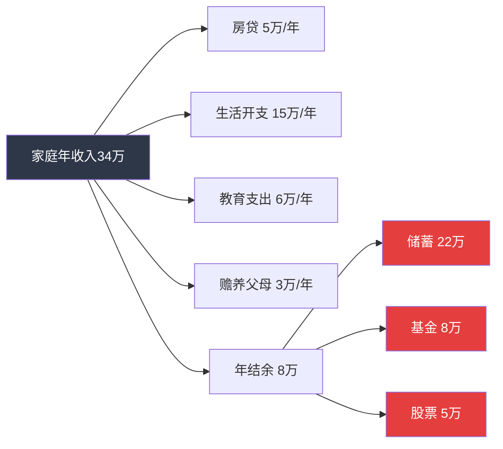
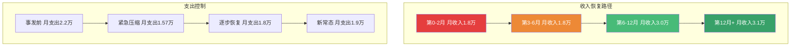
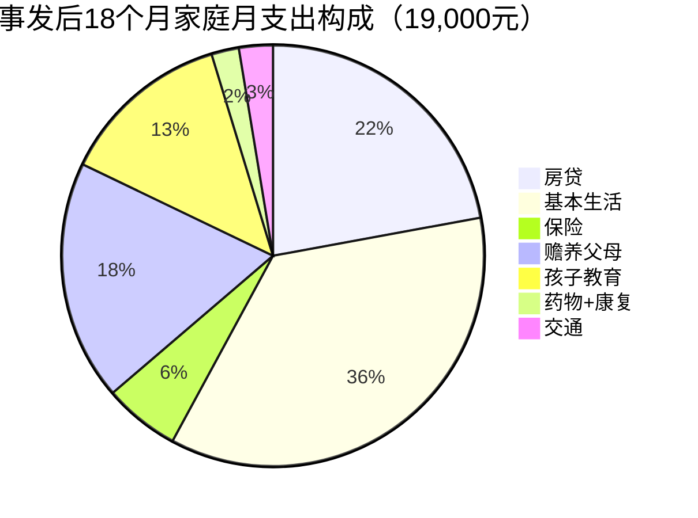
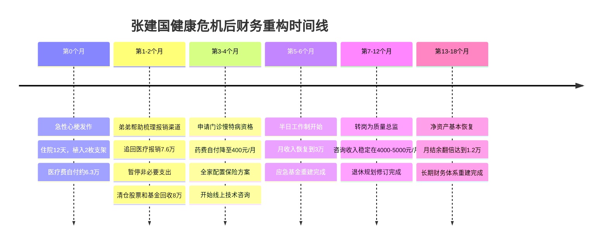

## 案例六：健康危机后的财务重构

### 引言：当健康敲响警钟

40-50岁是健康的"分水岭期"。根据《中国心血管健康与疾病报告2023》，40岁以上人群高血压患病率已达37.2%，糖尿病患病率达13.9%。一次重大疾病——无论是心梗、脑卒中还是恶性肿瘤——不仅威胁生命，更能在数月内将一个中产家庭推入财务深渊。

本案例讲述的是张建国（化名），47岁，某二线城市制造企业中层管理者，年薪28万。他在2024年初突发急性心梗，经历了一场与死神的搏斗后，用18个月时间完成了从"财务崩溃边缘"到"重建稳固防线"的全过程。他的经历，是千万中国中年职场人的一面镜子。

---

### 案例背景：一个普通中产家庭的起点

#### 个人与家庭画像

| 维度 | 详情 |
|------|------|
| 年龄 | 47岁（事发时） |
| 职业 | 某制造企业生产部经理，工作15年 |
| 年薪 | 28万（税前），含绩效奖金约4万 |
| 配偶 | 45岁，小学教师，年薪12万 |
| 子女 | 1个孩子，高二，计划两年后高考 |
| 住房 | 自住房一套（市值约180万，贷款余额45万） |
| 车辆 | 一辆家用轿车，无贷款 |
| 父母 | 双方父母均在世，70岁左右，农村无退休金 |

#### 事发前的财务状况

张建国的家庭在事发前属于"看起来还不错"的中产家庭：

- **家庭年收入**：约40万（税后约34万）
- **家庭年支出**：约26万（房贷月供4200元、孩子教育支出约6万/年、生活开支约15万/年、赡养父母约3万/年）
- **年结余**：约8万
- **储蓄总额**：活期+定期约22万
- **投资**：基金约8万，股票约5万（被套状态）
- **保险**：仅有社保，无商业保险
- **负债**：房贷余额45万

**关键问题：这个家庭没有任何重疾保障，储蓄仅够支撑8个月基本生活。**

---

### 第一阶段：危机爆发（第0-2个月）

#### 发病经过

2024年1月15日，张建国在加班时突发剧烈胸痛，被同事紧急送往市人民医院急诊。冠脉造影显示前降支近段95%狭窄，诊断为**急性ST段抬高型心肌梗死（STEMI）**，紧急植入2枚药物涂层支架。

住院12天后出院，但后续需要长期药物治疗和康复。

#### 账单冲击

| 费用项目 | 金额（元） | 医保报销 | 自付金额 |
|----------|-----------|----------|----------|
| 急诊手术（支架2枚+球囊） | 86,000 | 51,600 | 34,400 |
| ICU住院5天 | 32,000 | 19,200 | 12,800 |
| 普通病房7天 | 8,500 | 5,950 | 2,550 |
| 进口抗凝药物（院内） | 6,200 | 0 | 6,200 |
| 各种检查费 | 11,300 | 7,910 | 3,390 |
| **住院小计** | **144,000** | **84,660** | **59,440** |

出院后第一个月复查和药物费用约3800元/月（进口抗凝药+他汀+降压药），其中医保报销后自付约1500元/月。

**直接财务冲击：自付医疗费约6.3万，占家庭储蓄的28.6%。**

#### 收入断崖

更致命的是收入中断：

- 张建国住院及休养期间无法工作，前2个月工资按病假发放，仅为基本工资的60%，约8000元/月（正常月收入约2.3万）
- 绩效奖金因出勤不达标被扣减
- 妻子请了3周假照顾，扣除部分绩效

**两个月内，家庭收入下降约60%，而支出因医疗费反而增加。**

#### 心理冲击与决策困境

张建国回忆那段日子：

> "躺在病床上，脑子里全是数字——房贷还有多少、孩子马上要高考、父母身体也不好……第一次真正体会到什么叫'一病回到解放前'。最怕的不是死，是拖累全家。"

这种心理压力导致了两个危险倾向：
1. **过度节俭**：出院后拒绝必要的复查和康复训练，想省钱
2. **急于赚钱**：身体未恢复就想回去上班，甚至考虑带病加班

---

### 第二阶段：紧急止损（第2-4个月）

张建国的弟弟是某保险公司理赔部门员工，在得知哥哥的情况后，帮助他进行了一次全面的财务"急救"。

#### 止损措施一：暂停一切非必要支出

在弟弟的帮助下，张建国夫妇列出了完整的支出清单，将其分为三级：

| 级别 | 类别 | 处理方式 | 月节省金额 |
|------|------|----------|-----------|
| 🔴 必须保留 | 房贷、基本生活费、必要药物、孩子学费 | 维持不变 | 0 |
| 🟡 可压缩 | 餐饮（减少外出）、交通（停用私家车）、通讯套餐降级 | 削减50% | 约2,800 |
| 🟢 暂停 | 旅游基金、人情往来、衣物购置、娱乐订阅 | 全部暂停 | 约3,500 |

**月支出从2.2万压缩到1.57万，月节省6,300元。**

#### 止损措施二：申请医疗费用二次报销

张建国弟弟帮他梳理了以下渠道：

1. **单位补充医疗保险**：张建国所在企业有补充医疗险，住院费用自付部分可再报销60%，追回约3.6万
2. **工会大病补助**：企业工会发放一次性大病慰问金2万元
3. **工会互助基金**：当地总工会的职工互助保障计划赔付1.5万
4. **民政临时救助**：因自付金额较大，申请到民政临时救助金5000元

**共追回约7.6万，基本覆盖了自付医疗费用。**

> **关键认知**：很多人不知道企业补充医疗、工会互助、民政救助这些渠道。大病发生后，第一时间应该梳理所有可报销渠道，而不是只盯着基本医保。

#### 止损措施三：投资止损

张建国的基金和股票账户合计约13万，其中股票亏损约2.3万。弟弟的建议是：

- **股票**：全部清仓，回收约5万现金（原投入约7.3万，亏损约2.3万）
- **基金**：保留货币基金约3万，赎回其余约5万偏股型基金（亏损约1.2万）

**共回收约8万现金，亏损约3.5万。**

> 虽然"割肉"痛苦，但在收入中断、没有任何保障的情况下，持有波动性资产是危险的。这笔钱成为后续重建的"种子资金"。

---

### 第三阶段：收入重建（第3-8个月）

#### 工作能力评估

出院3个月后，张建国进行了全面复查。医生的评估：

- 心功能恢复良好，EF值（射血分数）从发病时的42%恢复到55%
- **但明确告知**：不建议高强度体力劳动和长期加班，需要规律作息
- 建议至少再休养3个月，之后可以尝试轻度工作

这意味着张建国**至少6个月无法恢复全职工作**。

#### 收入替代方案

张建国夫妇经过反复讨论，制定了分阶段的收入恢复计划：

**第3-6个月（休养期）**：
- 张建国病假工资约8000元/月（基本工资60%）
- 妻子正常工资约10000元/月
- 家庭月收入约18000元，月支出约15700元，勉强平衡

**第6-12个月（半复工期）**：
- 张建国与公司协商，转为"半日工作制"，负责技术指导和质量管理，不再一线值班
- 月薪调整为原来的70%，约16000元/月
- 张建国利用下午时间在网上做制造业技术咨询，在某平台上接单
- 咨询收入从第一个月的1200元逐步增长到第6个月的4500元/月
- 家庭月收入恢复到约30000元

**第12个月以后（稳定恢复期）**：
- 半日工作制月薪16000元
- 咨询收入稳定在4000-5000元/月
- 妻子工资10000元/月
- 家庭月收入约30000-31000元

#### 职业路径调整

这次疾病成为张建国职业的转折点。他主动向公司提出从生产管理岗转向质量管理岗：

| 对比项 | 原岗位（生产经理） | 新岗位（质量总监） |
|--------|-------------------|-------------------|
| 工作强度 | 高，经常加班和夜班巡查 | 中，以审核和标准制定为主 |
| 压力来源 | 产线故障、交期压力 | 体系审核、客户投诉 |
| 身体要求 | 需要频繁走动和现场处理 | 以办公和会议室为主 |
| 薪资 | 28万/年 | 26万/年（略降，但更可持续） |
| 职业寿命 | 随年龄下降 | 经验越丰富越值钱 |

> 年薪虽然降了2万，但工作对身体的损耗大幅降低，且质量岗位的职业天花板反而更高。从长期看，这是一笔划算的"交易"。

---

### 第四阶段：保障体系重建（第4-8个月）

这是整个财务重构中最关键的一步。张建国弟弟反复强调：**"哥，你这次运气好，下次呢？"**

#### 医疗险配置

由于已有心梗病史，张建国在商业保险上面临极大限制。弟弟帮他做了如下安排：

**张建国本人（已有既往症）**：

| 险种 | 产品类型 | 年保费 | 保障内容 | 备注 |
|------|---------|--------|----------|------|
| 惠民保 | 城市定制型 | 99元/年 | 住院医疗200万（2万免赔） | 不限既往症 |
| 税优健康险 | 政策性保险 | 2400元/年 | 住院医疗20万（0免赔） | 可带病投保 |
| 防癌医疗险 | 癌症专项 | 680元/年 | 癌症医疗200万 | 心梗不影响投保 |

**妻子和孩子（健康体）**：

| 人员 | 险种 | 产品类型 | 年保费 | 保障内容 |
|------|------|---------|--------|----------|
| 妻子 | 百万医疗险 | 商业医疗险 | 1,200元/年 | 住院医疗400万（1万免赔） |
| 妻子 | 重疾险 | 商业重疾险 | 4,800元/年 | 重疾赔付30万 |
| 妻子 | 定期寿险 | 商业寿险 | 1,100元/年 | 身故赔付50万（保至60岁） |
| 孩子 | 百万医疗险 | 商业医疗险 | 600元/年 | 住院医疗400万 |
| 孩子 | 重疾险 | 商业重疾险 | 2,400元/年 | 重疾赔付30万 |

**全家保险年支出：约13,279元，月均约1,107元。**

> **关键提醒**：心梗后并非完全买不了保险。惠民保、税优健康险、防癌医疗险这三类产品对既往症人群友好，一定要配置上。

#### 应急基金重建

目标：建立能覆盖6个月支出的应急基金。

- 目标金额：1.9万×6 = 11.4万
- 当时可用资金：清仓回收的8万 + 追回的医疗费剩余约4万 = 12万
- 配置方式：5万存银行大额存单（年化2.5%），5万存货币基金（随时可取），2万存活期

**6个月内完成了应急基金重建。**

#### 社保权益最大化

张建国的弟弟还帮他梳理了社保中的隐性权益：

1. **长期病假工资保障**：根据《企业职工患病或非因工负伤医疗期规定》，工作15年可享受18个月医疗期内的病假工资
2. **工伤认定**：虽然心梗通常不认定为工伤，但如果能证明发病与工作强度有因果关系（如长期超时加班），可以尝试申请
3. **残疾人保障**：如果心功能持续低于一定水平，可以申请残疾评定，享受相关税收优惠和补贴
4. **门诊慢特病**：申请高血压和冠心病的门诊慢特病资格，门诊药物报销比例可从50%提升到80%以上

张建国成功申请了门诊慢特病资格，**每月药物自付从1500元降至约400元**。

---

### 第五阶段：长期财务规划调整（第8-18个月）

#### 退休规划修订

心梗事件迫使张建国重新审视退休规划：

| 项目 | 原规划 | 修订后 |
|------|--------|--------|
| 退休年龄 | 60岁（法定） | 55岁（提前退休） |
| 退休后月支出 | 1.2万 | 1.0万（降低预期） |
| 退休金缺口 | 假设社保+企业年金覆盖80% | 需自行补充约4000元/月 |
| 需准备退休金总额 | 约50万 | 约80万（含医疗储备） |

**核心变化**：由于身体原因，张建国将退休年龄从60岁提前到55岁。这意味着：
- 工作年限缩短8年，收入积累期变短
- 社保缴费年限可能不足，养老金会降低
- 需要更多自有储备来弥补缺口

#### 子女教育金调整

孩子两年后高考，原计划准备50万教育金（含留学可能）。调整后：
- 放弃留学计划，改为国内大学
- 教育金目标下调至15万（4年学费+生活费）
- 当前已有约6万教育储蓄，还需积累9万

#### 赡养父母方案

双方父母年近70，农村无退休金，仅靠每月200元左右的城乡居民养老金。张建国夫妇制定了赡养方案：

| 项目 | 张建国父母 | 妻子父母 | 合计 |
|------|-----------|----------|------|
| 每月生活费 | 2,000元 | 1,500元 | 3,500元 |
| 医疗储备金 | 3,000元/年 | 2,000元/年 | 5,000元/年 |
| 应急基金 | 20,000元 | 15,000元 | 35,000元 |

**关键措施**：为四位老人购买了当地惠民保和意外险（老人可投保），年保费合计约3000元。

---

### 成果数据：18个月后的财务全景

| 指标 | 事发前 | 事发后18个月 | 变化 |
|------|--------|-------------|------|
| 家庭月收入 | 28,000元 | 31,000元 | +10.7% |
| 家庭月支出 | 22,000元 | 19,000元 | -13.6% |
| 月结余 | 6,000元 | 12,000元 | +100% |
| 应急基金 | 22万（含投资） | 11.4万（纯现金） | 安全性大幅提升 |
| 商业保险 | 0 | 全家覆盖 | 从无到有 |
| 社保优化 | 仅基本医保 | 门诊慢特病+补充医疗 | 保障升级 |
| 投资配置 | 股票+基金（高风险） | 大额存单+货币基金（低风险） | 风险大幅降低 |
| 负债 | 房贷45万 | 房贷38万 | 持续偿还中 |
| 净资产 | 约95万 | 约92万 | 基本持平（扣除医疗支出） |

---

### 深度复盘：从这次危机中学到的七个教训

#### 教训一：社保是底线，但远远不够

张建国的医疗总费用约14.4万，医保报销了约8.4万（报销比例58%）。这意味着**42%的费用需要自付**。而且进口药物、特殊材料（药物涂层支架）很多不在报销范围内。

**行动建议**：不要以为有社保就万事大吉。40岁以上人群，至少要配置一份惠民保（99-199元/年）作为社保的补充。

#### 教训二：应急基金不是"有了就行"，要"够用才行"

22万看似不少，但如果张建国没有弟弟帮忙追回7.6万医疗报销，加上投资亏损3.5万，实际可用资金只有10.9万，只够撑5个月。

**行动建议**：应急基金 = 6个月×家庭总支出（不是基本支出）。放在货币基金或短期存款中，不要投入任何有波动的资产。

#### 教训三：保险要在健康时买，病了就来不及了

张建国最大的遗憾是没有在健康时购买重疾险和百万医疗险。发病后，几乎所有重疾险和百万医疗险都拒保。

**行动建议**：40岁以上、身体尚健康的人，**立即**配置以下保险：

| 优先级 | 险种 | 年预算参考 | 核心作用 |
|--------|------|-----------|----------|
| P0 | 百万医疗险 | 800-1500元 | 住院费用报销，杠杆最高 |
| P1 | 重疾险 | 3000-6000元 | 确诊即赔，弥补收入损失 |
| P2 | 定期寿险 | 800-1500元 | 身故保障，保护家人 |
| P3 | 意外险 | 200-400元 | 意外伤残和医疗 |

#### 教训四：中年人的职业安全边际比薪资更重要

张建国原来年薪28万，但岗位要求高强度、长时间工作，这直接导致了心梗。转岗后年薪26万，但工作强度降低60%，身体恢复良好，还发展了副业。

**行动建议**：40岁以后，评估一份工作不能只看薪资。把"对身体的损耗"和"突发疾病时的收入中断风险"纳入考量。一份年薪少2万但可以持续到60岁的工作，远比一份年薪多5万但随时可能猝死的工作更有价值。

#### 教训五：大病后要主动争取所有可报销渠道

张建国追回的7.6万几乎覆盖了全部自付费用，但他一开始完全不知道有这些渠道。

**完整报销渠道清单**：

| 渠道 | 适用条件 | 金额参考 |
|------|---------|----------|
| 基本医保 | 所有参保人 | 费用的50-70% |
| 大额医疗补助 | 超过封顶线的部分 | 按比例二次报销 |
| 企业补充医疗 | 有此福利的企业 | 自付部分的50-80% |
| 工会大病补助 | 企业工会会员 | 5000-30000元 |
| 职工互助保障 | 参加互助计划的职工 | 按病种赔付 |
| 民政临时救助 | 自付金额较大的困难家庭 | 3000-10000元 |
| 慈善基金 | 特定病种（如先心病、白血病等） | 视情况而定 |
| 个人所得税 | 大病医疗专项扣除 | 超1.5万部分最高扣8万 |

#### 教训六：门慢/门特资格一定要申请

张建国申请门诊慢特病资格后，每月药物自付从1500元降至400元，**每年节省13,200元**。

**申请流程**：
1. 携带出院小结、诊断证明、病历到医保经办机构
2. 填写《门诊慢特病申请表》
3. 由指定医院专科医生签字确认
4. 审批通过后，门诊购药享受住院报销比例

常见可申请门慢/门特的病种：高血压、糖尿病、冠心病、慢性肾病、恶性肿瘤放化疗等。**很多符合条件的人从未申请过，白白多花了数万元药费。**

#### 教训七：中年人必须有"Plan B"收入

张建国的咨询副业在关键时刻提供了每月4000-5000元的额外收入，缓解了收入压力。更重要的是，这让他在公司谈半日工作制时有了底气——"即使收入减少，我也不会陷入困境"。

**行动建议**：在健康时就开始培养第二收入来源。40岁以上最有价值的副业方向：

- **经验变现**：行业咨询、培训讲师、技术顾问
- **知识输出**：写行业文章、录制课程、做行业自媒体
- **资源对接**：利用行业人脉做中间人或经纪人

---

### 张建国的财务重构时间线

---

### 实操工具：大病后的财务自查清单

如果你或家人正经历类似的健康危机，按以下清单逐项排查：

#### 第一周：紧急止损

- [ ] 列出所有医疗费用明细（区分医保内和医保外）
- [ ] 确认医保报销金额和自付金额
- [ ] 查看是否有企业补充医疗保险
- [ ] 联系工会了解大病补助政策
- [ ] 暂停所有非必要支出
- [ ] 清点所有流动资金（存款、基金、股票）

#### 第一个月：报销最大化

- [ ] 申请工会大病互助基金
- [ ] 申请民政临时救助（自付超过一定金额可申请）
- [ ] 查找是否有对口的慈善基金（特定病种）
- [ ] 确认个人所得税大病医疗专项扣除（年度汇算时扣除）
- [ ] 如属工伤范畴，启动工伤认定程序

#### 第二个月：保障重建

- [ ] 为患者配置：惠民保 + 税优健康险 + 防癌医疗险
- [ ] 为健康家人配置：百万医疗险 + 重疾险 + 定期寿险
- [ ] 为老人配置：惠民保 + 意外险
- [ ] 申请门诊慢特病/门诊特殊疾病资格
- [ ] 重新评估社保缴费基数（是否需要调高）

#### 第三个月：收入与规划

- [ ] 与雇主协商灵活工作安排（半日制、远程、调岗）
- [ ] 评估是否需要发展副业收入
- [ ] 修订退休规划（退休年龄、退休金目标）
- [ ] 修订子女教育规划（是否需要降低预期）
- [ ] 制定赡养父母的长期方案
- [ ] 建立6个月应急基金

#### 持续进行：定期复查

- [ ] 每3个月复查一次（心梗患者）
- [ ] 每年更新一次保险方案
- [ ] 每半年审视一次财务状况
- [ ] 每年调整一次长期规划

---

### 常见误区与纠正

| 误区 | 真相 | 后果 |
|------|------|------|
| "有社保就够了" | 社保报销比例通常只有50-70%，进口药和特殊材料多不报销 | 大病自付可达数万到数十万 |
| "保险是骗人的" | 是因为没有买对险种或不了解条款 | 裸奔状态下一次大病可以摧毁整个家庭 |
| "大病后不能买保险了" | 惠民保、税优健康险、防癌险可带病投保 | 错过最后的保障窗口 |
| "省钱比赚钱重要" | 开源和节流同样重要，过度节俭影响康复 | 身体恢复慢，反而花更多医疗费 |
| "先扛着，过几年就好了" | 慢性病管理是终身的，不管理只会越来越贵 | 并发症治疗费用是基础治疗的5-10倍 |
| "投资亏了就不卖" | 在收入中断时，流动性比收益率重要100倍 | 等需要用钱时可能亏更多 |
| "退休还早，不用考虑" | 大病后工作年限可能大幅缩短 | 退休准备时间被压缩，缺口更大 |

---

### 本案例的核心公式

健康危机后的财务重构可以概括为一个公式：

> **财务安全 = （应急资金 + 保险保障 + 收入多元化 + 支出可控） ÷ 负债水平**

当分子越大、分母越小时，家庭抵御健康风险的能力就越强。张建国用18个月将这个比值从"危险"提升到了"安全"，这不是运气，而是系统性的行动。

---

### 结语

张建国的故事没有戏剧性的逆袭——没有一夜暴富、没有投资翻盘、没有贵人相助带来天降横财。他的"成功"在于：**面对危机没有慌乱止损，没有过度乐观忽略风险，而是一步一步、扎扎实实地重建了整个家庭的财务防线。**

这才是40-50岁稳健期最重要的能力：不是赚更多钱，而是守住已有的，并在风暴来临时有能力重建。

> "这次心梗，花钱买了一个教训。但这个教训告诉我，财务安全不是有多少钱，而是不管发生什么，这个家都不会垮。" ——张建国
