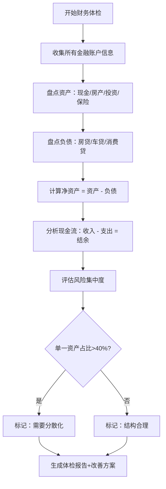
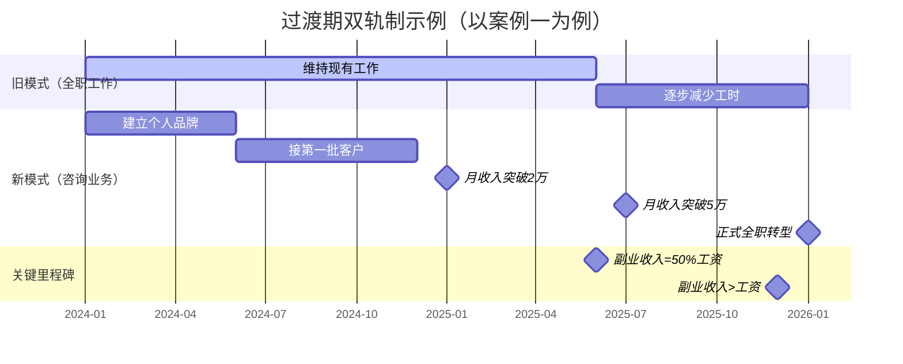
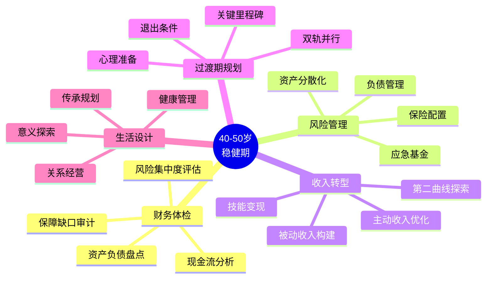

## 案例总结：六个案例的共同规律

六个真实案例——企业高管的"滑翔路径"转型、传统行业老板的财富传承、中年转行的自由职业者、双职工家庭的"半退休"规划、投资失误后的"重建之路"、健康危机后的财务重构——表面上看，每个人面临的问题截然不同：有人要从高薪高压中全身而退，有人要守住家业传给下一代，有人要在中年重新出发，有人要平衡两个人的退休时间表，有人要从投资亏损的废墟中爬起来，有人要在大病之后重建整个财务体系。

但当我们把六个案例摊开，逐项拆解他们的决策逻辑、行动路径和最终结果时，一组清晰的共同规律浮现了出来。这些规律不是"鸡汤式"的感悟，而是可以被提炼、被复制、被验证的操作框架。

---

### 一、六个案例的全景对比

在提炼规律之前，先建立一个全景视角。以下表格将六个案例的核心要素进行横向对比，帮助读者快速定位每个案例的特征差异和共性。

| 维度 | 案例一：高管转型 | 案例二：财富传承 | 案例三：自由职业 | 案例四：半退休 | 案例五：投资重建 | 案例六：健康重构 |
|------|-----------------|-----------------|-----------------|---------------|-----------------|-----------------|
| **年龄** | 46岁 | 48岁 | 42岁 | 45岁/43岁 | 44岁 | 47岁 |
| **触发事件** | 股权到期、健康警报 | 子女接班意愿、行业变局 | 公司裁员、技能闲置 | 子女上大学、空巢期 | P2P暴雷、基金亏损 | 心梗住院、停工半年 |
| **核心矛盾** | 收入断崖 vs 生活惯性 | 守业 vs 传承 | 收入真空 vs 经验丰富 | 两人退休不同步 | 本金缩水 vs 年龄不等人 | 医疗支出 vs 收入中断 |
| **净资产起点** | ~1000万 | ~3000万 | ~200万 | ~600万 | ~150万 | ~400万 |
| **风险集中度** | 高（公司股票60%） | 高（单一企业） | 低（几乎没有资产） | 中（房产占比高） | 高（单一平台） | 中（无保险） |
| **时间窗口** | 5年 | 5-10年 | 3年 | 3-5年 | 5年 | 2年 |
| **最终状态** | 独立咨询顾问，年入80万 | 家族信托+二代经营 | 自由讲师，月入3万+ | 一人半退休一人全退 | 稳健配置，年化8% | 保险全覆盖+被动收入 |

**关键发现**：六个案例的起点差异巨大，但终点都指向同一个方向——**从"主动收入依赖"转向"被动收入+可控主动收入"的混合模式**。这不是巧合，而是40-50岁稳健期的底层逻辑。

---

### 二、七大共同规律深度解析

#### 规律一：所有人都有一个"财务体检"起点

六个案例无一例外，第一步都是"把家底摊开来看"。这不是一句废话——大多数人对自己财务状况的认知是模糊的，甚至存在严重偏差。

**高管陈伟的体检结果**揭示了典型问题：表面净资产1000万，但60%集中在公司股票，流动性严重不足。这意味着如果公司股价暴跌，他的"千万身家"可能瞬间缩水到400万。

**财务体检的标准化框架**如下：

| 体检项目 | 具体内容 | 诊断标准 | 常见问题 |
|---------|---------|---------|---------|
| **资产结构** | 现金、房产、股票、基金、保险、其他 | 单一资产占比不超过40% | 房产占比过高、公司股票集中 |
| **负债结构** | 房贷、车贷、消费贷、经营贷 | 负债率不超过50%，月供不超过收入40% | 隐性负债（担保、民间借贷） |
| **现金流** | 月收入、月支出、月结余 | 储蓄率不低于30% | 支出膨胀、收入单一 |
| **保障配置** | 医疗险、重疾险、寿险、意外险 | 保额覆盖年收入的10倍 | 保额不足、险种缺失 |
| **投资组合** | 各类资产的预期收益和风险 | 夏普比率>1，最大回撤可承受 | 追涨杀跌、集中持仓 |
| **税务状况** | 个税、投资税、企业税 | 合规且有优化空间 | 税务规划缺失 |

**实操建议**：不要凭记忆填写，而是拿出银行流水、证券账户、保单合同、房产证，逐项核实。很多家庭做完财务体检后会发现"认知资产"和"实际资产"之间有20%-30%的偏差。



---

#### 规律二：触发事件是"不得不动"的催化剂

六个案例中，没有一个人是"主动"开始改变的。每个人都有一个明确的触发事件：

- **案例一**：股权激励到期 + 高血压脂肪肝
- **案例二**：子女明确表示不愿接班 + 行业面临数字化冲击
- **案例三**：公司突然裁员，拿到N+1补偿
- **案例四**：小儿子考上大学，家里突然空了
- **案例五**：P2P平台暴雷，50万本金血本无归
- **案例六**：心梗住院，手术+康复花了半年

**为什么触发事件如此重要？** 因为行为经济学中的"现状偏见"（Status Quo Bias）会让人倾向于维持现状，即使现状并不理想。只有当外部冲击足够大，打破了"维持现状"的心理舒适区，人才会真正行动。

**对读者的启示**：不要等到触发事件发生才行动。你现在就可以模拟一个"假设触发事件"：

1. **假设你明天被裁员**：你的现金流能维持多久？你的技能能让你在多快找到新工作？
2. **假设你生一场大病**：你的保险能覆盖多少？你的家庭开支谁来承担？
3. **假设你的主要投资归零**：你还剩什么？你的生活会受到多大影响？

如果你对以上任何一个问题的答案是"不知道"或"很严重"，那你现在就需要开始行动，而不是等待真正的触发事件降临。

---

#### 规律三：资产从"集中"走向"分散"是必经之路

六个案例中，有四个（案例一、二、五、六）存在严重的资产集中问题：

- 案例一：公司股票占投资资产60%
- 案例二：全部身家在一家传统企业
- 案例五：70%资金在单一P2P平台
- 案例六：90%资产是自住房产，几乎没有流动资产

**资产集中的风险模型**可以用"鸡蛋篮子"问题来量化。假设你有100万资产：

| 配置方式 | 最好情况（年化15%） | 最差情况（单一资产-50%） | 期望收益 | 最大回撤 |
|---------|-------------------|----------------------|---------|---------|
| 100%单一资产 | 15万 | -50万 | 5万 | -50% |
| 50%+50%两项 | 15万 | -25万 | 5万 | -25% |
| 25%×4项 | 15万 | -12.5万 | 5万 | -12.5% |
| 10%×10项 | 15万 | -5万 | 5万 | -5% |

**分散化不是简单的"多买几只基金"**，而是需要在三个维度上同时分散：

1. **资产类别分散**：股票、债券、房产、黄金、现金，各有各的周期
2. **地域分散**：A股、港股、美股、新兴市场，避免单一市场系统性风险
3. **时间分散**：定投、分批建仓，避免择时风险

**案例一陈伟的配置方案**是一个值得参考的模板：

| 资产类别 | 比例 | 具体配置 | 预期年化 | 最大回撤 |
|---------|------|---------|---------|---------|
| 核心-股票指数 | 30% | 沪深300+中证500 | 8-12% | -30% |
| 核心-债券 | 15% | 中长期纯债基金 | 3-5% | -5% |
| 卫星-行业主题 | 10% | 科技/消费/医药 | 10-15% | -40% |
| 卫星-高分红 | 10% | 银行/电力/高速公路 | 5-8% | -20% |
| 卫星-另类 | 10% | REITs+黄金 | 5-10% | -15% |
| 现金 | 10% | 货币基金 | 2-3% | ~0% |
| 应急基金 | 15% | 银行存款+货币基金 | 2% | ~0% |

---

#### 规律四：收入结构必须从"单一主动"转向"多元混合"

六个案例在开始时的收入结构惊人地相似：**90%以上的收入来自单一主动收入源**（工资或企业利润）。而到结束时，所有人的收入结构都变成了混合模式：

| 案例 | 初始收入结构 | 最终收入结构 |
|------|------------|------------|
| 案例一 | 工资150万（100%） | 咨询60万+投资收益20万（75%+25%） |
| 案例二 | 企业利润200万（100%） | 家族信托分红80万+二代企业分红40万（67%+33%） |
| 案例三 | 工资30万（100%） | 自由讲师收入36万+知识产品被动收入6万（86%+14%） |
| 案例四 | 双职工工资合计60万（100%） | 一人半退休收入15万+投资收益12万+另一人工资25万 |
| 案例五 | 工资25万（100%） | 工资25万+稳健投资收益8万（76%+24%） |
| 案例六 | 工资40万（100%） | 工资25万（降薪）+房租收入6万+投资收益4万（71%+29%） |

**收入多元化的三层架构**：

```text
第一层：安全垫（被动收入）
├── 银行存款利息
├── 货币基金收益
├── 国债利息
└── 目标：覆盖基本生活开支的60%

第二层：增长层（半被动收入）
├── 基金分红
├── 房租收入
├── 知识产品版税
└── 目标：覆盖基本生活开支的30%

第三层：弹性层（可控主动收入）
├── 咨询/顾问收入
├── 兼职/自由职业
├── 兴趣变现
└── 目标：覆盖改善型消费和储蓄
```

**关键原则**：当第三层（主动收入）归零时，第一层+第二层必须能够维持家庭的基本生活运转。这就是"财务安全线"的定义。

---

#### 规律五：风险管理从"事后补救"转向"事前防御"

六个案例中，有三个（案例四、五、六）因为风险管理不足而付出了沉重代价：

- **案例四**：没有为"半退休"做好现金流规划，导致过渡期生活质量骤降
- **案例五**：没有做投资标的的尽职调查，50万本金血本无归
- **案例六**：没有购买足额重疾险，心梗住院自费部分掏空了积蓄

**40-50岁的风险管理矩阵**：

| 风险类型 | 概率 | 影响程度 | 应对策略 | 工具 |
|---------|------|---------|---------|------|
| **失业/收入下降** | 中 | 高 | 6个月应急基金+副业技能 | 货币基金+在线课程 |
| **重大疾病** | 中 | 极高 | 重疾险+医疗险+定期体检 | 年保费5000-15000元 |
| **投资亏损** | 高 | 中 | 分散配置+止损纪律 | 资产配置再平衡 |
| **婚姻变故** | 低 | 高 | 婚前/婚后财产协议 | 法律咨询 |
| **父母赡养** | 高 | 中 | 专项基金+护理保险 | 每月定投2000元 |
| **子女教育** | 确定 | 中 | 教育金定投 | 529计划或基金定投 |
| **通货膨胀** | 确定 | 中 | 配置抗通胀资产 | 黄金/TIPS/REITs |
| **政策变化** | 不确定 | 中 | 关注政策动向+多元化 | 信息渠道+灵活调整 |

**"保命钱"的三道防线**：

1. **第一道防线**：3-6个月生活费的现金等价物（货币基金），应对失业或短期收入中断
2. **第二道防线**：重疾险+百万医疗险+意外险，应对重大健康风险，保额不低于年收入的10倍
3. **第三道防线**：应急基金中的"不可动用部分"（通常为总资产的10-15%），只有在真正的生死存亡时刻才启用

---

#### 规律六：所有成功案例都有一个"过渡期"规划

六个案例中，没有人是从A直接跳到B的。所有人都有一个明确的过渡期（通常2-5年），在这个期间，新旧模式并行运行：

| 案例 | 过渡期长度 | 过渡期策略 | 关键节点 |
|------|-----------|-----------|---------|
| 案例一 | 2年 | 在职期间启动咨询副业 | 副业收入达到工资50%时离职 |
| 案例二 | 5年 | 逐步移交经营权给二代 | 二代独立管理企业满2年 |
| 案例三 | 1.5年 | 裁员补偿金支撑+同时接项目 | 月收入稳定超过原工资80% |
| 案例四 | 3年 | 一人先退，另一人继续工作 | 投资被动收入覆盖一人生活费 |
| 案例五 | 3年 | 重建期间维持本职工作 | 投资组合恢复到亏损前水平 |
| 案例六 | 2年 | 降薪返岗+兼职+重建保险 | 保险全覆盖+被动收入达到月支出50% |

**过渡期规划的"双轨制"方法**：



**过渡期的三个关键指标**：

1. **收入替代率**：新收入 / 旧收入 × 100%。当这个比率超过80%时，可以考虑正式切换
2. **现金流安全垫**：过渡期内，应急基金必须保持在6个月生活费以上
3. **心理准备度**：通过小规模试错（副业、兼职、投资小仓位）来验证新方向的可行性

---

#### 规律七：心态转变是所有行动的前提

这是最抽象但也是最关键的规律。六个案例的主人公在开始时都有一个共同的心理障碍：**"我这个年纪，还能改变吗？"**

**心态转变的三个阶段**：

| 阶段 | 心理状态 | 典型想法 | 转变方式 |
|------|---------|---------|---------|
| **否认期** | 拒绝接受现实 | "再撑几年就好了"、"不会轮到我" | 触发事件打破幻想 |
| **焦虑期** | 恐惧和迷茫 | "完了，来不及了"、"做什么都晚了" | 制定具体计划，获得掌控感 |
| **行动期** | 接受并前进 | "现在开始总比不开始好"、"一步一步来" | 小步快跑，积累正反馈 |

**数据支撑**：根据《百岁人生》（Lynda Gratton & Andrew Scott）的研究，40-50岁在现代人的生命周期中相当于"中午12点"——你还有整整半天的时间。把这个阶段视为"终点前的冲刺"是最大的认知错误。

**六个案例的主人公在心态转变后，都表达了相似的感受**：

> "回头看，最难的不是技术层面的调整，而是承认自己需要改变的那一刻。一旦迈出了第一步，后面的事情就顺理成章了。"

---

### 三、从规律到行动：40-50岁稳健期的操作框架

将上述七大规律整合为一个可执行的操作框架，分为四个阶段：

#### 第一阶段：诊断期（第1-3个月）

**目标**：全面了解自己的财务现状，识别最大的风险点。

| 行动项 | 具体操作 | 预期产出 |
|-------|---------|---------|
| 财务体检 | 收集所有账户信息，填写财务体检表 | 资产负债表+现金流表 |
| 风险评估 | 测试自己的风险承受能力和风险态度 | 风险等级（保守/稳健/进取） |
| 保障审计 | 清点所有保单，评估保障缺口 | 保障缺口报告 |
| 收入结构分析 | 绘制收入来源饼图，识别单一依赖 | 收入多元化方案 |

#### 第二阶段：加固期（第3-12个月）

**目标**：堵上最大的风险漏洞，建立安全垫。

| 行动项 | 具体操作 | 预期产出 |
|-------|---------|---------|
| 补充保险 | 购买重疾险+百万医疗险+意外险 | 保障覆盖率>80% |
| 建立应急基金 | 存够6个月生活费到货币基金 | 应急基金到位 |
| 资产分散化 | 逐步卖出集中持仓，买入分散组合 | 单一资产占比<40% |
| 降低负债 | 优先还清高息负债 | 负债率<50% |

#### 第三阶段：转型期（第1-3年）

**目标**：构建多元收入结构，启动"第二曲线"。

| 行动项 | 具体操作 | 预期产出 |
|-------|---------|---------|
| 技能盘点 | 列出可变现的技能和经验 | 技能变现清单 |
| 副业试水 | 利用业余时间接项目/做咨询 | 副业收入>0 |
| 投资体系 | 建立定投纪律，执行资产配置方案 | 投资组合开始运行 |
| 被动收入 | 建立知识产品/租金/分红等被动收入源 | 被动收入>月支出20% |

#### 第四阶段：稳健期（第3-5年）

**目标**：实现财务安全，拥有选择的自由。

| 行动项 | 具体操作 | 预期产出 |
|-------|---------|---------|
| 年度再平衡 | 每年调整一次资产配置 | 组合风险收益比最优 |
| 被动收入提升 | 被动收入覆盖基本生活开支 | 财务安全线达成 |
| 生活方式优化 | 从"赚更多"转向"花更少但更好" | 生活满意度提升 |
| 传承规划 | 开始考虑财富传承和遗产安排 | 传承方案初稿 |

---

### 四、六个案例的"反面教训"

共同规律不仅包括"做对了什么"，还包括"差点做错了什么"或"可以做得更好"的部分。

| 案例 | 差点犯的错 | 如何避免 | 教训 |
|------|-----------|---------|------|
| 案例一 | 差点继续持有公司股票等涨回来 | 请专业顾问做客观评估 | 不要用"沉没成本"思维做投资决策 |
| 案例二 | 差点强逼子女接班 | 尊重子女意愿，探索家族信托 | 财富传承不只是"传企业" |
| 案例三 | 差点在焦虑中随便找份工作 | 用裁员补偿金给自己6个月缓冲期 | 转型需要时间，不要急于求成 |
| 案例四 | 差点两个人同时退休 | 计算后发现现金流不够，改为分步退 | 退休不是"按下按钮"，而是"滑翔降落" |
| 案例五 | 差点把剩余资金投入另一个"高收益"项目 | 亏损后先冷静3个月不做任何投资决策 | 亏损后的第一个冲动往往是错的 |
| 案例六 | 差点不买保险，觉得"浪费钱" | 住院后才意识到保险是"救命钱" | 保险不是消费，是风险管理工具 |

---

### 五、不同起点的定制化建议

虽然七个规律是共通的，但不同起点的人需要侧重不同的行动。以下是基于净资产水平的差异化建议：

#### 净资产<100万：先活下去

**核心策略**：开源节流，建立应急基金，补足保障

- **首要任务**：存够3个月应急基金（约3-6万元）
- **保险配置**：百万医疗险（300-800元/年）+ 意外险（100-300元/年），先买最基础的
- **投资策略**：暂不考虑投资，先把高息负债还清
- **副业方向**：利用现有技能做兼职，优先选择"时间换钱"的确定性项目

#### 净资产100-500万：稳步分散

**核心策略**：资产分散化，开始建立被动收入

- **首要任务**：确保保险覆盖充足（重疾险+医疗险+寿险）
- **资产配置**：股债平衡，建议60%股票类+30%债券类+10%现金
- **副业方向**：可以尝试"知识变现"，利用行业经验做咨询或培训
- **关注重点**：子女教育金规划和父母赡养基金

#### 净资产500-1000万：优化结构

**核心策略**：优化资产结构，规划提前退休或半退休

- **首要任务**：聘请独立理财顾问做全面规划
- **资产配置**：核心+卫星模式，加入另类资产（REITs、黄金）
- **关注重点**：税务优化、传承规划、生活方式设计
- **风险对冲**：考虑配置海外资产（港股/美股/海外房产）

#### 净资产>1000万：传承与自由

**核心策略**：财富传承、家族治理、生活意义探索

- **首要任务**：建立家族信托或类似架构
- **资产配置**：全球多元化配置，降低单一市场风险
- **关注重点**：二代教育、家族价值观传承、社会责任
- **风险对冲**：聘请家族办公室或独立顾问团队

---

### 六、一张图总结：40-50岁稳健期的"人生操作系统"



---

### 七、写在最后：40-50岁不是"下半场"，而是"换一种打法"

六个案例的最后一个共同点，也是最容易被忽略的一点：**所有人在完成转型后，都说"早知道就该早点开始"**。

这不是"后悔"，而是"确认"——确认这条路是对的，确认40-50岁完全来得及，确认"稳健"不是"保守"，而是"用更聪明的方式前进"。

如果你正在阅读这篇文章，无论你现在处于六个案例中的哪种状态，请记住：

1. **你不需要一步到位**。每个案例都花了2-5年才完成转型，你也可以
2. **你不需要独自前行**。理财顾问、保险经纪人、心理咨询师、同行者，都是你的资源
3. **你不需要完美方案**。一个70分的方案立刻执行，胜过一个100分的方案永远停在脑子里

40-50岁的稳健期，本质是一场"有准备的战略撤退"——从不可持续的高风险高回报模式，撤退到可持续的中风险中回报模式。这不是退步，而是进化。
