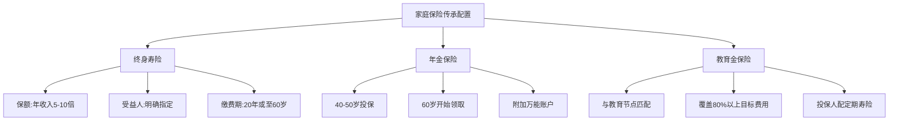
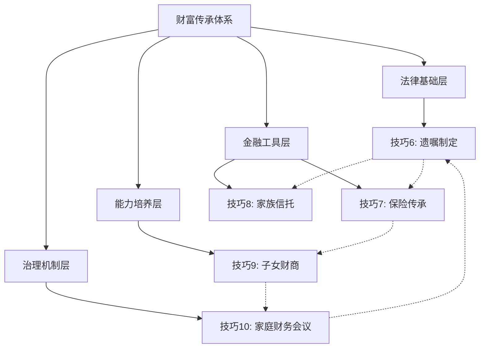

## 二、财富传承规划的五个核心技巧

40-50岁是财富传承规划的黄金窗口期。此时资产规模已初具雏形，子女尚未成年或刚成年，正是梳理传承脉络、搭建法律架构的最佳时机。如果等到退休甚至病重才开始规划，不仅选择空间大幅缩小，还可能因突发状况导致资产流失或家庭纷争。

根据中国裁判文书网的数据，2023年全国继承纠纷案件超过12万件，其中超过60%的纠纷源于"没有遗嘱"或"遗嘱无效"。财富传承不是富人的专利——任何拥有房产、存款、保险的家庭都需要一套清晰的传承方案。

本节介绍五个核心技巧，从法律文件到金融工具，从财商培养到家庭治理，构建完整的财富传承体系。

---

### 技巧6：遗嘱制定的"三步法"

遗嘱是传承的基础法律文件。很多人认为"我的家人会自动处理好"，但《民法典》规定的法定继承顺序和份额，往往与个人意愿不一致。

#### 法定继承 vs 遗嘱继承

根据《民法典》第1127条，法定继承的顺序为：

| 顺序 | 继承人范围 | 说明 |
|------|-----------|------|
| 第一顺序 | 配偶、子女、父母 | 同一顺序继承人一般均分 |
| 第二顺序 | 兄弟姐妹、祖父母、外祖父母 | 仅在无第一顺序继承人时继承 |

如果没有遗嘱，遗产按法定继承处理。举个例子：王先生去世，留有200万存款和一套房产（价值300万）。他的法定继承人包括妻子、一个孩子、父母二人。五人平分，每人获得100万。这可能导致房产被迫变卖——而这未必是王先生的本意。

通过遗嘱，王先生可以指定房产归妻子所有（保障居住），存款由孩子和父母按比例分配，从而实现"保障配偶居住权、保障子女教育金、保障父母养老"的多重目标。

#### 第一步：资产清单——盘点一切

资产清单是遗嘱的基石。遗漏任何一项资产，都可能导致该部分按法定继承处理，引发纠纷。

**需要盘点的资产类别：**

| 类别 | 具体项目 | 容易遗漏的细节 |
|------|---------|---------------|
| 不动产 | 住宅、商铺、车位、农村宅基地 | 小产权房、未办证房产、共有产权 |
| 金融资产 | 银行存款、股票、基金、债券、期货 | 多个银行账户、证券账户、外币账户 |
| 保险 | 寿险、年金、重疾险 | 保单现金价值、万能账户价值 |
| 企业资产 | 股权、合伙份额、个体工商户 | 隐名股东、代持协议 |
| 数字资产 | 支付宝余额、微信零钱、数字货币 | 网络店铺、游戏装备、社交账号 |
| 债权 | 别人欠你的钱、对外投资 | 口头借款、未到期债权 |
| 其他 | 贵金属、收藏品、知识产权 | 专利权、著作权的收益权 |

**实操工具：资产清单模板**

```markdown
# 家庭资产清单（更新日期：____年__月__日）

## 一、不动产
| 资产名称 | 地址 | 产权人 | 面积 | 估值(万) | 备注 |
|---------|------|--------|------|---------|------|
| 自住房产 | xx市xx区xx路xx号 | 王先生 | 120㎡ | 300 | 婚后共同财产 |
| 车位 | xx小区B1层xx号 | 王先生 | - | 20 | 有产权证 |

## 二、金融资产
| 资产名称 | 机构 | 账号(尾号) | 持有人 | 余额(万) | 备注 |
|---------|------|-----------|--------|---------|------|
| 定期存款 | 工商银行 | 1234 | 王先生 | 50 | 2027年到期 |
| 股票账户 | 中信证券 | 5678 | 王先生 | 30 | 沪深两市 |
| 基金 | 天天基金 | - | 王太太 | 15 | 定投中 |

## 三、保险
| 保险公司 | 险种 | 保单号 | 投保人 | 被保险人 | 受益人 | 保额(万) | 现金价值(万) |
|---------|------|--------|--------|---------|--------|---------|-------------|
| 中国人寿 | 终身寿险 | P123456 | 王先生 | 王先生 | 法定 | 100 | 12 |

## 四、负债
| 债权人 | 类型 | 余额(万) | 月还款 | 到期日 | 备注 |
|--------|------|---------|--------|--------|------|
| 建设银行 | 房贷 | 80 | 5000 | 2035年 | 共同债务 |

## 五、数字资产
| 平台 | 账号 | 资产类型 | 估值(万) | 备注 |
|------|------|---------|---------|------|
| 支付宝 | 138****1234 | 余额+余额宝 | 3 | 含花呗额度 |
```

#### 第二步：分配方案——兼顾公平与需求

分配方案不是简单的"平分"，而是要综合考虑每个家庭成员的实际需求、贡献度和特殊状况。

**分配决策的五个维度：**

1. **需求优先**：未成年子女的教育金、配偶的居住保障、父母的养老费用，这三项应优先保障
2. **贡献考量**：对家庭财富积累贡献较大的一方，可适当多分（需在遗嘱中说明理由，避免争议）
3. **特殊照顾**：生活有特殊困难又缺乏劳动能力的继承人，应适当多分
4. **已获份额**：生前已经获得大额资助的子女，可以在遗嘱中扣减相应份额
5. **执行可行性**：避免分配方案导致资产被迫拆分或变卖

**常见分配方案对比：**

| 方案 | 适用场景 | 优点 | 缺点 |
|------|---------|------|------|
| 均等分配 | 子女状况相近、关系和睦 | 简单公平，不易产生争议 | 无法体现差异化需求 |
| 按需分配 | 子女年龄差距大、经济状况悬殊 | 照顾弱势方 | 容易引发"不公平"的不满 |
| 资产对应法 | 资产种类明确、偏好清晰 | 每人获得明确资产，减少纠纷 | 需要资产价值相当或配合补偿 |
| 信托分配 | 资产量大、受益人年幼或无管理能力 | 专业管理、条件分配 | 门槛高、成本高 |

**税务提醒**：中国目前尚未开征遗产税，但继承房产时仍涉及契税（法定继承人免征，非法定继承人按3%缴纳）、公证费（按受益额的1-2%收取）等费用。分配方案应预留这些成本。

#### 第三步：法律文件——让遗嘱真正有效

遗嘱的形式必须严格符合法律规定，否则可能被认定无效。《民法典》规定了六种遗嘱形式：

| 遗嘱形式 | 法律要求 | 优缺点 |
|---------|---------|--------|
| 自书遗嘱 | 亲笔书写全文，签名，注明年月日 | 最简单，但易被质疑笔迹或精神状态 |
| 代书遗嘱 | 两个以上见证人，其中一人代书，注明年月日，代书人、其他见证人和遗嘱人签名 | 适合书写困难者 |
| 打印遗嘱 | 两个以上见证人，遗嘱人和见证人逐页签名，注明年月日 | 2021年新增形式 |
| 录音录像遗嘱 | 两个以上见证人，遗嘱人和见证人记录姓名、年月日 | 适合表达能力强但书写困难者 |
| 口头遗嘱 | 仅限危急情况，两个以上见证人 | 危急情况消除后可改用其他形式 |
| 公证遗嘱 | 经公证机构公证 | 证明力最强，但不再有优先效力 |

**关键变化**：2021年《民法典》取消了公证遗嘱的优先效力。现在以最后一份遗嘱为准，无论是否公证。这降低了修改遗嘱的门槛，但也意味着最后一份遗嘱必须是真实意愿的体现。

**遗嘱有效的关键要素：**

- 遗嘱人必须具有完全民事行为能力（无精神疾病、未受胁迫）
- 遗嘱内容必须是真实意思表示
- 必须为缺乏劳动能力又没有生活来源的继承人保留必要份额（"必留份"制度）
- 见证人不能是继承人、受遗赠人或与之有利害关系的人

**遗嘱保管建议**：
- 原件存放于银行保险箱或律师事务所
- 告知至少一位信任的人遗嘱的存在和存放位置
- 保留一份复印件在家中易于找到的地方
- 如果使用"中华遗嘱库"等专业机构，可以进行遗嘱登记和保管

**常见遗嘱无效的原因（必须避免）：**

| 无效原因 | 具体表现 | 纠正方法 |
|---------|---------|---------|
| 形式瑕疵 | 自书遗嘱未签名或未注日期 | 严格按法律要求逐项检查 |
| 见证人不合格 | 继承人做见证人 | 选择无利害关系的第三方 |
| 处分他人财产 | 把夫妻共同财产全部作为遗产分配 | 只处分个人份额 |
| 内容违法 | 排除缺乏劳动能力的继承人 | 预留"必留份" |
| 意思表示不真实 | 受胁迫或欺诈所立 | 确保立遗嘱时自由自愿 |
| 未保留必留份 | 未给无生活来源的继承人保留份额 | 依法预留必要份额 |

---

### 技巧7：保险传承的"杠杆法"

保险是财富传承中被严重低估的工具。它的核心优势在于：用相对较小的保费，撬动较大的保额，实现"杠杆传承"。同时，保险金通常不受债务追偿（在合理范围内），且可以指定受益人，避免遗产纠纷。

#### 方案一：终身寿险——传承的基石

终身寿险是传承规划中最基础的保险工具。无论被保险人何时身故，保险公司都会赔付保额给受益人。

**产品选择要点：**

| 维度 | 建议 | 说明 |
|------|------|------|
| 保额 | 年收入的5-10倍，或覆盖所有负债+子女教育+配偶养老 | 确保受益人获得足够的经济保障 |
| 缴费期 | 20年期或缴至60岁 | 拉长缴费期降低年缴保费，提高杠杆率 |
| 受益人 | 明确指定（配偶70%+子女30%），不要写"法定" | 指定受益人可避免遗产纠纷，保险金不属于遗产 |
| 产品类型 | 增额终身寿险（现金价值增长确定）或传统终身寿险 | 增额终身寿险兼具保障和储蓄功能 |

**杠杆示例**：40岁男性，投保增额终身寿险，年缴保费10万元，缴费20年，总保费200万。到80岁时，保单现金价值约450万（IRR约2.8%），身故保额约500万。用200万的投入，撬动500万的传承。

**保险金与遗产的区别**：

| 对比项 | 保险金（指定受益人） | 遗产 |
|--------|-------------------|------|
| 是否需要缴税 | 免征个人所得税 | 继承相关税费（公证费、契税等） |
| 是否需要还债 | 原则上不属于遗产，不用于偿还被保险人生前债务 | 先清偿债务，剩余部分才分配 |
| 分配方式 | 按保单指定比例分配 | 按遗嘱或法定继承分配 |
| 分配速度 | 理赔通常15-30天 | 继承公证+过户可能需要数月 |
| 是否需要公证 | 不需要 | 需要继承权公证 |

**重要提示**：如果投保人在身故前有恶意转移资产、逃避债务的嫌疑，法院可能会穿透保险结构，将保险金纳入遗产范围。保险传承必须在财务状况健康时提前规划。

#### 方案二：年金保险——持续现金流

年金保险的核心价值是"活多久领多久"，解决长寿风险——即"人还在，钱没了"的风险。

**年金保险的配置逻辑：**

- **投保时机**：40-50岁投保，60岁开始领取，缴费期10-20年
- **领取方式**：按月领取（适合作为养老金补充）或按年领取（适合大额支出）
- **附加万能账户**：年金进入万能账户二次增值，但需注意万能账户的保底利率（通常1.75-3%）和实际结算利率的差异

**年金保险 vs 银行定期存款对比：**

| 对比项 | 年金保险 | 银行定期存款 |
|--------|---------|-------------|
| 收益确定性 | 合同约定，确定可期 | 利率随市场变化（近年来持续下降） |
| 锁定期限 | 可锁定终身利率 | 最长5年 |
| 流动性 | 前5年退保有损失 | 随时可取（损失利息） |
| 强制储蓄 | 天然强制，避免提前消费 | 容易提前取出 |
| 传承功能 | 可指定受益人 | 属于遗产 |

#### 方案三：教育金保险——为子女教育兜底

教育金保险的核心是"专款专用"，确保子女教育不受家庭变故影响。

**教育金规划公式：**

```text
所需教育金 = 目标院校年均费用 × 就读年数 × 通胀系数
```

举例：目标国内985大学，当前年均费用5万元，4年制，假设15年后入学，年通胀3%：

```text
5万 × 4年 × (1.03)^15 ≈ 31.2万元
```

如果目标海外留学（年均费用30万人民币，2年制硕士）：

```text
30万 × 2年 × (1.03)^15 ≈ 187万元
```

**教育金保险的选择原则：**
- 领取时间与子女教育节点匹配（18岁大学、22岁研究生）
- 优先选择确定收益型产品，而非分红型（分红不保证）
- 保额应覆盖目标教育费用的80%以上，剩余部分用其他投资补充
- 投保人（父母）应同时配置定期寿险，确保即使投保人身故，教育金也能继续缴纳

#### 保险传承的综合配置建议



---

### 技巧8：家族信托入门

家族信托是超高净值家庭（通常可投资资产1000万以上）的核心传承工具。它通过法律架构实现资产的隔离保护、专业管理和条件分配，是保险和遗嘱无法替代的。

#### 家族信托的法律结构

```text
委托人（你） ──交付资产──▶ 信托公司（受托人）
                                    │
                                    ▼
                              信托资产（独立运作）
                                    │
                                    ▼
                              受益人（你的家人）
                         ├── 配偶：每月领取生活费
                         ├── 子女：大学毕业时领取一笔创业金
                         └── 父母：每月领取养老费
```

**核心法律特征：**

1. **资产隔离**：信托资产独立于委托人、受托人和受益人的固有财产。即使委托人破产，信托资产不纳入破产财产（《信托法》第15-17条）
2. **条件分配**：可以设定极其灵活的分配条件，比如"子女年满25岁且取得大学学位后，一次性领取100万创业金"
3. **专业管理**：由信托公司专业团队进行投资管理，避免受益人因缺乏投资经验而亏损

#### 家族信托的实际运作

**设立流程：**

| 步骤 | 内容 | 耗时 | 费用 |
|------|------|------|------|
| 1. 需求沟通 | 与信托公司讨论传承目标、受益人安排、分配条件 | 1-2周 | 无 |
| 2. 方案设计 | 信托公司出具信托方案 | 2-4周 | 无 |
| 3. 合同签署 | 签署信托合同，明确各方权利义务 | 1-2周 | 律师费2-5万 |
| 4. 资产交付 | 将资产转入信托（现金、股权、房产等） | 1-4周 | 过户税费（如适用） |
| 5. 信托存续 | 信托公司按合同管理资产、分配收益 | 持续 | 管理费0.5-1%/年 |
| 6. 信托终止 | 按合同约定终止（通常20-50年） | - | 清算费用 |

**费用结构明细：**

| 费用项目 | 金额 | 说明 |
|---------|------|------|
| 设立费 | 5-20万 | 一次性，部分机构免除 |
| 管理费 | 信托资产的0.5-1%/年 | 按年收取 |
| 投资顾问费 | 0-0.5%/年 | 如需额外投资顾问 |
| 律师费 | 2-5万 | 合同审查和法律咨询 |
| 变更费 | 1-5万/次 | 修改信托条款 |

#### 家族信托 vs 其他传承工具对比

| 对比维度 | 家族信托 | 遗嘱 | 保险 | 直接赠与 |
|---------|---------|------|------|---------|
| 资产隔离 | 强（独立于各方财产） | 无 | 中（保险金原则上隔离） | 无 |
| 条件分配 | 极强（任意条件） | 无 | 弱（仅指定受益人比例） | 无 |
| 专业管理 | 有（信托公司） | 无 | 无（保险公司管理保单） | 无 |
| 隐私保护 | 强（不公开） | 弱（需继承公证，可能涉诉） | 中 | 弱 |
| 设立门槛 | 高（通常100万起） | 低 | 低 | 低 |
| 持续成本 | 高（年管理费） | 无 | 保险费 | 无 |
| 灵活性 | 高（可设任意条款） | 遗嘱人去世后不可改 | 低（合同固定） | 低（赠与不可撤回） |
| 债务隔离 | 强 | 无 | 中 | 无 |

#### 家族信托的适用场景

**适合设立家族信托的情况：**

1. **可投资资产超过1000万**：信托的固定成本较高，资产规模太小不划算
2. **家庭结构复杂**：再婚家庭、多子女家庭，需要精细的分配安排
3. **担心子女败家**：希望控制子女获得资产的节奏和条件
4. **企业主**：需要将个人资产与企业资产隔离，防范经营风险
5. **有海外资产**：跨境传承需要专业的法律和税务架构

**不适合设立家族信托的情况：**

- 可投资资产不足500万（成本不划算）
- 家庭关系简单、资产结构清晰（遗嘱+保险即可覆盖）
- 需要随时动用全部资产（信托资产流动性受限）

#### 家族信托的替代方案：保险金信托

如果资产规模不够家族信托门槛，可以考虑"保险金信托"——将终身寿险的保险金作为信托资产，门槛通常只需100万保额起。

**运作方式**：
1. 投保终身寿险，保额100万以上
2. 受益人变更为信托公司
3. 身故后，保险金进入信托
4. 信托公司按约定条件分配给受益人

这样用较少的保费（年缴几万），撬动了信托的条件分配和资产隔离功能。

---

### 技巧9：子女财商培养的"五步法"

财富传承的最大风险不是法律漏洞，而是继承人没有能力管理财富。研究表明，超过70%的家族财富在第二代手中缩水，到第三代仅剩10%。因此，培养子女的财商，比留下多少财富更重要。

#### 第一步：建立金钱意识（6-10岁）

**核心目标**：让孩子理解"钱是什么、钱从哪里来、钱能做什么"。

**具体方法：**

1. **家庭购物实践**：带孩子去超市，给一定预算（比如50元），让孩子自己决定买什么。过程中讨论"哪个更划算""值不值得买"
2. **零花钱制度**：每周固定金额（建议年龄×1元，如8岁给8元），分为三份——消费（50%）、储蓄（30%）、分享（20%）
3. **赚钱体验**：让孩子通过做家务赚取额外零花钱（注意区分"义务劳动"和"有偿劳动"——日常整理房间是义务，额外的大扫除可以付费）
4. **游戏化学习**：使用"大富翁"等桌游，或带孩子玩模拟经营类电子游戏，在游戏中理解收入、支出、投资的概念

**避免的误区**：
- 不要用金钱作为奖惩工具（"考100分奖励100元"会扭曲金钱观）
- 不要在孩子面前抱怨"没钱"（会制造焦虑）
- 不要过度满足（"想要什么就买什么"会削弱延迟满足能力）

#### 第二步：培养储蓄习惯（10-14岁）

**核心目标**：让孩子理解"延迟满足"和"复利效应"。

**具体方法：**

1. **开设银行账户**：带孩子去银行开设专属储蓄账户，让孩子自己操作存款
2. **储蓄目标表**：帮助孩子制定具体的储蓄目标（比如"存200元买一双球鞋"），制作可视化的目标进度表
3. **复利教育**：用简单例子解释复利——"如果你每年存100元，年利率5%，10年后你不仅有1000元本金，还有额外的利息收入"
4. **家庭储蓄挑战**：全家一起参与"30天不买非必需品"挑战，比谁坚持得最久

**进阶练习——"家庭小银行"**：

让孩子扮演"家庭银行"的角色，管理一个小额家庭基金。比如全家每月存入200元，孩子负责记账，年底用这笔钱做一次家庭活动。孩子在这个过程中学会记账、预算和资金管理。

#### 第三步：理解投资概念（14-18岁）

**核心目标**：让孩子理解"风险与收益的关系"以及"资产配置的基本逻辑"。

**具体方法：**

1. **模拟投资游戏**：使用同花顺、雪球等平台的模拟炒股功能，给孩子10万虚拟资金，让孩子选择3-5只股票进行投资，持续3个月
2. **家庭投资讨论**：每周花30分钟和孩子讨论家庭投资的涨跌，解释"为什么涨了""为什么跌了""我们的策略是什么"
3. **资产配置启蒙**：用"鸡蛋不要放在一个篮子里"的比喻，教孩子理解分散投资
4. **财商书籍阅读**：推荐书单——《小狗钱钱》（入门）、《富爸爸穷爸爸》（观念启蒙）、《穷查理宝典》（进阶思维）

**风险教育的关键**：
- 让孩子体验"亏损"——模拟投资中亏钱是好事，学费便宜
- 讨论"投机"和"投资"的区别——投机靠运气，投资靠分析
- 引导孩子关注企业的基本面，而非股价的短期波动

#### 第四步：实践财务管理（18-22岁）

**核心目标**：让孩子独立管理自己的财务，为进入社会做准备。

**具体方法：**

1. **生活费预算**：大学期间，一次性给一学期的生活费（而非按月打钱），让孩子自己规划
2. **记账习惯**：推荐使用"随手记"或"微力记账"等App，坚持记录至少一个学期
3. **信用卡使用**：办理一张附属卡（额度2000-5000元），教孩子理解信用和负债
4. **实习和兼职**：鼓励孩子通过实习赚取收入，体验"赚钱不易"
5. **首次投资**：给孩子一笔小额启动资金（5000-10000元），让孩子进行真实投资

**家庭财务透明度**：在这个阶段，可以适度向孩子透露家庭的财务概况（总资产规模、收入来源、主要支出），让孩子对家庭财富有基本认知。不需要透露具体数字，但要让孩子理解"家庭财富是怎么来的、怎么管理的"。

#### 第五步：传承财富观念（22岁以上）

**核心目标**：让孩子成为合格的财富管理者和传承者。

**具体方法：**

1. **家庭财务会议**：邀请成年子女参加家庭财务会议（详见技巧10），了解家庭的资产配置和传承规划
2. **信托/保险安排讨论**：和子女讨论家族信托、保险传承等安排，听取他们的意见
3. **家族宪章**：如果家族资产较大，可以考虑制定"家族宪章"，明确家族的价值观、财富使用原则和传承规则
4. **慈善传承**：引导子女参与慈善事业，培养"财富是责任而非特权"的观念
5. **创业支持**：如果子女有创业意愿，提供启动资金（作为投资而非赠与），培养创业精神和财务责任感

**关于"富不过三代"的破解之道**：

| 代际 | 核心挑战 | 解决方案 |
|------|---------|---------|
| 第一代（创富） | 过度控制，不愿放权 | 逐步放手，让下一代参与决策 |
| 第二代（守富） | 缺乏创富经验，依赖继承 | 鼓励独立创业，提供资源而非直接给钱 |
| 第三代（散富） | 生于安乐，缺乏危机意识 | 家族宪章+信托约束+财商教育 |

---

### 技巧10：家庭财务会议的"四步法"

家庭财务会议是传承规划中被严重忽视但极其重要的环节。它不是"开个会说说钱的事"，而是建立家庭财务治理机制的过程。

#### 为什么需要家庭财务会议？

**解决的核心问题**：
- 夫妻之间财务信息不对称（"他/她到底有多少私房钱？"）
- 子女对家庭财务状况一无所知（突然继承大笔遗产不知如何处理）
- 重大财务决策缺乏讨论（一方擅自投资亏损、一方过度消费）
- 传承意愿未充分沟通（遗嘱出来后子女才发现"这不是我想要的"）

**定期召开财务会议的家庭，在以下方面显著优于不开会的家庭：**
- 储蓄率平均高出15-20%
- 投资决策失误率降低30%
- 家庭财务纠纷减少50%以上

#### 第一步：准备（会前1-2天）

**准备清单：**

| 准备事项 | 具体内容 | 负责人 |
|---------|---------|--------|
| 财务数据汇总 | 本月收入、支出、投资收益、负债变化 | 主要财务管理者 |
| 目标进度更新 | 各项财务目标的完成进度（买房、教育、养老） | 主要财务管理者 |
| 议题收集 | 征集家庭成员的讨论议题 | 所有人 |
| 资料打印 | 打印财务报表、投资组合截图 | 主要财务管理者 |

**议题来源**：
- 大额支出计划（装修、旅行、购车）
- 投资调整建议
- 保险到期续保
- 子女教育费用
- 任何一方的财务困惑或担忧

#### 第二步：回顾（会上第一部分，约30分钟）

**回顾框架：**

1. **上次会议决议执行情况**：逐项检查上次制定的行动计划是否完成，未完成的原因是什么
2. **财务数据回顾**：
   - 收入：本月/本季度总收入，与预算对比
   - 支出：各项支出占比，是否有异常大额支出
   - 投资：投资组合表现，收益率对比基准
   - 负债：房贷、车贷、信用卡等负债余额变化
3. **重大事件通报**：收入变化、工作变动、保险理赔、投资亏损等

**回顾时的原则**：
- 只呈现事实，不带情绪（"本月超支3000元"而非"你又乱花钱"）
- 每个人都有发言权，不打断
- 用数据说话，避免主观判断

#### 第三步：规划（会上第二部分，约45分钟）

**规划框架：**

1. **短期目标（1年内）**：
   - 下个月的大额支出计划
   - 近期需要续保的保险
   - 年度旅行预算

2. **中期目标（1-5年）**：
   - 购房/换房计划
   - 子女教育规划
   - 投资组合调整

3. **长期目标（5年以上）**：
   - 退休规划进度
   - 财富传承安排
   - 遗嘱和保险更新

4. **行动计划**：每个目标对应具体行动、负责人和截止时间

**行动表示例：**

| 行动项 | 负责人 | 截止时间 | 状态 |
|--------|--------|---------|------|
| 咨询保险经纪人，了解终身寿险产品 | 王先生 | 下月15日 | 待办 |
| 整理家庭资产清单 | 王太太 | 本月底 | 进行中 |
| 给孩子开设储蓄账户 | 王先生 | 两周内 | 待办 |
| 预约律师咨询遗嘱事宜 | 夫妻共同 | 下季度初 | 待办 |

#### 第四步：总结（会后）

**会后工作：**

1. **整理会议纪要**：记录讨论内容、达成的共识、制定的行动计划
2. **分发纪要**：将纪要发送给所有参会家庭成员（可以用微信群发或共享文档）
3. **设置提醒**：在日历中设置各项行动的截止日期提醒
4. **安排下次会议**：确定下次会议的时间（建议每季度一次，固定在某个月的第一个周末）

**会议纪要模板：**

```markdown
# 家庭财务会议纪要
日期：____年__月__日
参会人员：____

## 一、财务回顾
- 本月收入：____元（预算____元，差异____元）
- 本月支出：____元（预算____元，差异____元）
- 投资收益：____元（收益率____%）
- 负债余额：____元（较上月变化____元）

## 二、讨论议题
1. ____（讨论结果：____）
2. ____（讨论结果：____）

## 三、行动计划
| 行动项 | 负责人 | 截止时间 |
|--------|--------|---------|
| ____ | ____ | ____ |
| ____ | ____ | ____ |

## 四、下次会议
时间：____年__月__日
重点议题：____
```

#### 家庭财务会议的进阶实践

**阶段一（前3次会议）：建立习惯**
- 重点：养成定期开会的习惯，不要追求完美
- 时间：每次1小时以内
- 参与者：夫妻二人即可

**阶段二（第4-8次会议）：深化内容**
- 重点：开始讨论投资策略、保险规划、传承安排
- 时间：每次1-1.5小时
- 参与者：夫妻二人，可邀请成年子女旁听

**阶段三（第9次会议以后）：制度化**
- 重点：形成固定流程，建立家庭财务制度
- 时间：每次1.5-2小时
- 参与者：全家参与，各司其职
- 进阶：开始制定"家族宪章"，将家族的财务价值观和传承规则制度化

**家庭财务会议的常见问题及应对：**

| 问题 | 表现 | 解决方案 |
|------|------|---------|
| 一方不参与 | "你自己管就好" | 强调"共同决策"的重要性，从简单议题开始 |
| 变成吵架 | 讨论支出时互相指责 | 制定"不指责"规则，只讨论解决方案 |
| 流于形式 | 只是走过场，没有行动 | 严格执行行动计划，每次回顾上次完成情况 |
| 信息不对称 | 一方隐瞒收入或债务 | 建立"完全透明"原则，共享所有账户信息 |
| 孩子不理解 | 孩子觉得无聊或听不懂 | 用孩子能理解的语言，让孩子参与自己相关的议题 |

---

### 总结：五技合一的传承体系

五个核心技巧不是孤立的，而是相互配合、层层递进的完整体系：



**实施优先级建议：**

| 优先级 | 技巧 | 理由 | 启动成本 |
|--------|------|------|---------|
| 1 | 遗嘱制定 | 法律基础，没有遗嘱其他都白搭 | 低（律师费2000-5000元） |
| 2 | 保险传承 | 杠杆高、门槛低、确定性强 | 中（年缴数千至数万） |
| 3 | 子女财商培养 | 长期回报最高，但需要持续投入 | 低（主要是时间和精力） |
| 4 | 家庭财务会议 | 建立沟通机制，为其他技巧落地提供保障 | 零 |
| 5 | 家族信托 | 资产规模达到门槛后再考虑 | 高（100万起） |

40-50岁的你，现在就开始行动。先从列一份资产清单开始，然后预约一位律师——这就是传承规划的第一步。
