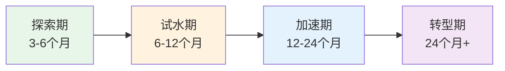
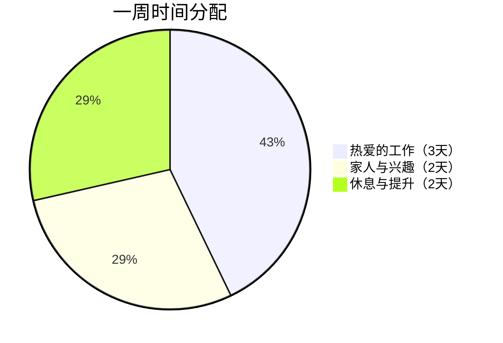
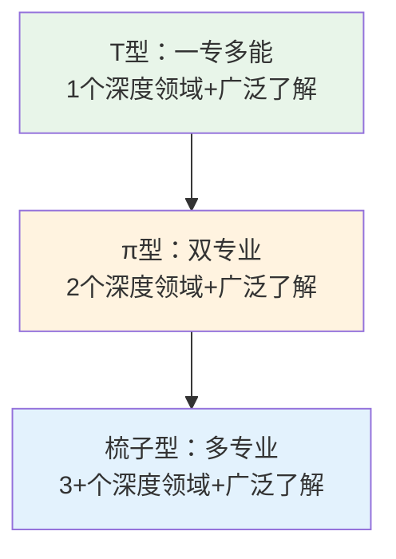
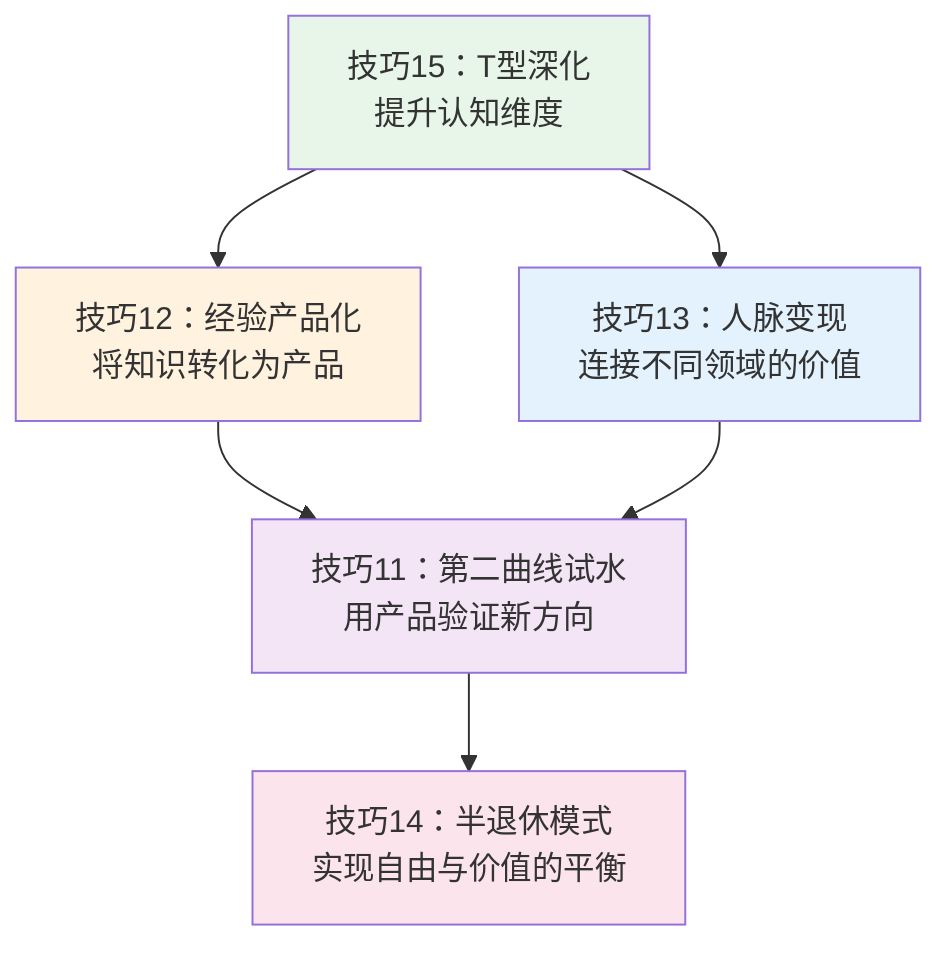

## 三、职业转型的五个核心技巧

40-50岁是职业生涯的"第二起跑线"。这个年龄段的转型与20多岁时截然不同——你不再是一张白纸，而是带着20年的行业认知、人脉积累和专业判断力。问题不在于"能不能转"，而在于"怎么转才能把沉没成本变成杠杆"。

根据智联招聘《2024年中国白领跳槽调查》，40-50岁群体中仅有12%的人真正完成了职业转型，但成功转型者的收入中位数反而比转型前高出23%。差距的核心在于：大多数人用"推倒重来"的思路转型，而成功者用的是"杠杆迁移"。

下面五个技巧，本质上是同一套方法论的五个切面：**用最小代价验证方向，用已有资产撬动新赛道，用可控节奏降低风险**。

### 技巧11：第二曲线的"试水法"

#### 为什么不能一步到位

职业转型失败率最高的做法是：辞职→学习→求职。这条路径的问题在于，它把你从"有收入的探索者"变成了"没收入的焦虑者"。心理学中的"损失厌恶"会让你在第3个月就开始妥协，接受一个比原来更差的职位。

查尔斯·汉迪在《第二曲线》中提出：**最佳转型时机是在第一曲线到达巅峰之前**。这意味着你不应该等到被裁员或职业倦怠到崩溃时才行动，而应该在现有工作还稳定时就开始布局。

#### 四阶段试水法详解

**第一步：探索期（3-6个月）——不花钱、不辞职、只调研**

这一阶段的目标是缩小方向范围，而不是做出决定。具体操作：

| 行动项 | 具体做法 | 时间投入 | 产出物 |
|--------|----------|----------|--------|
| 行业研究 | 阅读目标行业3份以上深度报告，关注头部公司的财报和战略动向 | 每周3小时 | 行业认知笔记（至少5000字） |
| 人物访谈 | 找到目标行业的5-10位从业者，进行30分钟深度访谈 | 每月2-3次 | 访谈记录和关键洞察 |
| 课程试听 | 在得到、极客时间、Coursera等平台试听3-5门相关课程 | 每周2小时 | 课程评价和学习路径图 |
| 社群潜伏 | 加入目标行业的微信群、知识星球、LinkedIn群组 | 每天30分钟 | 行业真实痛点清单 |

**关键判断标准**：如果在探索期结束时，你对目标方向的热情没有减退，且发现了至少3个可以利用现有经验切入的机会点，就可以进入下一步。

**第二步：试水期（6-12个月）——用业余时间验证可行性**

试水期的核心是**拿到第一个付费客户或第一笔收入**，哪怕金额很小。这不是为了赚钱，而是为了验证三件事：
1. 市场是否真的需要你的服务/产品
2. 你是否能交付让客户满意的结果
3. 这条路是否比你现在的工作更有吸引力

具体操作：

- **接小项目**：在猪八戒、Upwork、Fiverr等平台接1-3个小项目，报价可以低于市场价，目的是拿到真实反馈
- **做免费咨询**：为3-5个目标客户做免费咨询，换取推荐和案例授权
- **写测试内容**：在知乎、公众号、小红书发布10-20篇目标领域的内容，观察数据反馈
- **参加行业活动**：以"新人"身份参加2-3场行业会议，观察自己的融入度

**试水成功的信号**：有人主动找你付费，有人愿意为你背书推荐，你接到的项目质量在逐步提升。

**试水失败的信号**：连续3个月没有任何付费意向，你对这个领域的兴趣在快速消退，发现门槛比预期高很多。此时应该果断换方向，而不是死磕。

**第三步：加速期（12-24个月）——建立可复制的收入模型**

当试水验证成功后，你需要从"偶尔接活"升级为"稳定的收入来源"：

- **定价升级**：将报价从"试水价"提升到市场价的70-80%，测试价格弹性
- **案例积累**：整理5-10个成功案例，制作案例集（PDF或网页）
- **渠道搭建**：建立至少2个稳定的获客渠道（转介绍+内容引流，或转介绍+平台接单）
- **流程标准化**：把服务流程固化为SOP，确保质量可复制
- **收入目标**：月收入稳定在主业收入的30-50%

**第四步：转型期（24个月以后）——可控切换**

当第二曲线收入达到主业的50%以上，且连续稳定6个月，可以考虑全职切换：

- **财务准备**：除了第二曲线收入外，准备12个月的应急基金
- **过渡方案**：与现雇主协商减少工时（如从全职转为兼职或顾问），而不是直接辞职
- **家庭沟通**：与配偶进行至少3次深度讨论，确保家庭财务计划已调整
- **退出时间线**：制定6个月的过渡计划，逐步将精力从第一曲线转移到第二曲线

**常见误区**：
- ❌ 探索期就开始辞职——应该用业余时间验证
- ❌ 试水期追求完美产品——应该快速推出MVP（最小可行产品）
- ❌ 加速期急于全职切换——应该让收入数据说话
- ❌ 转型期忽视主业——过渡期主业仍是安全网

### 技巧12：经验资本化的"产品化"方法

#### 核心逻辑：从"出卖时间"到"出售成果"

40-50岁最大的资产是**经验**，但经验本身不值钱——**可复制、可传播的经验才值钱**。产品化的本质是把你20年积累的"隐性知识"转化为"显性产品"，实现一次创造、多次销售。

经济学中有个概念叫"边际成本递减"：你花40小时录制一门课程，卖1份和卖1000份的成本几乎相同。这就是产品化相比咨询、打工的本质优势。

#### 四种产品化路径对比

| 路径 | 启动成本 | 时间投入 | 收入上限 | 难度 | 适合人群 |
|------|----------|----------|----------|------|----------|
| 课程产品化 | 低（3000-10000元） | 200-500小时 | 年入50-200万 | ★★★☆ | 有体系化知识、表达能力好的人 |
| 咨询产品化 | 低（几乎为零） | 50-100小时搭建 | 年入30-150万 | ★★☆☆ | 有行业资源和口碑的人 |
| 内容产品化 | 中（5000-30000元） | 500-2000小时 | 年入10-100万 | ★★★★ | 有写作能力、愿意长期投入的人 |
| 工具产品化 | 高（5-50万元） | 1000-5000小时 | 年入100-1000万 | ★★★★★ | 有技术能力或能找到技术合伙人的 |

#### 路径一：课程产品化——最推荐的起步路径

**为什么课程是最好的起步产品**：门槛最低、验证最快、迭代成本最低。

**具体操作流程**：

1. **选题定位**（1-2周）
   - 从你的职业经历中提炼3-5个"别人经常问你"的问题
   - 在知乎、百度搜索这些问题的搜索量
   - 选择搜索量大、现有回答质量差的方向作为切入点

2. **课程设计**（2-4周）
   - 采用"问题→原理→方法→案例→练习"的五段式结构
   - 每节课控制在15-25分钟
   - 一门课10-20节为宜
   - 制作课程大纲和思维导图

3. **内容录制**（4-8周）
   - 设备：电脑+麦克风+PPT/Keynote即可，总投入3000-5000元
   - 工具：OBS（录屏）+剪映或Final Cut（剪辑）+Canva（设计）
   - 每周录制2-3节，保持节奏

4. **平台选择**：
   - 得到/知乎大学：审核严，但流量大，适合体系化课程
   - 小鹅通/知识星球：自建平台，利润高，但需要自己引流
   - B站/抖音：免费内容引流，付费课程转化
   - 腾讯课堂/网易云课堂：流量中等，适合测试

5. **定价策略**：
   - 测试期：9.9-49元（目的是拿到评价和口碑）
   - 成长期：99-299元（建立品牌认知）
   - 成熟期：399-999元（配合社群和服务）

#### 路径二：咨询产品化——最快变现的路径

**核心是把"随叫随到的帮忙"变成"标准化的服务产品"**：

1. **服务分级**：
   - 入门级：1小时电话咨询，定价500-2000元
   - 标准级：半天现场诊断+书面报告，定价5000-20000元
   - 深度级：月度顾问（每月8-16小时），定价20000-80000元/月

2. **标准化要素**：
   - 需求诊断问卷（提前收集信息，提高咨询效率）
   - 咨询流程SOP（开场→诊断→建议→行动计划→跟进）
   - 交付物模板（报告模板、行动计划模板）
   - 客户管理系统（记录每次咨询内容和客户进展）

3. **获客方法**：
   - 老客户转介绍（最优质渠道，转化率最高）
   - 行业社群分享（免费分享干货，吸引付费客户）
   - 个人品牌内容（公众号/知乎专栏持续输出）
   - 平台入驻（在行、专家一对一等）

#### 路径三：内容产品化——长期价值最高的路径

**内容产品化需要耐心，但一旦建成，就是"睡后收入"**：

- **书籍出版**：找出版社合作（版税8-15%），或自出版（利润更高但需要自己推广）
- **付费专栏**：在公众号、知乎、头条等平台开设付费专栏
- **社群运营**：建立付费社群（知识星球、微信群），年费99-999元
- **IP授权**：将你的方法论授权给培训机构或企业使用

**关键指标**：内容产品化需要6-12个月才能看到明显收入，但12个月后的复利效应非常显著。一个拥有5万粉丝的公众号，年广告收入可达10-30万；一个活跃的知识星球，年收入可达20-100万。

#### 路径四：工具产品化——收入天花板最高的路径

如果你的技术背景或团队能力足够，可以考虑把方法论做成工具：

- **模板/清单**：在淘宝、闲鱼、Gumroad销售，单价9.9-99元
- **Excel/Notion模板**：在小红书、抖音引流，私域成交
- **SaaS产品**：需要技术开发，但可以实现订阅制持续收入
- **小程序/H5工具**：开发成本5-20万，适合有明确场景的工具

### 技巧13：人脉变现的"价值交换法"

#### 人脉变现的底层逻辑

40-50岁的人脉变现，不是"求人办事"，而是**做价值的枢纽**。社会学家格兰诺维特在"弱关系理论"中指出：最有价值的信息往往来自"弱关系"（不是最亲密的朋友，而是点头之交）。你的角色是把强关系和弱关系连接起来，创造新的价值。

#### 第一步：人脉资产盘点

大多数人高估了自己的人脉数量。真正有价值的人脉不超过150人（邓巴数），而核心人脉通常只有20-30人。

**盘点方法**：

打开你的微信通讯录，按以下维度分类：

| 维度 | 分类 | 评估标准 |
|------|------|----------|
| 关系深度 | 核心（20-30人） | 每月至少联系1次，可以互相帮忙不计较 |
| | 重要（50-100人） | 每季度联系1次，愿意互相介绍资源 |
| | 弱关系（200-500人） | 每年联系1-2次，有潜在合作可能 |
| 资源类型 | 行业专家 | 在特定领域有深厚积累 |
| | 企业高管 | 有决策权或推荐权 |
| | 投资人/资金方 | 有资金或融资渠道 |
| | 媒体/KOL | 有传播能力 |
| | 技术/执行人才 | 有落地能力 |
| | 政府/机构关系 | 有政策或资质资源 |

**制作人脉地图**：用Excel或Notion建立一个人脉数据库，记录姓名、职位、行业、上次联系时间、能提供的价值、需要的资源。

#### 第二步：建立"人情账户"

人脉变现的前提是**你先为别人创造价值**。这个过程就像银行存款——你必须先存入，才能取出。

**具体操作**：
- **每周主动帮助1个人**：可以是介绍资源、分享信息、提供建议、转发内容
- **建立"3-6-1"节奏**：每月深度帮助3个人，每周联系6个人，每天关注1个弱关系的动态
- **记录"人情账本"**：谁帮过你、你帮过谁、还欠谁人情

**高价值帮助类型**（按效果排序）：
1. **介绍关键人脉**——帮人找到他最想认识的人
2. **提供稀缺信息**——行业趋势、政策变化、竞品动态
3. **背书推荐**——用你的信誉为别人背书
4. **解决具体问题**——用你的专业能力帮人解决难题
5. **情绪支持**——在别人低谷时给予支持

#### 第三步：从"帮忙"到"连接"——成为枢纽型人脉

**枢纽型人脉的价值**：你不需要是每个领域的专家，你只需要知道谁是专家。当你成为"连接者"，你的价值就从"个人能力"升级为"网络效应"。

**具体方法**：
- **定期组织小范围聚会**：每季度组织1次6-8人的主题晚餐，邀请不同行业但有互补需求的人
- **建立社群**：创建一个50-100人的高质量微信群，定期分享行业信息和资源对接
- **做"中间人"**：当A需要B的资源时，主动牵线搭桥，事后不求回报

**人脉变现的注意事项**：
- ❌ 不要一上来就"求人办事"——先存后取
- ❌ 不要过度消耗核心人脉——稀缺资源要慎用
- ❌ 不要忘记感恩——别人帮了你，一定要及时回馈
- ✅ 保持长期主义——人脉的价值在3-5年后才会显现
- ✅ 保持真诚——虚伪的社交圈很快就会崩塌

### 技巧14：半退休模式的"3-2-2"法

#### 什么是半退休模式

半退休不是"躺平"，而是**主动选择一种低强度但高满足感的工作方式**。根据麦肯锡2023年的调研，55%的40-50岁高收入者表示"不想完全退休，但希望减少工作强度"。

半退休模式的核心是：**用被动收入覆盖基础支出，用主动收入覆盖提升性支出**。

#### "3-2-2"周安排详解

**3天：从事高价值、低强度的工作**

这一部分工作的特征是：你擅长、你热爱、市场愿意付费。

适合半退休期的工作类型：

| 工作类型 | 时间灵活性 | 收入水平 | 适合人群 |
|----------|------------|----------|----------|
| 独立顾问 | 高 | 5000-50000元/天 | 有行业深度的专业人士 |
| 投资管理 | 中 | 取决于本金和策略 | 有投资经验和资金的人 |
| 内容创作 | 高 | 5000-50000元/月 | 有表达欲和专业积累的人 |
| 董事/顾问委员 | 低 | 10-50万/年 | 有高管经验的人 |
| 教学/培训 | 中 | 500-5000元/小时 | 有教学能力的人 |
| 公益/社会企业 | 高 | 低但有意义 | 有社会情怀的人 |

**2天：陪伴家人和追求兴趣**

这不是"奖励"，而是半退休模式的核心价值。具体可以是：
- 陪伴孩子参加活动、辅导学习
- 与配偶一起旅行、学习新技能
- 发展被搁置多年的兴趣爱好（摄影、书法、音乐、运动等）
- 参加社区活动、志愿者服务

**2天：休息和自我提升**

- 身体管理：运动、体检、理疗
- 学习新知识：阅读、在线课程、行业会议
- 反思和规划：回顾本周、规划下周
- 社交维护：与朋友、前同事保持联系

#### 半退休的财务门槛

半退休不是想退就能退的，需要满足以下财务条件：

1. **被动收入 ≥ 基本生活费的80%**
   - 被动收入来源：房租、股息、基金分红、版税、课程持续收入
   - 基本生活费：房贷/房租+日常生活+保险+子女教育（不含奢侈消费）

2. **应急基金 ≥ 24个月支出**
   - 半退休模式下收入波动更大，需要更厚的安全垫

3. **保险保障完善**
   - 重疾险保额 ≥ 100万
   - 医疗险（百万医疗）
   - 意外险
   - 定期寿险（如果还有房贷或子女未成年）

4. **债务清理**
   - 高息债务（信用卡、消费贷）必须清零
   - 房贷月供 ≤ 被动收入的30%

**半退休的心理准备**：
- 接受收入下降——这是用金钱换时间和自由
- 建立新的身份认同——你不再是"某某公司的某某总"，而是"独立的某某"
- 保持社会连接——完全孤立会导致心理健康问题
- 给自己一个"试验期"——先试3-6个月，不合适可以随时回到全职

### 技巧15：跨界学习的"T型深化法"

#### 为什么40-50岁还需要学习

很多人误以为40-50岁已经"学不动了"。事实恰恰相反：成年人的学习优势在于**迁移能力强**——你可以用已有知识框架快速理解新领域的底层逻辑。

神经科学研究表明，成年人的大脑可塑性虽然比青少年低，但"晶体智力"（经验、判断、模式识别）在40-50岁达到巅峰。这意味着你学习新领域的速度可能比20岁时慢，但理解深度和应用能力反而更强。

#### T型人才的进化：从T到π到梳子

40-50岁的目标是从T型进化到**π型**甚至**梳子型**人才——拥有2-3个深度领域的专业知识，同时对相关领域有广泛的了解。

**为什么需要π型**：
- 单一领域的天花板越来越低
- 跨领域的人才稀缺，议价能力强
- 跨界视角能发现别人看不到的机会
- 职业安全感更强——一个领域衰退，另一个可以接上

#### 纵向深化：成为领域权威

纵向深化的目标是**在你的核心领域建立不可替代性**。

**深化路径**：

1. **系统化知识**（3-6个月）
   - 把你的专业知识整理成体系（思维导图、知识图谱）
   - 找到现有理论的空白点和争议点
   - 形成自己的"方法论框架"

2. **输出验证**（6-12个月）
   - 出版1本书（或至少写10万字的系列文章）
   - 在行业会议上做3-5次演讲
   - 在专业期刊或媒体发表3-5篇文章

3. **建立权威**（12-24个月）
   - 担任行业协会或专业委员会的职务
   - 成为企业或政府的特聘顾问
   - 培养3-5个学生或下属，传承你的知识体系

**纵向深化的衡量标准**：
- 有人主动找你请教行业问题
- 你的观点被同行引用或讨论
- 你被邀请参加行业决策层的讨论

#### 横向拓展：建立跨界视角

横向拓展不是"什么都学一点"，而是**有策略地学习与核心领域互补的知识**。

**互补性学习矩阵**：

| 你的核心领域 | 推荐跨界方向 | 互补逻辑 |
|-------------|-------------|----------|
| 技术/工程 | 商业/管理/金融 | 技术人懂商业，能做CTO或技术合伙人 |
| 销售/市场 | 数据分析/心理学 | 懂数据的销售能精准定位客户 |
| 财务/会计 | 行业知识/技术趋势 | 懂行业的财务能做CFO或投资 |
| 管理/运营 | 技术/产品 | 懂技术的管理者能推动数字化转型 |
| 内容/创意 | 商业/流量运营 | 懂商业的内容人能实现IP变现 |

**跨界学习方法**：

1. **每年读50本书**——听起来很多，但拆解下来是每周1本，每天30分钟
   - 60%读核心领域（纵向深化）
   - 30%读跨界领域（横向拓展）
   - 10%读通用能力（沟通、思维、心理）

2. **参加2-3个高质量行业会议**
   - 不是去"听"，而是去"连接"
   - 会后主动联系3-5个有趣的人
   - 整理会议笔记并分享到社交媒体

3. **加入1-2个高端社群**
   - 选择有门槛的付费社群（年费1000元以上）
   - 积极参与讨论，贡献自己的专业见解
   - 通过社群找到跨界合作伙伴

4. **找1-2个导师或顾问**
   - 导师应该是你3-5年后想成为的人
   - 每月与导师交流1次，每次30-60分钟
   - 尊重导师的时间，提前准备好问题

5. **做跨界项目**
   - 用你的核心能力帮跨界领域的朋友解决问题
   - 参与跨行业的公益项目或创业项目
   - 在实践中检验跨界学习的效果

#### 学习效率的"费曼法则"

40-50岁学习的最大瓶颈不是记忆力，而是**时间有限**。费曼学习法的核心是：**如果你不能用简单的话向别人解释清楚，说明你还没有真正理解**。

**具体操作**：
1. 学完一个新概念后，立刻用自己的话写一段解释（100-200字）
2. 假设读者是10年前的自己，用最简单的语言写
3. 如果写不清楚，说明理解有漏洞，回去重新学习
4. 把这些解释整理成文章或笔记，定期回顾

**每天的学习时间安排**：
- 早晨30分钟：阅读（精力最好的时段留给最重要的输入）
- 通勤/运动时30分钟：听播客或有声书（利用碎片时间）
- 晚上30分钟：写学习笔记或文章（输出倒逼输入）
- 周末2小时：深度学习或实践项目

### 五个技巧的协同效应

这五个技巧不是独立的，而是相互支撑的系统：

**最优执行顺序**：
1. 先用T型深化法（技巧15）提升认知，找到跨界方向
2. 用人脉变现法（技巧13）连接目标领域的人和资源
3. 用经验产品化（技巧12）把能力变成可验证的产品
4. 用第二曲线试水法（技巧11）在新方向上拿到真实收入
5. 当第二曲线成熟后，用半退休模式（技巧14）实现工作与生活的平衡

**最后的提醒**：40-50岁的职业转型，最大的敌人不是能力不足，而是**犹豫不决**。你不需要等到"完全准备好"才行动——你只需要比昨天多走一步。从今天开始，选择一个技巧，完成第一步行动。
