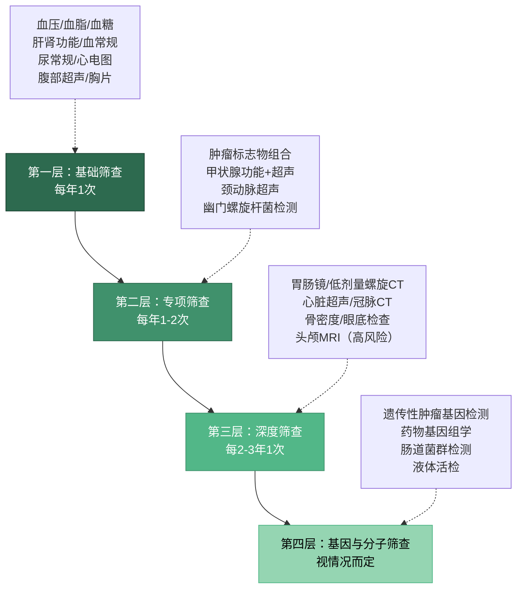
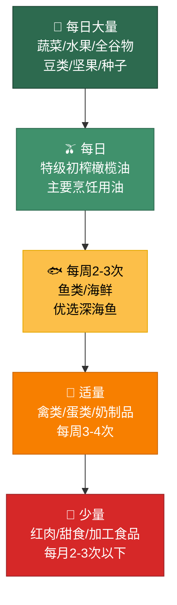
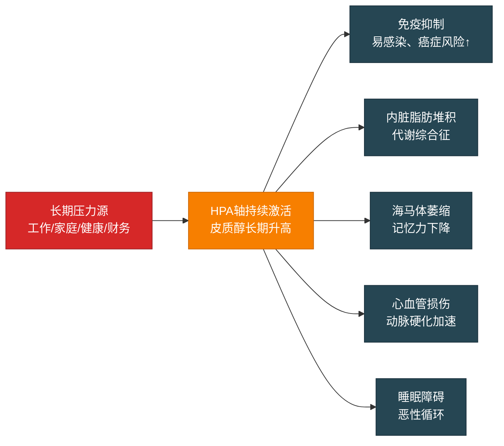
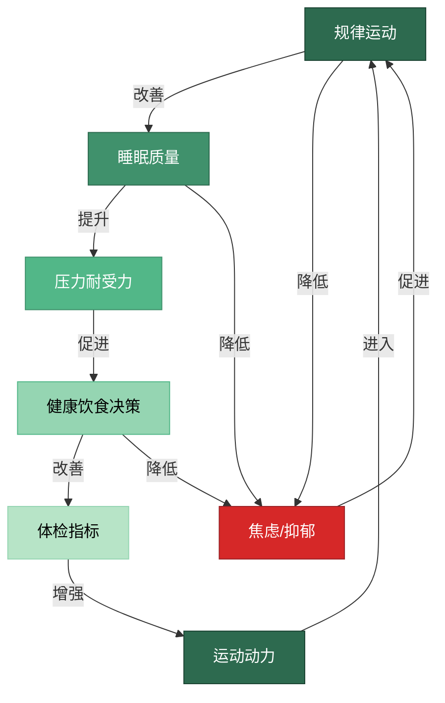

## 四、健康管理的五个核心技巧

40-50岁，健康不再是"以后再说"的事情，而是与资产配置、财富传承并列的核心财务议题。根据中国精算师协会的数据，40岁以上人群在未來20年内罹患重大疾病的概率超过50%，而一次重大疾病的平均直接治疗费用在30-50万元，加上康复费用和收入损失，总成本可突破100万元。这相当于你在40-50岁精心构建的资产配置方案被一场大病彻底击穿。

更关键的是，健康损失具有**不可逆性**——投资亏损可以靠时间回本，但健康的损伤往往无法完全恢复。本节的五个核心技巧，不是"养生建议"，而是**财务风险管理的一部分**。每花1元在预防上，可以节省8-10元的治疗费用（世界卫生组织数据），这是你在这个阶段能做的最高ROI投资。

### 技巧16：体检的"重点筛查法"

#### 为什么40-50岁不能用"套餐式体检"

大多数人在40岁之前做的体检是"套餐式"的——单位统一安排，查什么就查什么，不查什么也不关心。但40-50岁，这种"一刀切"的方式已经不够了。原因有三：

**第一，疾病谱发生了根本变化。** 20-30岁的主要健康问题是亚健康、小毛病；40-50岁的主要健康威胁变成了心脑血管疾病、恶性肿瘤和代谢性疾病。这三类疾病占中国40-50岁人群死因的75%以上（《中国卫生健康统计年鉴2023》）。普通的"套餐式体检"对这三类疾病的筛查深度远远不够。

**第二，早期发现的生存率差异巨大。** 以结直肠癌为例，I期发现的5年生存率为90%以上，IV期发现则骤降至10%以下。肺癌、肝癌、胃癌等常见癌症都呈现类似的规律。早期发现和晚期发现之间，差的不是几个月，而是生与死的距离。

**第三，家族病史和个人风险因素需要定制化筛查。** 如果你的父母有糖尿病史、你长期吸烟、或者你有幽门螺旋杆菌感染，你的筛查方案应该与没有这些风险因素的人完全不同。

#### 重点筛查的"四层漏斗"模型

科学的体检策略应该像一个四层漏斗，逐层深入：



**第一层：基础筛查（每年1次）**

这是最基础的"底线"，适用于所有人。包括：血压、空腹血糖、血脂四项（总胆固醇、甘油三酯、HDL-C、LDL-C）、肝功能（ALT、AST、GGT）、肾功能（肌酐、尿酸）、血常规、尿常规、心电图、腹部超声、胸部X光或DR。这些检查成本低、操作简单，但能发现大多数常见的慢性病和异常指标。

费用参考：公立医院约500-800元，民营体检机构约800-1500元。

**第二层：专项筛查（每年1-2次）**

在基础筛查之上，根据年龄和风险因素增加针对性项目。40-50岁必查的专项项目包括：

| 项目 | 检查内容 | 目标疾病 | 频率 | 费用参考 |
|------|----------|----------|------|----------|
| 肿瘤标志物组合 | CEA、AFP、CA199、CA125（女）、PSA（男） | 消化系统/生殖系统肿瘤 | 每年1次 | 300-600元 |
| 甲状腺功能+超声 | TSH、FT3、FT4 + 甲状腺B超 | 甲状腺疾病/甲状腺癌 | 每年1次 | 200-400元 |
| 颈动脉超声 | 颈动脉内膜厚度、斑块检测 | 脑卒中风险评估 | 每年1次 | 150-300元 |
| 幽门螺旋杆菌检测 | C13/C14呼气试验 | 胃癌风险因素 | 每年1次 | 100-200元 |
| 糖化血红蛋白 | HbA1c | 糖尿病/血糖控制 | 每年1-2次 | 50-100元 |
| 同型半胱氨酸 | 血Hcy | 心脑血管风险 | 每年1次 | 80-150元 |

**第三层：深度筛查（每2-3年1次）**

这是真正能"救命"的筛查层，也是很多人因为怕麻烦或怕花钱而跳过的层级。以下是40-50岁强烈推荐的深度筛查项目：

**胃肠镜——最重要的癌症筛查之一。** 结直肠癌是中国发病率第二的恶性肿瘤，而肠镜是目前唯一能在癌前阶段（息肉阶段）就发现并切除的筛查手段。40岁以上，无论有无症状，都应该做一次基线肠镜。如果结果正常，每3-5年复查一次；如果发现息肉，根据病理结果缩短至1-3年。很多人抗拒肠镜是因为"怕难受"，但无痛胃肠镜（全麻下进行）已经非常成熟，整个过程约20-30分钟，醒来后无任何不适记忆。费用：普通肠镜约500-800元，无痛肠镜约1200-2000元。

**低剂量螺旋CT（LDCT）——肺癌筛查的金标准。** 中国是全球肺癌发病率最高的国家，40岁以上吸烟者（包括二手烟暴露者）的风险尤其高。LDCT的辐射剂量仅为常规CT的1/5-1/4，但能发现小至2-3mm的肺结节。建议40岁以上、有吸烟史或长期暴露于二手烟/空气污染的人群，每1-2年做一次。费用：约300-500元。

**心脏超声+冠脉CT——心血管疾病的深度评估。** 心电图只能检测心律异常，无法评估心脏结构和冠状动脉的堵塞程度。40岁以上，特别是有高血压、高血脂、糖尿病、吸烟史或家族心血管病史的人群，应该每2-3年做一次心脏超声（评估心脏结构和功能）和冠脉CT（评估冠状动脉钙化和狭窄程度）。费用：心脏超声约200-400元，冠脉CT约800-1500元。

**骨密度检测——预防骨折的关键。** 骨质疏松不是"老年病"，骨量从35岁左右就开始流失。女性在绝经后流失速度加快，但男性同样面临骨质疏松的风险。建议40岁以上女性每2年做一次骨密度检测（DEXA法），男性45岁以上每2-3年检测一次。费用：约100-200元。

**第四层：基因与分子筛查（视情况而定）**

这是最前沿的筛查层级，不是所有人都需要，但以下人群应该认真考虑：

- **有明确家族遗传性肿瘤史的人**（如家族中多人患同一种癌症）：建议做遗传性肿瘤基因检测（如BRCA1/2与乳腺癌/卵巢癌、Lynch综合征与结直肠癌）。费用约2000-5000元。
- **长期用药但效果不佳的人**：药物基因组学检测可以告诉你哪些药物对你更有效、哪些可能有副作用。费用约1000-3000元。
- **关注早期癌症发现的人**：液体活检（通过血液检测循环肿瘤DNA）是近年发展最快的癌症早筛技术，但目前仍处于早期应用阶段，灵敏度和特异度因癌种而异。费用约2000-8000元。

#### 体检的"风险因素定制"原则

除了上述四层通用筛查框架，你还需要根据个人的风险因素定制筛查方案：

| 风险因素 | 影响的疾病 | 应增加的筛查项目 | 筛查频率 |
|----------|-----------|-----------------|----------|
| 吸烟（包括已戒烟<15年） | 肺癌、心血管疾病、COPD | 低剂量螺旋CT、肺功能 | 每年1次 |
| 长期饮酒 | 肝癌、肝硬化、胰腺癌 | AFP+肝脏超声、肝纤维化扫描 | 每年1次 |
| 肥胖（BMI≥28） | 糖尿病、心血管疾病、结直肠癌 | 糖化血红蛋白、肠镜、心脏评估 | 糖化每半年，肠镜每3年 |
| 幽门螺旋杆菌阳性（未治疗） | 胃癌 | 胃镜 | 每2年1次，根治后每3年 |
| 家族糖尿病史 | 糖尿病 | 空腹血糖+糖化+OGTT | 每年1次 |
| 家族心血管病史（男<55/女<65） | 冠心病、脑卒中 | 冠脉CT、颈动脉超声、同型半胱氨酸 | 每2年1次 |
| 长期久坐/办公室工作 | 颈椎病、腰椎病、深静脉血栓 | 颈椎/腰椎MRI（有症状时） | 有症状时 |
| 长期高压工作 | 焦虑/抑郁、心血管疾病 | 心理健康评估、24小时动态心电图 | 每年1次 |

#### 体检报告的正确解读方式

很多人拿到了体检报告，看到一堆"箭头"就焦虑，或者看到"未见异常"就放心——这两种反应都不正确。正确的做法是：

1. **建立个人健康档案。** 把每年的体检报告整理成一个文件夹（电子版），记录关键指标的历年变化趋势。单次的数值没有意义，趋势才有意义。比如你的LDL-C（低密度脂蛋白胆固醇）从3.0→3.4→3.8→4.2 mmol/L逐年上升，即使每次都在"正常范围"内，也说明你的血脂管理在恶化，需要提前干预。

2. **区分"观察"和"就医"。** 体检报告上的"建议复查"不等于"你有病"。很多指标的轻微异常是暂时性的（如转氨酶升高可能与前一晚饮酒有关）。但以下情况需要尽快就医：肿瘤标志物持续升高、影像学发现新结节或结节增大、血糖/血压明显超标、心电图出现新发异常。

3. **不要忽视"临界值"。** 很多慢性病在确诊之前会经历一个"灰色地带"。比如空腹血糖在6.1-7.0 mmol/L之间属于"糖前期"，还不是糖尿病，但如果不干预，每年有5-10%的人会进展为糖尿病。这个阶段通过饮食调整和运动，有50-60%的概率可以逆转。

#### 常见误区

**误区一："体检越贵越好"。** 真相：PET-CT等高端检查不适合健康人群的常规筛查（辐射剂量大、假阳性率高）。重点是"该查的查到位"，而不是"什么都查一遍"。

**误区二："去年查过没问题，今年不用查了"。** 真相：很多疾病的发展周期就是1-2年。特别是消化道肿瘤，从息肉到癌变可能只需要2-3年。

**误区三："肿瘤标志物正常就说明没有癌症"。** 真相：肿瘤标志物的灵敏度有限，很多早期癌症的标志物是正常的。肿瘤标志物只是辅助工具，不能替代影像学和内镜检查。

**误区四："体检发现了结节，一定是癌症"。** 真相：90%以上的肺结节是良性的，95%以上的甲状腺结节是良性的。发现结节后应该遵医嘱定期随访，而不是恐慌性地要求手术。

---

### 技巧17：运动的"333法则"

#### 为什么40-50岁必须运动——不是"想不想"，而是"财务必要"

30岁时，运动是"锦上添花"；40-50岁，运动是"雪中送炭"。这不是鸡汤，而是有硬数据支撑的结论：

- **降低心血管风险：** 《柳叶刀》2018年发表的一项涉及120万人的研究显示，每周运动3-5次、每次45分钟的人群，心血管疾病风险降低38%。
- **延缓肌肉流失：** 人在30岁后每年流失0.5-1%的肌肉量，到50岁时累计流失可达10-20%。肌肉流失直接导致基础代谢下降、骨质疏松风险增加、跌倒骨折概率上升。力量训练可以将肌肉流失速度降低50-70%。
- **改善认知功能：** 有氧运动能促进脑源性神经营养因子（BDNF）的分泌，改善记忆力和执行功能。对于40-50岁正处于职业高峰期的人来说，这意味着更好的决策能力和工作效率。
- **降低医疗支出：** 美国心脏协会的研究显示，规律运动的人群年均医疗支出比不运动人群低30-50%。如果按照中国城市中年人年均医疗支出1.5万元计算，规律运动每年可节省4500-7500元。

综合来看，运动是40-50岁阶段ROI最高的"投资"——投入的是时间，产出的是健康、精力和金钱。

#### "333法则"的完整执行框架

"333法则"是一个简明易记的运动框架：**每周3次、每次30分钟、心率达到130次/分钟**。但实际执行时，你需要理解每个数字背后的科学含义和具体操作方法。

**第一个"3"：每周至少3次有氧运动**

有氧运动是指持续时间较长、强度中等、全身大肌群参与的运动。其核心生理机制是：通过持续的肌肉收缩和舒张，提高心肺的泵血效率，增加毛细血管密度，改善线粒体功能。

40-50岁推荐的有氧运动及其对比：

| 运动类型 | 热量消耗(30min) | 关节冲击 | 上手难度 | 特殊优势 | 适合人群 |
|----------|----------------|----------|----------|----------|----------|
| 快走 | 150-200 kcal | 极低 | ★☆☆ | 随时随地，无需装备 | 关节问题者、运动入门者 |
| 慢跑 | 250-350 kcal | 中等 | ★★☆ | 心肺提升快，减脂效果好 | 体重正常、无关节问题者 |
| 游泳 | 200-300 kcal | 极低 | ★★★ | 全身锻炼，关节零负担 | 关节问题者、体重偏大者 |
| 骑行 | 200-300 kcal | 低 | ★★☆ | 可融入通勤，可持续时间长 | 膝关节问题者、通勤族 |
| 划船机 | 250-350 kcal | 低 | ★★☆ | 全身80%肌群参与 | 健身房锻炼者 |
| 跳绳 | 300-400 kcal | 高 | ★★☆ | 高效燃脂，空间要求小 | 体重正常、关节健康者 |

**关键细节：** "每周3次"是最低标准，理想状态是每周4-5次。但切忌从不运动突然变成每天运动——这会导致过度使用性损伤（如跑步膝、跟腱炎）。正确的进阶方式是：第1-2周每周3次，第3-4周增加到4次，第5周以后根据身体感受决定是否增加到5次。

**第二个"3"：每次至少30分钟中等强度运动**

"30分钟"不包括热身和放松的时间。完整的运动流程应该是：

| 阶段 | 时长 | 内容 | 心率区间 |
|------|------|------|----------|
| 热身 | 5-10分钟 | 关节活动度练习 + 低强度有氧（如慢走） | 最大心率的50-60% |
| 主体运动 | 30-45分钟 | 有氧运动（跑步/游泳/骑行等） | 最大心率的60-75% |
| 放松 | 5-10分钟 | 慢走 + 静态拉伸 | 逐渐降至静息水平 |

其中，"中等强度"的科学定义是：最大心率的60-75%。最大心率的通用估算公式为：

```text
最大心率 ≈ 220 - 年龄
```

举例说明：

| 年龄 | 最大心率 | 60%心率（中等强度下限） | 75%心率（中等强度上限） |
|------|----------|----------------------|----------------------|
| 40岁 | 180次/分 | 108次/分 | 135次/分 |
| 45岁 | 175次/分 | 105次/分 | 131次/分 |
| 50岁 | 170次/分 | 102次/分 | 128次/分 |

**更精确的方法是储备心率法（Karvonen公式）：**

```text
目标心率 = 静息心率 + (最大心率 - 静息心率) × 运动强度百分比
```

例如，一个45岁的人，静息心率65次/分：
- 最大心率 = 220 - 45 = 175次/分
- 储备心率 = 175 - 65 = 110次/分
- 60%强度目标心率 = 65 + 110 × 0.60 = 131次/分
- 75%强度目标心率 = 65 + 110 × 0.75 = 148次/分

**实操建议：** 佩戴一块运动手表或心率带，实时监测心率。没有设备的替代判断方法是"谈话测试"——运动时能完整说出一个句子但不能唱歌，大致就是中等强度。

**第三个"3"：心率达到130次/分钟**

"心率130"是一个简化的记忆点，实际目标心率因年龄而异（见上表）。重要的是理解：**心率是运动强度的客观指标**，比"感觉累不累"更可靠。

为什么强调心率？因为40-50岁人群运动时最常见的两个错误是：

1. **强度不够：** 很多人每天走8000步就认为完成了运动任务。但如果走路时心率始终在90-100次/分（低于中等强度阈值），对心肺功能的提升非常有限。这不叫运动，叫"活动"。

2. **强度过大：** 一些人为了"补课"，突然进行高强度运动（如HIIT、马拉松训练），导致心脏事件风险骤增。40-50岁的心脏已经不如20-30岁时那么"抗造"，突然的高强度运动可能诱发心律失常甚至心肌梗死。

#### 力量训练——被严重忽视的"第二运动"

"333法则"聚焦有氧运动，但对于40-50岁人群来说，**力量训练同等重要甚至更重要**。原因如下：

**肌肉流失（Sarcopenia）是40-50岁最隐蔽的健康威胁。** 从30岁开始，人体每10年流失3-5%的肌肉量。到50岁时，如果你从未进行过力量训练，你的肌肉量可能已经比25岁时减少了15-20%。肌肉流失的后果远超"看起来不够壮"：

- **基础代谢下降：** 每公斤肌肉每天消耗约13卡路里，而每公斤脂肪只消耗约4.5卡路里。流失5公斤肌肉意味着每天少消耗约42卡路里，一年下来相当于多存约2公斤脂肪。
- **骨质疏松风险增加：** 肌肉通过牵拉刺激骨骼维持骨密度。肌肉减少直接导致骨量流失加速。
- **跌倒骨折风险上升：** 50岁以后，髋部骨折的死亡率在一年内可达20-30%。肌肉力量是预防跌倒的最直接因素。
- **胰岛素抵抗增加：** 骨骼肌是人体最大的葡萄糖"蓄水池"。肌肉量减少会导致血糖调节能力下降，增加糖尿病风险。

**40-50岁力量训练的具体方案：**

**频率：** 每周2-3次，每次间隔至少48小时（让肌肉有恢复时间）。

**动作选择：** 优先选择多关节复合动作，而非单关节孤立动作。

| 动作 | 目标肌群 | 组数×次数 | 注意事项 |
|------|----------|----------|----------|
| 深蹲（或箱式深蹲） | 腿部、臀部、核心 | 3×8-12 | 膝盖不超过脚尖，保持脊柱中立 |
| 硬拉（六角杠或传统） | 后链（背、臀、腿后侧） | 3×6-10 | 从轻重量学起，保护腰椎 |
| 卧推（哑铃或杠铃） | 胸部、肩前束、三头 | 3×8-12 | 控制下放速度，避免肩关节受伤 |
| 划船（哑铃或器械） | 背部、二头 | 3×8-12 | 挺胸收肩，避免弓背 |
| 肩推（哑铃或器械） | 肩部、三头 | 3×8-12 | 避免过度后仰借力 |
| 平板支撑 | 核心（腹、腰、骨盆底） | 3×30-60秒 | 保持身体一条直线，不塌腰不撅臀 |

**进阶原则：** 每2-4周增加2.5-5%的负重，或增加1-2次重复次数。当你能轻松完成最高次数时，就应该增加负重。这叫"渐进超负荷"，是力量增长的核心机制。

**常见误区：** "力量训练会让女性变壮"——这是最大的误解。女性的睾酮水平仅为男性的1/10-1/20，正常的力量训练只会让身体更紧致、更有线条感，而不会变成"金刚芭比"。

#### 柔韧性训练——防止"越老越僵"

40-50岁，关节的灵活性在下降，肌筋膜的弹性在减弱。如果你发现弯腰摸不到脚趾、转头看后方有困难、或者早上起床时全身僵硬，说明你的柔韧性已经明显不足。

**每天10分钟拉伸方案：**

| 拉伸部位 | 动作 | 保持时间 | 要点 |
|----------|------|----------|------|
| 颈部 | 头部侧倾、前屈、后仰 | 每侧20-30秒 | 动作缓慢，不要甩头 |
| 肩部 | 手臂交叉拉伸、门框拉伸 | 每侧20-30秒 | 感受拉伸感即可，不要疼痛 |
| 胸部 | 门框胸部拉伸 | 每侧20-30秒 | 身体前倾加深拉伸 |
| 背部 | 猫牛式、婴儿式 | 各30秒 | 配合呼吸，吸气伸展，呼气放松 |
| 髋部 | 弓步髋屈肌拉伸、蝴蝶式 | 每侧30秒 | 核心收紧，避免腰椎代偿 |
| 腿后侧 | 站立前屈、坐姿前屈 | 每侧30秒 | 保持脊柱延长，不要弓背 |
| 小腿 | 墙壁小腿拉伸 | 每侧30秒 | 后脚跟不离地 |

**进阶选择：瑜伽。** 瑜伽不仅能提升柔韧性，还能改善平衡能力和本体感觉。对于40-50岁人群，推荐哈他瑜伽或阴瑜伽（节奏较慢），而非阿斯汤加或热瑜伽（强度过大）。

#### 运动的"安全红线"

40-50岁运动必须遵守的安全原则：

1. **运动前评估：** 如果你已经3年以上没有规律运动，或者有高血压、心脏病、糖尿病等慢性病，开始运动前先做一次运动心肺功能评估（CPET），排除运动禁忌。
2. **循序渐进：** 第一周的运动强度应该是你"觉得轻松"的程度，然后每周增加不超过10%的运动量。
3. **不要忍痛运动：** "No pain, no gain"是一句害人的话。关节疼痛、胸闷、头晕、异常气短是身体在发出警报，应该立即停止并就医。
4. **热身和放松不可省略：** 40-50岁的肌腱和韧带弹性下降，不做热身直接运动，受伤概率是20-30岁时的2-3倍。
5. **避免清晨高强度运动：** 早晨6-10点是心脑血管事件的高发时段（血压晨峰现象）。如果习惯晨练，建议先做低强度活动（如散步），等身体充分"醒"过来后再增加强度。

---

### 技巧18：饮食的"地中海饮食法"

#### 为什么是地中海饮食——全球最有力的饮食证据

在所有被研究过的饮食模式中，地中海饮食拥有最强的科学证据支持。这不是"网红饮食"或"短期减肥法"，而是经过数十年、数百万人验证的长期健康饮食模式。

**核心证据：**

- **PREDIMED研究（2013年，新英格兰医学杂志）：** 7447名心血管高风险受试者，随机分配到地中海饮食组（补充特级初榨橄榄油或坚果）和对照组。随访4.8年后，地中海饮食组的主要心血管事件（心肌梗死、脑卒中、心血管死亡）风险降低了约30%。
- **Lyon Diet Heart Study（1999年）：** 605名心肌梗死后的患者，地中海饮食组的心脏事件复发率和死亡率比对照组低50-70%。
- **多项前瞻性队列研究（综合数据）：** 坚持地中海饮食的人群，全因死亡率降低约25%，2型糖尿病风险降低约30%，阿尔茨海默病风险降低约40%。

#### 地中海饮食的完整食物金字塔

地中海饮食不是一个"食谱"，而是一个"食物结构"。以下是完整的食物金字塔和具体执行标准：



#### 每日饮食的具体执行方案

**每天必须吃的食物：**

| 食物类别 | 每日摄入量 | 具体示例 | 关键营养素 |
|----------|-----------|----------|-----------|
| 蔬菜 | 400-500g（约5份） | 深色蔬菜占一半以上：西兰花、菠菜、番茄、胡萝卜、紫甘蓝 | 膳食纤维、维生素C、叶酸、钾 |
| 水果 | 200-350g（约2份） | 浆果类优先：蓝莓、草莓、猕猴桃、橙子、苹果 | 维生素C、花青素、钾 |
| 全谷物 | 150-200g（干重） | 糙米、燕麦、全麦面包、藜麦、荞麦 | 膳食纤维、B族维生素、镁 |
| 豆类 | 50-100g（干重） | 黄豆、黑豆、鹰嘴豆、扁豆、红豆 | 植物蛋白、膳食纤维、铁 |
| 坚果 | 25-30g（一小把） | 核桃、杏仁、腰果、开心果（原味，非盐焗/油炸） | 不饱和脂肪酸、维生素E、镁 |
| 橄榄油 | 20-30ml（2-3汤匙） | 特级初榨橄榄油，用于凉拌或低温烹饪 | 单不饱和脂肪酸、多酚 |

**每周需要安排的食物：**

| 食物类别 | 每周频率 | 推荐选择 | 注意事项 |
|----------|---------|----------|----------|
| 深海鱼 | 2-3次 | 三文鱼、鲭鱼、沙丁鱼、秋刀鱼 | 富含Omega-3（EPA+DHA），保护心血管 |
| 禽类 | 2-3次 | 鸡胸肉、鸭肉、火鸡 | 去皮食用，减少饱和脂肪 |
| 蛋类 | 4-7个 | 鸡蛋、鹌鹑蛋 | 一天一个鸡蛋是安全的（已辟谣） |
| 豆腐/豆制品 | 3-4次 | 北豆腐、豆腐干、腐竹 | 优质植物蛋白来源 |

**需要严格限制的食物：**

| 食物类别 | 限制标准 | 原因 | 替代方案 |
|----------|---------|------|----------|
| 红肉（猪牛羊） | 每周不超过2次，每次不超过100g | 世卫组织将加工肉列为I类致癌物，红肉列为2A类 | 用鱼类、禽类、豆类替代 |
| 加工食品 | 尽量避免 | 高盐、高糖、反式脂肪、防腐剂 | 自己做饭，选择新鲜食材 |
| 含糖饮料 | 零摄入 | 液态糖是肥胖和糖尿病的直接推手 | 白开水、淡茶、黑咖啡 |
| 精制碳水 | 减少50%以上 | 白米饭、白面包、面条的升糖指数高 | 用全谷物替代 |
| 油炸食品 | 每周不超过1次 | 反式脂肪、丙烯酰胺等有害物质 | 烤、蒸、炖、煮 |

#### 中国本土化的地中海饮食调整

地中海饮食源自地中海沿岸国家，直接照搬到中国家庭的餐桌上会有障碍。以下是本土化的替代方案：

**橄榄油太贵怎么办？**
- 山茶油（茶籽油）是中国本土最接近橄榄油的食用油，单不饱和脂肪酸含量约80%（橄榄油约73%），价格仅为橄榄油的1/2-1/3。
- 菜籽油（低芥酸品种）也是较好的选择，单不饱和脂肪酸含量约60%。
- 避免长期使用大豆油、玉米油（Omega-6脂肪酸过高）。

**主食怎么替换？**
- 白米饭→糙米饭或杂粮饭（大米+糙米+燕麦+红豆，比例6:2:1:1）
- 白面条→荞麦面或全麦面条
- 白馒头→全麦馒头或杂粮馒头
- 不需要完全戒掉白米饭，但应该让全谷物占主食总量的1/3以上

**蛋白质来源怎么搭配？**
- 中国传统的猪肉为主→增加鱼虾、禽肉、豆制品的比例
- 每天的蛋白质来源应多样化：早上鸡蛋+牛奶，中午鱼或鸡肉，晚上豆腐或豆干
- 每天蛋白质总摄入量目标：体重(kg)×1.0-1.2g（如70kg的人每天70-84g蛋白质）

#### 常见误区

**误区一："地中海饮食就是吃沙拉"。** 真相：地中海饮食的核心是食物结构和烹饪方式，不是只吃生冷食物。中国式的蒸、煮、炖与地中海式的烤、拌同样健康。

**误区二："少吃就能健康"。** 真相：地中海饮食强调的不是"少吃"，而是"吃对"。你可能吃得很多，但如果都是蔬菜、全谷物、优质蛋白和健康脂肪，那就是健康的。

**误区三："坚果热量高，不能多吃"。** 真相：虽然坚果热量高（每100g约600kcal），但研究一致表明，每天吃一小把坚果（25-30g）的人反而比不吃的人更瘦。原因是坚果的饱腹感强，能减少其他食物的摄入；而且坚果中的脂肪吸收率约为80%，不是100%。

---

### 技巧19：睡眠的"7小时法则"

#### 为什么7小时是"底线"而非"建议"

40-50岁的人常说"我睡5-6个小时就够了"——这通常不是事实，而是长期睡眠不足后的"适应性幻觉"。多项大规模研究一致表明：

- **《美国医学会杂志》（JAMA）2019年研究：** 追踪48万人，发现每晚睡眠<6小时的人群，心血管疾病风险增加20%，全因死亡率增加13%。
- **《自然》杂志2019年研究：** 每晚睡眠<6小时的人群，阿尔茨海默病风险增加30%。原因是深度睡眠期间，大脑的"胶质淋巴系统"会清除β-淀粉样蛋白等代谢废物——睡眠不足意味着这些"垃圾"在大脑中积累。
- **《柳叶刀》2022年荟萃分析：** 最佳睡眠时长为7-8小时。少于6小时或超过9小时，全因死亡率都会上升——呈现U型曲线。

对于40-50岁的人群，睡眠不仅是"休息"，而是**身体的维修和保养时间**：

| 睡眠阶段 | 主要功能 | 与40-50岁的关联 |
|----------|---------|----------------|
| 浅睡眠（N1+N2） | 信息初步加工、肌肉放松 | 占总睡眠的50-60% |
| 深睡眠（N3） | 生长激素分泌、组织修复、免疫增强 | 40岁后深睡眠比例从20%降至10-15%，更要保护 |
| REM睡眠 | 记忆巩固、情绪调节、学习整合 | 占总睡眠的20-25%，影响认知功能和创造力 |

#### 五步打造高质量睡眠

**第一步：固定作息时间——比"早睡早起"更重要的是"定时"**

你的身体有一个内置的生物钟（昼夜节律），它控制着体温、激素分泌、消化功能等几乎所有生理过程。这个生物钟需要规律的信号来维持同步。

**具体操作：**
- 设定一个固定的起床时间（包括周末），误差不超过30分钟。
- 睡觉时间 = 起床时间 - 7.5小时（给自己预留15分钟入睡时间）。
- **不要在周末"补觉"。** 周末晚起2小时相当于给生物钟"倒时差"，会导致周一早上更加疲倦（"社交时差"效应）。

**第二步：建立"睡前仪式"——给大脑发送"准备睡觉"的信号**

睡前60-90分钟开始，逐步降低光照强度和活动强度：

| 时间点 | 行为 | 目的 |
|--------|------|------|
| 睡前90分钟 | 停止工作，关闭电脑 | 降低皮质醇水平 |
| 睡前60分钟 | 关闭手机/平板，改用暖色灯光 | 减少蓝光对褪黑素的抑制 |
| 睡前45分钟 | 温水淋浴或泡脚（38-42°C） | 体温先升后降，触发困意 |
| 睡前30分钟 | 阅读（纸质书）、轻柔音乐、冥想 | 让大脑从"执行模式"切换到"休息模式" |
| 睡前15分钟 | 上床，做5分钟深呼吸或身体扫描 | 进入睡眠准备状态 |

**蓝光的真相：** 手机和电脑屏幕发出的蓝光（波长450-495nm）会抑制松果体分泌褪黑素，推迟入睡时间。研究表明，睡前2小时使用电子设备，入睡时间平均推迟30分钟，深度睡眠减少20%。如果你必须在睡前使用电子设备，至少启用"夜间模式"或佩戴防蓝光眼镜——但最好的方案还是远离屏幕。

**第三步：优化睡眠环境——卧室只用来睡觉**

| 环境因素 | 理想条件 | 具体操作 |
|----------|---------|----------|
| 温度 | 18-22°C | 空调设定20°C左右；夏天可在睡前开空调降温 |
| 光线 | 尽可能暗 | 遮光窗帘 + 关闭所有指示灯（或用黑布覆盖） |
| 声音 | <30分贝 | 耳塞或白噪音机；远离马路的房间 |
| 床品 | 舒适支撑 | 床垫使用超过8年应更换；枕头高度与肩宽匹配 |
| 空气 | 清新流通 | 睡前开窗通风10-15分钟；避免在卧室堆放杂物 |

**卧室的"条件反射"重建：** 很多人在床上看电视、玩手机、工作、吃东西——这会导致大脑将"床"与"清醒活动"关联起来。严格来说，卧室应该只用于两件事：睡觉和亲密关系。如果你上床20分钟还没睡着，应该起床到客厅做些无聊的事情（如看说明书），等有困意了再回床。这叫"刺激控制法"，是认知行为治疗失眠（CBT-I）的核心技术之一。

**第四步：管理饮食与运动对睡眠的影响**

| 因素 | 对睡眠的影响 | 建议 |
|------|------------|------|
| 咖啡因 | 半衰期5-6小时，40岁后代谢更慢 | 中午12点后不再喝咖啡/浓茶 |
| 酒精 | 虽然加速入睡，但严重破坏深度睡眠和REM | 如果喝，至少在睡前3小时结束 |
| 晚餐 | 吃太饱或太晚会影响入睡 | 睡前3小时完成晚餐，七分饱即可 |
| 运动 | 规律运动改善睡眠质量 | 剧烈运动安排在睡前3小时以上；睡前可做轻柔瑜伽 |

**关于酒精的特别说明：** 很多人认为"喝点红酒助眠"，这是一个危险的误解。酒精确实能缩短入睡时间，但它会在后半夜导致频繁觉醒、减少深度睡眠和REM睡眠，整体睡眠质量反而下降。长期依赖酒精助眠会导致酒精耐受，需要越喝越多才能入睡，最终发展为酒精依赖。

**第五步：识别并处理睡眠障碍**

以下症状如果持续出现超过3个月，建议到睡眠医学科或呼吸内科就诊：

| 症状 | 可能的诊断 | 潜在风险 |
|------|-----------|---------|
| 超过30分钟才能入睡 | 入睡困难型失眠 | 焦虑、抑郁风险增加 |
| 夜间频繁醒来且难以再入睡 | 维持困难型失眠 | 心血管风险增加 |
| 打鼾+呼吸暂停+白天嗜睡 | 阻塞性睡眠呼吸暂停（OSA） | 高血压、心脏病、猝死风险 |
| 腿部不适感+无法抑制的移动冲动 | 不宁腿综合征 | 铁缺乏、肾功能异常 |
| 凌晨3-4点固定醒来 | 早醒型失眠 | 抑郁症的常见表现 |

**特别提醒：睡眠呼吸暂停（OSA）是40-50岁男性最常见的隐性健康威胁之一。** 中国40岁以上男性中，中重度OSA的患病率约为20-30%。患者在睡眠中反复出现呼吸暂停（每小时>5次），导致血氧下降、睡眠碎片化。长期不治疗，高血压风险增加2-3倍，脑卒中风险增加2-4倍，交通事故风险增加2-7倍。如果你的伴侣反映你打鼾严重且有"憋气"现象，或者你白天总是犯困、晨起头痛，应该尽快做一次多导睡眠监测（PSG）。

---

### 技巧20：压力管理的"四个出口"

#### 为什么40-50岁的压力最危险

40-50岁的压力不同于20-30岁。年轻时的压力通常是"成长性压力"——为了升职、买房、结婚而奋斗，压力中带着希望和动力。40-50岁的压力更多是"消耗性压力"——上有老下有小、职业瓶颈、健康焦虑、财务压力同时存在，而且你已经精疲力竭。

从生理角度看，慢性压力的危害机制如下：



皮质醇（cortisol）是人体主要的压力激素。短期的皮质醇升高是有益的（帮助你应对紧急情况），但长期的皮质醇升高会：抑制免疫系统、促进内脏脂肪堆积、损伤海马体（大脑的记忆中枢）、加速动脉硬化、扰乱血糖调节。这就是为什么长期高压的人往往"越忙越胖、越累越忘事、越焦虑越生病"。

#### 出口一：运动——压力管理的"第一处方"

运动减压不是"感觉好"那么简单，而是有明确的生化机制：

**机制一：降低皮质醇。** 中等强度有氧运动30分钟后，皮质醇水平下降15-25%，效果持续2-4小时。

**机制二：释放内啡肽。** 运动刺激大脑释放内啡肽（"快乐激素"），产生自然的愉悦感和镇痛效果。这就是所谓的"跑者高潮"（Runner's High）。

**机制三：增加BDNF。** 运动促进脑源性神经营养因子的分泌，帮助修复压力对海马体的损伤，改善记忆力和情绪调节能力。

**运动减压的具体方案：**

| 压力类型 | 最佳运动 | 频率 | 原理 |
|----------|---------|------|------|
| 工作焦虑（脑子停不下来） | 跑步、骑行、游泳 | 每次30-45分钟，每周3-4次 | 有节奏的重复运动能"关掉"反刍思维 |
| 人际冲突（愤怒、委屈） | 拳击、高强度间歇训练 | 每次20-30分钟，需要时进行 | 高强度运动消耗肾上腺素，释放攻击性 |
| 长期疲劳（身心俱疲） | 瑜伽、太极、散步 | 每次30-60分钟，每周4-5次 | 低强度运动激活副交感神经，促进恢复 |
| 决策疲劳（选择困难） | 快走（最好在自然环境中） | 15-20分钟 | 研究表明自然环境中的步行能恢复"定向注意力" |

**关键原则：** 不要把运动当成"又一个任务"。如果你已经很累了还要逼自己去健身房跑步，运动本身就成了新的压力源。选择你真正喜欢的运动方式，哪怕是散步、打乒乓球、跳广场舞——能坚持下去的运动就是最好的运动。

#### 出口二：社交——压力的"缓冲垫"

哈佛大学一项持续85年的研究（Harvard Study of Adult Development，始于1938年，是人类历史上持续时间最长的幸福研究）得出的核心结论是：**亲密关系的质量是预测人生幸福和健康的最强因素**——比收入、社会地位、智商都强。

对于40-50岁的人来说，社交压力管理的关键不是"多参加饭局"，而是**维护和深化高质量的亲密关系**：

**三个层次的社交支持：**

| 层次 | 作用 | 具体建议 | 频率 |
|------|------|----------|------|
| 深度连接（配偶/挚友） | 情感支持、无条件接纳 | 每天至少15分钟不看手机的深度对话 | 每天 |
| 同伴支持（同事/朋友/社群） | 问题讨论、经验分享、归属感 | 定期聚会、运动、共同兴趣活动 | 每周1-2次 |
| 泛社交（邻居/社区） | 社会融入、信息交换 | 参与社区活动、邻里互助 | 每月1-2次 |

**40-50岁社交的特殊挑战：**

1. **时间被压缩：** 工作、家庭、孩子教育、父母养老占据了几乎所有时间，社交往往成为第一个被牺牲的事项。应对策略：将社交"嵌入"到已有活动中——比如与朋友一起运动，而不是"运动"和"社交"分开安排。

2. **社交质量下降：** 很多人的社交变成了"应酬"——喝酒、吹牛、谈生意。这种社交不仅不能减压，反而增加压力。应对策略：学会说"不"，把有限的社交时间留给真正让你放松和快乐的人。

3. **孤独感增加：** 40-50岁是"孤独感"的高发期——你身边都是人（同事、家人、客户），但真正能说心里话的人可能越来越少。如果你发现自己长期感到孤独，这不丢人，而是一个需要认真对待的健康信号。

#### 出口三：兴趣爱好——精神的"安全屋"

心理学家米哈里·契克森米哈赖（Mihaly Csikszentmihalyi）提出的"心流"（Flow）理论指出：当一个人全身心投入一项有挑战性但能力可及的活动时，会进入一种高度专注、忘记时间、充满愉悦感的"心流"状态。心流状态能显著降低焦虑、提升自我效能感、增加生活满意度。

40-50岁，你需要至少一项与工作无关、能让你进入心流状态的兴趣爱好。

**选择兴趣爱好的三个标准：**

1. **需要专注力：** 边刷手机边做的事不算（如看电视）。好的选择：乐器、书法、绘画、摄影、棋类、木工、园艺、烹饪、编程个人项目。
2. **有明确的进步反馈：** 你能看到自己的进步，而不是原地打转。比如学吉他，从弹不了和弦到能弹一首完整的歌，这个进步是有形的。
3. **与工作形成对比：** 如果你的工作是脑力劳动，选择动手的爱好（木工、园艺、烹饪）；如果工作是体力劳动，选择安静的爱好（阅读、书法、下棋）。对比越强，减压效果越好。

**常见误区：** "我没有时间发展兴趣爱好"——这恰恰说明你比任何人都需要一个。兴趣爱好不是"有空才做的事"，而是"必须安排时间做的事"。把它当成你心理健康处方的一部分，每周安排2-3个小时，就像安排运动和体检一样。

#### 出口四：正念冥想——减压的"神经训练"

正念冥想（Mindfulness Meditation）不是"玄学"，而是经过大量神经科学研究验证的压力管理工具。其核心原理是：**通过有意识地关注当下的感受，打破"反刍思维"的循环**。

"反刍思维"（Rumination）是40-50岁最常见的心理困扰：反复思考过去的错误（"当初不该买那只股票"）、担忧未来的不确定性（"万一失业了怎么办"）。反刍思维的生理效应等同于持续面对真实的威胁——皮质醇持续升高，免疫系统持续被抑制。

**正念冥想的神经科学基础：**

- **杏仁核体积缩小：** 杏仁核是大脑的"恐惧中心"。8周的正念练习可以缩小杏仁核的体积，降低对压力的敏感度。
- **前额叶皮层增厚：** 前额叶负责理性决策和情绪调节。正念练习可以增加前额叶的灰质密度，提升情绪控制能力。
- **默认模式网络（DMN）活动降低：** DMN是大脑"走神"时活跃的网络，与反刍思维密切相关。正念练习可以降低DMN的过度活跃，减少无意义的胡思乱想。

**40-50岁适用的正念练习方案：**

**入门版（第1-2周）：呼吸觉察**
1. 找一个安静的地方坐下，脊柱挺直但不僵硬
2. 闭上眼睛，把注意力放在呼吸上
3. 吸气时默念"吸"，呼气时默念"呼"
4. 当你发现自己走神了（一定会走神），温和地把注意力拉回到呼吸上
5. 每次练习5分钟，每天1次

**进阶版（第3-4周）：身体扫描**
1. 从头顶开始，依次关注身体的每个部位
2. 注意每个部位的感觉：温热？紧绷？放松？麻木？
3. 不做评判，只是观察
4. 每次练习10分钟，每天1次

**日常版（持续进行）：正念嵌入生活**
- 吃饭时专注于食物的味道和口感，不看手机
- 走路时感受脚底与地面的接触
- 洗碗时关注水流的温度和碗的质感
- 等红灯时做3次深呼吸

**关键原则：** 正念冥想的效果是累积的——每天5分钟、持续30天，比每周一次60分钟的效果好得多。把它当成刷牙一样的日常习惯，而不是"有空了再做"的事情。

#### 何时需要专业帮助

压力管理的"四个出口"适用于日常压力的调节。但如果你出现以下症状，说明压力已经超出了自我调节的范围，需要寻求专业的心理咨询或医疗帮助：

| 症状 | 持续时间 | 建议行动 |
|------|---------|----------|
| 持续2周以上的情绪低落、对任何事都提不起兴趣 | >2周 | 可能是抑郁症，就医评估 |
| 无法控制的担忧和焦虑，影响日常工作 | >4周 | 可能是焦虑症，心理咨询 |
| 失眠（入睡困难/早醒）持续超过1个月 | >4周 | 睡眠医学科或心理科 |
| 频繁的躯体症状（头痛、胃痛、胸闷）但检查无异常 | >2个月 | 可能是躯体化症状，心理科 |
| 出现酗酒、暴食、自伤等行为 | 任何时间 | 立即寻求专业帮助 |

**心理健康的"定期体检"：** 就像身体需要定期体检一样，心理健康也需要定期评估。建议每年做一次心理健康筛查（如PHQ-9抑郁筛查、GAD-7焦虑筛查），这些量表在三甲医院心理科或正规心理咨询机构都可以完成。

---

### 五个技巧的协同效应

以上五个技巧不是孤立的，它们之间存在强烈的协同效应：



- 运动改善睡眠，睡眠提升压力耐受力，压力降低后更容易做出健康的饮食决策，健康的饮食改善体检指标，良好的体检结果增强运动动力——这是一个**正向循环**。
- 反过来，任何一个环节的缺失都会拖累其他环节：不运动→睡眠变差→压力增大→暴饮暴食→体检指标恶化→更加焦虑——这是一个**恶性循环**。

**执行建议：不要试图同时改变所有习惯。** 选择一个最容易开始的（通常是运动或睡眠），坚持2-3周形成习惯后，再叠加下一个。行为科学的研究表明，每次只培养一个新习惯的成功率约80%，同时培养三个新习惯的成功率不到20%。

### 本节核心公式

| 公式 | 含义 | 应用场景 |
|------|------|----------|
| 1元预防 = 8-10元治疗 | 预防性健康投入的ROI最高 | 制定年度健康预算 |
| 最大心率 = 220 - 年龄 | 运动强度的参考基准 | 设定运动心率区间 |
| 目标心率 = 静息心率 + (最大心率-静息心率)×强度% | 更精确的运动强度计算 | 个性化运动方案 |
| 蛋白质目标 = 体重(kg) × 1.0-1.2g | 每日蛋白质摄入参考 | 制定饮食计划 |
| 睡眠 = 起床时间 - 7.5小时 | 最低睡眠保障 | 设定作息时间 |
