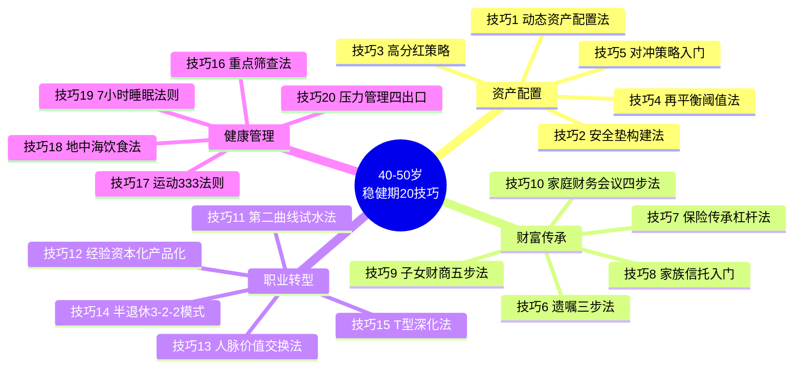

## 五、本章技巧总结

40-50岁是人生财富管理的"稳健期"——你已经完成了原始积累，正处于财富增长的黄金阶段，但同时面临子女教育、父母赡养、职业瓶颈、健康预警等多重压力。本章围绕"稳健"二字，从**资产配置、财富传承、职业转型、健康管理**四大维度提炼了20个核心技巧。

下面先用一张全景图串联所有技巧的逻辑关系，再逐维度梳理核心要点，最后给出一张可执行的落地清单。

### 全景图：20个技巧的逻辑框架

四大维度之间并非孤立的：资产配置为财富传承提供物质基础，职业转型决定收入的可持续性，健康管理则是一切的根基——没有健康，前三个维度全部归零。

### 一、资产配置：从进攻转向防守（技巧1-5）

40-50岁的投资主题是**"守住比赚到更重要"**。五个技巧构成一套完整的防御体系：

| 技巧 | 核心逻辑 | 关键参数 | 适用场景 |
|------|---------|---------|---------|
| 动态资产配置法 | 根据估值和宏观环境灵活调比例 | PE<12加仓，PE>18减仓 | 日常投资管理 |
| 安全垫构建法 | 先保3-5年生活费，再投增长 | 三层结构：1年/2-3年/3-5年 | 应对失业、市场暴跌 |
| 高分红策略 | 用分红现金流替代工资依赖 | 40岁20%→45岁30%→50岁40% | 为退休现金流做准备 |
| 再平衡阈值法 | 偏离目标5%即触发再平衡 | 每季度检查，触发即执行 | 防止单一资产过度集中 |
| 对冲策略入门 | 用负相关资产对冲极端风险 | 黄金5-10%+债券+全球分散 | 黑天鹅事件防御 |

**关键认知升级：**

- **安全垫是"入场券"**。在安全垫未满之前，不要进行高风险投资。安全垫的意义不仅是应对失业，更重要的是让你在市场暴跌时不必被迫割肉卖出——历史数据显示，在市场底部被迫卖出的投资者，平均损失比持有者多出40-60%。
- **高分红策略的核心是"现金流思维"**。40岁开始逐步提高分红资产占比，到50岁时如果分红收入能覆盖基本生活开支的30-50%，你就拥有了"半退休"的物质基础。
- **对冲不是为了赚钱，而是为了"活下来"**。黄金与股票的负相关性在极端市场中最为显著——2008年金融危机期间，标普500下跌37%，黄金上涨5.8%；2020年3月疫情冲击中，标普500下跌34%，黄金仅下跌3.1%。

### 二、财富传承：从"以后再说"到"现在就做"（技巧6-10）

40-50岁是财富传承规划的**最佳窗口期**——你有足够的资产基础，继承人尚未完全独立，时间允许你做出理性安排而非仓促决定。五个技巧覆盖法律、金融、教育三个层面：

**法律层面——遗嘱制定三步法（技巧6）：**

遗嘱不是"写一张纸"那么简单。完整的遗嘱规划包括：
1. **资产清单**：列出所有资产（房产、存款、股票、基金、保险、企业股权）和负债，明确权属。很多家庭的资产登记在一方名下，但实际上是夫妻共同财产，这需要提前厘清。
2. **分配方案**：确定各继承人份额，特别考虑未成年子女的监护安排、需要照顾的家庭成员的特殊需求、以及不同资产类型的税收影响。
3. **法律文件**：找专业律师起草，确保合法有效。公证遗嘱的法律效力最高。家庭状况变化（离婚、再婚、子女出生）时必须更新。

**金融层面——保险杠杆法与家族信托（技巧7-8）：**

- **保险杠杆**：终身寿险用较小的保费撬动较大的保额，实现"以小博大"的传承效果。45岁男性投保100万终身寿险，年缴保费约2-3万，20年总缴40-60万，但身故后受益人获得100万——杠杆比约2-3倍。年金保险则解决退休后的现金流问题。
- **家族信托**：适合资产规模100万以上的家庭。核心价值是"资产隔离"——信托资产独立于委托人的个人资产，不受债务追索、婚姻分割的影响。信托管理费通常为资产的0.5-1%/年，但换来的是专业管理和灵活的分配条件设定。

**教育层面——子女财商培养与家庭财务会议（技巧9-10）：**

- 子女财商培养分五个阶段，从6岁建立金钱意识到22岁后参与家庭财务决策。核心原则是**"让孩子在犯错成本低的时候犯错"**——10岁时亏掉零花钱的教训，远比30岁时亏掉积蓄的教训温和得多。
- 家庭财务会议每季度一次，每次1-2小时，包含"回顾-规划-总结"三步。关键不是讨论金额，而是**建立全家人的财务共识**——当配偶和子女理解家庭的财务目标和约束时，日常的消费决策自然会向目标靠拢。

### 三、职业转型：从"打工思维"到"资产思维"（技巧11-15）

40-50岁的职业风险不是"找不到工作"，而是**"收入单一化带来的脆弱性"**。五个技巧帮助你从"用时间换钱"转向"用资产赚钱"：

**第二曲线试水法（技巧11）的四个阶段：**

| 阶段 | 时长 | 行动 | 关键指标 |
|------|------|------|---------|
| 探索 | 3-6个月 | 研究方向、与行内人交流、参加课程 | 确定2-3个候选方向 |
| 试水 | 6-12个月 | 业余时间接小项目、验证需求 | 有真实付费客户 |
| 加速 | 12-24个月 | 增加投入、建立口碑和客户网络 | 月收入达到主业的20-30% |
| 转型 | 24个月+ | 全职投入（前提是收入达主业50%+） | 覆盖12个月应急基金 |

**经验资本化的四种产品化路径（技巧12）：**

40-50岁最大的资本不是钱，而是**20年的行业经验**。把经验变成产品：
- **课程产品化**：将专业知识录制成系统课程，上线知识付费平台，定价99-999元。
- **咨询产品化**：将咨询服务标准化，制定服务流程和报价，通过个人品牌获客。
- **内容产品化**：写书、做专栏、建个人IP。
- **工具产品化**：将方法论做成模板、清单、SaaS工具，实现规模化收入。

**人脉变现的本质是"价值交换"（技巧13）：**

不是"求人办事"，而是先盘点你的人脉资产（50-100人核心人脉），评估每个人的价值和连接深度，然后**主动帮助别人建立"人情账户"**。最高段位是成为"连接者"——把需要帮助的人连接起来，通过连接创造价值。

**半退休3-2-2模式（技巧14）：**

3天做热爱的工作（咨询、投资、创作），2天陪家人，2天休息和自我提升。前提条件：被动收入覆盖基本生活费的80%以上，应急基金12个月以上，保险保障完善。

**T型深化法（技巧15）：**

纵向在核心领域成为权威（出书、演讲、行业协会），横向学习跨界知识建立独特视角。学习方法：每年50本书、2-3个高质量行业会议、1-2个高端社群、1-2个导师。

### 四、健康管理：财务自由的身体基础（技巧16-20）

健康是"1"，财富是后面的"0"。没有健康，一切归零。40-50岁身体开始出现明显的机能衰退信号，健康管理从"可选"变成"必选"：

**重点筛查法（技巧16）的检查清单：**

| 检查项目 | 频率 | 高风险人群加查 |
|---------|------|---------------|
| 心血管（血压、血脂、心电图、心脏超声） | 每年 | 有家族史者每半年 |
| 胃肠镜 | 每3-5年 | 有息肉史者每1-2年 |
| 肿瘤筛查（肺癌CT、肝癌AFP+超声、肠癌肠镜） | 每年 | 吸烟者加查肺功能 |
| 代谢指标（血糖、尿酸、甲状腺） | 每年 | BMI>25者加查糖化血红蛋白 |
| 骨密度 | 每2年 | 绝经后女性每年 |

**运动333法则（技巧17）：** 每周3次有氧，每次30分钟，心率130。额外每周2次力量训练防肌肉流失，每天10分钟拉伸保持关节灵活。避免高强度对抗性运动，减少受伤风险。

**地中海饮食法（技巧18）：** 多蔬果全谷物，适量鱼类禽类，少红肉加工食品，橄榄油为主。每天5份蔬果，每周2-3次鱼，每周不超过2次红肉，每天一把坚果。

**7小时睡眠法则（技巧19）：** 固定作息（含周末），睡前1小时远离屏幕，卧室保持安静黑暗凉爽，避免睡前饮酒和咖啡。

**压力管理四出口（技巧20）：** 运动（减压最有效）、社交（不要独自扛）、兴趣爱好（与工作无关）、正念冥想（每天10-15分钟）。

### 五、20个技巧的执行优先级

不是所有技巧都需要同时启动。按紧迫性和影响力排序：

| 优先级 | 技巧 | 理由 | 启动建议 |
|--------|------|------|---------|
| **立即执行** | 技巧2 安全垫构建 | 没有安全垫，一切投资都是赌博 | 本月开始，收入的20-30%投入安全垫 |
| **立即执行** | 技巧16 重点筛查 | 健康问题发现越早，成本越低 | 本月预约全面体检 |
| **立即执行** | 技巧6 遗嘱制定 | 意外不会等你准备好 | 本月列出资产清单，咨询律师 |
| **1个月内** | 技巧1 动态配置 | 安全垫到位后优化投资组合 | 评估当前资产配置，制定调整计划 |
| **1个月内** | 技巧17 运动333 | 身体机能每延迟一年恢复难度增加 | 本周开始每周3次快走 |
| **1个月内** | 技巧11 第二曲线试水 | 越早探索，试错成本越低 | 本周列出3个可能的第二曲线方向 |
| **1-3个月** | 技巧7 保险传承 | 年龄越大保费越贵 | 对比3家保险公司的终身寿险产品 |
| **1-3个月** | 技巧4 再平衡阈值 | 配置优化的持续机制 | 设定各资产目标比例，开始季度检查 |
| **1-3个月** | 技巧9 子女财商 | 越早开始越好 | 本周和孩子做一次"家庭购物决策" |
| **3-6个月** | 其余11个技巧 | 逐步推进，不要贪多 | 每月重点落实1-2个技巧 |

### 六、常见误区与纠正

| 误区 | 纠正 |
|------|------|
| "我还年轻，不需要保守投资" | 40岁后恢复亏损的时间窗口急剧缩短——亏50%需要涨100%才能回本 |
| "遗嘱是老年人的事" | 意外不分年龄，有资产就应该有遗嘱 |
| "转型意味着放弃主业" | 第二曲线试水法的核心是"先验证再投入"，不是裸辞 |
| "健康管理就是每年体检" | 体检是发现手段，运动、饮食、睡眠、压力管理才是预防手段 |
| "人脉变现就是求人办事" | 人脉变现的本质是价值交换，先提供价值再获取回报 |
| "家族信托是有钱人的事" | 100万起就可以设立，关键是资产隔离和分配控制的法律价值 |

### 七、关键行动清单

掌握理论之后，关键是**立刻行动**。以下是本月就能完成的五件事：

1. **列出完整资产清单**：打开银行APP、券商APP、保险APP，逐一列出所有资产和负债，计算净资产。这是一切财务规划的起点。
2. **预约全面体检**：如果超过12个月没有体检，今天就预约。重点加查心血管和肿瘤筛查。
3. **开立安全垫专用账户**：在银行开一个独立账户，设置每月自动转入收入的20-30%。
4. **列出3个第二曲线方向**：回顾你20年的经验，哪些领域你有独特见解？哪些技能可以产品化？
5. **和家人开一次财务会议**：不需要正式，饭桌上聊一聊家庭的财务目标和计划就够了。

> **稳健期的核心智慧：不是赚更多，而是不要亏。不是跑更快，而是跑更远。40-50岁的每一步决策，都在为60岁以后的生活质量投票。**
