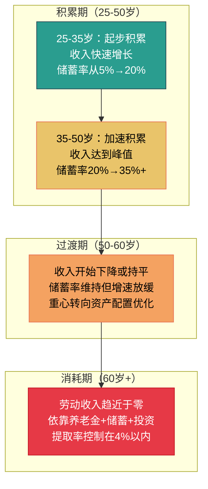
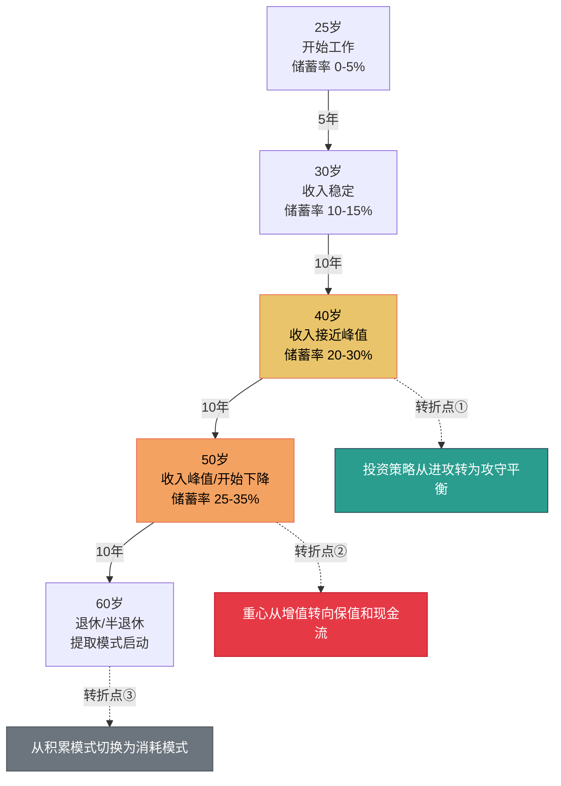
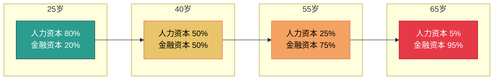
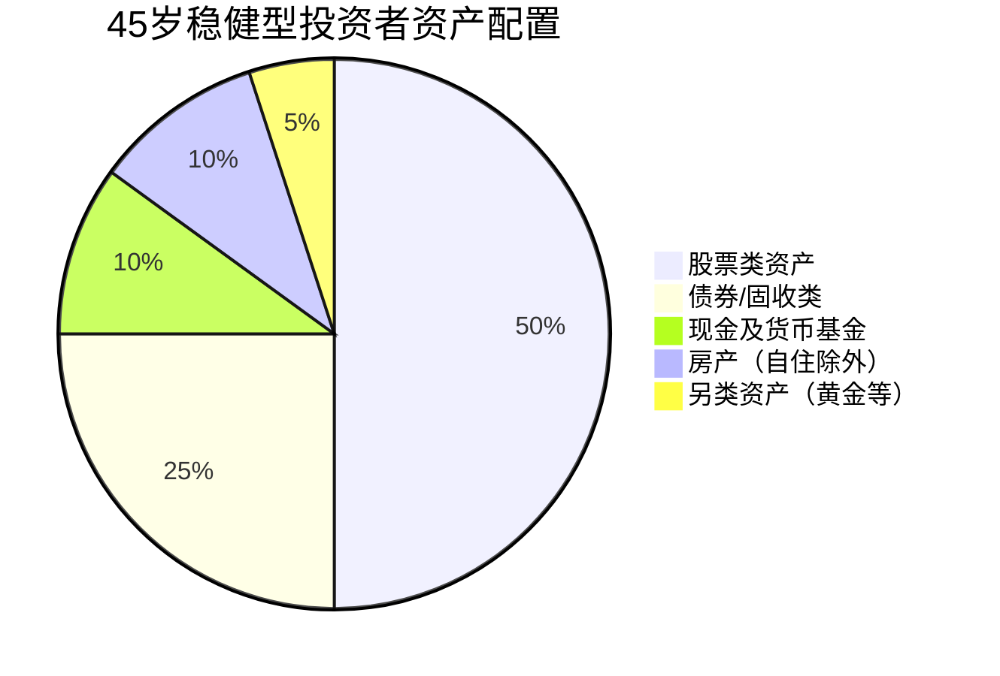
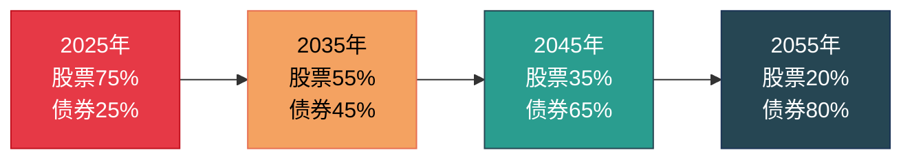
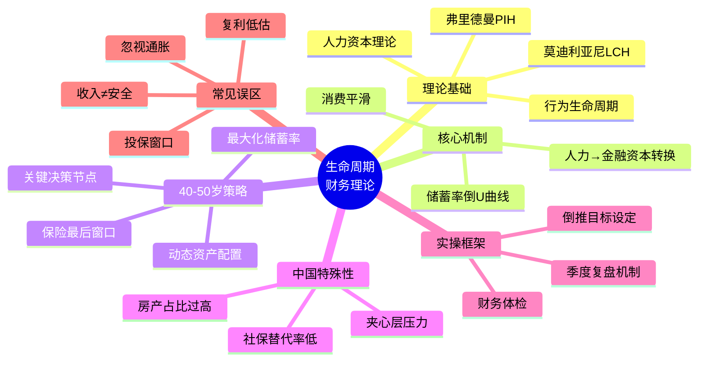

## 一、生命周期财务理论

> **核心命题**：人的一生可以被抽象为一条"收入—支出—储蓄"的动态曲线。20-30岁是投资期（支出>收入，靠借贷或家庭支持），30-50岁是积累期（收入>支出，储蓄快速膨胀），50岁以后是消耗期（收入下降，靠积累维持生活）。生命周期财务理论的核心洞见是：**你不应该在每个年龄段都追求"收支平衡"，而应该在整条生命曲线上实现"跨期平滑"——在赚钱最多的年份多存、多投、多布局，为赚钱变少的年份提前买单。** 40-50岁恰好处于积累期的后半段，是从"财富增长"切换到"财富守护"的关键转折点。理解这套理论，你才能跳出"今年赚了多少"的短视框架，用一生的视角规划财务。

### 1.1 理论溯源：从莫迪利亚尼到现代个人理财

#### 1.1.1 生命周期假说的诞生

生命周期假说（Life-Cycle Hypothesis, LCH）由诺贝尔经济学奖得主弗兰科·莫迪利亚尼（Franco Modigliani）和理查德·布伦伯格（Richard Brumberg）于1954年提出。这一理论的出发点是一个朴素但深刻的问题：**人们是如何决定花多少钱、存多少钱的？**

在LCH之前，凯恩斯的绝对收入假说认为消费取决于当期收入——你赚得多就花得多，赚得少就花得少。但现实中人们的行为远比这复杂：一个刚毕业的医学生收入很低却敢贷款买车，一个中年高管收入很高却过着相对节俭的生活，一个退休老人收入大减却依然维持不错的消费水平。这些现象用"当期收入决定消费"解释不通。

莫迪利亚尼的突破在于：**人们不是根据"今天赚多少"来决定消费，而是根据"一辈子能赚多少"来安排消费。** 理性的人会在年轻时预支未来的收入（贷款读书、按揭买房），在中年时大量储蓄（为退休做准备），在老年时消耗储蓄（维持生活水平）。消费的平滑化（consumption smoothing）才是人类经济行为的核心动机。


#### 1.1.2 核心公式与数学直觉

LCH可以用一个简洁的公式表达一个人一生的预算约束：

**一生总消费 = 一生总收入 + 初始财富 - 遗产**

用数学语言表达：

$$\sum_{t=1}^{T} C_t = \sum_{t=1}^{R} Y_t + W_0 - B_T$$

其中：
- $C_t$：第 $t$ 年的消费
- $Y_t$：第 $t$ 年的劳动收入（工作到 $R$ 年退休）
- $W_0$：初始财富（继承、已有储蓄等）
- $B_T$：留给后代的遗产
- $T$：预期寿命

这个公式的直觉是：**你一辈子能花的钱是一个固定的总量，问题只是怎么在时间轴上分配。** 中年赚得多的时候少花一点、多存一点，退休后才能维持体面的生活。

#### 1.1.3 莫迪利亚尼 vs 弗里德曼：两种视角的互补

米尔顿·弗里德曼（Milton Friedman）在1957年提出了"永久收入假说"（Permanent Income Hypothesis, PIH），与LCH形成互补：

| 维度 | 生命周期假说（LCH） | 永久收入假说（PIH） |
|:---:|:---|:---|
| **核心变量** | 年龄与生命周期阶段 | 永久收入（长期平均收入） |
| **关注焦点** | 不同人生阶段的储蓄/消费分配 | 当期收入中哪些是持久的、哪些是暂时的 |
| **储蓄动机** | 为退休和老年做准备 | 平滑暂时性收入波动 |
| **政策含义** | 社会保障制度影响储蓄行为 | 减税刺激消费效果有限（临时收入不改变消费） |
| **对40-50岁的启示** | 此阶段应最大化积累，为消耗期做准备 | 区分"持久收入"和"暂时收入"，不要因短期高收入而过度消费 |

两套理论的共同结论是：**消费不应该追随当期收入的波动，而应该基于长期收入预期做出平滑安排。** 对40-50岁的人而言，这意味着即使当前收入很高，也要考虑收入可能在55-60岁后大幅下降的风险。

#### 1.1.4 现代理论的发展：从学术假说到个人理财框架

LCH诞生70年来，后续学者做了大量修正和扩展：

**行为生命周期假说（Shefrin & Thaler, 1988）**：引入行为经济学视角，指出人并非完全理性——人们存在"心理账户"（mental accounting），会把钱分成"当前收入""当前资产""未来收入"三个心理账户，对不同账户的消费倾向不同。这解释了为什么很多人明明"理论上"应该多储蓄，却总是存不下钱——他们把年终奖当成"意外之财"随手花掉了。

**引入不确定性**：原始LCH假设人对自己的寿命、收入、投资回报有完美预期，这显然不现实。后续研究加入了健康冲击、失业风险、寿命不确定性等因素，结论是：**不确定性越高，理性人应该储蓄越多。** 40-50岁面临的职业不确定性（中年危机、行业变迁）和健康不确定性（慢性病高发期）使得"多储蓄"变得更加重要。

**代际转移支付**：原始LCH假设遗产为零，但实际上很多中国家庭存在大量代际转移——父母帮子女买房、子女赡养老人。这意味着40-50岁的人不仅需要为自己的退休储蓄，还需要为子女的教育和购房、父母的医疗和养老预留资金。在中国语境下，这个"夹心层"压力是西方LCH模型没有充分考虑的。

### 1.2 生命周期的财务曲线：理论模型

#### 1.2.1 经典三阶段模型

生命周期理论将人的一生财务状况划分为三个核心阶段：



**积累期（25-50岁）**：这是人生中劳动收入超过消费支出的阶段。前期收入增长快但基数低，储蓄绝对值有限；后期收入增速放缓但基数高，储蓄绝对值大幅增加。这个阶段的核心任务是**尽可能多地积累可投资资产**。

**过渡期（50-60岁）**：收入增长基本停滞或开始下降（职业天花板、行业衰退、体力下降），但距离退休还有5-15年。这个阶段的核心任务是**优化资产配置，降低风险敞口，确保积累期的成果不会因一次市场崩盘而缩水**。

**消耗期（60岁以后）**：劳动收入大幅下降（退休、半退休），开始依赖养老金、投资收益和储蓄过日子。这个阶段的核心任务是**控制提取速率，确保"钱不会先于人花完"**。

#### 1.2.2 40-50岁的特殊位置：从"增长型"到"守护型"的转折点

40-50岁在生命周期财务曲线中处于一个独特的位置——它是**积累期的后半段**，也是**从"增长型思维"切换到"守护型思维"的转折窗口**。

这个位置的特殊性体现在四个维度：

**维度一：收入接近峰值但增长放缓**

根据国家统计局和各大招聘平台的数据，中国城镇职工的收入中位数在40-50岁区间达到峰值。但与30-40岁相比，增速明显放缓：

| 年龄段 | 收入增速（年均） | 收入基数 | 储蓄增量贡献 |
|:---:|:---:|:---:|:---:|
| 30-35岁 | 10-15% | 中等 | 基数低但增速快，增量中等 |
| 35-40岁 | 7-12% | 中高 | 基数和增速双高，增量最大 |
| 40-45岁 | 4-8% | 高 | 基数高但增速放缓，增量开始下降 |
| 45-50岁 | 2-5% | 峰值附近 | 基数最高但增速很低，增量主要靠储蓄率 |

**维度二：支出压力达到人生峰值**

40-50岁往往是"上有老下有小"的夹心期：子女教育支出进入高峰（高中/大学阶段）、父母医疗支出快速增加、自身健康维护成本上升。这意味着**收入增长放缓的同时，支出压力反而在增加**，储蓄的"挤出效应"最强。

**维度三：风险承受能力从高转低**

30岁时投资亏损50%，你还有30年时间恢复；45岁投资亏损50%，距离退休只有15-20年，恢复时间窗口大幅缩小。随着年龄增长，**风险承受能力（risk capacity）在下降，即使风险偏好（risk appetite）没有变化**。这是资产配置必须随年龄调整的根本原因。

**维度四：复利效应的时间窗口在收窄**

如果40岁开始投资100万，按年化8%计算：
- 到50岁（10年）：约216万
- 到60岁（20年）：约466万
- 到70岁（30年）：约1006万

如果30岁就开始，同样的100万到60岁是1006万。**晚10年开始，终值减少一半以上。** 40-50岁是复利效应还能充分发挥作用的最后窗口——错过了这个窗口，即使投入更多本金，效果也会大打折扣。

#### 1.2.3 财务生命周期的关键转折点



**转折点①（40岁左右）**：资产配置从"高成长"转向"攻守平衡"。股票仓位从70-80%逐步降低到50-60%，债券和固收类资产比例提升。这不是"保守"，而是"理性"——因为你的恢复时间窗口在缩短。

**转折点②（50岁左右）**：财务重心从"资产增值"转向"现金流构建"。开始大量配置能产生稳定现金流的资产（债券利息、股息分红、租金收入、年金保险），为退休后的生活做准备。

**转折点③（60岁左右）**：正式进入消耗模式。核心问题是"提取速率"——每年能从投资组合中取出多少钱而不至于"人还在，钱没了"。经典的4%法则（每年提取组合市值的4%）提供了一个粗略的安全线。

### 1.3 核心机制：跨期平滑与约束优化

#### 1.3.1 消费平滑：为什么要跨期分配

消费平滑（consumption smoothing）是LCH的核心行为假设。它的经济学解释基于**边际效用递减**：

- 当你年收入5万时，多1万元带来的幸福感极大（能吃饱饭、交房租）
- 当你年收入50万时，多1万元带来的幸福感很小（只是多买一件衣服或吃一顿大餐）
- 当你年收入5万时，少1万元带来的痛苦极大（可能交不起房租）

因此，理性人会**把高收入年份的"边际效用低"的那部分钱，转移到低收入年份使用**，使一生的总效用最大化。

**通俗类比**：想象你有一个水池（代表一生的财富），有一根进水管（代表劳动收入）和一根出水管（代表消费）。进水管的流量在40-50岁时最大，之后逐渐减小。如果你在进水管流量最大时就把水全部放掉（全部消费），等进水管流量减小时，水池就干了。正确的做法是：**在进水管流量最大时多蓄水，让水池的水位足够高，这样即使进水管几乎关闭，你依然有足够的水可用。**

#### 1.3.2 储蓄率的生命周期曲线

基于LCH的推导，一个人一生的储蓄率曲线应该是"倒U形"：

| 人生阶段 | 典型储蓄率 | 原因 |
|:---:|:---:|:---|
| 22-28岁 | 0-10% | 收入低，刚性支出占比高（房租、交通、基本生活），部分人储蓄率为负（靠父母补贴或借贷） |
| 28-35岁 | 10-20% | 收入增长快于消费增长，但购房、结婚等大额支出集中 |
| 35-45岁 | 20-35% | 收入接近峰值，房贷压力开始缓解，储蓄能力最强 |
| 45-55岁 | 25-40% | 收入峰值区间，子女教育支出可能开始减少（大学毕业），储蓄能力达到一生最高 |
| 55-65岁 | 15-30% | 收入开始下降，但生活支出也可能减少（房贷还清、子女独立） |
| 65岁+ | 负值（消耗储蓄） | 劳动收入趋近于零，依靠养老金+投资收益+储蓄消耗 |

**40-50岁正处于储蓄率曲线的峰值区间。** 这意味着这个年龄段的人，理论上应该有一生中最强的储蓄能力。如果你在这个阶段储蓄率低于20%，要么是收入没有达到应有的水平，要么是支出失控了——两者都需要立即干预。

#### 1.3.3 人力资本与金融资本的转换

LCH的一个重要扩展是**人力资本（human capital）**概念。人力资本是你未来所有劳动收入的现值——本质上是你"赚钱能力"的金融化表达。

- **25岁**：人力资本很高（未来35年的收入），金融资本很低（刚工作没几年）
- **40岁**：人力资本和金融资本大致平衡（还有20年工作时间，同时已经积累了一定金融资产）
- **55岁**：人力资本大幅下降（只有5-10年工作时间），金融资本应该已经很高
- **65岁**：人力资本趋近于零（退休），金融资本是唯一的财富来源

**40-50岁的核心任务是：加速人力资本向金融资本的转换。** 具体来说：

1. **利用高收入时期的储蓄能力**，将劳动收入转化为投资资产
2. **投资于能提升人力资本的事项**（健康管理、技能更新、人脉维护），延长高收入窗口
3. **建立"金融资本替代人力资本"的里程碑**——当投资收益能够覆盖基本生活支出时，你就获得了"财务自由度"，不再完全依赖工资



### 1.4 40-50岁的生命周期财务策略

#### 1.4.1 三大核心财务指标

基于LCH理论，40-50岁的人应该关注三个核心指标：

**指标一：储蓄率（Savings Rate）**

储蓄率 = （税后收入 - 总支出）/ 税后收入

| 储蓄率 | 评级 | 含义 |
|:---:|:---:|:---|
| <10% | 危险 | 几乎没有积累能力，退休准备严重不足 |
| 10-20% | 及格 | 基本积累能力，但退休准备可能不够充分 |
| 20-30% | 良好 | 具备稳健的积累能力，退休准备基本充足 |
| 30-40% | 优秀 | 强大的积累能力，可以提前退休或实现财务自由 |
| >40% | 卓越 | 极强的积累能力，有望在55岁前实现财务自由 |

**指标二：财务自由度（Financial Freedom Ratio）**

财务自由度 = 被动收入 / 基本生活支出

- 被动收入：投资收益、租金收入、版税、分红等不依赖劳动的收入
- 基本生活支出：维持基本生活所需的最低月支出

| 财务自由度 | 含义 |
|:---:|:---|
| <0.2 | 完全依赖工资，任何收入中断都会造成危机 |
| 0.2-0.5 | 有一定缓冲，但无法承受长期失业 |
| 0.5-0.8 | 接近财务半自由，可以承受1-2年的收入中断 |
| 0.8-1.0 | 即将达到财务自由，工作变成"选择"而非"必须" |
| >1.0 | 已实现财务自由，工作完全出于兴趣 |

**指标三：财务安全垫（Financial Safety Net）**

财务安全垫 = 可流动资产 / 月支出

这个指标衡量的是"如果所有收入突然中断，你能维持多久"。

| 安全垫月数 | 评级 | 含义 |
|:---:|:---:|:---|
| <3个月 | 极度脆弱 | 一次意外就可能陷入财务危机 |
| 3-6个月 | 及格 | 可以应对短期失业，但长期风险很大 |
| 6-12个月 | 良好 | 有充足的时间寻找新机会，不会被迫接受差的选择 |
| 12-24个月 | 优秀 | 可以从容应对职业转型、创业尝试等重大决策 |
| >24个月 | 卓越 | 拥有极高的财务自由度，可以按自己的节奏生活 |

#### 1.4.2 资产配置的生命周期调整

LCH理论的一个重要实践推论是：**资产配置应该随年龄动态调整**。核心逻辑是随着年龄增长，人力资本下降、风险承受能力降低，投资组合应该从"进攻型"转向"防守型"。

**经典年龄-股票比例法则：**

最简单的版本是"100法则"：股票占比 = 100 - 年龄。例如45岁的人，股票占55%，其余为债券和固收。

更精细的版本考虑了个体差异：

| 因素 | 偏向进攻（+股票比例） | 偏向防守（-股票比例） |
|:---|:---|:---|
| 收入稳定性 | 公务员、事业编、大型企业 | 自由职业、创业、销售岗位 |
| 家庭负担 | 无子女或子女已独立 | 有未成年子女或赡养老人 |
| 健康状况 | 良好，无慢性病 | 有慢性病或健康风险 |
| 投资经验 | 10年以上，经历过牛熊 | 新手，未经历过大级别回撤 |
| 财务自由度 | >0.5 | <0.3 |

**40-50岁的推荐配置框架：**



| 资产类别 | 40-45岁占比 | 45-50岁占比 | 作用 |
|:---|:---:|:---:|:---|
| 股票类（A股+港股+美股） | 55-65% | 45-55% | 长期增值引擎 |
| 债券/固收类 | 20-25% | 25-30% | 稳定收益，降低波动 |
| 现金及货币基金 | 8-12% | 10-15% | 流动性储备，应急资金 |
| 房产投资 | 5-10% | 5-10% | 租金收入+抗通胀 |
| 黄金及另类资产 | 3-5% | 3-5% | 对冲极端风险 |

#### 1.4.3 关键决策节点

40-50岁期间有几个关键的财务决策节点，每一个都可能对后半生产生深远影响：

**节点一：子女教育投资的边界（40-48岁）**

子女教育是这个阶段最大的"软性"支出。LCH理论的启示是：**教育投资不应该以牺牲父母的退休准备为代价。** 如果供子女出国留学会导致父母退休储蓄不足，那就需要重新评估——子女可以申请奖学金、助学贷款、打工，但父母的退休无法"贷款"。

**节点二：父母赡养的财务准备（42-55岁）**

父母进入70-80岁高龄期，医疗和护理支出可能急剧增加。建议在42-48岁期间就开始为父母建立专项医疗基金，而不是等到父母生病时才临时筹钱。

**节点三：职业转型的财务缓冲（45-52岁）**

如果计划在45-50岁进行职业转型（创业、换行业、提前退休），需要提前3-5年开始积累"转型基金"——通常是1-2年的生活支出。没有足够的财务缓冲就贸然转型，失败的概率极高。

**节点四：保险配置的最后窗口（40-50岁）**

50岁以后，重疾险和寿险的保费会急剧上升，部分产品甚至无法投保。40-50岁是配置充足保险的最后窗口。核心配置：

| 保险类型 | 保额建议 | 说明 |
|:---|:---:|:---|
| 重疾险 | 年收入×5-10倍 | 覆盖治疗费用+康复期收入损失 |
| 定期寿险 | 家庭负债+5年生活费 | 覆盖房贷+子女教育+配偶过渡期 |
| 医疗险（百万医疗） | 200-400万 | 覆盖大额医疗费用 |
| 意外险 | 100-200万 | 杠杆率高，保费低 |

### 1.5 中国语境下的特殊考量

#### 1.5.1 社会保障体系的影响

中国的社保体系（养老保险+医疗保险）与西方国家有显著差异，这直接影响LCH模型的参数：

**养老金替代率偏低**：中国城镇职工基本养老金的替代率（退休后养老金/退休前工资）约为40-45%，远低于OECD国家平均的60-70%。这意味着仅靠社保养老金，退休后的生活水平将大幅下降。**个人必须在工作年限内额外积累足够的补充养老金。**

**医保覆盖存在缺口**：虽然基本医保覆盖面广，但大病、慢性病、进口药、自费项目的覆盖有限。40-50岁正是慢性病开始显现的年龄段，需要提前准备医疗储备金。

**延迟退休趋势**：中国正在逐步推行延迟退休政策。这意味着"消耗期"的起点在推迟，理论上给了更多积累时间，但也意味着身体能否支撑到延迟后的退休年龄存在不确定性。

#### 1.5.2 "夹心层"压力：中国家庭的代际财务负担

与西方家庭相比，中国40-50岁人群面临更重的代际财务负担：

| 支出项目 | 中国家庭特征 | 对财务规划的影响 |
|:---|:---|:---|
| 子女教育 | 内卷严重，课外培训、留学费用高 | 需要提前10-15年开始教育基金积累 |
| 子女购房 | 婚房文化，父母常需资助首付 | 可能需要50-100万+的一次性支出 |
| 父母赡养 | 养老金不足，家庭养老为主 | 需要为每位老人准备20-50万医疗/护理基金 |
| 人情往来 | 社交文化浓厚，礼金支出不低 | 年均1-5万的隐性支出 |

**关键原则**：在为子女和父母"输血"之前，先确保自己的"造血系统"足够强。飞机上的安全提示说得好——先给自己戴好氧气面罩，再帮助他人。

#### 1.5.3 房产在中国生命周期财务中的特殊角色

房产在中国家庭资产中的占比通常超过60%，远高于发达国家的30-40%。这带来两个特殊问题：

**资产流动性差**：大部分财富被"锁"在房产里，无法快速变现应对突发需求。40-50岁应该有意识地增加流动资产（股票、基金、存款）的占比，避免"资产千万、现金十万"的窘境。

**房产增值预期需要修正**：过去20年中国房价的高速增长可能不会在未来20年重现。40-50岁的人不应该把退休计划建立在"房产还会继续大涨"的假设上。如果自住以外还有多余房产，需要认真评估"持有房产"vs"卖出房产+投资其他资产"的收益风险比。

### 1.6 实操框架：基于LCH的五年财务规划

#### 1.6.1 第一步：财务体检

在制定任何计划之前，先搞清楚自己的"生命曲线"目前处于什么位置：

```text
个人财务体检清单
================

一、资产清点
  ├─ 流动资产：现金、存款、货币基金 = _____ 万元
  ├─ 投资资产：股票、基金、债券、理财 = _____ 万元
  ├─ 固定资产：房产市值、车辆残值 = _____ 万元
  ├─ 保险资产：现金价值、年金账户 = _____ 万元
  └─ 其他资产：收藏品、知识产权等 = _____ 万元

二、负债清点
  ├─ 房贷余额 = _____ 万元，月供 _____ 元
  ├─ 车贷余额 = _____ 万元，月供 _____ 元
  ├─ 信用卡/消费贷 = _____ 万元
  └─ 其他负债 = _____ 万元

三、收支分析（月度）
  ├─ 税后月收入（工资+奖金均摊+其他）= _____ 元
  ├─ 固定支出（房贷/房租+保险+教育+赡养）= _____ 元
  ├─ 弹性支出（生活+交通+娱乐+购物）= _____ 元
  └─ 月储蓄 = 收入 - 固定支出 - 弹性支出 = _____ 元

四、关键指标计算
  ├─ 净资产 = 总资产 - 总负债 = _____ 万元
  ├─ 储蓄率 = 月储蓄 / 月收入 = _____ %
  ├─ 财务安全垫 = 流动资产 / 月支出 = _____ 个月
  ├─ 财务自由度 = 被动收入 / 基本月支出 = _____ 
  └─ 负债率 = 总负债 / 总资产 = _____ %
```

#### 1.6.2 第二步：目标设定——用倒推法规划

基于LCH的核心思想，财务目标的设定应该采用**倒推法**：从退休后需要多少生活费开始，倒推现在应该储蓄多少。

**计算示例**：

假设：当前40岁，计划60岁退休，预期寿命85岁，退休后月支出1.5万元（现值），通胀率3%。

```text
Step 1：计算退休时的月支出（考虑通胀）
  退休时月支出 = 1.5万 × (1.03)^20 ≈ 2.71万元

Step 2：计算退休后总支出（25年）
  假设投资收益率5%，通胀3%，实际收益率 ≈ 2%
  退休后总支出现值 ≈ 2.71万 × 12 × 25 × 0.78（折现因子）≈ 634万元

Step 3：扣除社保养老金
  假设社保养老金替代率40%，退休后月养老金 ≈ 2.71万 × 40% = 1.08万元
  需自行补充的月支出 = 2.71 - 1.08 = 1.63万元
  需自行准备的总额 ≈ 1.63万 × 12 × 25 × 0.78 ≈ 381万元

Step 4：倒推当前需要的年储蓄额
  距退休20年，假设投资年化收益6%
  每年需储蓄 = 381万 / 33.06（年金终值系数）≈ 11.5万元
  月储蓄 ≈ 9,600元
```

**这意味着如果当前月收入3万元，每月至少需要储蓄9,600元（储蓄率32%）才能在60岁退休后维持接近退休前的生活水平。**

#### 1.6.3 第三步：执行——年度计划与季度复盘

| 时间维度 | 执行内容 | 关注重点 |
|:---|:---|:---|
| 年初 | 制定全年储蓄目标、投资计划、保险检查 | 目标是否合理，与整体规划是否一致 |
| 每月 | 自动转账储蓄、检查账单、记录支出 | 储蓄率是否达标，有无异常支出 |
| 每季度 | 投资组合再平衡、指标复盘 | 资产配置是否偏离目标，指标是否改善 |
| 年中 | 重大决策评估（购房、教育、职业变动） | 是否在预算范围内，是否影响长期规划 |
| 年末 | 全面财务复盘，调整下年计划 | 净资产增长率、储蓄率、自由度变化 |

### 1.7 常见误区与纠正

#### 误区一："我还年轻，以后再存钱"

**错误根源**：低估复利的时间价值。

**真实数据**：假设投资年化收益7%：
- A从25岁开始每月存2000元，到60岁拥有约340万
- B从40岁开始每月存4000元（A的两倍），到60岁拥有约207万

B投入的本金是A的1.38倍，但最终资产只有A的61%。**时间比金额更重要。** 如果你已经40岁还没开始，现在就是最好的时机——再等下去差距只会更大。

#### 误区二："收入高=财务安全"

**错误根源**：混淆了收入与净资产。

一个年入百万但月光的人，财务安全性远不如一个年入30万但储蓄率40%的人。**真正的财务安全来自净资产和被动收入，而不是工资收入。** 工资收入是"你为钱工作"，被动收入是"钱为你工作"——40-50岁应该加速从前者向后者切换。

#### 误区三："投资收益能解决一切问题"

**错误根源**：高估投资回报率，低估支出增长。

很多人寄希望于"靠投资翻倍"来实现财务自由。但现实中，长期年化收益率超过10%已经是顶尖水平，而且波动很大。**财务规划的基础应该是"储蓄率"和"支出控制"，投资收益只是锦上添花。** 先确保你能存下足够的钱，再考虑如何让存下的钱增值。

#### 误区四："保险是浪费钱"

**错误根源**：只看到保费支出，没看到风险敞口。

一个45岁、年入80万、有200万房贷的人，如果突然患重病：
- 直接医疗费用：50-100万
- 2-3年无法工作的收入损失：160-240万
- 房贷断供风险：200万
- 总风险敞口：400-540万

一份年缴1.5万的重疾险+医疗险组合可以覆盖大部分风险。**保费不是"花掉的钱"，而是"为不确定性支付的对价"。** 40-50岁是健康险投保的最后窗口，错过这个窗口，要么保费极高，要么直接被拒保。

#### 误区五："把所有钱都存银行最安全"

**错误根源**：忽视通货膨胀的侵蚀。

假设年通胀率3%，100万现金在20年后的实际购买力只有约55万。**不做投资的"安全"其实是"确定会亏损"。** 当然，投资需要承担波动风险，但合理的资产配置可以在控制波动的同时获得超越通胀的回报。

### 1.8 进阶内容：生命周期理论的前沿发展

#### 1.8.1 目标日期基金（Target Date Fund）

目标日期基金是LCH理论在金融产品中最直接的应用。投资者选择一个"目标退休年份"（如2040），基金会自动随时间推移调整股债比例——早期偏股（进攻），后期偏债（防守）。



国内公募基金市场已有多只目标日期基金（如华夏、易方达、南方等公司的养老目标基金），适合没有时间或能力自己做资产配置再平衡的投资者。

#### 1.8.2 蒙特卡洛模拟：量化"钱够不够"的概率

传统的财务规划用"假设收益率=X%"来计算结果，但现实中收益率是波动的。蒙特卡洛模拟通过数千次随机模拟来回答一个更实用的问题：**在不同投资策略下，我退休后"钱够花"的概率是多少？**

一个合理的标准是：**至少90%的模拟结果中，你的钱能撑到预期寿命。** 如果概率低于80%，说明要么需要提高储蓄率，要么需要降低退休后的支出预期，要么需要延迟退休。

#### 1.8.3 人力资本管理：40-50岁的"第二曲线"

LCH理论告诉我们人力资本会随年龄下降，但这个下降速度可以通过主动管理来减缓：

**延长职业寿命**：通过健康管理（定期体检、运动、饮食控制）和技术更新（学习新工具、保持行业敏感度），将高收入窗口从55岁延长到60岁甚至更远。

**开发"第二曲线"收入**：在主业收入开始放缓时，启动第二收入来源——咨询、培训、写作、投资。这些收入往往不依赖体力和时间投入，可以在主业退出后继续产生现金流。

### 1.9 本节总结



**一句话总结**：生命周期财务理论的核心，是用"一生的视角"而非"一年的视角"来管理财富。40-50岁是这条生命曲线上储蓄能力最强、但可用来积累的时间窗口正在收窄的关键阶段——你现在做的每一个财务决策，都在直接定义退休后的生活质量。**不要等到55岁才开始焦虑，40岁就开始按照生命周期理论系统规划，你还有足够的时间和能力为自己构建一个不会塌陷的财务未来。**
