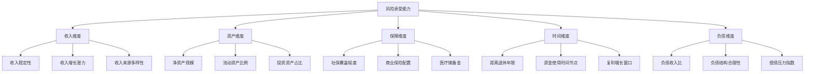
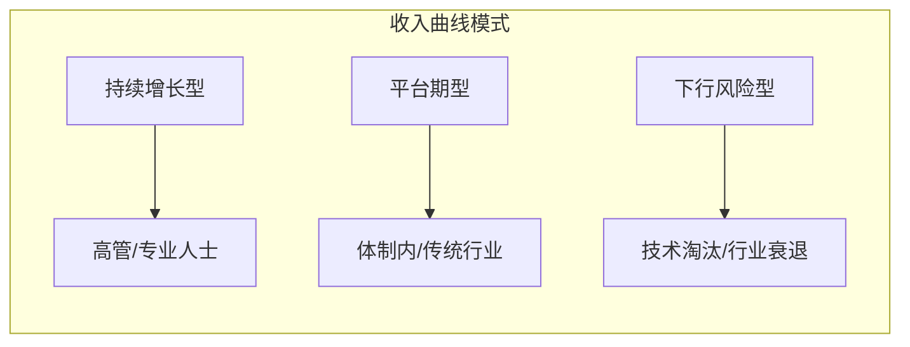
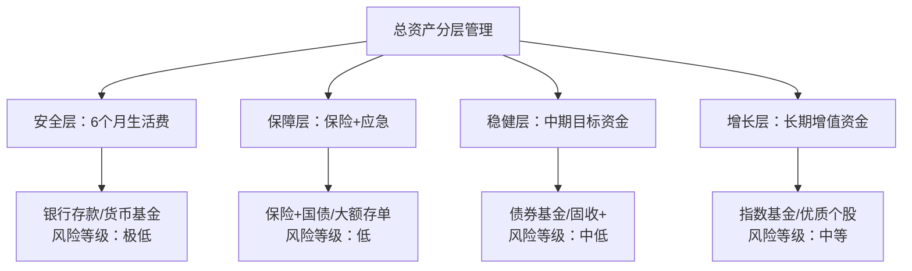

## 二、风险承受能力的变化

40-50岁是风险承受能力发生深刻转变的十年。与20多岁时"大不了从头再来"的心态不同，这个阶段的财务决策牵一发而动全身——上有年迈父母需要赡养，下有子女教育支出攀升，中有房贷车贷尚未清偿，还有自身职业天花板和健康隐忧。理解风险承受能力在这个阶段如何变化、为什么变化、以及如何应对这些变化，是制定合理财务策略的理论基石。

### 1. 风险承受能力的双维度模型

风险承受能力并非单一指标，而是由两个相互独立又彼此关联的维度构成：

**风险承受能力 = 风险承受意愿（意愿维度） + 风险承受能力（能力维度）**

很多人把"愿意承担风险"等同于"能够承担风险"，这是40-50岁群体最常见的认知误区之一。一个中年投资者可能因为过去的投资成功经验而信心满满，主观上愿意继续重仓股票，但其客观的财务状况——比如负债率偏高、收入来源单一、子女留学费用逼近——可能已经无法支撑这种激进策略。

#### 1.1 风险承受意愿（Risk Willingness）

风险承受意愿是心理层面的主观判断，受性格特质、过往经验、知识水平和社会环境等因素影响。40-50岁群体的风险承受意愿通常呈现以下规律：

| 影响因素 | 方向 | 机制说明 |
|---------|------|---------|
| 过往投资经历 | 双向放大 | 有过成功经历者更愿意承担风险；有过亏损经历者趋向保守 |
| 金融知识水平 | 正相关 | 理解风险收益关系的人更能接受合理风险 |
| 社会比较心理 | 负向影响 | 同龄人财富攀比容易导致非理性冒险或过度保守 |
| 年龄焦虑 | 负相关 | "时间不多了"的心态会压制风险承担意愿 |
| 家庭责任 | 负相关 | 赡养和抚养压力使人本能趋向保守 |

#### 1.2 风险承受能力（Risk Capacity）

风险承受能力是客观层面的财务弹性，由收入稳定性、资产规模、负债水平、保险覆盖、时间跨度等因素决定。这是可以量化计算的，也是制定投资策略时真正应该依赖的依据。



#### 1.3 意愿与能力的错配

当意愿和能力不匹配时，就会产生财务风险：

- **意愿 > 能力**：过度冒险型——用超出自身承受范围的资金去搏高收益，一旦市场下行可能陷入财务危机。典型表现是40多岁的人仍然把80%以上的资产放在高波动性投资中，没有考虑家庭的刚性支出需求。
- **意愿 < 能力**：过度保守型——明明有足够的财务缓冲，却因为恐惧而把资金全部放在低收益产品中，长期跑不赢通胀，实际上是"用确定性的方式亏损"。
- **意愿 ≈ 能力**：理想状态——投资组合既匹配客观的财务约束，又能让投资者安然入睡。

40-50岁的核心任务是定期校准这两个维度，确保它们大致同步。

### 2. 40-50岁风险承受能力变化的五大驱动力

#### 2.1 生理衰老与健康风险上升

40岁之后，人体机能开始不可逆地衰退。根据中国国家癌症中心的数据，40-49岁年龄段的癌症发病率是30-39岁的2.5倍，心脑血管疾病的发病率也显著上升。这些生理变化通过两条路径影响风险承受能力：

**直接影响**：健康问题可能带来大额医疗支出，直接削弱财务弹性。一场重大疾病的直接医疗费用（不含收入损失）在中国一线城市通常在30-80万元之间，如果需要进口药物或海外就医，费用可能超过200万元。

**间接影响**：健康焦虑会降低风险容忍度。当一个人开始意识到自己的身体不再像年轻时那样"抗造"，他在财务决策上也会变得更加谨慎——这种心理迁移几乎是无意识的。

**量化评估框架**：

```text
健康风险调整系数 = 基础风险承受能力 × (1 - 健康风险折扣率)

健康风险折扣率参考：
- 无慢性病、家族病史良好：0.05
- 有轻微慢性病（如轻度高血压）：0.10-0.15
- 有中度慢性病（如糖尿病）：0.15-0.25
- 有重大疾病史或高风险家族病史：0.25-0.40
```

#### 2.2 收入曲线的拐点效应

40-50岁的收入曲线通常呈现三种模式：



| 收入模式 | 典型人群 | 风险承受能力变化 | 应对策略 |
|---------|---------|----------------|---------|
| 持续增长型 | 企业高管、资深律师、医生 | 短期内风险承受能力仍在提升，但需警惕"高峰幻觉"——把暂时的高收入当成永久性收入 | 保持投资纪律，用增量收入加大保障配置而非提高风险敞口 |
| 平台期型 | 公务员、教师、国企中层 | 收入稳定但增长停滞，风险承受能力开始缓慢下降 | 重视被动收入构建，通过投资收益弥补工资增长乏力 |
| 下行风险型 | 制造业中层、被技术替代的岗位 | 风险承受能力可能急剧下降 | 优先构建安全垫，职业转型投入应视为高优先级投资 |

一个关键的认知陷阱是**收入粘性错觉**——人们倾向于把当前收入水平线性外推，忽略了职业中断、行业变革、经济周期等因素。40-50岁群体中，有35-40%的人在45岁之后经历过收入下降20%以上的情况（数据来源：中国家庭金融调查CHFS）。这意味着在计算风险承受能力时，应该用"保守估计的收入"而非"当前收入"作为基准。

#### 2.3 家庭责任的峰值压力

40-50岁是家庭责任最集中的阶段，通常被称为"三明治一代"——上下两代的压力同时压在身上：

**向上赡养**：父母年龄通常在65-80岁之间，医疗和护理需求急剧上升。独生子女一代面临的赡养压力尤其突出——一对夫妻可能需要赡养四位老人。

**向下抚养**：子女正处于高中或大学阶段，教育支出达到峰值。如果计划送子女出国留学，4年本科的总费用（学费+生活费）在150-300万元之间。

**自身储备**：距离退休还有10-20年，但退休金的缺口可能已经显现。根据测算，维持退休前生活水平，退休后20年需要的总资金约为退休前年收入的15-20倍。

这三重压力叠加在一起，极大地压缩了财务上的容错空间。一次投资失误在30岁时可能只需要2-3年恢复，在45岁时可能需要5-8年甚至更久——而时间恰恰是这个阶段最稀缺的资源。

**家庭责任压力指数计算**：

```text
家庭责任压力指数 = (赡养支出 + 教育支出 + 房贷支出 + 基本生活支出) / 家庭税后收入

解读：
- < 0.6：压力可控，仍有较大风险承受空间
- 0.6-0.8：压力中等，风险承受能力受限
- 0.8-0.95：压力较大，应以防守为主
- > 0.95：压力极大，任何投资风险都可能导致财务危机
```

#### 2.4 投资期限的自然收窄

投资期限是决定风险承受能力的关键变量。一个简单的道理：如果你有30年时间，市场下跌50%也不可怕，因为有足够时间等待恢复；但如果你只有10年，同样的跌幅可能意味着你永远无法回本。

40-50岁的投资期限面临双重收窄：

**绝对收窄**：距离退休时间越来越近，可用于投资的"纯时间"在减少。

**相对收窄**：资金使用的时间节点变得密集——子女大学学费、父母医疗费、可能的子女婚房支持、自身的退休准备，这些刚性支出节点把原本连续的投资时间切成了多个短窗口。

这意味着即使你心理上愿意承担风险，时间维度也不允许你像30岁时那样"躺平等回本"。

**投资期限与风险资产配比的参考关系**：

| 可投资期限 | 权益类资产建议上限 | 适配场景 |
|-----------|------------------|---------|
| > 15年 | 70-80% | 长期退休储备，子女教育金（幼儿阶段） |
| 10-15年 | 50-65% | 退休储备，子女教育金（小学阶段） |
| 5-10年 | 30-50% | 中期目标，子女大学费用 |
| 3-5年 | 15-30% | 短期刚性支出准备 |
| < 3年 | 0-15% | 即将发生的刚性支出 |

#### 2.5 心理账户与损失厌恶的年龄效应

行为金融学研究表明，损失厌恶系数（Loss Aversion Coefficient）随年龄增长而上升。25岁投资者的平均损失厌恶系数约为2.0（损失1元的痛苦是获得1元快乐的2倍），而45岁投资者的系数通常上升到2.5-3.0。

这种变化的根源在于**心理账户的转换**：

- **20-30岁**：投资账户是"增长账户"，亏了还有工资可以补，心态偏进攻
- **30-40岁**：投资账户开始承担"目标账户"功能（买房、教育），心态趋中性
- **40-50岁**：投资账户实质上变成了"生存保障账户"，本金安全的权重远超收益追求

这种心理迁移是自然的、合理的，不应被视为"胆小"或"保守"。问题在于：如果投资者没有意识到这种变化并主动调整策略，就会出现意愿和能力的错配——心理上已经不能承受高波动，但持仓结构仍然是高波动的。

### 3. 风险承受能力的量化评估方法

#### 3.1 多因子评分模型

以下是一个适合40-50岁群体的风险承受能力量化评估框架。总分100分，得分越高表示风险承受能力越强。

**A. 财务基础评分（满分40分）**

| 评估项 | 评分标准 | 分值 |
|-------|---------|------|
| 应急资金覆盖月数 | ≥6个月 +5分；3-6个月 +3分；<3个月 +0分 | 0-5 |
| 负债收入比 | <30% +5分；30-50% +3分；>50% +1分 | 0-5 |
| 净资产规模（扣除自住房产） | >年收入10倍 +8分；5-10倍 +5分；2-5倍 +3分；<2倍 +1分 | 0-8 |
| 收入稳定性 | 体制内/高管 +6分；稳定企业 +4分；自由职业 +2分；高风险行业 +1分 | 0-6 |
| 收入来源多样性 | ≥3个独立来源 +6分；2个 +4分；仅1个 +1分 | 0-6 |
| 保险保障完善度 | 重疾+医疗+寿险+意外齐全 +5分；覆盖3项 +3分；不足2项 +1分 | 0-5 |
| 被动收入占比 | ≥30% +5分；10-30% +3分；<10% +1分 | 0-5 |

**B. 家庭责任评分（满分25分）**

| 评估项 | 评分标准 | 分值 |
|-------|---------|------|
| 子女教育资金准备 | 已充足准备 +5分；部分准备 +3分；未准备 +0分 | 0-5 |
| 赡养义务压力 | 无需赡养 +5分；压力较小 +3分；压力较大 +1分 | 0-5 |
| 配偶收入贡献 | 双职工且配偶收入稳定 +5分；配偶有收入但不稳定 +3分；单收入 +1分 | 0-5 |
| 子女独立程度 | 已经济独立 +5分；大学在读 +3分；未成年 +1分 | 0-5 |
| 家庭健康状况 | 全家健康 +5分；有轻微问题 +3分；有重大疾病 +0分 | 0-5 |

**C. 时间维度评分（满分20分）**

| 评估项 | 评分标准 | 分值 |
|-------|---------|------|
| 距退休年限 | >15年 +8分；10-15年 +6分；5-10年 +4分；<5年 +2分 | 0-8 |
| 最近刚性支出节点 | >5年后 +6分；3-5年 +4分；1-3年 +2分；<1年 +0分 | 0-6 |
| 投资亏损恢复能力 | 可承受30%+亏损并等待恢复 +6分；可承受20% +4分；可承受10% +2分 | 0-6 |

**D. 心理承受评分（满分15分）**

| 评估项 | 评分标准 | 分值 |
|-------|---------|------|
| 历史最大亏损处理方式 | 坚持持有/加仓 +5分；等待回本 +3分；恐慌卖出 +1分 | 0-5 |
| 投资知识水平 | 系统学习过 +5分；有一定了解 +3分；基本不了解 +1分 | 0-5 |
| 对市场波动的情绪反应 | 波动不影响生活 +5分；偶尔焦虑 +3分；严重影响生活 +1分 | 0-5 |

**总分解读**：

| 分数区间 | 风险承受等级 | 建议权益类配比 |
|---------|------------|--------------|
| 80-100 | 较高承受能力 | 50-70% |
| 60-79 | 中等承受能力 | 30-50% |
| 40-59 | 较低承受能力 | 15-30% |
| < 40 | 低承受能力 | 5-15% |

#### 3.2 压力测试法

除了静态评分，还应该进行动态压力测试——模拟极端情境下你的财务状况会如何变化：

**测试一：收入中断测试**
假设主要收入来源中断6个月，家庭财务是否能维持正常运转？计算：(流动资产 + 保险赔付) / 6个月刚性支出。结果应 ≥ 1.5。

**测试二：市场暴跌测试**
假设投资组合下跌40%（参考2008年全球金融危机和2015年A股股灾的跌幅），是否会影响刚性支出计划？如果答案是"会"，说明权益配比过高。

**测试三：医疗冲击测试**
假设家庭成员发生重大疾病，自费部分50万元，是否需要变卖投资资产？如果答案是"是"，说明保障配置不足，应优先补齐保险缺口而非增加投资。

**测试四：多重冲击测试**
最坏情境——收入下降20%的同时投资下跌30%、同时需要支付一笔30万元的意外支出。这种"三维打击"虽然概率低，但如果能扛住，说明你的财务结构足够稳健。

### 4. 40-50岁风险承受能力变化的三个阶段

#### 4.1 第一阶段：40-43岁——转折觉察期

这个阶段大多数人刚刚开始意识到风险承受能力的变化，但还没有做出实质性调整。特征是：
- 收入可能还在增长，但增速放缓
- 开始注意到身体的小毛病
- 子女教育支出开始显著增加
- 对投资亏损的容忍度明显低于30多岁时

**典型心理**："我还年轻，还可以再搏一搏。"但实际上财务弹性和心理弹性都已经不如从前。

**关键行动**：进行全面的风险承受能力评估，建立基线数据。这是调整投资策略的最佳时机——不早不晚，有足够的调整空间。

#### 4.2 第二阶段：44-47岁——加速调整期

这是风险承受能力变化最显著的阶段：
- 职业瓶颈开始显现，收入增长停滞或出现下降风险
- 父母健康问题集中爆发，赡养支出骤增
- 子女进入高等教育阶段，教育费用达到峰值
- 身体机能下降变得不可忽视
- 退休不再是遥远的话题，开始产生紧迫感

**典型心理**："我需要保护好现有的资产，不能再承受大的亏损了。"

**关键行动**：
1. 根据风险承受能力评估结果，系统性调整资产配置
2. 补齐保险保障缺口（特别是重疾险和医疗险）
3. 建立退休资金的独立账户，与日常投资分离
4. 开始规划被动收入来源

#### 4.3 第三阶段：48-50岁——稳态巩固期

风险承受能力的变化趋于稳定，新的平衡逐渐形成：
- 收入结构基本定型，不太可能有大的突破
- 部分子女已经开始工作，教育支出压力减轻
- 但赡养支出可能继续增加
- 对风险的态度已经从"如何增值"转变为"如何保值"

**典型心理**："我不需要赚更多，我需要守住已有的。"

**关键行动**：
1. 完成资产配置向稳健型的转型
2. 确保退休资金缺口已被覆盖或有明确的覆盖路径
3. 建立清晰的财务传承计划
4. 培养下一代的财务独立能力

### 5. 影响风险承受能力的隐性因素

除了上述显性因素外，还有一些容易被忽视的隐性因素在影响40-50岁群体的风险承受能力：

#### 5.1 同龄人比较效应

40-50岁是社会比较最激烈的年龄段。同学聚会、朋友圈展示、同事之间的财富攀比，都可能扭曲一个人对风险的判断。当看到同龄人通过高风险投资赚了大钱，很多人会不自觉地提高自己的风险敞口——即使他们的财务状况根本不允许。

**识别信号**：
- 开始关注"别人赚了多少"而非"自己需要多少"
- 投资决策受到社交媒体信息的显著影响
- 对保守的投资回报率感到不满足

**纠正方法**：回到自己的风险承受能力评估数据，用数字而非情绪做决策。

#### 5.2 沉没成本陷阱

在40-50岁群体中，沉没成本对投资决策的影响尤为显著。很多人因为"已经投入了这么多"而不愿意止损，导致亏损进一步扩大。

典型场景：
- 一套持续下跌的房产，因为"已经亏了30万"而不愿卖出
- 一只深度套牢的股票，因为"再等等就回本了"而继续持有
- 一个已经明显失败的创业项目，因为"投入了5年心血"而不敢放弃

**关键认知**：过去投入的成本不应该影响未来的决策。风险承受能力评估应该基于当前的财务状况和未来的财务需求，而非过去的投入。

#### 5.3 过度自信偏差

一些在40岁之前投资顺利的人，容易产生过度自信偏差——认为自己的投资能力高于实际水平。这种偏差在牛市中尤其危险，因为它会让人误把运气当能力，从而在市场转向时遭受超出承受范围的损失。

**检验方法**：计算过去5年的真实年化收益率（扣除所有成本），与同期市场基准指数（如沪深300）对比。如果扣除风险调整后的超额收益不显著，说明过去的投资回报更多来自市场β而非个人α。

#### 5.4 锚定效应

40-50岁投资者容易被"锚"锁定：
- **价格锚**：用买入价格作为判断标准，而非用当前价值和未来预期
- **收益锚**：被过去的高收益锁定预期，不愿接受回归均值的现实
- **时间锚**：用过去的投资期限来规划未来，忽略生命周期阶段的变化

### 6. 风险承受能力变化的应对策略

#### 6.1 策略一：建立风险预算制度

将风险承受能力转化为具体的"风险预算"——你能承受的最大亏损金额。

```text
年度风险预算 = 可投资资产总额 × 你能承受的最大亏损比例

示例：
- 可投资资产：200万元
- 评估后确定的最大可承受亏损：15%
- 年度风险预算：30万元

这意味着在任何一年内，投资亏损超过30万元时应该触发防御性操作（减仓、调仓、对冲）
```

#### 6.2 策略二：分层风险管理

将资产按照用途和时间维度分层管理，每层使用不同的风险策略：



#### 6.3 策略三：动态再平衡

设定定期再平衡的纪律，而非依赖主观判断：

- **阈值再平衡**：当某类资产的实际配比偏离目标配比超过5个百分点时触发再平衡
- **时间再平衡**：至少每半年检查一次整体配置，每年做一次全面评估
- **事件触发再平衡**：重大生活事件（失业、离婚、重病、继承）发生时立即重新评估

#### 6.4 策略四：建立"心理防火墙"

为高风险资产和低风险资产设立完全独立的账户，物理隔离有助于减少情绪对决策的干扰：
- 退休账户：只放长期投资，日常不看
- 教育金账户：按子女入学时间节点配置
- 日常投资账户：可以适度灵活操作
- 安全垫账户：绝对不动，只用于真正的紧急情况

### 7. 常见误区与纠正

#### 误区一："40岁以后应该全部买保守产品"

**为什么错误**：40-50岁距离退休还有10-20年，如果全部配置保守产品，长期收益率可能只有3-4%，扣除通胀后实际购买力会下降。20年后的100万元按3%通胀率计算，实际购买力只有约55万元。

**正确做法**：根据风险承受能力评估结果配置适当比例的权益类资产，但降低单一标的的集中度，增加宽基指数基金的配置比例。

#### 误区二："以前的投资经验可以直接沿用"

**为什么错误**：20多岁时的投资策略建立在高风险承受能力、长时间期限、低家庭责任的基础上。到了40多岁，这三个基础条件都已改变，沿用过去的策略等于穿着年轻时的衣服——不合身了。

**正确做法**：每5年进行一次全面的风险承受能力重评估，根据评估结果系统性调整投资策略。

#### 误区三："配偶的风险承受能力和我一样"

**为什么错误**：即使收入相近，夫妻双方的风险承受能力也可能差异巨大——职业稳定性不同、原生家庭的财务经历不同、性格特质不同、对未来的预期不同。

**正确做法**：夫妻双方分别做风险承受能力评估，取较低者的水平作为家庭投资策略的基准。或者通过充分沟通，对差异部分达成明确的共识和妥协方案。

#### 误区四："有保险就可以提高风险承受能力"

**为什么错误**：保险确实能提高风险承受能力，但保险本身也有成本（保费支出）和局限性（免赔额、等待期、理赔限制）。保险是"兜底"工具，不是"加杠杆"的借口。

**正确做法**：保险配置应该在风险承受能力评估之后进行，作为降低"风险暴露"的工具，而非作为提高"风险偏好"的理由。

#### 误区五："资产多了就能承受更多风险"

**为什么错误**：资产规模只是风险承受能力的一个维度。一个拥有500万净资产但背负300万房贷、子女留学每年需要50万、父母医疗费用不可预期的人，其真实风险承受能力可能不如一个拥有200万净资产但无负债、子女已独立、父母有完善保障的人。

**正确做法**：用净资产减去所有未来刚性支出的现值，得到"可自由支配净资产"，以此作为风险承受能力评估的基础。

### 8. 本节关键要点

1. 风险承受能力由意愿和能力两个维度构成，40-50岁的核心任务是确保两者同步
2. 五大驱动力（健康、收入、家庭、时间、心理）共同作用，使风险承受能力在40-50岁期间系统性下降
3. 使用多因子评分模型进行量化评估，而非依赖直觉判断
4. 风险承受能力的变化分为三个阶段（觉察、调整、巩固），每个阶段有不同的行动重点
5. 警惕同龄人比较、沉没成本、过度自信和锚定效应等隐性因素
6. 建立风险预算、分层管理、动态再平衡和心理防火墙四项应对机制
7. 定期评估（至少每2年一次全面评估），因为风险承受能力不是一成不变的
