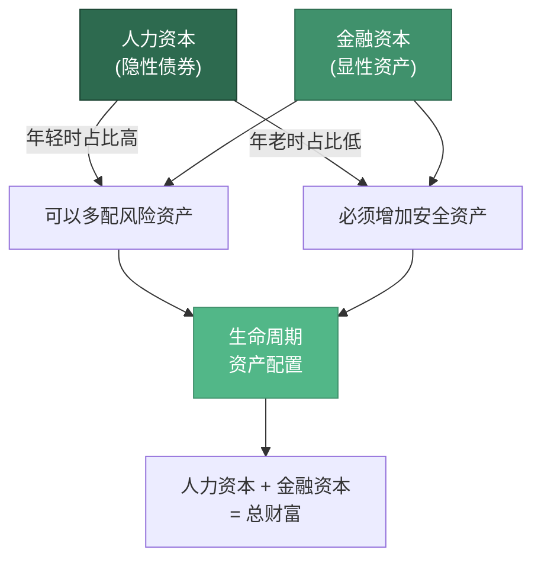

## 三、资产配置的生命周期理论

### 1. 为什么资产配置需要随生命周期变化？

很多投资者在40-50岁时仍然沿用30岁时的资产配置方案——重仓股票、追逐高收益、忽视防御。这不是勇气，而是对一个基本事实的忽视：**你的资产配置必须随生命周期的变化而动态调整**。

原因有三：

**第一，人力资本在衰减。** 你的人力资本（未来劳动收入的现值）本质上是一种"隐性债券"。30岁时，你的人力资本可能价值数百万——你还有30年的高收入工作年限；但45岁时，你的人力资本只剩下15年左右的工作年限，折现后的价值大幅缩水。当你的"隐性债券"在缩减时，你的金融资产组合必须增加真实债券的比例来补偿，否则你的总体风险敞口会失衡。

**第二，恢复周期在拉长。** 假设你的投资组合亏损30%。30岁时，你有30年时间让它回本；45岁时，你只有15年——而且这15年里你还要面对子女教育、父母养老等刚性支出。同样的亏损幅度，恢复的难度完全不同。

**第三，目标函数在改变。** 30岁时，你的目标是"最大化终期财富"——尽可能多地积累资产。但40-50岁时，你的目标转变为"在可承受风险范围内实现稳健增长，同时为退休建立可持续现金流"。目标变了，策略自然要变。

这三个因素叠加在一起，决定了一个核心结论：**资产配置不是一劳永逸的决策，而是一个随生命周期演化的动态过程**。



### 2. 理论溯源：三位诺贝尔奖得主的贡献

#### 2.1 莫迪利安尼的生命周期假说（Life-Cycle Hypothesis）

1985年诺贝尔经济学奖得主弗兰科·莫迪利安尼（Franco Modigliani）于1954年提出生命周期假说，其核心思想是：**理性的消费者会根据一生的预期总收入来安排消费和储蓄，而非仅依据当期收入**。

这个理论将人的一生分为三个阶段：

| 阶段 | 年龄段（典型） | 收入与消费关系 | 储蓄特征 |
|:---:|:---:|:---:|:---:|
| 积累期 | 25-40岁 | 收入 > 消费 | 正储蓄，构建资产池 |
| 稳健期 | 40-55岁 | 收入 ≈ 消费（峰值区间） | 储蓄增速放缓，重点转向配置优化 |
| 消费期 | 55岁以上 | 收入 < 消费 | 负储蓄，消耗积累的资产 |

对40-50岁投资者的直接启示是：**你正处于收入最高但储蓄增速放缓的阶段**。这个阶段的核心任务不是"赚更多"，而是"让已有的钱更高效、更安全地运转"。你的资产配置重心应该从"增长引擎"切换到"稳定引擎"。

莫迪利安尼的理论还揭示了一个关键洞察：**消费平滑（Consumption Smoothing）是理性人的本能**。你不会因为今年收入高就疯狂消费，也不会因为明年收入可能下降就极度节俭。你会自动地在整个生命周期内平滑消费水平。资产配置的逻辑与此一致——你需要通过不同生命阶段的配置调整，实现投资收益的"平滑化"，避免大起大落。

#### 2.2 萨缪尔森的资产配置与年龄关系

1970年诺贝尔经济学奖得主保罗·萨缪尔森（Paul Samuelson）在1969年的研究中提出了一个重要发现：**如果投资者的效用函数是时间可分的，且风险资产的收益服从独立同分布，那么最优风险资产配置比例与年龄无关**。

这个结论被称为"萨缪尔森悖论"——它似乎意味着年轻人和老年人应该持有相同比例的股票。但这个结论依赖于几个强假设：

- 没有劳动收入（即人力资本为零）
- 没有不可对冲的背景风险
- 投资者是完全理性的
- 市场是完美的（无交易成本、无税收）

在现实世界中，这些假设都不成立。你有劳动收入（人力资本），有不可对冲的风险（健康、职业），有行为偏差，市场也有摩擦。**正是这些现实因素，使得生命周期资产配置理论变得必要**。

#### 2.3 默顿的连续时间资产配置模型

1997年诺贝尔经济学奖得主罗伯特·默顿（Robert Merton）将资产配置问题扩展到连续时间框架。他的模型表明，当投资者拥有劳动收入时，最优配置策略会发生显著变化：

- **劳动收入稳定（如公务员、大学教授）**：劳动收入类似于债券，投资者可以将金融资产更多地配置于股票
- **劳动收入波动大（如销售人员、创业者）**：劳动收入本身就带有风险属性，投资者应该减少金融资产中的股票比例
- **劳动收入与股市正相关（如金融从业者）**：这种"双重暴露"风险需要通过降低金融资产中的股票比例来对冲

对40-50岁投资者的启示是：**你的资产配置不能只看金融资产，还要考虑你的劳动收入特征**。一个45岁的公务员和一个45岁的创业者的最优资产配置，即使在同样的年龄和同样的资产规模下，也应该截然不同。

### 3. 核心模型：滑翔路径（Glide Path）

#### 3.1 什么是滑翔路径？

滑翔路径是生命周期资产配置的核心操作框架。它描述的是：**随着年龄增长，投资者的权益类资产（股票等高风险资产）比例逐步下降，固定收益类资产（债券等低风险资产）比例逐步上升的动态过程**。

这个概念最初来自养老金管理领域。美国的"目标日期基金"（Target Date Fund）就是滑翔路径理论的典型应用——投资者选择一个目标退休年份（如2040年），基金会自动随时间推移调整股债比例，前期激进、后期保守。

#### 3.2 三种经典滑翔路径模型

学术界和业界提出了多种滑翔路径模型，以下是三种最具代表性的：

**模型一：线性递减模型**

这是最简单的滑翔路径。每年将权益类资产比例降低一个固定值。

```text
权益比例 = 起始比例 - (年龄 - 起始年龄) × 年递减率

示例：40岁起始比例60%，年递减2%
  40岁：60%
  45岁：50%
  50岁：40%
  55岁：30%
```

优点：简单直观，易于执行。缺点：过于机械，没有考虑市场估值和个人实际情况。

**模型二：前快后慢的阶梯模型**

前半段（40-45岁）快速下调权益比例，后半段（46-50岁）缓慢微调。

```text
40-42岁：权益60% → 55%（快速下降期，每年降2.5%）
43-45岁：权益55% → 50%（中速下降期，每年降1.7%）
46-48岁：权益50% → 47%（缓慢下降期，每年降1%）
49-50岁：权益47% → 45%（微调期，每年降1%）
```

理由：40-45岁是从"加速期"向"稳健期"的过渡阶段，需要快速降低风险暴露；45岁以后配置已经比较稳健，只需微调。

**模型三：动态调整模型（考虑市场估值）**

在滑翔路径的基础上，加入市场估值信号作为动态调整因子。

```text
实际权益比例 = 目标权益比例 × (1 + 估值偏离系数)

其中：
  估值偏离系数 = (市场平均PE - 历史平均PE) / 历史平均PE × 调整幅度

示例：
  当前A股PE=15，历史平均PE=14，调整幅度=0.1
  估值偏离系数 = (15-14)/14 × 0.1 = 0.007
  如果目标权益比例为50%，实际配比 = 50% × (1 - 0.007) = 49.65%
  （市场偏高时略微降低配比）
```

这个模型的逻辑是：当市场估值明显偏高时（如沪深300 PE超过历史均值的1.5倍），略微降低权益配比；当市场估值明显偏低时（如低于历史均值的0.7倍），略微提高权益配比。注意是"略微"——不是择时，而是在滑翔路径基础上做小幅动态调整。

#### 3.3 40-50岁的具体滑翔路径方案

根据中国市场的特点，我们推荐以下滑翔路径方案：

| 年龄 | 权益类资产 | 固定收益类 | 现金及等价物 | 另类资产 | 核心逻辑 |
|:---:|:---:|:---:|:---:|:---:|:---|
| 40岁 | 55-60% | 25-30% | 10-15% | 5-10% | 仍有一定时间优势，保持适度进攻性 |
| 42岁 | 52-57% | 28-33% | 10-15% | 5-10% | 开始逐步降低风险暴露 |
| 44岁 | 48-53% | 30-35% | 10-15% | 5-10% | 进入"稳健区间"的过渡阶段 |
| 46岁 | 45-50% | 33-38% | 10-15% | 5-10% | 稳健型配置初步成型 |
| 48岁 | 42-47% | 35-40% | 10-15% | 5-10% | 防御性进一步增强 |
| 50岁 | 40-45% | 35-40% | 10-15% | 5-10% | 为50-60岁收割期做准备 |

几个关键约束条件：

- **权益类资产不低于35%**：即使到了50岁，你仍然需要一定的股票配置来对抗通胀。如果把所有钱都放在债券和存款里，长期来看你的购买力会被通胀侵蚀
- **现金及等价物不低于10%**：40-50岁面临的职业不确定性、健康风险、子女教育支出等，都需要充足的流动性缓冲
- **另类资产中的黄金配置不低于3%**：黄金是对冲极端风险（恶性通胀、地缘冲突）的最后防线

### 4. 核心策略：桶型配置法（Bucket Strategy）

#### 4.1 为什么需要桶型配置？

滑翔路径告诉你"股债各配多少"，但没有告诉你"这些钱各自承担什么任务"。桶型配置法弥补了这个缺口——它将你的资产按用途分成不同的"桶"（Bucket），每个桶有明确的目标、期限和配置策略。

桶型配置法的核心优势是：**它将抽象的资产配置比例转化为具体的财务目标**，让每一笔钱都有明确的"使命"。这比单纯看"股票占50%、债券占50%"要有意义得多。

#### 4.2 三桶模型

对于40-50岁投资者，我们推荐"三桶模型"：


**桶1：安全桶（0-3年）**

这是你的"财务安全网"。无论发生什么——失业、大病、市场暴跌——这个桶里的钱都是安全的、随时可用的。

- **规模**：覆盖6-12个月的家庭总支出（包括房贷、车贷、子女教育、生活费等所有固定和可变支出）
- **配置工具**：货币基金（如余额宝、微信零钱通）、银行活期存款、短期国债逆回购
- **预期收益**：年化2-3%（不追求收益，只追求安全和流动性）
- **管理原则**：这个桶里的钱永远不动——除非发生真正的紧急情况

**桶2：稳健桶（3-10年）**

这是你的"稳定引擎"。它的任务是在控制风险的前提下，提供稳定的收益和现金流。

- **规模**：总资产的40-50%
- **配置工具**：中长期国债、AAA级企业债、债券基金、高分红蓝筹股（如银行股、公用事业股）、REITs
- **预期收益**：年化4-6%
- **管理原则**：每半年再平衡一次，偏离目标配比超过5%时触发调整

**桶3：增长桶（10年以上）**

这是你的"财富增长器"。它承担更高的风险，追求更高的长期回报。

- **规模**：总资产的35-45%
- **配置工具**：沪深300指数基金、中证500指数基金、优质主动管理型基金、行业主题ETF（如新能源、半导体、医疗）、港股/美股QDII基金、黄金ETF
- **预期收益**：年化8-12%（长期平均，短期可能大幅波动）
- **管理原则**：长期持有，不做择时。市场暴跌时不卖出（甚至可以适度加仓），市场暴涨时不追高

#### 4.3 桶型配置的实操要点

**要点一：桶1的规模要根据你的"收入稳定性"调整**

如果你的工作非常稳定（如公务员、事业单位），桶1可以保持6个月支出；如果你的工作不稳定（如销售、创业），桶1应该扩大到12个月甚至18个月。因为你"失业后重新找到同等收入工作"的时间更长。

**要点二：桶2的分红收入可以用来"补水"桶1**

如果你的桶2配置了高分红资产（如年分红率4-5%的银行股），这些分红收入可以自动流入桶1，保持安全桶的"水位"。这形成了一个自循环的现金流系统。

**要点三：桶3的再平衡频率不宜过高**

增长桶的资产天然波动大。如果你频繁查看、频繁调仓，很容易在市场恐慌时卖出（实际亏损）或在市场亢奋时追高（高位站岗）。建议每季度查看一次，但只有在偏离目标配比超过10%时才做再平衡。

**要点四：桶型配置需要一个"补水机制"**

当桶1因紧急支出而"缺水"时，应该从桶2补充（而非从桶3）。因为桶2的资产流动性好、波动小，卖出时不太可能遇到"割肉"的情况。只有当桶2也严重不足时，才考虑从桶3调拨——但这时候你需要重新评估整体财务状况了。

### 5. 动态再平衡：让配置回到正轨

#### 5.1 为什么需要再平衡？

假设你年初设定的配置目标是"50%股票+40%债券+10%现金"。一年后，如果股票涨了20%而债券只涨了3%，你的实际配置变成了"54%股票+39%债券+7%现金"——你的风险暴露在不知不觉中增大了。再平衡就是把配置拉回到目标比例的过程。

再平衡的本质是：**纪律性地"卖高买低"**。它迫使你在资产涨得多的时候卖出一部分（锁定收益），在资产跌得多的时候买入一部分（摊低成本）。这是一种反人性的操作，但长期来看，它能显著提高风险调整后收益。

学术研究显示，定期再平衡的组合，其年化收益比不再平衡的组合高0.5-1.5个百分点，同时波动率更低。这个差距在10年以上的投资周期中非常显著。

#### 5.2 三种再平衡方法

**方法一：日历再平衡法**

固定时间（如每季度、每半年、每年）检查一次配置比例，偏离超过阈值就调整。

- **优点**：简单，易于坚持
- **缺点**：可能在不需要调整时强制调整（增加交易成本），也可能在需要调整时没有触发（时间间隔太长）
- **推荐**：每半年检查一次，适合大多数投资者

**方法二：阈值再平衡法**

当任何一类资产的实际配比偏离目标配比超过一定阈值（如5%或10%）时，触发再平衡。

- **优点**：只在"需要"时调整，减少不必要的交易
- **缺点**：需要更频繁地监控，容易被遗忘
- **推荐**：将阈值设为绝对偏离5个百分点或相对偏离20%（取较小值）

**方法三：现金流再平衡法**

当有新的资金流入（如工资、奖金、分红）时，将新资金投入到当前"低于"目标配比的资产类别中，而不是卖出已有的资产。

- **优点**：没有卖出行为，不触发资本利得税，交易成本最低
- **缺点**：如果新资金流量太小，调整速度太慢
- **推荐**：作为日历法或阈值法的补充手段，优先使用

#### 5.3 40-50岁的再平衡实操建议

综合使用三种方法，形成一个完整的再平衡系统：

| 触发条件 | 操作方式 | 预期频率 |
|:---|:---|:---:|
| 每半年固定检查 | 评估是否需要调整，偏离3%以内不动 | 2次/年 |
| 单类资产偏离目标配比≥5% | 通过卖出超配资产、买入低配资产来修正 | 视市场情况 |
| 收到工资/奖金/分红 | 将新资金优先投入低配资产类别 | 月度 |
| 市场暴跌（沪深300单月跌幅>10%） | 不卖出，评估是否从桶1调拨资金加仓 | 极少发生 |

### 6. 人力资本与金融资本的转化

#### 6.1 理解你的"总财富"

大多数人只关注自己的金融资本（银行存款、股票、基金、房产等可量化的资产），而忽略了人力资本——你未来所有劳动收入的现值。但实际上，**你的"总财富"是人力资本与金融资本之和**。

如何估算你的人力资本？

```text
人力资本 ≈ 年税后收入 × 剩余工作年限 × 折现因子

折现因子参考（假设年折现率3%）：
  剩余10年：约8.5
  剩余15年：约11.9
  剩余20年：约14.9

示例：45岁，年税后收入30万，计划60岁退休（剩余15年）
  人力资本 ≈ 30万 × 11.9 = 357万
```

假设你同时有200万金融资产，你的"总财富"就是357万+200万=557万。其中，人力资本占64%，金融资本占36%。

#### 6.2 人力资本的"债券属性"与配置启示

你的劳动收入本质上具有"债券属性"——它相对稳定、有固定的"票息"（工资）、到期日明确（退休年龄）。这意味着：

**情况一：人力资本占比高（>60%）** → 金融资产可以更激进地配置

因为你的总体"财富组合"中已经有大量的"隐性债券"了，金融资产可以多配股票来平衡。

**情况二：人力资本占比低（<40%）** → 金融资产必须更保守地配置

因为你的"隐性债券"比例已经很低了，金融资产如果也大量配置股票，你的总体风险暴露会过高。

**情况三：人力资本与股市正相关（如金融从业者）** → 金融资产必须大幅降低股票比例

因为你的工资收入本身就跟着市场走——牛市时奖金高，熊市时可能降薪甚至失业。这种"双重暴露"风险需要通过降低金融资产中的股票比例来对冲。

#### 6.3 40-50岁的关键转化期

40-50岁是人力资本向金融资本转化的关键加速期。在这个阶段：

- **人力资本快速衰减**：从40岁到50岁，你的人力资本现值可能下降40-50%（剩余工作年限从20年缩短到10年）
- **金融资本需要"接棒"**：你必须在这十年里积累足够的金融资本，使其在50岁后能够支撑你的退休生活
- **转化效率取决于配置策略**：如果你的投资收益率是4%，你需要比收益率8%时多储蓄约50%才能达到同样的退休目标

这就引出了一个核心公式：

```text
退休准备率 = 退休所需金融资本 / 当前金融资本

退休所需金融资本 = 年支出 × 25（25倍法则）

示例：
  当前年支出30万，退休后预计年支出25万（房贷还清、子女独立）
  退休所需金融资本 = 25万 × 25 = 625万
  当前金融资产200万
  退休准备率 = 200/625 = 32%
  还需要积累425万
```

### 7. 40-50岁资产配置的五大原则

将上述理论综合起来，40-50岁的资产配置应遵循以下五大原则：

**原则一：股债配比随年龄递减（滑翔路径）**

权益类资产比例从40岁的55-60%逐步下降到50岁的40-45%。这不是一个"选择"，而是一个"纪律"——无论市场涨跌，每年按计划调整。

**原则二：永远保持流动性缓冲（桶1不低于6个月支出）**

40-50岁面临的职业不确定性、健康风险和家庭刚性支出，使得流动性比收益率更重要。钱赚到了才是你的钱——浮盈不是。

**原则三：用分红构建现金流（桶2的高分红策略）**

随着年龄增长，你应该越来越关注"现金流"而非"账面价值"。高分红蓝筹股（银行、保险、公用事业）和REITs可以提供稳定的季度或年度现金流收入，让你的财富在"自动造血"。

**原则四：用另类资产对冲尾部风险（黄金、REITs配置5-10%）**

股票和债券的"双杀"（同时下跌）虽然罕见，但一旦发生就是灾难。2022年全球市场就经历了这种局面——股债同时大幅下跌。黄金和REITs在大部分股债双杀场景中能提供正向收益或较小的回撤，是组合中的"保险"。

**原则五：配置要服务目标，而非追逐收益**

40-50岁的资产配置不是为了"打败市场"，而是为了实现具体的财务目标——退休、子女教育、父母养老、应急储备。每一个配置决策都应该能回答"这笔钱是用来做什么的"这个问题。如果没有明确的目标对应，那这笔钱就不应该被投入到高风险资产中。

### 8. 不同收入水平的配置方案对比

资产配置不能一刀切。不同收入水平的家庭，其配置方案应有显著差异：

| 维度 | 中等收入家庭（年收入20-50万） | 中高收入家庭（年收入50-150万） | 高收入家庭（年收入150万以上） |
|:---|:---|:---|:---|
| **桶1规模** | 6个月支出（约10-25万） | 6-9个月支出（约25-110万） | 9-12个月支出 |
| **桶2占比** | 45-55% | 40-50% | 35-45% |
| **桶3占比** | 30-40% | 35-45% | 40-50% |
| **权益类细分** | 以宽基指数为主 | 指数+行业+QDII | 指数+个股+私募+海外 |
| **固收类细分** | 国债+银行理财 | 国债+企业债+信托 | 国债+企业债+信托+另类 |
| **核心差异** | 流动性优先，收益次之 | 流动性与收益平衡 | 收益优化，税务筹划 |

高收入家庭可以承受更多的权益类配置，因为即使出现较大的投资亏损，其绝对损失也不至于影响基本生活。但高收入家庭需要更多地关注税务筹划和代际传承——这些问题在中低收入家庭中不那么紧迫。

### 9. 常见误区与纠正

**误区一："我45岁了，应该把股票全卖了"**

纠正：45岁不需要把股票全卖了。即使50岁，你仍然有10-15年的投资期限（退休后也需要投资来对抗通胀）。完全没有股票的组合，长期来看会被通胀侵蚀。正确的做法是降低股票比例到40-45%，而非降到零。

**误区二："目标日期基金就够了，不用自己配"**

纠正：目标日期基金是一个起点，但不是终点。它假设所有同龄人的风险承受能力和财务目标相同，这显然不对。一个45岁有500万资产的高管和一个45岁有50万存款的普通职员，他们的配置需求完全不同。目标日期基金可以作为参考，但你应该根据自己的具体情况做调整。

**误区三："再平衡太麻烦，不如一直拿着"**

纠正：不做再平衡的组合，其风险暴露会随着市场涨跌而自然漂移——牛市后你的股票比例会高于目标，熊市后会低于目标。这意味着你在市场最贵的时候持有最多的风险资产，在市场最便宜的时候持有的最少——这与"低买高卖"完全相反。再平衡的交易成本远低于不再平衡的隐性损失。

**误区四："我已经分散投资了——我买了5只不同的基金"**

纠正：如果你买的5只基金都是偏股型基金，你并没有真正分散。真正的分散是跨资产类别的——股票、债券、现金、另类资产。同一只股票基金和不同风格的股票基金之间的相关性可能高达0.8以上，起不到分散效果。

**误区五："中国的债券不值得买，收益太低"**

纠正：债券在组合中的角色不是"赚大钱"，而是"稳定军心"。2015年A股股灾时，沪深300指数下跌超过40%，而同期中长期纯债基金的平均收益约为8%。如果没有债券的对冲，你的组合在那一年会跌得很惨。债券是组合中的"压舱石"——你不应该期望它带来高收益，但你应该感激它在风暴中的稳定作用。

### 10. 行动清单

将本节的理论转化为可执行的行动：

1. **计算你的人力资本**：用年税后收入 × 剩余工作年限 × 折现因子，得出你的人力资本现值
2. **盘点你的金融资本**：列出所有金融资产（存款、股票、基金、债券、保险现金价值等），计算总额
3. **确定你的人力资本/金融资本比**：判断你的"隐性债券"占比，决定金融资产的风险水平
4. **选择滑翔路径模型**：根据你的收入稳定性和风险偏好，选择线性、阶梯或动态模型
5. **建立三桶结构**：将资产划分为安全桶、稳健桶、增长桶，明确每个桶的规模和配置工具
6. **设置再平衡规则**：确定日历频率（建议每半年）和阈值（建议偏离5%触发）
7. **每年复查并调整**：每年生日月做一次全面的配置审查，根据年龄增长和生活变化做滑翔路径调整
