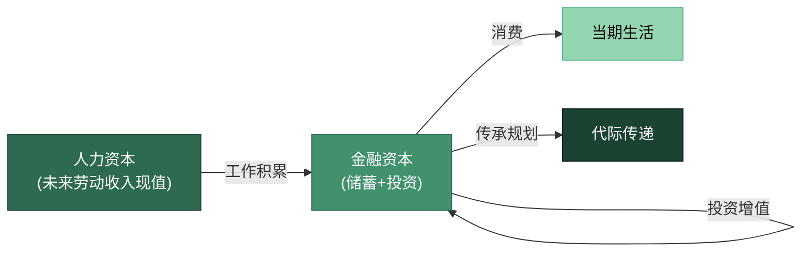
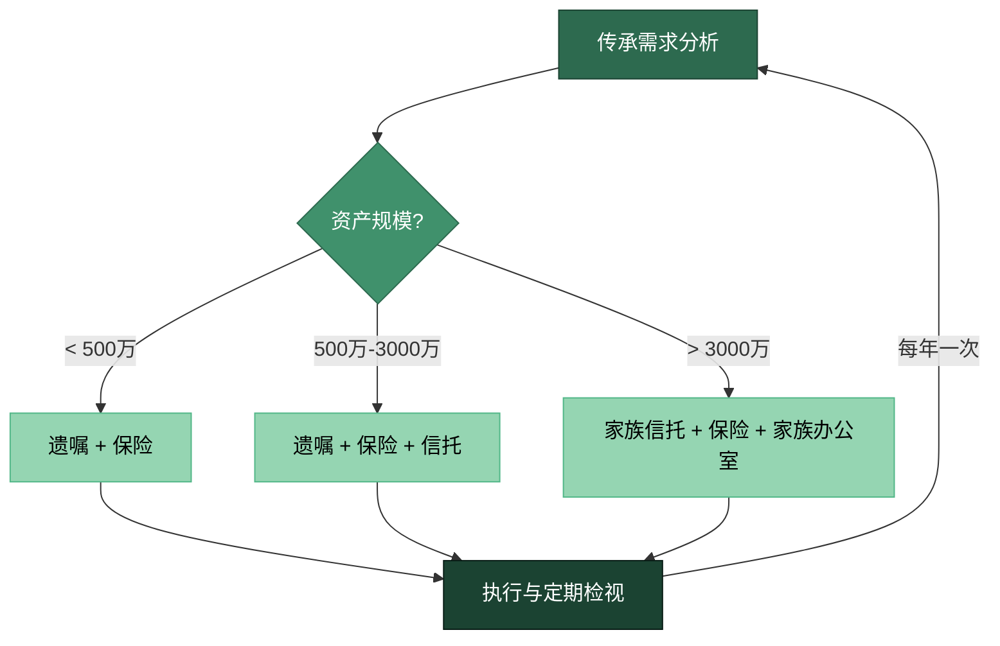

## 四、财富传承的基础理论

### 1. 什么是财富传承：超越"把钱给孩子"的认知框架

财富传承（Wealth Succession / Wealth Transfer）是指将个人或家庭积累的财富——包括有形资产、无形能力和精神价值观——系统性地传递给下一代的过程。这个定义包含三个关键要素，缺一不可：

**要素一：系统性。** 财富传承不是临终前的一纸遗嘱，而是一个需要提前10-20年规划、分阶段执行的长期工程。它涉及法律、税务、金融、教育、心理等多个维度，任何一个维度的缺失都可能导致传承失败。

**要素二：多维度。** 真正的财富传承不仅传递"钱"，还要传递"管钱的能力"和"对待钱的态度"。三者构成传承的三个层次——资产传承、能力传承、价值观传承——后两者的重要性远超第一层。

**要素三：代际性。** 财富传承的核心矛盾是"时间差"——创造财富的一代和使用财富的一代之间存在认知差距、能力差距和价值观差距。缩小这个差距，是传承规划的根本目标。

```text
财富传承的三层次模型
┌─────────────────────────────────────────┐
│  第三层：价值观传承                       │
│  财富观、责任感、消费理念、风险态度        │
│  ┌─────────────────────────────────────┐ │
│  │  第二层：能力传承                     │ │
│  │  财商、投资能力、管理能力、创业精神   │ │
│  │  ┌─────────────────────────────────┐│ │
│  │  │  第一层：资产传承                ││ │
│  │  │  房产、金融资产、企业股权、保险  ││ │
│  │  └─────────────────────────────────┘│ │
│  └─────────────────────────────────────┘ │
└─────────────────────────────────────────┘
```

这个三层模型揭示了一个核心规律：**资产传承是基础，能力传承是保障，价值观传承是灵魂。** 只完成第一层的传承，就像把一把车钥匙交给一个不会开车的人——他迟早会把车撞毁。

### 2. 为什么40-50岁是启动传承规划的最佳窗口

从生命周期理论的角度看，40-50岁启动传承规划具有独特的时机优势。太早（30-40岁），资产积累尚不充分，传承规划缺乏物质基础；太晚（50-60岁），试错空间急剧收窄，一旦规划失误几乎没有修正时间。

#### 2.1 时间窗口的量化分析

以一个典型场景说明：假设你45岁，净资产800万元，计划将其中600万元传承给下一代。如果从45岁开始规划，你有以下时间优势：

| 规划启动年龄 | 可用规划时间 | 可选工具数量 | 试错修正空间 | 传承效率评分 |
|:---:|:---:|:---:|:---:|:---:|
| 35岁 | 25年 | 全部工具可用 | 充裕 | ★★★★★ |
| 40岁 | 20年 | 大部分工具可用 | 较充裕 | ★★★★☆ |
| **45岁** | **15年** | **核心工具可用** | **适中** | **★★★★☆** |
| 50岁 | 10年 | 部分工具受限 | 较紧张 | ★★★☆☆ |
| 55岁 | 5年 | 多数工具受限 | 极紧张 | ★★☆☆☆ |
| 60岁+ | 不确定 | 几乎仅剩遗嘱 | 几乎没有 | ★☆☆☆☆ |

**关键洞察：** 45岁是一个"黄金分割点"——你既有足够的资产需要传承，又有足够的时间来规划和执行。更重要的是，你的子女通常处于10-20岁阶段，正是培养财商、建立传承意识的关键期。

#### 2.2 人力资本与金融资本的转换窗口

莫迪利安尼（Franco Modigliani）的生命周期假说指出，人在一生中会将"人力资本"（未来劳动收入的现值）逐步转化为"金融资本"（储蓄和投资）。40-50岁正处于这个转换的关键阶段：

- **人力资本峰值已过：** 你的工资增速已经放缓，未来收入的现值（人力资本）在下降
- **金融资本接近峰值：** 你积累的储蓄和投资（金融资本）在接近生涯最高点
- **转换效率下降：** 每多工作一年所增加的金融资本，相对于已有资产的比例在缩小

这意味着什么？意味着你**必须开始思考"金融资本的去向"**——不再只是"如何让钱生钱"，还要考虑"钱最终去哪里"。传承规划的本质，就是为金融资本设计一条超越个人生命周期的路径。



### 3. 财富传承的理论框架

#### 3.1 代际财富传递的"三世代衰减"规律

财富传承领域有一句广为人知的格言："富不过三代"（Shirtsleeves to shirtsleeves in three generations）。这并非迷信，而是有坚实数据支撑的统计规律：

- **中国数据：** 中国社科院2019年发布的《家族财富传承报告》显示，中国家族企业能成功传到第二代的比例约为30%，传到第三代的比例仅为10-15%
- **美国数据：** 美国家族企业协会（Family Business Alliance）的统计显示，仅约30%的家族企业能传到第二代，12%传到第三代，3%传到第四代
- **欧洲数据：** 欧洲家族企业研究中心的数据略高，但也呈现同样的衰减趋势

**为什么会出现"三世代衰减"？** 学术界提出了三个互补的解释模型：

**模型一：能力衰减模型（Competence Decay Model）**

第一代（创业者）通过实战积累了极强的财富创造能力；第二代在相对优越的环境中成长，虽然耳濡目染了一些经验，但缺乏创业的"饥渴感"；第三代在完全富裕的环境中长大，既没有实战经验，也没有危机意识。每一代的能力衰减幅度约为50-70%，三代之后能力几乎归零。

**模型二：动机消退模型（Motivation Erosion Model）**

心理学家Edward Deci和Richard Ryan的自我决定理论（Self-Determination Theory）指出，人的内在动机来源于三个基本心理需求：自主性、胜任感、归属感。继承巨额财富的后代，其"胜任感"需求被人为满足（不需要努力就拥有一切），"自主性"需求被限制（被家族期望绑架），最终导致内在动机消退，表现为挥霍、叛逆或逃避。

**模型三：制度缺失模型（Institutional Gap Model）**

第一代的财富管理依赖个人能力（"人治"），但个人能力无法传承。如果第二代没有建立起"制度化"的财富管理体系（包括家族宪法、信托架构、治理机制等），那么第一代去世后，财富管理就失去了"操作系统"，资产分散、决策混乱、利益冲突随之而来。

**核心启示：** 克服"三世代衰减"的关键，不是简单地"多留钱"，而是同时解决能力传承（对抗模型一）、动机激发（对抗模型二）和制度建设（对抗模型三）三个问题。

#### 3.2 遗产规划的法律理论基础

遗产规划（Estate Planning）是财富传承在法律维度的核心工具。理解其理论基础，有助于选择合适的法律工具组合。

**法定继承 vs. 遗嘱继承 vs. 信托传承**

中国《民法典》继承编规定了两种基本继承方式：法定继承和遗嘱继承。两者的核心区别在于：

| 维度 | 法定继承 | 遗嘱继承 | 信托传承 |
|------|---------|---------|---------|
| **法律依据** | 《民法典》第1127条 | 《民法典》第1133条 | 《信托法》 |
| **分配方式** | 按法定顺序和比例 | 按被继承人意愿 | 按信托契约条款 |
| **灵活性** | 极低（法定比例固定） | 中等（可自由分配） | 极高（可设定条件） |
| **资产隔离** | 无 | 无 | 有（信托财产独立） |
| **税务影响** | 目前中国暂无遗产税 | 目前中国暂无遗产税 | 可能享有税务优惠 |
| **执行确定性** | 高（有法律强制力） | 中（可能被挑战效力） | 高（信托公司执行） |
| **适用场景** | 无遗嘱时的默认方案 | 一般家庭 | 高净值/复杂家庭结构 |
| **成本** | 无额外成本 | 律师费+公证费 | 设立费+年管理费 |

**遗嘱效力的法律层级：** 《民法典》第1142条规定了遗嘱的效力优先级。当存在多份遗嘱时，以最后一份为准。遗嘱形式包括自书遗嘱、代书遗嘱、打印遗嘱、录音录像遗嘱、口头遗嘱和公证遗嘱六种，各有严格的法定要件。任何要件的缺失都可能导致遗嘱无效——这是遗嘱规划中最常见的"翻车"原因。

**信托的"资产隔离"原理：** 信托的核心法律特征是"信托财产独立性"。根据《信托法》第15-17条，一旦资产合法转入信托，该资产在法律上就不再属于委托人（设立人），也不属于受托人（信托公司），而是以独立的"信托财产"身份存在。这意味着：
- 委托人破产时，信托财产不纳入破产财产
- 委托人离婚时，信托财产不作为夫妻共同财产分割
- 受托人破产时，信托财产不纳入其清算财产
- 信托财产独立于委托人、受托人、受益人的固有财产

这种"三重隔离"机制，使信托成为财富传承中最强大的法律工具之一。

#### 3.3 保险传承的精算原理

保险在财富传承中扮演独特角色，其理论基础是精算学中的"大数法则"和"风险池化"原理。

**终身寿险的传承杠杆效应：** 终身寿险的核心特征是"以小博大"——你用相对较小的保费（成本），撬动一个确定性较高的身故保险金（收益）。这个杠杆比率随投保年龄和缴费方式变化：

| 投保年龄 | 年缴费（10万保额） | 缴费年限 | 总成本 | 杠杆比率 |
|:---:|:---:|:---:|:---:|:---:|
| 35岁 | 约2,800元 | 20年 | 5.6万 | 1.79倍 |
| 40岁 | 约3,500元 | 20年 | 7.0万 | 1.43倍 |
| 45岁 | 约4,500元 | 20年 | 9.0万 | 1.11倍 |
| 50岁 | 约6,000元 | 20年 | 12.0万 | 0.83倍 |

*注：以上数据为终身寿险的估算，实际费率因产品、性别、健康状况而异。*

关键洞察：**45岁左右是保险传承杠杆的"临界点"**——在此前投保，杠杆比率大于1（"以小博大"）；在此后投保，杠杆比率下降，保险的传承优势减弱。这为"40-50岁启动传承规划"提供了又一个量化依据。

**年金保险的"长寿风险对冲"功能：** 长寿风险（Longevity Risk）是指"活得太久导致钱不够用"的风险。年金保险通过"生存者补贴死亡者"的大数法则，将不确定的个人寿命转化为确定的终身现金流——无论你活到80岁还是100岁，都能持续领取年金。这对于退休后的现金流规划具有不可替代的价值。

#### 3.4 税务筹划的理论框架

虽然中国目前尚未开征遗产税和赠与税，但这并不意味着传承规划可以忽略税务因素。实际上，财富传承涉及的税务问题相当复杂：

**现有税制下的传承税务影响：**

| 传承方式 | 涉及税种 | 税务影响 |
|---------|---------|---------|
| 法定继承房产 | 契税（免征）、个税（免征） | 税务成本最低 |
| 赠与房产 | 契税3%、个税20%（非直系） | 税务成本较高 |
| 买卖过户房产 | 增值税、个税、契税 | 税务成本最高 |
| 继承企业股权 | 个税（递延至转让时） | 可递延但不免税 |
| 保险理赔金 | 个税（免征） | 税务成本为零 |
| 信托收益分配 | 个税20% | 按受益人税率 |

**关键结论：** 在现有税制下，保险是税务效率最高的传承工具（理赔金免个税），房产继承的税务成本最低但存在"未来遗产税"的政策不确定性。信托虽然设立成本较高，但在资产隔离和税务优化方面具有长期优势。

**遗产税的前瞻准备：** 尽管中国目前没有遗产税，但学术界和政策界一直在讨论开征的可能性。国际经验显示，遗产税的税率通常在18-55%之间（美国40%、日本55%、英国40%）。如果未来开征遗产税，提前做好以下准备可以显著降低税务冲击：
- 利用保险的免税特性进行资产转移
- 通过信托实现资产的提前隔离
- 合理利用每年的赠与免税额度（如果未来设置）
- 将部分资产配置在税务友好的结构中

### 4. 传承规划的行为经济学视角

财富传承不仅是法律和金融问题，更是行为经济学问题。以下几个心理偏差在传承规划中尤为突出：

#### 4.1 "死亡否认"偏差（Mortality Denial）

人类天生倾向于回避与死亡相关的议题。行为经济学家George Loewenstein的研究表明，人在思考"自己的死亡"时会激活大脑的杏仁核（恐惧中枢），产生强烈的回避反应。这直接导致大多数人不愿意思考遗产规划——因为遗嘱、保险等工具都隐含着"我可能会死"的前提。

**影响：** 中国公证协会2022年的数据显示，中国成年人遗嘱订立率不足5%。这意味着超过95%的家庭在主要收入者去世后，将面临遗产分配的法律纠纷风险。

**对策：** 将传承规划重新框架为"家庭保护计划"而非"死亡准备"。研究表明，当人们将遗嘱定位为"保护家人的方式"而非"面对死亡的方式"时，规划意愿提升约60%。

#### 4.2 现状偏好偏差（Status Quo Bias）

人们对改变现状存在天然的抗拒——即使现状明显不合理。在传承规划中，这表现为："我们家一直没立遗嘱也没出问题"、"我爸妈那辈也没搞什么信托"。

**影响：** 现状偏好导致大多数家庭在"没有传承规划"的状态中持续停留，直到危机发生（如主要收入者突然去世、家庭成员争夺遗产）才被迫应对——而这时往往已经错过了最佳规划窗口。

**对策：** 利用"预设选择"（Default Choice）策略。研究表明，当传承规划成为"默认选项"而非"主动选择"时，执行率显著提升。具体做法：每年生日进行一次"传承健康检查"，将其设为固定的年度习惯。

#### 4.3 公平幻觉偏差（Fairness Illusion）

大多数父母在分配遗产时追求"公平"——给每个子女等额的资产。但"等额"不等于"公平"。每个子女的经济状况、需求、能力和对家庭的贡献都不同，等额分配往往导致实际的不公平。

**影响：** 等额分配可能造成"最需要帮助的孩子得不到足够支持，最不需要帮助的孩子得到过多资源"的悖论。

**对策：** 采用"需求导向"而非"均分导向"的分配原则。具体而言：先确定每个子女的基本需求保障（底线），再根据特殊情况（如残障子女的长期照护需求、创业子女的启动资金需求）进行差异化分配，最后就分配逻辑与所有子女充分沟通。

### 5. 财富传承的国际比较与启示

不同文化和社会制度下，财富传承呈现出截然不同的模式。比较这些模式，可以为中国家庭提供有价值的参考。

| 维度 | 美国模式 | 日本模式 | 欧洲模式 | 中国模式 |
|------|---------|---------|---------|---------|
| **核心工具** | 不可撤销信托+遗产税规划 | 家族企业+长子继承制 | 家族办公室+基金会 | 遗嘱+保险（正在演进） |
| **制度环境** | 完善的信托法和遗产税制 | 强大的家族企业文化 | 发达的私人银行体系 | 信托法尚在发展 |
| **文化特征** | 个人主义、重视自主 | 家族主义、重视传承 | 传统与现代结合 | 家族主义但缺乏制度化 |
| **典型问题** | 遗产税负担过重 | 家族企业僵化 | 家族治理复杂 | "富不过三代"突出 |
| **对中国的启示** | 尽早建立信托架构 | 注重家族文化传承 | 引入专业机构管理 | 需要制度化转型 |

**美国模式的核心启示：** 美国的财富传承体系以"信托"为核心。不可撤销人寿保险信托（ILIT）是美国高净值家庭最常用的传承工具——通过将人寿保险放入信托，既实现了资产隔离，又利用了保险的免税特性。这种"保险+信托"的组合模式，值得中国家庭借鉴。

**日本模式的核心启示：** 日本是全球"百年企业"最多的国家（超过3.3万家），其家族企业传承的成功关键在于：重视"家训"（家族价值观的制度化表达）、"暖簾分"（允许有能力的非长子独立创业）、以及"養子縁組"（通过收养有才能的人来延续家族企业）。这些做法的本质是**将"能力传承"置于"血缘传承"之上**。

### 6. 传承规划的决策框架

理解了理论基础之后，需要一个系统化的决策框架来指导实践。以下是一个经过验证的五步决策模型：

#### 步骤一：资产盘点与分类

在启动任何传承规划之前，你需要对自己的资产进行全面盘点和分类。这不是简单的"数钱"，而是按传承特征进行分类：

| 资产类别 | 典型资产 | 传承难度 | 税务影响 | 流动性 | 建议传承工具 |
|---------|---------|:---:|---------|:---:|------------|
| 不动产 | 住宅、商铺、土地 | 高 | 较高（过户费） | 低 | 遗嘱/生前赠与 |
| 金融资产 | 存款、股票、基金 | 中 | 低 | 高 | 遗嘱/信托 |
| 保险资产 | 寿险、年金 | 低 | 零 | 中 | 指定受益人 |
| 企业股权 | 公司股份、合伙份额 | 高 | 较高 | 低 | 股权架构设计/信托 |
| 数字资产 | 虚拟货币、数字版权 | 极高 | 不确定 | 变化大 | 遗嘱+密码托管 |
| 收藏品 | 艺术品、珠宝、古董 | 中 | 不确定 | 低 | 遗嘱/信托 |

#### 步骤二：传承目标设定

明确你希望实现的传承目标。不同目标对应不同的工具组合：

- **基本目标：** 资产顺利转移给指定继承人，避免纠纷 → 遗嘱+保险
- **进阶目标：** 资产保护、税务优化、条件分配 → 信托+遗嘱+保险
- **高级目标：** 家族治理、能力培养、价值观传承 → 家族宪法+信托+教育计划

#### 步骤三：工具选择与组合

没有单一工具能满足所有传承需求。最优方案通常是多工具组合：



#### 步骤四：法律文件准备

传承规划的法律文件必须具备三个特征：**合法性**（符合法律规定的所有要件）、**明确性**（不存在歧义或模糊空间）、**可执行性**（执行人能够按照文件内容操作）。

核心法律文件清单：
1. **遗嘱：** 明确资产分配方案，指定遗嘱执行人
2. **保险合同：** 指定受益人及受益比例
3. **信托契约：** （如适用）明确信托目的、受益人、分配条件
4. **家庭协议：** 非法律约束力，但具有道德约束力的家族共识文件
5. **资产清单：** 所有资产的详细记录（含账户信息、存放位置）
6. **授权委托书：** 丧失行为能力时的决策授权

#### 步骤五：执行、沟通与定期检视

传承规划不是"一次设定、终身不变"的静态方案。它需要：
- **执行落地：** 法律文件签署后，确保所有资产的权属登记、受益人指定、信托设立等都已完成
- **家庭沟通：** 在适当的时间，以适当的方式，向家庭成员传达传承方案的核心逻辑
- **定期检视：** 至少每两年一次全面检视，在家庭状况变化（结婚、离婚、生育、死亡、重大资产变动）时即时检视

### 7. 常见理论误区与纠正

**误区一："传承规划是有钱人的事"**

事实上，任何有未成年子女、有房产、有保险的家庭，都需要传承规划。即使你的净资产只有100万元，如果没有遗嘱，去世后遗产分配将完全按法定继承执行——这可能与你的实际意愿完全不符。

**误区二："立了遗嘱就万事大吉"**

遗嘱只是传承规划的一个环节。遗嘱无法实现资产隔离（遗嘱中的资产仍然是你的遗产，可能被债权人追索）、无法实现条件分配（遗嘱无法规定"孩子满25岁才能拿到钱"）、无法实现税务优化。完整的传承方案需要遗嘱+保险+信托的组合。

**误区三："传承规划是临终前的事"**

传承规划的最佳时间是"你不需要它的时候"——因为这时你有最充裕的时间、最从容的心态和最充足的试错空间。等到健康出问题、家庭出现危机时再规划，可选工具和策略都会大幅缩减。

**误区四："公平就是平均分配"**

前面已经分析过，等额分配不等于公平。真正公平的分配是"按需分配"——先保障每个家庭成员的基本需求，再根据特殊情况差异化分配，并充分沟通分配逻辑。

**误区五："传承规划只需要法律知识"**

传承规划是一个跨学科领域，涉及法律（遗嘱、信托）、金融（保险、投资）、税务（税制分析）、心理学（家庭沟通、代际关系）和教育学（财商培养）。仅依赖法律知识，很容易陷入"合法但不合理"的陷阱——遗嘱合法但引发家庭矛盾，就是最典型的例子。

### 8. 本节理论框架小结

财富传承的基础理论可以浓缩为以下核心认知：

**认知一：传承是三维的。** 资产传承、能力传承、价值观传承构成完整的传承体系。只关注资产传承，是"富不过三代"的根本原因。

**认知二：40-50岁是黄金窗口。** 从人力资本-金融资本转换的角度，这个阶段既有足够的资产基础，又有充足的规划时间，是启动传承规划的最佳时机。

**认知三：法律工具需要组合使用。** 遗嘱、保险、信托各有优势和局限，最优方案是根据资产规模和家庭结构进行组合配置。

**认知四：行为偏差是最大的敌人。** "死亡否认"、"现状偏好"、"公平幻觉"等心理偏差，比法律知识的缺乏更能阻碍传承规划的启动和执行。

**认知五：制度化是长期保障。** 将传承从"个人行为"升级为"制度安排"（家族宪法、治理机制、定期检视），是克服"三世代衰减"的根本途径。

> **一句话总结：** 财富传承的本质不是"把钱留给谁"，而是"建立一套超越个人生命周期的财富管理系统"。40-50岁，正是建造这套系统的最佳施工期。
