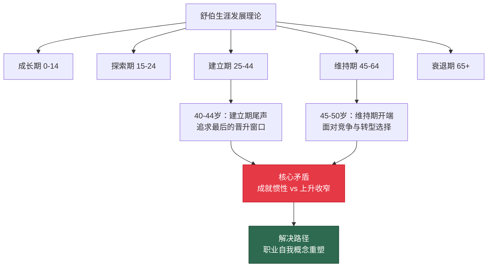
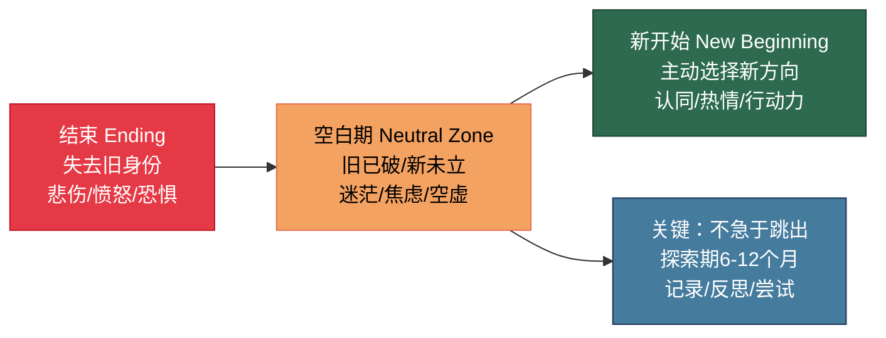
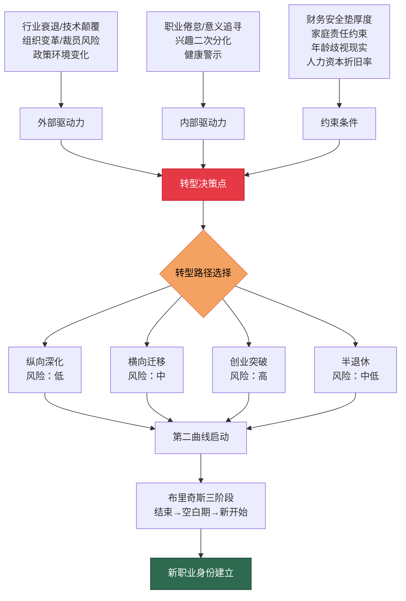

## 五、职业转型的理论基础

40-50岁是职业生涯的"分水岭"。你可能已经走到了行业金字塔的中上层，却发现上升通道正在收窄；你可能正在经历"中年倦怠"，对日复一日的工作失去了热情；你可能眼睁睁看着行业被技术变革颠覆，担心自己成为下一个被淘汰的人。无论哪种情况，你都需要一套系统的理论框架来理解"中年职业转型"这件事——不是拍脑袋的冲动决策，而是基于深刻认知的理性选择。

本节将从七个理论维度，构建40-50岁职业转型的完整知识体系。

### 1. 舒伯生涯发展理论：40-50岁处于"维持期"与"衰退期"的交界

唐纳德·舒伯（Donald Super）的生涯发展理论将人的一生职业发展分为五个阶段：

| 阶段 | 年龄范围 | 核心任务 | 典型特征 |
|:---:|:---:|------|------|
| 成长期 | 0-14岁 | 自我概念形成 | 对职业的好奇与幻想 |
| 探索期 | 15-24岁 | 职业探索与尝试 | 求学、实习、初入职场 |
| 建立期 | 25-44岁 | 职业稳定与晋升 | 专业化、积累资历、追求成就 |
| 维持期 | 45-64岁 | 维持既有成就 | 面临竞争、寻求突破或接受现实 |
| 衰退期 | 65岁以上 | 逐步退出职场 | 角色转换、退休适应 |

40-50岁横跨"建立期"的尾声和"维持期"的开端。这个位置决定了你面临的核心矛盾：**建立期的惯性还在推动你追求更高的成就，但维持期的现实已经在提醒你，"向上"的路越来越窄**。

舒伯理论对40-50岁职业转型的关键启示在于"职业自我概念"（Career Self-Concept）。他认为，人在不同阶段会对"我是谁""我能做什么""我应该做什么"形成不同的认知。40-50岁时，很多人面临的问题是：**职业自我概念固化**——你已经习惯了"某公司的总监""某行业的专家"这个身份标签，一旦离开这个标签，你会产生强烈的身份焦虑。

克服这种焦虑的第一步，是将自我概念从"角色定义"（我是XX公司的XX职位）转变为"能力定义"（我具备XX能力，可以在多种场景中创造价值）。前者依赖于特定组织和岗位，一旦脱离就会崩塌；后者是你自己的核心资产，可以随你迁移。

**实践意义**：如果你正在考虑职业转型，先做一次"自我概念审计"——写下你对自己的10个定义，然后区分哪些是"角色定义"（依赖外部环境），哪些是"能力定义"（属于你自己）。如果角色定义超过6个，说明你的自我概念过度依赖外部环境，一旦环境变化（被裁员、行业衰退），你的心理冲击会非常大。你需要有意识地将身份认同锚定在能力而非角色上。

### 2. 霍兰德职业兴趣理论：中年兴趣的"二次分化"

约翰·霍兰德（John Holland）将人的职业兴趣分为六种类型——现实型（R）、研究型（I）、艺术型（A）、社会型（S）、企业型（E）、常规型（C）。大多数人在30岁之前就形成了相对稳定的兴趣类型，并据此选择了职业方向。

但40-50岁会出现一个有趣的现象：**兴趣的"二次分化"**。

人在年轻时，迫于生存压力，往往会压抑某些兴趣，选择"能赚钱"而非"真正喜欢"的工作。到了40-50岁，随着财务基础的积累和人生阅历的丰富，那些被压抑的兴趣开始重新浮现。这解释了为什么很多中年人会突然对摄影、写作、心理咨询、公益事业产生强烈兴趣——这不是"中年危机"的胡闹，而是被压抑的本真自我的回归。

霍兰德理论对中年职业转型的实际价值在于：它提供了一个结构化的框架来评估"你的兴趣类型与当前工作的匹配度"。如果匹配度很低（比如你是AES型——艺术+企业+社会，却一直在做CER型——常规+企业+现实的财务管理工作），那么你长年累月的职业倦怠就有了理论解释，转型的方向也更加清晰——向匹配你真实兴趣的领域迁移。

**兴趣类型与中年转型方向对照表**：

| 兴趣类型 | 典型特质 | 40-50岁转型方向 | 可行路径 |
|:---:|------|------|------|
| R 现实型 | 动手能力强、喜欢具体事物 | 手作工坊、农业创业、工程咨询 | 利用技术积累转向实体创造 |
| I 研究型 | 好奇心强、喜欢深入分析 | 行业研究、数据分析咨询、学术 | 将行业经验转化为研究产出 |
| A 艺术型 | 创意丰富、审美敏感 | 内容创作、设计咨询、品牌策划 | 将审美能力与行业经验结合 |
| S 社会型 | 喜欢帮助他人、善于沟通 | 心理咨询、教育培训、社工 | 将人生阅历转化为助人能力 |
| E 企业型 | 领导力强、喜欢影响他人 | 创业、投资、行业协会管理 | 将管理经验转化为创业资本 |
| C 常规型 | 细致有序、喜欢规范流程 | 合规咨询、质量管理、财务顾问 | 将专业规范转化为咨询服务 |

需要注意的是，40-50岁的兴趣往往不是单一类型，而是两到三种类型的组合。你的转型方向应该尽量覆盖你的主导兴趣类型，否则即使转型成功，也可能在几年后再次陷入倦怠。

### 3. 布里奇斯转型模型：理解转型的三个心理阶段

威廉·布里奇斯（William Bridges）在《转型》一书中提出了一个深刻的观点：**转变（transition）和变化（change）不是一回事**。变化是外部事件——换工作、搬家、离婚；转变是内心过程——你对这些事件的心理适应和身份重构。

布里奇斯将转型分为三个阶段：

**第一阶段：结束（Ending）**

每一次转型都始于"失去"。你失去了熟悉的工作环境、社交圈子、身份标签，甚至失去了每天早起的动力。这个阶段的典型情绪是：悲伤、愤怒、恐惧、迷茫。

40-50岁的人在"结束"阶段面临的最大挑战是**沉没成本心理**。你在这个行业干了20年，积累了这么多资历、人脉和专业知识，现在要"放弃"？行为经济学告诉我们，人对"损失"的敏感度是"收益"的2-2.5倍（卡尼曼和特沃斯基的前景理论）。这意味着，**放弃已有的东西的心理痛苦，是获得新东西的心理快乐的两倍以上**。

克服沉没成本心理的方法是进行"资产盘点"——区分哪些是"可迁移资产"（能力、人脉、知识），哪些是"不可迁移资产"（特定公司的期权、行业专属资质）。你会发现，真正有价值的资产大多是可迁移的。

**第二阶段：空白期（Neutral Zone）**

这是转型中最艰难、也最有价值的阶段。旧的身份已经瓦解，新的身份尚未建立。你可能感到空虚、焦虑、无所适从。很多人在这个阶段会退缩——回到原来的工作或生活方式中，放弃转型。

但空白期恰恰是**创造力和自我发现的高产期**。没有了旧身份的束缚，你的思维模式会变得更加开放和灵活。历史上很多重大突破——乔布斯离开苹果后的NeXT和皮克斯时期、稻盛和夫出家修行后创立KDDI——都发生在"空白期"。

在空白期，你需要做的不是急于找到新方向，而是：
- 给自己设定一个"探索期"（通常6-12个月）
- 广泛尝试不同领域，不急于下结论
- 保持日常结构（固定作息、运动、社交），防止心理状态恶化
- 记录每天的想法和感受，事后回顾时这些记录极其宝贵

**第三阶段：新开始（New Beginning）**

当你的内心准备好了，新的方向会自然浮现。这个阶段的关键特征是：你不再感到"被迫转型"，而是"主动选择"。你对新方向的认同不是理性的计算，而是内心深处的"对，这就是我要走的路"的确认感。

**实践意义**：如果你正处于转型的"空白期"，不要恐慌，也不要急于做决定。给自己至少6个月的探索时间。用这个时间去做三件事：（1）盘点你的可迁移资产；（2）广泛接触不同领域的人和事；（3）记录你的想法和情绪变化。6个月后，你会对方向有更清晰的感知。

### 4. 查尔斯·汉迪第二曲线理论：在第一条曲线到达顶峰之前启动第二条曲线

查尔斯·汉迪（Charles Handy）在《第二曲线》中提出了一个极具洞察力的理论：任何事业、产品、组织都会经历一条S型曲线——从缓慢起步、到快速增长、到触及天花板、再到衰退。真正的智慧不是等到第一条曲线衰退了才寻找出路，而是**在第一条曲线仍在上升阶段时，就开始培育第二条曲线**。

这个理论对40-50岁的人至关重要。你的第一条职业曲线——可能是某个行业的专业路径、某家公司的晋升通道、某种技能的变现模式——可能正处于S曲线的顶点附近。此时的你感觉还不错：收入处于最高区间，地位稳固，经验丰富。但如果你仔细观察，会发现增长已经停滞，天花板已经可见。

第二曲线理论的核心矛盾在于**时机选择**：

- **太早启动**：第一条曲线还有上升空间，过早分散精力会造成"两头不到岸"
- **太晚启动**：第一条曲线已经开始衰退，你没有足够的资源和时间来培育第二条曲线
- **最佳时机**：第一条曲线仍在上升、但增速已经放缓的阶段——也就是40-44岁左右

判断是否应该启动第二曲线的三个信号：

| 信号 | 具体表现 | 严重程度 |
|------|------|:---:|
| 增长停滞 | 连续2年以上收入增速低于通胀率 | ⚠️ 中 |
| 热情消退 | 对工作内容失去好奇心，每天"按部就班" | ⚠️ 中 |
| 环境变化 | 行业出现颠覆性技术或政策变化 | 🔴 高 |
| 能力冗余 | 你的核心技能在市场上供过于求 | 🔴 高 |
| 健康预警 | 因工作压力出现慢性健康问题 | 🔴 高 |

如果同时出现2个以上信号，你应该认真考虑启动第二曲线。

**第二曲线的四种形态**（与章节概览中的四种转型模式对应）：

**形态一：纵向深化——从"专家"到"权威"**

这是风险最低的转型路径。你在已有领域深耕20年，积累了大量隐性知识。现在要做的是将这些隐性知识显性化——出书、演讲、培训、咨询。你的收入模式从"出卖时间"（按小时/月薪计酬）转变为"出卖认知"（知识产品、品牌溢价）。

典型案例：一位在汽车行业工作20年的工程师，将自己的技术经验整理成系统课程，同时担任多家企业的技术顾问。他的主业收入虽然不再增长，但副业收入在3年内从0增长到主业收入的60%。

**形态二：横向迁移——从"本行业"到"相邻行业"**

利用你在本行业积累的管理能力、人脉关系和行业洞察，迁移到相邻行业。这种路径的核心逻辑是：**管理能力是通用的，行业知识是可以快速学习的**。

典型案例：一位快消品行业的营销总监，转型为医疗健康行业的市场VP。他利用了自己在品牌建设和渠道管理方面的通用能力，而医疗行业的专业知识则在1-2年内快速补齐。

**形态三：创业突破——从"打工者"到"创业者"**

这是风险最高、但上限也最高的路径。40-50岁创业的优势在于：你有行业积累、人脉资源、管理经验和一定的资金基础。劣势在于：试错成本高，家庭负担重，体力和精力开始下降。

降低创业风险的关键策略是"副业创业"——在保留主业收入的同时，用业余时间验证商业模式。只有当副业收入稳定达到主业收入的50%以上时，才考虑全职投入。

**形态四：半退休——从"全速运转"到"从容生活"**

如果你的财务状况已经基本自由（被动收入覆盖基本生活费的80%以上），可以选择半退休模式：减少工作时间，只做你真正热爱和擅长的事情。这不是"躺平"，而是一种更高效的生活方式——把时间花在回报率最高的活动上。

### 5. 人力资本理论：中年人的核心资产不是钱，而是"赚钱的能力"

加里·贝克尔（Gary Becker）的人力资本理论将人的"赚钱能力"视为一种资本——它可以通过教育、培训和经验积累来增值，也会因为技术变革和年龄增长而贬值。

40-50岁的人力资本有一个独特的特征：**存量高，但折旧加速**。

你的行业经验、专业技能、管理能力、人脉关系——这些都是你花20多年积累的人力资本，总价值可能超过你的金融资产。但与金融资产不同，人力资本的折旧速度在40岁以后会显著加快：

- **技术折旧**：你掌握的技术可能在5年内被新工具替代
- **知识折旧**：行业规则和商业模式的变化速度在加快
- **体力折旧**：高强度工作的承受能力在下降
- **认知折旧**：学习新事物的速度和深度在下降

人力资本理论对中年职业转型的核心启示是：**你需要将一部分人力资本"金融化"——把你的能力转化为可以持续产生被动收入的资产**。

具体而言，有五种"人力资本金融化"的路径：

| 路径 | 方法 | 产出形式 | 收入特征 |
|------|------|------|------|
| 知识产品化 | 将专业知识制作成课程、书籍、工具 | 数字产品 | 边际成本趋零 |
| 经验咨询化 | 将行业经验转化为咨询服务 | 服务产品 | 时薪高但受限于时间 |
| 人脉平台化 | 将人脉关系转化为连接平台 | 平台佣金 | 网络效应、规模增长 |
| 技能授权化 | 将专业技能授权给他人使用 | 授权费/版税 | 持续被动收入 |
| 品牌资产化 | 将个人品牌转化为商业价值 | 品牌溢价 | 高溢价、可持续 |

这五种路径不是互斥的，最理想的状态是同时推进2-3条路径，构建多元化的"人力资本收益流"。

### 6. 职业适应力理论：中年人最需要的不是"能力"，而是"适应力"

萨维卡斯（Savickas）的职业适应力理论（Career Construction Theory）认为，在快速变化的职业环境中，**适应力比能力更重要**。他提出了职业适应力的四个维度：

**维度一：关注（Concern）——你是否关注未来？**

很多40-50岁的人陷入"隧道视野"——只关注眼前的工作任务，对行业趋势、技术变革、政策变化缺乏敏感度。这种"不关注"不是因为懒惰，而是因为**认知舒适区**——你已经在现有领域建立了足够的确定性，不愿意面对新的不确定性。

测试方法：过去一年，你是否有意识地关注了本行业以外的3个领域？你是否了解AI、新能源、生物科技等正在重塑经济格局的技术趋势？如果答案是否定的，你的"关注"维度需要加强。

**维度二：控制（Control）——你是否掌控自己的职业命运？**

职业控制力体现在：你是否认为自己的职业发展取决于自己的选择，还是取决于外部环境（公司决策、行业周期、老板喜好）？高控制力的人会主动规划职业路径、主动学习新技能、主动拓展人脉；低控制力的人则被动等待——等公司安排、等机会降临、等危机爆发。

40-50岁职业控制力下降的典型表现是"路径依赖"——你不是在"选择"当前的工作，而是在"惯性"中继续。你需要定期做"路径依赖审计"：如果今天重新开始，你还会选择现在这条路吗？如果答案是"不确定"或"不会"，说明你已经陷入了路径依赖。

**维度三：好奇（Curiosity）——你是否对新事物保持好奇？**

好奇心是职业适应力的燃料。40-50岁好奇心下降的原因不是"变笨了"，而是"太忙了"——你的时间被工作、家庭、社交填满，没有空间留给探索和试错。

重建好奇心的实用方法：
- 每月花4小时接触一个完全陌生的领域（不是你的行业延伸，而是真正的"跨界"）
- 每年深度阅读5本与本行业无关的书
- 定期与不同年龄段、不同行业的人交流（不是"有用"的社交，而是纯粹的"好奇驱动"的交流）

**维度四：自信（Confidence）——你是否有能力应对转型中的困难？**

职业自信不是"我觉得自己很厉害"，而是"我相信自己能够通过努力解决不熟悉的问题"。40-50岁的人在已有领域有很强的自信，但面对新领域时，自信往往会急剧下降——因为你习惯了"专家"的身份，不愿意回到"新手"的状态。

这种心理障碍被称为"专家陷阱"——你在某个领域的专业度越高，越不愿意在其他领域表现得像个新手。克服专家陷阱的关键认知是：**你在新领域的"新手"身份是暂时的，而你在旧领域积累的学习能力、分析能力和解决问题的能力是可以迁移的**。

### 7. 社会情绪选择理论：为什么40岁以后，你更在意"意义"而非"报酬"

斯坦福大学心理学家劳拉·卡斯滕森（Laura Carstensen）提出的社会情绪选择理论（Socioemotional Selectivity Theory）揭示了一个反直觉的现象：**当人感知到时间有限时，会自动将目标从"获取信息和资源"转向"追求情感满足和意义感"**。

这解释了为什么很多40-50岁的人会突然质疑工作的"意义"——不是因为他们变得不切实际，而是因为他们的心理机制正在发生系统性转变。30岁时，你可以为了高薪忍受无聊的工作；40岁以后，你会发现"无聊"本身变成了不可忍受的痛苦。

社会情绪选择理论对中年职业转型的启示是：**你的转型决策不仅要考虑"钱途"，更要考虑"意义"**。具体而言：

- **收入满意但无意义**：你可能在3-5年内陷入严重的职业倦怠，甚至影响身心健康
- **有意义但收入下降**：只要收入降幅在可承受范围内（不超过30%），你的整体生活满意度可能反而提升
- **既有意义又有收入**：这是最理想的状态，但往往需要1-2年的过渡期才能实现

一个实用的评估工具是"意义-收入矩阵"：

| | 收入高 | 收入低 |
|---|:---:|:---:|
| **意义高** | ✅ 理想状态：维持或扩展 | ⚠️ 过渡状态：优化收入结构 |
| **意义低** | ⚠️ 定时炸弹：规划转型 | 🔴 紧急状态：立即行动 |

如果你处于"收入高但意义低"的象限，不要被舒适感麻痹——这是一个定时炸弹，爆发只是时间问题。

### 8. 中年职业转型的系统动力学模型

将上述七个理论整合，可以构建一个中年职业转型的系统动力学模型。这个模型揭示了转型决策中各因素之间的相互作用关系：

这个模型的核心逻辑是：**转型决策是外部驱动力、内部驱动力和约束条件三者博弈的结果**。很多人只关注了其中一个维度——只看到外部威胁（"行业不行了"），或只关注内部感受（"我不想干了"），或只考虑约束条件（"我还有房贷"）——而忽略了三者的平衡。

**决策矩阵：三维度评估法**

| 评估维度 | 问题 | 评分（1-5） |
|------|------|:---:|
| 外部紧迫性 | 如果不转型，3年内你的职业处境会明显恶化吗？ | ___ |
| 内部驱动力 | 你对当前工作的热情和投入度如何？ | ___ |
| 财务安全垫 | 如果转型期间收入下降50%，你能维持多久？ | ___ |
| 家庭支持度 | 你的家人是否理解和支持你转型？ | ___ |
| 人力资本可迁移性 | 你的核心能力在新领域的适用度如何？ | ___ |
| 心理准备度 | 你是否完成了布里奇斯三阶段的"结束"阶段？ | ___ |

**评分解读**：
- 24分以上：转型条件成熟，可以积极行动
- 18-23分：需要加强薄弱环节后再行动
- 12-17分：建议先做好准备（财务积累、技能储备、心理建设），暂缓行动
- 12分以下：当前不是转型的最佳时机，先解决约束条件

### 9. 中国语境下的特殊考量

上述理论大多源自西方学术研究，在中国语境下有几个特殊的变量需要纳入考量：

**变量一：35岁现象**

中国职场存在独特的"35岁门槛"——很多企业在招聘时明确要求"35岁以下"。这意味着40-50岁的人在就业市场上面临的不仅是"能力匹配"问题，还有"年龄歧视"的结构性障碍。这使得中年转型的"容错率"更低——你不能轻易"试错"，因为一旦离开现有岗位，重新进入的难度比西方市场更大。

应对策略：在中国市场，40-50岁的转型更倾向于"内部转型"（在现有组织内调整角色）或"自主创业"（不受年龄限制），而非"跳槽转型"（在就业市场上重新竞争）。

**变量二：体制内外的差异**

体制内（公务员、事业单位、国企）和体制外（民企、外企、创业）的职业转型逻辑完全不同。体制内的优势是稳定性高、社会保障完善，劣势是转型灵活性差、收入天花板明显。体制外的优势是转型空间大、收入上限高，劣势是风险高、保障弱。

体制内人员的转型路径通常是：主业求稳 + 副业探索。体制外人员的转型路径通常是：系统性地构建第二曲线。

**变量三：家庭责任的权重**

中国文化中"上有老下有小"的家庭责任，在40-50岁达到顶峰。子女教育（尤其是高中到大学阶段）、父母养老（尤其是健康开始恶化的阶段）的刚性支出，使得中年转型的"财务安全垫"要求比西方建议的更高。

西方理财专家通常建议6-12个月的应急基金。在中国语境下，40-50岁转型的应急基金建议提高到**18-24个月**，同时确保子女教育基金和父母医疗基金已经单独预留，不与转型资金混用。

**变量四：社保与商业保险的衔接**

中国的社保体系（养老、医疗、失业）在职业转型期间可能出现断档。如果你从全职转为自由职业或创业，社保缴纳方式会发生变化。你需要在转型前就规划好社保的衔接方案，避免出现养老保险断缴（影响退休金计算）或医疗保险断缴（影响看病报销）的情况。

### 10. 理论框架总结：七个理论的整合应用

将本节讨论的七个理论整合为一个可操作的转型决策框架：

| 理论 | 核心问题 | 应用场景 | 关键行动 |
|------|------|------|------|
| 舒伯生涯发展理论 | 我的职业自我概念是否需要更新？ | 身份认同危机时 | 做"自我概念审计"，将身份从角色转向能力 |
| 霍兰德职业兴趣理论 | 我的真实兴趣是什么？ | 感到倦怠但不知原因时 | 做兴趣评估，计算当前工作与兴趣的匹配度 |
| 布里奇斯转型模型 | 我处于转型的哪个阶段？ | 转型过程中情绪波动时 | 识别自己处于结束/空白期/新开始的哪个阶段 |
| 第二曲线理论 | 我的第一曲线是否接近顶峰？ | 评估是否应该启动转型 | 观察三个信号：增长停滞、热情消退、环境变化 |
| 人力资本理论 | 我的能力如何转化为持续收入？ | 规划转型后的收入结构时 | 选择人力资本金融化的路径（产品化/咨询化等） |
| 职业适应力理论 | 我是否具备应对变化的心理素质？ | 转型信心不足时 | 评估关注、控制、好奇、自信四个维度 |
| 社会情绪选择理论 | 我真正想要的是什么？ | 在"钱途"和"意义"之间做选择时 | 用意义-收入矩阵评估当前状态 |

**使用建议**：不需要一次性运用所有理论。根据你当前所处的阶段，选择最相关的2-3个理论深入应用：

- **还在犹豫要不要转型**：先用"第二曲线信号检测"+"三维度评估法"做决策
- **已经决定转型但不知方向**：用"霍兰德兴趣评估"+"人力资本盘点"确定方向
- **已经在转型过程中**：用"布里奇斯三阶段模型"+"职业适应力四维度"管理过程
- **转型后遇到困难**：用"社会情绪选择理论"+"意义-收入矩阵"重新校准目标

---

> **关键洞察**：中年职业转型不是"推倒重来"，而是"资产迁移"。你的行业经验、专业技能、人脉关系、管理智慧——这些积累了20年的资产不会因为转型而消失，它们会以新的形式在新的领域重新创造价值。理解了这一点，你就不会再把转型视为"损失"，而是一次"资产重组"——用金融术语来说，这是一次"优化资产配置"的过程，目标是在风险可控的前提下，实现人力资本收益的最大化。
